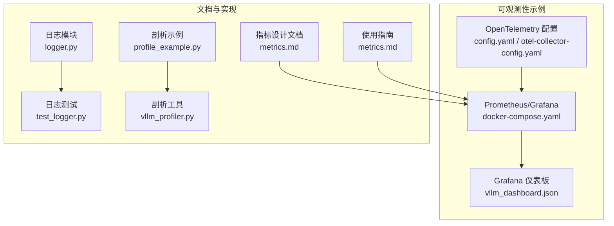
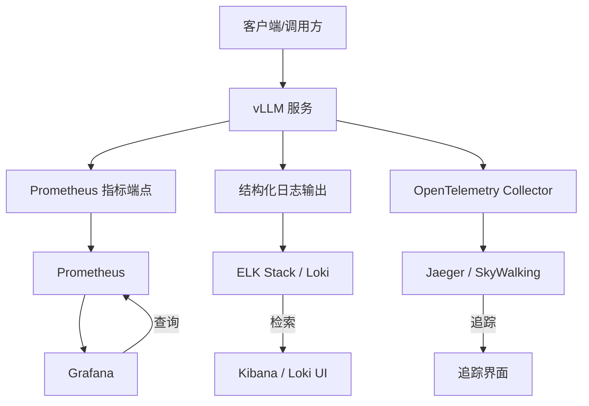
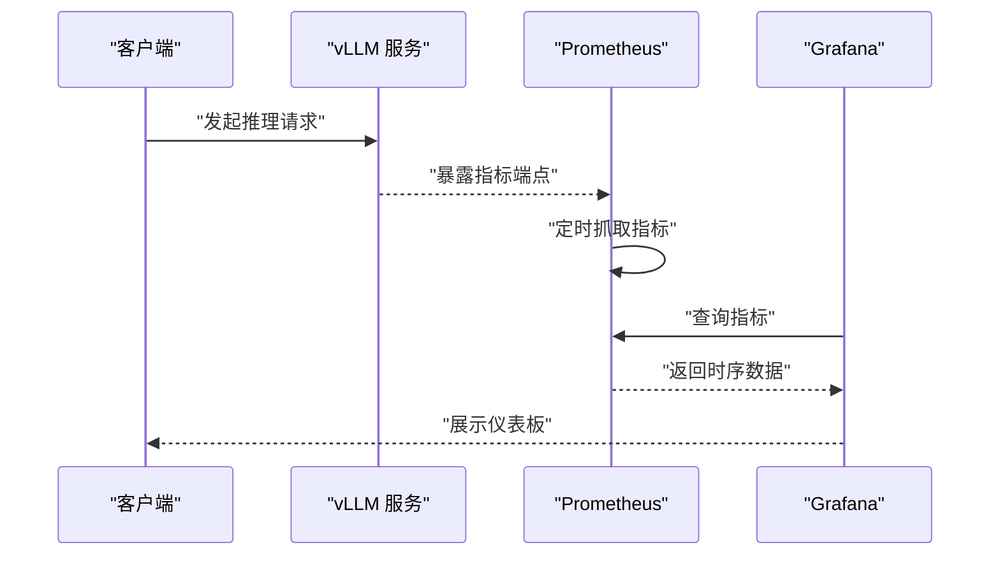
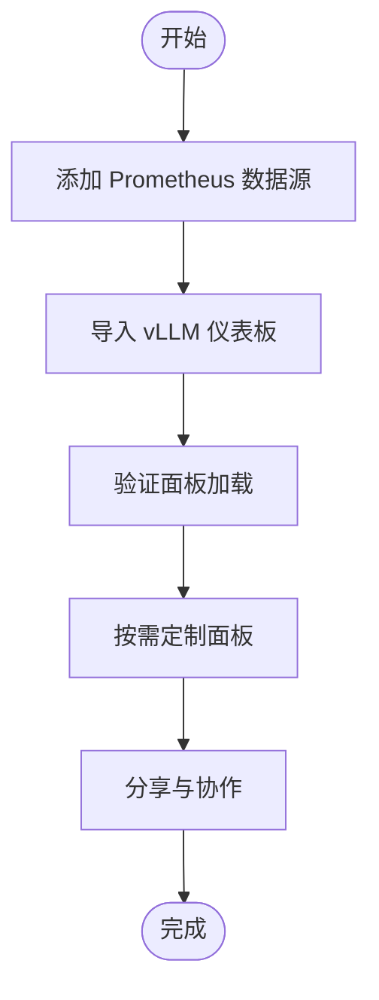
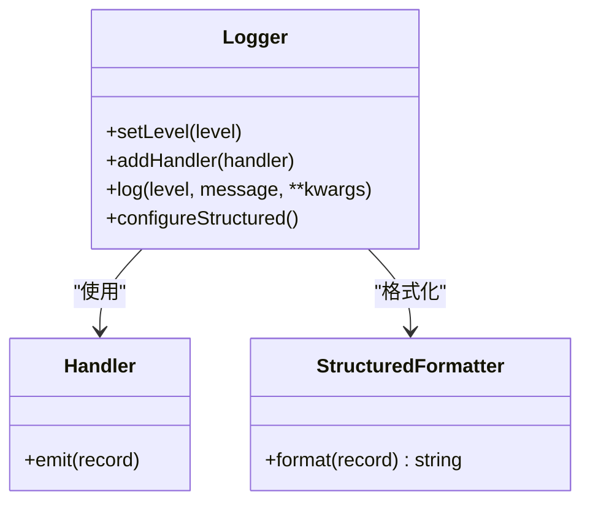
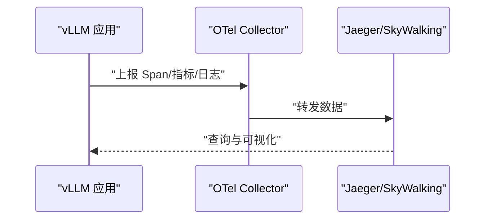
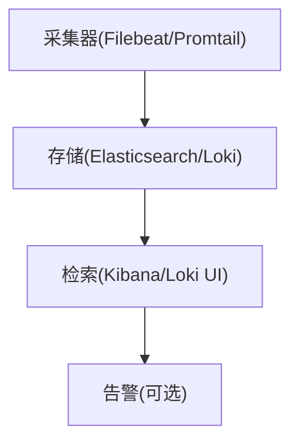
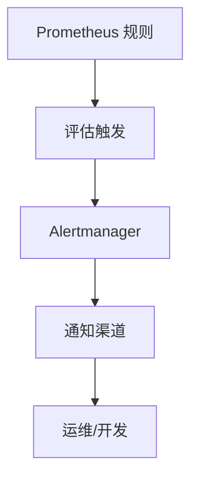
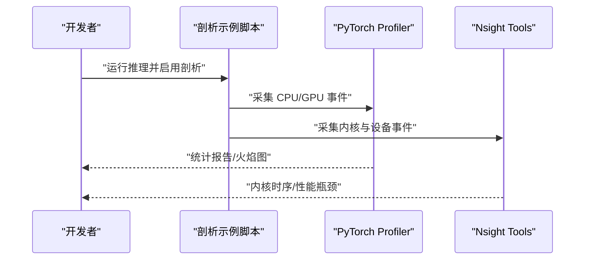
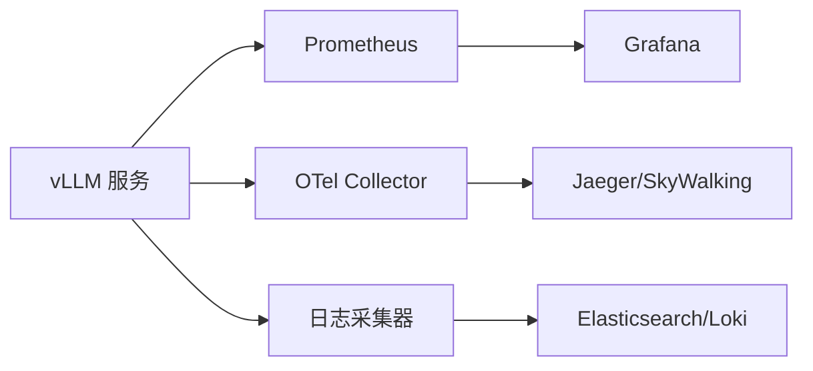

# 监控和日志配置

<cite>
**本文引用的文件**   
- [vllm/logger.py](file://vllm/logger.py)
- [examples/observability/prometheus_grafana/docker-compose.yaml](file://examples/observability/prometheus_grafana/docker-compose.yaml)
- [examples/observability/prometheus_grafana/grafana/dashboards/vllm_dashboard.json](file://examples/observability/prometheus_grafana/grafana/dashboards/vllm_dashboard.json)
- [examples/observability/metrics/metrics.md](file://examples/observability/metrics/metrics.md)
- [examples/observability/opentelemetry/config.yaml](file://examples/observability/opentelemetry/config.yaml)
- [examples/observability/opentelemetry/otel-collector-config.yaml](file://examples/observability/opentelemetry/otel-collector-config.yaml)
- [docs/design/metrics.md](file://docs/design/metrics.md)
- [docs/usage/metrics.md](file://docs/usage/metrics.md)
- [examples/features/profiling/profile_example.py](file://examples/features/profiling/profile_example.py)
- [tools/profiler/vllm_profiler.py](file://tools/profiler/vllm_profiler.py)
- [tests/test_logger.py](file://tests/test_logger.py)
</cite>

## 目录
1. [简介](#简介)
2. [项目结构](#项目结构)
3. [核心组件](#核心组件)
4. [架构总览](#架构总览)
5. [详细组件分析](#详细组件分析)
6. [依赖关系分析](#依赖关系分析)
7. [性能考虑](#性能考虑)
8. [故障排查指南](#故障排查指南)
9. [结论](#结论)
10. [附录](#附录)

## 简介
本指南面向在 vLLM 中搭建可观测性体系的用户，覆盖以下主题：
- Prometheus 指标的采集与导出（关键性能指标与业务指标）
- Grafana 仪表板的搭建与可视化配置
- 结构化日志的配置与格式规范
- APM 工具集成（Jaeger、SkyWalking 等）
- 日志收集与分析方案（ELK Stack、Loki）
- 告警规则设置与通知机制
- 性能剖析工具使用（PyTorch Profiler、NVIDIA Nsight）
- 故障诊断与方法论

## 项目结构
vLLM 的可观测性相关能力分布在示例与文档中，便于快速落地：
- 指标与仪表板：examples/observability/prometheus_grafana
- OpenTelemetry/APM：examples/observability/opentelemetry
- 指标说明文档：docs/design/metrics.md、docs/usage/metrics.md
- 日志与结构化日志：vllm/logger.py、tests/test_logger.py
- 性能剖析：examples/features/profiling、tools/profiler

图表来源
- [examples/observability/prometheus_grafana/docker-compose.yaml](file://examples/observability/prometheus_grafana/docker-compose.yaml)
- [examples/observability/prometheus_grafana/grafana/dashboards/vllm_dashboard.json](file://examples/observability/prometheus_grafana/grafana/dashboards/vllm_dashboard.json)
- [examples/observability/opentelemetry/config.yaml](file://examples/observability/opentelemetry/config.yaml)
- [examples/observability/opentelemetry/otel-collector-config.yaml](file://examples/observability/opentelemetry/otel-collector-config.yaml)
- [docs/design/metrics.md](file://docs/design/metrics.md)
- [docs/usage/metrics.md](file://docs/usage/metrics.md)
- [vllm/logger.py](file://vllm/logger.py)
- [tests/test_logger.py](file://tests/test_logger.py)
- [examples/features/profiling/profile_example.py](file://examples/features/profiling/profile_example.py)
- [tools/profiler/vllm_profiler.py](file://tools/profiler/vllm_profiler.py)

章节来源
- [examples/observability/prometheus_grafana/docker-compose.yaml](file://examples/observability/prometheus_grafana/docker-compose.yaml)
- [examples/observability/prometheus_grafana/grafana/dashboards/vllm_dashboard.json](file://examples/observability/prometheus_grafana/grafana/dashboards/vllm_dashboard.json)
- [examples/observability/opentelemetry/config.yaml](file://examples/observability/opentelemetry/config.yaml)
- [examples/observability/opentelemetry/otel-collector-config.yaml](file://examples/observability/opentelemetry/otel-collector-config.yaml)
- [docs/design/metrics.md](file://docs/design/metrics.md)
- [docs/usage/metrics.md](file://docs/usage/metrics.md)
- [vllm/logger.py](file://vllm/logger.py)
- [tests/test_logger.py](file://tests/test_logger.py)
- [examples/features/profiling/profile_example.py](file://examples/features/profiling/profile_example.py)
- [tools/profiler/vllm_profiler.py](file://tools/profiler/vllm_profiler.py)

## 核心组件
- 指标系统
  - 指标定义与导出：参考 metrics 设计与使用说明，了解指标命名、维度与导出端点。
  - Prometheus 抓取：通过 docker-compose 启动 Prometheus，并配置 vLLM 服务作为目标。
  - Grafana 仪表板：导入预置仪表板，快速观察吞吐、延迟、显存、队列长度等关键指标。
- 日志系统
  - 结构化日志：统一日志格式，包含时间戳、级别、模块、请求ID、上下文键值对等。
  - 日志输出：支持控制台与文件输出，便于后续接入 ELK/Loki。
- APM 与链路追踪
  - OpenTelemetry：通过配置文件启用 Tracing/Metrics/Logs 的自动或手动埋点，对接 Jaeger/SkyWalking。
- 性能剖析
  - PyTorch Profiler：基于示例脚本开启 CPU/GPU 剖析，生成火焰图与统计报告。
  - NVIDIA Nsight：结合 GPU 事件与 CUDA Graph 进行内核级剖析。

章节来源
- [docs/design/metrics.md](file://docs/design/metrics.md)
- [docs/usage/metrics.md](file://docs/usage/metrics.md)
- [examples/observability/prometheus_grafana/docker-compose.yaml](file://examples/observability/prometheus_grafana/docker-compose.yaml)
- [examples/observability/prometheus_grafana/grafana/dashboards/vllm_dashboard.json](file://examples/observability/prometheus_grafana/grafana/dashboards/vllm_dashboard.json)
- [vllm/logger.py](file://vllm/logger.py)
- [examples/observability/opentelemetry/config.yaml](file://examples/observability/opentelemetry/config.yaml)
- [examples/observability/opentelemetry/otel-collector-config.yaml](file://examples/observability/opentelemetry/otel-collector-config.yaml)
- [examples/features/profiling/profile_example.py](file://examples/features/profiling/profile_example.py)
- [tools/profiler/vllm_profiler.py](file://tools/profiler/vllm_profiler.py)

## 架构总览
下图展示了从 vLLM 服务到指标、日志、APM 的整体数据流与组件交互。

图表来源
- [examples/observability/prometheus_grafana/docker-compose.yaml](file://examples/observability/prometheus_grafana/docker-compose.yaml)
- [examples/observability/opentelemetry/otel-collector-config.yaml](file://examples/observability/opentelemetry/otel-collector-config.yaml)
- [examples/observability/opentelemetry/config.yaml](file://examples/observability/opentelemetry/config.yaml)
- [docs/usage/metrics.md](file://docs/usage/metrics.md)

## 详细组件分析

### Prometheus 指标采集与导出
- 指标范围
  - 关键性能指标：吞吐量、首字延迟、端到端延迟、GPU 利用率、显存占用、KV Cache 命中率、批大小、排队长度等。
  - 业务指标：请求成功率、错误码分布、模型版本、租户/路由标签等。
- 采集方式
  - vLLM 暴露指标端点，Prometheus 定期抓取。
  - 通过环境变量或配置开关控制指标粒度与采样频率。
- 配置要点
  - 在 docker-compose 中声明 Prometheus 与 vLLM 服务，确保网络互通与端口映射。
  - 在 Grafana 中添加 Prometheus 数据源并导入仪表板。

图表来源
- [examples/observability/prometheus_grafana/docker-compose.yaml](file://examples/observability/prometheus_grafana/docker-compose.yaml)
- [docs/usage/metrics.md](file://docs/usage/metrics.md)

章节来源
- [docs/design/metrics.md](file://docs/design/metrics.md)
- [docs/usage/metrics.md](file://docs/usage/metrics.md)
- [examples/observability/prometheus_grafana/docker-compose.yaml](file://examples/observability/prometheus_grafana/docker-compose.yaml)
- [examples/observability/prometheus_grafana/grafana/dashboards/vllm_dashboard.json](file://examples/observability/prometheus_grafana/grafana/dashboards/vllm_dashboard.json)

### Grafana 仪表板搭建与可视化
- 数据源配置
  - 添加 Prometheus 数据源，校验连通性与权限。
- 仪表板导入
  - 导入 vLLM 预置仪表板 JSON，查看关键指标面板。
- 自定义面板
  - 基于常用指标组合创建新面板，如“延迟分位 + 批大小 + GPU 利用率”。

图表来源
- [examples/observability/prometheus_grafana/grafana/dashboards/vllm_dashboard.json](file://examples/observability/prometheus_grafana/grafana/dashboards/vllm_dashboard.json)

章节来源
- [examples/observability/prometheus_grafana/grafana/dashboards/vllm_dashboard.json](file://examples/observability/prometheus_grafana/grafana/dashboards/vllm_dashboard.json)

### 结构化日志配置与格式规范
- 日志格式
  - 推荐 JSON 格式，包含字段：时间戳、级别、模块、消息、请求ID、上下文键值对。
- 配置项
  - 输出目标（控制台/文件）、日志级别、轮转策略、过滤规则。
- 最佳实践
  - 为每个请求注入唯一 ID，便于跨模块追踪。
  - 避免记录敏感信息，对日志进行脱敏处理。

图表来源
- [vllm/logger.py](file://vllm/logger.py)
- [tests/test_logger.py](file://tests/test_logger.py)

章节来源
- [vllm/logger.py](file://vllm/logger.py)
- [tests/test_logger.py](file://tests/test_logger.py)

### APM 工具集成（Jaeger、SkyWalking）
- OpenTelemetry 配置
  - 启用 Tracing、Metrics、Logs 的导出器，指定采样率与服务名。
  - 配置 Collector 转发至 Jaeger/SkyWalking。
- 链路追踪
  - 在服务入口与关键算子处插入 Span，关联请求ID。
- 指标与日志联动
  - 将 TraceID 写入日志，便于跨系统关联。

图表来源
- [examples/observability/opentelemetry/config.yaml](file://examples/observability/opentelemetry/config.yaml)
- [examples/observability/opentelemetry/otel-collector-config.yaml](file://examples/observability/opentelemetry/otel-collector-config.yaml)

章节来源
- [examples/observability/opentelemetry/config.yaml](file://examples/observability/opentelemetry/config.yaml)
- [examples/observability/opentelemetry/otel-collector-config.yaml](file://examples/observability/opentelemetry/otel-collector-config.yaml)

### 日志收集与分析（ELK Stack、Loki）
- ELK Stack
  - Filebeat/Fluentd 采集日志，Elasticsearch 存储，Kibana 检索与可视化。
  - 建议按服务与日期索引，设置保留策略与副本数。
- Loki
  - 轻量级日志聚合，适合 Kubernetes 环境。
  - 使用 Promtail 采集，Grafana 直接查询。
- 结构化日志解析
  - 在采集层解析 JSON 字段，建立索引以提升查询性能。

[此图为概念流程，不直接映射具体源码文件]

### 告警规则与通知机制
- 指标告警
  - 基于 Prometheus 规则文件定义阈值（如延迟 P99、错误率、显存不足）。
  - 使用 Alertmanager 进行去重、分组与通知（邮件、Webhook、企业微信等）。
- 日志告警
  - 在 ELK/Loki 中设置关键字匹配或异常模式告警。
- 告警收敛
  - 合并重复告警，避免告警风暴。

[此图为概念流程，不直接映射具体源码文件]

### 性能剖析工具使用（PyTorch Profiler、NVIDIA Nsight）
- PyTorch Profiler
  - 在推理过程中开启 CPU/GPU 剖析，生成统计报告与火焰图。
  - 关注热点算子、内存分配与同步开销。
- NVIDIA Nsight
  - 使用 Nsight Systems/Nsight Compute 分析 CUDA 内核执行与 GPU 资源利用。
  - 结合 CUDA Graph 减少调度开销。

图表来源
- [examples/features/profiling/profile_example.py](file://examples/features/profiling/profile_example.py)
- [tools/profiler/vllm_profiler.py](file://tools/profiler/vllm_profiler.py)

章节来源
- [examples/features/profiling/profile_example.py](file://examples/features/profiling/profile_example.py)
- [tools/profiler/vllm_profiler.py](file://tools/profiler/vllm_profiler.py)

## 依赖关系分析
- 组件耦合
  - vLLM 服务与 Prometheus 松耦合，通过 HTTP 端点暴露指标。
  - Grafana 仅依赖数据源，无侵入式集成。
  - OpenTelemetry Collector 作为中间件，解耦应用与后端 APM。
- 外部依赖
  - Prometheus、Grafana、Jaeger/SkyWalking、ELK/Loki 均为独立服务，可通过容器编排部署。

图表来源
- [examples/observability/prometheus_grafana/docker-compose.yaml](file://examples/observability/prometheus_grafana/docker-compose.yaml)
- [examples/observability/opentelemetry/otel-collector-config.yaml](file://examples/observability/opentelemetry/otel-collector-config.yaml)

章节来源
- [examples/observability/prometheus_grafana/docker-compose.yaml](file://examples/observability/prometheus_grafana/docker-compose.yaml)
- [examples/observability/opentelemetry/otel-collector-config.yaml](file://examples/observability/opentelemetry/otel-collector-config.yaml)

## 性能考虑
- 指标采样
  - 在高吞吐场景下合理设置采样率，避免过度采集导致性能下降。
- 日志落盘
  - 异步写入与批量提交，减少 I/O 阻塞；启用日志轮转与压缩。
- 追踪开销
  - 控制 Span 数量与采样率，避免长尾影响。
- 资源隔离
  - 将监控组件与推理服务分离部署，避免资源竞争。

[本节提供通用指导，无需特定文件引用]

## 故障排查指南
- 常见问题
  - 指标缺失：检查 vLLM 指标端点是否可达、Prometheus 抓取配置是否正确。
  - 日志丢失：确认采集器权限、路径映射与索引策略。
  - 追踪断裂：核对 TraceID 传递与采样率设置。
- 定位方法
  - 使用 Grafana 面板快速识别异常时段。
  - 在 ELK/Loki 中按请求ID检索完整上下文。
  - 通过 APM 追踪定位慢调用链。
- 恢复策略
  - 调整阈值与告警规则，避免误报。
  - 扩容与限流，缓解瞬时压力。

章节来源
- [tests/test_logger.py](file://tests/test_logger.py)
- [docs/usage/metrics.md](file://docs/usage/metrics.md)

## 结论
通过 Prometheus、Grafana、OpenTelemetry、ELK/Loki 与剖析工具的协同，可在 vLLM 中构建完整的可观测性体系。建议从基础指标与结构化日志起步，逐步引入 APM 与告警，持续优化采样与采集策略，保障高可用与高性能。

[本节为总结，无需特定文件引用]

## 附录
- 快速启动
  - 使用 examples/observability/prometheus_grafana/docker-compose.yaml 一键拉起 Prometheus 与 Grafana。
  - 导入 vllm_dashboard.json 快速查看仪表板。
- 扩展阅读
  - docs/design/metrics.md、docs/usage/metrics.md 深入了解指标设计与使用。
  - examples/observability/opentelemetry 下的配置文件用于 APM 集成。

[本节为补充信息，无需特定文件引用]