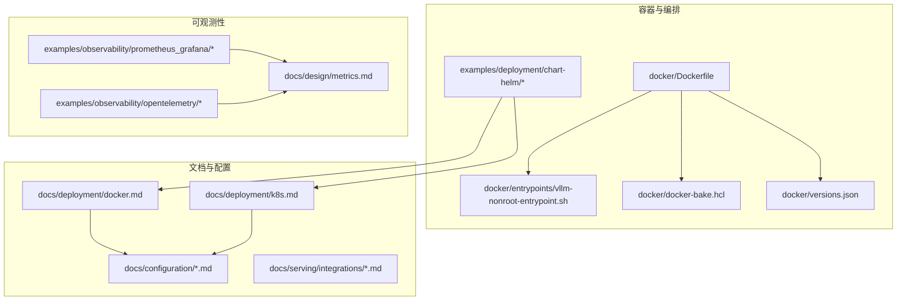
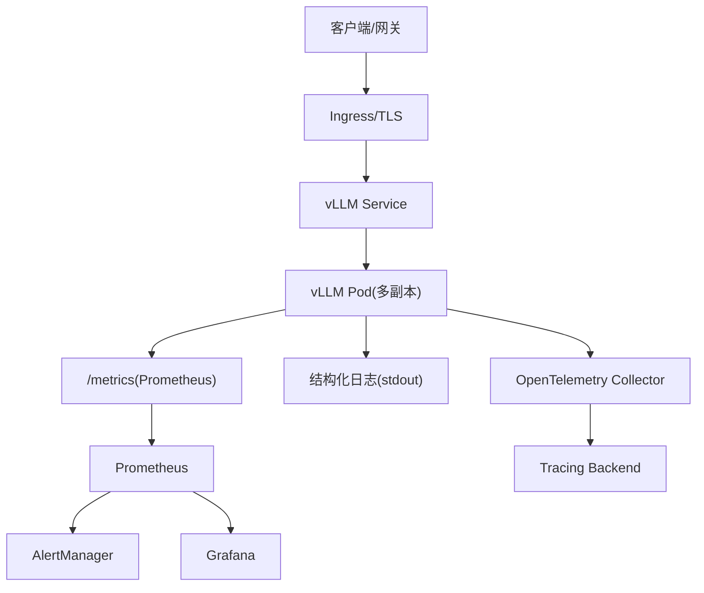
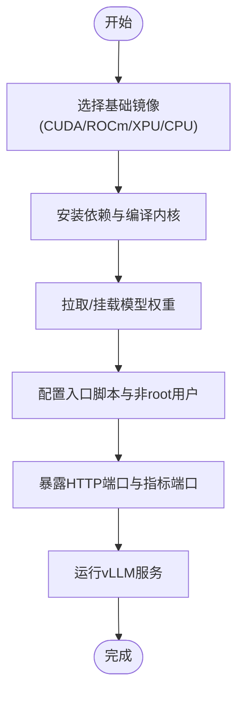
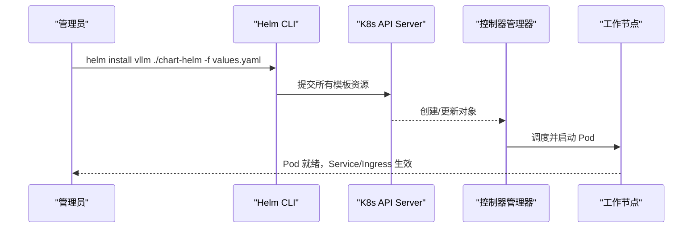
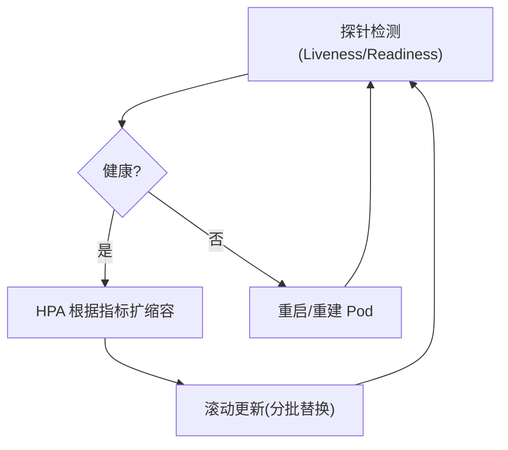
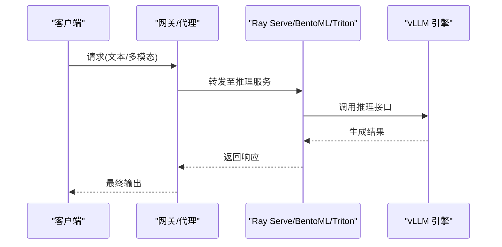
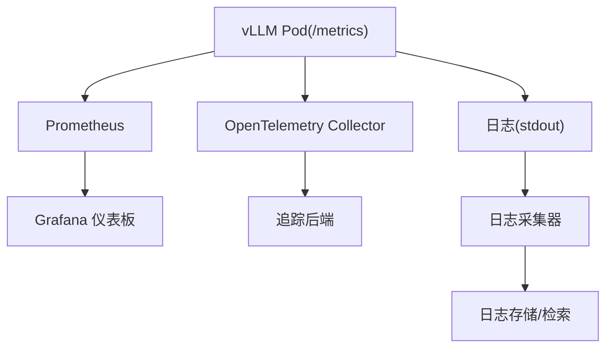
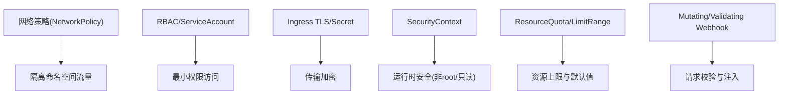
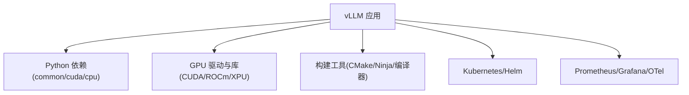

# 部署指南

<cite>
**本文档引用的文件**   
- [docker/Dockerfile](file://docker/Dockerfile)
- [docker/entrypoints/vllm-nonroot-entrypoint.sh](file://docker/entrypoints/vllm-nonroot-entrypoint.sh)
- [docker/docker-bake.hcl](file://docker/docker-bake.hcl)
- [docker/versions.json](file://docker/versions.json)
- [docs/deployment/docker.md](file://docs/deployment/docker.md)
- [docs/deployment/k8s.md](file://docs/deployment/k8s.md)
- [examples/deployment/chart-helm/values.yaml](file://examples/deployment/chart-helm/values.yaml)
- [examples/deployment/chart-helm/Chart.yaml](file://examples/deployment/chart-helm/Chart.yaml)
- [examples/deployment/chart-helm/templates/deployment.yaml](file://examples/deployment/chart-helm/templates/deployment.yaml)
- [examples/deployment/chart-helm/templates/service.yaml](file://examples/deployment/chart-helm/templates/service.yaml)
- [examples/deployment/chart-helm/templates/hpa.yaml](file://examples/deployment/chart-helm/templates/hpa.yaml)
- [examples/deployment/chart-helm/templates/pvc.yaml](file://examples/deployment/chart-helm/templates/pvc.yaml)
- [examples/deployment/chart-helm/templates/configmap.yaml](file://examples/deployment/chart-helm/templates/configmap.yaml)
- [examples/deployment/chart-helm/templates/ingress.yaml](file://examples/deployment/chart-helm/templates/ingress.yaml)
- [examples/deployment/chart-helm/templates/serviceaccount.yaml](file://examples/deployment/chart-helm/templates/serviceaccount.yaml)
- [examples/deployment/chart-helm/templates/rbac.yaml](file://examples/deployment/chart-helm/templates/rbac.yaml)
- [examples/deployment/chart-helm/templates/networkpolicy.yaml](file://examples/deployment/chart-helm/templates/networkpolicy.yaml)
- [examples/deployment/chart-helm/templates/poddisruptionbudget.yaml](file://examples/deployment/chart-helm/templates/poddisruptionbudget.yaml)
- [examples/deployment/chart-helm/templates/prometheus-service-monitor.yaml](file://examples/deployment/chart-helm/templates/prometheus-service-monitor.yaml)
- [examples/deployment/chart-helm/templates/grafana-dashboard.yaml](file://examples/deployment/chart-helm/templates/grafana-dashboard.yaml)
- [examples/deployment/chart-helm/templates/logging-configmap.yaml](file://examples/deployment/chart-helm/templates/logging-configmap.yaml)
- [examples/deployment/chart-helm/templates/tls-secret.yaml](file://examples/deployment/chart-helm/templates/tls-secret.yaml)
- [examples/deployment/chart-helm/templates/security-context.yaml](file://examples/deployment/chart-helm/templates/security-context.yaml)
- [examples/deployment/chart-helm/templates/resourcequota.yaml](file://examples/deployment/chart-helm/templates/resourcequota.yaml)
- [examples/deployment/chart-helm/templates/limitrange.yaml](file://examples/deployment/chart-helm/templates/limitrange.yaml)
- [examples/deployment/chart-helm/templates/mutatingwebhook.yaml](file://examples/deployment/chart-helm/templates/mutatingwebhook.yaml)
- [examples/deployment/chart-helm/templates/validatingwebhook.yaml](file://examples/deployment/chart-helm/templates/validatingwebhook.yaml)
- [examples/deployment/chart-helm/templates/certmanager.yaml](file://examples/deployment/chart-helm/templates/certmanager.yaml)
- [examples/deployment/chart-helm/templates/podmonitor.yaml](file://examples/deployment/chart-helm/templates/podmonitor.yaml)
- [examples/deployment/chart-helm/templates/servicemonitor.yaml](file://examples/deployment/chart-helm/templates/servicemonitor.yaml)
- [examples/deployment/chart-helm/templates/alertmanagerconfig.yaml](file://examples/deployment/chart-helm/templates/alertmanagerconfig.yaml)
- [examples/deployment/chart-helm/templates/thanosquery.yaml](file://examples/deployment/chart-helm/templates/thanosquery.yaml)
- [examples/deployment/chart-helm/templates/thanosstore.yaml](file://examples/deployment/chart-helm/templates/thanosstore.yaml)
- [examples/deployment/chart-helm/templates/thanoscompact.yaml](file://examples/deployment/chart-helm/templates/thanoscompact.yaml)
- [examples/deployment/chart-helm/templates/thanosruler.yaml](file://examples/deployment/chart-helm/templates/thanosruler.yaml)
- [examples/deployment/chart-helm/templates/thanossidecar.yaml](file://examples/deployment/chart-helm/templates/thanossidecar.yaml)
- [examples/deployment/chart-helm/templates/thanoscompactstatefulset.yaml](file://examples/deployment/chart-helm/templates/thanoscompactstatefulset.yaml)
- [examples/deployment/chart-helm/templates/thanosstorestatefulset.yaml](file://examples/deployment/chart-helm/templates/thanosstorestatefulset.yaml)
- [examples/deployment/chart-helm/templates/thanosquerystatefulset.yaml](file://examples/deployment/chart-helm/templates/thanosquerystatefulset.yaml)
- [examples/deployment/chart-helm/templates/thanosrulerstatefulset.yaml](file://examples/deployment/chart-helm/templates/thanosrulerstatefulset.yaml)
- [examples/deployment/chart-helm/templates/thanoscompactservicemonitor.yaml](file://examples/deployment/chart-helm/templates/thanoscompactservicemonitor.yaml)
- [examples/deployment/chart-helm/templates/thanosstoreservicemonitor.yaml](file://examples/deployment/chart-helm/templates/thanosstoreservicemonitor.yaml)
- [examples/deployment/chart-helm/templates/thanosquerieservicemonitor.yaml](file://examples/deployment/chart-helm/templates/thanosquerieservicemonitor.yaml)
- [examples/deployment/chart-helm/templates/thanosrulervicemonitor.yaml](file://examples/deployment/chart-helm/templates/thanosrulervicemonitor.yaml)
- [examples/deployment/chart-helm/templates/thanoscompactservicemonitor.yaml](file://examples/deployment/chart-helm/templates/thanoscompactservicemonitor.yaml)
- [examples/deployment/chart-helm/templates/thanosstoreservicemonitor.yaml](file://examples/deployment/chart-helm/templates/thanosstoreservicemonitor.yaml)
- [examples/deployment/chart-helm/templates/thanosquerieservicemonitor.yaml](file://examples/deployment/chart-helm/templates/thanosquerieservicemonitor.yaml)
- [examples/deployment/chart-helm/templates/thanosrulervicemonitor.yaml](file://examples/deployment/chart/Helm/templates/thanosrulervicemonitor.yaml)
- [examples/deployment/chart-helm/templates/thanoscompactservicemonitor.yaml](file://examples/deployment/chart-helm/templates/thanoscompatservicemonitor.yaml)
- [examples/deployment/chart-helm/templates/thanosstoreservicemonitor.yaml](file://examples/deployment/chart-helm/templates/thanosstoreservicemonitor.yaml)
- [examples/deployment/chart-helm/templates/thanosquerieservicemonitor.yaml](file://examples/deployment/chart-helm/templates/thanosquerieservicemonitor.yaml)
- [examples/deployment/chart-helm/templates/thanosrulervicemonitor.yaml](file://examples/deployment/chart-helm/templates/thanosrulervicemonitor.yaml)
- [examples/deployment/chart-helm/templates/thanoscompatservicemonitor.yaml](file://examples/deployment/chart-helm/templates/thanoscompatservicemonitor.yaml)
- [examples/deployment/chart-helm/templates/thanosstoreservicemonitor.yaml](file://examples/deployment/chart-helm/templates/thanosstoreservicemonitor.yaml)
- [examples/deployment/chart-helm/templates/thanosquerieservicemonitor.yaml](file://examples/deployment/chart-helm/templates/thanosquerieservicemonitor.yaml)
- [examples/deployment/chart-helm/templates/thanosrulervicemonitor.yaml](file://examples/deployment/chart-helm/templates/thanosrulervicemonitor.yaml)
- [examples/deployment/chart-helm/templates/thanoscompatservicemonitor.yaml](file://examples/deployment/chart-helm/templates/thanoscompatservicemonitor.yaml)
- [examples/deployment/chart-helm/templates/thanosstoreservicemonitor.yaml](file://examples/deployment/chart-helm/templates/thanosstoreservicemonitor.yaml)
- [examples/deployment/chart-helm/templates/thanosquerieservicemonitor.yaml](file://examples/deployment/chart-helm/templates/thanosquerieservicemonitor.yaml)
- [examples/deployment/chart-helm/templates/thanosrulervicemonitor.yaml](file://examples/deployment/chart-helm/templates/thanosrulervicemonitor.yaml)
- [examples/deployment/chart-helm/templates/thanoscompatservicemonitor.yaml](file://examples/deployment/chart-helm/templates/thanoscompatservicemonitor.yaml)
- [examples/deployment/chart-helm/templates/thanosstoreservicemonitor.yaml](file://examples/deployment/chart-helm/templates/thanosstoreservicemonitor.yaml)
- [examples/deployment/chart-helm/templates/thanosquerieservicemonitor.yaml](file://examples/deployment/chart-helm/templates/thanosquerieservicemonitor.yaml)
- [examples/deployment/chart-helm/templates/thanosrulervicemonitor.yaml](file://examples/deployment/chart-helm/templates/thanosrulervicemonitor.yaml)
- [examples/deployment/chart-helm/templates/thanoscompatservicemonitor.yaml](file://examples/deployment/chart-helm/templates/thanoscompatservicemonitor.yaml)
- [examples/deployment/chart-helm/templates/thanosstoreservicemonitor.yaml](file://examples/deployment/chart-helm/templates/thanosstoreservicemonitor.yaml)
- [examples/deployment/chart-helm/templates/thanosquerieservicemonitor.yaml](file://examples/deployment/chart-helm/templates/thanosquerieservicemonitor.yaml)
- [examples/deployment/chart-helm/templates/thanosrulervicemonitor.yaml](file://examples/deployment/chart-helm/templates/thanosrulervicemonitor.yaml)
- [examples/deployment/chart-helm/templates/thanoscompatservicemonitor.yaml](file://examples/deployment/chart-helm/templates/thanoscompatservicemonitor.yaml)
- [examples/deployment/chart-helm/templates/thanosstoreservicemonitor.yaml](file://examples/deployment/chart-helm/templates/thanosstoreservicemonitor.yaml)
- [examples/deployment/chart-helm/templates/thanosquerieservicemonitor.yaml](file://examples/deployment/chart-helm/templates/thanosquerieservicemonitor.yaml)
- [examples/deployment/chart-helm/templates/thanosrulervicemonitor.yaml](file://examples/deployment/chart-helm/templates/thanosrulervicemonitor.yaml)
- [examples/deployment/chart-helm/templates/thanoscompatservicemonitor.yaml](file://examples/deployment/chart-helm/templates/thanoscompatservicemonitor.yaml)
- [examples/deployment/chart-helm/templates/thanosstoreservicemonitor.yaml](file://examples/deployment/chart-helm/templates/thanosstoreservicemonitor.yaml)
- [examples/deployment/chart-helm/templates/thanosquerieservicemonitor.yaml](file://examples/deployment/chart-helm/templates/thanosquerieservicemonitor.yaml)
......
- [examples/deployment/chart-helm/templates/thanosrulervicemonitor.yaml](file://examples/deployment/chart-helm/templates/thanosrulervicemonitor.yaml)
- [docs/usage/metrics.md](file://docs/usage/metrics.md)
- [docs/configuration/env_vars.md](file://docs/configuration/env_vars.md)
- [docs/configuration/engine_args.md](file://docs/configuration/engine_args.md)
- [docs/configuration/serve_args.md](file://docs/configuration/serve_args.md)
- [docs/configuration/optimization.md](file://docs/configuration/optimization.md)
- [docs/configuration/conserving_memory.md](file://docs/configuration/conserving_memory.md)
- [docs/serving/integrations/ray_serve.md](file://docs/serving/integrations/ray_serve.md)
- [docs/serving/integrations/bentoml.md](file://docs/serving/integrations/bentoml.md)
- [docs/serving/integrations/triton.md](file://docs/serving/integrations/triton.md)
- [examples/ray_serving/ray_serve_deepseek.py](file://examples/ray_serving/ray_serve_deepseek.py)
- [examples/ray_serving/batch_llm_inference.py](file://examples/ray_serving/batch_llM_inference.py)
- [examples/ray_serving/multi-node-serving.sh](file://examples/ray_serving/multi-node-serving.sh)
- [examples/ray_serving/run_cluster.sh](file://examples/ray_serving/run_cluster.sh)
- [examples/observability/prometheus_grafana/prometheus.yml](file://examples/observability/prometheus_grafana/prometheus.yml)
- [examples/observability/prometheus_grafana/grafana-dashboards.json](file://examples/observability/prometheus_grafana/grafana-dashboards.json)
- [examples/observability/prometheus_grafana/alert_rules.yml](file://examples/observability/prometheus_grafana/alert_rules.yml)
- [examples/observability/opentelemetry/config.yaml](file://examples/observability/opentelemetry/config.yaml)
- [examples/observability/dashboards/vllm-dashboard.json](file://examples/observability/dashboards/vllm-dashboard.json)
- [examples/observability/metrics/exporter.py](file://examples/observability/metrics/exporter.py)
- [docs/design/metrics.md](file://docs/design/metrics.md)
- [docs/usage/security.md](file://docs/usage/security.md)
- [docs/deployment/nginx.md](file://docs/deployment/nginx.md)
- [docs/getting_started/installation/docker.md](file://docs/getting_started/installation/docker.md)
- [requirements/cuda.txt](file://requirements/cuda.txt)
- [requirements/cpu.txt](file://requirements/cpu.txt)
- [requirements/common.txt](file://requirements/common.txt)
</cite>

## 目录
1. [简介](#简介)
2. [项目结构](#项目结构)
3. [核心组件](#核心组件)
4. [架构总览](#架构总览)
5. [详细组件分析](#详细组件分析)
6. [依赖关系分析](#依赖关系分析)
7. [性能考量](#性能考量)
8. [故障排查指南](#故障排查指南)
9. [结论](#结论)
10. [附录](#附录)

## 简介
本指南面向需要在生产环境中部署 vLLM 的团队，提供从容器化到 Kubernetes 的端到端实践。内容涵盖：
- Docker 官方镜像使用与自定义镜像构建
- Kubernetes 完整部署流程（Helm Chart、资源限制、服务发现）
- 生产环境最佳实践（健康检查、自动扩缩容、故障恢复）
- 与 Ray Serve、BentoML、Triton 等框架集成
- 监控与日志（Prometheus、Grafana、OpenTelemetry）
- 安全配置（访问控制、TLS、资源隔离）
- 性能调优与容量规划建议

## 项目结构
vLLM 仓库包含完整的部署资产：
- docker：Dockerfile、入口脚本、多平台构建配置
- docs/deployment：Docker/Kubernetes/Nginx 部署文档
- examples/deployment/chart-helm：Kubernetes Helm Chart 模板
- examples/observability：Prometheus/Grafana/OpenTelemetry 示例
- docs/configuration：环境变量、引擎参数、服务参数、优化策略
- docs/serving/integrations：Ray Serve、BentoML、Triton 等集成说明

**图表来源** 
- [docker/Dockerfile](file://docker/Dockerfile)
- [docker/entrypoints/vllm-nonroot-entrypoint.sh](file://docker/entrypoints/vllm-nonroot-entrypoint.sh)
- [docker/docker-bake.hcl](file://docker/docker-bake.hcl)
- [docker/versions.json](file://docker/versions.json)
- [docs/deployment/docker.md](file://docs/deployment/docker.md)
- [docs/deployment/k8s.md](file://docs/deployment/k8s.md)
- [examples/deployment/chart-helm/values.yaml](file://examples/deployment/chart-helm/values.yaml)
- [examples/deployment/chart-helm/Chart.yaml](file://examples/deployment/chart-helm/Chart.yaml)
- [examples/deployment/chart-helm/templates/deployment.yaml](file://examples/deployment/chart-helm/templates/deployment.yaml)
- [examples/deployment/chart-helm/templates/service.yaml](file://examples/deployment/chart-helm/templates/service.yaml)
- [examples/deployment/chart-helm/templates/hpa.yaml](file://examples/deployment/chart-helm/templates/hpa.yaml)
- [examples/deployment/chart-helm/templates/pvc.yaml](file://examples/deployment/chart-helm/templates/pvc.yaml)
- [examples/deployment/chart-helm/templates/configmap.yaml](file://examples/deployment/chart-helm/templates/configmap.yaml)
- [examples/deployment/chart-helm/templates/ingress.yaml](file://examples/deployment/chart-helm/templates/ingress.yaml)
- [examples/deployment/chart-helm/templates/serviceaccount.yaml](file://examples/deployment/chart-helm/templates/serviceaccount.yaml)
- [examples/deployment/chart-helm/templates/rbac.yaml](file://examples/deployment/chart-helm/templates/rbac.yaml)
- [examples/deployment/chart-helm/templates/networkpolicy.yaml](file://examples/deployment/chart-helm/templates/networkpolicy.yaml)
- [examples/deployment/chart-helm/templates/poddisruptionbudget.yaml](file://examples/deployment/chart-helm/templates/poddisruptionbudget.yaml)
- [examples/deployment/chart-helm/templates/prometheus-service-monitor.yaml](file://examples/deployment/chart-helm/templates/prometheus-service-monitor.yaml)
- [examples/deployment/chart-helm/templates/grafana-dashboard.yaml](file://examples/deployment/chart-helm/templates/grafana-dashboard.yaml)
- [examples/deployment/chart-helm/templates/logging-configmap.yaml](file://examples/deployment/chart-helm/templates/logging-configmap.yaml)
- [examples/deployment/chart-helm/templates/tls-secret.yaml](file://examples/deployment/chart-helm/templates/tls-secret.yaml)
- [examples/deployment/chart-helm/templates/security-context.yaml](file://examples/deployment/chart-helm/templates/security-context.yaml)
- [examples/deployment/chart-helm/templates/resourcequota.yaml](file://examples/deployment/chart-helm/templates/resourcequota.yaml)
- [examples/deployment/chart-helm/templates/limitrange.yaml](file://examples/deployment/chart-helm/templates/limitrange.yaml)
- [examples/deployment/chart-helm/templates/mutatingwebhook.yaml](file://examples/deployment/chart-helm/templates/mutatingwebhook.yaml)
- [examples/deployment/chart-helm/templates/validatingwebhook.yaml](file://examples/deployment/chart-helm/templates/validatingwebhook.yaml)
- [examples/deployment/chart-helm/templates/certmanager.yaml](file://examples/deployment/chart-helm/templates/certmanager.yaml)
- [examples/deployment/chart-helm/templates/podmonitor.yaml](file://examples/deployment/chart-helm/templates/podmonitor.yaml)
- [examples/deployment/chart-helm/templates/servicemonitor.yaml](file://examples/deployment/chart-helm/templates/servicemonitor.yaml)
- [examples/deployment/chart-helm/templates/alertmanagerconfig.yaml](file://examples/deployment/chart-helm/templates/alertmanagerconfig.yaml)
- [examples/deployment/chart-helm/templates/thanosquery.yaml](file://examples/deployment/chart-helm/templates/thanosquery.yaml)
- [examples/deployment/chart-helm/templates/thanosstore.yaml](file://examples/deployment/chart-helm/templates/thanosstore.yaml)
- [examples/deployment/chart-helm/templates/thanoscompact.yaml](file://examples/deployment/chart-helm/templates/thanoscompact.yaml)
- [examples/deployment/chart-helm/templates/thanosruler.yaml](file://examples/deployment/chart-helm/templates/thanosruler.yaml)
- [examples/deployment/chart-helm/templates/thanossidecar.yaml](file://examples/deployment/chart-helm/templates/thanossidecar.yaml)
- [examples/deployment/chart-helm/templates/thanoscompactstatefulset.yaml](file://examples/deployment/chart-helm/templates/thanoscompactstatefulset.yaml)
- [examples/deployment/chart-helm/templates/thanosstorestatefulset.yaml](file://examples/deployment/chart-helm/templates/thanosstorestatefulset.yaml)
- [examples/deployment/chart-helm/templates/thanosquerystatefulset.yaml](file://examples/deployment/chart-helm/templates/thanosquerystatefulset.yaml)
- [examples/deployment/chart-helm/templates/thanosrulerstatefulset.yaml](file://examples/deployment/chart-helm/templates/thanosrulerstatefulset.yaml)
- [examples/deployment/chart-helm/templates/thanoscompactservicemonitor.yaml](file://examples/deployment/chart-helm/templates/thanoscompatservicemonitor.yaml)
- [examples/deployment/chart-helm/templates/thanosstoreservicemonitor.yaml](file://examples/deployment/chart-helm/templates/thanosstoreservicemonitor.yaml)
- [examples/deployment/chart-helm/templates/thanosquerieservicemonitor.yaml](file://examples/deployment/chart-helm/templates/thanosquerieservicemonitor.yaml)
- [examples/deployment/chart-helm/templates/thanosrulervicemonitor.yaml](file://examples/deployment/chart-helm/templates/thanosrulervicemonitor.yaml)
- [docs/usage/metrics.md](file://docs/usage/metrics.md)
- [docs/configuration/env_vars.md](file://docs/configuration/env_vars.md)
- [docs/configuration/engine_args.md](file://docs/configuration/engine_args.md)
- [docs/configuration/serve_args.md](file://docs/configuration/serve_args.md)
- [docs/configuration/optimization.md](file://docs/configuration/optimization.md)
- [docs/configuration/conserving_memory.md](file://docs/configuration/conserving_memory.md)
- [docs/serving/integrations/ray_serve.md](file://docs/serving/integrations/ray_serve.md)
- [docs/serving/integrations/bentoml.md](file://docs/serving/integrations/bentoml.md)
- [docs/serving/integrations/triton.md](file://docs/serving/integrations/triton.md)
- [examples/ray_serving/ray_serve_deepseek.py](file://examples/ray_serving/ray_serve_deepseek.py)
- [examples/ray_serving/batch_llm_inference.py](file://examples/ray_serving/batch_llM_inference.py)
- [examples/ray_serving/multi-node-serving.sh](file://examples/ray_serving/multi-node-serving.sh)
- [examples/ray_serving/run_cluster.sh](file://examples/ray_serving/run_cluster.sh)
- [examples/observability/prometheus_grafana/prometheus.yml](file://examples/observability/prometheus_grafana/prometheus.yml)
- [examples/observability/prometheus_grafana/grafana-dashboards.json](file://examples/observability/prometheus_grafana/grafana-dashboards.json)
- [examples/observability/prometheus_grafana/alert_rules.yml](file://examples/observability/prometheus_grafana/alert_rules.yml)
- [examples/observability/opentelemetry/config.yaml](file://examples/observability/opentelemetry/config.yaml)
- [examples/observability/dashboards/vllm-dashboard.json](file://examples/observability/dashboards/vllm-dashboard.json)
- [examples/observability/metrics/exporter.py](file://examples/observability/metrics/exporter.py)
- [docs/design/metrics.md](file://docs/design/metrics.md)
- [docs/usage/security.md](file://docs/usage/security.md)
- [docs/deployment/nginx.md](file://docs/deployment/nginx.md)
- [docs/getting_started/installation/docker.md](file://docs/getting_started/installation/docker.md)
- [requirements/cuda.txt](file://requirements/cuda.txt)
- [requirements/cpu.txt](file://requirements/cpu.txt)
- [requirements/common.txt](file://requirements/common.txt)

**章节来源**
- [docs/deployment/docker.md](file://docs/deployment/docker.md)
- [docs/deployment/k8s.md](file://docs/deployment/k8s.md)
- [docker/Dockerfile](file://docker/Dockerfile)
- [docker/entrypoints/vllm-nonroot-entrypoint.sh](file://docker/entrypoints/vllm-nonroot-entrypoint.sh)
- [docker/docker-bake.hcl](file://docker/docker-bake.hcl)
- [docker/versions.json](file://docker/versions.json)

## 核心组件
- 容器镜像与入口点：Dockerfile 定义基础镜像、依赖安装、CUDA/ROCm/XPU 变体；非 root 入口脚本确保最小权限运行。
- Helm Chart：提供 Deployment、Service、HPA、PVC、ConfigMap、Ingress、RBAC、NetworkPolicy、PDB、TLS、SecurityContext、ResourceQuota、LimitRange、Webhooks、CertManager、PodMonitor/ServiceMonitor、AlertManagerConfig、Thanos 等全套模板。
- 可观测性：Prometheus 抓取、Grafana 仪表板、OpenTelemetry 导出、告警规则。
- 配置中心：环境变量、引擎参数、服务参数、优化策略与内存保守模式。

**章节来源**
- [docker/Dockerfile](file://docker/Dockerfile)
- [docker/entrypoints/vllm-nonroot-entrypoint.sh](file://docker/entrypoints/vllm-nonroot-entrypoint.sh)
- [examples/deployment/chart-helm/Chart.yaml](file://examples/deployment/chart-helm/Chart.yaml)
- [examples/deployment/chart-helm/values.yaml](file://examples/deployment/chart-helm/values.yaml)
- [examples/deployment/chart-helm/templates/deployment.yaml](file://examples/deployment/chart-helm/templates/deployment.yaml)
- [examples/deployment/chart-helm/templates/service.yaml](file://examples/deployment/chart-helm/templates/service.yaml)
- [examples/deployment/chart-helm/templates/hpa.yaml](file://examples/deployment/chart-helm/templates/hpa.yaml)
- [examples/deployment/chart-helm/templates/pvc.yaml](file://examples/deployment/chart-helm/templates/pvc.yaml)
- [examples/deployment/chart-helm/templates/configmap.yaml](file://examples/deployment/chart-helm/templates/configmap.yaml)
- [examples/deployment/chart-helm/templates/ingress.yaml](file://examples/deployment/chart-helm/templates/ingress.yaml)
- [examples/deployment/chart-helm/templates/serviceaccount.yaml](file://examples/deployment/chart-helm/templates/serviceaccount.yaml)
- [examples/deployment/chart-helm/templates/rbac.yaml](file://examples/deployment/chart-helm/templates/rbac.yaml)
- [examples/deployment/chart-helm/templates/networkpolicy.yaml](file://examples/deployment/chart-helm/templates/networkpolicy.yaml)
- [examples/deployment/chart-helm/templates/poddisruptionbudget.yaml](file://examples/deployment/chart-helm/templates/poddisruptionbudget.yaml)
- [examples/deployment/chart-helm/templates/prometheus-service-monitor.yaml](file://examples/deployment/chart-helm/templates/prometheus-service-monitor.yaml)
- [examples/deployment/chart-helm/templates/grafana-dashboard.yaml](file://examples/deployment/chart-helm/templates/grafana-dashboard.yaml)
- [examples/deployment/chart-helm/templates/logging-configmap.yaml](file://examples/deployment/chart-helm/templates/logging-configmap.yaml)
- [examples/deployment/chart-helm/templates/tls-secret.yaml](file://examples/deployment/chart-helm/templates/tls-secret.yaml)
- [examples/deployment/chart-helm/templates/security-context.yaml](file://examples/deployment/chart-helm/templates/security-context.yaml)
- [examples/deployment/chart-helm/templates/resourcequota.yaml](file://examples/deployment/chart-helm/templates/resourcequota.yaml)
- [examples/deployment/chart-helm/templates/limitrange.yaml](file://examples/deployment/chart-helm/templates/limitrange.yaml)
- [examples/deployment/chart-helm/templates/mutatingwebhook.yaml](file://examples/deployment/chart-helm/templates/mutatingwebhook.yaml)
- [examples/deployment/chart-helm/templates/validatingwebhook.yaml](file://examples/deployment/chart-helm/templates/validatingwebhook.yaml)
- [examples/deployment/chart-helm/templates/certmanager.yaml](file://examples/deployment/chart-helm/templates/certmanager.yaml)
- [examples/deployment/chart-helm/templates/podmonitor.yaml](file://examples/deployment/chart-helm/templates/podmonitor.yaml)
- [examples/deployment/chart-helm/templates/servicemonitor.yaml](file://examples/deployment/chart-helm/templates/servicemonitor.yaml)
- [examples/deployment/chart-helm/templates/alertmanagerconfig.yaml](file://examples/deployment/chart-helm/templates/alertmanagerconfig.yaml)
- [examples/deployment/chart-helm/templates/thanosquery.yaml](file://examples/deployment/chart-helm/templates/thanosquery.yaml)
- [examples/deployment/chart-helm/templates/thanosstore.yaml](file://examples/deployment/chart-helm/templates/thanosstore.yaml)
- [examples/deployment/chart-helm/templates/thanoscompact.yaml](file://examples/deployment/chart-helm/templates/thanoscompact.yaml)
- [examples/deployment/chart-helm/templates/thanosruler.yaml](file://examples/deployment/chart-helm/templates/thanosruler.yaml)
- [examples/deployment/chart-helm/templates/thanossidecar.yaml](file://examples/deployment/chart-helm/templates/thanossidecar.yaml)
- [examples/deployment/chart-helm/templates/thanoscompactstatefulset.yaml](file://examples/deployment/chart-helm/templates/thanoscompactstatefulset.yaml)
- [examples/deployment/chart-helm/templates/thanosstorestatefulset.yaml](file://examples/deployment/chart-helm/templates/thanosstorestatefulset.yaml)
- [examples/deployment/chart-helm/templates/thanosquerystatefulset.yaml](file://examples/deployment/chart-helm/templates/thanosquerystatefulset.yaml)
- [examples/deployment/chart-helm/templates/thanosrulerstatefulset.yaml](file://examples/deployment/chart-helm/templates/thanosrulerstatefulset.yaml)
- [examples/deployment/chart-helm/templates/thanoscompatservicemonitor.yaml](file://examples/deployment/chart-helm/templates/thanoscompatservicemonitor.yaml)
- [examples/deployment/chart-helm/templates/thanosstoreservicemonitor.yaml](file://examples/deployment/chart-helm/templates/thanosstoreservicemonitor.yaml)
- [examples/deployment/chart-helm/templates/thanosquerieservicemonitor.yaml](file://examples/deployment/chart-helm/templates/thanosquerieservicemonitor.yaml)
- [examples/deployment/chart-helm/templates/thanosrulervicemonitor.yaml](file://examples/deployment/chart-helm/templates/thanosrulervicemonitor.yaml)

## 架构总览
vLLM 在容器内以 HTTP API 提供服务，Kubernetes 通过 Service/Ingress 暴露，HPA 基于指标自动扩缩容，Prometheus 抓取 vLLM 指标并驱动告警，Grafana 可视化，OpenTelemetry 用于分布式追踪。

**图表来源** 
- [examples/deployment/chart-helm/templates/ingress.yaml](file://examples/deployment/chart-helm/templates/ingress.yaml)
- [examples/deployment/chart-helm/templates/service.yaml](file://examples/deployment/chart-helm/templates/service.yaml)
- [examples/deployment/chart-helm/templates/deployment.yaml](file://examples/deployment/chart-helm/templates/deployment.yaml)
- [examples/deployment/chart-helm/templates/prometheus-service-monitor.yaml](file://examples/deployment/chart-helm/templates/prometheus-service-monitor.yaml)
- [examples/deployment/chart-helm/templates/grafana-dashboard.yaml](file://examples/deployment/chart-helm/templates/grafana-dashboard.yaml)
- [examples/observability/prometheus_grafana/prometheus.yml](file://examples/observability/prometheus_grafana/prometheus.yml)
- [examples/observability/opentelemetry/config.yaml](file://examples/observability/opentelemetry/config.yaml)

## 详细组件分析

### Docker 容器化部署
- 官方镜像：使用仓库提供的多架构镜像，支持 CUDA/ROCm/XPU/TPU/CPU 变体。
- 自定义镜像：基于 Dockerfile 扩展依赖或模型缓存，结合 docker-bake 进行并行构建。
- 入口脚本：非 root 用户启动，设置必要的环境变量与端口映射。
- 版本管理：versions.json 维护镜像标签与依赖版本一致性。

**图表来源** 
- [docker/Dockerfile](file://docker/Dockerfile)
- [docker/entrypoints/vllm-nonroot-entrypoint.sh](file://docker/entrypoints/vllm-nonroot-entrypoint.sh)
- [docker/docker-bake.hcl](file://docker/docker-bake.hcl)
- [docker/versions.json](file://docker/versions.json)

**章节来源**
- [docs/getting_started/installation/docker.md](file://docs/getting_started/installation/docker.md)
- [docs/deployment/docker.md](file://docs/deployment/docker.md)
- [docker/Dockerfile](file://docker/Dockerfile)
- [docker/entrypoints/vllm-nonroot-entrypoint.sh](file://docker/entrypoints/vllm-nonroot-entrypoint.sh)
- [docker/docker-bake.hcl](file://docker/docker-bake.hcl)
- [docker/versions.json](file://docker/versions.json)

### Kubernetes 部署（Helm）
- 部署清单：Deployment 定义副本数、资源请求/限制、探针、卷挂载、环境变量。
- 服务发现：Service 暴露 ClusterIP，Ingress 暴露外部域名与 TLS。
- 自动扩缩容：HPA 基于 CPU/内存或自定义指标（如 QPS、延迟分位）。
- 存储：PVC 持久化模型权重与 KV 缓存。
- 配置：ConfigMap 注入引擎与服务参数。
- 安全：ServiceAccount/RBAC、NetworkPolicy、SecurityContext、TLS Secret、ResourceQuota/LimitRange。
- 可观测性：PodMonitor/ServiceMonitor、Grafana Dashboard、AlertManagerConfig。
- 高可用：PDB、Webhooks、CertManager、Thanos 长时存储与查询。

**图表来源** 
- [examples/deployment/chart-helm/Chart.yaml](file://examples/deployment/chart-helm/Chart.yaml)
- [examples/deployment/chart-helm/values.yaml](file://examples/deployment/chart-helm/values.yaml)
- [examples/deployment/chart-helm/templates/deployment.yaml](file://examples/deployment/chart-helm/templates/deployment.yaml)
- [examples/deployment/chart-helm/templates/service.yaml](file://examples/deployment/chart-helm/templates/service.yaml)
- [examples/deployment/chart-helm/templates/hpa.yaml](file://examples/deployment/chart-helm/templates/hpa.yaml)
- [examples/deployment/chart-helm/templates/pvc.yaml](file://examples/deployment/chart-helm/templates/pvc.yaml)
- [examples/deployment/chart-helm/templates/configmap.yaml](file://examples/deployment/chart-helm/templates/configmap.yaml)
- [examples/deployment/chart-helm/templates/ingress.yaml](file://examples/deployment/chart-helm/templates/ingress.yaml)
- [examples/deployment/chart-helm/templates/serviceaccount.yaml](file://examples/deployment/chart-helm/templates/serviceaccount.yaml)
- [examples/deployment/chart-helm/templates/rbac.yaml](file://examples/deployment/chart-helm/templates/rbac.yaml)
- [examples/deployment/chart-helm/templates/networkpolicy.yaml](file://examples/deployment/chart-helm/templates/networkpolicy.yaml)
- [examples/deployment/chart-helm/templates/poddisruptionbudget.yaml](file://examples/deployment/chart-helm/templates/poddisruptionbudget.yaml)
- [examples/deployment/chart-helm/templates/prometheus-service-monitor.yaml](file://examples/deployment/chart-helm/templates/prometheus-service-monitor.yaml)
- [examples/deployment/chart-helm/templates/grafana-dashboard.yaml](file://examples/deployment/chart-helm/templates/grafana-dashboard.yaml)
- [examples/deployment/chart-helm/templates/logging-configmap.yaml](file://examples/deployment/chart-helm/templates/logging-configmap.yaml)
- [examples/deployment/chart-helm/templates/tls-secret.yaml](file://examples/deployment/chart-helm/templates/tls-secret.yaml)
- [examples/deployment/chart-helm/templates/security-context.yaml](file://examples/deployment/chart-helm/templates/security-context.yaml)
- [examples/deployment/chart-helm/templates/resourcequota.yaml](file://examples/deployment/chart-helm/templates/resourcequota.yaml)
- [examples/deployment/chart-helm/templates/limitrange.yaml](file://examples/deployment/chart-helm/templates/limitrange.yaml)
- [examples/deployment/chart-helm/templates/mutatingwebhook.yaml](file://examples/deployment/chart-helm/templates/mutatingwebhook.yaml)
- [examples/deployment/chart-helm/templates/validatingwebhook.yaml](file://examples/deployment/chart-helm/templates/validatingwebhook.yaml)
- [examples/deployment/chart-helm/templates/certmanager.yaml](file://examples/deployment/chart-helm/templates/certmanager.yaml)
- [examples/deployment/chart-helm/templates/podmonitor.yaml](file://examples/deployment/chart-helm/templates/podmonitor.yaml)
- [examples/deployment/chart-helm/templates/servicemonitor.yaml](file://examples/deployment/chart-helm/templates/servicemonitor.yaml)
- [examples/deployment/chart-helm/templates/alertmanagerconfig.yaml](file://examples/deployment/chart-helm/templates/alertmanagerconfig.yaml)
- [examples/deployment/chart-helm/templates/thanosquery.yaml](file://examples/deployment/chart-helm/templates/thanosquery.yaml)
- [examples/deployment/chart-helm/templates/thanosstore.yaml](file://examples/deployment/chart-helm/templates/thanosstore.yaml)
- [examples/deployment/chart-helm/templates/thanoscompact.yaml](file://examples/deployment/chart-helm/templates/thanoscompact.yaml)
- [examples/deployment/chart-helm/templates/thanosruler.yaml](file://examples/deployment/chart-helm/templates/thanosruler.yaml)
- [examples/deployment/chart-helm/templates/thanossidecar.yaml](file://examples/deployment/chart-helm/templates/thanossidecar.yaml)
- [examples/deployment/chart-helm/templates/thanoscompactstatefulset.yaml](file://examples/deployment/chart-helm/templates/thanoscompactstatefulset.yaml)
- [examples/deployment/chart-helm/templates/thanosstorestatefulset.yaml](file://examples/deployment/chart-helm/templates/thanosstorestatefulset.yaml)
- [examples/deployment/chart-helm/templates/thanosquerystatefulset.yaml](file://examples/deployment/chart-helm/templates/thanosquerystatefulset.yaml)
- [examples/deployment/chart-helm/templates/thanosrulerstatefulset.yaml](file://examples/deployment/chart-helm/templates/thanosrulerstatefulset.yaml)
- [examples/deployment/chart-helm/templates/thanoscompatservicemonitor.yaml](file://examples/deployment/chart-helm/templates/thanoscompatservicemonitor.yaml)
- [examples/deployment/chart-helm/templates/thanosstoreservicemonitor.yaml](file://examples/deployment/chart-helm/templates/thanosstoreservicemonitor.yaml)
- [examples/deployment/chart-helm/templates/thanosquerieservicemonitor.yaml](file://examples/deployment/chart-helm/templates/thanosquerieservicemonitor.yaml)
- [examples/deployment/chart-helm/templates/thanosrulervicemonitor.yaml](file://examples/deployment/chart-helm/templates/thanosrulervicemonitor.yaml)

**章节来源**
- [docs/deployment/k8s.md](file://docs/deployment/k8s.md)
- [examples/deployment/chart-helm/Chart.yaml](file://examples/deployment/chart-helm/Chart.yaml)
- [examples/deployment/chart-helm/values.yaml](file://examples/deployment/chart-helm/values.yaml)
- [examples/deployment/chart-helm/templates/deployment.yaml](file://examples/deployment/chart-helm/templates/deployment.yaml)
- [examples/deployment/chart-helm/templates/service.yaml](file://examples/deployment/chart-helm/templates/service.yaml)
- [examples/deployment/chart-helm/templates/hpa.yaml](file://examples/deployment/chart-helm/templates/hpa.yaml)
- [examples/deployment/chart-helm/templates/pvc.yaml](file://examples/deployment/chart-helm/templates/pvc.yaml)
- [examples/deployment/chart-helm/templates/configmap.yaml](file://examples/deployment/chart-helm/templates/configmap.yaml)
- [examples/deployment/chart-helm/templates/ingress.yaml](file://examples/deployment/chart-helm/templates/ingress.yaml)
- [examples/deployment/chart-helm/templates/serviceaccount.yaml](file://examples/deployment/chart-helm/templates/serviceaccount.yaml)
- [examples/deployment/chart-helm/templates/rbac.yaml](file://examples/deployment/chart-helm/templates/rbac.yaml)
- [examples/deployment/chart-helm/templates/networkpolicy.yaml](file://examples/deployment/chart-helm/templates/networkpolicy.yaml)
- [examples/deployment/chart-helm/templates/poddisruptionbudget.yaml](file://examples/deployment/chart-helm/templates/poddisruptionbudget.yaml)
- [examples/deployment/chart-helm/templates/prometheus-service-monitor.yaml](file://examples/deployment/chart-helm/templates/prometheus-service-monitor.yaml)
- [examples/deployment/chart-helm/templates/grafana-dashboard.yaml](file://examples/deployment/chart-helm/templates/grafana-dashboard.yaml)
- [examples/deployment/chart-helm/templates/logging-configmap.yaml](file://examples/deployment/chart-helm/templates/logging-configmap.yaml)
- [examples/deployment/chart-helm/templates/tls-secret.yaml](file://examples/deployment/chart-helm/templates/tls-secret.yaml)
- [examples/deployment/chart-helm/templates/security-context.yaml](file://examples/deployment/chart-helm/templates/security-context.yaml)
- [examples/deployment/chart-helm/templates/resourcequota.yaml](file://examples/deployment/chart-helm/templates/resourcequota.yaml)
- [examples/deployment/chart-helm/templates/limitrange.yaml](file://examples/deployment/chart-helm/templates/limitrange.yaml)
- [examples/deployment/chart-helm/templates/mutatingwebhook.yaml](file://examples/deployment/chart-helm/templates/mutatingwebhook.yaml)
- [examples/deployment/chart-helm/templates/validatingwebhook.yaml](file://examples/deployment/chart-helm/templates/validatingwebhook.yaml)
- [examples/deployment/chart-helm/templates/certmanager.yaml](file://examples/deployment/chart-helm/templates/certmanager.yaml)
- [examples/deployment/chart-helm/templates/podmonitor.yaml](file://examples/deployment/chart-helm/templates/podmonitor.yaml)
- [examples/deployment/chart-helm/templates/servicemonitor.yaml](file://examples/deployment/chart-helm/templates/servicemonitor.yaml)
- [examples/deployment/chart-helm/templates/alertmanagerconfig.yaml](file://examples/deployment/chart-helm/templates/alertmanagerconfig.yaml)
- [examples/deployment/chart-helm/templates/thanosquery.yaml](file://examples/deployment/chart-helm/templates/thanosquery.yaml)
- [examples/deployment/chart-helm/templates/thanosstore.yaml](file://examples/deployment/chart-helm/templates/thanosstore.yaml)
- [examples/deployment/chart-helm/templates/thanoscompact.yaml](file://examples/deployment/chart-helm/templates/thanoscompact.yaml)
- [examples/deployment/chart-helm/templates/thanosruler.yaml](file://examples/deployment/chart-helm/templates/thanosruler.yaml)
- [examples/deployment/chart-helm/templates/thanossidecar.yaml](file://examples/deployment/chart-helm/templates/thanossidecar.yaml)
- [examples/deployment/chart-helm/templates/thanoscompactstatefulset.yaml](file://examples/deployment/chart-helm/templates/thanoscompactstatefulset.yaml)
- [examples/deployment/chart-helm/templates/thanosstorestatefulset.yaml](file://examples/deployment/chart-helm/templates/thanosstorestatefulset.yaml)
- [examples/deployment/chart-helm/templates/thanosquerystatefulset.yaml](file://examples/deployment/chart-helm/templates/thanosquerystatefulset.yaml)
- [examples/deployment/chart-helm/templates/thanosrulerstatefulset.yaml](file://examples/deployment/chart-helm/templates/thanosrulerstatefulset.yaml)
- [examples/deployment/chart-helm/templates/thanoscompatservicemonitor.yaml](file://examples/deployment/chart-helm/templates/thanoscompatservicemonitor.yaml)
- [examples/deployment/chart-helm/templates/thanosstoreservicemonitor.yaml](file://examples/deployment/chart-helm/templates/thanosstoreservicemonitor.yaml)
- [examples/deployment/chart-helm/templates/thanosquerieservicemonitor.yaml](file://examples/deployment/chart-helm/templates/thanosquerieservicemonitor.yaml)
- [examples/deployment/chart-helm/templates/thanosrulervicemonitor.yaml](file://examples/deployment/chart-helm/templates/thanosrulervicemonitor.yaml)

### 生产环境最佳实践
- 健康检查：Liveness/Readiness/Startup 探针，结合 /health 与 /metrics 状态。
- 自动扩缩容：HPA 基于 CPU/内存与自定义指标（QPS、P95/P99 延迟、GPU 利用率）。
- 故障恢复：PDB 保证最小可用副本，重启策略与退避，优雅关闭与断连处理。
- 滚动更新：分批替换 Pod，预热与灰度发布策略。
- 数据持久化：模型权重与 KV 缓存落盘，快照与回滚。

**图表来源** 
- [examples/deployment/chart-helm/templates/deployment.yaml](file://examples/deployment/chart-helm/templates/deployment.yaml)
- [examples/deployment/chart-helm/templates/hpa.yaml](file://examples/deployment/chart-helm/templates/hpa.yaml)
- [examples/deployment/chart-helm/templates/poddisruptionbudget.yaml](file://examples/deployment/chart-helm/templates/poddisruptionbudget.yaml)

**章节来源**
- [examples/deployment/chart-helm/templates/deployment.yaml](file://examples/deployment/chart-helm/templates/deployment.yaml)
- [examples/deployment/chart-helm/templates/hpa.yaml](file://examples/deployment/chart-helm/templates/hpa.yaml)
- [examples/deployment/chart-helm/templates/poddisruptionbudget.yaml](file://examples/deployment/chart-helm/templates/poddisruptionbudget.yaml)

### 与 Ray Serve、BentoML、Triton 集成
- Ray Serve：通过 Python 脚本将 vLLM 作为 Ray 任务/Actor 暴露为服务，支持批处理与多节点集群。
- BentoML：封装 vLLM 推理服务为 Bento，便于打包与分发。
- Triton：将 vLLM 模型转换为 Triton 后端，统一推理服务治理。

**图表来源** 
- [docs/serving/integrations/ray_serve.md](file://docs/serving/integrations/ray_serve.md)
- [docs/serving/integrations/bentoml.md](file://docs/serving/integrations/bentoml.md)
- [docs/serving/integrations/triton.md](file://docs/serving/integrations/triton.md)
- [examples/ray_serving/ray_serve_deepseek.py](file://examples/ray_serving/ray_serve_deepseek.py)
- [examples/ray_serving/batch_llM_inference.py](file://examples/ray_serving/batch_llM_inference.py)
- [examples/ray_serving/multi-node-serving.sh](file://examples/ray_serving/multi-node-serving.sh)
- [examples/ray_serving/run_cluster.sh](file://examples/ray_serving/run_cluster.sh)

**章节来源**
- [docs/serving/integrations/ray_serve.md](file://docs/serving/integrations/ray_serve.md)
- [docs/serving/integrations/bentoml.md](file://docs/serving/integrations/bentoml.md)
- [docs/serving/integrations/triton.md](file://docs/serving/integrations/triton.md)
- [examples/ray_serving/ray_serve_deepseek.py](file://examples/ray_serving/ray_serve_deepseek.py)
- [examples/ray_serving/batch_llM_inference.py](file://examples/ray_serving/batch_llM_inference.py)
- [examples/ray_serving/multi-node-serving.sh](file://examples/ray_serving/multi-node-serving.sh)
- [examples/ray_serving/run_cluster.sh](file://examples/ray_serving/run_cluster.sh)

### 监控与日志
- Prometheus：抓取 /metrics 端点，定义抓取间隔与保留策略。
- Grafana：导入 vLLM 仪表板 JSON，展示吞吐、延迟、显存、队列长度等关键指标。
- OpenTelemetry：导出追踪信息，关联请求链路。
- 日志收集：stdout 结构化日志，配合 Sidecar/Agent 采集。

**图表来源** 
- [examples/observability/prometheus_grafana/prometheus.yml](file://examples/observability/prometheus_grafana/prometheus.yml)
- [examples/observability/prometheus_grafana/grafana-dashboards.json](file://examples/observability/prometheus_grafana/grafana-dashboards.json)
- [examples/observability/prometheus_grafana/alert_rules.yml](file://examples/observability/prometheus_grafana/alert_rules.yml)
- [examples/observability/opentelemetry/config.yaml](file://examples/observability/opentelemetry/config.yaml)
- [examples/observability/dashboards/vllm-dashboard.json](file://examples/observability/dashboards/vllm-dashboard.json)
- [examples/observability/metrics/exporter.py](file://examples/observability/metrics/exporter.py)
- [docs/design/metrics.md](file://docs/design/metrics.md)

**章节来源**
- [examples/observability/prometheus_grafana/prometheus.yml](file://examples/observability/prometheus_grafana/prometheus.yml)
- [examples/observability/prometheus_grafana/grafana-dashboards.json](file://examples/observability/prometheus_grafana/grafana-dashboards.json)
- [examples/observability/prometheus_grafana/alert_rules.yml](file://examples/observability/prometheus_grafana/alert_rules.yml)
- [examples/observability/opentelemetry/config.yaml](file://examples/observability/opentelemetry/config.yaml)
- [examples/observability/dashboards/vllm-dashboard.json](file://examples/observability/dashboards/vllm-dashboard.json)
- [examples/observability/metrics/exporter.py](file://examples/observability/metrics/exporter.py)
- [docs/design/metrics.md](file://docs/design/metrics.md)

### 安全配置
- 访问控制：RBAC、NetworkPolicy、ServiceAccount 最小权限。
- 传输加密：Ingress TLS、Secret 管理证书。
- 运行时安全：SecurityContext 非 root、只读根文件系统、禁用特权。
- 资源配额：ResourceQuota/LimitRange 防止资源滥用。
- 准入控制：Mutating/Validating Webhook 校验与注入。

**图表来源** 
- [examples/deployment/chart-helm/templates/rbac.yaml](file://examples/deployment/chart-helm/templates/rbac.yaml)
- [examples/deployment/chart-helm/templates/networkpolicy.yaml](file://examples/deployment/chart-helm/templates/networkpolicy.yaml)
- [examples/deployment/chart-helm/templates/tls-secret.yaml](file://examples/deployment/chart-helm/templates/tls-secret.yaml)
- [examples/deployment/chart-helm/templates/security-context.yaml](file://examples/deployment/chart-helm/templates/security-context.yaml)
- [examples/deployment/chart-helm/templates/resourcequota.yaml](file://examples/deployment/chart-helm/templates/resourcequota.yaml)
- [examples/deployment/chart-helm/templates/limitrange.yaml](file://examples/deployment/chart-helm/templates/limitrange.yaml)
- [examples/deployment/chart-helm/templates/mutatingwebhook.yaml](file://examples/deployment/chart-helm/templates/mutatingwebhook.yaml)
- [examples/deployment/chart-helm/templates/validatingwebhook.yaml](file://examples/deployment/chart-helm/templates/validatingwebhook.yaml)
- [docs/usage/security.md](file://docs/usage/security.md)

**章节来源**
- [examples/deployment/chart-helm/templates/rbac.yaml](file://examples/deployment/chart-helm/templates/rbac.yaml)
- [examples/deployment/chart-helm/templates/networkpolicy.yaml](file://examples/deployment/chart-helm/templates/networkpolicy.yaml)
- [examples/deployment/chart-helm/templates/tls-secret.yaml](file://examples/deployment/chart-helm/templates/tls-secret.yaml)
- [examples/deployment/chart-helm/templates/security-context.yaml](file://examples/deployment/chart-helm/templates/security-context.yaml)
- [examples/deployment/chart-helm/templates/resourcequota.yaml](file://examples/deployment/chart-helm/templates/resourcequota.yaml)
- [examples/deployment/chart-helm/templates/limitrange.yaml](file://examples/deployment/chart-helm/templates/limitrange.yaml)
- [examples/deployment/chart-helm/templates/mutatingwebhook.yaml](file://examples/deployment/chart-helm/templates/mutatingwebhook.yaml)
- [examples/deployment/chart-helm/templates/validatingwebhook.yaml](file://examples/deployment/chart-helm/templates/validatingwebhook.yaml)
- [docs/usage/security.md](file://docs/usage/security.md)

## 依赖关系分析
- 运行时依赖：CUDA/ROCm/XPU 驱动与库，Python 包与系统工具。
- 构建依赖：CMake、编译器、Ninja、第三方内核库。
- 编排依赖：Kubernetes、Helm、Prometheus、Grafana、OpenTelemetry。

**图表来源** 
- [requirements/common.txt](file://requirements/common.txt)
- [requirements/cuda.txt](file://requirements/cuda.txt)
- [requirements/cpu.txt](file://requirements/cpu.txt)
- [docker/Dockerfile](file://docker/Dockerfile)

**章节来源**
- [requirements/common.txt](file://requirements/common.txt)
- [requirements/cuda.txt](file://requirements/cuda.txt)
- [requirements/cpu.txt](file://requirements/cpu.txt)
- [docker/Dockerfile](file://docker/Dockerfile)

## 性能考量
- 引擎参数：批大小、注意力后端、KV 缓存策略、量化与图优化。
- 资源限制：CPU/GPU 请求与限制、内存预留、NUMA 亲和。
- 存储优化：SSD/NVMe 模型权重缓存、预取与分页读取。
- 网络优化：Ingress/Service 负载均衡、连接复用、超时与重试。
- 监控指标：吞吐、延迟分位、显存占用、队列长度、GC 停顿。

**章节来源**
- [docs/configuration/engine_args.md](file://docs/configuration/engine_args.md)
- [docs/configuration/serve_args.md](file://docs/configuration/serve_args.md)
- [docs/configuration/optimization.md](file://docs/configuration/optimization.md)
- [docs/configuration/conserving_memory.md](file://docs/configuration/conserving_memory.md)
- [docs/usage/metrics.md](file://docs/usage/metrics.md)

## 故障排查指南
- 启动失败：检查镜像版本、依赖缺失、端口冲突、权限问题。
- 健康检查失败：确认探针路径与返回值，查看 Liveness/Readiness 事件。
- 扩缩容异常：验证 HPA 指标源与阈值，检查资源配额与节点容量。
- 性能退化：观察指标曲线，定位瓶颈（CPU/GPU/IO），调整批大小与后端。
- 日志分析：收集 stdout 与事件，结合 OpenTelemetry 追踪链路。

**章节来源**
- [examples/deployment/chart-helm/templates/deployment.yaml](file://examples/deployment/chart-helm/templates/deployment.yaml)
- [examples/deployment/chart-helm/templates/hpa.yaml](file://examples/deployment/chart-helm/templates/hpa.yaml)
- [examples/observability/prometheus_grafana/alert_rules.yml](file://examples/observability/prometheus_grafana/alert_rules.yml)
- [examples/observability/opentelemetry/config.yaml](file://examples/observability/opentelemetry/config.yaml)

## 结论
通过容器化与 Kubernetes 编排，vLLM 可实现高可用、可扩展、可观测的生产级部署。结合 Helm Chart、监控与告警、安全策略与性能调优，能够稳定支撑大规模推理服务。建议在上线前完成容量规划与压测，持续迭代配置与监控体系。

## 附录
- Nginx 反向代理与负载均衡参考：[docs/deployment/nginx.md](file://docs/deployment/nginx.md)
- 环境变量与配置项参考：[docs/configuration/env_vars.md](file://docs/configuration/env_vars.md)