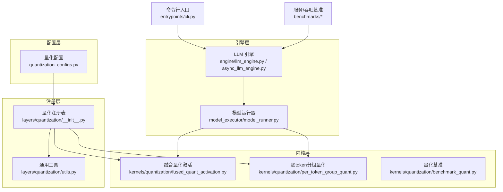
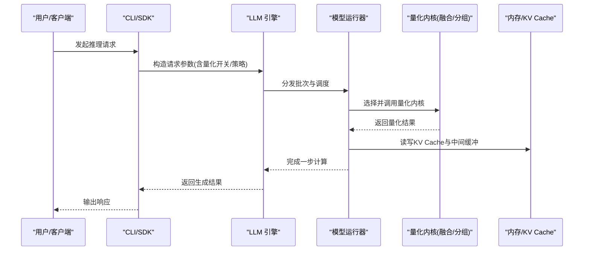
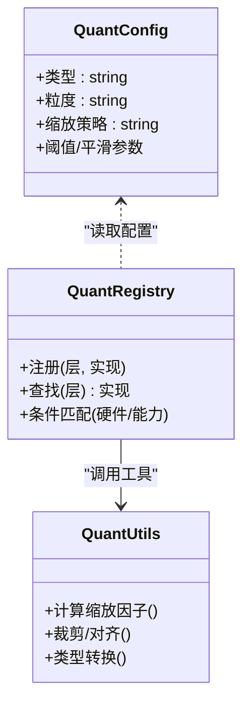
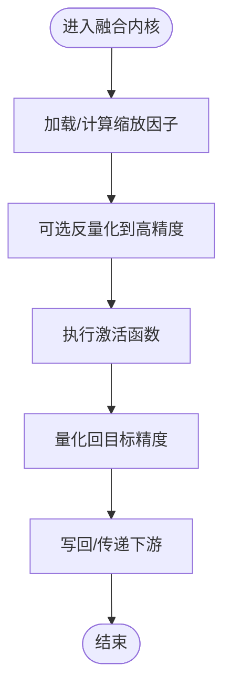
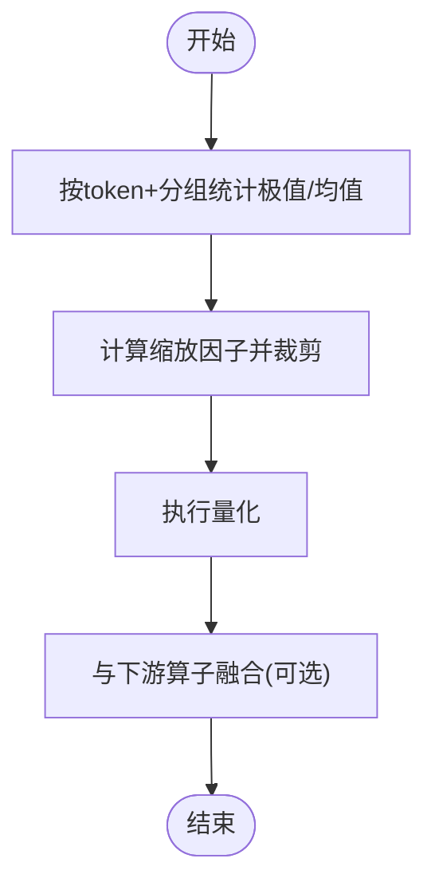
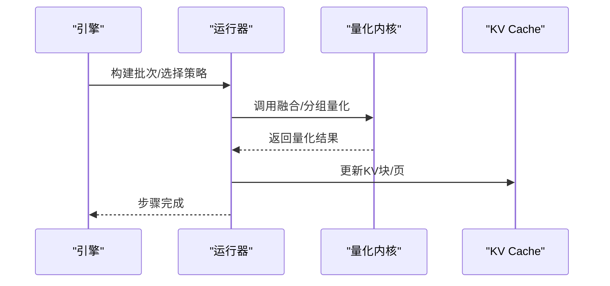
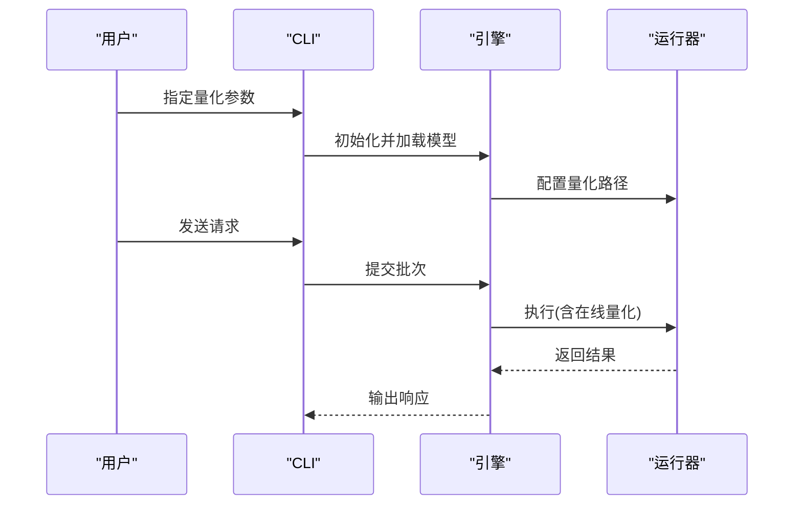
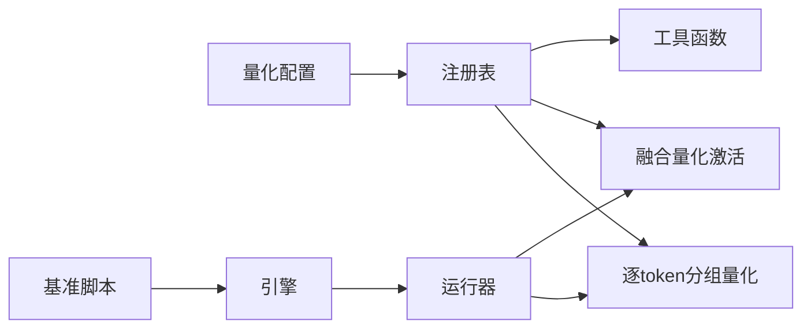

# 在线量化

<cite>
**本文引用的文件**   
- [vllm/config/quantization_configs.py](file://vllm/config/quantization_configs.py)
- [vllm/model_executor/layers/quantization/__init__.py](file://vllm/model_executor/layers/quantization/__init__.py)
- [vllm/model_executor/layers/quantization/utils.py](file://vllm/model_executor/layers/quantization/utils.py)
- [vllm/kernels/quantization/fused_quant_activation.py](file://vllm/kernels/quantization/fused_quant_activation.py)
- [vllm/kernels/quantization/per_token_group_quant.py](file://vllm/kernels/quantization/per_token_group_quant.py)
- [vllm/kernels/quantization/benchmark_quant.py](file://vllm/kernels/quantization/benchmark_quant.py)
- [vllm/entrypoints/cli.py](file://vllm/entrypoints/cli.py)
- [vllm/engine/async_llm_engine.py](file://vllm/engine/async_llm_engine.py)
- [vllm/engine/llm_engine.py](file://vllm/engine/llm_engine.py)
- [vllm/model_executor/model_runner.py](file://vllm/model_executor/model_runner.py)
- [benchmarks/benchmark_serving.py](file://benchmarks/benchmark_serving.py)
- [benchmarks/benchmark_throughput.py](file://benchmarks/benchmark_throughput.py)
- [docs/features/quantization/README.md](file://docs/features/quantization/README.md)
- [docs/configuration/engine_args.md](file://docs/configuration/engine_args.md)
</cite>

## 目录
1. [简介](#简介)
2. [项目结构](#项目结构)
3. [核心组件](#核心组件)
4. [架构总览](#架构总览)
5. [详细组件分析](#详细组件分析)
6. [依赖关系分析](#依赖关系分析)
7. [性能考量](#性能考量)
8. [故障排查指南](#故障排查指南)
9. [结论](#结论)
10. [附录](#附录)

## 简介
本章节面向希望理解并应用 vLLM 在线量化的开发者与运维人员，系统阐述：
- 在线量化的工作原理与运行时参数计算、调整机制
- 自适应量化的配置方法与按输入特征自动调整策略
- 内存管理与性能优化技术（如融合算子、KV Cache 友好布局）
- API 接口与使用示例（编程接口与命令行工具）
- 在线量化与离线量化的区别与适用场景
- 监控与调试工具、性能基准与精度评估方法

## 项目结构
vLLM 的在线量化能力由“配置—注册—内核—引擎”四层协同实现：
- 配置层：集中管理量化类型、粒度、缩放因子等参数
- 注册层：将不同量化方案与模型层绑定
- 内核层：提供高性能的量化/反量化与融合算子
- 引擎层：在推理路径中按需启用在线量化，并在批处理中动态调度

图表来源
- [vllm/config/quantization_configs.py](file://vllm/config/quantization_configs.py)
- [vllm/model_executor/layers/quantization/__init__.py](file://vllm/model_executor/layers/quantization/__init__.py)
- [vllm/model_executor/layers/quantization/utils.py](file://vllm/model_executor/layers/quantization/utils.py)
- [vllm/kernels/quantization/fused_quant_activation.py](file://vllm/kernels/quantization/fused_quant_activation.py)
- [vllm/kernels/quantization/per_token_group_quant.py](file://vllm/kernels/quantization/per_token_group_quant.py)
- [vllm/kernels/quantization/benchmark_quant.py](file://vllm/kernels/quantization/benchmark_quant.py)
- [vllm/engine/llm_engine.py](file://vllm/engine/llm_engine.py)
- [vllm/engine/async_llm_engine.py](file://vllm/engine/async_llm_engine.py)
- [vllm/model_executor/model_runner.py](file://vllm/model_executor/model_runner.py)
- [vllm/entrypoints/cli.py](file://vllm/entrypoints/cli.py)
- [benchmarks/benchmark_serving.py](file://benchmarks/benchmark_serving.py)
- [benchmarks/benchmark_throughput.py](file://benchmarks/benchmark_throughput.py)

章节来源
- [docs/features/quantization/README.md](file://docs/features/quantization/README.md)
- [docs/configuration/engine_args.md](file://docs/configuration/engine_args.md)

## 核心组件
- 量化配置中心：定义支持的量化格式、粒度（per-token/per-channel/per-group）、缩放策略与默认值，供引擎启动时加载。
- 量化注册表：将具体量化实现与模型层进行映射，确保在构建图或执行路径中选择正确的内核。
- 融合量化激活内核：将量化与激活函数融合，减少中间显存与访存开销，提升吞吐。
- 逐 token 分组量化内核：针对激活张量按 token 维度与分组粒度计算缩放因子，适配数据分布变化。
- 引擎集成：在预填充与解码阶段按需启用在线量化，结合 KV Cache 布局与批调度降低延迟。
- 基准与工具：提供量化算子级与端到端服务级基准脚本，便于性能对比与回归测试。

章节来源
- [vllm/config/quantization_configs.py](file://vllm/config/quantization_configs.py)
- [vllm/model_executor/layers/quantization/__init__.py](file://vllm/model_executor/layers/quantization/__init__.py)
- [vllm/model_executor/layers/quantization/utils.py](file://vllm/model_executor/layers/quantization/utils.py)
- [vllm/kernels/quantization/fused_quant_activation.py](file://vllm/kernels/quantization/fused_quant_activation.py)
- [vllm/kernels/quantization/per_token_group_quant.py](file://vllm/kernels/quantization/per_token_group_quant.py)
- [vllm/engine/llm_engine.py](file://vllm/engine/llm_engine.py)
- [vllm/engine/async_llm_engine.py](file://vllm/engine/async_llm_engine.py)
- [vllm/model_executor/model_runner.py](file://vllm/model_executor/model_runner.py)

## 架构总览
在线量化的关键流程如下：
- 启动阶段：解析量化配置，注册量化实现，准备内核与缓存布局。
- 请求进入：根据输入特征（序列长度、批次大小、数据类型）选择量化策略与内核。
- 执行阶段：在关键路径（注意力、前馈、归一化）调用融合量化内核，减少中间结果存储。
- 资源管理：结合 KV Cache 分页与内存池，避免频繁分配；必要时回退到更高精度。
- 观测与调优：通过指标与基准脚本采集延迟、吞吐、显存占用与数值误差。

图表来源
- [vllm/entrypoints/cli.py](file://vllm/entrypoints/cli.py)
- [vllm/engine/llm_engine.py](file://vllm/engine/llm_engine.py)
- [vllm/engine/async_llm_engine.py](file://vllm/engine/async_llm_engine.py)
- [vllm/model_executor/model_runner.py](file://vllm/model_executor/model_runner.py)
- [vllm/kernels/quantization/fused_quant_activation.py](file://vllm/kernels/quantization/fused_quant_activation.py)
- [vllm/kernels/quantization/per_token_group_quant.py](file://vllm/kernels/quantization/per_token_group_quant.py)

## 详细组件分析

### 量化配置与注册
- 量化配置：集中定义量化类型（如 INT8/FP8/NVFP4 等）、粒度（per-token/per-channel/per-group）、缩放范围与平滑参数。
- 注册表：维护“层名/模块类型 → 量化实现”的映射，支持多后端与条件分支（硬件能力检测）。
- 工具函数：提供缩放因子计算、裁剪、对齐、类型转换等通用逻辑。

图表来源
- [vllm/config/quantization_configs.py](file://vllm/config/quantization_configs.py)
- [vllm/model_executor/layers/quantization/__init__.py](file://vllm/model_executor/layers/quantization/__init__.py)
- [vllm/model_executor/layers/quantization/utils.py](file://vllm/model_executor/layers/quantization/utils.py)

章节来源
- [vllm/config/quantization_configs.py](file://vllm/config/quantization_configs.py)
- [vllm/model_executor/layers/quantization/__init__.py](file://vllm/model_executor/layers/quantization/__init__.py)
- [vllm/model_executor/layers/quantization/utils.py](file://vllm/model_executor/layers/quantization/utils.py)

### 融合量化激活内核
- 目标：将量化与激活（如 ReLU/SiLU/GELU）融合，减少中间显存与访存。
- 关键点：按 token 或分组计算缩放因子，在激活前后做必要的反量化/重缩放，保证数值稳定。
- 收益：显著降低峰值显存与延迟，尤其在大 batch 与长上下文下。

图表来源
- [vllm/kernels/quantization/fused_quant_activation.py](file://vllm/kernels/quantization/fused_quant_activation.py)

章节来源
- [vllm/kernels/quantization/fused_quant_activation.py](file://vllm/kernels/quantization/fused_quant_activation.py)

### 逐 token 分组量化内核
- 目标：对激活张量按 token 维度与分组粒度计算缩放因子，适应输入分布变化。
- 关键点：分组统计、缩放因子裁剪、与注意力/FFN 的无缝衔接。
- 收益：在保持精度的同时降低带宽压力，适合动态负载场景。

图表来源
- [vllm/kernels/quantization/per_token_group_quant.py](file://vllm/kernels/quantization/per_token_group_quant.py)

章节来源
- [vllm/kernels/quantization/per_token_group_quant.py](file://vllm/kernels/quantization/per_token_group_quant.py)

### 引擎集成与在线调度
- 引擎在预填充与解码阶段根据配置与运行时特征选择是否启用在线量化。
- 模型运行器负责将量化内核注入到计算图中，并与 KV Cache 管理协同。
- 异步引擎支持并发请求下的量化策略一致性与资源隔离。

图表来源
- [vllm/engine/llm_engine.py](file://vllm/engine/llm_engine.py)
- [vllm/engine/async_llm_engine.py](file://vllm/engine/async_llm_engine.py)
- [vllm/model_executor/model_runner.py](file://vllm/model_executor/model_runner.py)

章节来源
- [vllm/engine/llm_engine.py](file://vllm/engine/llm_engine.py)
- [vllm/engine/async_llm_engine.py](file://vllm/engine/async_llm_engine.py)
- [vllm/model_executor/model_runner.py](file://vllm/model_executor/model_runner.py)

### 命令行与编程接口
- 命令行：通过 CLI 启动服务或推理任务，传入量化相关参数（如量化类型、粒度、是否启用融合）。
- 编程接口：通过 SDK/Engine API 创建实例并设置量化配置，随后发起请求。

图表来源
- [vllm/entrypoints/cli.py](file://vllm/entrypoints/cli.py)
- [vllm/engine/llm_engine.py](file://vllm/engine/llm_engine.py)
- [vllm/engine/async_llm_engine.py](file://vllm/engine/async_llm_engine.py)

章节来源
- [vllm/entrypoints/cli.py](file://vllm/entrypoints/cli.py)
- [docs/configuration/engine_args.md](file://docs/configuration/engine_args.md)

## 依赖关系分析
- 配置与注册：量化配置驱动注册表选择具体实现，工具函数被多处复用。
- 内核与引擎：引擎通过运行器调用内核，内核依赖底层 CUDA/Triton 实现。
- 基准与监控：基准脚本与引擎解耦，用于独立验证与回归。

图表来源
- [vllm/config/quantization_configs.py](file://vllm/config/quantization_configs.py)
- [vllm/model_executor/layers/quantization/__init__.py](file://vllm/model_executor/layers/quantization/__init__.py)
- [vllm/model_executor/layers/quantization/utils.py](file://vllm/model_executor/layers/quantization/utils.py)
- [vllm/kernels/quantization/fused_quant_activation.py](file://vllm/kernels/quantization/fused_quant_activation.py)
- [vllm/kernels/quantization/per_token_group_quant.py](file://vllm/kernels/quantization/per_token_group_quant.py)
- [vllm/engine/llm_engine.py](file://vllm/engine/llm_engine.py)
- [vllm/engine/async_llm_engine.py](file://vllm/engine/async_llm_engine.py)
- [vllm/model_executor/model_runner.py](file://vllm/model_executor/model_runner.py)
- [benchmarks/benchmark_serving.py](file://benchmarks/benchmark_serving.py)
- [benchmarks/benchmark_throughput.py](file://benchmarks/benchmark_throughput.py)

章节来源
- [benchmarks/benchmark_serving.py](file://benchmarks/benchmark_serving.py)
- [benchmarks/benchmark_throughput.py](file://benchmarks/benchmark_throughput.py)

## 性能考量
- 融合算子：优先使用融合量化激活以减少中间显存与访存，提高吞吐。
- 分组粒度：合理设置 per-token/per-group 粒度以平衡精度与带宽。
- KV Cache 布局：与量化路径协同，避免不必要的类型转换与拷贝。
- 动态回退：当检测到数值不稳定或硬件限制时，自动回退到更高精度。
- 基准方法：使用服务级与吞吐基准脚本进行端到端评估，关注延迟、吞吐、显存与精度损失。

[本节为通用指导，不直接分析具体文件]

## 故障排查指南
- 现象：生成质量下降或 NaN 出现
  - 检查缩放因子计算与裁剪策略，确认分组粒度与阈值设置
  - 查看是否触发了回退路径
- 现象：显存不足或 OOM
  - 降低 batch 或序列长度，检查 KV Cache 分页与内存池配置
  - 关闭非必要的融合路径，观察差异
- 现象：性能不达预期
  - 核对是否启用了融合内核与合适的量化类型
  - 使用基准脚本定位瓶颈（内核/通信/调度）

章节来源
- [vllm/kernels/quantization/benchmark_quant.py](file://vllm/kernels/quantization/benchmark_quant.py)
- [benchmarks/benchmark_serving.py](file://benchmarks/benchmark_serving.py)
- [benchmarks/benchmark_throughput.py](file://benchmarks/benchmark_throughput.py)

## 结论
vLLM 的在线量化通过“配置—注册—内核—引擎”的分层设计，实现了在推理路径中灵活、高效地应用量化策略。融合与分组量化内核有效降低了显存与延迟，配合 KV Cache 与批调度，提升了整体吞吐。借助基准与监控工具，开发者可快速评估与调优量化效果，满足不同场景的需求。

[本节为总结性内容，不直接分析具体文件]

## 附录
- 在线 vs 离线量化
  - 在线量化：在运行时计算缩放与量化，适合动态负载与未知数据分布；需要内核与引擎深度集成。
  - 离线量化：在部署前固化权重与部分激活的量化参数，适合静态工作负载与极致优化。
- 自适应量化建议
  - 基于输入统计（如每 token 极值/均值）动态调整分组粒度与缩放范围
  - 结合业务 SLA 设定精度阈值与回退策略
- 监控与调试
  - 使用基准脚本采集延迟、吞吐、显存与精度指标
  - 开启日志与指标导出，定位热点路径与异常点

[本节为补充说明，不直接分析具体文件]