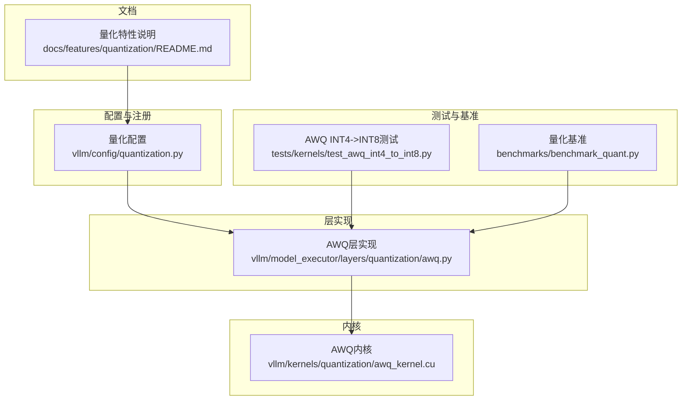
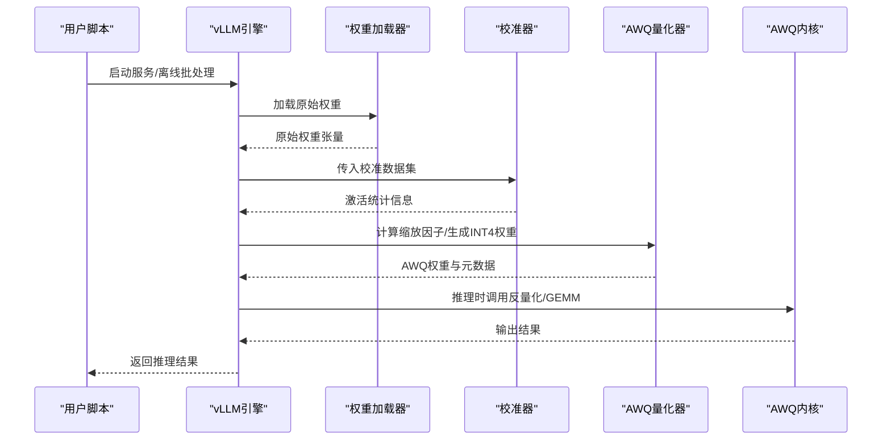
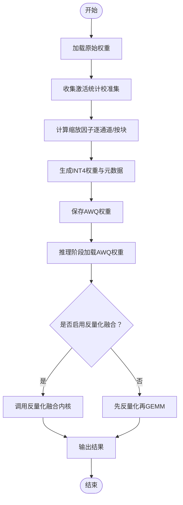
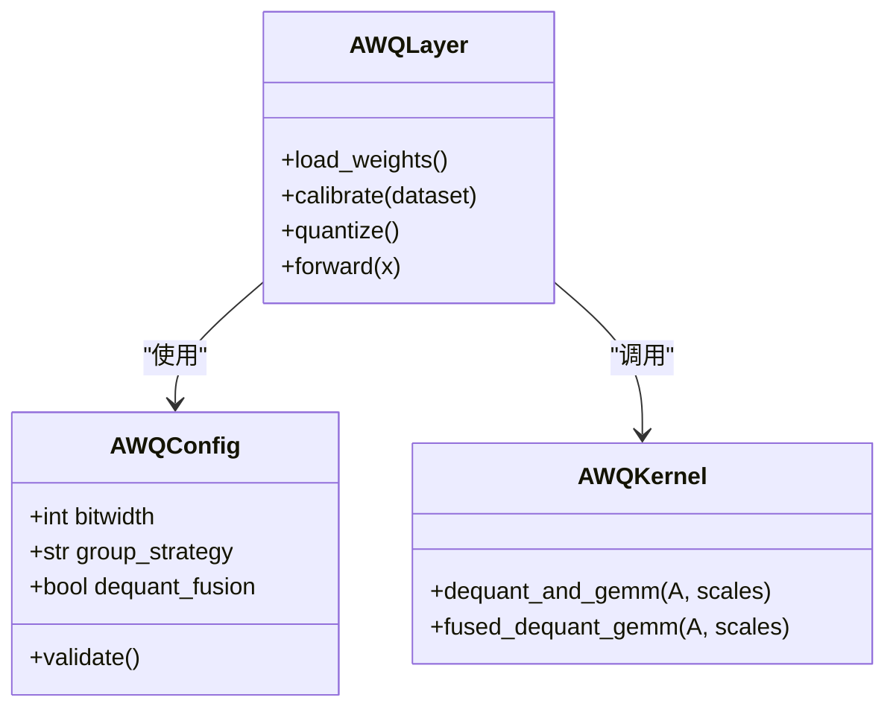
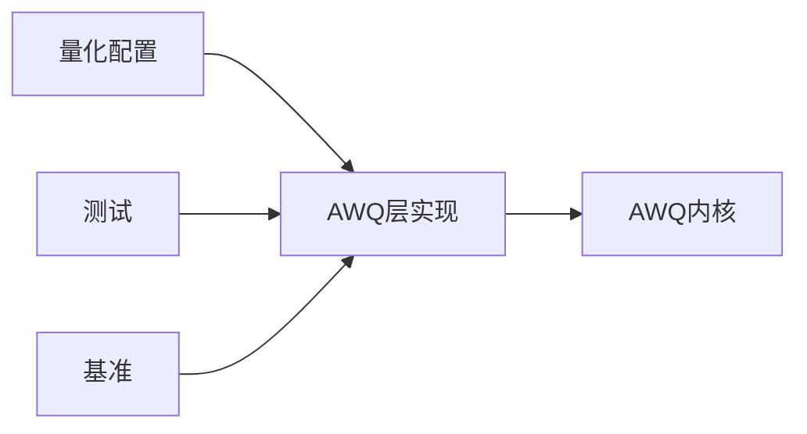

# AWQ量化方法

<cite>
**本文引用的文件**   
- [vllm/config/quantization.py](file://vllm/config/quantization.py)
- [vllm/model_executor/layers/quantization/awq.py](file://vllm/model_executor/layers/quantization/awq.py)
- [vllm/kernels/quantization/awq_kernel.cu](file://vllm/kernels/quantization/awq_kernel.cu)
- [tests/kernels/test_awq_int4_to_int8.py](file://tests/kernels/test_awq_int4_to_int8.py)
- [benchmarks/benchmark_quant.py](file://benchmarks/benchmark_quant.py)
- [docs/features/quantization/README.md](file://docs/features/quantization/README.md)
</cite>

## 目录
1. [简介](#简介)
2. [项目结构](#项目结构)
3. [核心组件](#核心组件)
4. [架构总览](#架构总览)
5. [详细组件分析](#详细组件分析)
6. [依赖关系分析](#依赖关系分析)
7. [性能考虑](#性能考虑)
8. [故障排查指南](#故障排查指南)
9. [结论](#结论)
10. [附录](#附录)

## 简介
本文件系统性介绍AWQ（Activation-aware Weight Quantization，激活感知权重量化）在vLLM中的原理与实现。内容涵盖：
- 激活感知量化的核心思想：依据激活分布对权重进行分组、标定与量化，以最小化推理误差。
- 自动AWQ的工作流程：校准数据集选择、量化参数优化、模型转换与部署。
- 配置选项与使用示例：离线量化与在线推理的配置方式。
- 不同模型架构的支持情况与性能表现。
- 常见问题排查与性能调优建议。

## 项目结构
vLLM中与AWQ相关的代码主要分布在以下位置：
- 量化配置与注册：位于配置模块，提供AWQ开关、精度、分组策略等参数。
- 层级别AWQ实现：定义AWQ量化算子、反量化路径与内核调用。
- CUDA内核：针对INT4权重的快速GEMM与反量化路径。
- 测试与基准：覆盖AWQ的数值正确性与性能基准。
- 文档：量化特性概览与使用说明。

**图示来源** 
- [vllm/config/quantization.py](file://vllm/config/quantization.py)
- [vllm/model_executor/layers/quantization/awq.py](file://vllm/model_executor/layers/quantization/awq.py)
- [vllm/kernels/quantization/awq_kernel.cu](file://vllm/kernels/quantization/awq_kernel.cu)
- [tests/kernels/test_awq_int4_to_int8.py](file://tests/kernels/test_awq_int4_to_int8.py)
- [benchmarks/benchmark_quant.py](file://benchmarks/benchmark_quant.py)
- [docs/features/quantization/README.md](file://docs/features/quantization/README.md)

**章节来源**
- [vllm/config/quantization.py](file://vllm/config/quantization.py)
- [vllm/model_executor/layers/quantization/awq.py](file://vllm/model_executor/layers/quantization/awq.py)
- [vllm/kernels/quantization/awq_kernel.cu](file://vllm/kernels/quantization/awq_kernel.cu)
- [tests/kernels/test_awq_int4_to_int8.py](file://tests/kernels/test_awq_int4_to_int8.py)
- [benchmarks/benchmark_quant.py](file://benchmarks/benchmark_quant.py)
- [docs/features/quantization/README.md](file://docs/features/quantization/README.md)

## 核心组件
- 量化配置与注册
  - 提供AWQ开关、位宽（如INT4）、分组粒度、缩放因子存储格式、是否启用反量化融合等关键参数。
  - 负责将AWQ注册到vLLM的量化后端调度器中，以便在不同模型层上按需启用。
- AWQ层实现
  - 封装权重加载、校准数据收集、量化参数求解（缩放因子、零点）、INT4权重存储布局。
  - 在推理时执行“反量化+GEMM”或“反量化融合内核”，保证低延迟高吞吐。
- CUDA内核
  - 实现高效的INT4权重反量化至INT8/FP16路径，以及GEMM加速，减少内存带宽瓶颈。
- 测试与基准
  - 验证AWQ路径的数值正确性（例如INT4到INT8的反量化）。
  - 量化相关基准用于评估吞吐、延迟与显存占用。

**章节来源**
- [vllm/config/quantization.py](file://vllm/config/quantization.py)
- [vllm/model_executor/layers/quantization/awq.py](file://vllm/model_executor/layers/quantization/awq.py)
- [vllm/kernels/quantization/awq_kernel.cu](file://vllm/kernels/quantization/awq_kernel.cu)
- [tests/kernels/test_awq_int4_to_int8.py](file://tests/kernels/test_awq_int4_to_int8.py)
- [benchmarks/benchmark_quant.py](file://benchmarks/benchmark_quant.py)

## 架构总览
AWQ在vLLM中的整体工作流如下：
- 训练后量化阶段（离线）
  - 加载原始权重与可选校准集。
  - 前向通过校准集，统计激活分布。
  - 基于激活分布计算每组的缩放因子（可能包含逐通道/逐块策略）。
  - 生成INT4权重与对应的缩放元数据，保存为AWQ格式。
- 推理阶段（在线）
  - 引擎加载AWQ权重与元数据。
  - 在需要时执行反量化（INT4→INT8/FP16）并进入GEMM内核。
  - 可选择反量化与GEMM融合的内核以降低开销。

**图示来源** 
- [vllm/config/quantization.py](file://vllm/config/quantization.py)
- [vllm/model_executor/layers/quantization/awq.py](file://vllm/model_executor/layers/quantization/awq.py)
- [vllm/kernels/quantization/awq_kernel.cu](file://vllm/kernels/quantization/awq_kernel.cu)

## 详细组件分析

### 量化配置与注册（AWQ开关与参数）
- 功能要点
  - 暴露AWQ开关、位宽（如INT4）、分组粒度、缩放因子类型、是否启用反量化融合等配置项。
  - 将AWQ注册到量化后端，使模型构建阶段能根据配置选择AWQ路径。
- 典型参数
  - 位宽：INT4（常见），可配置是否使用INT8中间表示。
  - 分组粒度：按通道或按块（block-wise）进行缩放。
  - 反量化融合：是否将反量化与GEMM融合以减少访存。
- 使用建议
  - 大模型通常采用逐通道或按块量化以提升精度。
  - 若硬件支持INT4 GEMM且反量化融合可用，优先开启以获得更好吞吐。

**章节来源**
- [vllm/config/quantization.py](file://vllm/config/quantization.py)

### AWQ层实现（权重加载、校准、量化、推理）
- 功能要点
  - 权重加载：读取原始权重，准备校准数据。
  - 校准：前向通过校准集，统计激活分布，计算缩放因子。
  - 量化：生成INT4权重与缩放元数据，写入AWQ格式。
  - 推理：加载AWQ权重，执行反量化与GEMM（可融合）。
- 关键流程
  - 校准数据选择：常用少量真实样本或合成数据，确保覆盖输入分布。
  - 缩放因子求解：基于激活极值或分位数，结合权重敏感度进行优化。
  - 反量化路径：INT4→INT8/FP16，随后进入GEMM；或反量化融合内核直接输出。
- 错误处理
  - 校验权重形状、分组粒度与设备兼容性。
  - 在校准失败或数值异常时回退到未量化路径或抛出明确错误。

**图示来源** 
- [vllm/model_executor/layers/quantization/awq.py](file://vllm/model_executor/layers/quantization/awq.py)

**章节来源**
- [vllm/model_executor/layers/quantization/awq.py](file://vllm/model_executor/layers/quantization/awq.py)

### CUDA内核（反量化与GEMM加速）
- 功能要点
  - 高效反量化：将INT4权重转换为INT8/FP16，减少内存带宽压力。
  - GEMM加速：利用矩阵乘加速库或自定义内核提升吞吐。
  - 融合路径：反量化与GEMM融合，降低中间缓存与同步开销。
- 性能特征
  - 高吞吐：适合批量推理与长上下文场景。
  - 低延迟：反量化融合减少访存与同步。
  - 可扩展：支持不同硬件后端（CUDA/ROCm等）的适配。

**章节来源**
- [vllm/kernels/quantization/awq_kernel.cu](file://vllm/kernels/quantization/awq_kernel.cu)

### 测试与基准（数值正确性与性能）
- 数值正确性
  - 覆盖INT4到INT8的反量化路径，验证与参考实现的接近度。
- 性能基准
  - 量化相关基准用于评估吞吐、延迟与显存占用，对比不同配置（是否融合、分组粒度等）。

**章节来源**
- [tests/kernels/test_awq_int4_to_int8.py](file://tests/kernels/test_awq_int4_to_int8.py)
- [benchmarks/benchmark_quant.py](file://benchmarks/benchmark_quant.py)

### 概念总览（不绑定具体文件）

[此图为概念示意，不直接映射到具体源码文件]

## 依赖关系分析
- 组件耦合
  - 配置模块为层实现提供参数，层实现依赖内核完成高性能计算。
  - 测试与基准依赖层实现与内核，确保数值与性能稳定。
- 外部依赖
  - CUDA/ROCm后端、矩阵乘加速库（如cuBLAS/cutlass等，视内核实现而定）。
- 潜在循环依赖
  - 通过分层设计避免循环依赖：配置→层→内核，单向依赖。

**图示来源** 
- [vllm/config/quantization.py](file://vllm/config/quantization.py)
- [vllm/model_executor/layers/quantization/awq.py](file://vllm/model_executor/layers/quantization/awq.py)
- [vllm/kernels/quantization/awq_kernel.cu](file://vllm/kernels/quantization/awq_kernel.cu)
- [tests/kernels/test_awq_int4_to_int8.py](file://tests/kernels/test_awq_int4_to_int8.py)
- [benchmarks/benchmark_quant.py](file://benchmarks/benchmark_quant.py)

**章节来源**
- [vllm/config/quantization.py](file://vllm/config/quantization.py)
- [vllm/model_executor/layers/quantization/awq.py](file://vllm/model_executor/layers/quantization/awq.py)
- [vllm/kernels/quantization/awq_kernel.cu](file://vllm/kernels/quantization/awq_kernel.cu)
- [tests/kernels/test_awq_int4_to_int8.py](file://tests/kernels/test_awq_int4_to_int8.py)
- [benchmarks/benchmark_quant.py](file://benchmarks/benchmark_quant.py)

## 性能考虑
- 反量化融合
  - 开启反量化与GEMM融合可减少访存与同步，显著提升吞吐。
- 分组粒度
  - 逐通道量化通常精度更高但开销更大；按块量化在精度与效率间取得平衡。
- 校准集规模与代表性
  - 校准集应覆盖典型输入分布，过小或不具代表性会导致精度下降。
- 硬件后端
  - 不同GPU/ROCm后端对INT4 GEMM与反量化融合的支持程度不同，需结合实际硬件调优。
- 批大小与上下文长度
  - 大批次与长上下文下，反量化融合的收益更明显；小批次需关注延迟。

[本节为通用指导，不直接分析具体文件]

## 故障排查指南
- 数值不正确
  - 检查校准集是否充分代表输入分布。
  - 确认分组粒度与缩放因子计算策略是否与目标硬件匹配。
  - 核对INT4到INT8反量化路径的测试用例是否通过。
- 性能不达预期
  - 确认是否启用反量化融合内核。
  - 检查批大小、上下文长度与硬件能力是否匹配。
  - 使用基准脚本定位瓶颈（反量化或GEMM阶段）。
- 兼容性问题
  - 确认CUDA/ROCm版本与内核支持。
  - 检查模型层是否支持AWQ路径（某些特殊层可能需要额外适配）。

**章节来源**
- [tests/kernels/test_awq_int4_to_int8.py](file://tests/kernels/test_awq_int4_to_int8.py)
- [benchmarks/benchmark_quant.py](file://benchmarks/benchmark_quant.py)

## 结论
AWQ通过激活感知的方式对权重进行智能量化，能够在保持精度的同时显著降低显存与计算开销。在vLLM中，AWQ的实现涵盖了从配置、层实现到内核优化的完整链路，并提供测试与基准以确保数值与性能。合理选择校准集、分组粒度与反量化融合策略，可在不同模型架构与硬件平台上获得良好的推理效果。

[本节为总结性内容，不直接分析具体文件]

## 附录
- 使用示例（离线量化与在线推理）
  - 离线量化：加载原始权重与校准集，运行AWQ量化流程，保存AWQ权重与元数据。
  - 在线推理：加载AWQ权重，配置反量化融合与分组策略，启动服务或批处理。
- 配置选项速览
  - 位宽：INT4（推荐），可选INT8中间表示。
  - 分组策略：逐通道/按块。
  - 反量化融合：开启以提升吞吐。
- 模型支持与性能
  - 主流Transformer架构（如Llama、Qwen、Mistral等）通常支持AWQ。
  - 性能受硬件后端、批大小、上下文长度与配置影响，建议使用基准脚本评估。

**章节来源**
- [docs/features/quantization/README.md](file://docs/features/quantization/README.md)