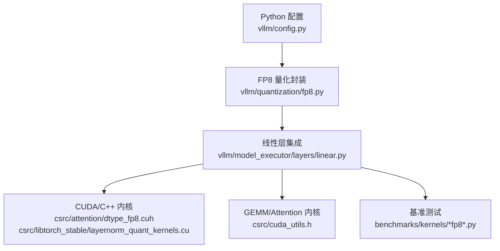
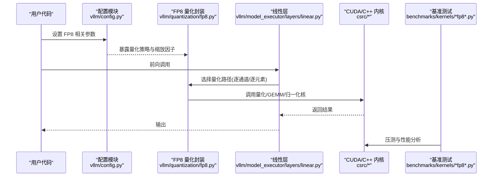
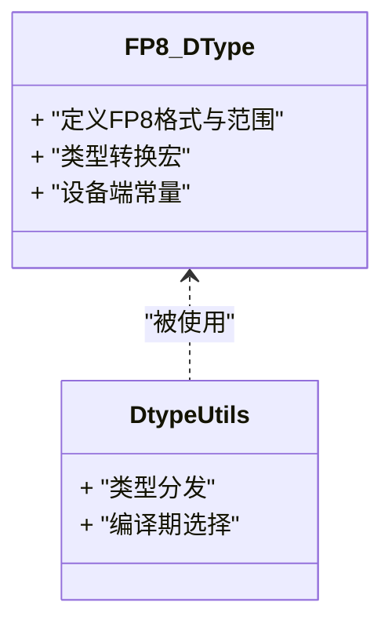
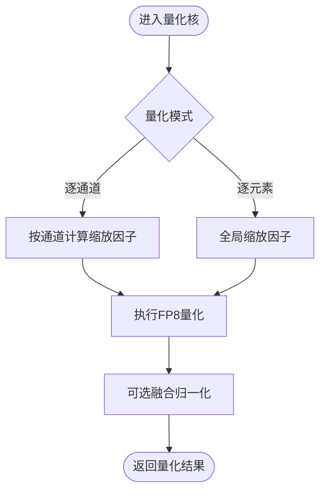
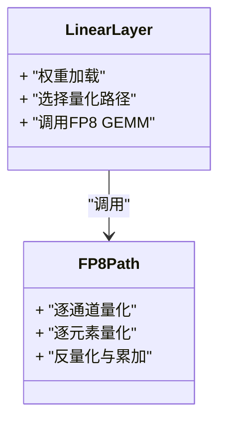
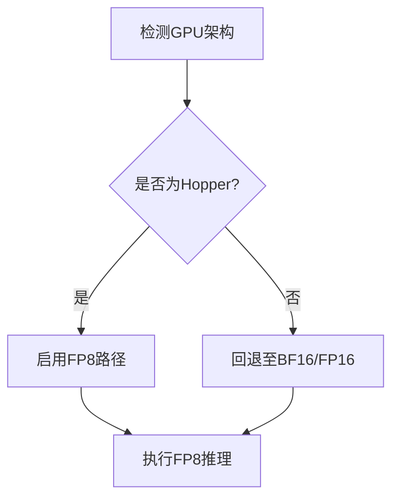
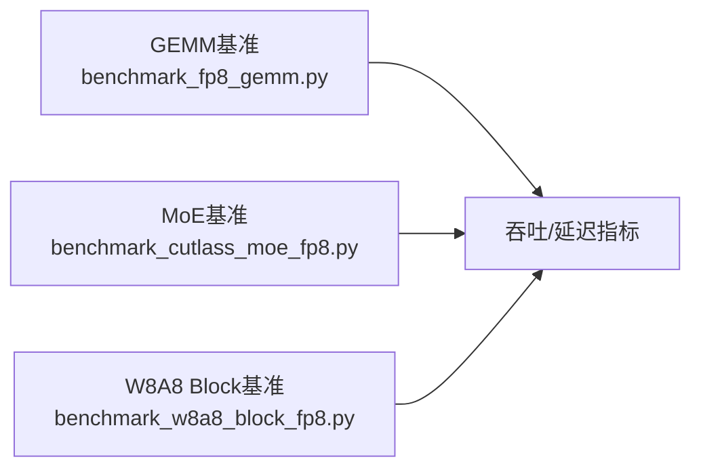
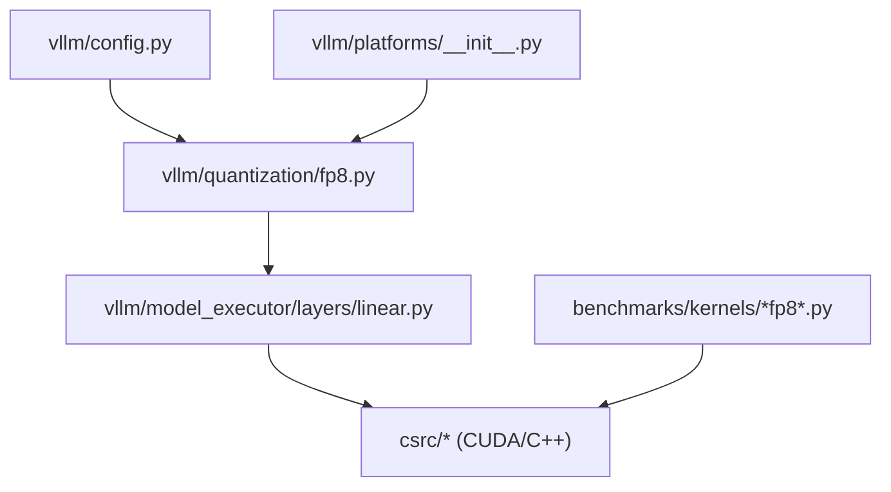

# FP8量化

<cite>
**本文引用的文件**   
- [vllm/quantization/fp8.py](file://vllm/quantization/fp8.py)
- [vllm/model_executor/layers/linear.py](file://vllm/model_executor/layers/linear.py)
- [benchmarks/kernels/benchmark_fp8_gemm.py](file://benchmarks/kernels/benchmark_fp8_gemm.py)
- [benchmarks/kernels/benchmark_cutlass_moe_fp8.py](file://benchmarks/kernels/benchmark_cutlass_moe_fp8.py)
- [benchmarks/kernels/benchmark_w8a8_block_fp8.py](file://benchmarks/kernels/benchmark_w8a8_block_fp8.py)
- [csrc/cuda_utils.h](file://csrc/cuda_utils.h)
- [csrc/libtorch_stable/layernorm_quant_kernels.cu](file://csrc/libtorch_stable/layernorm_quant_kernels.cu)
- [csrc/attention/dtype_fp8.cuh](file://csrc/attention/dtype_fp8.cuh)
- [vllm/config.py](file://vllm/config.py)
- [vllm/platforms/__init__.py](file://vllm/platforms/__init__.py)
</cite>

## 目录
1. [简介](#简介)
2. [项目结构](#项目结构)
3. [核心组件](#核心组件)
4. [架构总览](#架构总览)
5. [详细组件分析](#详细组件分析)
6. [依赖关系分析](#依赖关系分析)
7. [性能考量](#性能考量)
8. [故障排查指南](#故障排查指南)
9. [结论](#结论)
10. [附录](#附录)

## 简介
本文件系统性梳理 vLLM 中 FP8（8位浮点数）量化的技术要点与工程实现，重点覆盖：
- FP8 的优势、数值范围与精度特性，以及与 FP16/BF16 的对比
- NVIDIA Hopper 架构上的硬件支持与性能优势
- 配置选项：逐通道量化 vs 逐元素量化
- 使用示例与最佳实践：模型转换与推理优化步骤
- 不同模型类型的适用性与性能表现
- 调试工具与性能分析方法

FP8 在 Hopper GPU 上由专用张量核心加速，可在保持较高精度的同时显著降低内存带宽与计算开销，特别适合大模型推理场景。

## 项目结构
vLLM 对 FP8 的支持贯穿“内核定义—量化算子—层集成—基准测试”全链路：
- 数据类型与内核头：csrc/attention/dtype_fp8.cuh、csrc/cuda_utils.h
- 量化与归一化内核：csrc/libtorch_stable/layernorm_quant_kernels.cu
- Python 侧量化封装与配置：vllm/quantization/fp8.py、vllm/config.py
- 线性层集成：vllm/model_executor/layers/linear.py
- 基准与性能验证：benchmarks/kernels/benchmark_fp8_gemm.py、benchmark_cutlass_moe_fp8.py、benchmark_w8a8_block_fp8.py

**图表来源** 
- [vllm/config.py](file://vllm/config.py)
- [vllm/quantization/fp8.py](file://vllm/quantization/fp8.py)
- [vllm/model_executor/layers/linear.py](file://vllm/model_executor/layers/linear.py)
- [csrc/attention/dtype_fp8.cuh](file://csrc/attention/dtype_fp8.cuh)
- [csrc/libtorch_stable/layernorm_quant_kernels.cu](file://csrc/libtorch_stable/layernorm_quant_kernels.cu)
- [csrc/cuda_utils.h](file://csrc/cuda_utils.h)
- [benchmarks/kernels/benchmark_fp8_gemm.py](file://benchmarks/kernels/benchmark_fp8_gemm.py)

**章节来源**
- [vllm/config.py](file://vllm/config.py)
- [vllm/quantization/fp8.py](file://vllm/quantization/fp8.py)
- [vllm/model_executor/layers/linear.py](file://vllm/model_executor/layers/linear.py)
- [csrc/attention/dtype_fp8.cuh](file://csrc/attention/dtype_fp8.cuh)
- [csrc/libtorch_stable/layernorm_quant_kernels.cu](file://csrc/libtorch_stable/layernorm_quant_kernels.cu)
- [csrc/cuda_utils.h](file://csrc/cuda_utils.h)
- [benchmarks/kernels/benchmark_fp8_gemm.py](file://benchmarks/kernels/benchmark_fp8_gemm.py)

## 核心组件
- FP8 数据类型与常量：定义 FP8 格式、范围与转换宏，供 CUDA/C++ 内核使用
- 量化与反量化核：针对激活/权重的量化、反量化与融合归一化（如 RMSNorm/LayerNorm）
- 线性层集成：将 FP8 GEMM/量化路径接入 Transformer 线性层
- 平台检测与能力开关：根据硬件（Hopper）启用 FP8 路径
- 基准套件：覆盖 GEMM、MoE、W8A8 Block 等典型场景

**章节来源**
- [csrc/attention/dtype_fp8.cuh](file://csrc/attention/dtype_fp8.cuh)
- [csrc/libtorch_stable/layernorm_quant_kernels.cu](file://csrc/libtorch_stable/layernorm_quant_kernels.cu)
- [vllm/model_executor/layers/linear.py](file://vllm/model_executor/layers/linear.py)
- [vllm/platforms/__init__.py](file://vllm/platforms/__init__.py)

## 架构总览
下图展示从 Python 配置到 CUDA 内核的端到端数据流与控制流：

**图表来源** 
- [vllm/config.py](file://vllm/config.py)
- [vllm/quantization/fp8.py](file://vllm/quantization/fp8.py)
- [vllm/model_executor/layers/linear.py](file://vllm/model_executor/layers/linear.py)
- [csrc/attention/dtype_fp8.cuh](file://csrc/attention/dtype_fp8.cuh)
- [csrc/libtorch_stable/layernorm_quant_kernels.cu](file://csrc/libtorch_stable/layernorm_quant_kernels.cu)
- [benchmarks/kernels/benchmark_fp8_gemm.py](file://benchmarks/kernels/benchmark_fp8_gemm.py)

## 详细组件分析

### FP8 数据类型与内核头
- 定义 FP8 的数值表示、范围与转换函数，确保与 Hopper 张量核心的指令集兼容
- 提供类型分发与编译期常量，便于在不同后端间切换

**图表来源** 
- [csrc/attention/dtype_fp8.cuh](file://csrc/attention/dtype_fp8.cuh)

**章节来源**
- [csrc/attention/dtype_fp8.cuh](file://csrc/attention/dtype_fp8.cuh)

### 量化与归一化内核
- 实现激活/权重的 FP8 量化与反量化，支持逐通道与逐元素两种模式
- 融合归一化（RMSNorm/LayerNorm）以减少内存访问与同步开销

**图表来源** 
- [csrc/libtorch_stable/layernorm_quant_kernels.cu](file://csrc/libtorch_stable/layernorm_quant_kernels.cu)

**章节来源**
- [csrc/libtorch_stable/layernorm_quant_kernels.cu](file://csrc/libtorch_stable/layernorm_quant_kernels.cu)

### 线性层集成
- 在 Transformer 线性层中注入 FP8 GEMM 路径，自动选择量化策略
- 与注意力、MoE 等模块协同，形成端到端 FP8 推理流水线

**图表来源** 
- [vllm/model_executor/layers/linear.py](file://vllm/model_executor/layers/linear.py)

**章节来源**
- [vllm/model_executor/layers/linear.py](file://vllm/model_executor/layers/linear.py)

### 平台检测与能力开关
- 基于平台信息判断是否启用 FP8（例如 Hopper 架构）
- 动态开关避免在不支持的硬件上退化或报错

**图表来源** 
- [vllm/platforms/__init__.py](file://vllm/platforms/__init__.py)

**章节来源**
- [vllm/platforms/__init__.py](file://vllm/platforms/__init__.py)

### 基准与性能验证
- 覆盖 FP8 GEMM、Cutlass MoE、W8A8 Block 等关键路径
- 通过不同形状与批大小评估吞吐与延迟

**图表来源** 
- [benchmarks/kernels/benchmark_fp8_gemm.py](file://benchmarks/kernels/benchmark_fp8_gemm.py)
- [benchmarks/kernels/benchmark_cutlass_moe_fp8.py](file://benchmarks/kernels/benchmark_cutlass_moe_fp8.py)
- [benchmarks/kernels/benchmark_w8a8_block_fp8.py](file://benchmarks/kernels/benchmark_w8a8_block_fp8.py)

**章节来源**
- [benchmarks/kernels/benchmark_fp8_gemm.py](file://benchmarks/kernels/benchmark_fp8_gemm.py)
- [benchmarks/kernels/benchmark_cutlass_moe_fp8.py](file://benchmarks/kernels/benchmark_cutlass_moe_fp8.py)
- [benchmarks/kernels/benchmark_w8a8_block_fp8.py](file://benchmarks/kernels/benchmark_w8a8_block_fp8.py)

## 依赖关系分析
- Python 配置与量化封装依赖平台检测，决定 FP8 路径可用性
- 线性层依赖 CUDA/C++ 内核进行实际计算
- 基准套件直接调用内核以评估性能

**图表来源** 
- [vllm/config.py](file://vllm/config.py)
- [vllm/platforms/__init__.py](file://vllm/platforms/__init__.py)
- [vllm/quantization/fp8.py](file://vllm/quantization/fp8.py)
- [vllm/model_executor/layers/linear.py](file://vllm/model_executor/layers/linear.py)
- [csrc/cuda_utils.h](file://csrc/cuda_utils.h)
- [benchmarks/kernels/benchmark_fp8_gemm.py](file://benchmarks/kernels/benchmark_fp8_gemm.py)

**章节来源**
- [vllm/config.py](file://vllm/config.py)
- [vllm/platforms/__init__.py](file://vllm/platforms/__init__.py)
- [vllm/quantization/fp8.py](file://vllm/quantization/fp8.py)
- [vllm/model_executor/layers/linear.py](file://vllm/model_executor/layers/linear.py)
- [csrc/cuda_utils.h](file://csrc/cuda_utils.h)
- [benchmarks/kernels/benchmark_fp8_gemm.py](file://benchmarks/kernels/benchmark_fp8_gemm.py)

## 性能考量
- Hopper 张量核心对 FP8 有原生加速，显著提升 GEMM/Attention/MoE 吞吐
- 量化粒度选择影响精度与性能：逐通道通常更优但需额外存储缩放因子；逐元素更简单但可能损失精度
- 融合归一化减少内存读写，提升整体效率
- 建议结合基准套件对不同形状与批大小进行调参

[本节为通用指导，不直接分析具体文件]

## 故障排查指南
- 确认平台检测正确识别 Hopper 并启用 FP8 路径
- 检查量化核与反量化核的缩放因子计算是否正确
- 使用基准套件定位瓶颈（GEMM、MoE、W8A8）
- 若出现精度问题，尝试调整量化粒度或引入校准数据集

**章节来源**
- [vllm/platforms/__init__.py](file://vllm/platforms/__init__.py)
- [csrc/libtorch_stable/layernorm_quant_kernels.cu](file://csrc/libtorch_stable/layernorm_quant_kernels.cu)
- [benchmarks/kernels/benchmark_fp8_gemm.py](file://benchmarks/kernels/benchmark_fp8_gemm.py)

## 结论
vLLM 在 Hopper 架构上提供了完整的 FP8 量化支持，涵盖数据类型、内核、层集成与基准测试。通过合理的量化策略与融合优化，可在保证精度的前提下获得显著的吞吐与延迟收益。建议结合具体模型与负载，利用基准套件进行针对性调优。

[本节为总结性内容，不直接分析具体文件]

## 附录
- 数值范围与精度特点：FP8 相比 FP16/BF16 具有更低带宽需求，适合大规模推理；需注意溢出与舍入误差
- 配置选项：逐通道量化适用于权重敏感层；逐元素量化适用于激活或快速原型
- 使用示例与最佳实践：优先使用 Hopper 硬件，开启 FP8 GEMM，融合归一化，配合校准数据
- 调试工具：使用基准套件与日志输出定位性能与精度问题

[本节为补充说明，不直接分析具体文件]