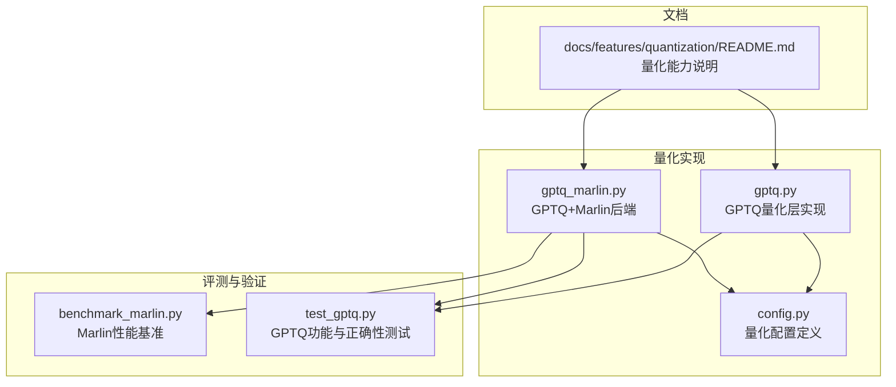
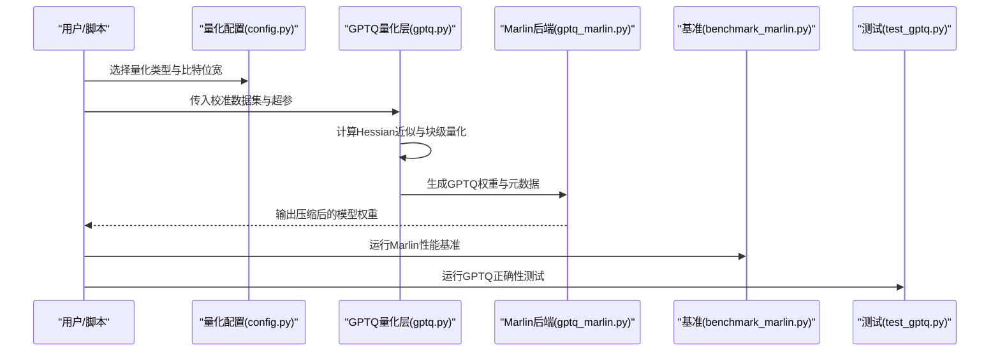
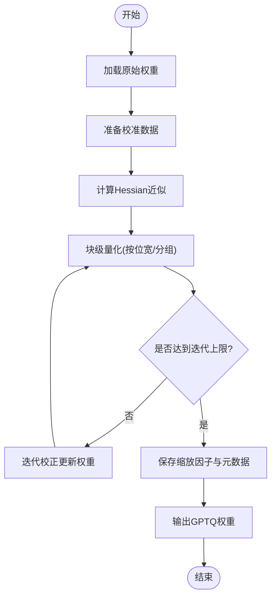
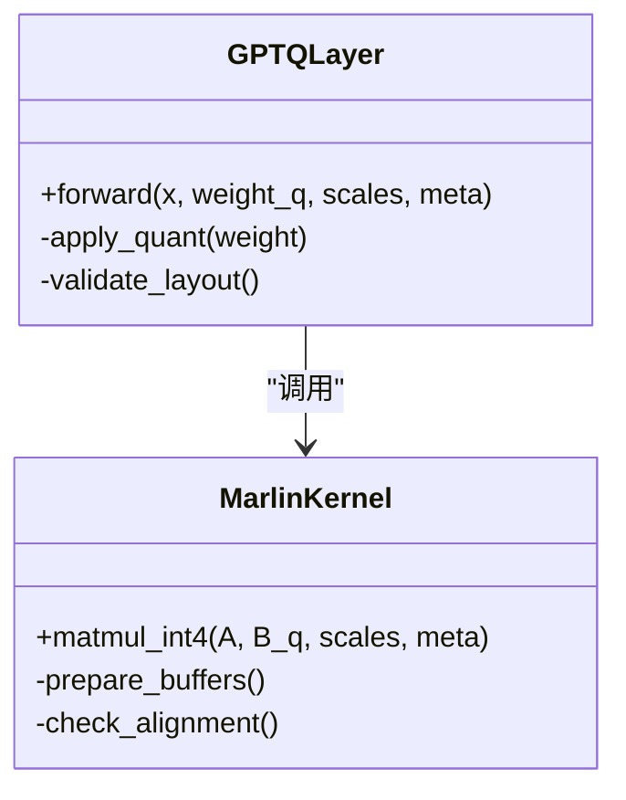
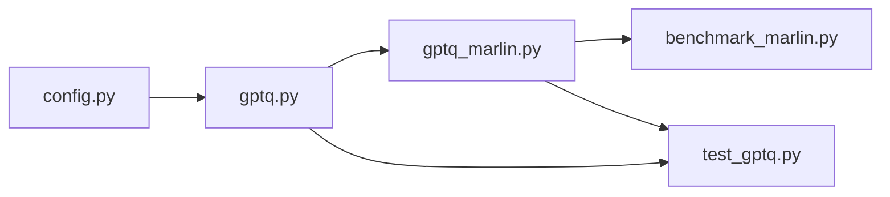

# GPTQ量化方法

<cite>
**本文引用的文件**   
- [vllm/model_executor/layers/quantization/gptq.py](file://vllm/model_executor/layers/quantization/gptq.py)
- [vllm/model_executor/layers/quantization/gptq_marlin.py](file://vllm/model_executor/layers/quantization/gptq_marlin.py)
- [vllm/model_executor/layers/quantization/config.py](file://vllm/model_executor/layers/quantization/config.py)
- [benchmarks/kernels/benchmark_marlin.py](file://benchmarks/kernels/benchmark_marlin.py)
- [tests/quantization/test_gptq.py](file://tests/quantization/test_gptq.py)
- [docs/features/quantization/README.md](file://docs/features/quantization/README.md)
</cite>

## 目录
1. [简介](#简介)
2. [项目结构](#项目结构)
3. [核心组件](#核心组件)
4. [架构总览](#架构总览)
5. [详细组件分析](#详细组件分析)
6. [依赖关系分析](#依赖关系分析)
7. [性能考量](#性能考量)
8. [故障排查指南](#故障排查指南)
9. [结论](#结论)
10. [附录](#附录) 

## 简介
本文件面向希望深入理解并应用GPTQ（Generative Pre-trained Transformer Quantization）量化的工程师与研究者，系统阐述：
- GPTQ的核心算法原理：基于二阶导数的权重量化方法与迭代优化过程。
- 离线量化流程：数据准备、量化参数搜索与模型压缩步骤。
- GPTQ v2的改进特性：精度保持与量化速度提升。
- 配置选项与代码示例：不同比特量的量化设置。
- 与Marlin后端的集成使用与性能优化技巧。

## 项目结构
在vLLM中，GPTQ相关实现主要位于模型执行层的量化模块中，并与基准测试、文档和测试用例相互协作，形成从“量化实现—后端加速—评测验证”的闭环。

图表来源 
- [vllm/model_executor/layers/quantization/gptq.py](file://vllm/model_executor/layers/quantization/gptq.py)
- [vllm/model_executor/layers/quantization/gptq_marlin.py](file://vllm/model_executor/layers/quantization/gptq_marlin.py)
- [vllm/model_executor/layers/quantization/config.py](file://vllm/model_executor/layers/quantization/config.py)
- [benchmarks/kernels/benchmark_marlin.py](file://benchmarks/kernels/benchmark_marlin.py)
- [tests/quantization/test_gptq.py](file://tests/quantization/test_gptq.py)
- [docs/features/quantization/README.md](file://docs/features/quantization/README.md)

章节来源
- [vllm/model_executor/layers/quantization/gptq.py](file://vllm/model_executor/layers/quantization/gptq.py)
- [vllm/model_executor/layers/quantization/gptq_marlin.py](file://vllm/model_executor/layers/quantization/gptq_marlin.py)
- [vllm/model_executor/layers/quantization/config.py](file://vllm/model_executor/layers/quantization/config.py)
- [benchmarks/kernels/benchmark_marlin.py](file://benchmarks/kernels/benchmark_marlin.py)
- [tests/quantization/test_gptq.py](file://tests/quantization/test_gptq.py)
- [docs/features/quantization/README.md](file://docs/features/quantization/README.md)

## 核心组件
- GPTQ量化层：提供基于Hessian近似（二阶导数）的权重块级量化与迭代校正，支持多比特（如4bit/8bit）与分组策略。
- Marlin后端：针对GPTQ格式的高性能INT4矩阵乘内核，显著提升推理吞吐与降低延迟。
- 量化配置：统一的配置对象，描述量化类型、比特位宽、分组大小、校准集等关键超参。
- 基准与测试：Marlin性能基准脚本与GPTQ功能测试，确保正确性与性能回归可控。

章节来源
- [vllm/model_executor/layers/quantization/gptq.py](file://vllm/model_executor/layers/quantization/gptq.py)
- [vllm/model_executor/layers/quantization/gptq_marlin.py](file://vllm/model_executor/layers/quantization/gptq_marlin.py)
- [vllm/model_executor/layers/quantization/config.py](file://vllm/model_executor/layers/quantization/config.py)
- [benchmarks/kernels/benchmark_marlin.py](file://benchmarks/kernels/benchmark_marlin.py)
- [tests/quantization/test_gptq.py](file://tests/quantization/test_gptq.py)

## 架构总览
下图展示了GPTQ在vLLM中的整体工作流：从模型加载、离线量化到推理阶段调用Marlin内核进行高效计算。

图表来源 
- [vllm/model_executor/layers/quantization/config.py](file://vllm/model_executor/layers/quantization/config.py)
- [vllm/model_executor/layers/quantization/gptq.py](file://vllm/model_executor/layers/quantization/gptq.py)
- [vllm/model_executor/layers/quantization/gptq_marlin.py](file://vllm/model_executor/layers/quantization/gptq_marlin.py)
- [benchmarks/kernels/benchmark_marlin.py](file://benchmarks/kernels/benchmark_marlin.py)
- [tests/quantization/test_gptq.py](file://tests/quantization/test_gptq.py)

## 详细组件分析

### GPTQ量化层（gptq.py）
- 设计要点
  - 块级量化：按固定大小的权重块进行量化，平衡精度与压缩率。
  - Hessian近似：利用少量校准样本估计二阶信息，指导权重修正以最小化量化误差。
  - 迭代优化：对每个块进行多次校正迭代，逐步逼近最优量化结果。
  - 多比特支持：通过配置切换4bit/8bit等不同位宽，适配不同硬件与精度需求。
- 关键流程
  - 输入：原始权重、校准数据、量化超参（位宽、分组大小、迭代次数）。
  - 处理：计算Hessian近似→块级量化→迭代校正→生成量化权重与缩放因子。
  - 输出：可被Marlin内核直接读取的GPTQ格式权重。

图表来源 
- [vllm/model_executor/layers/quantization/gptq.py](file://vllm/model_executor/layers/quantization/gptq.py)

章节来源
- [vllm/model_executor/layers/quantization/gptq.py](file://vllm/model_executor/layers/quantization/gptq.py)

### Marlin后端（gptq_marlin.py）
- 设计要点
  - 高性能INT4 GEMM：专为GPTQ格式优化的低比特矩阵乘法内核。
  - 内存友好：减少权重存储与带宽占用，提高吞吐。
  - 兼容接口：与GPTQ量化层无缝对接，透明替换高精度算子。
- 集成方式
  - 加载GPTQ权重：解析量化权重与元数据，构建内核所需数据结构。
  - 前向传播：在注意力或MLP等层中替换为Marlin内核，自动处理数据类型转换与布局对齐。

图表来源 
- [vllm/model_executor/layers/quantization/gptq_marlin.py](file://vllm/model_executor/layers/quantization/gptq_marlin.py)

章节来源
- [vllm/model_executor/layers/quantization/gptq_marlin.py](file://vllm/model_executor/layers/quantization/gptq_marlin.py)

### 量化配置（config.py）
- 关键字段
  - quant_type：量化类型（如GPTQ）。
  - bits：目标位宽（如4、8）。
  - group_size：块分组大小。
  - calibration_samples：校准样本数量。
  - iterations：迭代优化次数。
- 作用
  - 统一入口：所有量化相关超参集中管理，便于实验对比与自动化调优。
  - 向后兼容：新增字段不影响旧配置，保证稳定性。

章节来源
- [vllm/model_executor/layers/quantization/config.py](file://vllm/model_executor/layers/quantization/config.py)

### 基准与测试（benchmark_marlin.py, test_gptq.py）
- 性能基准
  - 覆盖不同形状与批大小，评估Marlin内核在不同负载下的吞吐与延迟。
  - 提供可复现实验脚本，便于硬件适配与版本对比。
- 正确性测试
  - 验证GPTQ量化前后数值一致性（在容忍范围内）。
  - 检查Marlin内核输出与参考实现的对齐情况。

章节来源
- [benchmarks/kernels/benchmark_marlin.py](file://benchmarks/kernels/benchmark_marlin.py)
- [tests/quantization/test_gptq.py](file://tests/quantization/test_gptq.py)

## 依赖关系分析
GPTQ在vLLM中的依赖关系清晰分层：配置层→量化实现层→后端内核层→评测验证层。

图表来源 
- [vllm/model_executor/layers/quantization/config.py](file://vllm/model_executor/layers/quantization/config.py)
- [vllm/model_executor/layers/quantization/gptq.py](file://vllm/model_executor/layers/quantization/gptq.py)
- [vllm/model_executor/layers/quantization/gptq_marlin.py](file://vllm/model_executor/layers/quantization/gptq_marlin.py)
- [benchmarks/kernels/benchmark_marlin.py](file://benchmarks/kernels/benchmark_marlin.py)
- [tests/quantization/test_gptq.py](file://tests/quantization/test_gptq.py)

章节来源
- [vllm/model_executor/layers/quantization/config.py](file://vllm/model_executor/layers/quantization/config.py)
- [vllm/model_executor/layers/quantization/gptq.py](file://vllm/model_executor/layers/quantization/gptq.py)
- [vllm/model_executor/layers/quantization/gptq_marlin.py](file://vllm/model_executor/layers/quantization/gptq_marlin.py)
- [benchmarks/kernels/benchmark_marlin.py](file://benchmarks/kernels/benchmark_marlin.py)
- [tests/quantization/test_gptq.py](file://tests/quantization/test_gptq.py)

## 性能考量
- 位宽选择：4bit显著降低内存与带宽，但需权衡精度损失；8bit更稳健但压缩率低。
- 分组大小：较小的group_size提升精度但增加元数据开销；较大的group_size提升速度但可能引入误差。
- 校准数据：代表性越强，Hessian近似越准确，量化效果越好。
- Marlin内核：优先启用以获得最佳吞吐；注意输入张量对齐与内存布局要求。
- 迭代次数：更多迭代带来更好收敛，但延长离线量化时间；建议根据任务复杂度调整。

[本节为通用指导，不直接分析具体文件]

## 故障排查指南
- 量化后精度下降明显
  - 检查校准数据分布是否与推理数据一致。
  - 增大iterations或减小group_size以提升精度。
- Marlin内核报错或性能异常
  - 确认GPTQ权重格式与元数据完整。
  - 检查张量维度与对齐是否符合内核要求。
- 基准结果不稳定
  - 固定随机种子，重复多次取平均。
  - 排除其他进程干扰，确保GPU资源独占。

章节来源
- [tests/quantization/test_gptq.py](file://tests/quantization/test_gptq.py)
- [benchmarks/kernels/benchmark_marlin.py](file://benchmarks/kernels/benchmark_marlin.py)

## 结论
GPTQ在vLLM中提供了成熟的离线量化方案，结合Marlin后端可实现高效的低比特推理。通过合理配置量化参数、选择合适的校准数据与迭代策略，可在精度与性能之间取得良好平衡。建议在生产环境中结合基准测试与端到端验证，持续优化量化效果。

[本节为总结性内容，不直接分析具体文件]

## 附录
- 快速上手
  - 选择量化类型与位宽（如GPTQ 4bit）。
  - 准备校准数据集（代表性强、规模适中）。
  - 运行离线量化脚本，生成压缩权重。
  - 部署时启用Marlin后端，进行性能验证。
- 参考文档
  - 量化能力概览与使用说明见文档目录。

章节来源
- [docs/features/quantization/README.md](file://docs/features/quantization/README.md)