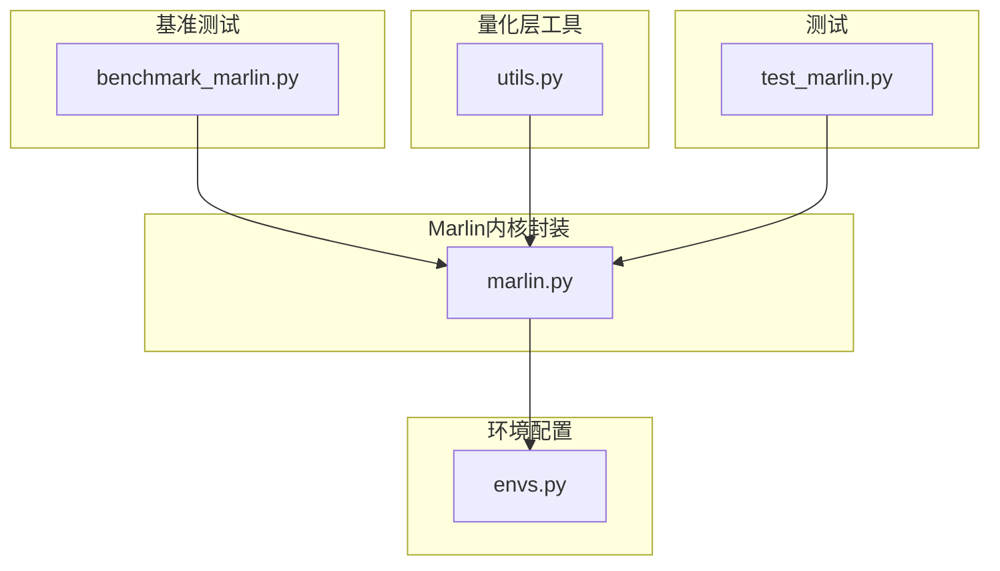
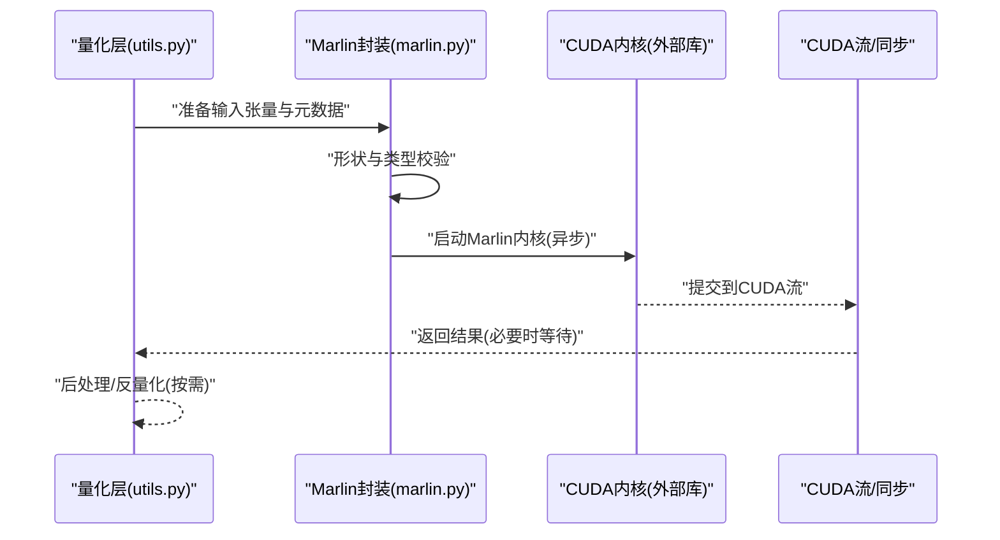
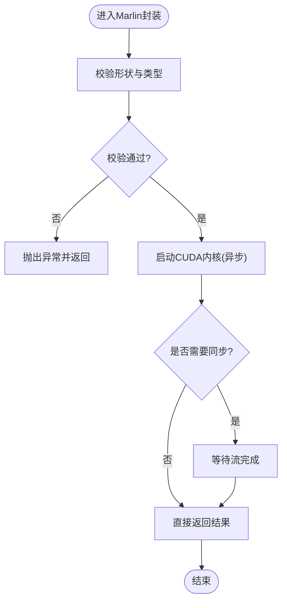
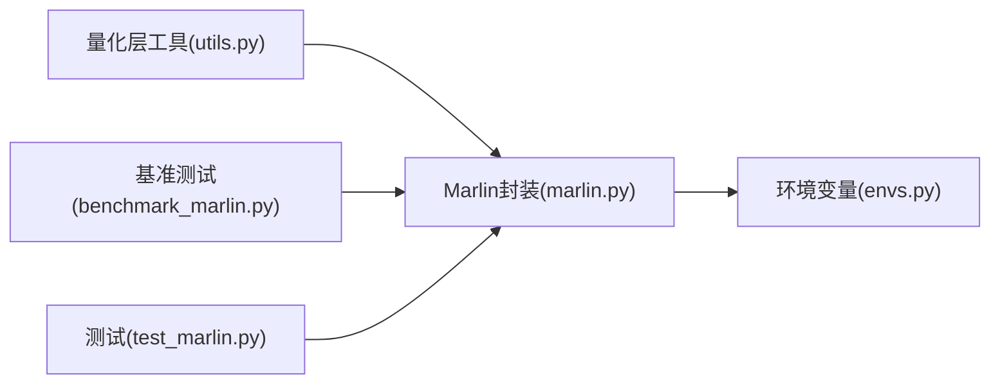

# Marlin量化后端

<cite>
**本文引用的文件**   
- [benchmark_marlin.py](file://benchmarks/kernels/benchmark_marlin.py)
- [quantization_utils.py](file://vllm/model_executor/layers/quantization/utils.py)
- [marlin_kernel.py](file://vllm/kernels/marlin.py)
- [envs.py](file://vllm/envs.py)
- [test_marlin.py](file://tests/kernels/quantization/test_marlin.py)
</cite>

## 目录
1. [简介](#简介)
2. [项目结构](#项目结构)
3. [核心组件](#核心组件)
4. [架构总览](#架构总览)
5. [详细组件分析](#详细组件分析)
6. [依赖关系分析](#依赖关系分析)
7. [性能考量](#性能考量)
8. [故障排查指南](#故障排查指南)
9. [结论](#结论)
10. [附录](#附录)

## 简介
本文件面向希望在 vLLM 中使用 Marlin 作为高效量化推理后端的工程师与研究者，系统阐述其特性、使用方法、架构设计与优化策略。Marlin 在 vLLM 中主要服务于低比特权重量化（如 INT4、INT8）的 GEMM 加速，通过专用 CUDA 内核与内存访问模式优化，显著提升吞吐并降低显存占用。本文同时给出配置选项与调优建议，以及与其它量化后端的对比与选型参考，并提供常见问题诊断方法。

## 项目结构
围绕 Marlin 的关键代码与测试主要集中在以下位置：
- 基准测试：benchmarks/kernels/benchmark_marlin.py
- 量化工具与注册：vllm/model_executor/layers/quantization/utils.py
- Marlin 内核封装与调用：vllm/kernels/marlin.py
- 环境变量与开关：vllm/envs.py
- 单元测试：tests/kernels/quantization/test_marlin.py

图表来源 
- [benchmark_marlin.py:1-200](file://benchmarks/kernels/benchmark_marlin.py#L1-L200)
- [quantization_utils.py:1-300](file://vllm/model_executor/layers/quantization/utils.py#L1-L300)
- [marlin_kernel.py:1-200](file://vllm/kernels/marlin.py#L1-L200)
- [envs.py:1-200](file://vllm/envs.py#L1-L200)
- [test_marlin.py:1-200](file://tests/kernels/quantization/test_marlin.py#L1-L200)

章节来源
- [benchmark_marlin.py:1-200](file://benchmarks/kernels/benchmark_marlin.py#L1-L200)
- [quantization_utils.py:1-300](file://vllm/model_executor/layers/quantization/utils.py#L1-L300)
- [marlin_kernel.py:1-200](file://vllm/kernels/marlin.py#L1-L200)
- [envs.py:1-200](file://vllm/envs.py#L1-L200)
- [test_marlin.py:1-200](file://tests/kernels/quantization/test_marlin.py#L1-L200)

## 核心组件
- Marlin 内核封装模块：提供对底层 Marlin CUDA 内核的统一调用接口，包括形状匹配、参数校验、流同步与错误处理。
- 量化层工具：负责将模型权重按 Marlin 支持的格式进行预处理与打包，并在前向过程中完成反量化或解码路径。
- 基准测试脚本：覆盖不同矩阵规模、批大小与并行度组合，用于评估吞吐与时延。
- 环境变量：控制是否启用 Marlin、选择具体实现变体、调试输出等。
- 单元测试：验证正确性与边界条件，确保在不同硬件与驱动版本下的稳定性。

章节来源
- [marlin_kernel.py:1-200](file://vllm/kernels/marlin.py#L1-L200)
- [quantization_utils.py:1-300](file://vllm/model_executor/layers/quantization/utils.py#L1-L300)
- [benchmark_marlin.py:1-200](file://benchmarks/kernels/benchmark_marlin.py#L1-L200)
- [envs.py:1-200](file://vllm/envs.py#L1-L200)
- [test_marlin.py:1-200](file://tests/kernels/quantization/test_marlin.py#L1-L200)

## 架构总览
Marlin 在 vLLM 中的整体调用流程如下：量化层在前向时根据当前请求的形状与设备上下文，选择 Marlin 内核执行；内核内部进行数据布局转换、块级解码与 GEMM 计算，并通过 CUDA 流异步执行以提升吞吐。

图表来源 
- [quantization_utils.py:1-300](file://vllm/model_executor/layers/quantization/utils.py#L1-L300)
- [marlin_kernel.py:1-200](file://vllm/kernels/marlin.py#L1-L200)

章节来源
- [quantization_utils.py:1-300](file://vllm/model_executor/layers/quantization/utils.py#L1-L300)
- [marlin_kernel.py:1-200](file://vllm/kernels/marlin.py#L1-L200)

## 详细组件分析

### Marlin 内核封装（marlin.py）
- 职责：统一对外暴露 Marlin 内核调用接口，屏蔽底层细节；负责参数校验、形状对齐、流管理与错误传播。
- 关键设计点：
  - 形状与数据类型检查：确保输入矩阵维度、步长与目标内核期望一致。
  - 异步执行：通过 CUDA 流提交任务，减少主机等待开销。
  - 错误处理：捕获内核失败并转换为 Python 异常，便于上层定位问题。
- 适用场景：大矩阵 GEMM、批量推理、多卡并行时的内核调度。

图表来源 
- [marlin_kernel.py:1-200](file://vllm/kernels/marlin.py#L1-L200)

章节来源
- [marlin_kernel.py:1-200](file://vllm/kernels/marlin.py#L1-L200)

### 量化层工具（utils.py）
- 职责：为 Marlin 准备权重与激活数据的布局，执行必要的反量化或解码步骤，保证内核输入满足最优访问模式。
- 关键设计点：
  - 权重打包：将 INT4/INT8 权重按块组织，减少访存碎片。
  - 激活处理：按 token 或批次粒度进行归一化或缩放，适配内核需求。
  - 动态路由：根据运行时形状选择合适的数据路径与内核变体。
- 性能要点：尽量合并多次小操作，避免频繁 host-device 拷贝。

章节来源
- [quantization_utils.py:1-300](file://vllm/model_executor/layers/quantization/utils.py#L1-L300)

### 基准测试（benchmark_marlin.py）
- 职责：覆盖典型工作负载，测量吞吐与时延，帮助定位瓶颈与验证优化效果。
- 关键设计点：
  - 参数扫描：批大小、序列长度、并行度、量化位宽等。
  - 预热与稳定：预热内核缓存，统计稳定区间。
  - 指标采集：GPU 利用率、内存带宽、延迟分布。
- 使用建议：结合生产负载形状进行回归测试，确保升级内核后性能不下降。

章节来源
- [benchmark_marlin.py:1-200](file://benchmarks/kernels/benchmark_marlin.py#L1-L200)

### 环境变量（envs.py）
- 职责：集中管理 Marlin 相关开关与调试选项，便于在不同部署环境中快速切换行为。
- 常见选项类别：
  - 启用/禁用 Marlin 后端
  - 选择特定内核实现或优化级别
  - 开启/关闭日志与性能计数
- 使用建议：在生产环境关闭冗余日志，保留关键性能计数器以便监控。

章节来源
- [envs.py:1-200](file://vllm/envs.py#L1-L200)

### 单元测试（test_marlin.py）
- 职责：验证 Marlin 内核在不同形状、数据类型与边界条件下的正确性。
- 关键用例：
  - 小矩阵与大矩阵混合场景
  - 非对齐维度与特殊步长
  - 错误输入与异常路径
- 使用建议：在修改内核或封装逻辑后，务必运行完整测试集。

章节来源
- [test_marlin.py:1-200](file://tests/kernels/quantization/test_marlin.py#L1-L200)

## 依赖关系分析
Marlin 在 vLLM 中的依赖关系如下：量化层工具依赖 Marlin 封装，基准测试与测试均依赖封装模块；环境变量由封装模块读取以控制行为。

图表来源 
- [quantization_utils.py:1-300](file://vllm/model_executor/layers/quantization/utils.py#L1-L300)
- [marlin_kernel.py:1-200](file://vllm/kernels/marlin.py#L1-L200)
- [benchmark_marlin.py:1-200](file://benchmarks/kernels/benchmark_marlin.py#L1-L200)
- [test_marlin.py:1-200](file://tests/kernels/quantization/test_marlin.py#L1-L200)
- [envs.py:1-200](file://vllm/envs.py#L1-L200)

章节来源
- [quantization_utils.py:1-300](file://vllm/model_executor/layers/quantization/utils.py#L1-L300)
- [marlin_kernel.py:1-200](file://vllm/kernels/marlin.py#L1-L200)
- [benchmark_marlin.py:1-200](file://benchmarks/kernels/benchmark_marlin.py#L1-L200)
- [test_marlin.py:1-200](file://tests/kernels/quantization/test_marlin.py#L1-L200)
- [envs.py:1-200](file://vllm/envs.py#L1-L200)

## 性能考量
- 批大小与并行度：增大批大小可提升 GPU 利用率，但需平衡显存占用与延迟；合理设置并行度以避免通信瓶颈。
- 数据布局与访存：优先使用连续内存与对齐步长，减少转置与拷贝；利用块级量化减少带宽压力。
- 内核选择与预热：选择与形状匹配的内核变体，预热以减少首次调用开销。
- 监控与回归：持续采集吞吐与时延指标，建立回归基线，防止性能退化。

[本节为通用指导，不直接分析具体文件]

## 故障排查指南
- 常见症状：
  - 内核启动失败或返回非法参数：检查形状、数据类型与步长是否符合预期。
  - 性能显著下降：确认是否命中最优内核变体，是否存在频繁的 host-device 拷贝。
  - 结果不正确：核对权重打包与反量化路径，检查数值精度与舍入策略。
- 诊断步骤：
  - 启用详细日志与性能计数器，定位热点与异常路径。
  - 使用基准测试脚本复现问题，缩小参数范围。
  - 运行单元测试集，确保基础正确性。
- 解决建议：
  - 调整环境变量以切换实现或关闭调试输出。
  - 优化数据预处理，减少不必要的中间张量。
  - 更新驱动与 CUDA 版本，确保内核兼容性。

章节来源
- [marlin_kernel.py:1-200](file://vllm/kernels/marlin.py#L1-L200)
- [benchmark_marlin.py:1-200](file://benchmarks/kernels/benchmark_marlin.py#L1-L200)
- [test_marlin.py:1-200](file://tests/kernels/quantization/test_marlin.py#L1-L200)
- [envs.py:1-200](file://vllm/envs.py#L1-L200)

## 结论
Marlin 在 vLLM 中提供了针对低比特量化的专用 CUDA 内核与高效的封装层，通过合理的内存布局与异步执行策略，显著提升了推理吞吐并降低了显存占用。结合基准测试与环境变量，用户可根据实际负载进行调优与监控。建议在上线前完成完整的正确性与性能回归测试，确保稳定性与一致性。

[本节为总结性内容，不直接分析具体文件]

## 附录
- 使用建议：
  - 在生产环境关闭冗余日志，仅保留关键指标。
  - 针对不同模型与负载定制基准测试，建立性能基线。
  - 定期更新内核与依赖，关注社区发布的优化与修复。
- 扩展阅读：
  - 量化层工具与 Marlin 封装的接口说明
  - 基准测试脚本的参数说明与结果解读
  - 环境变量清单与默认值

[本节为补充信息，不直接分析具体文件]