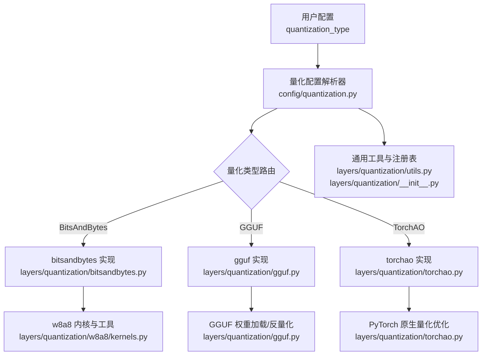
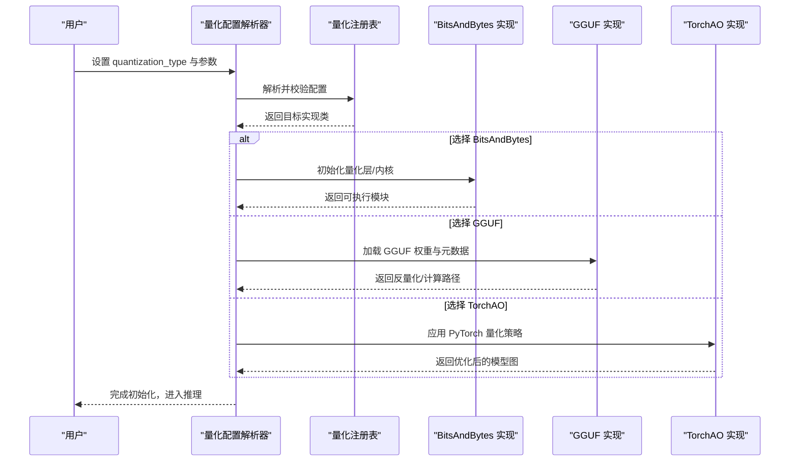
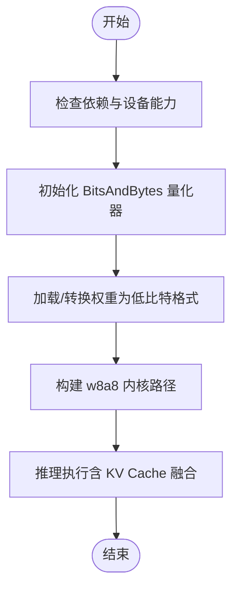
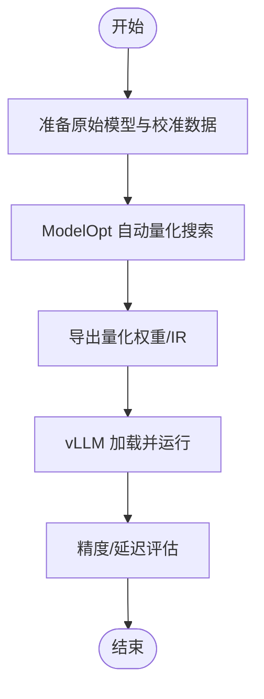
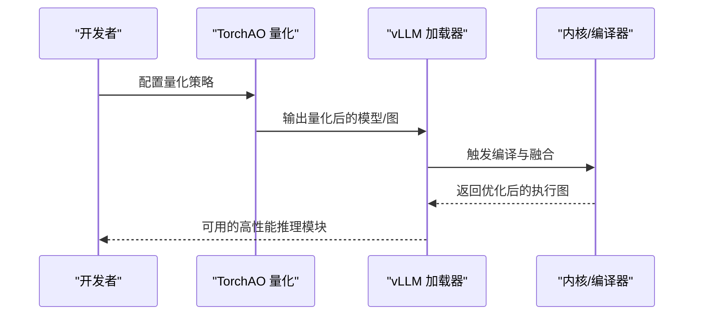
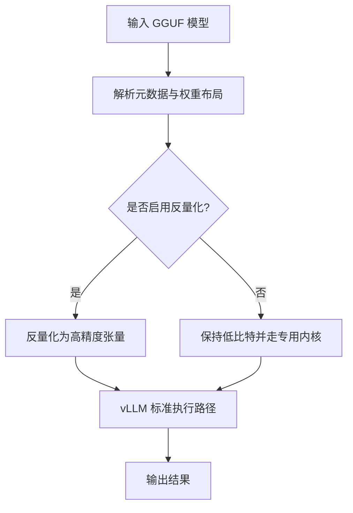
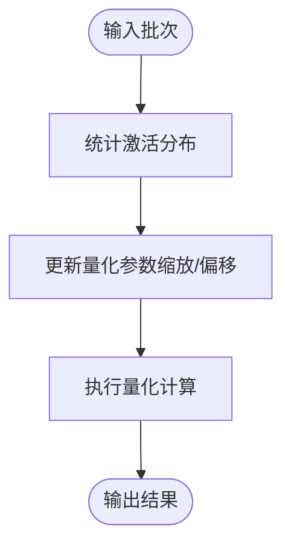
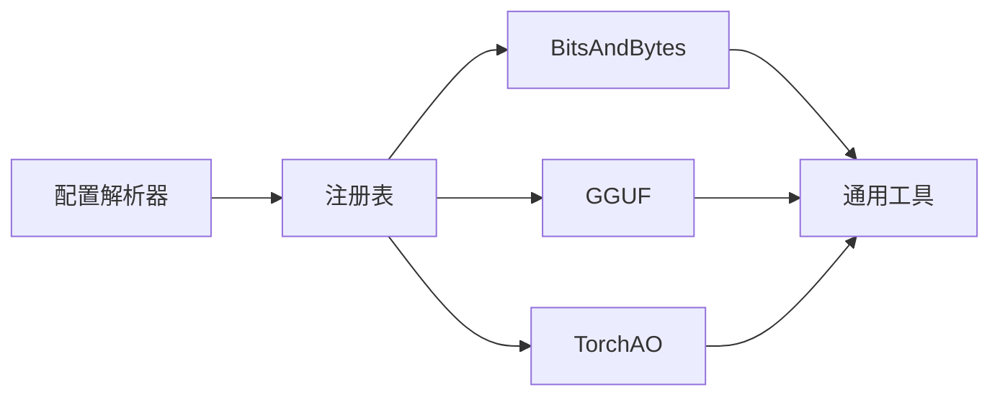

# 其他量化方法

<cite>
**本文引用的文件**   
- [vllm/config/quantization.py](file://vllm/config/quantization.py)
- [vllm/model_executor/layers/quantization/bitsandbytes.py](file://vllm/model_executor/layers/quantization/bitsandbytes.py)
- [vllm/model_executor/layers/quantization/gguf.py](file://vllm/model_executor/layers/quantization/gguf.py)
- [vllm/model_executor/layers/quantization/torchao.py](file://vllm/model_executor/layers/quantization/torchao.py)
- [vllm/model_executor/layers/quantization/utils.py](file://vllm/model_executor/layers/quantization/utils.py)
- [vllm/model_executor/layers/quantization/__init__.py](file://vllm/model_executor/layers/quantization/__init__.py)
- [vllm/model_executor/layers/quantization/w8a8/kernels.py](file://vllm/model_executor/layers/quantization/w8a8/kernels.py)
- [benchmarks/kernels/benchmark_quant.py](file://benchmarks/kernels/benchmark_quant.py)
- [tests/quantization/test_bitsandbytes.py](file://tests/quantization/test_bitsandbytes.py)
- [tests/quantization/test_gguf.py](file://tests/quantization/test_gguf.py)
- [tests/quantization/test_torchao.py](file://tests/quantization/test_torchao.py)
- [docs/features/quantization/README.md](file://docs/features/quantization/README.md)
</cite>

## 目录
1. [简介](#简介)
2. [项目结构](#项目结构)
3. [核心组件](#核心组件)
4. [架构总览](#架构总览)
5. [详细组件分析](#详细组件分析)
6. [依赖关系分析](#依赖关系分析)
7. [性能考量](#性能考量)
8. [故障排查指南](#故障排查指南)
9. [结论](#结论)
10. [附录](#附录)

## 简介
本章节面向希望在 vLLM 中使用“其他量化方法与工具库”的用户，系统介绍 BitsAndBytes、ModelOpt、TorchAO、GGUF 等量化方案在 vLLM 中的集成方式与使用要点，并补充在线/动态量化的原理与适用场景。同时提供不同量化方法的对比与选型建议，以及迁移与兼容性处理指导，帮助读者快速落地。

## 项目结构
vLLM 的量化能力以“配置驱动 + 插件式加载”的方式组织：
- 配置层：统一入口负责解析与校验量化类型、参数与后端选择。
- 执行层：按量化类型分发到对应实现（如 bitsandbytes、gguf、torchao 等）。
- 内核层：针对特定量化格式提供高性能算子与转换路径。
- 基准与测试：覆盖关键路径的正确性与性能回归。

图表来源 
- [vllm/config/quantization.py](file://vllm/config/quantization.py)
- [vllm/model_executor/layers/quantization/bitsandbytes.py](file://vllm/model_executor/layers/quantization/bitsandbytes.py)
- [vllm/model_executor/layers/quantization/gguf.py](file://vllm/model_executor/layers/quantization/gguf.py)
- [vllm/model_executor/layers/quantization/torchao.py](file://vllm/model_executor/layers/quantization/torchao.py)
- [vllm/model_executor/layers/quantization/utils.py](file://vllm/model_executor/layers/quantization/utils.py)
- [vllm/model_executor/layers/quantization/__init__.py](file://vllm/model_executor/layers/quantization/__init__.py)
- [vllm/model_executor/layers/quantization/w8a8/kernels.py](file://vllm/model_executor/layers/quantization/w8a8/kernels.py)

章节来源
- [vllm/config/quantization.py](file://vllm/config/quantization.py)
- [vllm/model_executor/layers/quantization/__init__.py](file://vllm/model_executor/layers/quantization/__init__.py)

## 核心组件
- 量化配置解析器：集中管理 quantization_type、参数映射、后端开关与兼容性检查。
- BitsAndBytes 集成：支持多种低比特权重格式与激活量化，提供 w8a8 等路径。
- GGUF 集成：直接加载 GGUF 量化模型，并在推理时按需反量化或走专用内核。
- TorchAO 集成：利用 PyTorch 原生量化能力进行权重量化与编译期优化。
- 通用工具与注册表：封装类型枚举、工厂方法、设备/精度适配与错误提示。

章节来源
- [vllm/config/quantization.py](file://vllm/config/quantization.py)
- [vllm/model_executor/layers/quantization/utils.py](file://vllm/model_executor/layers/quantization/utils.py)
- [vllm/model_executor/layers/quantization/__init__.py](file://vllm/model_executor/layers/quantization/__init__.py)

## 架构总览
下图展示从配置到具体实现的调用链，以及各量化方案的职责边界。

图表来源 
- [vllm/config/quantization.py](file://vllm/config/quantization.py)
- [vllm/model_executor/layers/quantization/bitsandbytes.py](file://vllm/model_executor/layers/quantization/bitsandbytes.py)
- [vllm/model_executor/layers/quantization/gguf.py](file://vllm/model_executor/layers/quantization/gguf.py)
- [vllm/model_executor/layers/quantization/torchao.py](file://vllm/model_executor/layers/quantization/torchao.py)

## 详细组件分析

### BitsAndBytes 量化集成
- 功能要点
  - 支持多种低比特权重格式（如 int4/int8）与激活量化（如 w8a8）。
  - 通过 w8a8 内核路径提升吞吐，减少内存带宽压力。
  - 与 vLLM 的 KV Cache 和注意力内核协同，降低额外开销。
- 使用方法
  - 在配置中指定 quantization_type 为 bitsandbytes，并选择相应子模式（如 per-tensor/per-channel、是否量化激活等）。
  - 确保安装对应的依赖与 CUDA 版本匹配。
- 注意事项
  - 某些 GPU 架构对低比特 GEMM 的支持存在差异，需参考平台矩阵。
  - 激活量化可能带来精度下降，建议在验证集上评估。

章节来源
- [vllm/model_executor/layers/quantization/bitsandbytes.py](file://vllm/model_executor/layers/quantization/bitsandbytes.py)
- [vllm/model_executor/layers/quantization/w8a8/kernels.py](file://vllm/model_executor/layers/quantization/w8a8/kernels.py)
- [benchmarks/kernels/benchmark_quant.py](file://benchmarks/kernels/benchmark_quant.py)
- [tests/quantization/test_bitsandbytes.py](file://tests/quantization/test_bitsandbytes.py)

### ModelOpt 量化框架集成
- 功能要点
  - 提供自动量化搜索（AutoQuant）与模型压缩管线。
  - 可与 vLLM 的模型加载流程对接，生成适合部署的量化权重。
- 使用方法
  - 在导出阶段启用 ModelOpt 的自动搜索策略，输出兼容 vLLM 的中间表示或权重。
  - 将生成的权重交由 vLLM 加载，结合其运行时内核获得加速效果。
- 注意事项
  - 自动搜索耗时较长，建议离线进行；生产环境优先使用已验证的配置。
  - 不同模型结构的量化敏感度不同，需结合任务指标调优。

章节来源
- [docs/features/quantization/README.md](file://docs/features/quantization/README.md)

### TorchAO 量化工具使用
- 功能要点
  - 基于 PyTorch 原生量化能力，提供权重量化、图级优化与编译期融合。
  - 与 vLLM 的编译路径配合，减少运行时开销。
- 使用方法
  - 在模型导出或初始化阶段启用 TorchAO 量化策略（如 INT8/FP8 权重、激活量化等）。
  - 结合 vLLM 的编译选项以获得最佳性能。
- 注意事项
  - 需要较新的 PyTorch 与 CUDA 版本；部分特性受硬件限制。
  - 激活量化可能影响数值稳定性，建议在小规模数据上先行验证。

章节来源
- [vllm/model_executor/layers/quantization/torchao.py](file://vllm/model_executor/layers/quantization/torchao.py)
- [tests/quantization/test_torchao.py](file://tests/quantization/test_torchao.py)

### GGUF 格式量化模型支持与转换流程
- 功能要点
  - 直接加载 GGUF 格式的量化模型，避免重复转换。
  - 在推理时按需反量化至高精度或走专用内核路径。
- 使用方法
  - 指定 quantization_type 为 gguf，并提供 GGUF 模型路径。
  - 根据需求选择是否启用反量化或保持低比特路径。
- 注意事项
  - GGUF 版本与 vLLM 支持的元数据字段需对齐。
  - 某些层可能无法完全走低比特路径，会回退到通用实现。

章节来源
- [vllm/model_executor/layers/quantization/gguf.py](file://vllm/model_executor/layers/quantization/gguf.py)
- [tests/quantization/test_gguf.py](file://tests/quantization/test_gguf.py)

### 在线量化与动态量化
- 原理
  - 在线/动态量化在推理过程中根据输入分布或统计信息动态调整量化参数（如缩放因子），以提升精度与稳定性。
  - 通常用于激活量化或混合精度场景，与静态权重量化互补。
- 使用场景
  - 输入分布变化较大、对延迟敏感且允许少量额外计算的在线服务。
  - 与 w8a8 等路径结合，平衡吞吐与精度。
- 注意事项
  - 动态更新量化参数会带来额外开销，需权衡收益。
  - 需保证数值稳定与溢出保护。

章节来源
- [vllm/model_executor/layers/quantization/utils.py](file://vllm/model_executor/layers/quantization/utils.py)

## 依赖关系分析
- 组件耦合
  - 配置解析器与注册表解耦具体实现，便于扩展新量化后端。
  - 各量化实现依赖通用工具进行类型转换、设备检测与错误处理。
- 外部依赖
  - BitsAndBytes：依赖底层 CUDA 内核与特定 GPU 能力。
  - TorchAO：依赖 PyTorch 的量化与编译子系统。
  - GGUF：依赖 GGUF 解析器与元数据兼容性。
- 潜在循环依赖
  - 通过注册表与工厂模式避免循环导入，保持模块内聚。

图表来源 
- [vllm/config/quantization.py](file://vllm/config/quantization.py)
- [vllm/model_executor/layers/quantization/utils.py](file://vllm/model_executor/layers/quantization/utils.py)
- [vllm/model_executor/layers/quantization/__init__.py](file://vllm/model_executor/layers/quantization/__init__.py)

章节来源
- [vllm/model_executor/layers/quantization/__init__.py](file://vllm/model_executor/layers/quantization/__init__.py)
- [vllm/model_executor/layers/quantization/utils.py](file://vllm/model_executor/layers/quantization/utils.py)

## 性能考量
- 吞吐与延迟
  - w8a8 路径在多数 GPU 上能显著提升吞吐，但需关注激活量化的精度损失。
  - GGUF 直接加载可减少转换时间，适合快速部署。
  - TorchAO 的图级优化可降低运行时开销，但编译时间较长。
- 内存占用
  - 低比特权重显著降低显存占用，有利于更大批处理或更长上下文。
  - 动态量化可能引入临时缓冲，需监控峰值显存。
- 硬件适配
  - 不同 GPU 架构对低比特 GEMM 的支持程度不同，建议参考官方矩阵。
  - ROCm/CPU/XPU 等平台可能有不同的最优路径。

[本节为通用指导，不直接分析具体文件]

## 故障排查指南
- 常见问题
  - 依赖缺失或版本不匹配：确认已安装正确的量化库与 CUDA/PyTorch 版本。
  - 设备不支持：检查 GPU 架构与内核支持矩阵。
  - 精度异常：关闭激活量化或降低量化位宽，定位问题层。
  - GGUF 加载失败：核对 GGUF 版本与元数据字段。
- 调试步骤
  - 启用详细日志，观察量化路径选择与回退行为。
  - 使用基准脚本验证关键路径的性能与正确性。
  - 逐步缩小范围，定位具体层或算子。

章节来源
- [benchmarks/kernels/benchmark_quant.py](file://benchmarks/kernels/benchmark_quant.py)
- [tests/quantization/test_bitsandbytes.py](file://tests/quantization/test_bitsandbytes.py)
- [tests/quantization/test_gguf.py](file://tests/quantization/test_gguf.py)
- [tests/quantization/test_torchao.py](file://tests/quantization/test_torchao.py)

## 结论
vLLM 通过统一的配置与注册机制，将 BitsAndBytes、ModelOpt、TorchAO、GGUF 等多种量化方案有机整合。用户可根据任务需求、硬件条件与部署约束选择合适的量化路径，并结合在线/动态量化进一步提升鲁棒性。建议在生产环境中进行充分的精度与性能评估，确保稳定性与效率兼顾。

[本节为总结性内容，不直接分析具体文件]

## 附录
- 选型建议
  - 追求极致吞吐与显存节省：优先尝试 BitsAndBytes w8a8。
  - 已有 GGUF 模型资产：直接使用 GGUF 路径，减少转换成本。
  - 希望利用 PyTorch 生态优化：采用 TorchAO 进行图级量化与编译。
  - 需要自动化搜索与压缩：使用 ModelOpt 离线生成高质量量化权重。
- 迁移与兼容性
  - 从静态量化迁移到动态量化：逐步开启激活量化与参数更新，监控精度。
  - 跨平台迁移：注意不同后端（CUDA/ROCm/CPU/XPU）的内核支持与性能差异。
  - 版本升级：关注 PyTorch、CUDA、量化库的版本矩阵，避免破坏性变更。

[本节为通用指导，不直接分析具体文件]