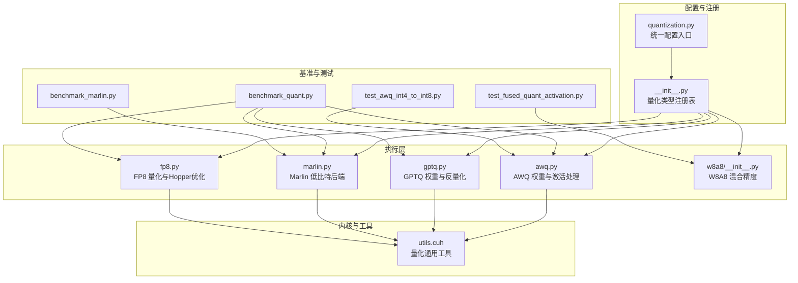
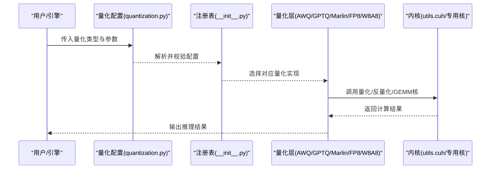
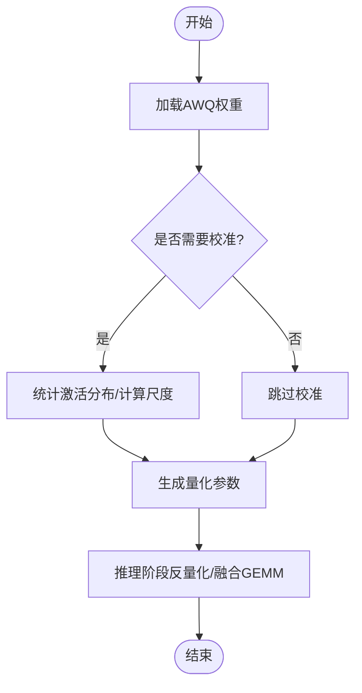
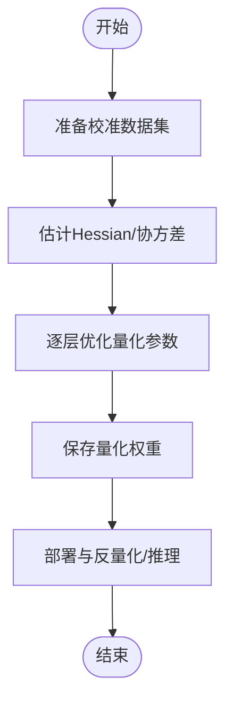
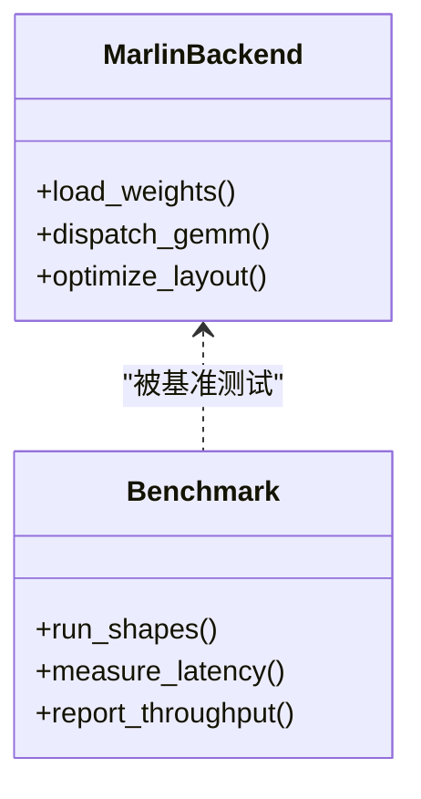
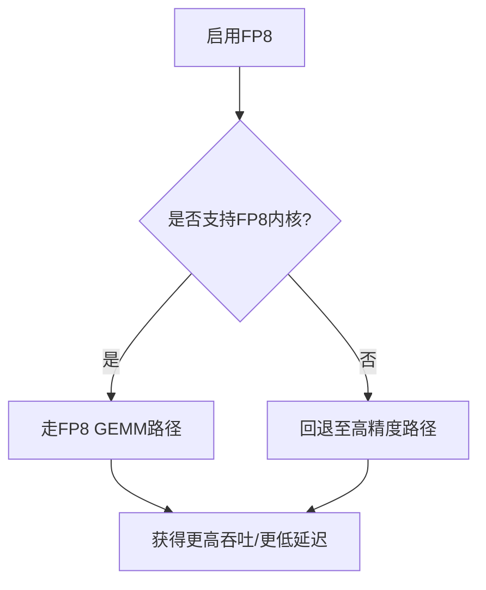
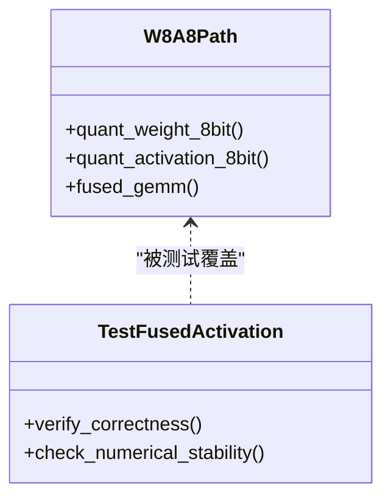
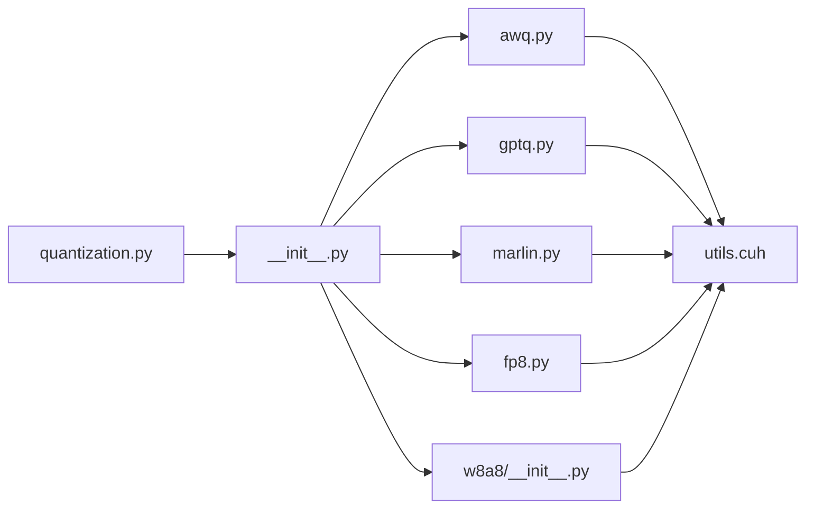

# 支持的量化方法

<cite>
**本文引用的文件**   
- [vllm/config/quantization.py](file://vllm/config/quantization.py)
- [vllm/model_executor/layers/quantization/__init__.py](file://vllm/model_executor/layers/quantization/__init__.py)
- [vllm/model_executor/layers/quantization/awq.py](file://vllm/model_executor/layers/quantization/awq.py)
- [vllm/model_executor/layers/quantization/gptq.py](file://vllm/model_executor/layers/quantization/gptq.py)
- [vllm/model_executor/layers/quantization/marlin.py](file://vllm/model_executor/layers/quantization/marlin.py)
- [vllm/model_executor/layers/quantization/fp8.py](file://vllm/model_executor/layers/quantization/fp8.py)
- [vllm/model_executor/layers/quantization/w8a8/__init__.py](file://vllm/model_executor/layers/quantization/w8a8/__init__.py)
- [vllm/model_executor/layers/quantization/utils.cuh](file://vllm/model_executor/layers/quantization/utils.cuh)
- [benchmarks/kernels/benchmark_marlin.py](file://benchmarks/kernels/benchmark_marlin.py)
- [benchmarks/kernels/benchmark_quant.py](file://benchmarks/kernels/benchmark_quant.py)
- [tests/quantization/test_awq_int4_to_int8.py](file://tests/quantization/test_awq_int4_to_int8.py)
- [tests/quantization/test_fused_quant_activation.py](file://tests/quantization/test_fused_quant_activation.py)
</cite>

## 目录
1. [简介](#简介)
2. [项目结构](#项目结构)
3. [核心组件](#核心组件)
4. [架构总览](#架构总览)
5. [详细组件分析](#详细组件分析)
6. [依赖关系分析](#依赖关系分析)
7. [性能考量](#性能考量)
8. [故障排查指南](#故障排查指南)
9. [结论](#结论)
10. [附录：配置示例与最佳实践](#附录：配置示例与最佳实践)

## 简介
本文件系统性梳理 vLLM 支持的量化方法与后端，重点覆盖 AWQ、GPTQ、Marlin、FP8 以及 W4A16/W8A8 等混合精度方案。内容包含原理概述、离线/在线流程、关键实现位置、配置方式、性能优化建议与选型指南，帮助读者在不同硬件与模型规模下选择合适路径并落地部署。

## 项目结构
vLLM 的量化能力主要分布在以下模块：
- 配置层：统一注册与解析量化类型、参数校验与默认值管理
- 执行层：按量化类型分发的具体算子与权重加载逻辑
- 内核层：CUDA/C++ 高性能内核（如 Marlin、AWQ/GPTQ 专用 GEMM）
- 基准与测试：针对各量化的性能与正确性验证

图表来源
- [vllm/config/quantization.py](file://vllm/config/quantization.py)
- [vllm/model_executor/layers/quantization/__init__.py](file://vllm/model_executor/layers/quantization/__init__.py)
- [vllm/model_executor/layers/quantization/awq.py](file://vllm/model_executor/layers/quantization/awq.py)
- [vllm/model_executor/layers/quantization/gptq.py](file://vllm/model_executor/layers/quantization/gptq.py)
- [vllm/model_executor/layers/quantization/marlin.py](file://vllm/model_executor/layers/quantization/marlin.py)
- [vllm/model_executor/layers/quantization/fp8.py](file://vllm/model_executor/layers/quantization/fp8.py)
- [vllm/model_executor/layers/quantization/w8a8/__init__.py](file://vllm/model_executor/layers/quantization/w8a8/__init__.py)
- [vllm/model_executor/layers/quantization/utils.cuh](file://vllm/model_executor/layers/quantization/utils.cuh)
- [benchmarks/kernels/benchmark_quant.py](file://benchmarks/kernels/benchmark_quant.py)
- [benchmarks/kernels/benchmark_marlin.py](file://benchmarks/kernels/benchmark_marlin.py)
- [tests/quantization/test_awq_int4_to_int8.py](file://tests/quantization/test_awq_int4_to_int8.py)
- [tests/quantization/test_fused_quant_activation.py](file://tests/quantization/test_fused_quant_activation.py)

章节来源
- [vllm/config/quantization.py](file://vllm/config/quantization.py)
- [vllm/model_executor/layers/quantization/__init__.py](file://vllm/model_executor/layers/quantization/__init__.py)

## 核心组件
- 量化配置中心：负责识别与校验量化类型（AWQ、GPTQ、Marlin、FP8、W8A8 等），提供默认参数与平台兼容性检查
- 量化执行器：根据配置选择对应后端，完成权重加载、反量化、激活量化与融合算子调用
- 内核库：针对不同量化格式的高效 GEMM 与量化/反量化核，如 Marlin 的低比特内核、AWQ/GPTQ 的反量化路径、FP8 的 Hopper 加速
- 基准与测试：覆盖不同形状与批大小的吞吐/延迟评估，以及数值正确性与融合算子的回归测试

章节来源
- [vllm/config/quantization.py](file://vllm/config/quantization.py)
- [vllm/model_executor/layers/quantization/__init__.py](file://vllm/model_executor/layers/quantization/__init__.py)
- [vllm/model_executor/layers/quantization/utils.cuh](file://vllm/model_executor/layers/quantization/utils.cuh)

## 架构总览
下图展示从“配置解析”到“内核执行”的关键路径，体现 vLLM 如何根据量化类型动态选择后端。

图表来源
- [vllm/config/quantization.py](file://vllm/config/quantization.py)
- [vllm/model_executor/layers/quantization/__init__.py](file://vllm/model_executor/layers/quantization/__init__.py)
- [vllm/model_executor/layers/quantization/awq.py](file://vllm/model_executor/layers/quantization/awq.py)
- [vllm/model_executor/layers/quantization/gptq.py](file://vllm/model_executor/layers/quantization/gptq.py)
- [vllm/model_executor/layers/quantization/marlin.py](file://vllm/model_executor/layers/quantization/marlin.py)
- [vllm/model_executor/layers/quantization/fp8.py](file://vllm/model_executor/layers/quantization/fp8.py)
- [vllm/model_executor/layers/quantization/w8a8/__init__.py](file://vllm/model_executor/layers/quantization/w8a8/__init__.py)
- [vllm/model_executor/layers/quantization/utils.cuh](file://vllm/model_executor/layers/quantization/utils.cuh)

## 详细组件分析

### AWQ（Activation-aware Weight Quantization）
- 原理要点
  - 以激活分布感知的方式对权重进行量化，通常采用逐通道或分组尺度，结合校准集统计信息确定缩放因子
  - 推理时通过反量化将低比特权重还原为高精度参与 GEMM，或在特定后端中直接支持低比特 GEMM
- 在 vLLM 的实现位置
  - 量化层实现位于 awq.py，负责权重加载、反量化路径与激活处理
  - 相关测试覆盖 int4→int8 转换与融合激活路径
- 自动量化配置与优化
  - 通过配置中心启用 AWQ，可设置量化粒度、校准策略与目标精度
  - 结合基准脚本 benchmark_quant.py 对不同形状/批大小进行调优
- 使用建议
  - 适合中等规模模型与需要较高精度的场景；若追求极致吞吐且硬件支持，可考虑 Marlin/F8

图表来源
- [vllm/model_executor/layers/quantization/awq.py](file://vllm/model_executor/layers/quantization/awq.py)
- [benchmarks/kernels/benchmark_quant.py](file://benchmarks/kernels/benchmark_quant.py)
- [tests/quantization/test_awq_int4_to_int8.py](file://tests/quantization/test_awq_int4_to_int8.py)

章节来源
- [vllm/model_executor/layers/quantization/awq.py](file://vllm/model_executor/layers/quantization/awq.py)
- [benchmarks/kernels/benchmark_quant.py](file://benchmarks/kernels/benchmark_quant.py)
- [tests/quantization/test_awq_int4_to_int8.py](file://tests/quantization/test_awq_int4_to_int8.py)

### GPTQ（Generative Pre-trained Transformer Quantization）
- 原理要点
  - 基于二阶信息的离线量化，逐层近似 Hessian 逆矩阵，最小化量化误差
  - 推理阶段通常进行反量化后进入高精度 GEMM，或通过专用内核加速
- 在 vLLM 的实现位置
  - gptq.py 提供权重加载与反量化路径，配合 utils.cuh 中的通用量化工具
- 离线流程与在线优化
  - 离线：准备校准数据、估计 Hessian、逐层求解最优量化参数
  - 在线：反量化+GEMM，或结合编译器/图优化减少开销
- 使用建议
  - 适合对精度敏感的大模型；若硬件具备低比特 GEMM 能力，可进一步探索 Marlin 或 FP8

图表来源
- [vllm/model_executor/layers/quantization/gptq.py](file://vllm/model_executor/layers/quantization/gptq.py)
- [vllm/model_executor/layers/quantization/utils.cuh](file://vllm/model_executor/layers/quantization/utils.cuh)

章节来源
- [vllm/model_executor/layers/quantization/gptq.py](file://vllm/model_executor/layers/quantization/gptq.py)
- [vllm/model_executor/layers/quantization/utils.cuh](file://vllm/model_executor/layers/quantization/utils.cuh)

### Marlin 量化后端
- 特性与场景
  - 面向极低比特（如 INT4/INT3）的高性能后端，专为大模型推理设计
  - 通过专用内核与内存布局优化，显著降低带宽与计算开销
- 在 vLLM 的实现位置
  - marlin.py 集成 Marlin 后端，提供权重装载与内核调度
  - 基准脚本 benchmark_marlin.py 用于评估吞吐与延迟
- 低比特实现要点
  - 权重打包格式、块级量化、融合 GEMM 与访存优化
  - 与硬件指令集（如 Tensor Core）协同提升吞吐

图表来源
- [vllm/model_executor/layers/quantization/marlin.py](file://vllm/model_executor/layers/quantization/marlin.py)
- [benchmarks/kernels/benchmark_marlin.py](file://benchmarks/kernels/benchmark_marlin.py)

章节来源
- [vllm/model_executor/layers/quantization/marlin.py](file://vllm/model_executor/layers/quantization/marlin.py)
- [benchmarks/kernels/benchmark_marlin.py](file://benchmarks/kernels/benchmark_marlin.py)

### FP8 量化与 Hopper 架构优化
- 优势
  - 原生支持 FP8 的 GPU（如 Hopper）可直接在张量核心上执行 FP8 GEMM，减少反量化开销
  - 在注意力与 MoE 等热点路径上收益明显
- 在 vLLM 的实现位置
  - fp8.py 提供 FP8 权重与激活的处理、尺度管理与内核调度
- 配置与优化
  - 开启 FP8 模式后，优先选择支持 FP8 的内核路径
  - 结合编译选项与 CUDA 版本确保内核可用

图表来源
- [vllm/model_executor/layers/quantization/fp8.py](file://vllm/model_executor/layers/quantization/fp8.py)

章节来源
- [vllm/model_executor/layers/quantization/fp8.py](file://vllm/model_executor/layers/quantization/fp8.py)

### W4A16 / W8A8 混合精度量化
- 应用场景
  - W4A16：权重 4bit，激活保持 16bit，兼顾压缩与精度
  - W8A8：权重与激活均为 8bit，适合高吞吐场景
- 在 vLLM 的实现位置
  - w8a8/__init__.py 提供混合精度路径与融合激活处理
  - 测试覆盖融合激活的正确性
- 最佳实践
  - 根据模型敏感度选择 W4A16 或 W8A8
  - 结合基准脚本评估不同形状的吞吐差异

图表来源
- [vllm/model_executor/layers/quantization/w8a8/__init__.py](file://vllm/model_executor/layers/quantization/w8a8/__init__.py)
- [tests/quantization/test_fused_quant_activation.py](file://tests/quantization/test_fused_quant_activation.py)

章节来源
- [vllm/model_executor/layers/quantization/w8a8/__init__.py](file://vllm/model_executor/layers/quantization/w8a8/__init__.py)
- [tests/quantization/test_fused_quant_activation.py](file://tests/quantization/test_fused_quant_activation.py)

## 依赖关系分析
- 配置与注册
  - quantization.py 定义量化类型与参数，__init__.py 维护类型到实现的映射
- 执行层依赖
  - 各量化实现依赖 utils.cuh 提供的通用工具（如尺度计算、数据类型转换）
- 内核与基准
  - 基准脚本驱动不同量化路径的性能测量，辅助参数调优

图表来源
- [vllm/config/quantization.py](file://vllm/config/quantization.py)
- [vllm/model_executor/layers/quantization/__init__.py](file://vllm/model_executor/layers/quantization/__init__.py)
- [vllm/model_executor/layers/quantization/awq.py](file://vllm/model_executor/layers/quantization/awq.py)
- [vllm/model_executor/layers/quantization/gptq.py](file://vllm/model_executor/layers/quantization/gptq.py)
- [vllm/model_executor/layers/quantization/marlin.py](file://vllm/model_executor/layers/quantization/marlin.py)
- [vllm/model_executor/layers/quantization/fp8.py](file://vllm/model_executor/layers/quantization/fp8.py)
- [vllm/model_executor/layers/quantization/w8a8/__init__.py](file://vllm/model_executor/layers/quantization/w8a8/__init__.py)
- [vllm/model_executor/layers/quantization/utils.cuh](file://vllm/model_executor/layers/quantization/utils.cuh)

章节来源
- [vllm/config/quantization.py](file://vllm/config/quantization.py)
- [vllm/model_executor/layers/quantization/__init__.py](file://vllm/model_executor/layers/quantization/__init__.py)

## 性能考量
- 选择依据
  - 硬件能力：是否支持 FP8 内核、低比特 GEMM 指令
  - 模型敏感度：对精度要求高的模型优先考虑 GPTQ/AWQ，追求吞吐可选 Marlin/FP8
  - 工作负载：批大小、序列长度、注意力模式影响不同量化的收益
- 调优建议
  - 使用 benchmark_quant.py 与 benchmark_marlin.py 进行形状扫描与参数搜索
  - 关注内存带宽与缓存命中，合理设置块大小与并行度
  - 对于融合激活路径，确保内核版本与 CUDA 环境匹配

[本节为通用指导，不直接分析具体文件]

## 故障排查指南
- 常见问题
  - 量化类型未注册或参数非法：检查 quantization.py 的配置项与默认值
  - 内核不可用：确认 CUDA/驱动版本与内核编译选项
  - 数值异常：核对校准数据质量与尺度计算路径
- 定位手段
  - 运行基准脚本观察吞吐/延迟突变
  - 使用测试用例验证融合激活与量化路径的正确性

章节来源
- [benchmarks/kernels/benchmark_quant.py](file://benchmarks/kernels/benchmark_quant.py)
- [benchmarks/kernels/benchmark_marlin.py](file://benchmarks/kernels/benchmark_marlin.py)
- [tests/quantization/test_awq_int4_to_int8.py](file://tests/quantization/test_awq_int4_to_int8.py)
- [tests/quantization/test_fused_quant_activation.py](file://tests/quantization/test_fused_quant_activation.py)

## 结论
vLLM 提供了完善的量化生态，覆盖从 AWQ/GPTQ 的离线校准到 Marlin/FP8 的高性能后端。实际选型需结合硬件能力、模型敏感度与工作负载特征，并通过基准与测试闭环验证。建议在大规模部署前进行系统性的形状扫描与参数调优，以获得最佳吞吐与精度平衡。

[本节为总结性内容，不直接分析具体文件]

## 附录：配置示例与最佳实践
- AWQ
  - 启用 AWQ 并设置量化粒度与校准策略
  - 使用基准脚本评估不同批大小下的吞吐
  - 参考 awq.py 与测试用例进行数值验证
- GPTQ
  - 准备校准数据，执行离线量化流程
  - 部署时选择反量化路径或专用内核
  - 参考 gptq.py 与工具函数进行调试
- Marlin
  - 选择低比特格式（如 INT4），启用 Marlin 后端
  - 使用 benchmark_marlin.py 进行性能扫描
  - 关注内存布局与内核版本匹配
- FP8
  - 在 Hopper 架构上启用 FP8 模式
  - 确保内核可用，必要时回退到高精度路径
  - 参考 fp8.py 进行参数调整
- W4A16/W8A8
  - 根据模型敏感度选择 W4A16 或 W8A8
  - 使用融合激活路径提升吞吐
  - 参考 w8a8/__init__.py 与测试用例验证

[本节为实践指引，不直接分析具体文件]