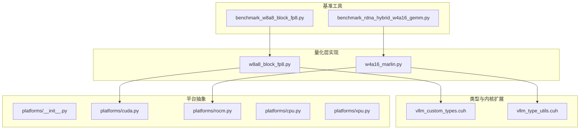
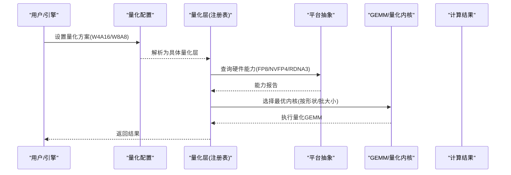
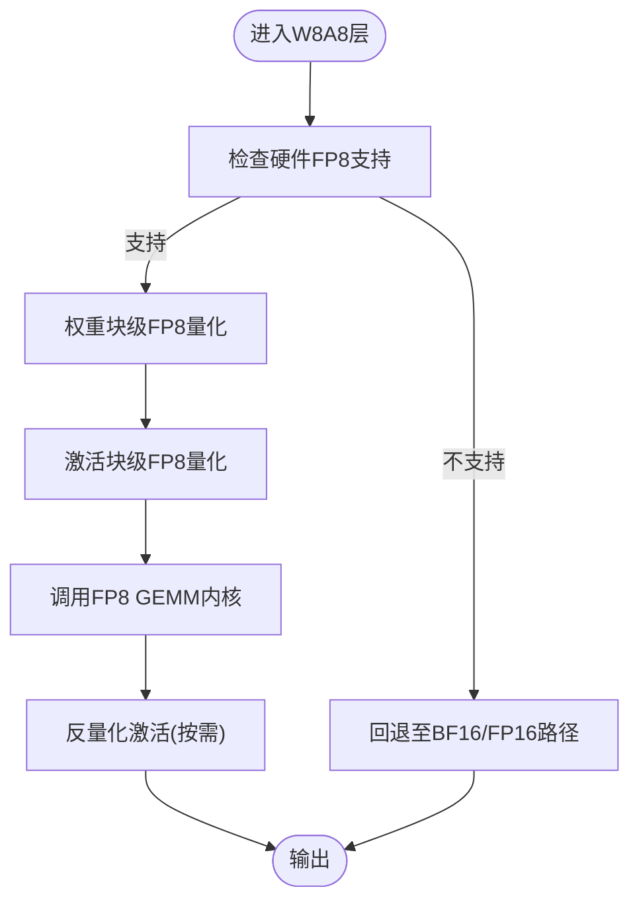
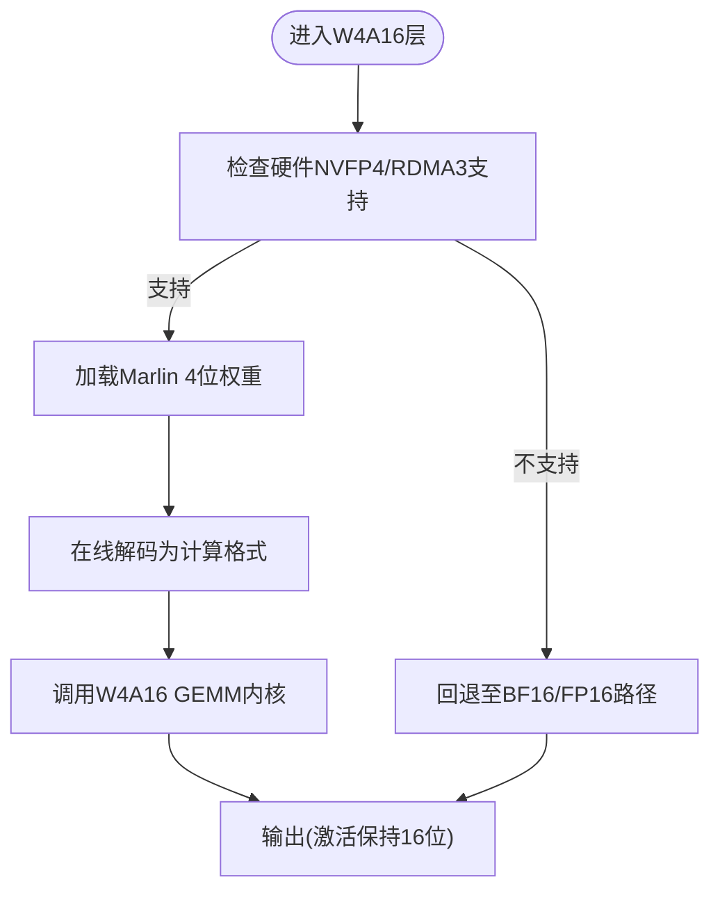
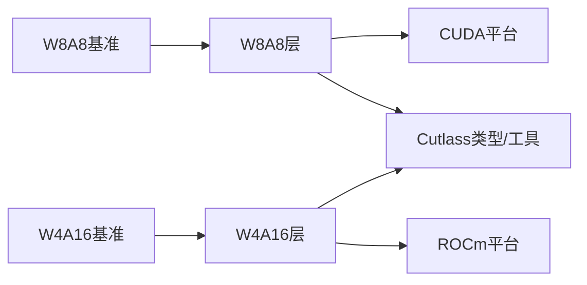

# 混合精度量化

<cite>
**本文引用的文件**   
- [vllm/config/quantization.py](file://vllm/config/quantization.py)
- [vllm/model_executor/layers/quantization/__init__.py](file://vllm/model_executor/layers/quantization/__init__.py)
- [vllm/model_executor/layers/quantization/w8a8_block_fp8.py](file://vllm/model_executor/layers/quantization/w8a8_block_fp8.py)
- [vllm/model_executor/layers/quantization/w4a16_marlin.py](file://vllm/model_executor/layers/quantization/w4a16_marlin.py)
- [benchmarks/kernels/benchmark_w8a8_block_fp8.py](file://benchmarks/kernels/benchmark_w8a8_block_fp8.py)
- [benchmarks/kernels/benchmark_rdna_hybrid_w4a16_gemm.py](file://benchmarks/kernels/benchmark_rdna_hybrid_w4a16_gemm.py)
- [csrc/cutlass_extensions/vllm_custom_types.cuh](file://csrc/cutlass_extensions/vllm_custom_types.cuh)
- [csrc/cutlass_extensions/vllm_type_utils.cuh](file://csrc/cutlass_extensions/vllm_type_utils.cuh)
- [vllm/platforms/__init__.py](file://vllm/platforms/__init__.py)
- [vllm/platforms/cpu.py](file://vllm/platforms/cpu.py)
- [vllm/platforms/cuda.py](file://vllm/platforms/cuda.py)
- [vllm/platforms/rocm.py](file://vllm/platforms/rocm.py)
- [vllm/platforms/xpu.py](file://vllm/platforms/xpu.py)
- [docs/configuration/optimization.md](file://docs/configuration/optimization.md)
- [docs/features/quantization/README.md](file://docs/features/quantization/README.md)
</cite>

## 目录
1. [简介](#简介)
2. [项目结构](#项目结构)
3. [核心组件](#核心组件)
4. [架构总览](#架构总览)
5. [详细组件分析](#详细组件分析)
6. [依赖关系分析](#依赖关系分析)
7. [性能考量](#性能考量)
8. [故障排查指南](#故障排查指南)
9. [结论](#结论)
10. [附录](#附录)

## 简介
本文件系统性阐述 vLLM 中的混合精度量化技术，重点覆盖：
- 原理与适用场景：解释为何在权重与激活上采用不同位宽（如 W4A16、W8A8），以及精度与内存的权衡。
- 内核选择与自动优化：如何在不同硬件平台（CUDA、ROCm、CPU、XPU）上选择合适的 GEMM/量化内核，并基于基准进行自动调优。
- 配置示例与调优指南：给出可操作的配置项与参数建议，帮助在不同模型与负载下取得最佳吞吐/延迟。
- 硬件支持与性能表现：总结各平台的特性、限制与典型性能趋势。
- 最佳实践与常见问题：提供落地经验与排障方法。

## 项目结构
vLLM 将量化能力以“层级量化实现 + 平台适配 + 基准工具”的方式组织：
- 量化层实现：位于 model_executor/layers/quantization，按算法/格式划分（如 w8a8_block_fp8.py、w4a16_marlin.py）。
- 类型与内核扩展：csrc/cutlass_extensions 提供自定义数据类型与类型转换工具，支撑 FP8/NVFP4/W4A16 等。
- 平台抽象：platforms 模块统一 CPU/CUDA/ROCm/XPU 的能力探测与后端选择。
- 基准与评测：benchmarks/kernels 提供针对特定量化格式的基准脚本，用于自动或手动调参。
- 文档与配置：docs/configuration 与 docs/features/quantization 提供用户可见的配置与说明。

图表来源
- [vllm/model_executor/layers/quantization/w8a8_block_fp8.py](file://vllm/model_executor/layers/quantization/w8a8_block_fp8.py)
- [vllm/model_executor/layers/quantization/w4a16_marlin.py](file://vllm/model_executor/layers/quantization/w4a16_marlin.py)
- [csrc/cutlass_extensions/vllm_custom_types.cuh](file://csrc/cutlass_extensions/vllm_custom_types.cuh)
- [csrc/cutlass_extensions/vllm_type_utils.cuh](file://csrc/cutlass_extensions/vllm_type_utils.cuh)
- [vllm/platforms/cuda.py](file://vllm/platforms/cuda.py)
- [vllm/platforms/rocm.py](file://vllm/platforms/rocm.py)
- [benchmarks/kernels/benchmark_w8a8_block_fp8.py](file://benchmarks/kernels/benchmark_w8a8_block_fp8.py)
- [benchmarks/kernels/benchmark_rdna_hybrid_w4a16_gemm.py](file://benchmarks/kernels/benchmark_rdna_hybrid_w4a16_gemm.py)

章节来源
- [vllm/model_executor/layers/quantization/__init__.py](file://vllm/model_executor/layers/quantization/__init__.py)
- [docs/features/quantization/README.md](file://docs/features/quantization/README.md)

## 核心组件
- 量化层接口与注册：通过 quantization/__init__.py 暴露统一的量化层入口，便于上层按配置动态加载具体实现。
- W8A8 Block-FP8：对权重与激活均进行块级 FP8 量化，适合高吞吐推理，尤其在支持 FP8 的 GPU 上。
- W4A16 Marlin：权重 4 位压缩（Marlin 格式），激活保持 16 位，显著降低显存占用，适用于大模型部署。
- 类型与内核扩展：cutlass_extensions 提供 NVFP4、FP8 等自定义类型与转换工具，配合底层 GEMM 内核加速。
- 平台抽象：platforms 模块负责检测硬件能力（如是否支持 FP8、NVFP4、RDNA3 等），并据此选择最优内核。
- 基准工具：针对 W8A8 和 W4A16 的专用基准脚本，用于评估不同形状、批大小、块大小下的性能。

章节来源
- [vllm/model_executor/layers/quantization/__init__.py](file://vllm/model_executor/layers/quantization/__init__.py)
- [vllm/model_executor/layers/quantization/w8a8_block_fp8.py](file://vllm/model_executor/layers/quantization/w8a8_block_fp8.py)
- [vllm/model_executor/layers/quantization/w4a16_marlin.py](file://vllm/model_executor/layers/quantization/w4a16_marlin.py)
- [csrc/cutlass_extensions/vllm_custom_types.cuh](file://csrc/cutlass_extensions/vllm_custom_types.cuh)
- [csrc/cutlass_extensions/vllm_type_utils.cuh](file://csrc/cutlass_extensions/vllm_type_utils.cuh)
- [vllm/platforms/__init__.py](file://vllm/platforms/__init__.py)
- [benchmarks/kernels/benchmark_w8a8_block_fp8.py](file://benchmarks/kernels/benchmark_w8a8_block_fp8.py)
- [benchmarks/kernels/benchmark_rdna_hybrid_w4a16_gemm.py](file://benchmarks/kernels/benchmark_rdna_hybrid_w4a16_gemm.py)

## 架构总览
下图展示从配置到内核执行的端到端流程：上层根据量化配置选择量化层；平台模块探测硬件能力；内核选择器挑选合适的 GEMM/量化内核；最终执行计算并返回结果。

图表来源
- [vllm/config/quantization.py](file://vllm/config/quantization.py)
- [vllm/model_executor/layers/quantization/__init__.py](file://vllm/model_executor/layers/quantization/__init__.py)
- [vllm/platforms/cuda.py](file://vllm/platforms/cuda.py)
- [vllm/platforms/rocm.py](file://vllm/platforms/rocm.py)
- [vllm/model_executor/layers/quantization/w8a8_block_fp8.py](file://vllm/model_executor/layers/quantization/w8a8_block_fp8.py)
- [vllm/model_executor/layers/quantization/w4a16_marlin.py](file://vllm/model_executor/layers/quantization/w4a16_marlin.py)

## 详细组件分析

### W8A8 Block-FP8 量化
- 设计思路：权重与激活均采用块级 FP8 量化，减少带宽与存储压力，同时利用 GPU 原生 FP8 张量核提升吞吐。
- 适用场景：高吞吐推理、批处理较大、GPU 具备 FP8 支持（如 A100/H100）。
- 关键要点：
  - 块大小与缩放策略影响精度与性能平衡。
  - 与 Cutlass/Fused GEMM 内核结合，最大化硬件利用率。
  - 需要关注激活分布与异常值，必要时引入 per-token/per-channel 缩放。

图表来源
- [vllm/model_executor/layers/quantization/w8a8_block_fp8.py](file://vllm/model_executor/layers/quantization/w8a8_block_fp8.py)
- [csrc/cutlass_extensions/vllm_custom_types.cuh](file://csrc/cutlass_extensions/vllm_custom_types.cuh)
- [csrc/cutlass_extensions/vllm_type_utils.cuh](file://csrc/cutlass_extensions/vllm_type_utils.cuh)

章节来源
- [vllm/model_executor/layers/quantization/w8a8_block_fp8.py](file://vllm/model_executor/layers/quantization/w8a8_block_fp8.py)
- [benchmarks/kernels/benchmark_w8a8_block_fp8.py](file://benchmarks/kernels/benchmark_w8a8_block_fp8.py)

### W4A16 Marlin 量化
- 设计思路：权重使用 4 位压缩（Marlin 格式），激活保持 16 位，显著降低显存占用，适合大模型部署与低显存环境。
- 适用场景：显存受限、长上下文、多并发推理；在 RDNA3 等架构上可通过专用内核获得较好性能。
- 关键要点：
  - Marlin 解码与 GEMM 融合，减少访存开销。
  - 需关注 4 位量化带来的数值范围与精度损失，必要时做校准。
  - 不同硬件（CUDA/ROCm）的内核选择差异较大，应依据基准调整。

图表来源
- [vllm/model_executor/layers/quantization/w4a16_marlin.py](file://vllm/model_executor/layers/quantization/w4a16_marlin.py)
- [benchmarks/kernels/benchmark_rdna_hybrid_w4a16_gemm.py](file://benchmarks/kernels/benchmark_rdna_hybrid_w4a16_gemm.py)

章节来源
- [vllm/model_executor/layers/quantization/w4a16_marlin.py](file://vllm/model_executor/layers/quantization/w4a16_marlin.py)
- [benchmarks/kernels/benchmark_rdna_hybrid_w4a16_gemm.py](file://benchmarks/kernels/benchmark_rdna_hybrid_w4a16_gemm.py)

### 类型与内核扩展（Cutlass 定制类型）
- 作用：定义 NVFP4、FP8 等自定义数据类型，并提供类型转换工具，确保量化数据在内存与计算之间高效流转。
- 关键点：
  - 类型对齐与打包策略影响访存效率。
  - 与底层 GEMM 内核（如 cutlass、marlin、rdna 专用）紧密耦合。
  - 需要保证跨平台一致性（CUDA/ROCm/CPU/XPU）。

章节来源
- [csrc/cutlass_extensions/vllm_custom_types.cuh](file://csrc/cutlass_extensions/vllm_custom_types.cuh)
- [csrc/cutlass_extensions/vllm_type_utils.cuh](file://csrc/cutlass_extensions/vllm_type_utils.cuh)

### 平台抽象与能力探测
- 目标：统一 CPU/CUDA/ROCm/XPU 的能力探测与后端选择，屏蔽硬件差异。
- 关键点：
  - 检测是否支持 FP8、NVFP4、RDNA3 等特性。
  - 根据模型形状与批大小选择最优内核。
  - 提供回退路径，确保在不支持的硬件上仍能运行（可能性能较低）。

章节来源
- [vllm/platforms/__init__.py](file://vllm/platforms/__init__.py)
- [vllm/platforms/cuda.py](file://vllm/platforms/cuda.py)
- [vllm/platforms/rocm.py](file://vllm/platforms/rocm.py)
- [vllm/platforms/cpu.py](file://vllm/platforms/cpu.py)
- [vllm/platforms/xpu.py](file://vllm/platforms/xpu.py)

## 依赖关系分析
量化层与平台、内核之间的依赖如下：
- 量化层依赖平台能力探测，决定启用何种内核。
- 内核依赖 Cutlass 定制类型与类型转换工具。
- 基准脚本驱动量化层与内核，收集性能数据用于调优。

图表来源
- [vllm/model_executor/layers/quantization/w8a8_block_fp8.py](file://vllm/model_executor/layers/quantization/w8a8_block_fp8.py)
- [vllm/model_executor/layers/quantization/w4a16_marlin.py](file://vllm/model_executor/layers/quantization/w4a16_marlin.py)
- [vllm/platforms/cuda.py](file://vllm/platforms/cuda.py)
- [vllm/platforms/rocm.py](file://vllm/platforms/rocm.py)
- [csrc/cutlass_extensions/vllm_custom_types.cuh](file://csrc/cutlass_extensions/vllm_custom_types.cuh)
- [csrc/cutlass_extensions/vllm_type_utils.cuh](file://csrc/cutlass_extensions/vllm_type_utils.cuh)
- [benchmarks/kernels/benchmark_w8a8_block_fp8.py](file://benchmarks/kernels/benchmark_w8a8_block_fp8.py)
- [benchmarks/kernels/benchmark_rdna_hybrid_w4a16_gemm.py](file://benchmarks/kernels/benchmark_rdna_hybrid_w4a16_gemm.py)

章节来源
- [vllm/model_executor/layers/quantization/__init__.py](file://vllm/model_executor/layers/quantization/__init__.py)
- [vllm/platforms/__init__.py](file://vllm/platforms/__init__.py)

## 性能考量
- 精度与内存权衡：
  - W8A8：更高精度，适合对数值敏感的任务；显存占用中等。
  - W4A16：更低显存，适合大模型与低显存环境；需注意精度校准。
- 内核选择：
  - CUDA：优先使用原生 FP8/GEMM 内核。
  - ROCm：RDNA3 架构可使用 W4A16 专用内核。
  - CPU/XPU：回退路径可用，但性能较低。
- 批大小与形状：
  - 大批大小通常更利于内核并行化。
  - 小批大小可能需要调整块大小或切换内核。
- 基准驱动调优：
  - 使用 benchmarks/kernels 下的脚本对不同形状/批大小进行扫描，选择最优配置。

[本节为通用指导，不直接分析具体文件]

## 故障排查指南
- 无法启用 FP8/NVFP4：
  - 检查平台能力探测是否正确识别硬件特性。
  - 确认驱动与库版本支持相应格式。
- 精度下降明显：
  - 检查量化校准过程与缩放策略。
  - 尝试增大块大小或改用更高精度激活（如 W4A16）。
- 性能不达预期：
  - 使用基准脚本验证内核选择是否合理。
  - 调整批大小、序列长度等输入形状。
- 回退路径触发：
  - 查看日志确认是否因硬件不支持而回退至 BF16/FP16。
  - 考虑升级硬件或更换量化方案。

章节来源
- [vllm/platforms/cuda.py](file://vllm/platforms/cuda.py)
- [vllm/platforms/rocm.py](file://vllm/platforms/rocm.py)
- [benchmarks/kernels/benchmark_w8a8_block_fp8.py](file://benchmarks/kernels/benchmark_w8a8_block_fp8.py)
- [benchmarks/kernels/benchmark_rdna_hybrid_w4a16_gemm.py](file://benchmarks/kernels/benchmark_rdna_hybrid_w4a16_gemm.py)

## 结论
混合精度量化在 vLLM 中通过“量化层 + 平台抽象 + 内核扩展 + 基准工具”的体系实现，能够在不同硬件平台上灵活选择最优内核，平衡精度与内存占用。W8A8 适合高吞吐场景，W4A16 适合大模型与低显存部署。通过基准驱动调优与平台能力探测，可在实际工程中稳定获得良好性能。

[本节为总结性内容，不直接分析具体文件]

## 附录

### 配置示例与调优指南
- 选择量化方案：
  - 在量化配置中指定 W8A8 或 W4A16。
  - 根据硬件能力与任务需求选择合适方案。
- 调整块大小与缩放：
  - 对于 W8A8，调整块大小以平衡精度与性能。
  - 对于 W4A16，确保 Marlin 解码与 GEMM 内核匹配。
- 基准与自动调优：
  - 使用 benchmarks/kernels 下的脚本扫描不同形状/批大小。
  - 记录性能指标，选择最优配置。

章节来源
- [vllm/config/quantization.py](file://vllm/config/quantization.py)
- [docs/configuration/optimization.md](file://docs/configuration/optimization.md)
- [docs/features/quantization/README.md](file://docs/features/quantization/README.md)

### 硬件平台支持与性能表现
- CUDA：
  - 支持 FP8 与原生 GEMM 内核，W8A8 表现优异。
- ROCm：
  - RDNA3 架构支持 W4A16 专用内核，适合大模型部署。
- CPU/XPU：
  - 提供回退路径，性能较低，适合开发调试。

章节来源
- [vllm/platforms/cuda.py](file://vllm/platforms/cuda.py)
- [vllm/platforms/rocm.py](file://vllm/platforms/rocm.py)
- [vllm/platforms/cpu.py](file://vllm/platforms/cpu.py)
- [vllm/platforms/xpu.py](file://vllm/platforms/xpu.py)