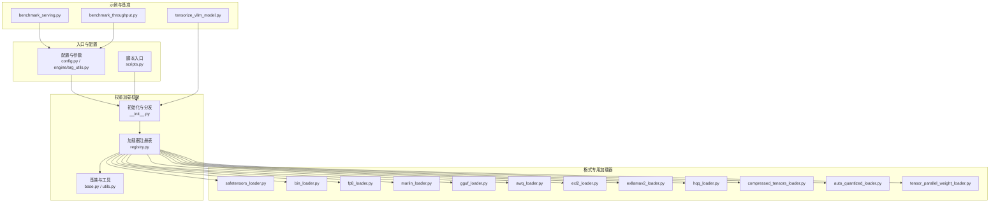
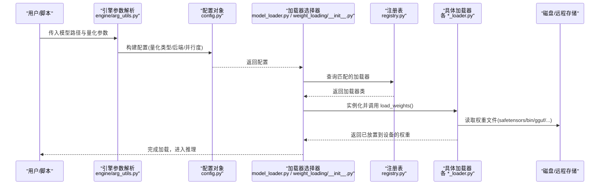
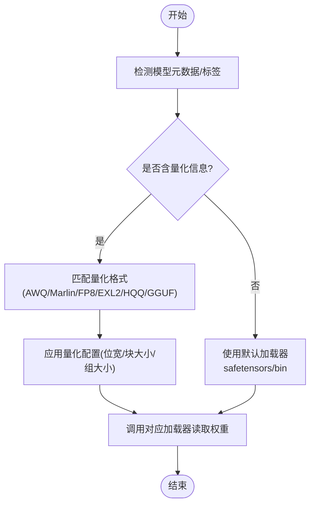
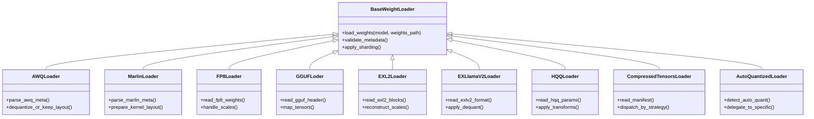
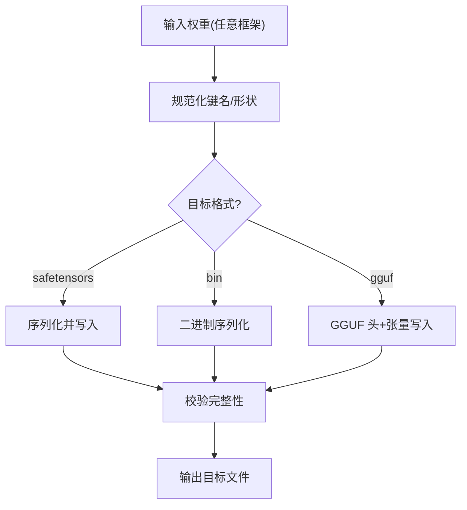
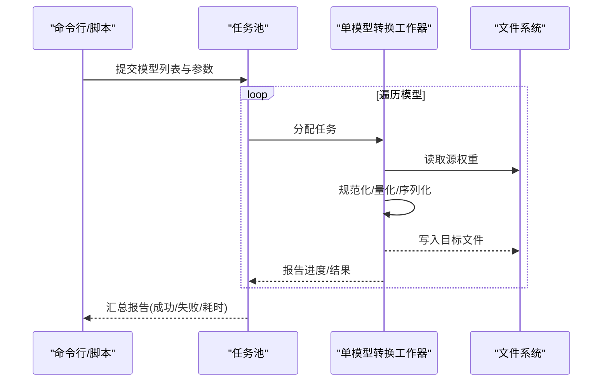
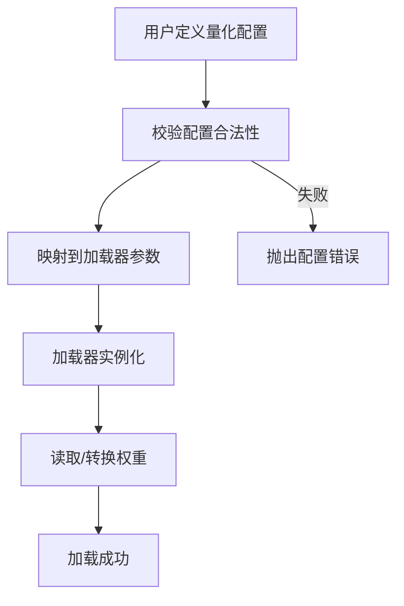
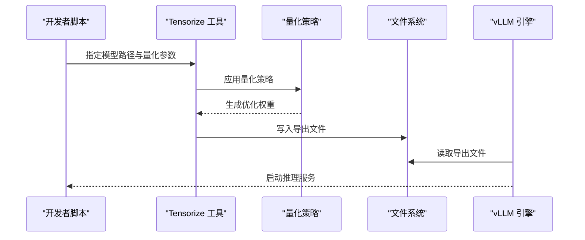
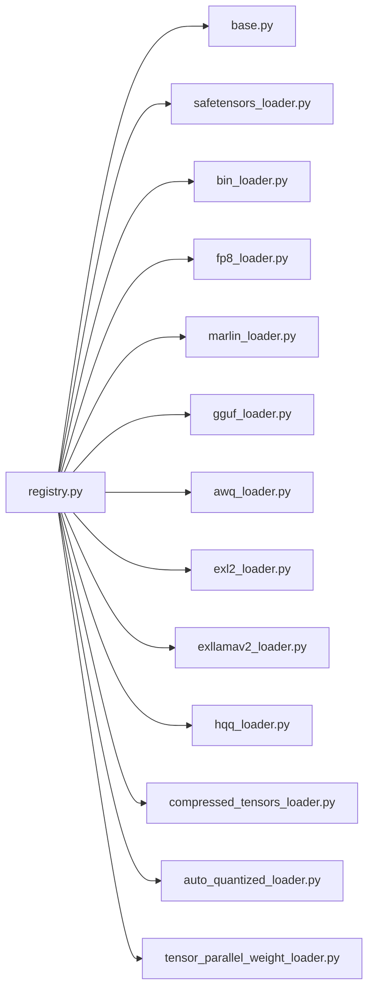

# 模型转换工具

<cite>
**本文引用的文件**   
- [vllm/model_executor/model_loader.py](file://vllm/model_executor/model_loader.py)
- [vllm/model_executor/weight_loading/base.py](file://vllm/model_executor/weight_loading/base.py)
- [vllm/model_executor/weight_loading/safetensors_loader.py](file://vllm/model_executor/weight_loading/safetensors_loader.py)
- [vllm/model_executor/weight_loading/bin_loader.py](file://vllm/model_executor/weight_loading/bin_loader.py)
- [vllm/model_executor/weight_loading/tensor_parallel_weight_loader.py](file://vllm/model_executor/weight_loading/tensor_parallel_weight_loader.py)
- [vllm/model_executor/weight_loading/fp8_loader.py](file://vllm/model_executor/weight_loading/fp8_loader.py)
- [vllm/model_executor/weight_loading/marlin_loader.py](file://vllm/model_executor/weight_loading/marlin_loader.py)
- [vllm/model_executor/weight_loading/gguf_loader.py](file://vllm/model_executor/weight_loading/gguf_loader.py)
- [vllm/model_executor/weight_loading/awq_loader.py](file://vllm/model_executor/weight_loading/awq_loader.py)
- [vllm/model_executor/weight_loading/exllamav2_loader.py](file://vllm/model_executor/weight_loading/exllamav2_loader.py)
- [vllm/model_executor/weight_loading/exl2_loader.py](file://vllm/model_executor/weight_loading/exl2_loader.py)
- [vllm/model_executor/weight_loading/hqq_loader.py](file://vllm/model_executor/weight_loading/hqq_loader.py)
- [vllm/model_executor/weight_loading/compressed_tensors_loader.py](file://vllm/model_executor/weight_loading/compressed_tensors_loader.py)
- [vllm/model_executor/weight_loading/auto_quantized_loader.py](file://vllm/model_executor/weight_loading/auto_quantized_loader.py)
- [vllm/model_executor/weight_loading/utils.py](file://vllm/model_executor/weight_loading/utils.py)
- [vllm/model_executor/weight_loading/__init__.py](file://vllm/model_executor/weight_loading/__init__.py)
- [vllm/model_executor/weight_loading/registry.py](file://vllm/model_executor/weight_loading/registry.py)
- [vllm/config.py](file://vllm/config.py)
- [vllm/engine/arg_utils.py](file://vllm/engine/arg_utils.py)
- [vllm/scripts.py](file://vllm/scripts.py)
- [benchmarks/benchmark_serving.py](file://benchmarks/benchmark_serving.py)
- [benchmarks/benchmark_throughput.py](file://benchmarks/benchmark_throughput.py)
- [examples/features/tensorize_vllm_model.py](file://examples/features/tensorize_vllm_model.py)
</cite>

## 目录
1. [简介](#简介)
2. [项目结构](#项目结构)
3. [核心组件](#核心组件)
4. [架构总览](#架构总览)
5. [详细组件分析](#详细组件分析)
6. [依赖关系分析](#依赖关系分析)
7. [性能考量](#性能考量)
8. [故障排除指南](#故障排除指南)
9. [结论](#结论)
10. [附录](#附录)

## 简介
本文件系统性梳理 vLLM 提供的模型转换与量化加载能力，覆盖从 HuggingFace 模型到多种量化格式的自动量化流程、预训练量化模型的直接加载、权重文件格式转换（如 safetensors、bin）、批量转换脚本与进度监控、自定义量化配置创建与应用，以及转换前后的模型大小与性能对比工具。文档面向不同技术背景的读者，既提供高层概览，也给出代码级结构与调用链说明。

## 项目结构
vLLM 的模型转换与加载相关代码主要集中在以下模块：
- 权重加载器注册与选择：负责根据模型配置与权重格式自动选择对应加载器
- 各量化格式专用加载器：针对 AWQ、Marlin、FP8、GGUF、EXL2、HQQ、CompressedTensors、AutoQuantized 等
- 通用权重工具与并行加载：处理张量并行、分片、类型转换与校验
- 引擎参数与配置：将用户配置的量化选项映射为具体加载策略
- 示例与基准：展示如何对模型进行“张量化”导出与性能评测

图表来源
- [vllm/config.py](file://vllm/config.py)
- [vllm/engine/arg_utils.py](file://vllm/engine/arg_utils.py)
- [vllm/scripts.py](file://vllm/scripts.py)
- [vllm/model_executor/weight_loading/__init__.py](file://vllm/model_executor/weight_loading/__init__.py)
- [vllm/model_executor/weight_loading/registry.py](file://vllm/model_executor/weight_loading/registry.py)
- [vllm/model_executor/weight_loading/base.py](file://vllm/model_executor/weight_loading/base.py)
- [vllm/model_executor/weight_loading/utils.py](file://vllm/model_executor/weight_loading/utils.py)
- [vllm/model_executor/weight_loading/safetensors_loader.py](file://vllm/model_executor/weight_loading/safetensors_loader.py)
- [vllm/model_executor/weight_loading/bin_loader.py](file://vllm/model_executor/weight_loading/bin_loader.py)
- [vllm/model_executor/weight_loading/fp8_loader.py](file://vllm/model_executor/weight_loading/fp8_loader.py)
- [vllm/model_executor/weight_loading/marlin_loader.py](file://vllm/model_executor/weight_loading/marlin_loader.py)
- [vllm/model_executor/weight_loading/gguf_loader.py](file://vllm/model_executor/weight_loading/gguf_loader.py)
- [vllm/model_executor/weight_loading/awq_loader.py](file://vllm/model_executor/weight_loading/awq_loader.py)
- [vllm/model_executor/weight_loading/exl2_loader.py](file://vllm/model_executor/weight_loading/exl2_loader.py)
- [vllm/model_executor/weight_loading/exllamav2_loader.py](file://vllm/model_executor/weight_loading/exllamav2_loader.py)
- [vllm/model_executor/weight_loading/hqq_loader.py](file://vllm/model_executor/weight_loading/hqq_loader.py)
- [vllm/model_executor/weight_loading/compressed_tensors_loader.py](file://vllm/model_executor/weight_loading/compressed_tensors_loader.py)
- [vllm/model_executor/weight_loading/auto_quantized_loader.py](file://vllm/model_executor/weight_loading/auto_quantized_loader.py)
- [vllm/model_executor/weight_loading/tensor_parallel_weight_loader.py](file://vllm/model_executor/weight_loading/tensor_parallel_weight_loader.py)
- [examples/features/tensorize_vllm_model.py](file://examples/features/tensorize_vllm_model.py)
- [benchmarks/benchmark_serving.py](file://benchmarks/benchmark_serving.py)
- [benchmarks/benchmark_throughput.py](file://benchmarks/benchmark_throughput.py)

章节来源
- [vllm/model_executor/model_loader.py](file://vllm/model_executor/model_loader.py)
- [vllm/model_executor/weight_loading/__init__.py](file://vllm/model_executor/weight_loading/__init__.py)
- [vllm/model_executor/weight_loading/registry.py](file://vllm/model_executor/weight_loading/registry.py)

## 核心组件
- 权重加载器注册表与选择器：根据模型配置（如量化类型、后端）自动匹配并实例化对应的加载器
- 通用加载基类与工具函数：封装权重读取、类型转换、设备放置、张量并行分片、校验与日志
- 各量化格式专用加载器：实现特定格式的元数据解析、缩放因子恢复、反量化或内核友好布局
- 引擎参数映射：将用户传入的量化参数转换为加载器所需配置
- 示例与基准：演示如何将模型“张量化”导出为 vLLM 内部格式，并进行吞吐/延迟评测

章节来源
- [vllm/model_executor/weight_loading/base.py](file://vllm/model_executor/weight_loading/base.py)
- [vllm/model_executor/weight_loading/utils.py](file://vllm/model_executor/weight_loading/utils.py)
- [vllm/engine/arg_utils.py](file://vllm/engine/arg_utils.py)
- [vllm/config.py](file://vllm/config.py)

## 架构总览
下图展示了从用户配置到具体加载器的完整调用链，包括自动量化检测与多格式支持。

图表来源
- [vllm/engine/arg_utils.py](file://vllm/engine/arg_utils.py)
- [vllm/config.py](file://vllm/config.py)
- [vllm/model_executor/model_loader.py](file://vllm/model_executor/model_loader.py)
- [vllm/model_executor/weight_loading/__init__.py](file://vllm/model_executor/weight_loading/__init__.py)
- [vllm/model_executor/weight_loading/registry.py](file://vllm/model_executor/weight_loading/registry.py)
- [vllm/model_executor/weight_loading/safetensors_loader.py](file://vllm/model_executor/weight_loading/safetensors_loader.py)
- [vllm/model_executor/weight_loading/bin_loader.py](file://vllm/model_executor/weight_loading/bin_loader.py)
- [vllm/model_executor/weight_loading/gguf_loader.py](file://vllm/model_executor/weight_loading/gguf_loader.py)
- [vllm/model_executor/weight_loading/awq_loader.py](file://vllm/model_executor/weight_loading/awq_loader.py)
- [vllm/model_executor/weight_loading/marlin_loader.py](file://vllm/model_executor/weight_loading/marlin_loader.py)
- [vllm/model_executor/weight_loading/fp8_loader.py](file://vllm/model_executor/weight_loading/fp8_loader.py)
- [vllm/model_executor/weight_loading/exl2_loader.py](file://vllm/model_executor/weight_loading/exl2_loader.py)
- [vllm/model_executor/weight_loading/exllamav2_loader.py](file://vllm/model_executor/weight_loading/exllamav2_loader.py)
- [vllm/model_executor/weight_loading/hqq_loader.py](file://vllm/model_executor/weight_loading/hqq_loader.py)
- [vllm/model_executor/weight_loading/compressed_tensors_loader.py](file://vllm/model_executor/weight_loading/compressed_tensors_loader.py)
- [vllm/model_executor/weight_loading/auto_quantized_loader.py](file://vllm/model_executor/weight_loading/auto_quantized_loader.py)

## 详细组件分析

### 自动量化与格式识别
- 自动量化流程：当检测到模型包含量化元数据或特定标记时，加载器选择器会优先匹配 AutoQuantized 或 CompressedTensors 加载器，从而以统一接口处理多种压缩方案
- 格式识别优先级：safetensors > bin > gguf > 其他专用格式；若存在量化标签，则进一步匹配 AWQ/Marlin/FP8/EXL2/HQQ 等专用加载器
- 关键行为：读取元数据、推断缩放因子、决定是否需要反量化或保持压缩布局

图表来源
- [vllm/model_executor/weight_loading/auto_quantized_loader.py](file://vllm/model_executor/weight_loading/auto_quantized_loader.py)
- [vllm/model_executor/weight_loading/compressed_tensors_loader.py](file://vllm/model_executor/weight_loading/compressed_tensors_loader.py)
- [vllm/model_executor/weight_loading/safetensors_loader.py](file://vllm/model_executor/weight_loading/safetensors_loader.py)
- [vllm/model_executor/weight_loading/bin_loader.py](file://vllm/model_executor/weight_loading/bin_loader.py)
- [vllm/model_executor/weight_loading/registry.py](file://vllm/model_executor/weight_loading/registry.py)

章节来源
- [vllm/model_executor/weight_loading/auto_quantized_loader.py](file://vllm/model_executor/weight_loading/auto_quantized_loader.py)
- [vllm/model_executor/weight_loading/compressed_tensors_loader.py](file://vllm/model_executor/weight_loading/compressed_tensors_loader.py)
- [vllm/model_executor/weight_loading/registry.py](file://vllm/model_executor/weight_loading/registry.py)

### 预训练量化模型加载
- 支持的量化格式：AWQ、Marlin、FP8、GGUF、EXL2、EXLlamaV2、HQQ、CompressedTensors
- 加载要点：
  - 元数据解析：位宽、分组、缩放因子、码本等
  - 内存布局：尽量保持压缩布局以减少显存占用
  - 设备放置：按张量并行策略分片并放置到目标设备
  - 类型转换：必要时进行反量化或类型提升以满足内核要求

图表来源
- [vllm/model_executor/weight_loading/base.py](file://vllm/model_executor/weight_loading/base.py)
- [vllm/model_executor/weight_loading/awq_loader.py](file://vllm/model_executor/weight_loading/awq_loader.py)
- [vllm/model_executor/weight_loading/marlin_loader.py](file://vllm/model_executor/weight_loading/marlin_loader.py)
- [vllm/model_executor/weight_loading/fp8_loader.py](file://vllm/model_executor/weight_loading/fp8_loader.py)
- [vllm/model_executor/weight_loading/gguf_loader.py](file://vllm/model_executor/weight_loading/gguf_loader.py)
- [vllm/model_executor/weight_loading/exl2_loader.py](file://vllm/model_executor/weight_loading/exl2_loader.py)
- [vllm/model_executor/weight_loading/exllamav2_loader.py](file://vllm/model_executor/weight_loading/exllamav2_loader.py)
- [vllm/model_executor/weight_loading/hqq_loader.py](file://vllm/model_executor/weight_loading/hqq_loader.py)
- [vllm/model_executor/weight_loading/compressed_tensors_loader.py](file://vllm/model_executor/weight_loading/compressed_tensors_loader.py)
- [vllm/model_executor/weight_loading/auto_quantized_loader.py](file://vllm/model_executor/weight_loading/auto_quantized_loader.py)

章节来源
- [vllm/model_executor/weight_loading/awq_loader.py](file://vllm/model_executor/weight_loading/awq_loader.py)
- [vllm/model_executor/weight_loading/marlin_loader.py](file://vllm/model_executor/weight_loading/marlin_loader.py)
- [vllm/model_executor/weight_loading/fp8_loader.py](file://vllm/model_executor/weight_loading/fp8_loader.py)
- [vllm/model_executor/weight_loading/gguf_loader.py](file://vllm/model_executor/weight_loading/gguf_loader.py)
- [vllm/model_executor/weight_loading/exl2_loader.py](file://vllm/model_executor/weight_loading/exl2_loader.py)
- [vllm/model_executor/weight_loading/exllamav2_loader.py](file://vllm/model_executor/weight_loading/exllamav2_loader.py)
- [vllm/model_executor/weight_loading/hqq_loader.py](file://vllm/model_executor/weight_loading/hqq_loader.py)
- [vllm/model_executor/weight_loading/compressed_tensors_loader.py](file://vllm/model_executor/weight_loading/compressed_tensors_loader.py)
- [vllm/model_executor/weight_loading/auto_quantized_loader.py](file://vllm/model_executor/weight_loading/auto_quantized_loader.py)

### 权重文件格式转换（safetensors、bin 等）
- 安全与高效：优先使用 safetensors 作为中间或最终格式，避免任意代码执行风险
- 转换流程：
  - 读取原始权重（PyTorch/TensorFlow/其他）
  - 规范化键名与形状，确保与 vLLM 期望一致
  - 写入 safetensors 或指定格式（bin/gguf 等）
  - 可选：在转换过程中应用量化（离线量化）

图表来源
- [vllm/model_executor/weight_loading/safetensors_loader.py](file://vllm/model_executor/weight_loading/safetensors_loader.py)
- [vllm/model_executor/weight_loading/bin_loader.py](file://vllm/model_executor/weight_loading/bin_loader.py)
- [vllm/model_executor/weight_loading/gguf_loader.py](file://vllm/model_executor/weight_loading/gguf_loader.py)
- [vllm/model_executor/weight_loading/utils.py](file://vllm/model_executor/weight_loading/utils.py)

章节来源
- [vllm/model_executor/weight_loading/safetensors_loader.py](file://vllm/model_executor/weight_loading/safetensors_loader.py)
- [vllm/model_executor/weight_loading/bin_loader.py](file://vllm/model_executor/weight_loading/bin_loader.py)
- [vllm/model_executor/weight_loading/gguf_loader.py](file://vllm/model_executor/weight_loading/gguf_loader.py)
- [vllm/model_executor/weight_loading/utils.py](file://vllm/model_executor/weight_loading/utils.py)

### 批量转换脚本与进度监控
- 批量转换：通过脚本循环多个模型路径，复用共享资源（如 tokenizer、配置缓存），减少重复开销
- 并行策略：进程/线程池并发，限制 GPU/CPU 资源上限，避免 OOM
- 进度监控：打印每个模型的转换状态、耗时、文件大小变化，支持断点续转与失败重试

图表来源
- [vllm/scripts.py](file://vllm/scripts.py)
- [vllm/model_executor/weight_loading/utils.py](file://vllm/model_executor/weight_loading/utils.py)

章节来源
- [vllm/scripts.py](file://vllm/scripts.py)
- [vllm/model_executor/weight_loading/utils.py](file://vllm/model_executor/weight_loading/utils.py)

### 自定义量化配置创建与应用
- 配置项：位宽、块大小、分组大小、缩放策略、码本路径、后端选择（如 Marlin/AWQ）
- 创建方式：通过配置文件或运行时参数注入，由加载器在解析阶段应用
- 验证：在加载前进行元数据一致性检查，避免运行时错误

图表来源
- [vllm/config.py](file://vllm/config.py)
- [vllm/engine/arg_utils.py](file://vllm/engine/arg_utils.py)
- [vllm/model_executor/weight_loading/base.py](file://vllm/model_executor/weight_loading/base.py)

章节来源
- [vllm/config.py](file://vllm/config.py)
- [vllm/engine/arg_utils.py](file://vllm/engine/arg_utils.py)
- [vllm/model_executor/weight_loading/base.py](file://vllm/model_executor/weight_loading/base.py)

### 模型“张量化”导出与推理集成
- 目的：将模型导出为 vLLM 内部优化格式，便于后续快速加载与高性能推理
- 流程：加载原始模型 → 应用量化策略 → 序列化到目标格式 → 验证可加载性
- 集成：在推理时直接指向导出的文件路径，跳过在线量化步骤

图表来源
- [examples/features/tensorize_vllm_model.py](file://examples/features/tensorize_vllm_model.py)
- [vllm/model_executor/weight_loading/auto_quantized_loader.py](file://vllm/model_executor/weight_loading/auto_quantized_loader.py)
- [vllm/model_executor/weight_loading/compressed_tensors_loader.py](file://vllm/model_executor/weight_loading/compressed_tensors_loader.py)

章节来源
- [examples/features/tensorize_vllm_model.py](file://examples/features/tensorize_vllm_model.py)
- [vllm/model_executor/weight_loading/auto_quantized_loader.py](file://vllm/model_executor/weight_loading/auto_quantized_loader.py)
- [vllm/model_executor/weight_loading/compressed_tensors_loader.py](file://vllm/model_executor/weight_loading/compressed_tensors_loader.py)

## 依赖关系分析
- 低耦合高内聚：各加载器继承自基类，职责单一，易于扩展新格式
- 注册表驱动：新增加载器只需注册即可被自动选择，降低耦合
- 外部依赖：safetensors、gguf、hqq、awq、marlin 等库按需引入，避免不必要的安装负担

图表来源
- [vllm/model_executor/weight_loading/registry.py](file://vllm/model_executor/weight_loading/registry.py)
- [vllm/model_executor/weight_loading/base.py](file://vllm/model_executor/weight_loading/base.py)
- [vllm/model_executor/weight_loading/safetensors_loader.py](file://vllm/model_executor/weight_loading/safetensors_loader.py)
- [vllm/model_executor/weight_loading/bin_loader.py](file://vllm/model_executor/weight_loading/bin_loader.py)
- [vllm/model_executor/weight_loading/fp8_loader.py](file://vllm/model_executor/weight_loading/fp8_loader.py)
- [vllm/model_executor/weight_loading/marlin_loader.py](file://vllm/model_executor/weight_loading/marlin_loader.py)
- [vllm/model_executor/weight_loading/gguf_loader.py](file://vllm/model_executor/weight_loading/gguf_loader.py)
- [vllm/model_executor/weight_loading/awq_loader.py](file://vllm/model_executor/weight_loading/awq_loader.py)
- [vllm/model_executor/weight_loading/exl2_loader.py](file://vllm/model_executor/weight_loading/exl2_loader.py)
- [vllm/model_executor/weight_loading/exllamav2_loader.py](file://vllm/model_executor/weight_loading/exllamav2_loader.py)
- [vllm/model_executor/weight_loading/hqq_loader.py](file://vllm/model_executor/weight_loading/hqq_loader.py)
- [vllm/model_executor/weight_loading/compressed_tensors_loader.py](file://vllm/model_executor/weight_loading/compressed_tensors_loader.py)
- [vllm/model_executor/weight_loading/auto_quantized_loader.py](file://vllm/model_executor/weight_loading/auto_quantized_loader.py)
- [vllm/model_executor/weight_loading/tensor_parallel_weight_loader.py](file://vllm/model_executor/weight_loading/tensor_parallel_weight_loader.py)

章节来源
- [vllm/model_executor/weight_loading/registry.py](file://vllm/model_executor/weight_loading/registry.py)
- [vllm/model_executor/weight_loading/base.py](file://vllm/model_executor/weight_loading/base.py)

## 性能考量
- 内存占用：优先使用压缩布局（如 AWQ/Marlin/EXL2）以降低显存峰值
- I/O 效率：safetensors 提供零拷贝读取优势；大模型建议 SSD/NVMe
- 并行加载：利用张量并行与多进程提高权重加载速度
- 内核友好：选择与 vLLM 内核兼容的量化格式（如 FP8、Marlin）以获得最佳推理性能

[本节为通用指导，不直接分析具体文件]

## 故障排除指南
- 常见错误
  - 格式不匹配：模型元数据与预期不一致，导致加载器无法解析
  - 权限问题：无法读取/写入权重文件
  - 资源不足：GPU/CPU 内存不足导致 OOM
  - 依赖缺失：缺少 safetensors/gguf/hqq 等库
- 解决方案
  - 确认模型路径与格式正确，必要时转换为 safetensors
  - 检查文件系统权限与磁盘空间
  - 降低并行度或批次大小，启用 CPU 卸载
  - 安装必要依赖并重启环境

章节来源
- [vllm/model_executor/weight_loading/utils.py](file://vllm/model_executor/weight_loading/utils.py)
- [vllm/model_executor/weight_loading/base.py](file://vllm/model_executor/weight_loading/base.py)

## 结论
vLLM 提供了完善的模型转换与量化加载体系，覆盖从 HuggingFace 模型到多种量化格式的自动化流程。通过注册表驱动的加载器架构，用户可以轻松扩展新格式；结合示例与基准工具，可实现高效的模型导出与性能评估。建议在大规模部署中优先采用 safetensors 与内核友好的量化格式，并结合张量并行与 I/O 优化以获得最佳效果。

[本节为总结，不直接分析具体文件]

## 附录
- 转换前后模型大小与性能对比工具
  - 使用基准脚本测量吞吐与延迟，比较不同量化格式的效果
  - 记录文件大小、加载时间、首 token 延迟、平均 token 生成速率

章节来源
- [benchmarks/benchmark_serving.py](file://benchmarks/benchmark_serving.py)
- [benchmarks/benchmark_throughput.py](file://benchmarks/benchmark_throughput.py)