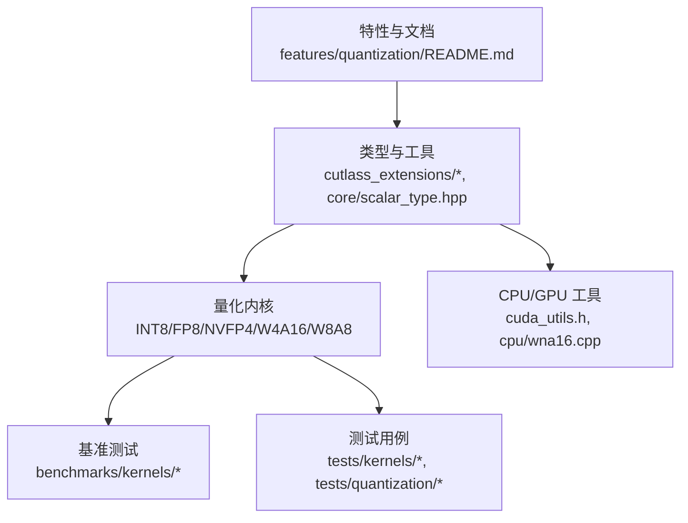
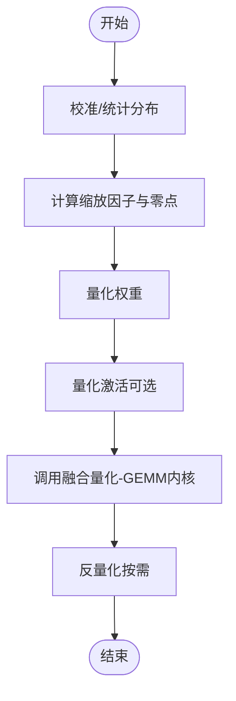
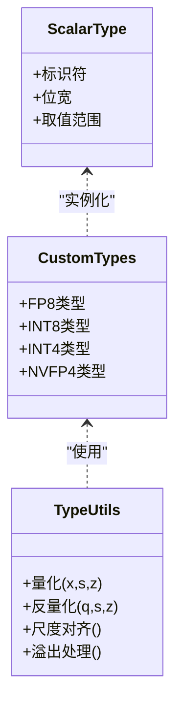
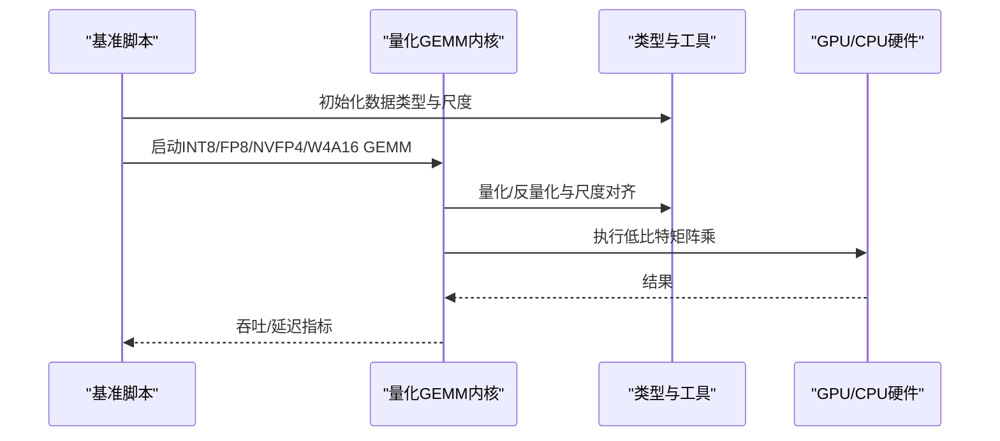
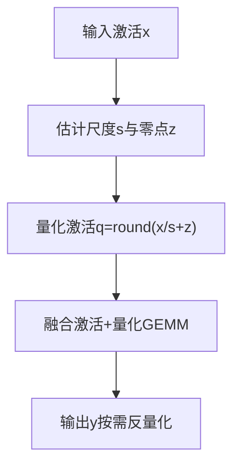
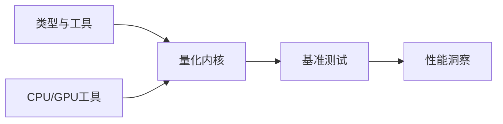

# 量化基础概念

<cite>
**本文引用的文件**   
- [vllm/features/quantization/README.md](file://vllm/features/quantization/README.md)
- [benchmarks/kernels/benchmark_quant.py](file://benchmarks/kernels/benchmark_quant.py)
- [benchmarks/kernels/benchmark_fp8_gemm.py](file://benchmarks/kernels/benchmark_fp8_gemm.py)
- [benchmarks/kernels/benchmark_nvfp4_quant.py](file://benchmarks/kernels/benchmark_nvfp4_quant.py)
- [benchmarks/kernels/benchmark_w8a8_block_fp8.py](file://benchmarks/kernels/benchmark_w8a8_block_fp8.py)
- [benchmarks/kernels/benchmark_int8_gemm.py](file://benchmarks/kernels/benchmark_int8_gemm.py)
- [benchmarks/kernels/benchmark_rdna_hybrid_w4a16_gemm.py](file://benchmarks/kernels/benchmark_rdna_hybrid_w4a16_gemm.py)
- [csrc/libtorch_stable/quantization/README.md](file://csrc/libtorch_stable/quantization/README.md)
- [csrc/cuda_utils.h](file://csrc/cuda_utils.h)
- [csrc/core/scalar_type.hpp](file://csrc/core/scalar_type.hpp)
- [csrc/cutlass_extensions/vllm_custom_types.cuh](file://csrc/cutlass_extensions/vllm_custom_types.cuh)
- [csrc/cutlass_extensions/vllm_type_utils.cuh](file://csrc/cutlass_extensions/vllm_type_utils.cuh)
- [csrc/cpu/wna16.cpp](file://csrc/cpu/wna16.cpp)
- [tests/kernels/test_fused_quant_activation.py](file://tests/kernels/test_fused_quant_activation.py)
- [tests/quantization/test_awq_int4_to_int8.py](file://tests/quantization/test_awq_int4_to_int8.py)
</cite>

## 目录
1. [引言](#引言)
2. [项目结构](#项目结构)
3. [核心组件](#核心组件)
4. [架构总览](#架构总览)
5. [详细组件分析](#详细组件分析)
6. [依赖关系分析](#依赖关系分析)
7. [性能考量](#性能考量)
8. [故障排查指南](#故障排查指南)
9. [结论](#结论)
10. [附录](#附录)

## 引言
本文件面向希望系统理解“模型量化”的开发者，结合 vLLM 代码库中的量化实现与基准测试，阐述量化的基本原理、关键概念、常见格式（INT8、FP8、NF4、W4A16 等）、数学基础与工程实现要点。内容覆盖：
- 什么是模型量化：权重量化、激活量化、混合精度量化的技术原理
- 量化的目的与优势：内存占用减少、计算速度提升、带宽优化
- 量化格式的特点与适用场景：数值表示与硬件适配
- 量化过程的关键概念：量化参数、缩放因子、零点偏移
- 数学基础与实现原理：从浮点到整型/低比特浮点的映射与反量化
- 对精度的影响分析与精度恢复技术

## 项目结构
vLLM 在以下位置提供了与量化相关的文档、内核、类型定义与基准测试：
- 特性说明文档：features/quantization
- 内核与类型：csrc/cutlass_extensions、csrc/core、csrc/libtorch_stable/quantization
- CPU/GPU 内核与工具：csrc/cpu、csrc/cuda_utils.h
- 基准测试：benchmarks/kernels 下的多种量化 GEMM/量化算子基准
- 测试用例：tests/kernels 与 tests/quantization 下的融合量化与格式转换测试

```mermaid
graph TB
subgraph "量化文档与特性"
FQ["features/quantization/README.md"]
end
subgraph "内核与类型"
CUTLASS_TYPES["cutlass_extensions/vllm_custom_types.cuh"]
TYPE_UTILS["cutlass_extensions/vllm_type_utils.cuh"]
CORE_SCALAR["core/scalar_type.hpp"]
LIBTORCH_Q["libtorch_stable/quantization/README.md"]
CUDA_UTILS["cuda_utils.h"]
CPU_WNA16["cpu/wna16.cpp"]
end
subgraph "基准测试"
BQ["kernels/benchmark_quant.py"]
BF8["kernels/benchmark_fp8_gemm.py"]
BN4["kernels/benchmark_nvfp4_quant.py"]
BW8A8["kernels/benchmark_w8a8_block_fp8.py"]
BINT8["kernels/benchmark_int8_gemm.py"]
BRD["kernels/benchmark_rdna_hybrid_w4a16_gemm.py"]
end
subgraph "测试"
TFQA["kernels/test_fused_quant_activation.py"]
TAWQ["quantization/test_awq_int4_to_int8.py"]
end
FQ --> CUTLASS_TYPES
FQ --> TYPE_UTILS
FQ --> CORE_SCALAR
FQ --> LIBTORCH_Q
FQ --> CUDA_UTILS
FQ --> CPU_WNA16
FQ --> BQ
FQ --> BF8
FQ --> BN4
FQ --> BW8A8
FQ --> BINT8
FQ --> BRD
FQ --> TFQA
FQ --> TAWQ
```

图表来源 
- [vllm/features/quantization/README.md](file://vllm/features/quantization/README.md)
- [csrc/cutlass_extensions/vllm_custom_types.cuh](file://csrc/cutlass_extensions/vllm_custom_types.cuh)
- [csrc/cutlass_extensions/vllm_type_utils.cuh](file://csrc/cutlass_extensions/vllm_type_utils.cuh)
- [csrc/core/scalar_type.hpp](file://csrc/core/scalar_type.hpp)
- [csrc/libtorch_stable/quantization/README.md](file://csrc/libtorch_stable/quantization/README.md)
- [csrc/cuda_utils.h](file://csrc/cuda_utils.h)
- [csrc/cpu/wna16.cpp](file://csrc/cpu/wna16.cpp)
- [benchmarks/kernels/benchmark_quant.py](file://benchmarks/kernels/benchmark_quant.py)
- [benchmarks/kernels/benchmark_fp8_gemm.py](file://benchmarks/kernels/benchmark_fp8_gemm.py)
- [benchmarks/kernels/benchmark_nvfp4_quant.py](file://benchmarks/kernels/benchmark_nvfp4_quant.py)
- [benchmarks/kernels/benchmark_w8a8_block_fp8.py](file://benchmarks/kernels/benchmark_w8a8_block_fp8.py)
- [benchmarks/kernels/benchmark_int8_gemm.py](file://benchmarks/kernels/benchmark_int8_gemm.py)
- [benchmarks/kernels/benchmark_rdna_hybrid_w4a16_gemm.py](file://benchmarks/kernels/benchmark_rdna_hybrid_w4a16_gemm.py)
- [tests/kernels/test_fused_quant_activation.py](file://tests/kernels/test_fused_quant_activation.py)
- [tests/quantization/test_awq_int4_to_int8.py](file://tests/quantization/test_awq_int4_to_int8.py)

章节来源
- [vllm/features/quantization/README.md](file://vllm/features/quantization/README.md)

## 核心组件
- 量化类型与数据类型抽象
  - 通过 cutlass 扩展类型与标量类型定义，统一 FP8、INT8、INT4、NVFP4 等数据类型的表示与转换接口
  - 提供类型工具函数用于量化/反量化、尺度对齐、溢出处理
- 量化内核与算子
  - INT8 GEMM、FP8 GEMM、W4A16/W8A8 混合精度 GEMM、块级/逐令牌/逐通道量化核
  - 融合量化-激活算子，减少中间缓存与访存开销
- 基准与验证
  - 针对各量化格式的吞吐/延迟基准
  - 融合量化与格式转换的正确性测试

章节来源
- [csrc/cutlass_extensions/vllm_custom_types.cuh](file://csrc/cutlass_extensions/vllm_custom_types.cuh)
- [csrc/cutlass_extensions/vllm_type_utils.cuh](file://csrc/cutlass_extensions/vllm_type_utils.cuh)
- [csrc/core/scalar_type.hpp](file://csrc/core/scalar_type.hpp)
- [benchmarks/kernels/benchmark_int8_gemm.py](file://benchmarks/kernels/benchmark_int8_gemm.py)
- [benchmarks/kernels/benchmark_fp8_gemm.py](file://benchmarks/kernels/benchmark_fp8_gemm.py)
- [benchmarks/kernels/benchmark_w8a8_block_fp8.py](file://benchmarks/kernels/benchmark_w8a8_block_fp8.py)
- [benchmarks/kernels/benchmark_nvfp4_quant.py](file://benchmarks/kernels/benchmark_nvfp4_quant.py)
- [benchmarks/kernels/benchmark_rdna_hybrid_w4a16_gemm.py](file://benchmarks/kernels/benchmark_rdna_hybrid_w4a16_gemm.py)
- [tests/kernels/test_fused_quant_activation.py](file://tests/kernels/test_fused_quant_activation.py)

## 架构总览
下图展示了 vLLM 中量化相关模块的交互关系：上层特性文档与配置驱动内核选择；内核层提供不同量化格式的 GEMM/量化核；底层类型与工具负责数据表示与转换；基准与测试保障性能与正确性。

图表来源 
- [vllm/features/quantization/README.md](file://vllm/features/quantization/README.md)
- [csrc/cutlass_extensions/vllm_custom_types.cuh](file://csrc/cutlass_extensions/vllm_custom_types.cuh)
- [csrc/cutlass_extensions/vllm_type_utils.cuh](file://csrc/cutlass_extensions/vllm_type_utils.cuh)
- [csrc/core/scalar_type.hpp](file://csrc/core/scalar_type.hpp)
- [csrc/cuda_utils.h](file://csrc/cuda_utils.h)
- [csrc/cpu/wna16.cpp](file://csrc/cpu/wna16.cpp)
- [benchmarks/kernels/benchmark_int8_gemm.py](file://benchmarks/kernels/benchmark_int8_gemm.py)
- [benchmarks/kernels/benchmark_fp8_gemm.py](file://benchmarks/kernels/benchmark_fp8_gemm.py)
- [benchmarks/kernels/benchmark_w8a8_block_fp8.py](file://benchmarks/kernels/benchmark_w8a8_block_fp8.py)
- [benchmarks/kernels/benchmark_nvfp4_quant.py](file://benchmarks/kernels/benchmark_nvfp4_quant.py)
- [benchmarks/kernels/benchmark_rdna_hybrid_w4a16_gemm.py](file://benchmarks/kernels/benchmark_rdna_hybrid_w4a16_gemm.py)
- [tests/kernels/test_fused_quant_activation.py](file://tests/kernels/test_fused_quant_activation.py)
- [tests/quantization/test_awq_int4_to_int8.py](file://tests/quantization/test_awq_int4_to_int8.py)

## 详细组件分析

### 量化数学基础与关键概念
- 量化目标：将连续值域映射到离散低比特空间，以减小存储与传输成本，同时保持可接受的精度
- 线性量化公式（通用）：
  - 量化：q = round(x / s + z)
  - 反量化：x̂ = s * (q - z)
  - 其中 s 为缩放因子，z 为零点偏移
- 非线性/块级量化：按块或按组估计局部尺度，降低全局尺度带来的误差
- 混合精度：权重与激活采用不同位宽（如 W4A16、W8A8），平衡精度与效率
- 溢出与舍入策略：饱和截断、最近偶数舍入等，影响数值稳定性与性能

章节来源
- [csrc/cutlass_extensions/vllm_type_utils.cuh](file://csrc/cutlass_extensions/vllm_type_utils.cuh)
- [csrc/core/scalar_type.hpp](file://csrc/core/scalar_type.hpp)

### 量化格式与适用场景
- INT8
  - 特点：整数运算高效，广泛支持；适合推理阶段权重与激活量化
  - 适用：通用 GPU/CPU 推理，GEMM 加速友好
- FP8
  - 特点：低比特浮点，动态范围优于整型；适合训练/推理混合场景
  - 适用：高性能 GPU（如 Hopper/Ada 架构）原生支持
- NF4（NVFP4）
  - 特点：非规约 4bit 浮点，针对特定分布优化；极致压缩
  - 适用：权重压缩，配合高精度激活（如 W4A16）
- W4A16 / W8A8
  - 特点：权重极低比特，激活保持较高精度；兼顾压缩与精度
  - 适用：大模型推理，显著降低显存与带宽

章节来源
- [benchmarks/kernels/benchmark_int8_gemm.py](file://benchmarks/kernels/benchmark_int8_gemm.py)
- [benchmarks/kernels/benchmark_fp8_gemm.py](file://benchmarks/kernels/benchmark_fp8_gemm.py)
- [benchmarks/kernels/benchmark_nvfp4_quant.py](file://benchmarks/kernels/benchmark_nvfp4_quant.py)
- [benchmarks/kernels/benchmark_w8a8_block_fp8.py](file://benchmarks/kernels/benchmark_w8a8_block_fp8.py)
- [benchmarks/kernels/benchmark_rdna_hybrid_w4a16_gemm.py](file://benchmarks/kernels/benchmark_rdna_hybrid_w4a16_gemm.py)

### 量化流程与实现原理
- 离线量化（训练后量化 PTQ）
  - 统计激活分布，确定每层/每块的缩放因子与零点
  - 权重可静态量化或校准集校准
- 在线量化（训练时量化 QAT）
  - 在训练中引入量化噪声，学习鲁棒参数
- 内核融合
  - 将量化与激活融合，减少中间结果写回
  - 使用专用 GEMM 内核执行低比特矩阵乘

图表来源 
- [csrc/cutlass_extensions/vllm_type_utils.cuh](file://csrc/cutlass_extensions/vllm_type_utils.cuh)
- [csrc/cutlass_extensions/vllm_custom_types.cuh](file://csrc/cutlass_extensions/vllm_custom_types.cuh)
- [csrc/core/scalar_type.hpp](file://csrc/core/scalar_type.hpp)

### 对象与类关系（类型与工具）

图表来源 
- [csrc/core/scalar_type.hpp](file://csrc/core/scalar_type.hpp)
- [csrc/cutlass_extensions/vllm_custom_types.cuh](file://csrc/cutlass_extensions/vllm_custom_types.cuh)
- [csrc/cutlass_extensions/vllm_type_utils.cuh](file://csrc/cutlass_extensions/vllm_type_utils.cuh)

### API/服务流程（基准测试调用链）

图表来源 
- [benchmarks/kernels/benchmark_int8_gemm.py](file://benchmarks/kernels/benchmark_int8_gemm.py)
- [benchmarks/kernels/benchmark_fp8_gemm.py](file://benchmarks/kernels/benchmark_fp8_gemm.py)
- [benchmarks/kernels/benchmark_nvfp4_quant.py](file://benchmarks/kernels/benchmark_nvfp4_quant.py)
- [benchmarks/kernels/benchmark_w8a8_block_fp8.py](file://benchmarks/kernels/benchmark_w8a8_block_fp8.py)
- [benchmarks/kernels/benchmark_rdna_hybrid_w4a16_gemm.py](file://benchmarks/kernels/benchmark_rdna_hybrid_w4a16_gemm.py)
- [csrc/cutlass_extensions/vllm_type_utils.cuh](file://csrc/cutlass_extensions/vllm_type_utils.cuh)

### 复杂逻辑（融合量化-激活）

图表来源 
- [tests/kernels/test_fused_quant_activation.py](file://tests/kernels/test_fused_quant_activation.py)
- [csrc/cutlass_extensions/vllm_type_utils.cuh](file://csrc/cutlass_extensions/vllm_type_utils.cuh)

章节来源
- [benchmarks/kernels/benchmark_quant.py](file://benchmarks/kernels/benchmark_quant.py)
- [csrc/libtorch_stable/quantization/README.md](file://csrc/libtorch_stable/quantization/README.md)
- [csrc/cuda_utils.h](file://csrc/cuda_utils.h)
- [csrc/cpu/wna16.cpp](file://csrc/cpu/wna16.cpp)
- [tests/kernels/test_fused_quant_activation.py](file://tests/kernels/test_fused_quant_activation.py)
- [tests/quantization/test_awq_int4_to_int8.py](file://tests/quantization/test_awq_int4_to_int8.py)

## 依赖关系分析
- 类型与工具是内核的基础依赖，所有量化/反量化操作均依赖统一的类型定义与工具函数
- 基准脚本依赖内核与类型，用于评估不同量化格式的性能
- CPU/GPU 工具提供平台特定的优化路径（如 RDNA 的 W4A16 混合精度）

图表来源 
- [csrc/cutlass_extensions/vllm_custom_types.cuh](file://csrc/cutlass_extensions/vllm_custom_types.cuh)
- [csrc/cutlass_extensions/vllm_type_utils.cuh](file://csrc/cutlass_extensions/vllm_type_utils.cuh)
- [csrc/core/scalar_type.hpp](file://csrc/core/scalar_type.hpp)
- [csrc/cuda_utils.h](file://csrc/cuda_utils.h)
- [csrc/cpu/wna16.cpp](file://csrc/cpu/wna16.cpp)
- [benchmarks/kernels/benchmark_int8_gemm.py](file://benchmarks/kernels/benchmark_int8_gemm.py)
- [benchmarks/kernels/benchmark_fp8_gemm.py](file://benchmarks/kernels/benchmark_fp8_gemm.py)
- [benchmarks/kernels/benchmark_nvfp4_quant.py](file://benchmarks/kernels/benchmark_nvfp4_quant.py)
- [benchmarks/kernels/benchmark_w8a8_block_fp8.py](file://benchmarks/kernels/benchmark_w8a8_block_fp8.py)
- [benchmarks/kernels/benchmark_rdna_hybrid_w4a16_gemm.py](file://benchmarks/kernels/benchmark_rdna_hybrid_w4a16_gemm.py)

章节来源
- [csrc/cutlass_extensions/vllm_custom_types.cuh](file://csrc/cutlass_extensions/vllm_custom_types.cuh)
- [csrc/cutlass_extensions/vllm_type_utils.cuh](file://csrc/cutlass_extensions/vllm_type_utils.cuh)
- [csrc/core/scalar_type.hpp](file://csrc/core/scalar_type.hpp)
- [csrc/cuda_utils.h](file://csrc/cuda_utils.h)
- [csrc/cpu/wna16.cpp](file://csrc/cpu/wna16.cpp)
- [benchmarks/kernels/benchmark_int8_gemm.py](file://benchmarks/kernels/benchmark_int8_gemm.py)
- [benchmarks/kernels/benchmark_fp8_gemm.py](file://benchmarks/kernels/benchmark_fp8_gemm.py)
- [benchmarks/kernels/benchmark_nvfp4_quant.py](file://benchmarks/kernels/benchmark_nvfp4_quant.py)
- [benchmarks/kernels/benchmark_w8a8_block_fp8.py](file://benchmarks/kernels/benchmark_w8a8_block_fp8.py)
- [benchmarks/kernels/benchmark_rdna_hybrid_w4a16_gemm.py](file://benchmarks/kernels/benchmark_rdna_hybrid_w4a16_gemm.py)

## 性能考量
- 内存占用：低比特权重显著减少显存占用，提高批大小与上下文长度上限
- 计算速度：INT8/FP8/NVFP4 等低比特 GEMM 内核利用硬件并行单元，提升吞吐
- 带宽优化：减少权重与中间激活的传输量，缓解内存墙问题
- 精度权衡：W4A16/W8A8 等混合精度在压缩与精度间取得平衡；块级/逐令牌量化可降低误差
- 硬件适配：不同 GPU/CPU 架构对 FP8/NVFP4 的支持程度不同，需选择合适的内核与格式

[本节为通用指导，不直接分析具体文件]

## 故障排查指南
- 精度异常
  - 检查缩放因子与零点是否合理，避免溢出与饱和
  - 对比不同量化粒度（全局/块级/逐令牌）的效果
- 性能不达预期
  - 确认内核版本与硬件支持匹配（如 FP8/NVFP4）
  - 检查融合算子是否生效，避免不必要的反量化
- 格式转换错误
  - 验证 AWQ 等格式转换流程（如 INT4→INT8）的正确性测试

章节来源
- [tests/quantization/test_awq_int4_to_int8.py](file://tests/quantization/test_awq_int4_to_int8.py)
- [tests/kernels/test_fused_quant_activation.py](file://tests/kernels/test_fused_quant_activation.py)
- [csrc/cutlass_extensions/vllm_type_utils.cuh](file://csrc/cutlass_extensions/vllm_type_utils.cuh)

## 结论
量化通过低比特表示与专用内核，在 vLLM 中实现了显著的内存与带宽优化，并在多类硬件上获得可观的吞吐提升。选择合适的量化格式（INT8、FP8、NVFP4、W4A16/W8A8）与量化策略（全局/块级/逐令牌），结合融合算子与正确的缩放/零点估计，可在精度与性能之间取得良好平衡。基准与测试为选型与调优提供了实证依据。

[本节为总结性内容，不直接分析具体文件]

## 附录
- 术语表
  - 量化：将连续值映射到低比特离散空间的过程
  - 缩放因子：控制量化尺度的参数
  - 零点偏移：量化后的零点对应的整数值
  - 混合精度：权重与激活采用不同位宽的量化策略
- 参考实现路径
  - 类型与工具：csrc/cutlass_extensions/*, csrc/core/scalar_type.hpp
  - 内核与基准：benchmarks/kernels/*
  - 测试与验证：tests/kernels/*, tests/quantization/*

[本节为补充信息，不直接分析具体文件]