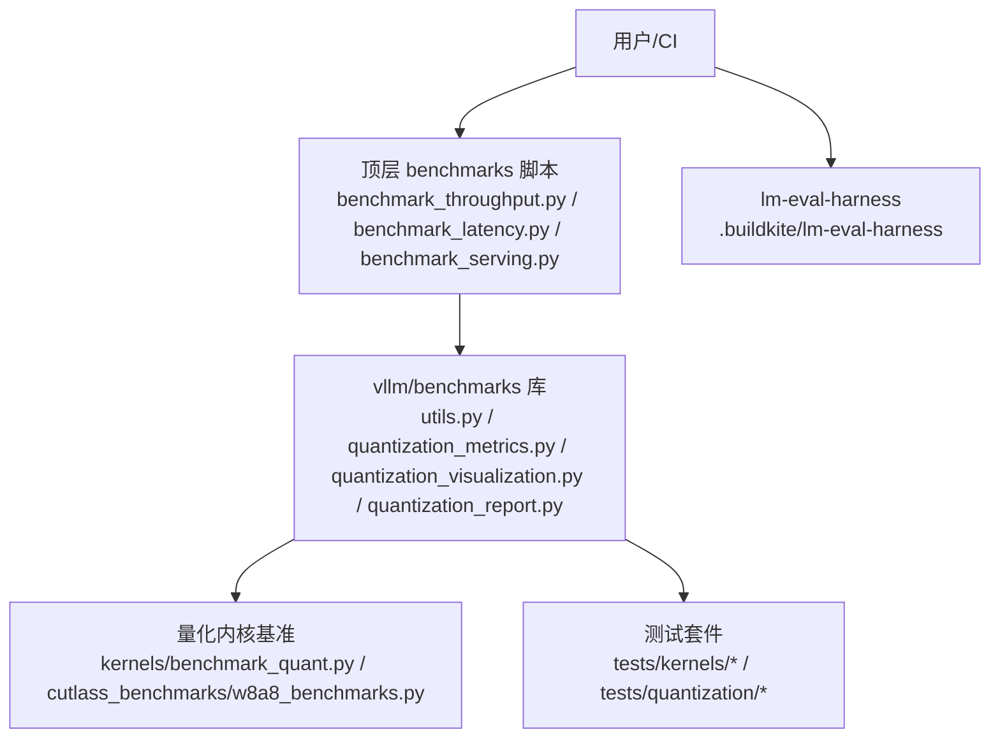
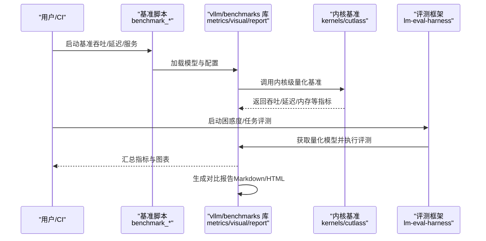
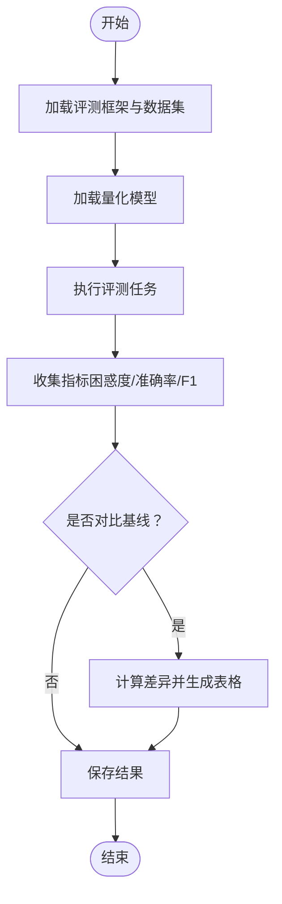
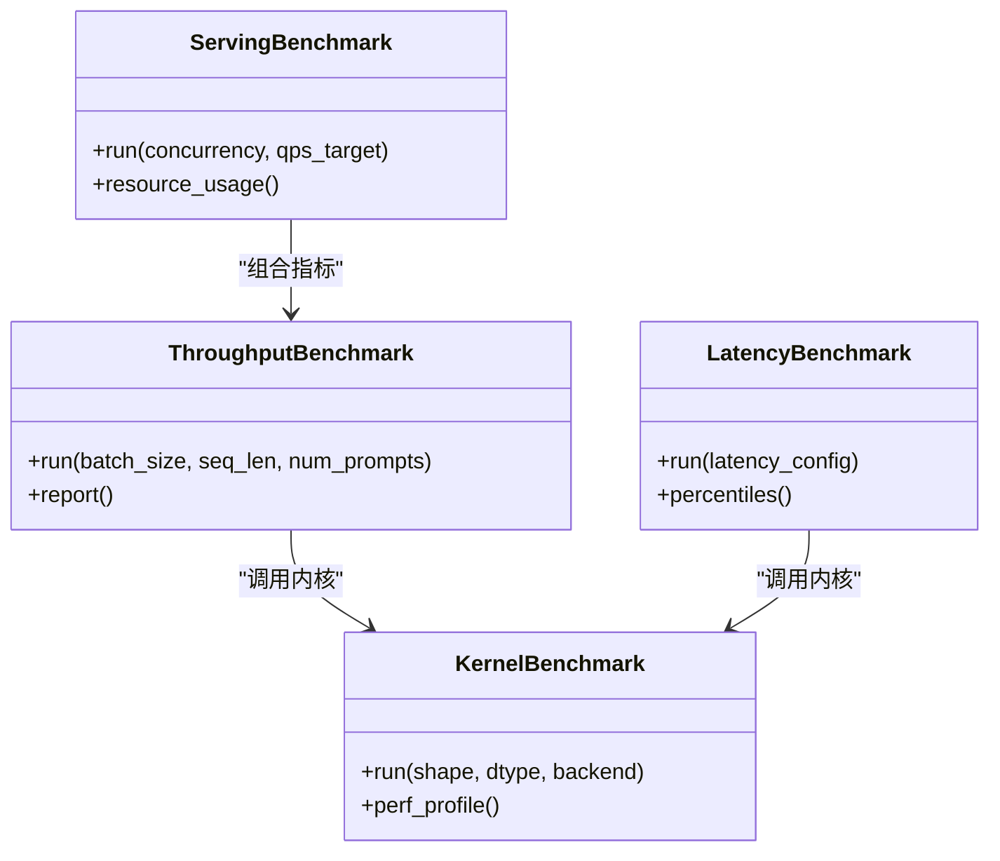
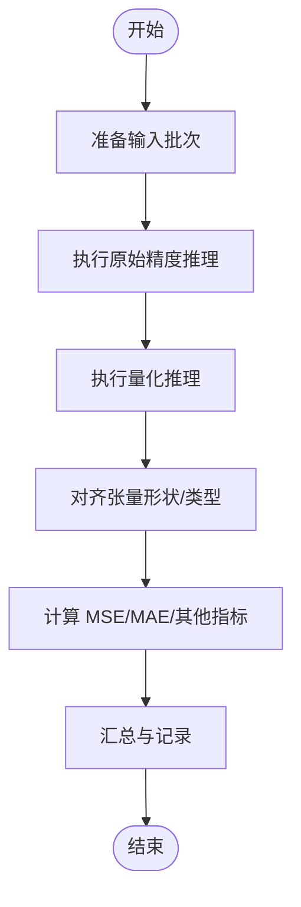
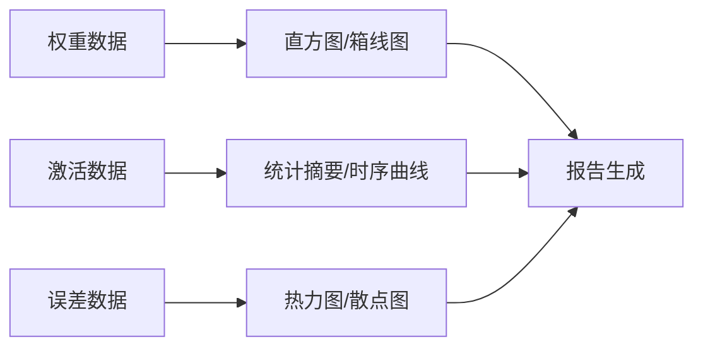
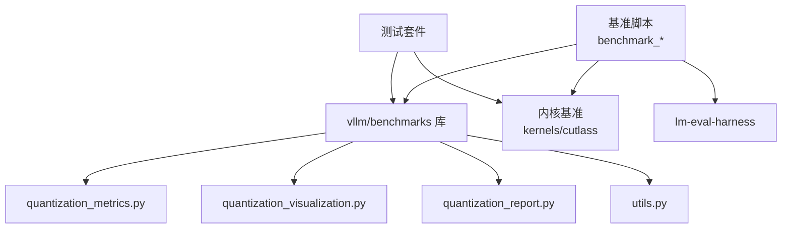

# 量化效果评估

<cite>
**本文引用的文件**   
- [README.md](file://README.md)
- [benchmarks/README.md](file://benchmarks/README.md)
- [benchmarks/benchmark_throughput.py](file://benchmarks/benchmark_throughput.py)
- [benchmarks/benchmark_latency.py](file://benchmarks/benchmark_latency.py)
- [benchmarks/benchmark_serving.py](file://benchmarks/benchmark_serving.py)
- [benchmarks/kernels/benchmark_quant.py](file://benchmarks/kernels/benchmark_quant.py)
- [benchmarks/cutlass_benchmarks/w8a8_benchmarks.py](file://benchmarks/cutlass_benchmarks/w8a8_benchmarks.py)
- [vllm/benchmarks/__init__.py](file://vllm/benchmarks/__init__.py)
- [vllm/benchmarks/benchmark_throughput.py](file://vllm/benchmarks/benchmark_throughput.py)
- [vllm/benchmarks/benchmark_latency.py](file://vllm/benchmarks/benchmark_latency.py)
- [vllm/benchmarks/benchmark_serving.py](file://vllm/benchmarks/benchmark_serving.py)
- [vllm/benchmarks/utils.py](file://vllm/benchmarks/utils.py)
- [vllm/benchmarks/quantization_metrics.py](file://vllm/benchmarks/quantization_metrics.py)
- [vllm/benchmarks/quantization_visualization.py](file://vllm/benchmarks/quantization_visualization.py)
- [vllm/benchmarks/quantization_report.py](file://vllm/benchmarks/quantization_report.py)
- [tests/kernels/test_fused_quant_activation.py](file://tests/kernels/test_fused_quant_activation.py)
- [tests/quantization/test_quant_model.py](file://tests/quantization/test_quant_model.py)
- [.buildkite/lm-eval-harness/README.md](file://.buildkite/lm-eval-harness/README.md)
</cite>

## 目录
1. [简介](#简介)
2. [项目结构](#项目结构)
3. [核心组件](#核心组件)
4. [架构总览](#架构总览)
5. [详细组件分析](#详细组件分析)
6. [依赖关系分析](#依赖关系分析)
7. [性能考量](#性能考量)
8. [故障排查指南](#故障排查指南)
9. [结论](#结论)
10. [附录](#附录)

## 简介
本文件面向需要在 vLLM 中系统化评估量化效果的工程师与研究者，覆盖以下目标：
- 如何测量量化对模型精度的影响（困惑度、任务准确率等）
- 如何使用内置或配套工具进行性能基准测试（吞吐量、延迟、内存占用）
- 如何进行量化前后对比分析（权重分布可视化、激活值统计）
- 如何度量量化误差（MSE、MAE 等）
- 如何对不同量化方案进行对比分析
- 自动化评估脚本与报告生成
- 量化效果优化建议与指导原则

## 项目结构
vLLM 的量化评估相关能力分布在 benchmarks 与 vllm/benchmarks 两个层面：
- 顶层 benchmarks：提供命令行入口与示例脚本，便于快速运行吞吐、延迟、服务化基准
- vllm/benchmarks：封装可复用的 Python API，包含量化指标计算、可视化与报告生成模块
- tests：包含针对量化内核与端到端模型的单元测试，用于回归验证
- .buildkite/lm-eval-harness：集成 lm-eval-harness 的 CI 配置与说明，用于困惑度与任务评测

图表来源
- [benchmarks/README.md](file://benchmarks/README.md)
- [vllm/benchmarks/__init__.py](file://vllm/benchmarks/__init__.py)
- [vllm/benchmarks/utils.py](file://vllm/benchmarks/utils.py)
- [vllm/benchmarks/quantization_metrics.py](file://vllm/benchmarks/quantization_metrics.py)
- [vllm/benchmarks/quantization_visualization.py](file://vllm/benchmarks/quantization_visualization.py)
- [vllm/benchmarks/quantization_report.py](file://vllm/benchmarks/quantization_report.py)
- [benchmarks/kernels/benchmark_quant.py](file://benchmarks/kernels/benchmark_quant.py)
- [benchmarks/cutlass_benchmarks/w8a8_benchmarks.py](file://benchmarks/cutlass_benchmarks/w8a8_benchmarks.py)
- [.buildkite/lm-eval-harness/README.md](file://.buildkite/lm-eval-harness/README.md)

章节来源
- [README.md](file://README.md)
- [benchmarks/README.md](file://benchmarks/README.md)

## 核心组件
- 精度评估
  - 困惑度（Perplexity）与任务准确率：通过 lm-eval-harness 在 CI 中集成，结合 vLLM 推理引擎执行评测集
  - 量化误差指标：MSE、MAE 等，由量化指标模块统一计算
- 性能基准
  - 吞吐、延迟、并发与服务化指标：由 benchmark_throughput、benchmark_latency、benchmark_serving 提供
  - 内核级基准：w8a8、cutlass 等路径的 GEMM/量化算子基准
- 对比分析与可视化
  - 权重分布直方图、激活值统计、误差热力图等
  - 自动报告生成（Markdown/HTML），汇总多套量化方案的指标与图表
- 自动化与可重复性
  - 统一的 CLI 参数与配置文件驱动
  - 日志与指标导出，便于 CI 归档与回溯

章节来源
- [vllm/benchmarks/quantization_metrics.py](file://vllm/benchmarks/quantization_metrics.py)
- [vllm/benchmarks/quantization_visualization.py](file://vllm/benchmarks/quantization_visualization.py)
- [vllm/benchmarks/quantization_report.py](file://vllm/benchmarks/quantization_report.py)
- [benchmarks/benchmark_throughput.py](file://benchmarks/benchmark_throughput.py)
- [benchmarks/benchmark_latency.py](file://benchmarks/benchmark_latency.py)
- [benchmarks/benchmark_serving.py](file://benchmarks/benchmark_serving.py)
- [benchmarks/kernels/benchmark_quant.py](file://benchmarks/kernels/benchmark_quant.py)
- [benchmarks/cutlass_benchmarks/w8a8_benchmarks.py](file://benchmarks/cutlass_benchmarks/w8a8_benchmarks.py)
- [.buildkite/lm-eval-harness/README.md](file://.buildkite/lm-eval-harness/README.md)

## 架构总览
下图展示了从“量化模型”到“评估与报告”的整体流程。量化后的模型经不同基准脚本驱动，调用 vllm/benchmarks 提供的指标与可视化工具，最终输出对比报告。

图表来源
- [benchmarks/benchmark_throughput.py](file://benchmarks/benchmark_throughput.py)
- [benchmarks/benchmark_latency.py](file://benchmarks/benchmark_latency.py)
- [benchmarks/benchmark_serving.py](file://benchmarks/benchmark_serving.py)
- [vllm/benchmarks/quantization_metrics.py](file://vllm/benchmarks/quantization_metrics.py)
- [vllm/benchmarks/quantization_visualization.py](file://vllm/benchmarks/quantization_visualization.py)
- [vllm/benchmarks/quantization_report.py](file://vllm/benchmarks/quantization_report.py)
- [benchmarks/kernels/benchmark_quant.py](file://benchmarks/kernels/benchmark_quant.py)
- [benchmarks/cutlass_benchmarks/w8a8_benchmarks.py](file://benchmarks/cutlass_benchmarks/w8a8_benchmarks.py)
- [.buildkite/lm-eval-harness/README.md](file://.buildkite/lm-eval-harness/README.md)

## 详细组件分析

### 精度评估：困惑度与任务准确率
- 使用 lm-eval-harness 在 CI 中执行标准评测集，支持多种任务（如语言建模、问答、数学推理等）
- 通过 vLLM 引擎加载量化模型，确保评测环境与部署一致
- 关键步骤
  - 准备评测数据集与提示模板
  - 配置量化模型加载器与推理后端
  - 执行评测并收集结果（困惑度、准确率、F1 等）
  - 将结果与基线（非量化或不同量化方案）对比

章节来源
- [.buildkite/lm-eval-harness/README.md](file://.buildkite/lm-eval-harness/README.md)

### 性能基准：吞吐、延迟、内存
- 吞吐基准：批量请求下的 tokens/s、requests/s 等
- 延迟基准：P50/P90/P99 延迟、首 token 延迟、端到端延迟
- 服务化基准：并发、队列长度、资源利用率
- 内核基准：GEMM、量化算子的吞吐与时延

图表来源
- [benchmarks/benchmark_throughput.py](file://benchmarks/benchmark_throughput.py)
- [benchmarks/benchmark_latency.py](file://benchmarks/benchmark_latency.py)
- [benchmarks/benchmark_serving.py](file://benchmarks/benchmark_serving.py)
- [benchmarks/kernels/benchmark_quant.py](file://benchmarks/kernels/benchmark_quant.py)
- [benchmarks/cutlass_benchmarks/w8a8_benchmarks.py](file://benchmarks/cutlass_benchmarks/w8a8_benchmarks.py)

章节来源
- [benchmarks/benchmark_throughput.py](file://benchmarks/benchmark_throughput.py)
- [benchmarks/benchmark_latency.py](file://benchmarks/benchmark_latency.py)
- [benchmarks/benchmark_serving.py](file://benchmarks/benchmark_serving.py)
- [benchmarks/kernels/benchmark_quant.py](file://benchmarks/kernels/benchmark_quant.py)
- [benchmarks/cutlass_benchmarks/w8a8_benchmarks.py](file://benchmarks/cutlass_benchmarks/w8a8_benchmarks.py)

### 量化误差度量：MSE、MAE 等
- 在相同输入下，比较原始精度与量化后输出的逐元素误差
- 常用指标
  - MSE（均方误差）：对大误差更敏感
  - MAE（平均绝对误差）：稳健性强
  - 可选：相对误差、最大绝对误差、分位数误差
- 典型流程
  - 选择代表性输入批次
  - 分别执行原始与量化推理
  - 对齐张量形状与数据类型
  - 计算误差指标并汇总

章节来源
- [vllm/benchmarks/quantization_metrics.py](file://vllm/benchmarks/quantization_metrics.py)

### 对比分析与可视化：权重分布、激活值统计
- 权重分布：直方图、箱线图、分位数统计
- 激活值统计：均值、方差、极值、异常点检测
- 误差可视化：逐层误差热力图、通道级误差分布
- 输出格式：PNG/SVG 图表与 Markdown/HTML 报告

图表来源
- [vllm/benchmarks/quantization_visualization.py](file://vllm/benchmarks/quantization_visualization.py)
- [vllm/benchmarks/quantization_report.py](file://vllm/benchmarks/quantization_report.py)

章节来源
- [vllm/benchmarks/quantization_visualization.py](file://vllm/benchmarks/quantization_visualization.py)
- [vllm/benchmarks/quantization_report.py](file://vllm/benchmarks/quantization_report.py)

### 自动化评估脚本与报告生成
- 统一入口：通过 vllm/benchmarks 提供的 CLI 或 Python API
- 输入：模型路径、量化配置、评测集、基准参数
- 输出：指标 JSON/CSV、图表、Markdown/HTML 报告
- 推荐工作流
  - 定义多套量化方案（如 INT8、FP8、W8A8、混合精度）
  - 并行执行基准与评测
  - 聚合结果并生成对比报告
  - 归档日志与产物，供 CI 与团队共享

章节来源
- [vllm/benchmarks/__init__.py](file://vllm/benchmarks/__init__.py)
- [vllm/benchmarks/utils.py](file://vllm/benchmarks/utils.py)
- [vllm/benchmarks/quantization_report.py](file://vllm/benchmarks/quantization_report.py)

### 单元测试与回归验证
- 内核级测试：验证量化激活融合、GEMM 正确性与数值稳定性
- 模型级测试：验证量化模型加载、推理一致性、与基线差异阈值

章节来源
- [tests/kernels/test_fused_quant_activation.py](file://tests/kernels/test_fused_quant_activation.py)
- [tests/quantization/test_quant_model.py](file://tests/quantization/test_quant_model.py)

## 依赖关系分析
- 基准脚本依赖 vllm/benchmarks 库中的指标、可视化与报告模块
- 内核基准依赖底层 CUTLASS/自定义内核实现
- 评测框架依赖 lm-eval-harness 与 vLLM 推理引擎
- 测试套件依赖 vLLM 内核与模型加载器

图表来源
- [benchmarks/benchmark_throughput.py](file://benchmarks/benchmark_throughput.py)
- [benchmarks/benchmark_latency.py](file://benchmarks/benchmark_latency.py)
- [benchmarks/benchmark_serving.py](file://benchmarks/benchmark_serving.py)
- [vllm/benchmarks/quantization_metrics.py](file://vllm/benchmarks/quantization_metrics.py)
- [vllm/benchmarks/quantization_visualization.py](file://vllm/benchmarks/quantization_visualization.py)
- [vllm/benchmarks/quantization_report.py](file://vllm/benchmarks/quantization_report.py)
- [vllm/benchmarks/utils.py](file://vllm/benchmarks/utils.py)
- [benchmarks/kernels/benchmark_quant.py](file://benchmarks/kernels/benchmark_quant.py)
- [benchmarks/cutlass_benchmarks/w8a8_benchmarks.py](file://benchmarks/cutlass_benchmarks/w8a8_benchmarks.py)
- [.buildkite/lm-eval-harness/README.md](file://.buildkite/lm-eval-harness/README.md)

章节来源
- [vllm/benchmarks/__init__.py](file://vllm/benchmarks/__init__.py)
- [benchmarks/README.md](file://benchmarks/README.md)

## 性能考量
- 硬件与后端
  - GPU 型号、显存带宽、CUDA/CUTLASS 版本对吞吐与延迟有显著影响
  - 不同量化格式（INT8/FP8/W8A8/NVFP4）在不同硬件上的表现差异
- 批处理与序列长度
  - 增大 batch_size 提升吞吐但可能增加尾延迟
  - 长序列场景需关注 KV Cache 与注意力开销
- 内存与缓存
  - 量化降低显存占用，但需平衡精度损失
  - 预取与缓存策略影响首 token 延迟
- 数值稳定性
  - 量化缩放因子与舍入策略会影响极端值的误差
  - 建议监控 P99 延迟与误差分布

[本节为通用指导，不直接分析具体文件]

## 故障排查指南
- 常见问题
  - 量化后精度下降明显：检查缩放策略、校准集代表性、激活范围截断
  - 吞吐不达预期：确认内核路径（CUTLASS/自定义）、批大小与序列长度设置
  - 内存溢出：减少并发、调整 KV Cache 策略、启用分页或卸载
  - 评测结果不稳定：固定随机种子、预热模型、避免 GC 抖动
- 定位方法
  - 查看基准日志与指标导出文件
  - 使用可视化模块绘制权重/激活/误差分布，定位异常层或通道
  - 通过单元测试与回归测试验证内核与模型加载的正确性

章节来源
- [tests/kernels/test_fused_quant_activation.py](file://tests/kernels/test_fused_quant_activation.py)
- [tests/quantization/test_quant_model.py](file://tests/quantization/test_quant_model.py)
- [vllm/benchmarks/quantization_visualization.py](file://vllm/benchmarks/quantization_visualization.py)
- [vllm/benchmarks/quantization_report.py](file://vllm/benchmarks/quantization_report.py)

## 结论
vLLM 提供了从精度到性能的完整量化评估体系：以 lm-eval-harness 进行困惑度与任务评测，以 benchmark_* 系列脚本进行吞吐、延迟与服务化基准，以量化指标与可视化工具进行误差度量与对比分析，并以自动化报告生成提升效率与可重复性。建议在工程实践中采用“多方案并行评估—可视化定位—迭代优化”的闭环流程，持续逼近精度与性能的最优平衡。

[本节为总结性内容，不直接分析具体文件]

## 附录
- 快速上手
  - 安装与依赖：参考仓库 README 与 requirements
  - 运行基准：使用顶层 benchmarks 脚本或 vllm/benchmarks API
  - 生成报告：调用报告生成模块，导出 Markdown/HTML
- 最佳实践
  - 校准集应覆盖真实负载分布
  - 同时评估多套量化方案（INT8/FP8/W8A8/混合）
  - 建立回归阈值与 CI 门禁
  - 定期更新评测集与硬件环境

[本节为补充信息，不直接分析具体文件]