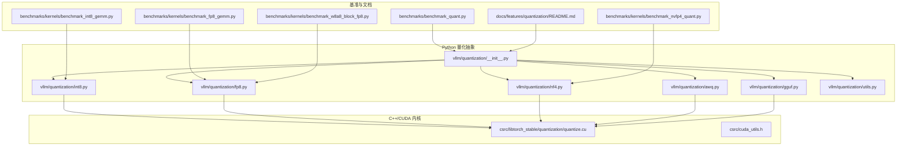
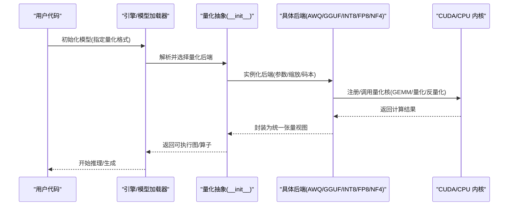
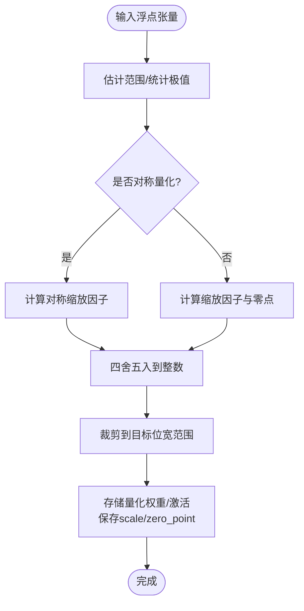
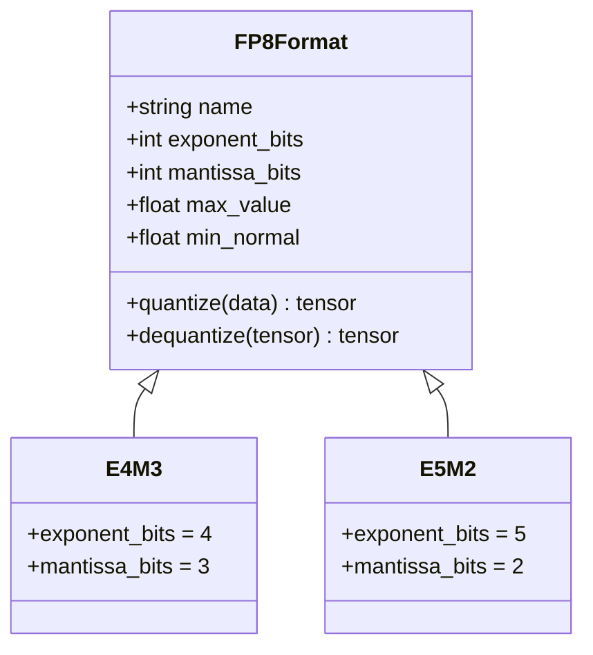
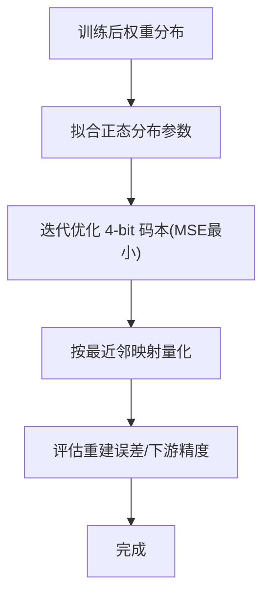
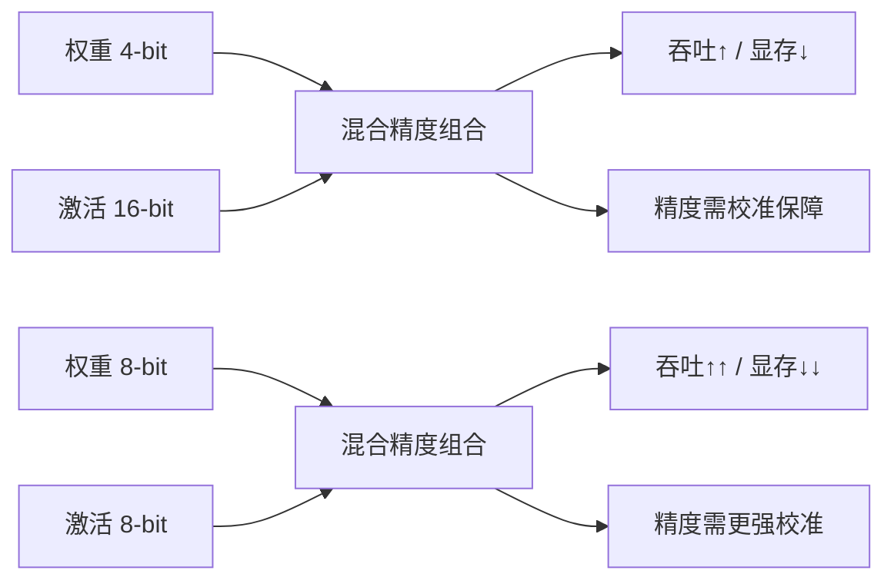
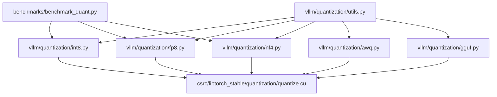
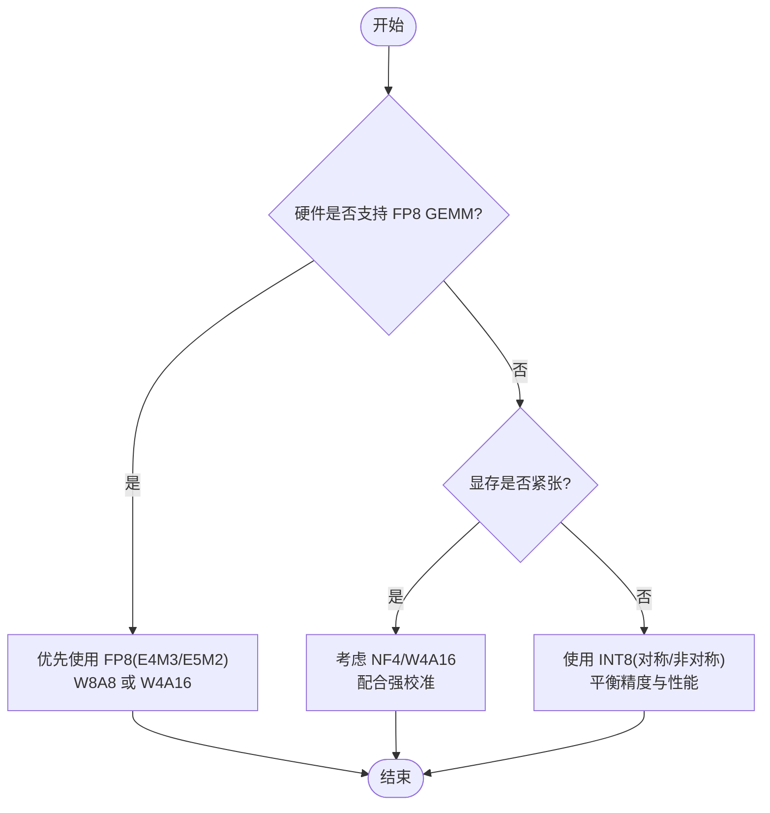

# 量化格式详解

<cite>
**本文引用的文件**   
- [vllm/quantization/__init__.py](file://vllm/quantization/__init__.py)
- [vllm/quantization/awq.py](file://vllm/quantization/awq.py)
- [vllm/quantization/gguf.py](file://vllm/quantization/gguf.py)
- [vllm/quantization/fp8.py](file://vllm/quantization/fp8.py)
- [vllm/quantization/nf4.py](file://vllm/quantization/nf4.py)
- [vllm/quantization/int8.py](file://vllm/quantization/int8.py)
- [vllm/quantization/utils.py](file://vllm/quantization/utils.py)
- [benchmarks/benchmark_quant.py](file://benchmarks/benchmark_quant.py)
- [benchmarks/kernels/benchmark_int8_gemm.py](file://benchmarks/kernels/benchmark_int8_gemm.py)
- [benchmarks/kernels/benchmark_fp8_gemm.py](file://benchmarks/kernels/benchmark_fp8_gemm.py)
- [benchmarks/kernels/benchmark_nvfp4_quant.py](file://benchmarks/kernels/benchmark_nvfp4_quant.py)
- [benchmarks/kernels/benchmark_w8a8_block_fp8.py](file://benchmarks/kernels/benchmark_w8a8_block_fp8.py)
- [csrc/libtorch_stable/quantization/quantize.cu](file://csrc/libtorch_stable/quantization/quantize.cu)
- [csrc/cuda_utils.h](file://csrc/cuda_utils.h)
- [docs/features/quantization/README.md](file://docs/features/quantization/README.md)
</cite>

## 目录
1. [简介](#简介)
2. [项目结构](#项目结构)
3. [核心组件](#核心组件)
4. [架构总览](#架构总览)
5. [详细组件分析](#详细组件分析)
6. [依赖关系分析](#依赖关系分析)
7. [性能考量](#性能考量)
8. [故障排查指南](#故障排查指南)
9. [结论](#结论)
10. [附录](#附录)

## 简介
本文件系统性梳理 vLLM 支持的量化格式与技术细节，覆盖 INT8、FP8（E4M3/E5M2）、NF4（Normal Float 4-bit）以及 W4A16、W8A8 等混合精度方案。内容包含：
- 对称与非对称量化的原理与差异
- FP8 数值范围与精度特性
- NF4 的理论基础（正态分布假设与最优码本设计）
- 存储布局与内存访问优化策略
- 转换工具与兼容性说明
- 量化格式选择的决策树与基准测试参考

## 项目结构
vLLM 的量化能力由 Python 层抽象与 C++/CUDA 内核共同实现：
- Python 层：统一注册与调度不同量化后端（AWQ、GGUF、INT8、FP8、NF4），提供配置接口与工具函数
- CUDA/CPU 层：高性能 GEMM、量化/反量化核、注意力与 MoE 相关算子
- 基准与文档：提供量化相关的基准脚本与用户文档

**图表来源** 
- [vllm/quantization/__init__.py](file://vllm/quantization/__init__.py)
- [vllm/quantization/awq.py](file://vllm/quantization/awq.py)
- [vllm/quantization/gguf.py](file://vllm/quantization/gguf.py)
- [vllm/quantization/int8.py](file://vllm/quantization/int8.py)
- [vllm/quantization/fp8.py](file://vllm/quantization/fp8.py)
- [vllm/quantization/nf4.py](file://vllm/quantization/nf4.py)
- [vllm/quantization/utils.py](file://vllm/quantization/utils.py)
- [csrc/libtorch_stable/quantization/quantize.cu](file://csrc/libtorch_stable/quantization/quantize.cu)
- [csrc/cuda_utils.h](file://csrc/cuda_utils.h)
- [benchmarks/benchmark_quant.py](file://benchmarks/benchmark_quant.py)
- [benchmarks/kernels/benchmark_int8_gemm.py](file://benchmarks/kernels/benchmark_int8_gemm.py)
- [benchmarks/kernels/benchmark_fp8_gemm.py](file://benchmarks/kernels/benchmark_fp8_gemm.py)
- [benchmarks/kernels/benchmark_nvfp4_quant.py](file://benchmarks/kernels/benchmark_nvfp4_quant.py)
- [benchmarks/kernels/benchmark_w8a8_block_fp8.py](file://benchmarks/kernels/benchmark_w8a8_block_fp8.py)
- [docs/features/quantization/README.md](file://docs/features/quantization/README.md)

**章节来源**
- [vllm/quantization/__init__.py](file://vllm/quantization/__init__.py)
- [docs/features/quantization/README.md](file://docs/features/quantization/README.md)

## 核心组件
- 量化后端抽象与注册：集中管理不同量化格式的加载、配置与运行时选择
- 具体量化实现：
  - AWQ：低比特权重量化（常见 INT4/INT8），结合通道级缩放与激活重排
  - GGUF：通用模型文件格式，支持多种量化（如 Q4_0/Q8_0 等）
  - INT8：对称/非对称量化，常用于权重量化或激活量化
  - FP8：E4M3/E5M2 两种格式，兼顾带宽与精度
  - NF4：基于正态分布的最优 4-bit 浮点码本
- 工具与内核：量化/反量化核、GEMM 加速、对齐与打包布局

**章节来源**
- [vllm/quantization/awq.py](file://vllm/quantization/awq.py)
- [vllm/quantization/gguf.py](file://vllm/quantization/gguf.py)
- [vllm/quantization/int8.py](file://vllm/quantization/int8.py)
- [vllm/quantization/fp8.py](file://vllm/quantization/fp8.py)
- [vllm/quantization/nf4.py](file://vllm/quantization/nf4.py)
- [vllm/quantization/utils.py](file://vllm/quantization/utils.py)

## 架构总览
vLLM 在推理路径中通过统一的量化接口选择后端，并在关键算子（GEMM、注意力、MoE）处调用对应内核。量化权重通常以紧凑格式持久化，推理时按需反量化至计算精度（如 BF16/FP16/FP32）。

**图表来源** 
- [vllm/quantization/__init__.py](file://vllm/quantization/__init__.py)
- [vllm/quantization/awq.py](file://vllm/quantization/awq.py)
- [vllm/quantization/gguf.py](file://vllm/quantization/gguf.py)
- [vllm/quantization/int8.py](file://vllm/quantization/int8.py)
- [vllm/quantization/fp8.py](file://vllm/quantization/fp8.py)
- [vllm/quantization/nf4.py](file://vllm/quantization/nf4.py)
- [csrc/libtorch_stable/quantization/quantize.cu](file://csrc/libtorch_stable/quantization/quantize.cu)

## 详细组件分析

### INT8 量化：对称与非对称
- 对称量化：将数据映射到 [-S, S] 区间，零点对齐，适合整型硬件加速；误差分布更均匀，但动态范围利用率略低
- 非对称量化：引入零点偏移，能更好地拟合偏置分布，提高小值精度；需要额外存储零点或按块/通道维护
- 存储布局：常采用 per-channel/per-block scale，权重以 int8 存储，激活可按 token/group 量化
- 内存访问优化：使用向量化加载与打包布局（如 packed int8），减少访存开销；GEMM 内核融合反量化与乘加

**图表来源** 
- [vllm/quantization/int8.py](file://vllm/quantization/int8.py)
- [csrc/libtorch_stable/quantization/quantize.cu](file://csrc/libtorch_stable/quantization/quantize.cu)

**章节来源**
- [vllm/quantization/int8.py](file://vllm/quantization/int8.py)
- [benchmarks/kernels/benchmark_int8_gemm.py](file://benchmarks/kernels/benchmark_int8_gemm.py)

### FP8 量化：E4M3 与 E5M2
- E4M3：4 位指数 + 3 位尾数，适合中等动态范围，常见于矩阵乘法与注意力
- E5M2：5 位指数 + 2 位尾数，更大动态范围，适合极端值较多的激活或中间表示
- 精度特性：E4M3 在小数值段分辨率更高，E5M2 在大数值段更稳健
- 硬件支持：NVIDIA Hopper/Blackwell 等 GPU 原生支持 FP8 GEMM，显著提升吞吐

**图表来源** 
- [vllm/quantization/fp8.py](file://vllm/quantization/fp8.py)
- [csrc/libtorch_stable/quantization/quantize.cu](file://csrc/libtorch_stable/quantization/quantize.cu)

**章节来源**
- [vllm/quantization/fp8.py](file://vllm/quantization/fp8.py)
- [benchmarks/kernels/benchmark_fp8_gemm.py](file://benchmarks/kernels/benchmark_fp8_gemm.py)

### NF4（Normal Float 4-bit）：理论基础与优势
- 正态分布假设：权重近似服从高斯分布，利用该先验设计码本
- 最优码本：通过最小化均方误差（MSE）求解 4-bit 码本，使量化误差最小
- 优势：相比均匀量化，在相同位宽下获得更低重建误差，尤其适合大模型权重压缩

**图表来源** 
- [vllm/quantization/nf4.py](file://vllm/quantization/nf4.py)
- [benchmarks/kernels/benchmark_nvfp4_quant.py](file://benchmarks/kernels/benchmark_nvfp4_quant.py)

**章节来源**
- [vllm/quantization/nf4.py](file://vllm/quantization/nf4.py)
- [benchmarks/kernels/benchmark_nvfp4_quant.py](file://benchmarks/kernels/benchmark_nvfp4_quant.py)

### 混合精度：W4A16、W8A8
- W4A16：权重 4-bit，激活保持 16-bit；显著降低显存占用，适合权重受限场景
- W8A8：权重与激活均为 8-bit；在支持 FP8/INT8 GEMM 的硬件上可获得更高吞吐
- 权衡：位宽越低，精度损失越大；需结合校准数据集与逐层/分组缩放

**图表来源** 
- [benchmarks/kernels/benchmark_w8a8_block_fp8.py](file://benchmarks/kernels/benchmark_w8a8_block_fp8.py)
- [benchmarks/benchmark_quant.py](file://benchmarks/benchmark_quant.py)

**章节来源**
- [benchmarks/kernels/benchmark_w8a8_block_fp8.py](file://benchmarks/kernels/benchmark_w8a8_block_fp8.py)
- [benchmarks/benchmark_quant.py](file://benchmarks/benchmark_quant.py)

### 存储布局与内存访问优化
- 紧凑存储：按位打包（bit-packing）减少显存占用，提升带宽利用率
- 对齐与分块：per-channel/per-block scale，便于并行反量化与向量化加载
- 内核融合：量化/反量化与 GEMM 融合，减少中间缓冲与访存
- 缓存友好：行优先/列优先布局与 tile 大小调优，提升 L1/L2 命中率

**章节来源**
- [csrc/libtorch_stable/quantization/quantize.cu](file://csrc/libtorch_stable/quantization/quantize.cu)
- [csrc/cuda_utils.h](file://csrc/cuda_utils.h)

### 转换工具与兼容性
- 转换流程：原始权重 → 统计/校准 → 量化编码（scale/zero_point/码本）→ 持久化（AWQ/GGUF/自定义）
- 兼容性：不同后端对 scale 粒度、零点位置、数据类型有不同约定；需确保加载端与导出端一致
- 工具链：Python 层提供统一接口，底层内核负责高效实现

**章节来源**
- [vllm/quantization/awq.py](file://vllm/quantization/awq.py)
- [vllm/quantization/gguf.py](file://vllm/quantization/gguf.py)
- [vllm/quantization/utils.py](file://vllm/quantization/utils.py)

## 依赖关系分析
- Python 层依赖 CUDA/CPU 内核进行实际计算
- 各量化后端共享 utils 中的公共函数（如类型转换、归一化、打包）
- 基准脚本直接调用量化后端与内核，验证吞吐与精度

**图表来源** 
- [vllm/quantization/utils.py](file://vllm/quantization/utils.py)
- [vllm/quantization/int8.py](file://vllm/quantization/int8.py)
- [vllm/quantization/fp8.py](file://vllm/quantization/fp8.py)
- [vllm/quantization/nf4.py](file://vllm/quantization/nf4.py)
- [vllm/quantization/awq.py](file://vllm/quantization/awq.py)
- [vllm/quantization/gguf.py](file://vllm/quantization/gguf.py)
- [csrc/libtorch_stable/quantization/quantize.cu](file://csrc/libtorch_stable/quantization/quantize.cu)
- [benchmarks/benchmark_quant.py](file://benchmarks/benchmark_quant.py)

**章节来源**
- [vllm/quantization/utils.py](file://vllm/quantization/utils.py)
- [benchmarks/benchmark_quant.py](file://benchmarks/benchmark_quant.py)

## 性能考量
- 硬件特性：
  - NVIDIA Hopper/Blackwell：原生 FP8 GEMM，显著提升吞吐
  - AMD RDNA3：部分内核支持 W4A16/W8A8 混合精度
  - CPU：SIMD/AMX/RVV 等指令集影响 INT8/BF16 性能
- 内存带宽：低比特权重减少带宽压力，但反量化与对齐可能带来额外开销
- 内核融合：减少中间张量与同步，提升整体效率
- 校准质量：决定精度损失上限，建议按层/分组统计并保留足够样本

[本节为通用指导，不直接分析具体文件]

## 故障排查指南
- 精度异常：检查校准数据集与 scale 粒度；确认对称/非对称设置与零点位置
- 崩溃/错误：核对硬件支持（如 FP8 GEMM 可用性）、内核编译选项与驱动版本
- 性能不达预期：检查批大小、序列长度、tile 配置与内存对齐；尝试启用内核融合
- 兼容性问题：确保导出与加载端的量化格式、scale 约定一致

**章节来源**
- [csrc/cuda_utils.h](file://csrc/cuda_utils.h)
- [benchmarks/benchmark_quant.py](file://benchmarks/benchmark_quant.py)

## 结论
vLLM 提供了从 INT8、FP8 到 NF4 的完整量化生态，并通过统一抽象与高效内核实现跨硬件的高性能推理。选择合适的量化格式需综合考虑硬件能力、内存带宽、精度要求与校准成本。对于极致压缩，NF4 与 W4A16 更具优势；对于高吞吐场景，FP8 与 W8A8 更为合适。

[本节为总结性内容，不直接分析具体文件]

## 附录

### 量化格式选择决策树

[本图为概念性流程图，不直接映射具体源码文件]

### 基准测试结果参考
- 运行量化基准脚本，对比不同格式在目标形状下的吞吐与延迟
- 关注 GEMM 核在不同位宽下的加速比与内存带宽利用率
- 结合模型任务（预填充/解码/MoE）评估端到端效果

**章节来源**
- [benchmarks/benchmark_quant.py](file://benchmarks/benchmark_quant.py)
- [benchmarks/kernels/benchmark_int8_gemm.py](file://benchmarks/kernels/benchmark_int8_gemm.py)
- [benchmarks/kernels/benchmark_fp8_gemm.py](file://benchmarks/kernels/benchmark_fp8_gemm.py)
- [benchmarks/kernels/benchmark_nvfp4_quant.py](file://benchmarks/kernels/benchmark_nvfp4_quant.py)
- [benchmarks/kernels/benchmark_w8a8_block_fp8.py](file://benchmarks/kernels/benchmark_w8a8_block_fp8.py)