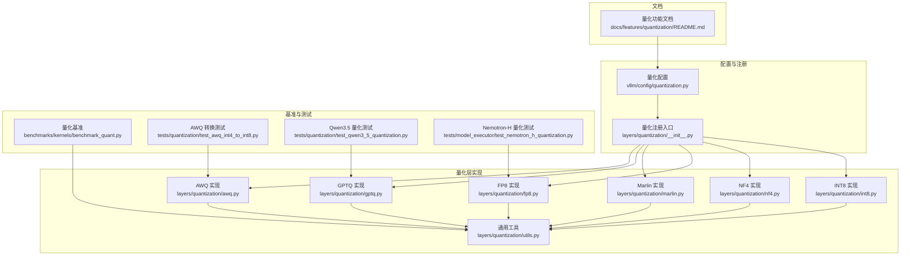
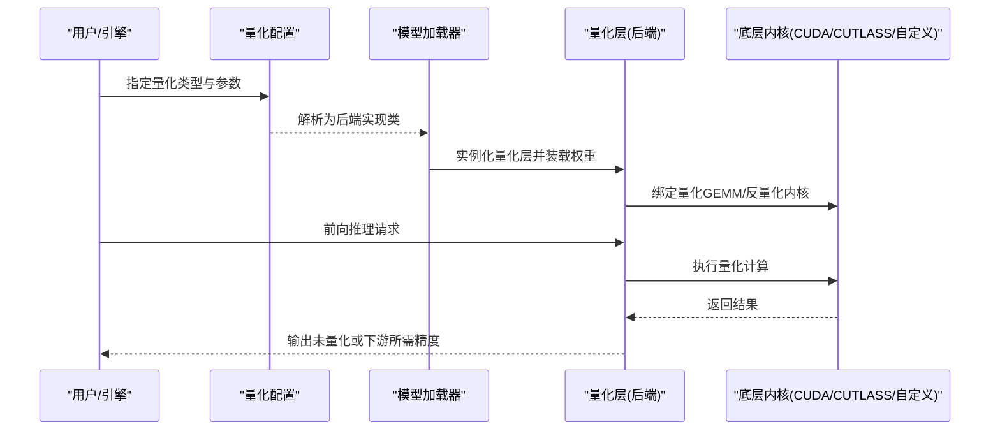
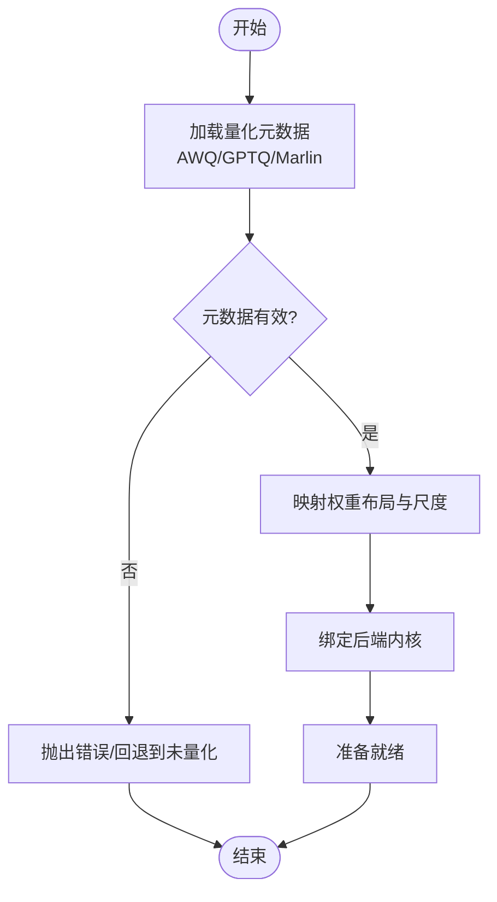
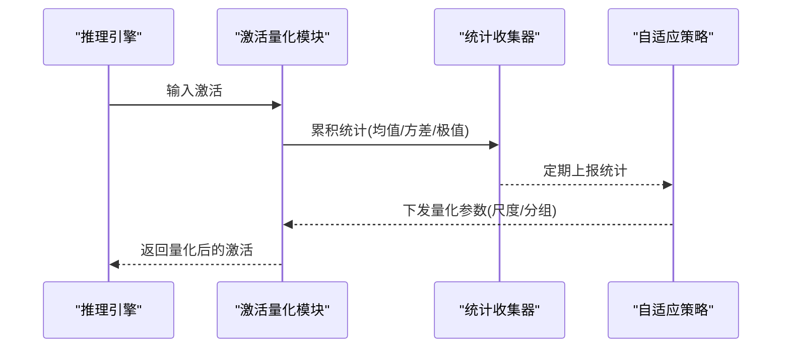
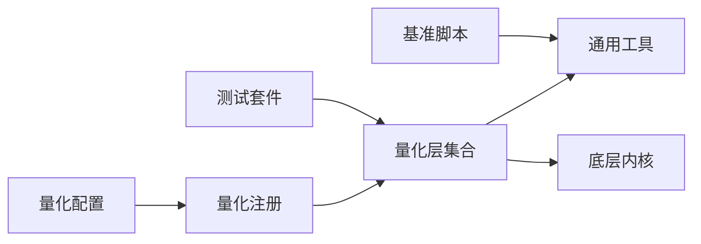

# 量化系统

<cite>
**本文引用的文件**   
- [vllm/config/quantization.py](file://vllm/config/quantization.py)
- [vllm/model_executor/layers/quantization/__init__.py](file://vllm/model_executor/layers/quantization/__init__.py)
- [vllm/model_executor/layers/quantization/awq.py](file://vllm/model_executor/layers/quantization/awq.py)
- [vllm/model_executor/layers/quantization/gptq.py](file://vllm/model_executor/layers/quantization/gptq.py)
- [vllm/model_executor/layers/quantization/marlin.py](file://vllm/model_executor/layers/quantization/marlin.py)
- [vllm/model_executor/layers/quantization/fp8.py](file://vllm/model_executor/layers/quantization/fp8.py)
- [vllm/model_executor/layers/quantization/nf4.py](file://vllm/model_executor/layers/quantization/nf4.py)
- [vllm/model_executor/layers/quantization/int8.py](file://vllm/model_executor/layers/quantization/int8.py)
- [vllm/model_executor/layers/quantization/utils.py](file://vllm/model_executor/layers/quantization/utils.py)
- [benchmarks/kernels/benchmark_quant.py](file://benchmarks/kernels/benchmark_quant.py)
- [tests/quantization/test_awq_int4_to_int8.py](file://tests/quantization/test_awq_int4_to_int8.py)
- [tests/quantization/test_qwen3_5_quantization.py](file://tests/quantization/test_qwen3_5_quantization.py)
- [tests/model_executor/test_nemotron_h_quantization.py](file://tests/model_executor/test_nemotron_h_quantization.py)
- [docs/features/quantization/README.md](file://docs/features/quantization/README.md)
</cite>

## 目录
1. [简介](#简介)
2. [项目结构](#项目结构)
3. [核心组件](#核心组件)
4. [架构总览](#架构总览)
5. [详细组件分析](#详细组件分析)
6. [依赖关系分析](#依赖关系分析)
7. [性能考量](#性能考量)
8. [故障排查指南](#故障排查指南)
9. [结论](#结论)
10. [附录](#附录)

## 简介
本文件系统性介绍 vLLM 的量化系统与各类量化方法，覆盖权重量化、激活量化与混合精度量化的技术细节；说明支持的量化格式（INT8、FP8、NF4 等）及其特点与性能表现；阐述预量化模型加载与优化（AWQ、GPTQ、Marlin 等后端）的使用方法；解释在线量化的实现机制（动态量化与自适应量化配置）；提供从 HuggingFace 到量化格式的转换工具与脚本；给出量化效果评估方法与精度验证工具；并总结不同量化方案的选择指南与性能对比。

## 项目结构
vLLM 的量化能力主要分布在以下位置：
- 配置与注册：量化类型枚举、后端选择与统一接口定义
- 层实现：各量化后端的权重装载、反量化与内核调用
- 基准测试：针对量化算子的性能评测脚本
- 测试用例：覆盖关键路径的正确性与数值稳定性
- 文档：功能说明与使用指南

图表来源 
- [vllm/config/quantization.py](file://vllm/config/quantization.py)
- [vllm/model_executor/layers/quantization/__init__.py](file://vllm/model_executor/layers/quantization/__init__.py)
- [vllm/model_executor/layers/quantization/awq.py](file://vllm/model_executor/layers/quantization/awq.py)
- [vllm/model_executor/layers/quantization/gptq.py](file://vllm/model_executor/layers/quantization/gptq.py)
- [vllm/model_executor/layers/quantization/marlin.py](file://vllm/model_executor/layers/quantization/marlin.py)
- [vllm/model_executor/layers/quantization/fp8.py](file://vllm/model_executor/layers/quantization/fp8.py)
- [vllm/model_executor/layers/quantization/nf4.py](file://vllm/model_executor/layers/quantization/nf4.py)
- [vllm/model_executor/layers/quantization/int8.py](file://vllm/model_executor/layers/quantization/int8.py)
- [vllm/model_executor/layers/quantization/utils.py](file://vllm/model_executor/layers/quantization/utils.py)
- [benchmarks/kernels/benchmark_quant.py](file://benchmarks/kernels/benchmark_quant.py)
- [tests/quantization/test_awq_int4_to_int8.py](file://tests/quantization/test_awq_int4_to_int8.py)
- [tests/quantization/test_qwen3_5_quantization.py](file://tests/quantization/test_qwen3_5_quantization.py)
- [tests/model_executor/test_nemotron_h_quantization.py](file://tests/model_executor/test_nemotron_h_quantization.py)
- [docs/features/quantization/README.md](file://docs/features/quantization/README.md)

章节来源
- [vllm/config/quantization.py](file://vllm/config/quantization.py)
- [vllm/model_executor/layers/quantization/__init__.py](file://vllm/model_executor/layers/quantization/__init__.py)
- [docs/features/quantization/README.md](file://docs/features/quantization/README.md)

## 核心组件
- 量化配置与注册中心
  - 负责声明支持的量化类型、后端开关以及参数默认值，并在运行时将字符串类型映射到具体实现类。
- 量化层实现
  - 每种量化格式对应一个层实现，封装权重装载、尺度计算、反量化与内核调用逻辑。
- 通用工具
  - 提供通用的量化/反量化辅助函数、张量布局处理、内存对齐与设备分发等。
- 基准与测试
  - 提供量化算子级性能基准与端到端正确性/数值稳定性测试。

章节来源
- [vllm/config/quantization.py](file://vllm/config/quantization.py)
- [vllm/model_executor/layers/quantization/__init__.py](file://vllm/model_executor/layers/quantization/__init__.py)
- [vllm/model_executor/layers/quantization/utils.py](file://vllm/model_executor/layers/quantization/utils.py)

## 架构总览
vLLM 的量化架构遵循“配置驱动 + 后端插件”的模式：
- 上层通过统一的量化配置选择目标后端（如 AWQ/GPTQ/Marlin/FP8/NF4/INT8）。
- 模型构建阶段根据配置实例化对应的量化层，完成权重装载与内核绑定。
- 推理时按层执行量化 GEMM/注意力等融合算子，减少显存带宽与计算开销。

图表来源 
- [vllm/config/quantization.py](file://vllm/config/quantization.py)
- [vllm/model_executor/layers/quantization/__init__.py](file://vllm/model_executor/layers/quantization/__init__.py)
- [vllm/model_executor/layers/quantization/awq.py](file://vllm/model_executor/layers/quantization/awq.py)
- [vllm/model_executor/layers/quantization/gptq.py](file://vllm/model_executor/layers/quantization/gptq.py)
- [vllm/model_executor/layers/quantization/marlin.py](file://vllm/model_executor/layers/quantization/marlin.py)
- [vllm/model_executor/layers/quantization/fp8.py](file://vllm/model_executor/layers/quantization/fp8.py)
- [vllm/model_executor/layers/quantization/nf4.py](file://vllm/model_executor/layers/quantization/nf4.py)
- [vllm/model_executor/layers/quantization/int8.py](file://vllm/model_executor/layers/quantization/int8.py)

## 详细组件分析

### 量化原理与方法概览
- 权重量化
  - 将高精度权重压缩为低比特格式（如 INT4/INT8、FP8、NF4），在推理时按需反量化至计算精度进行 GEMM。
- 激活量化
  - 对中间激活进行逐 token 或分块量化，降低显存占用与带宽压力，常与权重量化配合形成 WxAy 组合。
- 混合精度量化
  - 对不同层采用不同量化精度（例如注意力头用 FP8、MLP 用 INT8），平衡精度与性能。

章节来源
- [vllm/model_executor/layers/quantization/utils.py](file://vllm/model_executor/layers/quantization/utils.py)
- [docs/features/quantization/README.md](file://docs/features/quantization/README.md)

### 量化格式与后端支持
- INT8
  - 常用整数量化，硬件友好，适合通用 GPU；通常配合逐通道或逐组尺度。
- FP8
  - 新式浮点格式，兼顾精度与吞吐，适用于高算力 GPU；注意指数位与尾数位配置。
- NF4
  - 非规整浮点格式，针对大权重分布更优，常用于极低比特场景。
- AWQ/GPTQ/Marlin
  - 预训练量化流程与专用内核后端，分别侧重校准策略与内核加速。

章节来源
- [vllm/model_executor/layers/quantization/int8.py](file://vllm/model_executor/layers/quantization/int8.py)
- [vllm/model_executor/layers/quantization/fp8.py](file://vllm/model_executor/layers/quantization/fp8.py)
- [vllm/model_executor/layers/quantization/nf4.py](file://vllm/model_executor/layers/quantization/nf4.py)
- [vllm/model_executor/layers/quantization/awq.py](file://vllm/model_executor/layers/quantization/awq.py)
- [vllm/model_executor/layers/quantization/gptq.py](file://vllm/model_executor/layers/quantization/gptq.py)
- [vllm/model_executor/layers/quantization/marlin.py](file://vllm/model_executor/layers/quantization/marlin.py)

### 预量化模型加载与优化（AWQ、GPTQ、Marlin）
- AWQ
  - 基于激活感知权重量化，结合校准集估计重要度，生成稀疏掩码与缩放因子；加载时直接读取量化权重与元数据。
- GPTQ
  - 基于二阶近似逆矩阵的离线量化，适合大模型；加载时需校验元数据一致性并按层反量化。
- Marlin
  - 面向特定比特（如 INT4/INT8）的高性能内核后端，强调内存访问模式与寄存器复用；需匹配权重布局。

图表来源 
- [vllm/model_executor/layers/quantization/awq.py](file://vllm/model_executor/layers/quantization/awq.py)
- [vllm/model_executor/layers/quantization/gptq.py](file://vllm/model_executor/layers/quantization/gptq.py)
- [vllm/model_executor/layers/quantization/marlin.py](file://vllm/model_executor/layers/quantization/marlin.py)

章节来源
- [vllm/model_executor/layers/quantization/awq.py](file://vllm/model_executor/layers/quantization/awq.py)
- [vllm/model_executor/layers/quantization/gptq.py](file://vllm/model_executor/layers/quantization/gptq.py)
- [vllm/model_executor/layers/quantization/marlin.py](file://vllm/model_executor/layers/quantization/marlin.py)

### 在线量化机制（动态与自适应）
- 动态量化
  - 在推理过程中按 token 或分块实时计算激活尺度，减少离线校准成本；适合数据分布变化较大的场景。
- 自适应量化
  - 根据历史统计或监控指标调整量化粒度（如分组大小、尺度更新频率），以平衡延迟与精度。

图表来源 
- [vllm/model_executor/layers/quantization/utils.py](file://vllm/model_executor/layers/quantization/utils.py)
- [vllm/config/quantization.py](file://vllm/config/quantization.py)

章节来源
- [vllm/model_executor/layers/quantization/utils.py](file://vllm/model_executor/layers/quantization/utils.py)
- [vllm/config/quantization.py](file://vllm/config/quantization.py)

### 量化模型的转换工具与脚本
- 从 HuggingFace 到量化格式
  - 使用官方或社区提供的转换脚本，将 HF 权重导出为 AWQ/GPTQ/Marlin 兼容格式；包含校准、裁剪与元数据写入步骤。
- 常见流程
  - 下载原始权重 → 运行校准/量化脚本 → 生成量化权重与配置文件 → 在 vLLM 中加载。

章节来源
- [docs/features/quantization/README.md](file://docs/features/quantization/README.md)
- [tests/quantization/test_awq_int4_to_int8.py](file://tests/quantization/test_awq_int4_to_int8.py)

### 量化效果的评估方法与精度验证
- 评估指标
  - 困惑度（Perplexity）、任务准确率、延迟与吞吐、显存占用。
- 验证工具
  - 单元测试与回归测试覆盖关键路径；基准脚本用于量化算子性能对比。
- 建议流程
  - 小样本校准 → 离线精度验证 → 全量基准 → 线上 A/B 测试。

章节来源
- [benchmarks/kernels/benchmark_quant.py](file://benchmarks/kernels/benchmark_quant.py)
- [tests/quantization/test_qwen3_5_quantization.py](file://tests/quantization/test_qwen3_5_quantization.py)
- [tests/model_executor/test_nemotron_h_quantization.py](file://tests/model_executor/test_nemotron_h_quantization.py)

### 量化方案选择指南与性能对比
- 选择维度
  - 硬件能力（是否支持 FP8/NF4 内核）、延迟要求、精度容忍度、部署环境。
- 经验建议
  - 高算力 GPU + FP8 优先；资源受限场景考虑 INT8；极低比特尝试 NF4/AWQ；需要极致吞吐选 Marlin。
- 对比方法
  - 使用基准脚本在不同 batch size、序列长度下测量吞吐与延迟；结合任务指标评估精度损失。

章节来源
- [benchmarks/kernels/benchmark_quant.py](file://benchmarks/kernels/benchmark_quant.py)
- [docs/features/quantization/README.md](file://docs/features/quantization/README.md)

## 依赖关系分析
量化子系统内部依赖清晰：配置层决定后端实现，层实现依赖通用工具与底层内核；基准与测试围绕层实现展开，确保正确性与性能。

图表来源 
- [vllm/config/quantization.py](file://vllm/config/quantization.py)
- [vllm/model_executor/layers/quantization/__init__.py](file://vllm/model_executor/layers/quantization/__init__.py)
- [vllm/model_executor/layers/quantization/utils.py](file://vllm/model_executor/layers/quantization/utils.py)
- [benchmarks/kernels/benchmark_quant.py](file://benchmarks/kernels/benchmark_quant.py)
- [tests/quantization/test_awq_int4_to_int8.py](file://tests/quantization/test_awq_int4_to_int8.py)

章节来源
- [vllm/config/quantization.py](file://vllm/config/quantization.py)
- [vllm/model_executor/layers/quantization/__init__.py](file://vllm/model_executor/layers/quantization/__init__.py)
- [vllm/model_executor/layers/quantization/utils.py](file://vllm/model_executor/layers/quantization/utils.py)

## 性能考量
- 内存带宽瓶颈
  - 低比特权重显著降低显存占用，但反量化可能引入额外开销；应选择合适的分组粒度与内核。
- 内核选择
  - Marlin 等专用内核在特定比特上具有更高吞吐；FP8 在新架构上优势明显。
- 批处理与序列长度
  - 不同 batch size 与上下文长度对量化效率影响较大，需结合实际负载调参。
- 校准与自适应
  - 校准质量直接影响精度；自适应策略可降低分布漂移带来的精度退化。

[本节为通用指导，不直接分析具体文件]

## 故障排查指南
- 常见问题
  - 量化元数据不一致导致加载失败；内核不支持当前硬件或布局；校准数据不足造成精度骤降。
- 排查步骤
  - 检查量化配置与后端匹配；验证权重文件格式与元数据；缩小问题范围到单层/单算子；使用基准脚本复现性能异常。
- 日志与调试
  - 启用详细日志定位内核调用路径；对比未量化基线输出差异。

章节来源
- [tests/quantization/test_awq_int4_to_int8.py](file://tests/quantization/test_awq_int4_to_int8.py)
- [tests/quantization/test_qwen3_5_quantization.py](file://tests/quantization/test_qwen3_5_quantization.py)
- [tests/model_executor/test_nemotron_h_quantization.py](file://tests/model_executor/test_nemotron_h_quantization.py)

## 结论
vLLM 的量化系统通过统一的配置与后端插件机制，提供了丰富的量化格式与高效内核支持。合理选择量化方案并结合校准与自适应策略，可在保证精度的前提下显著提升推理吞吐与降低显存占用。建议在实际部署中结合基准测试与任务指标进行综合评估，持续迭代优化。

[本节为总结性内容，不直接分析具体文件]

## 附录
- 快速上手
  - 选择量化类型 → 准备校准数据 → 运行转换脚本 → 加载量化模型 → 执行基准与精度验证。
- 参考资源
  - 量化功能文档、基准脚本与测试用例可作为进一步学习与定制的基础。

章节来源
- [docs/features/quantization/README.md](file://docs/features/quantization/README.md)
- [benchmarks/kernels/benchmark_quant.py](file://benchmarks/kernels/benchmark_quant.py)
- [tests/quantization/test_awq_int4_to_int8.py](file://tests/quantization/test_awq_int4_to_int8.py)
- [tests/quantization/test_qwen3_5_quantization.py](file://tests/quantization/test_qwen3_5_quantization.py)
- [tests/model_executor/test_nemotron_h_quantization.py](file://tests/model_executor/test_nemotron_h_quantization.py)