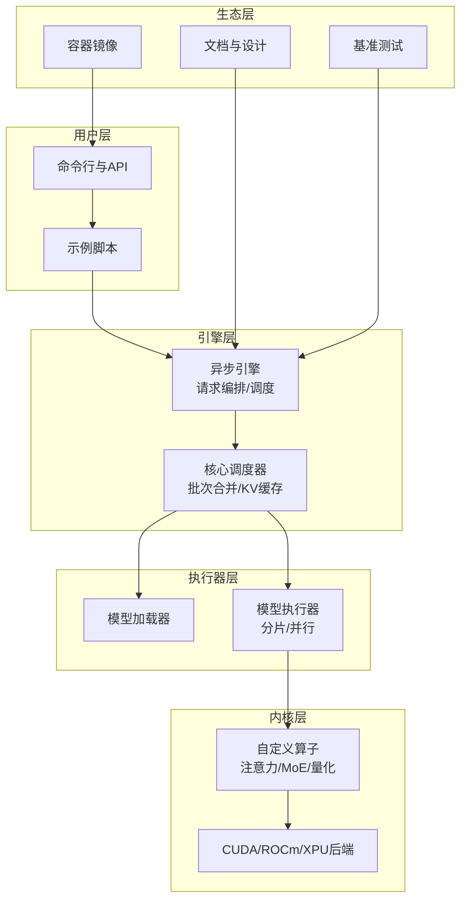
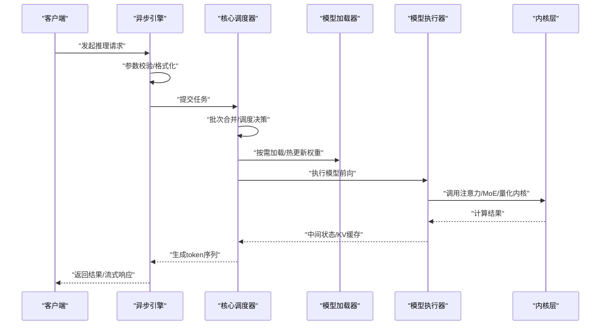
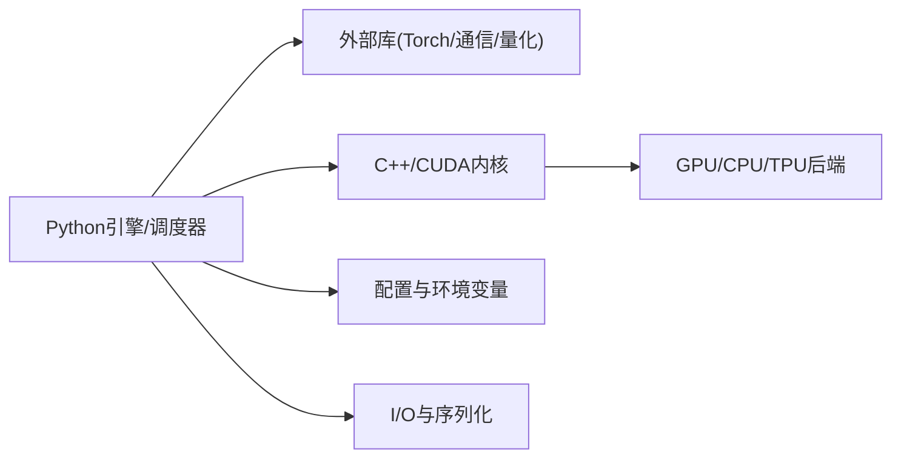

# vLLM简介

<cite>
**本文引用的文件**   
- [README.md](file://README.md)
- [vllm/__init__.py](file://vllm/__init__.py)
- [vllm/engine/async_llm_engine.py](file://vllm/engine/async_llm_engine.py)
- [vllm/engine/core.py](file://vllm/engine/core.py)
- [vllm/model_executor/model_loader.py](file://vllm/model_executor/model_loader.py)
- [vllm/config.py](file://vllm/config.py)
- [benchmarks/benchmark_serving.py](file://benchmarks/benchmark_serving.py)
- [docs/design/arch_overview.md](file://docs/design/arch_overview.md)
- [docs/getting_started/quickstart.md](file://docs/getting_started/quickstart.md)
- [docs/configuration/engine_args.md](file://docs/configuration/engine_args.md)
- [docs/serving/offline_inference.md](file://docs/serving/offline_inference.md)
- [examples/basic/offline_inference/generate.py](file://examples/basic/offline_inference/generate.py)
</cite>

## 目录
1. [引言](#引言)
2. [项目结构](#项目结构)
3. [核心组件](#核心组件)
4. [架构总览](#架构总览)
5. [详细组件分析](#详细组件分析)
6. [依赖关系分析](#依赖关系分析)
7. [性能与优化特性](#性能与优化特性)
8. [故障排查指南](#故障排查指南)
9. [结论](#结论)
10. [附录](#附录)

## 引言
vLLM是一个面向大语言模型（LLM）的高性能推理框架，致力于在真实生产环境中提供高吞吐、低延迟、强扩展性的文本生成服务。它通过创新的内存管理、高效的注意力实现、灵活的并行策略以及完善的工程化能力，解决了传统推理方案在显存碎片、批调度效率、跨硬件适配等方面的瓶颈。

- 什么是大语言模型推理：将训练好的权重加载到计算设备中，对输入提示进行自回归生成，逐token输出结果。
- 为什么需要专用推理框架：通用深度学习框架在批量调度、KV缓存复用、算子融合、图编译等方面并非为LLM推理场景优化；专用框架能显著提升吞吐与延迟表现。
- vLLM的定位：以“引擎+执行器”为核心，提供从离线批处理到在线服务的全栈能力，兼容多种硬件后端与模型形态，成为AI生态中的关键基础设施。

## 项目结构
仓库采用模块化组织，围绕“引擎—执行器—模型—内核—工具链”分层设计：
- vllm：Python核心库，包含配置、引擎、模型执行器、多模态、量化、分布式等模块。
- csrc：C++/CUDA/ROCm内核与绑定，覆盖注意力、MoE、量化、采样等高性能路径。
- benchmarks：系统级与内核级基准测试，涵盖吞吐、延迟、前缀缓存、量化等。
- docs：官方文档与设计说明，包括架构、配置、部署、特性等。
- examples：示例脚本，覆盖离线推理、在线服务、工具调用、流式输出等。
- docker：多平台镜像构建与运行入口。
- tests：单元测试、集成测试与端到端验证。

图表来源
- [docs/design/arch_overview.md](file://docs/design/arch_overview.md)
- [vllm/engine/async_llm_engine.py](file://vllm/engine/async_llm_engine.py)
- [vllm/engine/core.py](file://vllm/engine/core.py)
- [vllm/model_executor/model_loader.py](file://vllm/model_executor/model_loader.py)

章节来源
- [README.md](file://README.md)
- [docs/design/arch_overview.md](file://docs/design/arch_overview.md)

## 核心组件
- 异步引擎（AsyncLLMEngine）：对外暴露统一的推理接口，负责请求接入、参数校验、任务分发与结果聚合。
- 核心调度器（Core Scheduler）：实现批次合并、动态批调度、KV缓存管理与复用、前缀缓存等关键优化。
- 模型加载器（ModelLoader）：支持HuggingFace权重、分片权重、LoRA、量化权重等多种加载方式。
- 模型执行器（ModelExecutor）：封装张量并行、流水线并行、专家并行等分布式策略，驱动底层内核执行。
- 配置系统（Config）：集中管理推理参数（如批大小、最大上下文长度、注意力后端、量化选项等）。

章节来源
- [vllm/engine/async_llm_engine.py](file://vllm/engine/async_llm_engine.py)
- [vllm/engine/core.py](file://vllm/engine/core.py)
- [vllm/model_executor/model_loader.py](file://vllm/model_executor/model_loader.py)
- [vllm/config.py](file://vllm/config.py)

## 架构总览
vLLM的推理流程大致分为：请求接入→参数解析→批次合并→注意力与MoE计算→采样与解码→结果返回。其设计强调“可插拔”的后端与“可组合”的优化策略。

图表来源
- [vllm/engine/async_llm_engine.py](file://vllm/engine/async_llm_engine.py)
- [vllm/engine/core.py](file://vllm/engine/core.py)
- [vllm/model_executor/model_loader.py](file://vllm/model_executor/model_loader.py)

## 详细组件分析

### 异步引擎（AsyncLLMEngine）
- 职责：统一API入口、请求生命周期管理、并发控制、错误处理与指标上报。
- 关键点：支持流式输出、结构化输出、工具调用、推理模式切换（离线/在线）。
- 典型用法：通过Python SDK或REST API发起请求，内部自动完成批处理与调度。

章节来源
- [vllm/engine/async_llm_engine.py](file://vllm/engine/async_llm_engine.py)
- [docs/getting_started/quickstart.md](file://docs/getting_started/quickstart.md)

### 核心调度器（Core Scheduler）
- 职责：动态批调度、KV缓存分配与回收、前缀缓存命中、优先级队列。
- 关键点：批次不变性、内存水位线、自适应批大小、长上下文优化。
- 性能影响：直接决定吞吐与延迟，是vLLM高效的核心所在。

章节来源
- [vllm/engine/core.py](file://vllm/engine/core.py)
- [docs/design/arch_overview.md](file://docs/design/arch_overview.md)

### 模型加载器（ModelLoader）
- 职责：权重读取、分片对齐、LoRA注入、量化格式转换、缓存加速。
- 关键点：支持HF Hub、本地路径、共享存储；增量加载与热更新。
- 扩展点：插件化加载器，便于对接新权重格式与存储后端。

章节来源
- [vllm/model_executor/model_loader.py](file://vllm/model_executor/model_loader.py)

### 配置系统（Config）
- 职责：集中管理推理参数，包括批大小、最大上下文、注意力后端、量化、并行策略等。
- 关键点：环境变量覆盖、配置文件、运行时参数校验与默认值推导。
- 使用建议：根据硬件与模型规模调优，避免显存溢出与性能抖动。

章节来源
- [vllm/config.py](file://vllm/config.py)
- [docs/configuration/engine_args.md](file://docs/configuration/engine_args.md)

### 离线推理与示例
- 离线推理：适合批量数据处理、评测、离线生成任务。
- 示例脚本：提供最小可用代码路径，快速验证模型与配置。

章节来源
- [docs/serving/offline_inference.md](file://docs/serving/offline_inference.md)
- [examples/basic/offline_inference/generate.py](file://examples/basic/offline_inference/generate.py)

## 依赖关系分析
vLLM的依赖层次清晰，上层仅依赖抽象接口，具体实现由内核与后端提供：
- Python层：引擎、调度器、加载器、配置等。
- C++/CUDA层：注意力、MoE、量化、采样等高性能内核。
- 硬件后端：CUDA、ROCm、XPU等。
- 外部依赖：Torch、通信库、量化库、图编译器等。

图表来源
- [vllm/engine/async_llm_engine.py](file://vllm/engine/async_llm_engine.py)
- [vllm/config.py](file://vllm/config.py)

章节来源
- [vllm/engine/async_llm_engine.py](file://vllm/engine/async_llm_engine.py)
- [vllm/config.py](file://vllm/config.py)

## 性能与优化特性
- 内存效率：分页注意力（PagedAttention）、KV缓存复用、前缀缓存、量化（FP8/INT4等），显著降低显存占用与碎片。
- 吞吐量优化：动态批调度、批次合并、算子融合、CUDA Graph、异步执行。
- 低延迟响应：流式输出、结构化输出、投机解码、工具调用优化。
- 可扩展性：张量并行、流水线并行、专家并行、多节点部署、弹性扩缩容。
- 观测与基准：内置指标、Prometheus/Grafana集成、丰富的基准套件。

章节来源
- [benchmarks/benchmark_serving.py](file://benchmarks/benchmark_serving.py)
- [docs/design/arch_overview.md](file://docs/design/arch_overview.md)

## 故障排查指南
- 常见问题定位：检查配置参数（批大小、上下文长度、注意力后端）、查看日志与指标、确认硬件资源与驱动版本。
- 性能问题：使用基准脚本复现问题，分析KV缓存命中率、批次利用率、内核耗时。
- 稳定性问题：关注内存水位线、OOM告警、通信超时、权重加载失败等。
- 调试技巧：启用详细日志、使用离线推理隔离问题、逐步缩小问题范围。

章节来源
- [docs/getting_started/quickstart.md](file://docs/getting_started/quickstart.md)
- [docs/configuration/engine_args.md](file://docs/configuration/engine_args.md)

## 结论
vLLM通过“引擎+执行器+内核”的分层设计与一系列针对LLM推理的优化技术，提供了高吞吐、低延迟、强扩展的推理能力。它在AI生态中扮演着关键基础设施的角色，既适合离线批处理，也胜任在线服务场景。对于初学者，建议从快速开始与示例入手，逐步理解配置与优化要点；对于高级用户，可深入内核与调度机制，定制与扩展以满足特定需求。

## 附录
- 快速开始：参考入门文档与示例脚本，搭建最小可用环境。
- 配置参考：查阅引擎参数与环境变量，结合硬件与模型规模调优。
- 部署指南：了解Docker、Kubernetes、多节点部署与监控方案。
- 社区与支持：参与讨论、贡献代码、获取帮助与最佳实践。

章节来源
- [docs/getting_started/quickstart.md](file://docs/getting_started/quickstart.md)
- [docs/configuration/engine_args.md](file://docs/configuration/engine_args.md)
- [README.md](file://README.md)