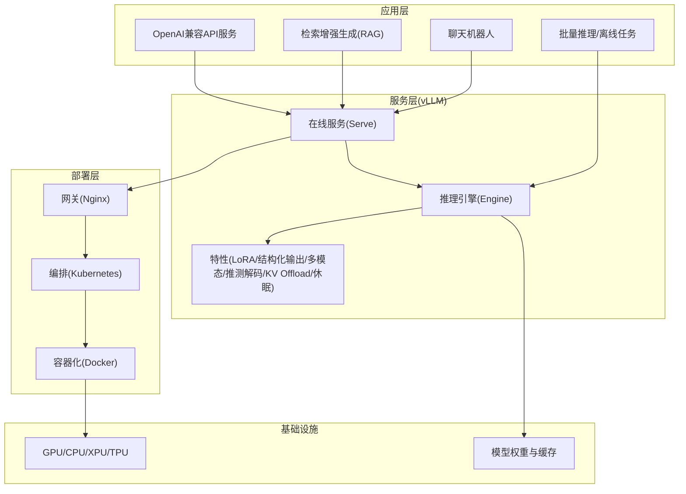
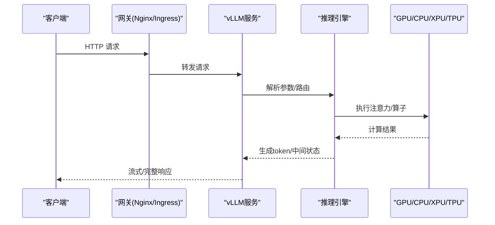
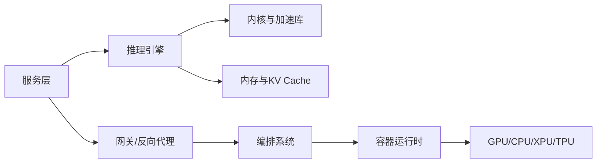

# 应用场景

<cite>
**本文引用的文件**   
- [README.md](file://README.md)
- [quickstart.md](file://docs/getting_started/quickstart.md)
- [serve_args.md](file://docs/configuration/serve_args.md)
- [engine_args.md](file://docs/configuration/engine_args.md)
- [optimization.md](file://docs/configuration/optimization.md)
- [conserving_memory.md](file://docs/configuration/conserving_memory.md)
- [env_vars.md](file://docs/configuration/env_vars.md)
- [offline_inference.md](file://docs/serving/offline_inference.md)
- [online_serving.md](file://docs/serving/online_serving/README.md)
- [data_parallel_deployment.md](file://docs/serving/data_parallel_deployment.md)
- [context_parallel_deployment.md](file://docs/serving/context_parallel_deployment.md)
- [expert_parallel_deployment.md](file://docs/serving/expert_parallel_deployment.md)
- [parallelism_scaling.md](file://docs/serving/parallelism_scaling.md)
- [k8s.md](file://docs/deployment/k8s.md)
- [docker.md](file://docs/deployment/docker.md)
- [nginx.md](file://docs/deployment/nginx.md)
- [metrics.md](file://docs/usage/metrics.md)
- [troubleshooting.md](file://docs/usage/troubleshooting.md)
- [benchmark_serving.py](file://benchmarks/benchmark_serving.py)
- [benchmark_throughput.py](file://benchmarks/benchmark_throughput.py)
- [benchmark_latency.py](file://benchmarks/benchmark_latency.py)
- [chatbot_example.py](file://examples/applications/chatbot/chatbot_example.py)
- [rag_example.py](file://examples/applications/rag/rag_example.py)
- [api_server_example.py](file://examples/applications/api_server/api_server_example.py)
- [batched_chat_completions_online.py](file://examples/generate/batched_chat_completions_online.py)
- [qwen_1m_offline.py](file://examples/generate/qwen_1m_offline.py)
- [openai_chat_completion_with_reasoning.py](file://examples/reasoning/openai_chat_completion_with_reasoning.py)
- [tool_calls_with_reasoning.py](file://examples/reasoning/openai_chat_completion_tool_calls_with_reasoning.py)
- [structured_outputs_usage.md](file://docs/features/structured_outputs.md)
- [lora_usage.md](file://docs/features/lora.md)
- [multimodal_inputs.md](file://docs/features/multimodal_inputs.md)
- [speculative_decoding_overview.md](file://docs/features/speculative_decoding/overview.md)
- [kv_offloading_usage.md](file://docs/features/kv_offloading_usage.md)
- [sleep_mode.md](file://docs/features/sleep_mode.md)
- [architecture_overview.md](file://docs/design/arch_overview.md)
</cite>

## 目录
1. [引言](#引言)
2. [项目结构](#项目结构)
3. [核心组件](#核心组件)
4. [架构总览](#架构总览)
5. [详细组件分析](#详细组件分析)
6. [依赖分析](#依赖分析)
7. [性能考虑](#性能考虑)
8. [故障排查指南](#故障排查指南)
9. [结论](#结论)
10. [附录](#附录)

## 引言
本用例文档面向希望在多种业务场景中落地 vLLM 的团队与个人，覆盖在线推理服务、批量数据处理、边缘计算部署与企业级应用四大类场景。文档基于仓库中的官方文档、示例与基准脚本，系统阐述各场景的特点、需求与挑战，并给出可操作的实施路径、配置优化策略、性能指标与成本效益分析方法，以及从现有系统迁移到 vLLM 的指南。

## 项目结构
vLLM 仓库包含核心引擎、服务端接口、部署与编排、特性与插件、示例与基准、文档等模块。针对“应用场景”主题，重点关注：
- 快速开始与服务端参数：用于搭建在线服务与理解关键配置项
- 离线推理与批处理：用于批量数据处理与离线任务
- 并行与扩展：数据并行、上下文并行、专家并行与扩缩容
- 部署：Docker、Kubernetes、Nginx 反向代理
- 特性：LoRA、结构化输出、多模态、推测解码、KV Offload、休眠模式
- 示例：聊天机器人、RAG、API Server、批量对话、长文本离线生成、推理增强与工具调用
- 基准与指标：吞吐、延迟、资源利用率与可观测性

图表来源
- [architecture_overview.md](file://docs/design/arch_overview.md)
- [serve_args.md](file://docs/configuration/serve_args.md)
- [engine_args.md](file://docs/configuration/engine_args.md)

章节来源
- [README.md](file://README.md)
- [quickstart.md](file://docs/getting_started/quickstart.md)
- [architecture_overview.md](file://docs/design/arch_overview.md)

## 核心组件
- 推理引擎（Engine）：负责模型加载、调度、KV Cache 管理、采样与生成，支持离线与在线两种模式
- 在线服务（Serve）：提供 OpenAI 兼容接口、流式响应、请求路由与负载均衡
- 特性集：LoRA 动态切换、结构化输出、多模态输入、推测解码、KV Offload、休眠模式等
- 部署与编排：Docker 镜像、Kubernetes Helm Chart、Nginx 反向代理与灰度发布
- 可观测性与基准：Prometheus/Grafana 指标、OpenTelemetry、内置基准脚本

章节来源
- [engine_args.md](file://docs/configuration/engine_args.md)
- [serve_args.md](file://docs/configuration/serve_args.md)
- [metrics.md](file://docs/usage/metrics.md)

## 架构总览
vLLM 的典型部署由“客户端—网关—服务—引擎—硬件”构成。在线请求经 Nginx 或云原生网关进入 vLLM 服务，服务将请求分发至引擎；引擎完成预填充与解码阶段，结合 KV Cache 与特性模块输出结果。离线任务直接通过引擎批处理，适合大规模数据处理。

图表来源
- [serve_args.md](file://docs/configuration/serve_args.md)
- [engine_args.md](file://docs/configuration/engine_args.md)
- [k8s.md](file://docs/deployment/k8s.md)
- [nginx.md](file://docs/deployment/nginx.md)

## 详细组件分析

### 在线推理服务（低延迟、高并发）
- 特点与需求
  - 低首字延迟（TTFT）、稳定尾延迟（P95/P99）
  - 高并发与弹性伸缩
  - 流式输出与超时控制
- 挑战
  - 峰值流量突发导致排队与抖动
  - 不同模型/LoRA 切换带来的内存压力
  - 长上下文导致的 KV Cache 膨胀
- vLLM 解决方案
  - PagedAttention、KV Cache 分页与自动前缀缓存
  - 推测解码、CUDA Graph、内核融合
  - 流式响应、请求优先级与队列管理
  - 水平扩展（Ray/分布式）与自动扩缩容
- 实施案例
  - 客服机器人：使用 OpenAI 兼容接口与流式输出，结合工具调用与推理增强
  - 电商推荐系统：短上下文高频问答，启用前缀缓存与 LoRA 动态切换
- 配置优化要点
  - 延迟敏感型：降低批大小、开启推测解码、限制最大上下文长度、启用 CUDA Graph
  - 吞吐量优先型：增大批大小、启用连续批处理、调整 KV Cache 块大小
  - 资源受限型：量化、LoRA、KV Offload、休眠模式

章节来源
- [quickstart.md](file://docs/getting_started/quickstart.md)
- [serve_args.md](file://docs/configuration/serve_args.md)
- [engine_args.md](file://docs/configuration/engine_args.md)
- [lora_usage.md](file://docs/features/lora.md)
- [speculative_decoding_overview.md](file://docs/features/speculative_decoding/overview.md)
- [kv_offloading_usage.md](file://docs/features/kv_offloading_usage.md)
- [sleep_mode.md](file://docs/features/sleep_mode.md)
- [chatbot_example.py](file://examples/applications/chatbot/chatbot_example.py)
- [batched_chat_completions_online.py](file://examples/generate/batched_chat_completions_online.py)

### 批量数据处理（高吞吐、离线）
- 特点与需求
  - 大批量、长文本、离线任务
  - 最大化吞吐、最小化单位成本
  - 可中断与重试机制
- 挑战
  - OOM 风险、显存碎片化
  - I/O 瓶颈（权重读取、数据集加载）
- vLLM 解决方案
  - 离线推理模式、批不变性、高效分块与内存管理
  - 结构化输出与批量生成
- 实施案例
  - 内容生成平台：批量长文档摘要、翻译、格式化输出
- 配置优化要点
  - 吞吐优先型：大 batch size、禁用不必要的日志、关闭流式、启用内存池与预取
  - 资源受限型：量化、CPU Offload、KV Offload、休眠模式

章节来源
- [offline_inference.md](file://docs/serving/offline_inference.md)
- [engine_args.md](file://docs/configuration/engine_args.md)
- [conserving_memory.md](file://docs/configuration/conserving_memory.md)
- [qwen_1m_offline.py](file://examples/generate/qwen_1m_offline.py)
- [structured_outputs_usage.md](file://docs/features/structured_outputs.md)

### 边缘计算部署（资源受限、实时性）
- 特点与需求
  - 设备算力有限（CPU/NPU/XPU/小显存GPU）
  - 低延迟与低功耗要求
  - 模型轻量化与增量更新
- 挑战
  - 内存不足、带宽受限、网络不稳定
- vLLM 解决方案
  - CPU/XPU/TPU 后端支持、量化与 LoRA、KV Offload、休眠模式
  - 轻量镜像与容器化部署
- 实施案例
  - 智能终端助手：本地语音转文本+轻量模型对话，离线可用
- 配置优化要点
  - 资源受限型：INT8/FP8 量化、LoRA 微调、减少上下文长度、关闭不必要特性

章节来源
- [engine_args.md](file://docs/configuration/engine_args.md)
- [conserving_memory.md](file://docs/configuration/conserving_memory.md)
- [lora_usage.md](file://docs/features/lora.md)
- [kv_offloading_usage.md](file://docs/features/kv_offloading_usage.md)
- [sleep_mode.md](file://docs/features/sleep_mode.md)
- [docker.md](file://docs/deployment/docker.md)

### 企业级应用（高可用、安全合规、可观测）
- 特点与需求
  - 多租户隔离、权限控制、审计与合规
  - 高可用与灾备、灰度发布与回滚
  - 全链路可观测与告警
- 挑战
  - 复杂网络拓扑、跨机房复制、模型版本管理
- vLLM 解决方案
  - Kubernetes 编排、Helm Chart、Nginx 反向代理
  - Prometheus/Grafana 指标、OpenTelemetry 追踪
  - 数据并行/上下文并行/专家并行与扩缩容
- 实施案例
  - 企业内部知识库问答：多模型、多 LoRA、RBAC 与审计
- 配置优化要点
  - 稳定性优先：副本数、健康检查、优雅退出、限流与熔断
  - 可扩展性：水平扩展、弹性伸缩、缓存共享

章节来源
- [k8s.md](file://docs/deployment/k8s.md)
- [nginx.md](file://docs/deployment/nginx.md)
- [metrics.md](file://docs/usage/metrics.md)
- [data_parallel_deployment.md](file://docs/serving/data_parallel_deployment.md)
- [context_parallel_deployment.md](file://docs/serving/context_parallel_deployment.md)
- [expert_parallel_deployment.md](file://docs/serving/expert_parallel_deployment.md)
- [parallelism_scaling.md](file://docs/serving/parallelism_scaling.md)

### 典型业务场景与实施案例

#### 电商推荐系统
- 场景描述：用户画像+商品知识图谱，实时生成个性化推荐文案与解释
- 需求：低延迟、高并发、多模型/LoRA 切换、结构化输出
- 方案：在线服务 + LoRA + 结构化输出 + 前缀缓存
- 参考实现：[chatbot_example.py](file://examples/applications/chatbot/chatbot_example.py)、[structured_outputs_usage.md](file://docs/features/structured_outputs.md)

章节来源
- [serve_args.md](file://docs/configuration/serve_args.md)
- [lora_usage.md](file://docs/features/lora.md)
- [structured_outputs_usage.md](file://docs/features/structured_outputs.md)
- [chatbot_example.py](file://examples/applications/chatbot/chatbot_example.py)

#### 客服机器人
- 场景描述：多轮对话、工具调用、推理增强、流式输出
- 需求：稳定 TTFT、长上下文、错误恢复
- 方案：在线服务 + 工具调用 + 推理增强 + 流式
- 参考实现：[openai_chat_completion_with_reasoning.py](file://examples/reasoning/openai_chat_completion_with_reasoning.py)、[tool_calls_with_reasoning.py](file://examples/reasoning/openai_chat_completion_tool_calls_with_reasoning.py)

章节来源
- [serve_args.md](file://docs/configuration/serve_args.md)
- [openai_chat_completion_with_reasoning.py](file://examples/reasoning/openai_chat_completion_with_reasoning.py)
- [tool_calls_with_reasoning.py](file://examples/reasoning/openai_chat_completion_tool_calls_with_reasoning.py)

#### 内容生成平台
- 场景描述：批量长文档摘要、翻译、格式化输出
- 需求：高吞吐、稳定性、可监控
- 方案：离线推理 + 批处理 + 结构化输出 + 指标采集
- 参考实现：[qwen_1m_offline.py](file://examples/generate/qwen_1m_offline.py)、[metrics.md](file://docs/usage/metrics.md)

章节来源
- [offline_inference.md](file://docs/serving/offline_inference.md)
- [qwen_1m_offline.py](file://examples/generate/qwen_1m_offline.py)
- [metrics.md](file://docs/usage/metrics.md)

#### 多模态与语音交互
- 场景描述：图文/音视频输入，端到端生成
- 需求：多模态输入、编解码效率、延迟控制
- 方案：多模态输入 + 在线服务 + 推测解码
- 参考实现：[multimodal_inputs.md](file://docs/features/multimodal_inputs.md)

章节来源
- [multimodal_inputs.md](file://docs/features/multimodal_inputs.md)
- [serve_args.md](file://docs/configuration/serve_args.md)

### 配置优化策略

- 延迟敏感型（TTFT 优先）
  - 减小批大小、开启推测解码、限制最大上下文长度、启用 CUDA Graph
  - 参考：[engine_args.md](file://docs/configuration/engine_args.md)、[serve_args.md](file://docs/configuration/serve_args.md)
- 吞吐量优先型（TPS 优先）
  - 增大批大小、启用连续批处理、调整 KV Cache 块大小、关闭流式
  - 参考：[engine_args.md](file://docs/configuration/engine_args.md)
- 资源受限型（内存/功耗优先）
  - 量化（INT8/FP8）、LoRA、KV Offload、休眠模式、CPU Offload
  - 参考：[conserving_memory.md](file://docs/configuration/conserving_memory.md)、[lora_usage.md](file://docs/features/lora.md)、[kv_offloading_usage.md](file://docs/features/kv_offloading_usage.md)、[sleep_mode.md](file://docs/features/sleep_mode.md)

章节来源
- [engine_args.md](file://docs/configuration/engine_args.md)
- [serve_args.md](file://docs/configuration/serve_args.md)
- [conserving_memory.md](file://docs/configuration/conserving_memory.md)
- [lora_usage.md](file://docs/features/lora.md)
- [kv_offloading_usage.md](file://docs/features/kv_offloading_usage.md)
- [sleep_mode.md](file://docs/features/sleep_mode.md)

### 性能指标与成本效益分析
- 关键指标
  - 首字延迟（TTFT）、平均/尾延迟（P95/P99）、吞吐（tokens/s）、显存占用、GPU 利用率
- 评估方法
  - 使用内置基准脚本进行压测与对比
  - 结合 Prometheus/Grafana 与 OpenTelemetry 进行线上监控
- 成本效益
  - 通过量化与 LoRA 降低显存与算力需求
  - 通过 KV Offload 与休眠模式降低闲置成本
  - 通过水平扩展与弹性伸缩匹配峰谷流量

章节来源
- [metrics.md](file://docs/usage/metrics.md)
- [benchmark_serving.py](file://benchmarks/benchmark_serving.py)
- [benchmark_throughput.py](file://benchmarks/benchmark_throughput.py)
- [benchmark_latency.py](file://benchmarks/benchmark_latency.py)

### 迁移指南（从现有系统到 vLLM）
- 步骤概览
  - 评估现状：模型格式、接口协议、部署方式、性能基线
  - 选择目标：在线/离线、单机/分布式、硬件平台
  - 准备环境：安装与镜像、依赖与驱动、密钥与存储
  - 适配接口：OpenAI 兼容接口、流式输出、错误码
  - 配置优化：根据场景选择延迟/吞吐/资源受限策略
  - 压测验证：基准脚本与线上灰度
  - 上线运维：监控告警、扩缩容、回滚策略
- 注意事项
  - 权重格式与加载路径、上下文长度与 KV Cache 配置
  - 多模型/LoRA 管理与版本控制
  - 网络与网关配置（超时、重试、限流）

章节来源
- [quickstart.md](file://docs/getting_started/quickstart.md)
- [serve_args.md](file://docs/configuration/serve_args.md)
- [engine_args.md](file://docs/configuration/engine_args.md)
- [k8s.md](file://docs/deployment/k8s.md)
- [docker.md](file://docs/deployment/docker.md)
- [nginx.md](file://docs/deployment/nginx.md)

## 依赖分析
- 组件耦合
  - 服务层依赖引擎与特性模块；引擎依赖硬件后端与内存管理
  - 部署层依赖容器与编排系统；网关依赖反向代理与负载均衡
- 外部依赖
  - 推理加速库（如 Flash Attention、Triton、Cutlass）
  - 可观测性（Prometheus、Grafana、OpenTelemetry）
  - 模型生态（HuggingFace、LoRA 权重）

图表来源
- [architecture_overview.md](file://docs/design/arch_overview.md)
- [serve_args.md](file://docs/configuration/serve_args.md)
- [engine_args.md](file://docs/configuration/engine_args.md)

章节来源
- [architecture_overview.md](file://docs/design/arch_overview.md)

## 性能考虑
- 延迟优化
  - 推测解码、CUDA Graph、减少序列化开销、限制上下文长度
- 吞吐优化
  - 连续批处理、增大批大小、优化 KV Cache 块大小、关闭不必要特性
- 资源优化
  - 量化、LoRA、KV Offload、休眠模式、CPU Offload
- 可观测性
  - 指标采集、分布式追踪、性能剖析与热点定位

章节来源
- [engine_args.md](file://docs/configuration/engine_args.md)
- [serve_args.md](file://docs/configuration/serve_args.md)
- [conserving_memory.md](file://docs/configuration/conserving_memory.md)
- [metrics.md](file://docs/usage/metrics.md)

## 故障排查指南
- 常见问题
  - OOM 与显存碎片：检查上下文长度、批大小、KV Cache 配置
  - 高延迟与抖动：检查队列长度、网络超时、网关配置
  - 模型加载失败：检查权重路径、格式与权限
  - 多模态输入异常：检查输入格式与预处理
- 诊断工具
  - 指标与日志、OpenTelemetry 追踪、基准脚本复现
- 解决建议
  - 逐步缩小问题范围，单点验证；启用更详细的日志与指标
  - 使用灰度与回滚策略，避免影响线上

章节来源
- [troubleshooting.md](file://docs/usage/troubleshooting.md)
- [metrics.md](file://docs/usage/metrics.md)
- [serve_args.md](file://docs/configuration/serve_args.md)
- [engine_args.md](file://docs/configuration/engine_args.md)

## 结论
vLLM 为在线推理、批量处理、边缘部署与企业级应用提供了统一且高效的底层能力。通过合理的配置优化与部署策略，可在不同场景下取得优异的延迟、吞吐与成本表现。建议以“指标驱动”的方式持续迭代，结合可观测性与自动化运维，确保系统的稳定性与可扩展性。

## 附录
- 快速开始与基础用法
- 在线服务与离线推理的参数说明
- 并行与扩展策略
- 部署与运维最佳实践
- 特性使用指南（LoRA、结构化输出、多模态、推测解码、KV Offload、休眠模式）