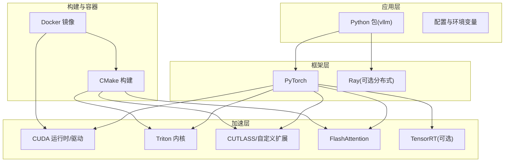
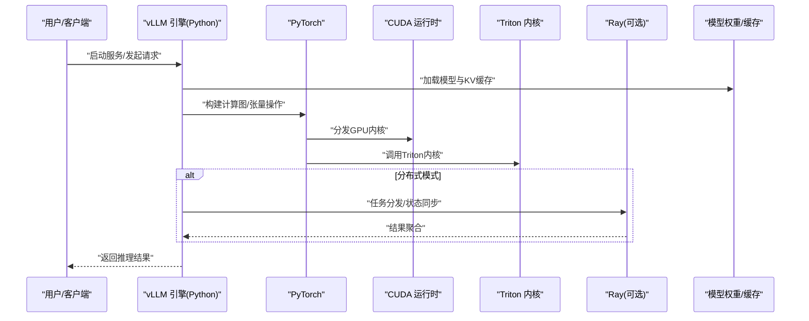
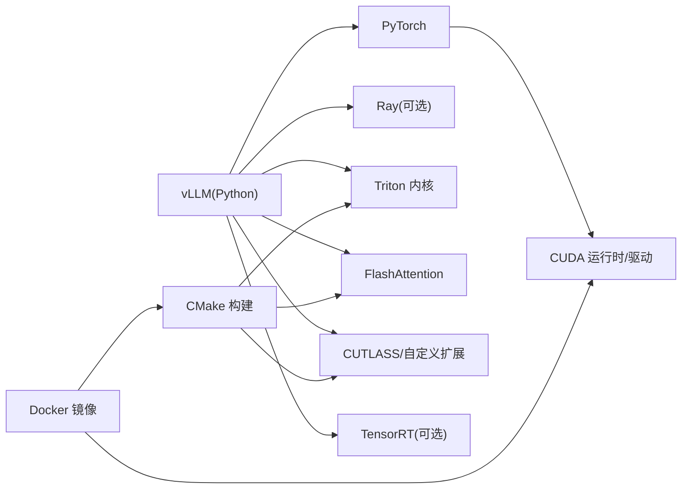

# 技术栈

<cite>
**本文引用的文件**   
- [pyproject.toml](file://pyproject.toml)
- [setup.py](file://setup.py)
- [CMakeLists.txt](file://CMakeLists.txt)
- [requirements/cuda.txt](file://requirements/cuda.txt)
- [requirements/rocm.txt](file://requirements/rocm.txt)
- [requirements/cpu.txt](file://requirements/cpu.txt)
- [requirements/common.txt](file://requirements/common.txt)
- [docker/Dockerfile](file://docker/Dockerfile)
- [docker/Dockerfile.rocm](file://docker/Dockerfile.rocm)
- [docker/Dockerfile.cpu](file://docker/Dockerfile.cpu)
- [docker/versions.json](file://docker/versions.json)
- [vllm/envs.py](file://vllm/envs.py)
- [vllm/version.py](file://vllm/version.py)
- [cmake/utils.cmake](file://cmake/utils.cmake)
- [cmake/external_projects/triton_kernels.cmake](file://cmake/external_projects/triton_kernels.cmake)
- [cmake/external_projects/vllm_flash_attn.cmake](file://cmake/external_projects/vllm_flash_attn.cmake)
- [cmake/external_projects/deepgemm.cmake](file://cmake/external_projects/deepgemm.cmake)
- [tools/generate_versions_json.py](file://tools/generate_versions_json.py)
- [tools/install_nixl_from_source_ubuntu.py](file://tools/install_nixl_from_source_ubuntu.py)
- [tools/build_rust.py](file://tools/build_rust.py)
- [scripts/benchmark_helion_kernels.py](file://scripts/benchmark_helion_kernels.py)
- [benchmarks/README.md](file://benchmarks/README.md)
- [docs/getting_started/installation/README.md](file://docs/getting_started/installation/README.md)
- [docs/configuration/env_vars.md](file://docs/configuration/env_vars.md)
- [docs/serving/distributed_troubleshooting.md](file://docs/serving/distributed_troubleshooting.md)
- [tests/test_version.py](file://tests/test_version.py)
</cite>

## 目录
1. [简介](#简介)
2. [项目结构](#项目结构)
3. [核心组件](#核心组件)
4. [架构总览](#架构总览)
5. [详细组件分析](#详细组件分析)
6. [依赖关系分析](#依赖关系分析)
7. [性能考量](#性能考量)
8. [故障排除指南](#故障排除指南)
9. [结论](#结论)
10. [附录](#附录)

## 简介
本文件面向希望深入理解 vLLM 技术栈的工程师与研究者，系统梳理 Python、PyTorch、CUDA/GPU、Triton 内核、分布式计算（Ray）、构建系统（CMake）以及第三方优化库（如 FlashAttention、TensorRT 等）在 vLLM 中的角色、版本要求与兼容性策略。文档同时提供环境搭建指引、依赖管理与版本控制策略说明，并给出常见问题的排查方法。

## 项目结构
vLLM 采用“Python 主工程 + C/C++/CUDA/Triton 内核 + CMake 构建 + Docker 镜像”的多层结构：
- Python 层：定义依赖、入口、配置与环境变量；通过 PyTorch 调用底层算子。
- 内核层：CUDA/Triton/Rust 实现高性能算子与通信原语。
- 构建层：CMake 管理外部依赖与编译流程，工具脚本辅助生成与安装。
- 容器层：Docker 镜像统一运行环境与依赖版本。

图表来源
- [CMakeLists.txt:1-200](file://CMakeLists.txt#L1-L200)
- [cmake/utils.cmake:1-200](file://cmake/utils.cmake#L1-L200)
- [docker/Dockerfile:1-200](file://docker/Dockerfile#L1-L200)

章节来源
- [CMakeLists.txt:1-200](file://CMakeLists.txt#L1-L200)
- [docker/Dockerfile:1-200](file://docker/Dockerfile#L1-L200)

## 核心组件
- Python 与包管理
  - 使用 pyproject.toml 与 setup.py 声明依赖与构建选项，支持多后端条件安装。
  - requirements 目录按平台拆分依赖（cuda/rocm/cpu），便于精准安装。
- PyTorch 与 CUDA
  - 以 PyTorch 为深度学习运行时，结合 CUDA 驱动与 cuBLAS/cuDNN 等库进行 GPU 加速。
  - 通过 torch.utils.cpp_extension 或自定义绑定加载 C++/CUDA 算子。
- Triton 内核
  - 使用 Triton 编写高性能注意力、归一化、量化等内核，提升吞吐与降低延迟。
- 分布式与调度
  - 可选 Ray 作为分布式执行与资源编排后端，支撑多卡/多节点推理。
- 构建系统与外部依赖
  - CMake 统一管理 Triton 内核、FlashAttention、DeepGEMM 等外部项目的编译与集成。
  - 工具脚本负责版本生成、Rust 组件构建与特定依赖安装。
- 容器化
  - 提供多种 Dockerfile（CUDA/ROCm/CPU/TPU/XPU），确保可复现的运行环境。

章节来源
- [pyproject.toml:1-200](file://pyproject.toml#L1-L200)
- [setup.py:1-200](file://setup.py#L1-L200)
- [requirements/cuda.txt:1-200](file://requirements/cuda.txt#L1-L200)
- [requirements/rocm.txt:1-200](file://requirements/rocm.txt#L1-L200)
- [requirements/cpu.txt:1-200](file://requirements/cpu.txt#L1-L200)
- [requirements/common.txt:1-200](file://requirements/common.txt#L1-L200)
- [cmake/utils.cmake:1-200](file://cmake/utils.cmake#L1-L200)
- [tools/build_rust.py:1-200](file://tools/build_rust.py#L1-L200)
- [docker/Dockerfile:1-200](file://docker/Dockerfile#L1-L200)

## 架构总览
下图展示 vLLM 在典型部署中的组件交互：Python 引擎通过 PyTorch 调用 CUDA/Triton 内核，必要时借助 Ray 进行分布式编排，并通过 CMake 构建产物与 Docker 镜像保证一致性。

图表来源
- [vllm/envs.py:1-200](file://vllm/envs.py#L1-L200)
- [docker/Dockerfile:1-200](file://docker/Dockerfile#L1-L200)
- [cmake/external_projects/triton_kernels.cmake:1-200](file://cmake/external_projects/triton_kernels.cmake#L1-L200)

## 详细组件分析

### Python 与依赖管理
- 依赖声明
  - pyproject.toml 集中声明核心依赖与可选特性（如 cuda/rocm/cpu）。
  - setup.py 用于构建时逻辑与条件安装。
  - requirements/*.txt 按平台细化依赖版本，便于 CI 与本地环境隔离。
- 版本与兼容性
  - docker/versions.json 记录关键依赖版本，配合 generate_versions_json.py 生成一致性清单。
  - tests/test_version.py 校验版本信息一致性。
- 最佳实践
  - 优先使用 Docker 镜像或虚拟环境隔离依赖。
  - 根据硬件选择对应 requirements（cuda/rocm/cpu）。

章节来源
- [pyproject.toml:1-200](file://pyproject.toml#L1-L200)
- [setup.py:1-200](file://setup.py#L1-L200)
- [requirements/cuda.txt:1-200](file://requirements/cuda.txt#L1-L200)
- [requirements/rocm.txt:1-200](file://requirements/rocm.txt#L1-L200)
- [requirements/cpu.txt:1-200](file://requirements/cpu.txt#L1-L200)
- [requirements/common.txt:1-200](file://requirements/common.txt#L1-L200)
- [docker/versions.json:1-200](file://docker/versions.json#L1-L200)
- [tools/generate_versions_json.py:1-200](file://tools/generate_versions_json.py#L1-L200)
- [tests/test_version.py:1-200](file://tests/test_version.py#L1-L200)

### PyTorch 与 CUDA 运行时
- 角色与职责
  - PyTorch 提供张量抽象、自动微分与设备调度；CUDA 驱动与运行时提供底层加速能力。
- 兼容性与约束
  - 需匹配 CUDA 驱动与 cuBLAS/cuDNN 版本；不同 PyTorch 轮子包含不同 CUDA 版本。
  - 可通过 collect_env 类脚本诊断环境。
- 常见问题
  - 驱动与 CUDA 不匹配导致无法初始化 GPU。
  - 缺少必要共享库（如 libcudart.so）引发动态链接失败。

章节来源
- [docker/Dockerfile:1-200](file://docker/Dockerfile#L1-L200)
- [requirements/cuda.txt:1-200](file://requirements/cuda.txt#L1-L200)

### Triton 内核编程
- 选型原因
  - Triton 提供高层 GPU 内核 DSL，简化并行与内存访问优化，适合注意力、归一化、量化等热点路径。
- 集成方式
  - CMake 中通过 triton_kernels.cmake 拉取与编译 Triton 相关内核。
  - Python 侧通过 torch 绑定调用 Triton 编译后的模块。
- 性能影响
  - 合理划分线程块与内存布局可显著提升吞吐；需关注寄存器占用与访存合并。

章节来源
- [cmake/external_projects/triton_kernels.cmake:1-200](file://cmake/external_projects/triton_kernels.cmake#L1-L200)
- [scripts/benchmark_helion_kernels.py:1-200](file://scripts/benchmark_helion_kernels.py#L1-L200)

### 分布式计算（Ray）
- 选型原因
  - Ray 提供弹性任务调度、跨进程通信与资源管理，适合多卡/多节点推理场景。
- 使用方式
  - 通过环境变量与引擎参数启用 Ray 后端；支持弹性扩缩容与故障恢复。
- 注意事项
  - 网络拓扑与 NCCL 设置对性能影响显著；需检查防火墙与端口占用。

章节来源
- [vllm/envs.py:1-200](file://vllm/envs.py#L1-L200)
- [docs/serving/distributed_troubleshooting.md:1-200](file://docs/serving/distributed_troubleshooting.md#L1-L200)

### 构建系统（CMake）与外部依赖
- CMake 组织
  - CMakeLists.txt 定义顶层构建目标；cmake/utils.cmake 提供通用函数。
  - cmake/external_projects 管理 Triton、FlashAttention、DeepGEMM 等外部项目。
- 依赖管理
  - 通过 CMake FetchContent 或预置脚本下载与编译依赖，确保可重复构建。
- 版本控制策略
  - 固定依赖版本于 CMake 或脚本中，配合 versions.json 与 CI 验证。

章节来源
- [CMakeLists.txt:1-200](file://CMakeLists.txt#L1-L200)
- [cmake/utils.cmake:1-200](file://cmake/utils.cmake#L1-L200)
- [cmake/external_projects/vllm_flash_attn.cmake:1-200](file://cmake/external_projects/vllm_flash_attn.cmake#L1-L200)
- [cmake/external_projects/deepgemm.cmake:1-200](file://cmake/external_projects/deepgemm.cmake#L1-L200)

### 第三方优化库集成（FlashAttention、TensorRT 等）
- FlashAttention
  - 通过 vllm_flash_attn.cmake 集成，提供高效注意力实现，减少显存占用与提升吞吐。
- TensorRT
  - 可选集成，针对 NVIDIA 平台进行图级优化与量化部署。
- DeepGEMM
  - 通过 deepgemm.cmake 集成，提供高性能 GEMM 变体。
- 集成要点
  - 确保编译器、CUDA 版本与库路径一致；在构建阶段启用相应开关。

章节来源
- [cmake/external_projects/vllm_flash_attn.cmake:1-200](file://cmake/external_projects/vllm_flash_attn.cmake#L1-L200)
- [cmake/external_projects/deepgemm.cmake:1-200](file://cmake/external_projects/deepgemm.cmake#L1-L200)
- [benchmarks/README.md:1-200](file://benchmarks/README.md#L1-L200)

### Rust 组件与工具链
- 用途
  - Rust 实现高性能 CLI、gRPC 客户端与服务端、解析器等。
- 构建
  - tools/build_rust.py 协调 Cargo 构建与依赖；rust-toolchain.toml 锁定工具链版本。
- 集成
  - Python 通过子进程或绑定调用 Rust 二进制/库。

章节来源
- [tools/build_rust.py:1-200](file://tools/build_rust.py#L1-L200)
- [rust-toolchain.toml:1-200](file://rust-toolchain.toml#L1-L200)

### 容器化与版本一致性
- Docker 镜像
  - docker/Dockerfile 系列提供 CUDA/ROCm/CPU/TPU/XPU 等多平台镜像。
  - docker/versions.json 记录关键依赖版本，确保可复现性。
- 构建与发布
  - 通过 CI/CD 生成镜像与 wheel，附带版本元数据。

章节来源
- [docker/Dockerfile:1-200](file://docker/Dockerfile#L1-L200)
- [docker/Dockerfile.rocm:1-200](file://docker/Dockerfile.rocm#L1-L200)
- [docker/Dockerfile.cpu:1-200](file://docker/Dockerfile.cpu#L1-L200)
- [docker/versions.json:1-200](file://docker/versions.json#L1-L200)

## 依赖关系分析
下图展示 vLLM 主要依赖之间的耦合关系与边界：

图表来源
- [pyproject.toml:1-200](file://pyproject.toml#L1-L200)
- [CMakeLists.txt:1-200](file://CMakeLists.txt#L1-L200)
- [docker/Dockerfile:1-200](file://docker/Dockerfile#L1-L200)

章节来源
- [pyproject.toml:1-200](file://pyproject.toml#L1-L200)
- [CMakeLists.txt:1-200](file://CMakeLists.txt#L1-L200)
- [docker/Dockerfile:1-200](file://docker/Dockerfile#L1-L200)

## 性能考量
- 内核选择
  - 优先启用 Triton/FlashAttention 等高性能内核；根据模型形状与硬件特性调优。
- 内存与带宽
  - 合理使用 KV 缓存、分页机制与量化格式（FP8/INT4）以降低显存占用。
- 并行与通信
  - 调整张量并行/流水线并行/专家并行策略；优化 NCCL 与网络拓扑。
- 编译与图优化
  - 利用 TorchCompile 与 TensorRT 图级优化减少内核启动开销。

[本节为通用指导，不直接分析具体文件]

## 故障排除指南
- 依赖冲突与环境问题
  - 使用 requirements 文件与 Docker 镜像隔离环境；避免系统 Python 污染。
  - 检查 CUDA 驱动与运行时版本是否匹配；确认缺失的动态库路径。
- 分布式通信问题
  - 检查防火墙、端口占用与 NCCL 日志；确保节点间可达。
- 构建失败
  - 核对 CMake 版本与编译器；清理构建缓存后重试；查看外部依赖下载日志。
- 版本不一致
  - 使用 generate_versions_json.py 与 tests/test_version.py 校验版本一致性。

章节来源
- [docs/getting_started/installation/README.md:1-200](file://docs/getting_started/installation/README.md#L1-L200)
- [docs/configuration/env_vars.md:1-200](file://docs/configuration/env_vars.md#L1-L200)
- [docs/serving/distributed_troubleshooting.md:1-200](file://docs/serving/distributed_troubleshooting.md#L1-L200)
- [tools/install_nixl_from_source_ubuntu.py:1-200](file://tools/install_nixl_from_source_ubuntu.py#L1-L200)
- [tests/test_version.py:1-200](file://tests/test_version.py#L1-L200)

## 结论
vLLM 的技术栈以 Python 与 PyTorch 为核心，结合 CUDA/Triton 内核与 CMake 构建系统，形成高性能、可扩展的推理框架。通过 Docker 与严格的版本管理，确保在不同平台与硬件上的一致性与可复现性。合理选择与集成 FlashAttention、TensorRT 等优化库，可进一步提升吞吐与降低延迟。建议在生产环境中优先使用官方镜像与依赖清单，并结合基准测试持续调优。

[本节为总结性内容，不直接分析具体文件]

## 附录
- 环境搭建建议
  - 使用 Docker 镜像快速拉起环境；或在裸机安装匹配的 CUDA/ROCm 驱动与 PyTorch 轮子。
  - 根据硬件选择 requirements（cuda/rocm/cpu），并遵循版本矩阵。
- 版本与兼容性
  - 参考 docker/versions.json 与 CI 配置中的版本矩阵；保持驱动、CUDA、PyTorch 与 vLLM 版本对齐。
- 常用命令与脚本
  - 构建 Rust 组件：tools/build_rust.py
  - 生成版本清单：tools/generate_versions_json.py
  - 基准测试：benchmarks/README.md 与 scripts/benchmark_helion_kernels.py

[本节为补充信息，不直接分析具体文件]