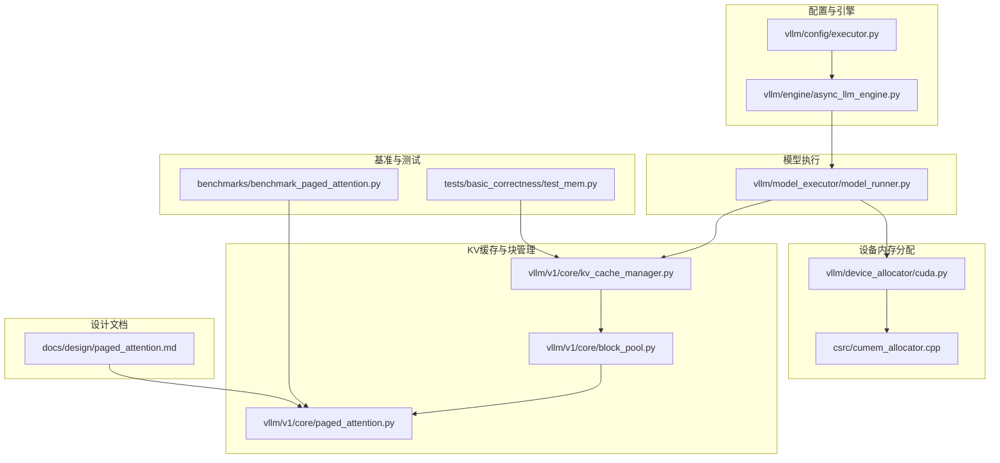
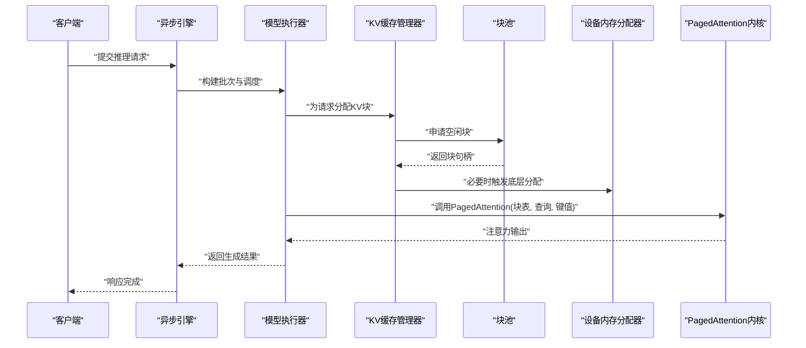
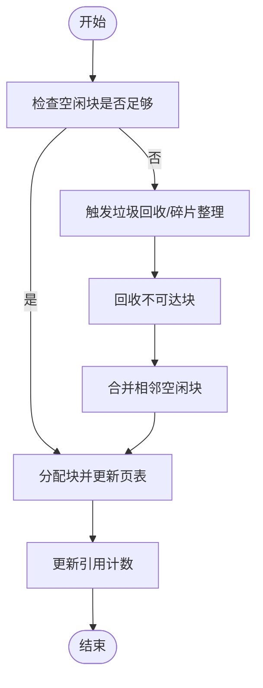
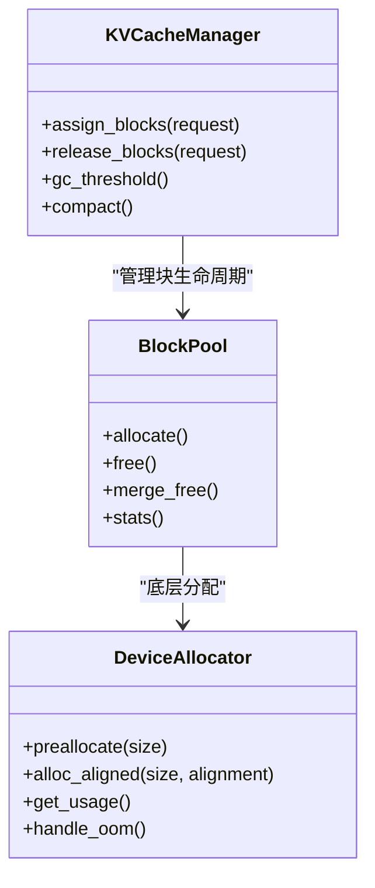
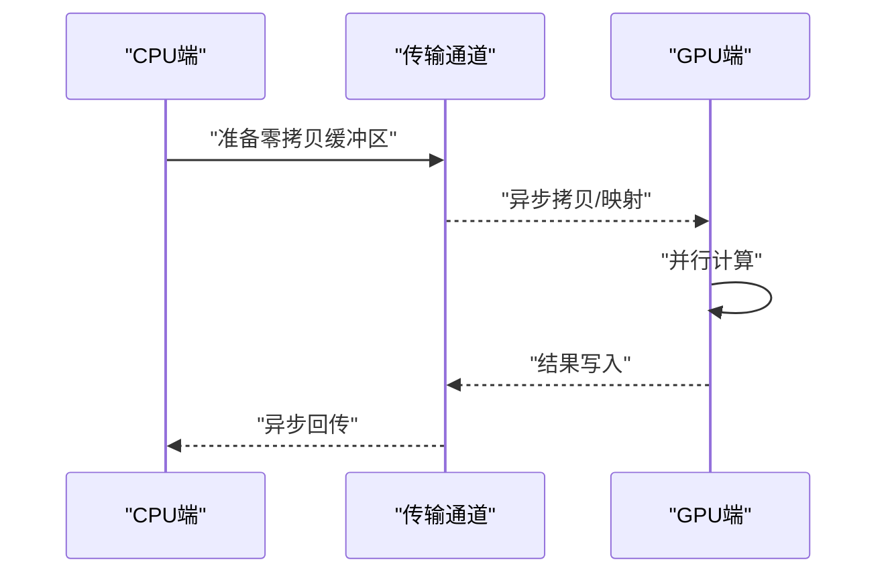
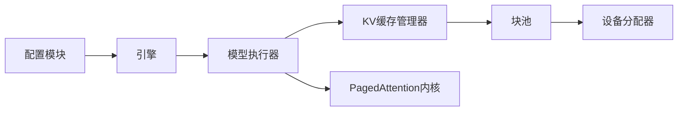

# 内存管理

<cite>
**本文引用的文件**   
- [vllm/config/executor.py](file://vllm/config/executor.py)
- [vllm/engine/async_llm_engine.py](file://vllm/engine/async_llm_engine.py)
- [vllm/model_executor/model_runner.py](file://vllm/model_executor/model_runner.py)
- [vllm/v1/core/kv_cache_manager.py](file://vllm/v1/core/kv_cache_manager.py)
- [vllm/v1/core/block_pool.py](file://vllm/v1/core/block_pool.py)
- [vllm/v1/core/paged_attention.py](file://vllm/v1/core/paged_attention.py)
- [vllm/device_allocator/cuda.py](file://vllm/device_allocator/cuda.py)
- [csrc/cumem_allocator.cpp](file://csrc/cumem_allocator.cpp)
- [benchmarks/benchmark_paged_attention.py](file://benchmarks/benchmark_paged_attention.py)
- [tests/basic_correctness/test_mem.py](file://tests/basic_correctness/test_mem.py)
- [docs/design/paged_attention.md](file://docs/design/paged_attention.md)
</cite>

## 目录
1. [简介](#简介)
2. [项目结构](#项目结构)
3. [核心组件](#核心组件)
4. [架构总览](#架构总览)
5. [详细组件分析](#详细组件分析)
6. [依赖关系分析](#依赖关系分析)
7. [性能考量](#性能考量)
8. [故障排查指南](#故障排查指南)
9. [结论](#结论)
10. [附录](#附录)

## 简介
本文件面向vLLM的内存管理系统，围绕PagedAttention技术与GPU显存层次化管理展开，系统阐述块分配、碎片整理与垃圾回收机制；解释CPU-GPU数据传输优化（零拷贝与异步传输）；说明多进程共享内存管理机制；并提供内存监控与调试工具使用指南、内存使用模式图表与分析方法，以及内存泄漏检测与性能调优最佳实践。文档力求在保持技术深度的同时，让非专业读者也能理解关键概念与实现思路。

## 项目结构
vLLM的内存管理涉及Python层配置与调度、模型执行器、KV缓存与块池、底层CUDA内存分配器，以及设计与基准测试文档。下图给出与内存管理相关的关键目录与文件映射：

图示来源 
- [vllm/config/executor.py](file://vllm/config/executor.py)
- [vllm/engine/async_llm_engine.py](file://vllm/engine/async_llm_engine.py)
- [vllm/model_executor/model_runner.py](file://vllm/model_executor/model_runner.py)
- [vllm/v1/core/kv_cache_manager.py](file://vllm/v1/core/kv_cache_manager.py)
- [vllm/v1/core/block_pool.py](file://vllm/v1/core/block_pool.py)
- [vllm/v1/core/paged_attention.py](file://vllm/v1/core/paged_attention.py)
- [vllm/device_allocator/cuda.py](file://vllm/device_allocator/cuda.py)
- [csrc/cumem_allocator.cpp](file://csrc/cumem_allocator.cpp)
- [benchmarks/benchmark_paged_attention.py](file://benchmarks/benchmark_paged_attention.py)
- [tests/basic_correctness/test_mem.py](file://tests/basic_correctness/test_mem.py)
- [docs/design/paged_attention.md](file://docs/design/paged_attention.md)

章节来源
- [vllm/config/executor.py](file://vllm/config/executor.py)
- [vllm/engine/async_llm_engine.py](file://vllm/engine/async_llm_engine.py)
- [vllm/model_executor/model_runner.py](file://vllm/model_executor/model_runner.py)
- [vllm/v1/core/kv_cache_manager.py](file://vllm/v1/core/kv_cache_manager.py)
- [vllm/v1/core/block_pool.py](file://vllm/v1/core/block_pool.py)
- [vllm/v1/core/paged_attention.py](file://vllm/v1/core/paged_attention.py)
- [vllm/device_allocator/cuda.py](file://vllm/device_allocator/cuda.py)
- [csrc/cumem_allocator.cpp](file://csrc/cumem_allocator.cpp)
- [benchmarks/benchmark_paged_attention.py](file://benchmarks/benchmark_paged_attention.py)
- [tests/basic_correctness/test_mem.py](file://tests/basic_correctness/test_mem.py)
- [docs/design/paged_attention.md](file://docs/design/paged_attention.md)

## 核心组件
- PagedAttention内核与调度：将KV缓存切分为固定大小的块，通过页表索引访问，避免连续大内存分配带来的碎片化问题。
- KV缓存管理器：负责请求生命周期内的KV块分配、引用计数、换入换出策略与阈值控制。
- 块池：维护空闲块链表、分配与回收接口，支持批量合并与延迟释放。
- 设备内存分配器：封装CUDA/C++底层分配器，提供预分配、对齐、统计与错误处理。
- 模型执行器：协调注意力计算、KV读写与批调度，驱动PagedAttention调用。
- 引擎与配置：根据硬件与负载选择后端、设置块大小、阈值与并发度等参数。

章节来源
- [vllm/v1/core/paged_attention.py](file://vllm/v1/core/paged_attention.py)
- [vllm/v1/core/kv_cache_manager.py](file://vllm/v1/core/kv_cache_manager.py)
- [vllm/v1/core/block_pool.py](file://vllm/v1/core/block_pool.py)
- [vllm/device_allocator/cuda.py](file://vllm/device_allocator/cuda.py)
- [csrc/cumem_allocator.cpp](file://csrc/cumem_allocator.cpp)
- [vllm/model_executor/model_runner.py](file://vllm/model_executor/model_runner.py)
- [vllm/config/executor.py](file://vllm/config/executor.py)

## 架构总览
下图展示从引擎到内核的内存管理与数据流路径，包括请求进入、KV块分配、PagedAttention计算与结果返回的关键环节。

图示来源 
- [vllm/engine/async_llm_engine.py](file://vllm/engine/async_llm_engine.py)
- [vllm/model_executor/model_runner.py](file://vllm/model_executor/model_runner.py)
- [vllm/v1/core/kv_cache_manager.py](file://vllm/v1/core/kv_cache_manager.py)
- [vllm/v1/core/block_pool.py](file://vllm/v1/core/block_pool.py)
- [vllm/device_allocator/cuda.py](file://vllm/device_allocator/cuda.py)
- [vllm/v1/core/paged_attention.py](file://vllm/v1/core/paged_attention.py)

## 详细组件分析

### PagedAttention与KV缓存分层
- 分块粒度与布局：按固定块大小组织KV张量，块内连续存储利于访存局部性；跨块通过页表链接。
- 页表与引用：每个请求维护块索引序列，支持复制、共享与写时复制；引用计数确保正确回收。
- 碎片与压缩：空闲块链表维护可用区间，支持合并相邻空闲块；必要时进行重排以减少碎片。
- 阈值与回收：基于水位线触发垃圾回收或换出策略，保证高利用率与低抖动。

图示来源 
- [vllm/v1/core/kv_cache_manager.py](file://vllm/v1/core/kv_cache_manager.py)
- [vllm/v1/core/block_pool.py](file://vllm/v1/core/block_pool.py)

章节来源
- [vllm/v1/core/paged_attention.py](file://vllm/v1/core/paged_attention.py)
- [vllm/v1/core/kv_cache_manager.py](file://vllm/v1/core/kv_cache_manager.py)
- [vllm/v1/core/block_pool.py](file://vllm/v1/core/block_pool.py)
- [docs/design/paged_attention.md](file://docs/design/paged_attention.md)

### GPU显存层次化管理
- 预分配与池化：启动阶段按需预分配大块，减少频繁分配开销；池化提升复用率。
- 对齐与边界：按设备要求对齐块大小，避免跨页访问惩罚。
- 统计与监控：记录已用/空闲/峰值/碎片率，辅助容量规划与阈值调优。
- 错误恢复：捕获OOM并回退策略（如降低批大小、提前回收）。

图示来源 
- [vllm/v1/core/block_pool.py](file://vllm/v1/core/block_pool.py)
- [vllm/v1/core/kv_cache_manager.py](file://vllm/v1/core/kv_cache_manager.py)
- [vllm/device_allocator/cuda.py](file://vllm/device_allocator/cuda.py)
- [csrc/cumem_allocator.cpp](file://csrc/cumem_allocator.cpp)

章节来源
- [vllm/device_allocator/cuda.py](file://vllm/device_allocator/cuda.py)
- [csrc/cumem_allocator.cpp](file://csrc/cumem_allocator.cpp)
- [vllm/v1/core/block_pool.py](file://vllm/v1/core/block_pool.py)
- [vllm/v1/core/kv_cache_manager.py](file://vllm/v1/core/kv_cache_manager.py)

### CPU-GPU内存数据传输优化
- 零拷贝：利用统一虚拟地址或可分页内存映射，避免显式拷贝；适用于某些场景下的输入/输出。
- 异步传输：通过CUDA流或异步API，将数据传输与计算重叠，提高吞吐。
- 批量化与合并：聚合小消息，减少同步点与上下文切换开销。
- 内存绑定：对热点数据使用 pinned memory，加速PCIe传输。

章节来源
- [vllm/device_allocator/cuda.py](file://vllm/device_allocator/cuda.py)
- [csrc/cumem_allocator.cpp](file://csrc/cumem_allocator.cpp)

### 多进程共享内存管理
- 共享对象：通过共享内存或进程间通信机制，使多个工作进程共享权重或KV缓存。
- 同步原语：使用锁或原子操作保证一致性，避免竞态条件。
- 生命周期：集中管理共享对象的创建、销毁与清理，防止泄漏。

章节来源
- [vllm/engine/async_llm_engine.py](file://vllm/engine/async_llm_engine.py)
- [vllm/config/executor.py](file://vllm/config/executor.py)

### 内存监控与调试工具
- 指标采集：暴露显存使用、峰值、碎片率、分配次数等指标。
- 日志与追踪：记录分配/回收事件，便于定位热点与异常。
- 基准测试：针对PagedAttention与块池的性能基准，帮助评估不同配置。

章节来源
- [benchmarks/benchmark_paged_attention.py](file://benchmarks/benchmark_paged_attention.py)
- [tests/basic_correctness/test_mem.py](file://tests/basic_correctness/test_mem.py)

## 依赖关系分析
- 引擎依赖执行器，执行器依赖KV缓存管理器与块池，块池依赖设备分配器。
- PagedAttention内核由执行器调用，读取KV块表与键值数据。
- 配置模块决定后端、块大小、阈值与并发度，影响整体内存行为。

图示来源 
- [vllm/config/executor.py](file://vllm/config/executor.py)
- [vllm/engine/async_llm_engine.py](file://vllm/engine/async_llm_engine.py)
- [vllm/model_executor/model_runner.py](file://vllm/model_executor/model_runner.py)
- [vllm/v1/core/kv_cache_manager.py](file://vllm/v1/core/kv_cache_manager.py)
- [vllm/v1/core/block_pool.py](file://vllm/v1/core/block_pool.py)
- [vllm/device_allocator/cuda.py](file://vllm/device_allocator/cuda.py)
- [vllm/v1/core/paged_attention.py](file://vllm/v1/core/paged_attention.py)

章节来源
- [vllm/config/executor.py](file://vllm/config/executor.py)
- [vllm/engine/async_llm_engine.py](file://vllm/engine/async_llm_engine.py)
- [vllm/model_executor/model_runner.py](file://vllm/model_executor/model_runner.py)
- [vllm/v1/core/kv_cache_manager.py](file://vllm/v1/core/kv_cache_manager.py)
- [vllm/v1/core/block_pool.py](file://vllm/v1/core/block_pool.py)
- [vllm/device_allocator/cuda.py](file://vllm/device_allocator/cuda.py)
- [vllm/v1/core/paged_attention.py](file://vllm/v1/core/paged_attention.py)

## 性能考量
- 块大小选择：较大的块减少页表开销但增加碎片风险；较小的块提升灵活性但增加索引成本。需结合模型维度与批大小权衡。
- 阈值调优：合理设置垃圾回收水位线，平衡命中率与回收频率。
- 预分配策略：根据历史负载预测峰值，减少运行时分配抖动。
- 传输优化：启用零拷贝与异步传输，重叠IO与计算。
- 监控与回归：持续跟踪指标，发现退化并及时调整。

[本节为通用指导，不直接分析具体文件]

## 故障排查指南
- OOM与碎片：观察显存使用曲线与碎片率，必要时降低批大小或增大块池；检查是否有未释放的引用。
- 性能下降：对比基准测试结果，确认是否因块大小或阈值不当导致；检查传输是否阻塞。
- 泄漏检测：通过引用计数与回收日志定位未释放对象；使用单元测试覆盖边界情况。
- 调试工具：启用详细日志与指标导出，结合基准脚本复现实验环境。

章节来源
- [tests/basic_correctness/test_mem.py](file://tests/basic_correctness/test_mem.py)
- [benchmarks/benchmark_paged_attention.py](file://benchmarks/benchmark_paged_attention.py)

## 结论
vLLM的内存管理以PagedAttention为核心，通过块级KV缓存、池化与阈值控制，有效缓解显存碎片与OOM问题。配合零拷贝与异步传输，显著提升吞吐与延迟表现。合理的配置与持续的监控调优是保障稳定性的关键。建议在生产环境中建立完善的指标体系与回归测试，持续优化内存使用模式。

[本节为总结性内容，不直接分析具体文件]

## 附录
- 术语表：PagedAttention、KV缓存、块池、零拷贝、异步传输、碎片整理、垃圾回收。
- 参考设计：详见设计文档关于PagedAttention的实现细节与优化策略。

章节来源
- [docs/design/paged_attention.md](file://docs/design/paged_attention.md)