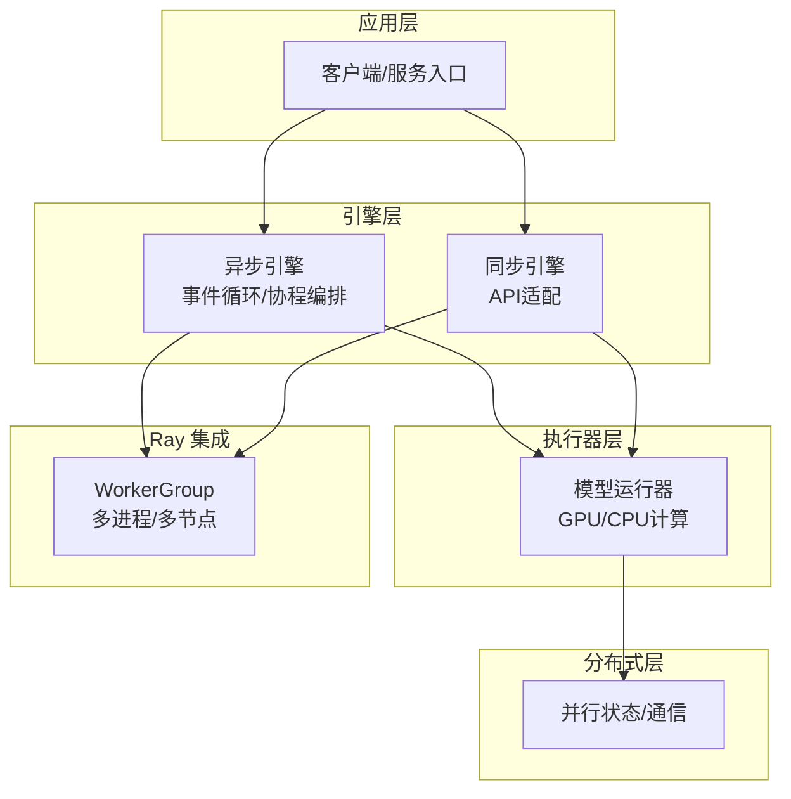
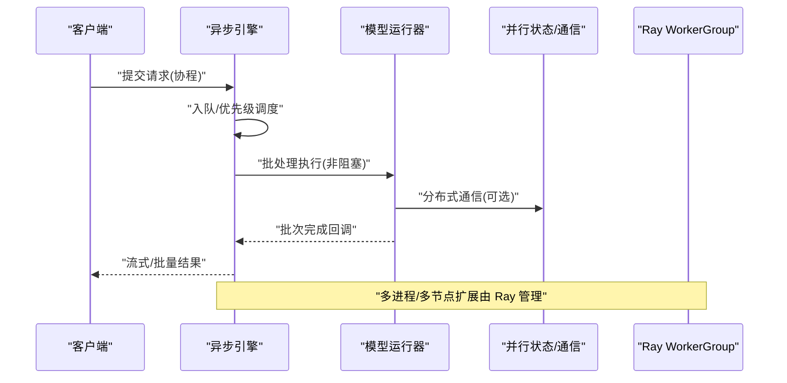
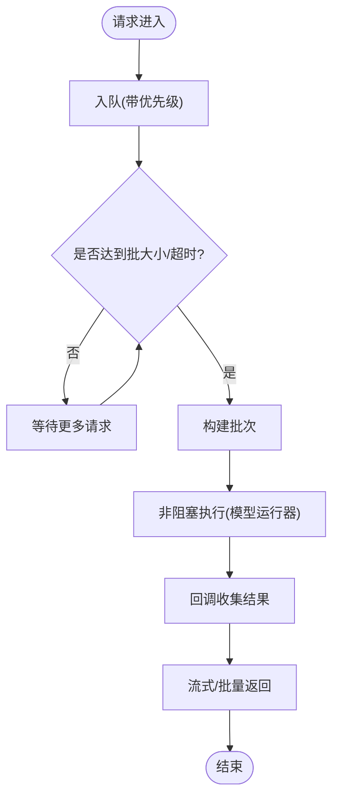
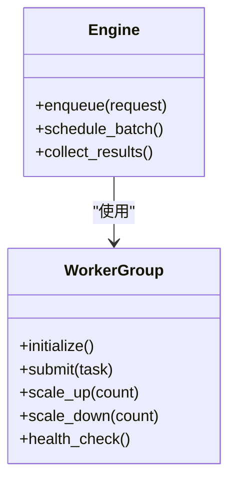
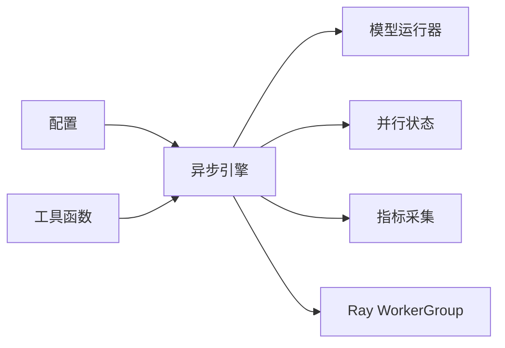

# 并发处理

<cite>
**本文引用的文件**   
- [vllm/engine/async_llm_engine.py](file://vllm/engine/async_llm_engine.py)
- [vllm/engine/llm_engine.py](file://vllm/engine/llm_engine.py)
- [vllm/engine/metrics.py](file://vllm/engine/metrics.py)
- [vllm/model_executor/model_runner.py](file://vllm/model_executor/model_runner.py)
- [vllm/distributed/parallel_state.py](file://vllm/distributed/parallel_state.py)
- [vllm/ray/worker_group.py](file://vllm/ray/worker_group.py)
- [examples/ray_serving/batch_llm_inference.py](file://examples/ray_serving/batch_llm_inference.py)
- [tests/distributed/test_ray_v2_executor.py](file://tests/distributed/test_ray_v2_executor.py)
- [vllm/config.py](file://vllm/config.py)
- [vllm/utils.py](file://vllm/utils.py)
</cite>

## 目录
1. [简介](#简介)
2. [项目结构](#项目结构)
3. [核心组件](#核心组件)
4. [架构总览](#架构总览)
5. [详细组件分析](#详细组件分析)
6. [依赖关系分析](#依赖关系分析)
7. [性能考量与调优](#性能考量与调优)
8. [故障排查指南](#故障排查指南)
9. [结论](#结论)
10. [附录](#附录)

## 简介
本文件聚焦 vLLM 的并发处理架构，系统性阐述异步引擎、协程管理与事件循环、多线程/多进程工作池与任务调度、分布式锁与状态同步、Ray 集成与弹性扩缩容、请求级并发控制与资源隔离，以及性能分析与调试方法。目标是帮助读者从整体到细节全面理解 vLLM 在高吞吐推理场景下的并发模型与工程实践。

## 项目结构
vLLM 的并发相关代码主要分布在以下模块：
- 引擎层：异步引擎封装了事件循环、协程编排与请求队列；同步引擎作为上层接口或兼容层。
- 执行器层：模型运行器负责 GPU/CPU 上的实际计算与内存管理。
- 分布式层：并行状态管理、通信原语与跨进程协调。
- Ray 集成：通过 WorkerGroup 抽象多节点工作进程，支撑弹性扩缩容。
- 配置与工具：并发参数、指标采集与通用工具函数。

图表来源
- [vllm/engine/async_llm_engine.py:1-200](file://vllm/engine/async_llm_engine.py#L1-L200)
- [vllm/engine/llm_engine.py:1-200](file://vllm/engine/llm_engine.py#L1-L200)
- [vllm/model_executor/model_runner.py:1-200](file://vllm/model_executor/model_runner.py#L1-L200)
- [vllm/distributed/parallel_state.py:1-200](file://vllm/distributed/parallel_state.py#L1-L200)
- [vllm/ray/worker_group.py:1-200](file://vllm/ray/worker_group.py#L1-L200)

章节来源
- [vllm/engine/async_llm_engine.py:1-200](file://vllm/engine/async_llm_engine.py#L1-L200)
- [vllm/engine/llm_engine.py:1-200](file://vllm/engine/llm_engine.py#L1-L200)
- [vllm/model_executor/model_runner.py:1-200](file://vllm/model_executor/model_runner.py#L1-L200)
- [vllm/distributed/parallel_state.py:1-200](file://vllm/distributed/parallel_state.py#L1-L200)
- [vllm/ray/worker_group.py:1-200](file://vllm/ray/worker_group.py#L1-L200)

## 核心组件
- 异步引擎：基于事件循环驱动，将请求入队、调度、批处理与结果回写以协程形式组织，避免阻塞 I/O 和 GIL 限制。
- 同步引擎：为上层 API 提供同步调用语义，内部委托给异步引擎并等待结果。
- 模型运行器：封装 CUDA Graph、KV Cache、注意力后端等执行细节，是并发执行的“工作单元”。
- 并行状态：维护分布式上下文（张量并行、流水线并行、专家并行等）与通信组。
- Ray WorkerGroup：封装多进程/多节点的工作者生命周期、任务分发与弹性伸缩。

章节来源
- [vllm/engine/async_llm_engine.py:1-200](file://vllm/engine/async_llm_engine.py#L1-L200)
- [vllm/engine/llm_engine.py:1-200](file://vllm/engine/llm_engine.py#L1-L200)
- [vllm/model_executor/model_runner.py:1-200](file://vllm/model_executor/model_runner.py#L1-L200)
- [vllm/distributed/parallel_state.py:1-200](file://vllm/distributed/parallel_state.py#L1-L200)
- [vllm/ray/worker_group.py:1-200](file://vllm/ray/worker_group.py#L1-L200)

## 架构总览
下图展示了从请求进入到响应返回的关键路径，以及各并发层次如何协作。

图表来源
- [vllm/engine/async_llm_engine.py:1-200](file://vllm/engine/async_llm_engine.py#L1-L200)
- [vllm/model_executor/model_runner.py:1-200](file://vllm/model_executor/model_runner.py#L1-L200)
- [vllm/distributed/parallel_state.py:1-200](file://vllm/distributed/parallel_state.py#L1-L200)
- [vllm/ray/worker_group.py:1-200](file://vllm/ray/worker_group.py#L1-L200)

## 详细组件分析

### 异步引擎：事件循环与协程编排
- 事件循环：统一调度协程，避免线程切换开销，提升高并发下的吞吐。
- 请求队列：按优先级/到达时间排序，支持动态批处理与早停策略。
- 协程编排：将预处理、批调度、执行、后处理解耦为可组合的协程阶段。
- 背压与限流：通过队列容量与令牌桶控制入队速率，防止过载。

图表来源
- [vllm/engine/async_llm_engine.py:1-200](file://vllm/engine/async_llm_engine.py#L1-L200)

章节来源
- [vllm/engine/async_llm_engine.py:1-200](file://vllm/engine/async_llm_engine.py#L1-L200)

### 同步引擎：API 适配与等待机制
- 对外暴露同步接口，内部通过 Future/Event 等待异步引擎完成。
- 错误传播：将底层异常包装为同步异常，便于上层捕获。
- 兼容性：保持与旧版 API 一致，降低迁移成本。

章节来源
- [vllm/engine/llm_engine.py:1-200](file://vllm/engine/llm_engine.py#L1-L200)

### 模型运行器：执行单元与资源管理
- 批调度：合并多个请求为批次，最大化 GPU 利用率。
- 内存管理：分页 KV Cache、CUDA Graph 预热、显存水位监控。
- 后端选择：注意力后端、量化、MoE 路由等按需启用。

章节来源
- [vllm/model_executor/model_runner.py:1-200](file://vllm/model_executor/model_runner.py#L1-L200)

### 分布式并行状态：锁与状态同步
- 并行组：张量并行、流水线并行、专家并行等通信组初始化与管理。
- 锁机制：细粒度锁保护共享状态（如 KV Cache 元数据），避免竞态。
- 状态同步：启动屏障、权重加载一致性检查、拓扑发现。

章节来源
- [vllm/distributed/parallel_state.py:1-200](file://vllm/distributed/parallel_state.py#L1-L200)

### Ray 集成与弹性扩缩容
- WorkerGroup：封装 Ray Actor/Task 的生命周期，支持动态增减工作者。
- 任务分发：按负载/亲和性分配请求，减少跨节点通信。
- 弹性伸缩：根据队列长度/延迟目标自动扩缩容。

图表来源
- [vllm/ray/worker_group.py:1-200](file://vllm/ray/worker_group.py#L1-L200)
- [vllm/engine/async_llm_engine.py:1-200](file://vllm/engine/async_llm_engine.py#L1-L200)

章节来源
- [vllm/ray/worker_group.py:1-200](file://vllm/ray/worker_group.py#L1-L200)
- [examples/ray_serving/batch_llm_inference.py:1-200](file://examples/ray_serving/batch_llm_inference.py#L1-L200)
- [tests/distributed/test_ray_v2_executor.py:1-200](file://tests/distributed/test_ray_v2_executor.py#L1-L200)

### 请求级并发控制与资源隔离
- 配额管理：按租户/用户维度限制并发数与带宽。
- 隔离策略：不同请求类型（预填充/解码）使用独立队列与执行槽。
- 优先级：高优先级请求优先批处理，保障时延 SLA。

章节来源
- [vllm/engine/async_llm_engine.py:1-200](file://vllm/engine/async_llm_engine.py#L1-L200)
- [vllm/config.py:1-200](file://vllm/config.py#L1-200)

### 指标与观测
- 关键指标：队列长度、批大小、GPU 利用率、端到端延迟、吞吐。
- 采样与聚合：低开销计数器与直方图，支持 Prometheus/Grafana。

章节来源
- [vllm/engine/metrics.py:1-200](file://vllm/engine/metrics.py#L1-200)

## 依赖关系分析
- 异步引擎依赖模型运行器进行实际计算，并通过并行状态进行分布式通信。
- Ray WorkerGroup 作为外部扩展点，与引擎解耦，便于替换不同的执行后端。
- 配置模块集中管理并发参数（批大小、队列长度、超时等）。

图表来源
- [vllm/engine/async_llm_engine.py:1-200](file://vllm/engine/async_llm_engine.py#L1-L200)
- [vllm/model_executor/model_runner.py:1-200](file://vllm/model_executor/model_runner.py#L1-200)
- [vllm/distributed/parallel_state.py:1-200](file://vllm/distributed/parallel_state.py#L1-200)
- [vllm/engine/metrics.py:1-200](file://vllm/engine/metrics.py#L1-200)
- [vllm/ray/worker_group.py:1-200](file://vllm/ray/worker_group.py#L1-200)
- [vllm/config.py:1-200](file://vllm/config.py#L1-200)
- [vllm/utils.py:1-200](file://vllm/utils.py#L1-200)

章节来源
- [vllm/engine/async_llm_engine.py:1-200](file://vllm/engine/async_llm_engine.py#L1-200)
- [vllm/model_executor/model_runner.py:1-200](file://vllm/model_executor/model_runner.py#L1-200)
- [vllm/distributed/parallel_state.py:1-200](file://vllm/distributed/parallel_state.py#L1-200)
- [vllm/engine/metrics.py:1-200](file://vllm/engine/metrics.py#L1-200)
- [vllm/ray/worker_group.py:1-200](file://vllm/ray/worker_group.py#L1-200)
- [vllm/config.py:1-200](file://vllm/config.py#L1-200)
- [vllm/utils.py:1-200](file://vllm/utils.py#L1-200)

## 性能考量与调优
- 批大小与队列长度：增大批大小提升吞吐但增加尾延迟，需结合 P99 目标调参。
- CUDA Graph 预热：减少首次执行开销，稳定延迟。
- KV Cache 分页：避免碎片化，提高显存利用率。
- 背压策略：当队列长度超过阈值时拒绝新请求，保护系统稳定性。
- 分布式通信：合理划分并行度，减少 AllReduce 次数与消息大小。
- 资源隔离：为不同租户/任务类型分配独立队列与执行槽，避免相互干扰。

[本节为通用指导，不直接分析具体文件]

## 故障排查指南
- 死锁预防
  - 锁顺序：全局定义锁获取顺序，避免循环等待。
  - 超时与降级：对长时间持有的锁设置超时，触发告警与降级。
  - 无锁设计：尽量使用原子操作与无锁队列替代粗粒度锁。
- 常见并发错误
  - 竞态条件：检查共享状态更新是否加锁，确保读写互斥。
  - 协程泄漏：确保所有协程在异常路径下也能正常退出。
  - 背压失效：监控队列长度与丢弃率，调整限流阈值。
- 调试方法
  - 指标观察：关注队列长度、批大小、GPU 利用率、延迟分位。
  - 日志追踪：为关键路径添加结构化日志，包含请求 ID 与阶段耗时。
  - 压力测试：使用基准脚本模拟高并发，定位瓶颈。

章节来源
- [vllm/engine/async_llm_engine.py:1-200](file://vllm/engine/async_llm_engine.py#L1-200)
- [vllm/engine/metrics.py:1-200](file://vllm/engine/metrics.py#L1-200)
- [vllm/utils.py:1-200](file://vllm/utils.py#L1-200)

## 结论
vLLM 的并发架构以异步引擎为核心，结合事件循环、协程编排与批调度实现高吞吐低延迟推理。通过分布式并行状态与 Ray WorkerGroup，系统具备横向扩展能力。请求级并发控制与资源隔离保障了多租户环境下的稳定性与公平性。合理的性能调优与完善的故障排查手段，使系统在大规模生产环境中可靠运行。

[本节为总结，不直接分析具体文件]

## 附录
- 术语表
  - 异步引擎：基于事件循环的并发调度器。
  - 协程：轻量级并发单元，避免线程切换开销。
  - 批调度：将多个请求合并执行以提升效率。
  - 背压：通过限制入队速率保护系统稳定。
  - 弹性扩缩容：根据负载动态调整工作进程数量。

[本节为概念说明，不直接分析具体文件]