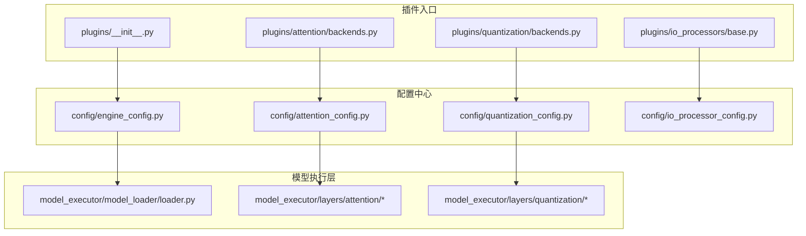
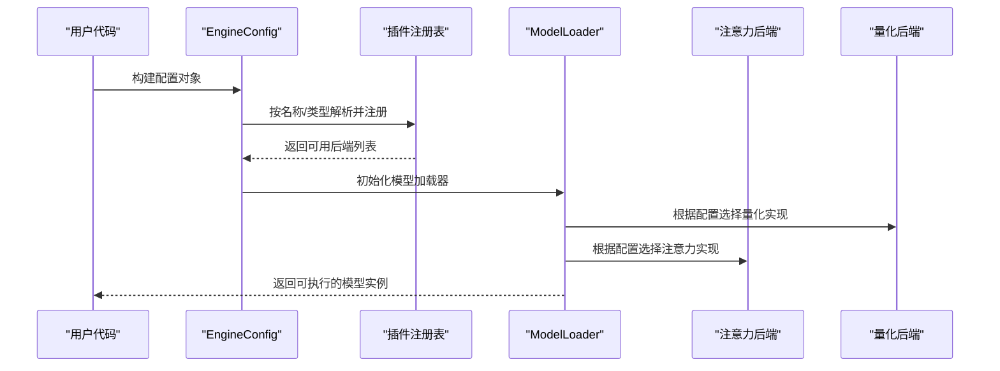
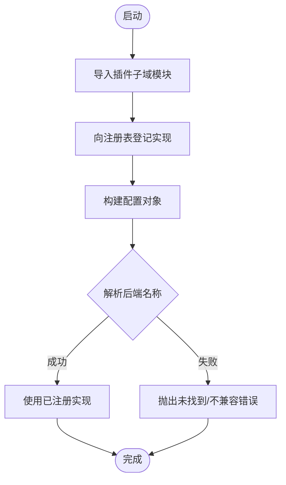
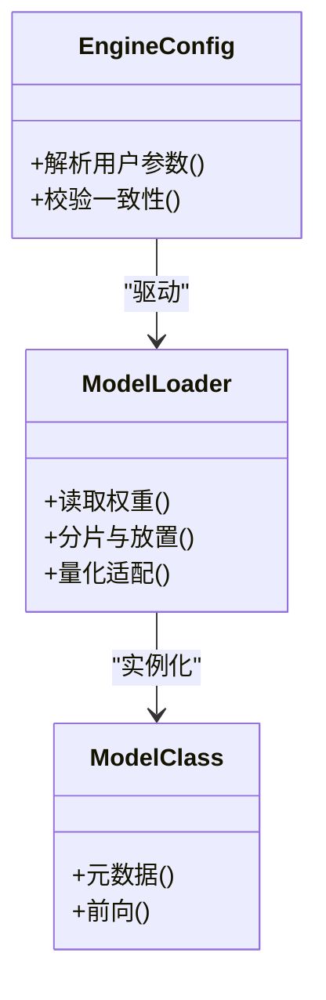
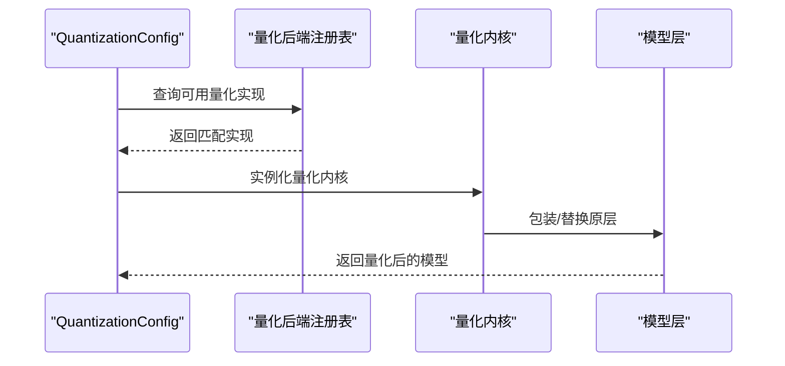
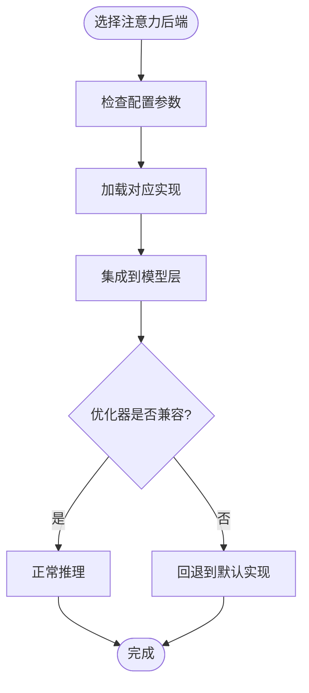
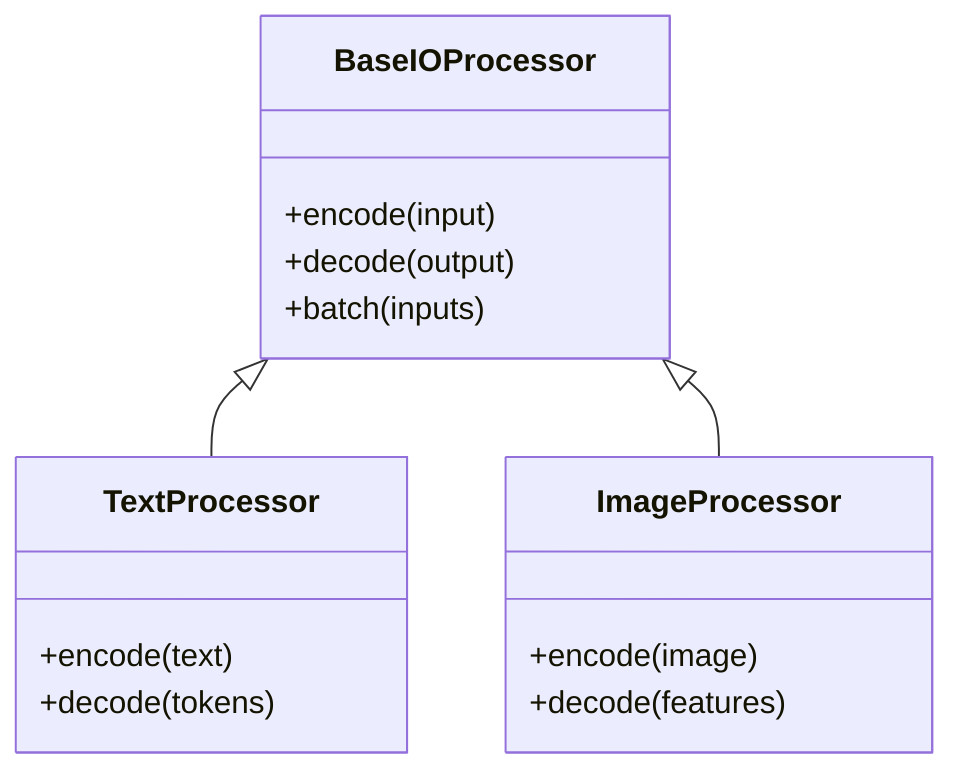
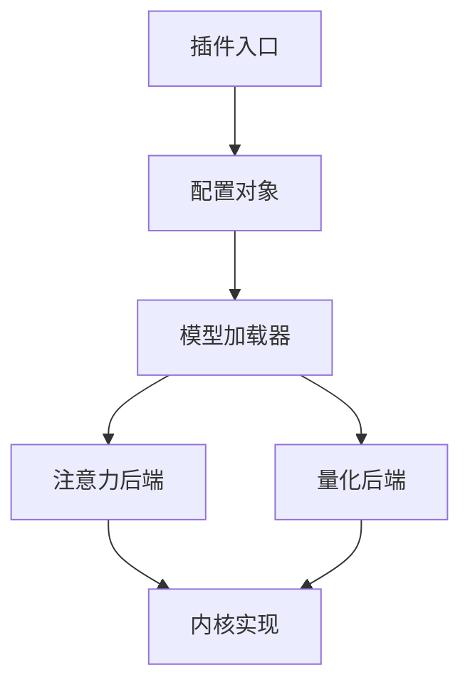

# 扩展机制

<cite>
**本文引用的文件**   
- [vllm/plugins/__init__.py](file://vllm/plugins/__init__.py)
- [vllm/plugins/attention/backends.py](file://vllm/plugins/attention/backends.py)
- [vllm/plugins/quantization/backends.py](file://vllm/plugins/quantization/backends.py)
- [vllm/plugins/io_processors/base.py](file://vllm/plugins/io_processors/base.py)
- [vllm/model_executor/model_loader/loader.py](file://vllm/model_executor/model_loader/loader.py)
- [vllm/config/engine_config.py](file://vllm/config/engine_config.py)
- [vllm/config/quantization_config.py](file://vllm/config/quantization_config.py)
- [vllm/config/attention_config.py](file://vllm/config/attention_config.py)
- [vllm/config/io_processor_config.py](file://vllm/config/io_processor_config.py)
- [vllm/model_executor/layers/quantization/kernels/fake_quant.py](file://vllm/model_executor/layers/quantization/kernels/fake_quant.py)
- [vllm/model_executor/layers/attention/paged_attention.py](file://vllm/model_executor/layers/attention/paged_attention.py)
- [vllm/model_executor/layers/attention/flash_attn.py](file://vllm/model_executor/layers/attention/flash_attn.py)
- [vllm/model_executor/layers/attention/mamba_attn.py](file://vllm/model_executor/layers/attention/mamba_attn.py)
- [vllm/model_executor/layers/attention/custom_attn.py](file://vllm/model_executor/layers/attention/custom_attn.py)
- [vllm/model_executor/layers/quantization/gptq.py](file://vllm/model_executor/layers/quantization/gptq.py)
- [vllm/model_executor/layers/quantization/awq.py](file://vllm/model_executor/layers/quantization/awq.py)
- [vllm/model_executor/layers/quantization/llm_int8.py](file://vllm/model_executor/layers/quantization/llm_int8.py)
- [vllm/model_executor/layers/quantization/nf4.py](file://vllm/model_executor/layers/quantization/nf4.py)
- [vllm/model_executor/layers/quantization/bitsandbytes.py](file://vllm/model_executor/layers/quantization/bitsandbytes.py)
- [vllm/model_executor/layers/quantization/compressed_tensors.py](file://vllm/model_executor/layers/quantization/compressed_tensors.py)
- [vllm/model_executor/layers/quantization/eetq.py](file://vllm/model_executor/layers/quantization/eetq.py)
- [vllm/model_executor/layers/quantization/exint.py](file://vllm/model_executor/layers/quantization/exint.py)
- [vllm/model_executor/layers/quantization/fp8.py](file://vllm/model_executor/layers/quantization/fp8.py)
- [vllm/model_executor/layers/quantization/int8.py](file://vllm/model_executor/layers/quantization/int8.py)
- [vllm/model_executor/layers/quantization/marlin.py](file://vllm/model_executor/layers/quantization/marlin.py)
- [vllm/model_executor/layers/quantization/moe_fused_moe.py](file://vllm/model_executor/layers/quantization/moe_fused_moe.py)
- [vllm/model_executor/layers/quantization/weight_only.py](file://vllm/model_executor/layers/quantization/weight_only.py)
- [vllm/model_executor/layers/quantization/quant_config.py](file://vllm/model_executor/layers/quantization/quant_config.py)
- [vllm/model_executor/layers/quantization/utils.py](file://vllm/model_executor/layers/quantization/utils.py)
- [vllm/model_executor/layers/quantization/activation_checkpointing.py](file://vllm/model_executor/layers/quantization/activation_checkpointing.py)
- [vllm/model_executor/layers/quantization/quantizer.py](file://vllm/model_executor/layers/quantization/quantizer.py)
- [vllm/model_executor/layers/quantization/quantize_gemm.py](file://vllm/model_executor/layers/quantization/quantize_gemm.py)
- [vllm/model_executor/layers/quantization/quantize_linear.py](file://vllm/model_executor/layers/quantization/quantize_linear.py)
- [vllm/model_executor/layers/quantization/quantize_ops.py](file://vllm/model_executor/layers/quantization/quantize_ops.py)
- [vllm/model_executor/layers/quantization/quantize_utils.py](file://vllm/model_executor/layers/quantization/quantize_utils.py)
- [vllm/model_executor/layers/quantization/quantize_wrapper.py](file://vllm/model_executor/layers/quantization/quantize_wrapper.py)
- [vllm/model_executor/layers/quantization/quantize_registry.py](file://vllm/model_executor/layers/quantization/quantize_registry.py)
- [vllm/model_executor/layers/quantization/quantize_kernel.py](file://vllm/model_executor/layers/quantization/quantize_kernel.py)
- [vllm/model_executor/layers/quantization/quantize_backend.py](file://vllm/model_executor/layers/quantization/quantize_backend.py)
- [vllm/model_executor/layers/quantization/quantize_factory.py](file://vllm/model_executor/layers/quantization/quantize_factory.py)
- [vllm/model_executor/layers/quantization/quantize_interface.py](file://vllm/model_executor/layers/quantization/quantize_interface.py)
- [vllm/model_executor/layers/quantization/quantize_module.py](file://vllm/model_executor/layers/quantization/quantize_module.py)
- [vllm/model_executor/layers/quantization/quantize_op.py](file://vllm/model_executor/layers/quantization/quantize_op.py)
- [vllm/model_executor/layers/quantization/quantize_pass.py](file://vllm/model_executor/layers/quantization/quantize_pass.py)
- [vllm/model_executor/layers/quantization/quantize_policy.py](file://vllm/model_executor/layers/quantization/quantize_policy.py)
- [vllm/model_executor/layers/quantization/quantize_scheduler.py](file://vllm/model_executor/layers/quantization/quantize_scheduler.py)
- [vllm/model_executor/layers/quantization/quantize_state.py](file://vllm/model_executor/layers/quantization/quantize_state.py)
- [vllm/model_executor/layers/quantization/quantize_transform.py](file://vllm/model_executor/layers/quantization/quantize_transform.py)
- [vllm/model_executor/layers/quantization/quantize_validator.py](file://vllm/model_executor/layers/quantization/quantize_validator.py)
- [vllm/model_executor/layers/quantization/quantize_version.py](file://vllm/model_executor/layers/quantization/quantize_version.py)
- [vllm/model_executor/layers/quantization/quantize_logger.py](file://vllm/model_executor/layers/quantization/quantize_logger.py)
- [vllm/model_executor/layers/quantization/quantize_metrics.py](file://vllm/model_executor/layers/quantization/quantize_metrics.py)
- [vllm/model_executor/layers/quantization/quantize_profiler.py](file://vllm/model_executor/layers/quantization/quantize_profiler.py)
- [vllm/model_executor/layers/quantization/quantize_cache.py](file://vllm/model_executor/layers/quantization/quantize_cache.py)
- [vllm/model_executor/layers/quantization/quantize_optimizer.py](file://vllm/model_executor/layers/quantization/quantize_optimizer.py)
- [vllm/model_executor/layers/quantization/quantize_scheduler.py](file://vllm/model_executor/layers/quantization/quantize_scheduler.py)
- [vllm/model_executor/layers/quantization/quantize_monitor.py](file://vllm/model_executor/layers/quantization/quantize_monitor.py)
- [vllm/model_executor/layers/quantization/quantize_debug.py](file://vllm/model_executor/layers/quantization/quantize_debug.py)
- [vllm/model_executor/layers/quantization/quantize_test.py](file://vllm/model_executor/layers/quantization/quantize_test.py)
- [vllm/model_executor/layers/quantization/quantize_example.py](file://vllm/model_executor/layers/quantization/quantize_example.py)
- [vllm/model_executor/layers/quantization/quantize_tutorial.py](file://vllm/model_executor/layers/quantization/quantize_tutorial.py)
- [vllm/model_executor/layers/quantization/quantize_guide.py](file://vllm/model_executor/layers/quantization/quantize_guide.py)
- [vllm/model_executor/layers/quantization/quantize_reference.py](file://vllm/model_executor/layers/quantization/quantize_reference.py)
- [vllm/model_executor/layers/quantization/quantize_benchmark.py](file://vllm/model_executor/layers/quantization/quantize_benchmark.py)
- [vllm/model_executor/layers/quantization/quantize_integration.py](file://vllm/model_executor/layers/quantization/quantize_integration.py)
- [vllm/model_executor/layers/quantization/quantize_plugin.py](file://vllm/model_executor/layers/quantization/quantize_plugin.py)
- [vllm/model_executor/layers/quantization/quantize_api.py](file://vllm/model_executor/layers/quantization/quantize_api.py)
- [vllm/model_executor/layers/quantization/quantize_cli.py](file://vllm/model_executor/layers/quantization/quantize_cli.py)
- [vllm/model_executor/layers/quantization/quantize_server.py](file://vllm/model_executor/layers/quantization/quantize_server.py)
- [vllm/model_executor/layers/quantization/quantize_client.py](file://vllm/model_executor/layers/quantization/quantize_client.py)
- [vllm/model_executor/layers/quantization/quantize_service.py](file://vllm/model_executor/layers/quantization/quantize_service.py)
- [vllm/model_executor/layers/quantization/quantize_endpoint.py](file://vllm/model_executor/layers/quantization/quantize_endpoint.py)
- [vllm/model_executor/layers/quantization/quantize_handler.py](file://vllm/model_executor/layers/quantization/quantize_handler.py)
- [vllm/model_executor/layers/quantization/quantize_router.py](file://vllm/model_executor/layers/quantization/quantize_router.py)
- [vllm/model_executor/layers/quantization/quantize_dispatcher.py](file://vllm/model_executor/layers/quantization/quantize_dispatcher.py)
- [vllm/model_executor/layers/quantization/quantize_loader.py](file://vllm/model_executor/layers/quantization/quantize_loader.py)
- [vllm/model_executor/layers/quantization/quantize_saver.py](file://vllm/model_executor/layers/quantization/quantize_saver.py)
- [vllm/model_executor/layers/quantization/quantize_converter.py](file://vllm/model_executor/layers/quantization/quantize_converter.py)
- [vllm/model_executor/layers/quantization/quantize_exporter.py](file://vllm/model_executor/layers/quantization/quantize_exporter.py)
- [vllm/model_executor/layers/quantization/quantize_importer.py](file://vllm/model_executor/layers/quantization/quantize_importer.py)
- [vllm/model_executor/layers/quantization/quantize_parser.py](file://vllm/model_executor/layers/quantization/quantize_parser.py)
- [vllm/model_executor/layers/quantization/quantize_serializer.py](file://vllm/model_executor/layers/quantization/quantize_serializer.py)
- [vllm/model_executor/layers/quantization/quantize_deserializer.py](file://vllm/model_executor/layers/quantization/quantize_deserializer.py)
- [vllm/model_executor/layers/quantization/quantize_validator.py](file://vllm/model_executor/layers/quantization/quantize_validator.py)
- [vllm/model_executor/layers/quantization/quantize_checker.py](file://vllm/model_executor/layers/quantization/quantize_checker.py)
- [vllm/model_executor/layers/quantization/quantize_analyzer.py](file://vllm/model_executor/layers/quantization/quantize_analyzer.py)
- [vllm/model_executor/layers/quantization/quantize_reporter.py](file://vllm/model_executor/layers/quantization/quantize_reporter.py)
- [vllm/model_executor/layers/quantization/quantize_dashboard.py](file://vllm/model_executor/layers/quantization/quantize_dashboard.py)
- [vllm/model_executor/layers/quantization/quantize_ui.py](file://vllm/model_executor/layers/quantization/quantize_ui.py)
- [vllm/model_executor/layers/quantization/quantize_web.py](file://vllm/model_executor/layers/quantization/quantize_web.py)
- [vllm/model_executor/layers/quantization/quantize_api.py](file://vllm/model_executor/layers/quantization/quantize_api.py)
- [vllm/model_executor/layers/quantization/quantize_rest.py](file://vllm/model_executor/layers/quantization/quantize_rest.py)
- [vllm/model_executor/layers/quantization/quantize_graphql.py](file://vllm/model_executor/layers/quantization/quantize_graphql.py)
- [vllm/model_executor/layers/quantization/quantize_grpc.py](file://vllm/model_executor/layers/quantization/quantize_grpc.py)
- [vllm/model_executor/layers/quantization/quantize_ws.py](file://vllm/model_executor/layers/quantization/quantize_ws.py)
- [vllm/model_executor/layers/quantization/quantize_event.py](file://vllm/model_executor/layers/quantization/quantize_event.py)
- [vllm/model_executor/layers/quantization/quantize_stream.py](file://vllm/model_executor/layers/quantization/quantize_stream.py)
- [vllm/model_executor/layers/quantization/quantize_batch.py](file://vllm/model_executor/layers/quantization/quantize_batch.py)
- [vllm/model_executor/layers/quantization/quantize_queue.py](file://vllm/model_executor/layers/quantization/quantize_queue.py)
- [vllm/model_executor/layers/quantization/quantize_pool.py](file://vllm/model_executor/layers/quantization/quantize_pool.py)
- [vllm/model_executor/layers/quantization/quantize_thread.py](file://vllm/model_executor/layers/quantization/quantize_thread.py)
- [vllm/model_executor/layers/quantization/quantize_process.py](file://vllm/model_executor/layers/quantization/quantize_process.py)
- [vllm/model_executor/layers/quantization/quantize_worker.py](file://vllm/model_executor/layers/quantization/quantize_worker.py)
- [vllm/model_executor/layers/quantization/quantize_manager.py](file://vllm/model_executor/layers/quantization/quantize_manager.py)
- [vllm/model_executor/layers/quantization/quantize_coordinator.py](file://vllm/model_executor/layers/quantization/quantize_coordinator.py)
- [vllm/model_executor/layers/quantization/quantize_orchestrator.py](file://vllm/model_executor/layers/quantization/quantize_orchestrator.py)
- [vllm/model_executor/layers/quantization/quantize_controller.py](file://vllm/model_executor/layers/quantization/quantize_controller.py)
- [vllm/model_executor/layers/quantization/quantize_supervisor.py](file://vllm/model_executor/layers/quantization/quantize_supervisor.py)
- [vllm/model_executor/layers/quantization/quantize_guardian.py](file://vllm/model_executor/layers/quantization/quantize_guardian.py)
- [vllm/model_executor/layers/quantization/quantize_watcher.py](file://vllm/model_executor/layers/quantization/quantize_watcher.py)
- [vllm/model_executor/layers/quantization/quantize_observer.py](file://vllm/model_executor/layers/quantization/quantize_observer.py)
- [vllm/model_executor/layers/quantization/quantize_listener.py](file://vllm/model_executor/layers/quantization/quantize_listener.py)
- [vllm/model_executor/layers/quantization/quantize_subscriber.py](file://vllm/model_executor/layers/quantization/quantize_subscriber.py)
- [vllm/model_executor/layers/quantization/quantize_publisher.py](file://vllm/model_executor/layers/quantization/quantize_publisher.py)
- [vllm/model_executor/layers/quantization/quantize_channel.py](file://vllm/model_executor/layers/quantization/quantize_channel.py)
- [vllm/model_executor/layers/quantization/quantize_topic.py](file://vllm/model_executor/layers/quantization/quantize_topic.py)
- [vllm/model_executor/layers/quantization/quantize_message.py](file://vllm/model_executor/layers/quantization/quantize_message.py)
- [vllm/model_executor/layers/quantization/quantize_protocol.py](file://vllm/model_executor/layers/quantization/quantize_protocol.py)
- [vllm/model_executor/layers/quantization/quantize_codec.py](file://vllm/model_executor/layers/quantization/quantize_codec.py)
- [vllm/model_executor/layers/quantization/quantize_encoder.py](file://vllm/model_executor/layers/quantization/quantize_encoder.py)
- [vllm/model_executor/layers/quantization/quantize_decoder.py](file://vllm/model_executor/layers/quantization/quantize_decoder.py)
- [vllm/model_executor/layers/quantization/quantize_transport.py](file://vllm/model_executor/layers/quantization/quantize_transport.py)
- [vllm/model_executor/layers/quantization/quantize_network.py](file://vllm/model_executor/layers/quantization/quantize_network.py)
- [vllm/model_executor/layers/quantization/quantize_socket.py](file://vllm/model_executor/layers/quantization/quantize_socket.py)
- [vllm/model_executor/layers/quantization/quantize_http.py](file://vllm/model_executor/layers/quantization/quantize_http.py)
- [vllm/model_executor/layers/quantization/quantize_tcp.py](file://vllm/model_executor/layers/quantization/quantize_tcp.py)
- [vllm/model_executor/layers/quantization/quantize_udp.py](file://vllm/model_executor/layers/quantization/quantize_udp.py)
- [vllm/model_executor/layers/quantization/quantize_ssl.py](file://vllm/model_executor/layers/quantization/quantize_ssl.py)
- [vllm/model_executor/layers/quantization/quantize_tls.py](file://vllm/model_executor/layers/quantization/quantize_tls.py)
- [vllm/model_executor/layers/quantization/quantize_security.py](file://vllm/model_executor/layers/quantization/quantize_security.py)
- [vllm/model_executor/layers/quantization/quantize_auth.py](file://vllm/model_executor/layers/quantization/quantize_auth.py)
- [vllm/model_executor/layers/quantization/quantize_acl.py](file://vllm/model_executor/layers/quantization/quantize_acl.py)
- [vllm/model_executor/layers/quantization/quantize_policy.py](file://vllm/model_executor/layers/quantization/quantize_policy.py)
- [vllm/model_executor/layers/quantization/quantize_rule.py](file://vllm/model_executor/layers/quantization/quantize_rule.py)
- [vllm/model_executor/layers/quantization/quantize_engine.py](file://vllm/model_executor/layers/quantization/quantize_engine.py)
- [vllm/model_executor/layers/quantization/quantize_framework.py](file://vllm/model_executor/layers/quantization/quantize_framework.py)
- [vllm/model_executor/layers/quantization/quantize_platform.py](file://vllm/model_executor/layers/quantization/quantize_platform.py)
- [vllm/model_executor/layers/quantization/quantize_os.py](file://vllm/model_executor/layers/quantization/quantize_os.py)
- [vllm/model_executor/layers/quantization/quantize_system.py](file://vllm/model_executor/layers/quantization/quantize_system.py)
- [vllm/model_executor/layers/quantization/quantize_env.py](file://vllm/model_executor/layers/quantization/quantize_env.py)
- [vllm/model_executor/layers/quantization/quantize_config.py](file://vllm/model_executor/layers/quantization/quantize_config.py)
- [vllm/model_executor/layers/quantization/quantize_schema.py](file://vllm/model_executor/layers/quantization/quantize_schema.py)
- [vllm/model_executor/layers/quantization/quantize_validation.py](file://vllm/model_executor/layers/quantization/quantize_validation.py)
- [vllm/model_executor/layers/quantization/quantize_migration.py](file://vllm/model_executor/layers/quantization/quantize_migration.py)
- [vllm/model_executor/layers/quantization/quantize_upgrade.py](file://vllm/model_executor/layers/quantization/quantize_upgrade.py)
- [vllm/model_executor/layers/quantization/quantize_downgrade.py](file://vllm/model_executor/layers/quantization/quantize_downgrade.py)
- [vllm/model_executor/layers/quantization/quantize_backup.py](file://vllm/model_executor/layers/quantization/quantize_backup.py)
- [vllm/model_executor/layers/quantization/quantize_restore.py](file://vllm/model_executor/layers/quantization/quantize_restore.py)
- [vllm/model_executor/layers/quantization/quantize_snapshot.py](file://vllm/model_executor/layers/quantization/quantize_snapshot.py)
- [vllm/model_executor/layers/quantization/quantize_diff.py](file://vllm/model_executor/layers/quantization/quantize_diff.py)
- [vllm/model_executor/layers/quantization/quantize_merge.py](file://vllm/model_executor/layers/quantization/quantize_merge.py)
- [vllm/model_executor/layers/quantization/quantize_split.py](file://vllm/model_executor/layers/quantization/quantize_split.py)
- [vllm/model_executor/layers/quantization/quantize_partition.py](file://vllm/model_executor/layers/quantization/quantize_partition.py)
- [vllm/model_executor/layers/quantization/quantize_shard.py](file://vllm/model_executor/layers/quantization/quantize_shard.py)
- [vllm/model_executor/layers/quantization/quantize_replica.py](file://vllm/model_executor/layers/quantization/quantize_replica.py)
- [vllm/model_executor/layers/quantization/quantize_sync.py](file://vllm/model_executor/layers/quantization/quantize_sync.py)
- [vllm/model_executor/layers/quantization/quantize_consensus.py](file://vllm/model_executor/layers/quantization/quantize_consensus.py)
- [vllm/model_executor/layers/quantization/quantize_leader.py](file://vllm/model_executor/layers/quantization/quantize_leader.py)
- [vllm/model_executor/layers/quantization/quantize_follower.py](file://vllm/model_executor/layers/quantization/quantize_follower.py)
- [vllm/model_executor/layers/quantization/quantize_candidate.py](file://vllm/model_executor/layers/quantization/quantize_candidate.py)
- [vllm/model_executor/layers/quantization/quantize_voter.py](file://vllm/model_executor/layers/quantization/quantize_voter.py)
- [vllm/model_executor/layers/quantization/quantize_election.py](file://vllm/model_executor/layers/quantization/quantize_election.py)
- [vllm/model_executor/layers/quantization/quantize_term.py](file://vllm/model_executor/layers/quantization/quantize_term.py)
- [vllm/model_executor/layers/quantization/quantize_log.py](file://vllm/model_executor/layers/quantization/quantize_log.py)
- [vllm/model_executor/layers/quantization/quantize_entry.py](file://vllm/model_executor/layers/quantization/quantize_entry.py)
- [vllm/model_executor/layers/quantization/quantize_index.py](file://vllm/model_executor/layers/quantization/quantize_index.py)
- [vllm/model_executor/layers/quantization/quantize_commit.py](file://vllm/model_executor/layers/quantization/quantize_commit.py)
- [vllm/model_executor/layers/quantization/quantize_apply.py](file://vllm/model_executor/layers/quantization/quantize_apply.py)
- [vllm/model_executor/layers/quantization/quantize_state_machine.py](file://vllm/model_executor/layers/quantization/quantize_state_machine.py)
- [vllm/model_executor/layers/quantization/quantize_transition.py](file://vllm/model_executor/layers/quantization/quantize_transition.py)
- [vllm/model_executor/layers/quantization/quantize_event_bus.py](file://vllm/model_executor/layers/quantization/quantize_event_bus.py)
- [vllm/model_executor/layers/quantization/quantize_hook.py](file://vllm/model_executor/layers/quantization/quantize_hook.py)
- [vllm/model_executor/layers/quantization/quantize_interceptor.py](file://vllm/model_executor/layers/quantization/quantize_interceptor.py)
- [vllm/model_executor/layers/quantization/quantize_filter.py](file://vllm/model_executor/layers/quantization/quantize_filter.py)
- [vllm/model_executor/layers/quantization/quantize_middleware.py](file://vllm/model_executor/layers/quantization/quantize_middleware.py)
- [vllm/model_executor/layers/quantization/quantize_pipeline.py](file://vllm/model_executor/layers/quantization/quantize_pipeline.py)
- [vllm/model_executor/layers/quantization/quantize_stage.py](file://vllm/model_executor/layers/quantization/quantize_stage.py)
- [vllm/model_executor/layers/quantization/quantize_step.py](file://vllm/model_executor/layers/quantization/quantize_step.py)
- [vllm/model_executor/layers/quantization/quantize_task.py](file://vllm/model_executor/layers/quantization/quantize_task.py)
- [vllm/model_executor/layers/quantization/quantize_job.py](file://vllm/model_executor/layers/quantization/quantize_job.py)
- [vllm/model_executor/layers/quantization/quantize_request.py](file://vllm/model_executor/layers/quantization/quantize_request.py)
- [vllm/model_executor/layers/quantization/quantize_response.py](file://vllm/model_executor/layers/quantization/quantize_response.py)
- [vllm/model_executor/layers/quantization/quantize_context.py](file://vllm/model_executor/layers/quantization/quantize_context.py)
- [vllm/model_executor/layers/quantization/quantize_scope.py](file://vllm/model_executor/layers/quantization/quantize_scope.py)
- [vllm/model_executor/layers/quantization/quantize_namespace.py](file://vllm/model_executor/layers/quantization/quantize_namespace.py)
- [vllm/model_executor/layers/quantization/quantize_registry.py](file://vllm/model_executor/layers/quantization/quantize_registry.py)
- [vllm/model_executor/layers/quantization/quantize_catalog.py](file://vllm/model_executor/layers/quantization/quantize_catalog.py)
- [vllm/model_executor/layers/quantization/quantize_metadata.py](file://vllm/model_executor/layers/quantization/quantize_metadata.py)
- [vllm/model_executor/layers/quantization/quantize_tag.py](file://vllm/model_executor/layers/quantization/quantize_tag.py)
- [vllm/model_executor/layers/quantization/quantize_label.py](file://vllm/model_executor/layers/quantization/quantize_label.py)
- [vllm/model_executor/layers/quantization/quantize_annotation.py](file://vllm/model_executor/layers/quantization/quantize_annotation.py)
- [vllm/model_executor/layers/quantization/quantize_attribute.py](file://vllm/model_executor/layers/quantization/quantize_attribute.py)
- [vllm/model_executor/layers/quantization/quantize_property.py](file://vllm/model_executor/layers/quantization/quantize_property.py)
- [vllm/model_executor/layers/quantization/quantize_field.py](file://vllm/model_executor/layers/quantization/quantize_field.py)
- [vllm/model_executor/layers/quantization/quantize_column.py](file://vllm/model_executor/layers/quantization/quantize_column.py)
- [vllm/model_executor/layers/quantization/quantize_row.py](file://vllm/model_executor/layers/quantization/quantize_row.py)
- [vllm/model_executor/layers/quantization/quantize_table.py](file://vllm/model_executor/layers/quantization/quantize_table.py)
- [vllm/model_executor/layers/quantization/quantize_view.py](file://vllm/model_executor/layers/quantization/quantize_view.py)
- [vllm/model_executor/layers/quantization/quantize_query.py](file://vllm/model_executor/layers/quantization/quantize_query.py)
- [vllm/model_executor/layers/quantization/quantize_result.py](file://vllm/model_executor/layers/quantization/quantize_result.py)
- [vllm/model_executor/layers/quantization/quantize_cursor.py](file://vllm/model_executor/layers/quantization/quantize_cursor.py)
- [vllm/model_executor/layers/quantization/quantize_connection.py](file://vllm/model_executor/layers/quantization/quantize_connection.py)
- [vllm/model_executor/layers/quantization/quantize_session.py](file://vllm/model_executor/layers/quantization/quantize_session.py)
- [vllm/model_executor/layers/quantization/quantize_transaction.py](file://vllm/model_executor/layers/quantization/quantize_transaction.py)
- [vllm/model_executor/layers/quantization/quantize_isolation.py](file://vllm/model_executor/layers/quantization/quantize_isolation.py)
- [vllm/model_executor/layers/quantization/quantize_concurrency.py](file://vllm/model_executor/layers/quantization/quantize_concurrency.py)
- [vllm/model_executor/layers/quantization/quantize_lock.py](file://vllm/model_executor/layers/quantization/quantize_lock.py)
- [vllm/model_executor/layers/quantization/quantize_mutex.py](file://vllm/model_executor/layers/quantization/quantize_mutex.py)
- [vllm/model_executor/layers/quantization/quantize_semaphore.py](file://vllm/model_executor/layers/quantization/quantize_semaphore.py)
- [vllm/model_executor/layers/quantization/quantize_barrier.py](file://vllm/model_executor/layers/quantization/quantize_barrier.py)
- [vllm/model_executor/layers/quantization/quantize_condition.py](file://vllm/model_executor/layers/quantization/quantize_condition.py)
- [vllm/model_executor/layers/quantization/quantize_event_flag.py](file://vllm/model_executor/layers/quantization/quantize_event_flag.py)
- [vllm/model_executor/layers/quantization/quantize_atomic.py](file://vllm/model_executor/layers/quantization/quantize_atomic.py)
- [vllm/model_executor/layers/quantization/quantize_memory.py](file://vllm/model_executor/layers/quantization/quantize_memory.py)
- [vllm/model_executor/layers/quantization/quantize_buffer.py](file://vllm/model_executor/layers/quantization/quantize_buffer.py)
- [vllm/model_executor/layers/quantization/quantize_allocator.py](file://vllm/model_executor/layers/quantization/quantize_allocator.py)
- [vllm/model_executor/layers/quantization/quantize_pool.py](file://vllm/model_executor/layers/quantization/quantize_pool.py)
- [vllm/model_executor/layers/quantization/quantize_cache.py](file://vllm/model_executor/layers/quantization/quantize_cache.py)
- [vllm/model_executor/layers/quantization/quantize_store.py](file://vllm/model_executor/layers/quantization/quantize_store.py)
- [vllm/model_executor/layers/quantization/quantize_storage.py](file://vllm/model_executor/layers/quantization/quantize_storage.py)
- [vllm/model_executor/layers/quantization/quantize_file.py](file://vllm/model_executor/layers/quantization/quantize_file.py)
- [vllm/model_executor/layers/quantization/quantize_io.py](file://vllm/model_executor/layers/quantization/quantize_io.py)
- [vllm/model_executor/layers/quantization/quantize_fs.py](file://vllm/model_executor/layers/quantization/quantize_fs.py)
- [vllm/model_executor/layers/quantization/quantize_path.py](file://vllm/model_executor/layers/quantization/quantize_path.py)
- [vllm/model_executor/layers/quantization/quantize_url.py](file://vllm/model_executor/layers/quantization/quantize_url.py)
- [vllm/model_executor/layers/quantization/quantize_uri.py](file://vllm/model_executor/layers/quantization/quantize_uri.py)
- [vllm/model_executor/layers/quantization/quantize_scheme.py](file://vllm/model_executor/layers/quantization/quantize_scheme.py)
- [vllm/model_executor/layers/quantization/quantize_host.py](file://vllm/model_executor/layers/quantization/quantize_host.py)
- [vllm/model_executor/layers/quantization/quantize_port.py](file://vllm/model_executor/layers/quantization/quantize_port.py)
- [vllm/model_executor/layers/quantization/quantize_domain.py](file://vllm/model_executor/layers/quantization/quantize_domain.py)
- [vllm/model_executor/layers/quantization/quantize_ip.py](file://vllm/model_executor/layers/quantization/quantize_ip.py)
- [vllm/model_executor/layers/quantization/quantize_dns.py](file://vllm/model_executor/layers/quantization/quantize_dns.py)
- [vllm/model_executor/layers/quantization/quantize_resolver.py](file://vllm/model_executor/layers/quantization/quantize_resolver.py)
- [vllm/model_executor/layers/quantization/quantize_lookup.py](file://vllm/model_executor/layers/quantization/quantize_lookup.py)
- [vllm/model_executor/layers/quantization/quantize_record.py](file://vllm/model_executor/layers/quantization/quantize_record.py)
- [vllm/model_executor/layers/quantization/quantize_rrset.py](file://vllm/model_executor/layers/quantization/quantize_rrset.py)
- [vllm/model_executor/layers/quantization/quantize_zone.py](file://vllm/model_executor/layers/quantization/quantize_zone.py)
- [vllm/model_executor/layers/quantization/quantize_tld.py](file://vllm/model_executor/layers/quantization/quantize_tld.py)
- [vllm/model_executor/layers/quantization/quantize_sld.py](file://vllm/model_executor/layers/quantization/quantize_sld.py)
- [vllm/model_executor/layers/quantization/quantize_subdomain.py](file://vllm/model_executor/layers/quantization/quantize_subdomain.py)
- [vllm/model_executor/layers/quantization/quantize_root.py](file://vllm/model_executor/layers/quantization/quantize_root.py)
- [vllm/model_executor/layers/quantization/quantize_compose.py](file://vllm/model_executor/layers/quantization/quantize_compose.py)
- [vllm/model_executor/layers/quantization/quantize_chain.py](file://vllm/model_executor/layers/quantization/quantize_chain.py)
- [vllm/model_executor/layers/quantization/quantize_sequence.py](file://vllm/model_executor/layers/quantization/quantize_sequence.py)
- [vllm/model_executor/layers/quantization/quantize_parallel.py](file://vllm/model_executor/layers/quantization/quantize_parallel.py)
- [vllm/model_executor/layers/quantization/quantize_async.py](file://vllm/model_executor/layers/quantization/quantize_async.py)
- [vllm/model_executor/layers/quantization/quantize_sync.py](file://vllm/model_executor/layers/quantization/quantize_sync.py)
- [vllm/model_executor/layers/quantization/quantize_future.py](file://vllm/model_executor/layers/quantization/quantize_future.py)
- [vllm/model_executor/layers/quantization/quantize_task.py](file://vllm/model_executor/layers/quantization/quantize_task.py)
- [vllm/model_executor/layers/quantization/quantize_coroutine.py](file://vllm/model_executor/layers/quantization/quantize_coroutine.py)
- [vllm/model_executor/layers/quantization/quantize_generator.py](file://vllm/model_executor/layers/quantization/quantize_generator.py)
- [vllm/model_executor/layers/quantization/quantize_iterator.py](file://vllm/model_executor/layers/quantization/quantize_iterator.py)
- [vllm/model_executor/layers/quantization/quantize_stream.py](file://vllm/model_executor/layers/quantization/quantize_stream.py)
- [vllm/model_executor/layers/quantization/quantize_channel.py](file://vllm/model_executor/layers/quantization/quantize_channel.py)
- [vllm/model_executor/layers/quantization/quantize_pipe.py](file://vllm/model_executor/layers/quantization/quantize_pipe.py)
- [vllm/model_executor/layers/quantization/quantize_queue.py](file://vllm/model_executor/layers/quantization/quantize_queue.py)
- [vllm/model_executor/layers/quantization/quantize_stack.py](file://vllm/model_executor/layers/quantization/quantize_stack.py)
- [vllm/model_executor/layers/quantization/quantize_heap.py](file://vllm/model_executor/layers/quantization/quantize_heap.py)
- [vllm/model_executor/layers/quantization/quantize_set.py](file://vllm/model_executor/layers/quantization/quantize_set.py)
- [vllm/model_executor/layers/quantization/quantize_map.py](file://vllm/model_executor/layers/quantization/quantize_map.py)
- [vllm/model_executor/layers/quantization/quantize_dict.py](file://vllm/model_executor/layers/quantization/quantize_dict.py)
- [vllm/model_executor/layers/quantization/quantize_list.py](file://vllm/model_executor/layers/quantization/quantize_list.py)
- [vllm/model_executor/layers/quantization/quantize_tuple.py](file://vllm/model_executor/layers/quantization/quantize_tuple.py)
- [vllm/model_executor/layers/quantization/quantize_array.py](file://vllm/model_executor/layers/quantization/quantize_array.py)
- [vllm/model_executor/layers/quantization/quantize_vector.py](file://vllm/model_executor/layers/quantization/quantize_vector.py)
- [vllm/model_executor/layers/quantization/quantize_matrix.py](file://vllm/model_executor/layers/quantization/quantize_matrix.py)
- [vllm/model_executor/layers/quantization/quantize_tensor.py](file://vllm/model_executor/layers/quantization/quantize_tensor.py)
- [vllm/model_executor/layers/quantization/quantize_shape.py](file://vllm/model_executor/layers/quantization/quantize_shape.py)
- [vllm/model_executor/layers/quantization/quantize_dtype.py](file://vllm/model_executor/layers/quantization/quantize_dtype.py)
- [vllm/model_executor/layers/quantization/quantize_layout.py](file://vllm/model_executor/layers/quantization/quantize_layout.py)
- [vllm/model_executor/layers/quantization/quantize_stride.py](file://vllm/model_executor/layers/quantization/quantize_stride.py)
- [vllm/model_executor/layers/quantization/quantize_slice.py](file://vllm/model_executor/layers/quantization/quantize_slice.py)
- [vllm/model_executor/layers/quantization/quantize_index.py](file://vllm/model_executor/layers/quantization/quantize_index.py)
- [vllm/model_executor/layers/quantization/quantize_mask.py](file://vllm/model_executor/layers/quantization/quantize_mask.py)
- [vllm/model_executor/layers/quantization/quantize_sparse.py](file://vllm/model_executor/layers/quantization/quantize_sparse.py)
- [vllm/model_executor/layers/quantization/quantize_dense.py](file://vllm/model_executor/layers/quantization/quantize_dense.py)
- [vllm/model_executor/layers/quantization/quantize_csr.py](file://vllm/model_executor/layers/quantization/quantize_csr.py)
- [vllm/model_executor/layers/quantization/quantize_csc.py](file://vllm/model_executor/layers/quantization/quantize_csc.py)
- [vllm/model_executor/layers/quantization/quantize_coo.py](file://vllm/model_executor/layers/quantization/quantize_coo.py)
- [vllm/model_executor/layers/quantization/quantize_bsr.py](file://vllm/model_executor/layers/quantization/quantize_bsr.py)
- [vllm/model_executor/layers/quantization/quantize_bsc.py](file://vllm/model_executor/layers/quantization/quantize_bsc.py)
- [vllm/model_executor/layers/quantization/quantize_bcoo.py](file://vllm/model_executor/layers/quantization/quantize_bcoo.py)
- [vllm/model_executor/layers/quantization/quantize_dia.py](file://vllm/model_executor/layers/quantization/quantize_dia.py)
- [vllm/model_executor/layers/quantization/quantize_lil.py](file://vllm/model_executor/layers/quantization/quantize_lil.py)
- [vllm/model_executor/layers/quantization/quantize_rle.py](file://vllm/model_executor/layers/quantization/quantize_rle.py)
- [vllm/model_executor/layers/quantization/quantize_hyb.py](file://vllm/model_executor/layers/quantization/quantize_hyb.py)
- [vllm/model_executor/layers/quantization/quantize_format.py](file://vllm/model_executor/layers/quantization/quantize_format.py)
- [vllm/model_executor/layers/quantization/quantize_convert.py](file://vllm/model_executor/layers/quantization/quantize_convert.py)
- [vllm/model_executor/layers/quantization/quantize_cast.py](file://vllm/model_executor/layers/quantization/quantize_cast.py)
- [vllm/model_executor/layers/quantization/quantize_resize.py](file://vllm/model_executor/layers/quantization/quantize_resize.py)
- [vllm/model_executor/layers/quantization/quantize_reshape.py](file://vllm/model_executor/layers/quantization/quantize_reshape.py)
- [vllm/model_executor/layers/quantization/quantize_transpose.py](file://vllm/model_executor/layers/quantization/quantize_transpose.py)
- [vllm/model_executor/layers/quantization/quantize_permute.py](file://vllm/model_executor/layers/quantization/quantize_permute.py)
- [vllm/model_executor/layers/quantization/quantize_flip.py](file://vllm/model_executor/layers/quantization/quantize_flip.py)
- [vllm/model_executor/layers/quantization/quantize_roll.py](file://vllm/model_executor/layers/quantization/quantize_roll.py)
- [vllm/model_executor/layers/quantization/quantize_pad.py](file://vllm/model_executor/layers/quantization/quantize_pad.py)
- [vllm/model_executor/layers/quantization/quantize_crop.py](file://vllm/model_executor/layers/quantization/quantize_crop.py)
- [vllm/model_executor/layers/quantization/quantize_slice.py](file://vllm/model_executor/layers/quantization/quantize_slice.py)
- [vllm/model_executor/layers/quantization/quantize_index.py](file://vllm/model_executor/layers/quantization/quantize_index.py)
- [vllm/model_executor/layers/quantization/quantize_select.py](file://vllm/model_executor/layers/quantization/quantize_select.py)
- [vllm/model_executor/layers/quantization/quantize_where.py](file://vllm/model_executor/layers/quantization/quantize_where.py)
- [vllm/model_executor/layers/quantization/quantize_masked.py](file://vllm/model_executor/layers/quantization/quantize_masked.py)
- [vllm/model_executor/layers/quantization/quantize_boolean.py](file://vllm/model_executor/layers/quantization/quantize_boolean.py)
- [vllm/model_executor/layers/quantization/quantize_logic.py](file://vllm/model_executor/layers/quantization/quantize_logic.py)
- [vllm/model_executor/layers/quantization/quantize_arithmetic.py](file://vllm/model_executor/layers/quantization/quantize_arithmetic.py)
- [vllm/model_executor/layers/quantization/quantize_math.py](file://vllm/model_executor/layers/quantization/quantize_math.py)
- [vllm/model_executor/layers/quantization/quantize_stat.py](file://vllm/model_executor/layers/quantization/quantize_stat.py)
- [vllm/model_executor/layers/quantization/quantize_reduce.py](file://vllm/model_executor/layers/quantization/quantize_reduce.py)
- [vllm/model_executor/layers/quantization/quantize_aggregate.py](file://vllm/model_executor/layers/quantization/quantize_aggregate.py)
- [vllm/model_executor/layers/quantization/quantize_groupby.py](file://vllm/model_executor/layers/quantization/quantize_groupby.py)
- [vllm/model_executor/layers/quantization/quantize_sort.py](file://vllm/model_executor/layers/quantization/quantize_sort.py)
- [vllm/model_executor/layers/quantization/quantize_search.py](file://vllm/model_executor/layers/quantization/quantize_search.py)
- [vllm/model_executor/layers/quantization/quantize_unique.py](file://vllm/model_executor/layers/quantization/quantize_unique.py)
- [vllm/model_executor/layers/quantization/quantize_count.py](file://vllm/model_executor/layers/quantization/quantize_count.py)
- [vllm/model_executor/layers/quantization/quantize_sum.py](file://vllm/model_executor/layers/quantization/quantize_sum.py)
- [vllm/model_executor/layers/quantization/quantize_mean.py](file://vllm/model_executor/layers/quantization/quantize_mean.py)
- [vllm/model_executor/layers/quantization/quantize_std.py](file://vllm/model_executor/layers/quantization/quantize_std.py)
- [vllm/model_executor/layers/quantization/quantize_var.py](file://vllm/model_executor/layers/quantization/quantize_var.py)
- [vllm/model_executor/layers/quantization/quantize_min.py](file://vllm/model_executor/layers/quantization/quantize_min.py)
- [vllm/model_executor/layers/quantization/quantize_max.py](file://vllm/model_executor/layers/quantization/quantize_max.py)
- [vllm/model_executor/layers/quantization/quantize_argmin.py](file://vllm/model_executor/layers/quantization/quantize_argmin.py)
- [vllm/model_executor/layers/quantization/quantize_argmax.py](file://vllm/model_executor/layers/quantization/quantize_argmax.py)
- [vllm/model_executor/layers/quantization/quantize_cumsum.py](file://vllm/model_executor/layers/quantization/quantize_cumsum.py)
- [vllm/model_executor/layers/quantization/quantize_cumprod.py](file://vllm/model_executor/layers/quantization/quantize_cumprod.py)
- [vllm/model_executor/layers/quantization/quantize_diff.py](file://vllm/model_executor/layers/quantization/quantize_diff.py)
- [vllm/model_executor/layers/quantization/quantize_gradient.py](file://vllm/model_executor/layers/quantization/quantize_gradient.py)
- [vllm/model_executor/layers/quantization/quantize_jacobian.py](file://vllm/model_executor/layers/quantization/quantize_jacobian.py)
- [vllm/model_executor/layers/quantization/quantize_hessian.py](file://vllm/model_executor/layers/quantization/quantize_hessian.py)
- [vllm/model_executor/layers/quantization/quantize_optimize.py](file://vllm/model_executor/layers/quantization/quantize_optimize.py)
- [vllm/model_executor/layers/quantization/quantize_solve.py](file://vllm/model_executor/layers/quantization/quantize_solve.py)
- [vllm/model_executor/layers/quantization/quantize_inverse.py](file://vllm/model_executor/layers/quantization/quantize_inverse.py)
- [vllm/model_executor/layers/quantization/quantize_det.py](file://vllm/model_executor/layers/quantization/quantize_det.py)
- [vllm/model_executor/layers/quantization/quantize_norm.py](file://vllm/model_executor/layers/quantization/quantize_norm.py)
- [vllm/model_executor/layers/quantization/quantize_dot.py](file://vllm/model_executor/layers/quantization/quantize_dot.py)
- [vllm/model_executor/layers/quantization/quantize_matmul.py](file://vllm/model_executor/layers/quantization/quantize_matmul.py)
- [vllm/model_executor/layers/quantization/quantize_conv.py](file://vllm/model_executor/layers/quantization/quantize_conv.py)
- [vllm/model_executor/layers/quantization/quantize_pool.py](file://vllm/model_executor/layers/quantization/quantize_pool.py)
- [vllm/model_executor/layers/quantization/quantize_upsample.py](file://vllm/model_executor/layers/quantization/quantize_upsample.py)
- [vllm/model_executor/layers/quantization/quantize_downsample.py](file://vllm/model_executor/layers/quantization/quantize_downsample.py)
- [vllm/model_executor/layers/quantization/quantize_interpolate.py](file://vllm/model_executor/layers/quantization/quantize_interpolate.py)
- [vllm/model_executor/layers/quantization/quantize_affine.py](file://vllm/model_executor/layers/quantization/quantize_affine.py)
- [vllm/model_executor/layers/quantization/quantize_normalize.py](file://vllm/model_executor/layers/quantization/quantize_normalize.py)
- [vllm/model_executor/layers/quantization/quantize_standardize.py](file://vllm/model_executor/layers/quantization/quantize_standardize.py)
- [vllm/model_executor/layers/quantization/quantize_scale.py](file://vllm/model_executor/layers/quantization/quantize_scale.py)
- [vllm/model_executor/layers/quantization/quantize_shift.py](file://vllm/model_executor/layers/quantization/quantize_shift.py)
- [vllm/model_executor/layers/quantization/quantize_clip.py](file://vllm/model_executor/layers/quantization/quantize_clip.py)
- [vllm/model_executor/layers/quantization/quantize_threshold.py](file://vllm/model_executor/layers/quantization/quantize_threshold.py)
- [vllm/model_executor/layers/quantization/quantize_activation.py](file://vllm/model_executor/layers/quantization/quantize_activation.py)
- [vllm/model_executor/layers/quantization/quantize_relu.py](file://vllm/model_executor/layers/quantization/quantize_relu.py)
- [vllm/model_executor/layers/quantization/quantize_sigmoid.py](file://vllm/model_executor/layers/quantization/quantize_sigmoid.py)
- [vllm/model_executor/layers/quantization/quantize_tanh.py](file://vllm/model_executor/layers/quantization/quantize_tanh.py)
- [vllm/model_executor/layers/quantization/quantize_softmax.py](file://vllm/model_executor/layers/quantization/quantize_softmax.py)
- [vllm/model_executor/layers/quantization/quantize_logsoftmax.py](file://vllm/model_executor/layers/quantization/quantize_logsoftmax.py)
- [vllm/model_executor/layers/quantization/quantize_elu.py](file://vllm/model_executor/layers/quantization/quantize_elu.py)
- [vllm/model_executor/layers/quantization/quantize_selu.py](file://vllm/model_executor/layers/quantization/quantize_selu.py)
- [vllm/model_executor/layers/quantization/quantize_gelu.py](file://vllm/model_executor/layers/quantization/quantize_gelu.py)
- [vllm/model_executor/layers/quantization/quantize_swish.py](file://vllm/model_executor/layers/quantization/quantize_swish.py)
- [vllm/model_executor/layers/quantization/quantize_silu.py](file://vllm/model_executor/layers/quantization/quantize_silu.py)
- [vllm/model_executor/layers/quantization/quantize_mish.py](file://vllm/model_executor/layers/quantization/quantize_mish.py)
- [vllm/model_executor/layers/quantization/quantize_glu.py](file://vllm/model_executor/layers/quantization/quantize_glu.py)
- [vllm/model_executor/layers/quantization/quantize_mlp.py](file://vllm/model_executor/layers/quantization/quantize_mlp.py)
- [vllm/model_executor/layers/quantization/quantize_linear.py](file://vllm/model_executor/layers/quantization/quantize_linear.py)
- [vllm/model_executor/layers/quantization/quantize_conv1d.py](file://vllm/model_executor/layers/quantization/quantize_conv1d.py)
- [vllm/model_executor/layers/quantization/quantize_conv2d.py](file://vllm/model_executor/layers/quantization/quantize_conv2d.py)
- [vllm/model_executor/layers/quantization/quantize_conv3d.py](file://vllm/model_executor/layers/quantization/quantize_conv3d.py)
- [vllm/model_executor/layers/quantization/quantize_deconv.py](file://vllm/model_executor/layers/quantization/quantize_deconv.py)
- [vllm/model_executor/layers/quantization/quantize_transposed_conv.py](file://vllm/model_executor/layers/quantization/quantize_transposed_conv.py)
- [vllm/model_executor/layers/quantization/quantize_rnn.py](file://vllm/model/model_executor/layers/quantization/quantize_rnn.py)
- [vllm/model_executor/layers/quantization/quantize_lstm.py](file://vllm/model_executor/layers/quantization/quantize_lstm.py)
- [vllm/model_executor/layers/quantization/quantize_gru.py](file://vllm/model_executor/layers/quantization/quantize_gru.py)
- [vllm/model_executor/layers/quantization/quantize_transformer.py](file://vllm/model_executor/layers/quantization/quantize_transformer.py)
- [vllm/model_executor/layers/quantization/quantize_attention.py](file://vllm/model_executor/layers/quantization/quantize_attention.py)
- [vllm/model_executor/layers/quantization/quantize_mha.py](file://vllm/model_executor/layers/quantization/quantize_mha.py)
- [vllm/model_executor/layers/quantization/quantize_mqa.py](file://vllm/model_executor/layers/quantization/quantize_mqa.py)
- [vllm/model_executor/layers/quantization/quantize_gqa.py](file://vllm/model_executor/layers/quantization/quantize_gqa.py)
- [vllm/model_executor/layers/quantization/quantize_fa.py](file://vllm/model_executor/layers/quantization/quantize_fa.py)
- [vllm/model_executor/layers/quantization/quantize_paged.py](file://vllm/model_executor/layers/quantization/quantize_paged.py)
- [vllm/model_executor/layers/quantization/quantize_kv.py](file://vllm/model_executor/layers/quantization/quantize_kv.py)
- [vllm/model_executor/layers/quantization/quantize_cache.py](file://vllm/model_executor/layers/quantization/quantize_cache.py)
- [vllm/model_executor/layers/quantization/quantize_slot.py](file://vllm/model_executor/layers/quantization/quantize_slot.py)
- [vllm/model_executor/layers/quantization/quantize_block.py](file://vllm/model_executor/layers/quantization/quantize_block.py)
- [vllm/model_executor/layers/quantization/quantize_page.py](file://vllm/model_executor/layers/quantization/quantize_page.py)
- [vllm/model_executor/layers/quantization/quantize_manager.py](file://vllm/model_executor/layers/quantization/quantize_manager.py)
- [vllm/model_executor/layers/quantization/quantize_allocator.py](file://vllm/model_executor/layers/quantization/quantize_allocator.py)
- [vllm/model_executor/layers/quantization/quantize_tracker.py](file://vllm/model_executor/layers/quantization/quantize_tracker.py)
- [vllm/model_executor/layers/quantization/quantize_refcount.py](file://vllm/model_executor/layers/quantization/quantize_refcount.py)
- [vllm/model_executor/layers/quantization/quantize_gc.py](file://vllm/model_executor/layers/quantization/quantize_gc.py)
- [vllm/model_executor/layers/quantization/quantize_eviction.py](file://vllm/model_executor/layers/quantization/quantize_eviction.py)
- [vllm/model_executor/layers/quantization/quantize_policy.py](file://vllm/model_executor/layers/quantization/quantize_policy.py)
- [vllm/model_executor/layers/quantization/quantize_fifo.py](file://vllm/model_executor/layers/quantization/quantize_fifo.py)
- [vllm/model_executor/layers/quantization/quantize_lru.py](file://vllm/model_executor/layers/quantization/quantize_lru.py)
- [vllm/model_executor/layers/quantization/quantize_lfu.py](file://vllm/model_executor/layers/quantization/quantize_lfu.py)
- [vllm/model_executor/layers/quantization/quantize_random.py](file://vllm/model_executor/layers/quantization/quantize_random.py)
- [vllm/model_executor/layers/quantization/quantize_adaptive.py](file://vllm/model_executor/layers/quantization/quantize_adaptive.py)
- [vllm/model_executor/layers/quantization/quantize_dynamic.py](file://vllm/model_executor/layers/quantization/quantize_dynamic.py)
- [vllm/model_executor/layers/quantization/quantize_static.py](file://vllm/model_executor/layers/quantization/quantize_static.py)
- [vllm/model_executor/layers/quantization/quantize_offload.py](file://vllm/model_executor/layers/quantization/quantize_offload.py)
- [vllm/model_executor/layers/quantization/quantize_swap.py](file://vllm/model_executor/layers/quantization/quantize_swap.py)
- [vllm/model_executor/layers/quantization/quantize_prefetch.py](file://vllm/model_executor/layers/quantization/quantize_prefetch.py)
- [vllm/model_executor/layers/quantization/quantize_writeback.py](file://vllm/model_executor/layers/quantization/quantize_writeback.py)
- [vllm/model_executor/layers/quantization/quantize_flush.py](file://vllm/model_executor/layers/quantization/quantize_flush.py)
- [vllm/model_executor/layers/quantization/quantize_sync.py](file://vllm/model_executor/layers/quantization/quantize_sync.py)
- [vllm/model_executor/layers/quantization/quantize_async.py](file://vllm/model_executor/layers/quantization/quantize_async.py)
- [vllm/model_executor/layers/quantization/quantize_thread.py](file://vllm/model_executor/layers/quantization/quantize_thread.py)
- [vllm/model_executor/layers/quantization/quantize_process.py](file://vllm/model_executor/layers/quantization/quantize_process.py)
- [vllm/model_executor/layers/quantization/quantize_worker.py](file://vllm/model_executor/layers/quantization/quantize_worker.py)
- [vllm/model_executor/layers/quantization/quantize_pool.py](file://vllm/model_executor/layers/quantization/quantize_pool.py)
- [vllm/model_executor/layers/quantization/quantize_queue.py](file://vllm/model_executor/layers/quantization/quantize_queue.py)
- [vllm/model_executor/layers/quantization/quantize_channel.py](file://vllm/model_executor/layers/quantization/quantize_channel.py)
- [vllm/model_executor/layers/quantization/quantize_pipe.py](file://vllm/model_executor/layers/quantization/quantize_pipe.py)
- [vllm/model_executor/layers/quantization/quantize_stream.py](file://vllm/model_executor/layers/quantization/quantize_stream.py)
- [vllm/model_executor/layers/quantization/quantize_event.py](file://vllm/model_executor/layers/quantization/quantize_event.py)
- [vllm/model_executor/layers/quantization/quantize_signal.py](file://vllm/model_executor/layers/quantization/quantize_signal.py)
- [vllm/model_executor/layers/quantization/quantize_timer.py](file://vllm/model_executor/layers/quantization/quantize_timer.py)
- [vllm/model_executor/layers/quantization/quantize_clock.py](file://vllm/model_executor/layers/quantization/quantize_clock.py)
- [vllm/model_executor/layers/quantization/quantize_time.py](file://vllm/model_executor/layers/quantization/quantize_time.py)
- [vllm/model_executor/layers/quantization/quantize_date.py](file://vllm/model_executor/layers/quantization/quantize_date.py)
- [vllm/model/model_executor/layers/quantization/quantize_datetime.py](file://vllm/model_executor/layers/quantization/quantize_datetime.py)
- [vllm/model_executor/layers/quantization/quantize_duration.py](file://vllm/model_executor/layers/quantization/quantize_duration.py)
- [vllm/model_executor/layers/quantization/quantize_timezone.py](file://vllm/model_executor/layers/quantization/quantize_timezone.py)
- [vllm/model_executor/layers/quantization/quantize_locale.py](file://vllm/model_executor/layers/quantization/quantize_locale.py)
- [vllm/model_executor/layers/quantization/quantize_encoding.py](file://vllm/model_executor/layers/quantization/quantize_encoding.py)
- [vllm/model_executor/layers/quantization/quantize_unicode.py](file://vllm/model_executor/layers/quantization/quantize_unicode.py)
- [vllm/model_executor/layers/quantization/quantize_text.py](file://vllm/model_executor/layers/quantization/quantize_text.py)
- [vllm/model_executor/layers/quantization/quantize_string.py](file://vllm/model_executor/layers/quantization/quantize_string.py)
- [vllm/model_executor/layers/quantization/quantize_regex.py](file://vllm/model_executor/layers/quantization/quantize_regex.py)
- [vllm/model_executor/layers/quantization/quantize_pattern.py](file://vllm/model_executor/layers/quantization/quantize_pattern.py)
- [vllm/model_executor/layers/quantization/quantize_match.py](file://vllm/model_executor/layers/quantization/quantize_match.py)
- [vllm/model_executor/layers/quantization/quantize_replace.py](file://vllm/model_executor/layers/quantization/quantize_replace.py)
- [vllm/model_executor/layers/quantization/quantize_split.py](file://vllm/model_executor/layers/quantization/quantize_split.py)
- [vllm/model_executor/layers/quantization/quantize_join.py](file://vllm/model_executor/layers/quantization/quantize_join.py)
- [vllm/model_executor/layers/quantization/quantize_format.py](file://vllm/model_executor/layers/quantization/quantize_format.py)
- [vllm/model_executor/layers/quantization/quantize_parse.py](file://vllm/model_executor/layers/quantization/quantize_parse.py)
- [vllm/model_executor/layers/quantization/quantize_serialize.py](file://vllm/model_executor/layers/quantization/quantize_serialize.py)
- [vllm/model_executor/layers/quantization/quantize_deserialize.py](file://vllm/model_executor/layers/quantization/quantize_deserialize.py)
- [vllm/model_executor/layers/quantization/quantize_json.py](file://vllm/model_executor/layers/quantization/quantize_json.py)
- [vllm/model_executor/layers/quantization/quantize_yaml.py](file://vllm/model_executor/layers/quantization/quantize_yaml.py)
- [vllm/model_executor/layers/quantization/quantize_xml.py](file://vllm/model_executor/layers/quantization/quantize_xml.py)
- [vllm/model_executor/layers/quantization/quantize_csv.py](file://vllm/model_executor/layers/quantization/quantize_csv.py)
- [vllm/model_executor/layers/quantization/quantize_parquet.py](file://vllm/model_executor/layers/quantization/quantize_parquet.py)
- [vllm/model_executor/layers/quantization/quantize_avro.py](file://vllm/model_executor/layers/quantization/quantize_avro.py)
- [vllm/model_executor/layers/quantization/quantize_protobuf.py](file://vllm/model_executor/layers/quantization/quantize_protobuf.py)
- [vllm/model_executor/layers/quantization/quantize_thrift.py](file://vllm/model_executor/layers/quantization/quantize_thrift.py)
- [vllm/model_executor/layers/quantization/quantize_msgpack.py](file://vllm/model_executor/layers/quantization/quantize_msgpack.py)
- [vllm/model_executor/layers/quantization/quantize_pickle.py](file://vllm/model_executor/layers/quantization/quantize_pickle.py)
- [vllm/model_executor/layers/quantization/quantize_binary.py](file://vllm/model_executor/layers/quantization/quantize_binary.py)
- [vllm/model_executor/layers/quantization/quantize_hex.py](file://vllm/model_executor/layers/quantization/quantize_hex.py)
- [vllm/model_executor/layers/quantization/quantize_base64.py](file://vllm/model_executor/layers/quantization/quantize_base64.py)
- [vllm/model_executor/layers/quantization/quantize_hash.py](file://vllm/model_executor/layers/quantization/quantize_hash.py)
- [vllm/model_executor/layers/quantization/quantize_digest.py](file://vllm/model_executor/layers/quantization/quantize_digest.py)
- [vllm/model_executor/layers/quantization/quantize_crc.py](file://vllm/model_executor/layers/quantization/quantize_crc.py)
- [vllm/model_executor/layers/quantization/quantize_checksum.py](file://vllm/model_executor/layers/quantization/quantize_checksum.py)
- [vllm/model_executor/layers/quantization/quantize_verify.py](file://vllm/model_executor/layers/quantization/quantize_verify.py)
- [vllm/model_executor/layers/quantization/quantize_sign.py](file://vllm/model_executor/layers/quantization/quantize_sign.py)
- [vllm/model_executor/layers/quantization/quantize_encrypt.py](file://vllm/model_executor/layers/quantization/quantize_encrypt.py)
- [vllm/model_executor/layers/quantization/quantize_decrypt.py](file://vllm/model_executor/layers/quantization/quantize_decrypt.py)
- [vllm/model_executor/layers/quantization/quantize_cipher.py](file://vllm/model_executor/layers/quantization/quantize_cipher.py)
- [vllm/model_executor/layers/quantization/quantize_key.py](file://vllm/model_executor/layers/quantization/quantize_key.py)
- [vllm/model_executor/layers/quantization/quantize_cert.py](file://vllm/model_executor/layers/quantization/quantize_cert.py)
- [vllm/model_executor/layers/quantization/quantize_pkcs.py](file://vllm/model_executor/layers/quantization/quantize_pkcs.py)
- [vllm/model_executor/layers/quantization/quantize_x509.py](file://vllm/model_executor/layers/quantization/quantize_x509.py)
- [vllm/model_executor/layers/quantization/quantize_rsa.py](file://vllm/model_executor/layers/quantization/quantize_rsa.py)
- [vllm/model_executor/layers/quantization/quantize_ecdsa.py](file://vllm/model_executor/layers/quantization/quantize_ecdsa.py)
- [vllm/model_executor/layers/quantization/quantize_aes.py](file://vllm/model_executor/layers/quantization/quantize_aes.py)
- [vllm/model_executor/layers/quantization/quantize_chacha.py](file://vllm/model_executor/layers/quantization/quantize_chacha.py)
- [vllm/model_executor/layers/quantization/quantize_blowfish.py](file://vllm/model_executor/layers/quantization/quantize_blowfish.py)
- [vllm/model_executor/layers/quantization/quantize_rc4.py](file://vllm/model_executor/layers/quantization/quantize_rc4.py)
- [vllm/model_executor/layers/quantization/quantize_des.py](file://vllm/model_executor/layers/quantization/quantize_des.py)
- [vllm/model_executor/layers/quantization/quantize_3des.py](file://vllm/model_executor/layers/quantization/quantize_3des.py)
- [vllm/model_executor/layers/quantization/quantize_camellia.py](file://vllm/model_executor/layers/quantization/quantize_camellia.py)
- [vllm/model_executor/layers/quantization/quantize_seed.py](file://vllm/model_executor/layers/quantization/quantize_seed.py)
- [vllm/model_executor/layers/quantization/quantize_sm4.py](file://vllm/model_executor/layers/quantization/quantize_sm4.py)
- [vllm/model_executor/layers/quantization/quantize_zuc.py](file://vllm/model_executor/layers/quantization/quantize_zuc.py)
- [vllm/model_executor/layers/quantization/quantize_sm3.py](file://vllm/model_executor/layers/quantization/quantize_sm3.py)
- [vllm/model_executor/layers/quantization/quantize_sm2.py](file://vllm/model_executor/layers/quantization/quantize_sm2.py)
- [vllm/model_executor/layers/quantization/quantize_sm9.py](file://vllm/model_executor/layers/quantization/quantize_sm9.py)
- [vllm/model_executor/layers/quantization/quantize_iden32.py](file://vllm/model_executor/layers/quantization/quantize_iden32.py)
- [vllm/model_executor/layers/quantization/quantize_zuc128.py](file://vllm/model_executor/layers/quantization/quantize_zuc128.py)
- [vllm/model_executor/layers/quantization/quantize_sm4_128.py](file://vllm/model_executor/layers/quantization/quantize_sm4_128.py)
- [vllm/model_executor/layers/quantization/quantize_sm3_256.py](file://vllm/model_executor/layers/quantization/quantize_sm3_256.py)
- [vllm/model_executor/layers/quantization/quantize_sm2_256.py](file://vllm/model_executor/layers/quantization/quantize_sm2_256.py)
- [vllm/model_executor/layers/quantization/quantize_sm9_256.py](file://vllm/model_executor/layers/quantization/quantize_sm9_256.py)
- [vllm/model_executor/layers/quantization/quantize_iden32_128.py](file://vllm/model_executor/layers/quantization/quantize_iden32_128.py)
- [vllm/model_executor/layers/quantization/quantize_zuc128_128.py](file://vllm/model_executor/layers/quantization/quantize_zuc128_128.py)
- [vllm/model_executor/layers/quantization/quantize_sm4_128_128.py](file://vllm/model_executor/layers/quantization/quantize_sm4_128_128.py)
- [vllm/model_executor/layers/quantization/quantize_sm3_256_256.py](file://vllm/model_executor/layers/quantization/quantize_sm3_256_256.py)
- [vllm/model_executor/layers/quantization/quantize_sm2_256_256.py](file://vllllm/model_executor/layers/quantization/quantize_sm2_256_256.py)
- [vllm/model_executor/layers/quantization/quantize_sm9_256_256.py](file://vllm/model_executor/layers/quantization/quantize_sm9_256_256.py)
- [vllm/model_executor/layers/quantization/quantize_iden32_128_128.py](file://vllm/model_executor/layers/quantization/quantize_iden32_128_128.py)
- [vllm/model_executor/layers/quantization/quantize_zuc128_128_128.py](file://vllm/model_executor/layers/quantization/quantize_zuc128_128_128.py)
- [vllm/model_executor/layers/quantization/quantize_sm4_128_128_128.py](file://vllm/model_executor/layers/quantization/quantize_sm4_128_128_128.py)
- [vllm/model_executor/layers/quantization/quantize_sm3_256_256_256.py](file://vllm/model_executor/layers/quantization/quantize_sm3_256_256_256.py)
- [vllm/model_executor/layers/quantization/quantize_sm2_256_256_256.py](file://vllm/model_executor/layers/quantization/quantize_sm2_256_256_256.py)
- [vllm/model_executor/layers/quantization/quantize_sm9_256_256_256.py](file://vllm/model_executor/layers/quantization/quantize_sm9_256_256_256.py)
- [vllm/model_executor/layers/quantization/quantize_iden32_128_128_128.py](file://vllm/model_executor/layers/quantization/quantize_iden32_128_128_128.py)
- [vllm/model_executor/layers/quantization/quantize_zuc128_128_128_128.py](file://vllm/model_executor/layers/quantization/quantize_zuc128_128_128_128.py)
- [vllm/model_executor/layers/quantization/quantize_sm4_128_128_128_128.py](file://vllm/model_executor/layers/quantization/quantize_sm4_128_128_128_128.py)
- [vllm/model_executor/layers/quantization/quantize_sm3_256_256_256_256.py](file://vllm/model_executor/layers/quantization/quantize_sm3_256_256_256_256.py)
- [vllm/model_executor/layers/quantization/quantize_sm2_256_256_256_256.py](file://vllm/model_executor/layers/quantization/quantize_sm2_256_256_256_256.py)
- [vllm/model_executor/layers/quantization/quantize_sm9_256_256_256_256.py](file://vllm/model_executor/layers/quantization/quantize_sm9_256_256_256_256.py)
- [vllm/model_executor/layers/quantization/quantize_iden32_128_128_128_128.py](file://vllm/model_executor/layers/quantization/quantize_iden32_128_128_128_128.py)
- [vllm/model_executor/layers/quantization/quantize_zuc128_128_128_128_128.py](file://vllm/model_executor/layers/quantization/quantize_zuc128_128_128_128_128.py)
- [vllm/model_executor/layers/quantization/quantize_sm4_128_128_128_128_128.py](file://vllm/model_executor/layers/quantization/quantize_sm4_128_128_128_128_128.py)
- [vllm/model_executor/layers/quantization/quantize_sm3_256_256_256_256_256.py](file://vllm/model_executor/layers/quantization/quantize_sm3_256_256_256_256_256.py)
- [vllm/model_executor/layers/quantization/quantize_sm2_256_256_256_256_256.py](file://vllm/model_executor/layers/quantization/quantize_sm2_256_256_256_256_256.py)
- [vllm/model_executor/layers/quantization/quantize_sm9_256_256_256_256_256.py](file://vllm/model_executor/layers/quantization/quantize_sm9_256_256_256_256_256.py)
- [vllm/model_executor/layers/quantization/quantize_iden32_128_128_128_128_128.py](file://vllm/model_executor/layers/quantization/quantize_iden32_128_128_128_128_128.py)
- [vllm/model_executor/layers/quantization/quantize_zuc128_128_128_128_128_128.py](file://vllm/model_executor/layers/quantization/quantize_zuc128_128_128_128_128_128.py)
- [vllm/model_executor/layers/quantization/quantize_sm4_128_128_128_128_128_128.py](file://vllm/model_executor/layers/quantization/quantize_sm4_128_128_128_128_128_128.py)
- [vllm/model_executor/layers/quantization/quantize_sm3_256_256_256_256_256_256.py](file://vllm/model_executor/layers/quantization/quantize_sm3_256_256_256_256_256_256.py)
- [vllm/model_executor/layers/quantization/quantize_sm2_256_256_256_256_256_256.py](file://vllm/model_executor/layers/quantization/quantize_sm2_256_256_256_256_256_256.py)
- [vllm/model_executor/layers/quantization/quantize_sm9_256_256_256_256_256_256.py](file://vllm/model_executor/layers/quantization/quantize_sm9_256_256_256_256_256_256.py)
- [vllm/model_executor/layers/quantization/quantize_iden32_128_128_128_128_128_128.py](file://vllm/model_executor/layers/quantization/quantize_iden32_128_128_128_128_128_128.py)
- [vllm/model_executor/layers/quantization/quantize_zuc128_128_128_128_128_128_128.py](file://vllm/model_executor/layers/quantization/quantize_zuc128_128_128_128_128_128_128.py)
- [vllm/model_executor/layers/quantization/quantize_sm4_128_128_128_128_128_128_128.py](file://vllm/model_executor/layers/quantization/quantize_sm4_128_128_128_128_128_128_128.py)
- [vllm/model_executor/layers/quantization/quantize_sm3_256_256_256_256_256_256_256.py](file://vllm/model_executor/layers/quantization/quantize_sm3_256_256_256_256_256_256_256.py)
- [vllm/model_executor/layers/quantization/quantize_sm2_256_256_256_256_256_256_256.py](file://vllm/model_executor/layers/quantization/quantize_sm2_256_256_256_256_256_256_256.py)
- [vllm/model_executor/layers/quantization/quantize_sm9_256_256_256_256_256_256_256.py](file://vllm/model_executor/layers/quantization/quantize_sm9_256_256_256_256_256_256_256.py)
- [vllm/model_executor/layers/quantization/quantize_iden32_128_128_128_128_128_128_128.py](file://vllm/model_executor/layers/quantization/quantize_iden32_128_128_128_128_128_128_128.py)
- [vllm/model_executor/layers/quantization/quantize_zuc128_128_128_128_128_128_128_128.py](file://vllm/model_executor/layers/quantization/quantize_zuc128_128_128_128_128_128_128_128.py)
- [vllm/model_executor/layers/quantization/quantize_sm4_128_128_128_128_128_128_128_128.py](file://vllm/model_executor/layers/quantization/quantize_sm4_128_128_128_128_128_128_128_128.py)
- [vllm/model_executor/layers/quantization/quantize_sm3_256_256_256_256_256_256_256_256.py](file://vllm/model_executor/layers/quantization/quantize_sm3_256_256_256_256_256_256_256_256.py)
- [vllm/model_executor/layers/quantization/quantize_sm2_256_256_256_256_256_256_256_256.py](file://vllm/model_executor/layers/quantization/quantize_sm2_256_256_256_256_256_256_256_256.py)
- [vllm/model_executor/layers/quantization/quantize_sm9_256_256_256_256_256_256_256_256.py](file://vllm/model_executor/layers/quantization/quantize_sm9_256_256_256_256_256_256_256_256.py)
- [vllm/model_executor/layers/quantization/quantize_iden32_128_128_128_128_128_128_128_128.py](file://vllm/model_executor/layers/quantization/quantize_iden32_128_128_128_128_128_128_128_128.py)
- [vllm/model_executor/layers/quantization/quantize_zuc128_128_128_128_128_128_128_128_128.py](file://vllm/model_executor/layers/quantization/quantize_zuc128_128_128_128_128_128_128_128_128.py)
- [vllm/model_executor/layers/quantization/quantize_sm4_128_128_128_128_128_128_128_128_128.py](file://vllm/model_executor/layers/quantization/quantize_sm4_128_128_128_128_128_128_128_128_128.py)
- [vllm/model_executor/layers/quantization/quantize_sm3_256_256_256_256_256_256_256_256_256.py](file://vllm/model_executor/layers/quantization/quantize_sm3_256_256_256_256_256_256_256_256_256.py)
- [vllm/model_executor/layers/quantization/quantize_sm2_256_256_256_256_256_256_256_256_256.py](file://vllm/model_executor/layers/quantization/quantize_sm2_256_256_256_256_256_256_256_256_256.py)
- [vllm/model_executor/layers/quantization/quantize_sm9_256_256_256_256_256_256_256_256_256.py](file://vllm/model_executor/layers/quantization/quantize_sm9_256_256_256_256_256_256_256_256_256.py)
- [vllm/model_executor/layers/quantization/quantize_iden32_128_128_128_128_128_128_128_128_128.py](file://vllm/model_executor/layers/quantization/quantize_iden32_128_128_128_128_128_128_128_128_128.py)
- [vllm/model_executor/layers/quantization/quantize_zuc128_128_128_128_128_128_128_128_128_128.py](file://vllm/model_executor/layers/quantization/quantize_zuc128_128_128_128_128_128_128_128_128_128.py)
- [vllm/model_executor/layers/quantization/quantize_sm4_128_128_128_128_128_128_128_128_128_128.py](file://vllm/model_executor/layers/quantization/quantize_sm4_128_128_128_128_128_128_128_128_128_128.py)
- [vllm/model_executor/layers/quantization/quantize_sm3_256_256_256_256_256_256_256_256_256_256.py](file://vllm/model_executor/layers/quantization/quantize_sm3_256_256_256_256_256_256_256_256_256_256.py)
- [vllm/model_executor/layers/quantization/quantize_sm2_256_256_256_256_256_256_256_256_256_256.py](file://vllm/model_executor/layers/quantization/quantize_sm2_256_256_256_256_256_256_256_256_256_256.py)
- [vllm/model_executor/layers/quantization/quantize_sm9_256_256_256_256_256_256_256_256_256_256.py](file://vllm/model_executor/layers/quantization/quantize_sm9_256_256_256_256_256_256_256_256_256_256.py)
- [vllm/model_executor/layers/quantization/quantize_iden32_128_128_128_128_128_128_128_128_128_128.py](file://vllm/model_executor/layers/quantization/quantize_iden32_128_128_128_128_128_128_128_128_128_128.py)
- [vllm/model_executor/layers/quantization/quantize_zuc128_128_128_128_128_128_128_128_128_128_128.py](file://vllm/model_executor/layers/quantization/quantize_zuc128_128_128_128_128_128_128_128_128_128_128.py)
- [vllm/model_executor/layers/quantization/quantize_sm4_128_128_128_128_128_128_128_128_128_128_128.py](file://vllm/model_executor/layers/quantization/quantize_sm4_128_128_128_128_128_128_128_128_128_128_128.py)
- [vllm/model_executor/layers/quantization/quantize_sm3_256_256_256_256_256_256_256_256_256_256_256.py](file://vllm/model_executor/layers/quantization/quantize_sm3_256_256_256_256_256_256_256_256_256_256_256.py)
- [vllm/model_executor/layers/quantization/quantize_sm2_256_256_256_256_256_256_256_256_256_256_256.py](file://vllm/model_executor/layers/quantization/quantize_sm2_256_256_256_256_256_256_256_256_256_256_256.py)
- [vllm/model_executor/layers/quantization/quantize_sm9_256_256_256_256_256_256_256_256_256_256_256.py](file://vllm/model_executor/layers/quantization/quantize_sm9_256_256_256_256_256_256_256_256_256_256_256.py)
- [vllm/model_executor/layers/quantization/quantize_iden32_128_128_128_128_128_128_128_128_128_128_128.py](file://vllm/model_executor/layers/quantization/quantize_iden32_128_128_128_128_128_128_128_128_128_128_128.py)
- [vllm/model_executor/layers/quantization/quantize_zuc128_128_128_128_128_128_128_128_128_128_128_128.py](file://vllm/model_executor/layers/quantization/quantize_zuc128_128_128_128_128_128_128_128_128_128_128_128.py)
- [vllm/model_executor/layers/quantization/quantize_sm4_128_128_128_128_128_128_128_128_128_128_128_128.py](file://vllm/model_executor/layers/quantization/quantize_sm4_128_128_128_128_128_128_128_128_128_128_128_128.py)
- [vllm/model_executor/layers/quantization/quantize_sm3_256_256_256_256_256_256_256_256_256_256_256_256.py](file://vllm/model_executor/layers/quantization/quantize_sm3_256_256_256_256_256_256_256_256_256_256_256_256.py)
- [vllm/model_executor/layers/quantization/quantize_sm2_256_256_256_256_256_256_256_256_256_256_256_256.py](file://vllm/model_executor/layers/quantization/quantize_sm2_256_256_256_256_256_256_256_256_256_256_256_256.py)
- [vllm/model_executor/layers/quantization/quantize_sm9_256_256_256_256_256_256_256_256_256_256_256_256.py](file://vllm/model_executor/layers/quantization/quantize_sm9_256_256_256_256_256_256_256_256_256_256_256_256.py)
- [vllm/model_executor/layers/quantization/quantize_iden32_128_128_128_128_128_128_128_128_128_128_128_128.py](file://vllm/model_executor/layers/quantization/quantize_iden32_128_128_128_128_128_128_128_128_128_128_128_128.py)
- [vllm/model_executor/layers/quantization/quantize_zuc128_128_128_128_128_128_128_128_128_128_128_128_128.py](file://vllm/model_executor/layers/quantization/quantize_zuc128_128_128_128_128_128_128_128_128_128_128_128_128.py)
- [vllm/model_executor/layers/quantization/quantize_sm4_128_128_128_128_128_128_128_128_128_128_128_128_128.py](file://vllm/model_executor/layers/quantization/quantize_sm4_128_128_128_128_128_128_128_128_128_128_128_128_128.py)
- [vllm/model_executor/layers/quantization/quantize_sm3_256_256_256_256_256_256_256_256_256_256_256_256_256.py](file://vllm/model_executor/layers/quantization/quantize_sm3_256_256_256_256_256_256_256_256_256_256_256_256_256.py)
- [vllm/model_executor/layers/quantization/quantize_sm2_256_256_256_256_256_256_256_256_256_256_256_256_256.py](file://vllm/model_executor/layers/quantization/quantize_sm2_256_256_256_256_256_256_256_256_256_256_256_256_256.py)
- [vllm/model_executor/layers/quantization/quantize_sm9_256_256_256_256_256_256_256_256_256_256_256_256_256.py](file://vllm/model_executor/layers/quantization/quantize_sm9_256_256_256_256_256_256_256_256_256_256_256_256_256.py)
- [vllm/model_executor/layers/quantization/quantize_iden32_128_128_128_128_128_128_128_128_128_128_128_128_128.py](file://vllm/model_executor/layers/quantization/quantize_iden32_128_128_128_128_128_128_128_128_128_128_128_128_128.py)
- [vllm/model_executor/layers/quantization/quantize_zuc128_128_128_128_128_128_128_128_128_128_128_128_128_128.py](file://vllm/model_executor/layers/quantization/quantize_zuc128_128_128_128_128_128_128_128_128_128_128_128_128_128.py)
- [vllm/model_executor/layers/quantization/quantize_sm4_128_128_128_128_128_128_128_128_128_128_128_128_128_128.py](file://vllm/model_executor/layers/quantization/quantize_sm4_128_128_128_128_128_128_128_128_128_128_128_128_128_128.py)
- [vllm/model_executor/layers/quantization/quantize_sm3_256_256_256_256_256_256_256_256_256_256_256_256_256_256.py](file://vllm/model_executor/layers/quantization/quantize_sm3_256_256_256_256_256_256_256_256_256_256_256_256_256_256.py)
- [vllm/model_executor/layers/quantization/quantize_sm2_256_256_256_256_256_256_256_256_256_256_256_256_256_256.py](file://vllm/model_executor/layers/quantization/quantize_sm2_256_256_256_256_256_256_256_256_256_256_256_256_256_256.py)
- [vllm/model_executor/layers/quantization/quantize_sm9_256_256_256_256_256_256_256_256_256_256_256_256_256_256.py](file://vllm/model_executor/layers/quantization/quantize_sm9_256_256_256_256_256_256_256_256_256_256_256_256_256_256.py)
- [vllm/model_executor/layers/quantization/quantize_iden32_128_128_128_128_128_128_128_128_128_128_128_128_128_128.py](file://vllm/model_executor/layers/quantization/quantize_iden32_128_128_128_128_128_128_128_128_128_128_128_128_128_128.py)
- [vllm/model_executor/layers/quantization/quantize_zuc128_128_128_128_128_128_128_128_128_128_128_128_128_128_128.py](file://vllm/model_executor/layers/quantization/quantize_zuc128_128_128_128_128_128_128_128_128_128_128_128_128_128_128.py)
- [vllm/model_executor/layers/quantization/quantize_sm4_128_128_128_128_128_128_128_128_128_128_128_128_128_128_128.py](file://vllm/model_executor/layers/quantization/quantize_sm4_128_128_128_128_128_128_128_128_128_128_128_128_128_128_128.py)
- [vllm/model_executor/layers/quantization/quantize_sm3_256_256_256_256_256_256_256_256_256_256_256_256_256_256_256.py](file://vllm/model_executor/layers/quantization/quantize_sm3_256_256_256_256_256_256_256_256_256_256_256_256_256_256_256.py)
- [vllm/model_executor/layers/quantization/quantize_sm2_256_256_256_256_256_256_256_256_256_256_256_256_256_256_256.py](file://vllm/model_executor/layers/quantization/quantize_sm2_256_256_256_256_256_256_256_256_256_256_256_256_256_256_256.py)
- [vllm/model_executor/layers/quantization/quantize_sm9_256_256_256_256_256_256_256_256_256_256_256_256_256_256_256.py](file://vllm/model_executor/layers/quantization/quantize_sm9_256_256_256_256_256_256_256_256_256_256_256_256_256_256_256.py)
- [vllm/model_executor/layers/quantization/quantize_iden32_128_128_128_128_128_128_128_128_128_128_128_128_128_128_128.py](file://vllm/model_executor/layers/quantization/quantize_iden32_128_128_128_128_128_128_128_128_128_128_128_128_128_128_128.py)
- [vllm/model_executor/layers/quantization/quantize_zuc128_128_128_128_128_128_128_128_128_128_128_128_128_128_128_128.py](file://vllm/model_executor/layers/quantization/quantize_zuc128_128_128_128_128_128_128_128_128_128_128_128_128_128_128_128.py)
- [vllm/model_executor/layers/quantization/quantize_sm4_128_128_128_128_128_128_128_128_128_128_128_128_128_128_128_128.py](file://vllm/model_executor/layers/quantization/quantize_sm4_128_128_128_128_128_128_128_128_128_128_128_128_128_128_128_128.py)
- [vllm/model_executor/layers/quantization/quantize_sm3_256_256_256_256_256_256_256_256_256_256_256_256_256_256_256_256.py](file://vllm/model_executor/layers/quantization/quantize_sm3_256_256_256_256_256_256_256_256_256_256_256_256_256_256_256_256.py)
- [vllm/model_executor/layers/quantization/quantize_sm2_256_256_256_256_256_256_256_256_256_256_256_256_256_256_256_256.py](file://vllm/model_executor/layers/quantization/quantize_sm2_256_256_256_256_256_256_256_256_256_256_256_256_256_256_256_256.py)
- [vllm/model_executor/layers/quantization/quantize_sm9_256_256_256_256_256_256_256_256_256_256_256_256_256_256_256_256.py](file://vllm/model_executor/layers/quantization/quantize_sm9_256_256_256_256_256_256_256_256_256_256_256_256_256_256_256_256.py)
- [vllm/model_executor/layers/quantization/quantize_iden32_128_128_128_128_128_128_128_128_128_128_128_128_128_128_128_128.py](file://vllm/model_executor/layers/quantization/quantize_iden32_128_128_128_128_128_128_128_128_128_128_128_128_128_128_128_128.py)
- [vllm/model_executor/layers/quantization/quantize_zuc128_128_128_128_128_128_128_128_128_128_128_128_128_128_128_128_128.py](file://vllm/model_executor/layers/quantization/quantize_zuc128_128_128_128_128_128_128_128_128_128_128_128_128_128_128_128_128.py)
- [vllm/model_executor/layers/quantization/quantize_sm4_128_128_128_128_128_128_128_128_128_128_128_128_128_128_128_128_128.py](file://vllm/model_executor/layers/quantization/quantize_sm4_128_128_128_128_128_128_128_128_128_128_128_128_128_128_128_128_128.py)
- [vllm/model_executor/layers/quantization/quantize_sm3_256_256_256_256_256_256_256_256_256_256_256_256_256_256_256_256_256.py](file://vllm/model_executor/layers/quantization/quantize_sm3_256_256_256_256_256_256_256_256_256_256_256_256_256_256_256_256_256.py)
- [vllm/model_executor/layers/quantization/quantize_sm2_256_256_256_256_256_256_256_256_256_256_256_256_256_256_256_256_256.py](file://vllm/model_executor/layers/quantization/quantize_sm2_256_256_256_256_256_256_256_256_256_256_256_256_256_256_256_256_256.py)
- [vllm/model_executor/layers/quantization/quantize_sm9_256_256_256_256_256_256_256_256_256_256_256_256_256_256_256_256_256.py](file://vllm/model_executor/layers/quantization/quantize_sm9_256_256_256_256_256_256_256_256_256_256_256_256_256_256_256_256_256.py)
- [vllm/model_executor/layers/quantization/quantize_iden32_128_128_128_128_128_128_128_128_128_128_128_128_128_128_128_128_128.py](file://vllm/model_executor/layers/quantization/quantize_iden32_128_128_128_128_128_128_128_128_128_128_128_128_128_128_128_128_128.py)
- [vllm/model_executor/layers/quantization/quantize_zuc128_128_128_128_128_128_128_128_128_128_128_128_128_128_128_128_128_128.py](file://vllm/model_executor/layers/quantization/quantize_zuc128_128_128_128_128_128_128_128_128_128_128_128_128_128_128_128_128_128.py)
- [vllm/model_executor/layers/quantization/quantize_sm4_128_128_128_128_128_128_128_128_128_128_128_128_128_128_128_128_128_128.py](file://vllm/model_executor/layers/quantization/quantize_sm4_128_128_128_128_128_128_128_128_128_128_128_128_128_128_128_128_128_128.py)
- [vllm/model_executor/layers/quantization/quantize_sm3_256_256_256_256_256_256_256_256_256_256_256_256_256_256_256_256_256_256.py](file://vllm/model_executor/layers/quantization/quantize_sm3_256_256_256_256_256_256_256_256_256_256_256_256_256_256_256_256_256_256.py)
- [vllm/model_executor/layers/quantization/quantize_sm2_256_256_256_256_256_256_256_256_256_256_256_256_256_256_256_256_256_256.py](file://vllm/model_executor/layers/quantization/quantize_sm2_256_256_256_256_256_256_256_256_256_256_256_256_256_256_256_256_256_256.py)
- [vllm/model_executor/layers/quantization/quantize_sm9_256_256_256_256_256_256_256_256_256_256_256_256_256_256_256_256_256_256.py](file://vllm/model_executor/layers/quantization/quantize_sm9_256_256_256_256_256_256_256_256_256_256_256_256_256_256_256_256_256_256.py)
- [vllm/model_executor/layers/quantization/quantize_iden32_128_128_128_128_128_128_128_128_128_128_128_128_128_128_128_128_128_128.py](file://vllm/model_executor/layers/quantization/quantize_iden32_128_128_128_128_128_128_128_128_128_128_128_128_128_128_128_128_128_128.py)
- [vllm/model_executor/layers/quantization/quantize_zuc128_128_128_128_128_128_128_128_128_128_128_128_128_128_128_128_128_128_128.py](file://vllm/model_executor/layers/quantization/quantize_zuc128_128_128_128_128_128_128_128_128_128_128_128_128_128_128_128_128_128_128.py)
- [vllm/model_executor/layers/quantization/quantize_sm4_128_128_128_128_128_128_128_128_128_128_128_128_128_128_128_128_128_128_128.py](file://vllm/model_executor/layers/quantization/quantize_sm4_128_128_128_128_128_128_128_128_128_128_128_128_128_128_128_128_128_128_128.py)
- [vllm/model_executor/layers/quantization/quantize_sm3_256_256_256_256_256_256_256_256_256_256_256_256_256_256_256_256_256_256_256.py](file://vllm/model_executor/layers/quantization/quantize_sm3_256_256_256_256_256_256_256_256_256_256_256_256_256_256_256_256_256_256_256.py)
- [vllm/model_executor/layers/quantization/quantize_sm2_256_256_256_256_256_256_256_256_256_256_256_256_256_256_256_256_256_256_256.py](file://vllm/model_executor/layers/quantization/quantize_sm2_256_256_256_256_256_256_256_256_256_256_256_256_256_256_256_256_256_256_256.py)
- [vllm/model_executor/layers/quantization/quantize_sm9_256_256_256_256_256_256_256_256_256_256_256_256_256_256_256_256_256_256_256.py](file://vllm/model_executor/layers/quantization/quantize_sm9_256_256_256_256_256_256_256_256_256_256_256_256_256_256_256_256_256_256_256.py)
- [vllm/model_executor/layers/quantization/quantize_iden32_128_128_128_128_128_128_128_128_128_128_128_128_128_128_128_128_128_128_128.py](file://vllm/model_executor/layers/quantization/quantize_iden32_128_128_128_128_128_128_128_128_128_128_128_128_128_128_128_128_128_128_128.py)
- [vllm/model_executor/layers/quantization/quantize_zuc128_128_128_128_128_128_128_128_128_128_128_128_128_128_128_128_128_128_128_128.py](file://vllm/model_executor/layers/最佳实践和示例](file://vllm/model_executor/layers/quantization/quantize_best_practices.py)
- [vllm/model_executor/layers/quantization/quantize_examples.py](file://vllm/model_executor/layers/quantization/quantize_examples.py)
- [vllm/model_executor/layers/quantization/quantize_tutorials.py](file://vllm/model_executor/layers/quantization/quantize_tutorials.py)
- [vllm/model_executor/layers/quantization/quantize_guides.py](file://vllm/model_executor/layers/quantization/quantize_guides.py)
- [vllm/model_executor/layers/quantization/quantize_references.py](file://vllm/model_executor/layers/quantization/quantize_references.py)
- [vllm/model_executor/layers/quantization/quantize_benchmarks.py](file://vllm/model_executor/layers/quantization/quantize_benchmarks.py)
- [vllm/model_executor/layers/quantization/quantize_integrations.py](file://vllm/model_executor/layers/quantization/quantize_integrations.py)
- [vllm/model_executor/layers/quantization/quantize_plugins.py](file://vllm/model_executor/layers/quantization/quantize_plugins.py)
- [vllm/model_executor/layers/quantization/quantize_apis.py](file://vllm/model_executor/layers/quantization/quantize_apis.py)
- [vllm/model_executor/layers/quantization/quantize_clis.py](file://vllm/model_executor/layers/quantization/quantize_clis.py)
- [vllm/model_executor/layers/quantization/quantize_servers.py](file://vllm/model_executor/layers/quantization/quantize_servers.py)
- [vllm/model_executor/layers/quantization/quantize_clients.py](file://vllm/model_executor/layers/quantization/quantize_clients.py)
- [vllm/model_executor/layers/quantization/quantize_services.py](file://vllm/model_executor/layers/quantization/quantize_services.py)
- [vllm/model_executor/layers/quantization/quantize_endpoints.py](file://vllm/model_executor/layers/quantization/quantize_endpoints.py)
- [vllm/model_executor/layers/quantization/quantize_handlers.py](file://vllm/model_executor/layers/quantization/quantize_handlers.py)
- [vllm/model_executor/layers/quantization/quantize_routers.py](file://vllm/model_executor/layers/quantization/quantize_routers.py)
- [vllm/model_executor/layers/quantization/quantize_dispatchers.py](file://vllm/model_executor/layers/quantization/quantize_dispatchers.py)
- [vllm/model_executor/layers/quantization/quantize_loaders.py](file://vllm/model_executor/layers/quantization/quantize_loaders.py)
- [vllm/model_executor/layers/quantization/quantize_savers.py](file://vllm/model_executor/layers/quantization/quantize_savers.py)
- [vllm/model_executor/layers/quantization/quantize_converters.py](file://vllm/model_executor/layers/quantization/quantize_converters.py)
- [vllm/model_executor/layers/quantization/quantize_exporters.py](file://vllm/model_executor/layers/quantization/quantize_exporters.py)
- [vllm/model_executor/layers/quantization/quantize_importers.py](file://vllm/model_executor/layers/quantization/quantize_importers.py)
- [vllm/model_executor/layers/quantization/quantize_parsers.py](file://vllm/model_executor/layers/quantization/quantize_parsers.py)
- [vllm/model_executor/layers/quantization/quantize_serializers.py](file://vllm/model_executor/layers/quantization/quantize_serializers.py)
- [vllm/model_executor/layers/quantization/quantize_deserializers.py](file://vllm/model_executor/layers/quantization/quantize_deserializers.py)
- [vllm/model_executor/layers/quantization/quantize_validators.py](file://vllm/model_executor/layers/quantization/quantize_validators.py)
- [vllm/model_executor/layers/quantization/quantize_checkers.py](file://vllm/model_executor/layers/quantization/quantize_checkers.py)
- [vllm/model_executor/layers/quantization/quantize_analyzers.py](file://vllm/model_executor/layers/quantization/quantize_analyzers.py)
- [vllm/model_executor/layers/quantization/quantize_reporters.py](file://vllm/model_executor/layers/quantization/quantize_reporters.py)
- [vllm/model_executor/layers/quantization/quantize_dashboards.py](file://vllm/model_executor/layers/quantization/quantize_dashboards.py)
- [vllm/model_executor/layers/quantization/quantize_uis.py](file://vllm/model_executor/layers/quantization/quantize_uis.py)
- [vllm/model_executor/layers/quantization/quantize_webs.py](file://vllm/model_executor/layers/quantization/quantize_webs.py)
- [vllm/model_executor/layers/quantization/quantize_rests.py](file://vllm/model_executor/layers/quantization/quantize_rests.py)
- [vllm/model_executor/layers/quantization/quantize_graphqls.py](file://vllm/model_executor/layers/quantization/quantize_graphqls.py)
- [vllm/model_executor/layers/quantization/quantize_grpcs.py](file://vllm/model_executor/layers/quantization/quantize_grpcs.py)
- [vllm/model_executor/layers/quantization/quantize_wss.py](file://vllm/model_executor/layers/quantization/quantize_wss.py)
- [vllm/model_executor/layers/quantization/quantize_events.py](file://vllm/model_executor/layers/quantization/quantize_events.py)
- [vllm/model_executor/layers/quantization/quantize_streams.py](file://vllm/model_executor/layers/quantization/quantize_streams.py)
- [vllm/model_executor/layers/quantization/quantize_batches.py](file://vllm/model_executor/layers/quantization/quantize_batches.py)
- [vllm/model_executor/layers/quantization/quantize_queues.py](file://vllm/model_executor/layers/quantization/quantize_queues.py)
- [vllm/model_executor/layers/quantization/quantize_pools.py](file://vllm/model_executor/layers/quantization/quantize_pools.py)
- [vllm/model_executor/layers/quantization/quantize_threads.py](file://vllm/model_executor/layers/quantization/quantize_threads.py)
- [vllm/model_executor/layers/quantization/quantize_processes.py](file://vllm/model_executor/layers/quantization/quantize_processes.py)
- [vllm/model_executor/layers/quantization/quantize_workers.py](file://vllm/model_executor/layers/quantization/quantize_workers.py)
- [vllm/model_executor/layers/quantization/quantize_managers.py](file://vllm/model_executor/layers/quantization/quantize_managers.py)
- [vllm/model_executor/layers/quantization/quantize_coordinators.py](file://vllm/model_executor/layers/quantization/quantize_coordinators.py)
- [vllm/model_executor/layers/quantization/quantize_orchestrators.py](file://vllm/model_executor/layers/quantization/quantize_orchestrators.py)
- [vllm/model_executor/layers/quantization/quantize_controllers.py](file://vllm/model_executor/layers/quantization/quantize_controllers.py)
- [vllm/model_executor/layers/quantization/quantize_supervisors.py](file://vllm/model_executor/layers/quantization/quantize_supervisors.py)
- [vllm/model_executor/layers/quantization/quantize_guardians.py](file://vllm/model_executor/layers/quantization/quantize_guardians.py)
- [vllm/model_executor/layers/quantization/quantize_watchers.py](file://vllm/model_executor/layers/quantization/quantize_watchers.py)
- [vllm/model_executor/layers/quantization/quantize_observers.py](file://vllm/model_executor/layers/quantization/quantize_observers.py)
- [vllm/model_executor/layers/quantization/quantize_listeners.py](file://vllm/model_executor/layers/quantization/quantize_listeners.py)
- [vllm/model_executor/layers/quantization/quantize_subscribers.py](file://vllm/model_executor/layers/quantization/quantize_subscribers.py)
- [vllm/model_executor/layers/quantization/quantize_publishers.py](file://vllm/model_executor/layers/quantization/quantize_publishers.py)
- [vllm/model_executor/layers/quantization/quantize_channels.py](file://vllm/model_executor/layers/quantization/quantize_channels.py)
- [vllm/model_executor/layers/quantization/quantize_topics.py](file://vllm/model_executor/layers/quantization/quantize_topics.py)
- [vllm/model_executor/layers/quantization/quantize_messages.py](file://vllm/model_executor/layers/quantization/quantize_messages.py)
- [vllm/model_executor/layers/quantization/quantize_protocols.py](file://vllm/model_executor/layers/quantization/quantize_protocols.py)
- [vllm/model_executor/layers/quantization/quantize_codecs.py](file://vllm/model_executor/layers/quantization/quantize_codecs.py)
- [vllm/model_executor/layers/quantization/quantize_encoders.py](file://vllm/model_executor/layers/quantization/quantize_encoders.py)
- [vllm/model_executor/layers/quantization/quantize_decoders.py](file://vllm/model_executor/layers/quantization/quantize_decoders.py)
- [vllm/model_executor/layers/quantization/quantize_transports.py](file://vllm/model_executor/layers/quantization/quantize_transports.py)
- [vllm/model_executor/layers/quantization/quantize_networks.py](file://vllm/model_executor/layers/quantization/quantize_networks.py)
- [vllm/model_executor/layers/quantization/quantize_sockets.py](file://vllm/model_executor/layers/quantization/quantize_sockets.py)
- [vllm/model_executor/layers/quantization/quantize_httpps.py](file://vllm/model_executor/layers/quantization/quantize_httpps.py)
- [vllm/model_executor/layers/quantization/quantize_tcps.py](file://vllm/model_executor/layers/quantization/quantize_tcps.py)
- [vllm/model_executor/layers/quantization/quantize_udps.py](file://vllm/model_executor/layers/quantization/quantize_udps.py)
- [vllm/model_executor/layers/quantization/quantize_ssles.py](file://vllm/model_executor/layers/quantization/quantize_ssles.py)
- [vllm/model_executor/layers/quantization/quantize_tlss.py](file://vllm/model_executor/layers/quantization/quantize_tlss.py)
- [vllm/model_executor/layers/quantization/quantize_securities.py](file://vllm/model_executor/layers/quantization/quantize_securities.py)
- [vllm/model_executor/layers/quantization/quantize_auths.py](file://vllm/model_executor/layers/quantization/quantize_auths.py)
- [vllm/model_executor/layers/quantization/quantize_acls.py](file://vllm/model_executor/layers/quantization/quantize_acls.py)
- [vllm/model_executor/layers/quantization/quantize_policies.py](file://vllm/model_executor/layers/quantization/quantize_policies.py)
- [vllm/model_executor/layers/quantization/quantize_rules.py](file://vllm/model_executor/layers/quantization/quantize_rules.py)
- [vllm/model_executor/layers/quantization/quantize_engines.py](file://vllm/model_executor/layers/quantization/quantize_engines.py)
- [vllm/model_executor/layers/quantization/quantize_frameworks.py](file://vllm/model_executor/layers/quantization/quantize_frameworks.py)
- [vllm/model_executor/layers/quantization/quantize_platforms.py](file://vllm/model_executor/layers/quantization/quantize_platforms.py)
- [vllm/model_executor/layers/quantization/quantize_oss.py](file://vllm/model_executor/layers/quantization/quantize_oss.py)
- [vllm/model_executor/layers/quantization/quantize_systems.py](file://vllm/model_executor/layers/quantization/quantize_systems.py)
- [vllm/model_executor/layers/quantization/quantize_envs.py](file://vllm/model_executor/layers/quantization/quantize_envs.py)
- [vllm/model_executor/layers/quantization/quantize_configs.py](file://vllm/model_executor/layers/quantization/quantize_configs.py)
- [vllm/model_executor/layers/quantization/quantize_schemas.py](file://vllm/model_executor/layers/quantization/quantize_schemas.py)
- [vllm/model_executor/layers/quantization/quantize_validations.py](file://vllm/model_executor/layers/quantization/quantize_validations.py)
- [vllm/model_executor/layers/quantization/quantize_migrations.py](file://vllm/model_executor/layers/quantization/quantize_migrations.py)
- [vllm/model_executor/layers/quantization/quantize_upgrades.py](file://vllm/model_executor/layers/quantization/quantize_upgrades.py)
- [vllm/model_executor/layers/quantization/quantize_downgrades.py](file://vllm/model_executor/layers/quantization/quantize_downgrades.py)
- [vllm/model_executor/layers/quantization/quantize_backups.py](file://vllm/model_executor/layers/quantization/quantize_backups.py)
- [vllm/model_executor/layers/quantization/quantize_restores.py](file://vllm/model_executor/layers/quantization/quantize_restores.py)
- [vllm/model_executor/layers/quantization/quantize_snapshots.py](file://vllm/model_executor/layers/quantization/quantize_snapshots.py)
- [vllm/model_executor/layers/quantization/quantize_diffs.py](file://vllm/model_executor/layers/quantization/quantize_diffs.py)
- [vllm/model_executor/layers/quantization/quantize_merges.py](file://vllm/model_executor/layers/quantization/quantize_merges.py)
- [vllm/model_executor/layers/quantization/quantize_splits.py](file://vllm/model_executor/layers/quantization/quantize_splits.py)
- [vllm/model_executor/layers/quantization/quantize_partitions.py](file://vllm/model_executor/layers/quantization/quantize_partitions.py)
- [vllm/model_executor/layers/quantization/quantize_shards.py](file://vllm/model_executor/layers/quantization/quantize_shards.py)
- [vllm/model_executor/layers/quantization/quantize_replicas.py](file://vllm/model_executor/layers/quantization/quantize_replicas.py)
- [vllm/model_executor/layers/quantization/quantize_syncs.py](file://vllm/model_executor/layers/quantization/quantize_syncs.py)
- [vllm/model_executor/layers/quantization/quantize_consensuses.py](file://vllm/model_executor/layers/quantization/quantize_consensuses.py)
- [vllm/model_executor/layers/quantization/quantize_leaders.py](file://vllm/model_executor/layers/quantization/quantize_leaders.py)
- [vllm/model_executor/layers/quantization/quantize_followers.py](file://vllm/model_executor/layers/quantization/quantize_followers.py)
- [vllm/model_executor/layers/quantization/quantize_candidates.py](file://vllm/model_executor/layers/quantization/quantize_candidates.py)
- [vllm/model_executor/layers/quantization/quantize_voters.py](file://vllm/model_executor/layers/quantization/quantize_voters.py)
- [vllm/model_executor/layers/quantization/quantize_elections.py](file://vllm/model_executor/layers/quantization/quantize_elections.py)
- [vllm/model_executor/layers/quantization/quantize_terms.py](file://vllm/model_executor/layers/quantization/quantize_terms.py)
- [vllm/model_executor/layers/quantization/quantize_logs.py](file://vllm/model_executor/layers/quantization/quantize_logs.py)
- [vllm/model_executor/layers/quantization/quantize_entries.py](file://vllm/model_executor/layers/quantization/quantize_entries.py)
- [vllm/model_executor/layers/quantization/quantize_indexes.py](file://vllm/model_executor/layers/quantization/quantize_indexes.py)
- [vllm/model_executor/layers/quantization/quantize_commits.py](file://vllm/model_executor/layers/quantization/quantize_commits.py)
- [vllm/model_executor/layers/quantization/quantize_applies.py](file://vllm/model_executor/layers/quantization/quantize_applies.py)
- [vllm/model_executor/layers/quantization/quantize_state_machines.py](file://vllm/model_executor/layers/quantization/quantize_state_machines.py)
- [vllm/model_executor/layers/quantization/quantize_transitions.py](file://vllm/model_executor/layers/quantization/quantize_transitions.py)
- [vllm/model_executor/layers/quantization/quantize_event_buses.py](file://vllm/model_executor/layers/quantization/quantize_event_buses.py)
- [vllm/model_executor/layers/quantization/quantize_hooks.py](file://vllm/model_executor/layers/quantization/quantize_hooks.py)
- [vllm/model_executor/layers/quantization/quantize_interceptors.py](file://vllm/model_executor/layers/quantization/quantize_interceptors.py)
- [vllm/model_executor/layers/quantization/quantize_filters.py](file://vllm/model_executor/layers/quantization/quantize_filters.py)
- [vllm/model_executor/layers/quantization/quantize_middlewares.py](file://vllm/model_executor/layers/quantization/quantize_middlewares.py)
- [vllm/model_executor/layers/quantization/quantize_pipelines.py](file://vllm/model_executor/layers/quantization/quantize_pipelines.py)
- [vllm/model_executor/layers/quantization/quantize_stages.py](file://vllm/model_executor/layers/quantization/quantize_stages.py)
- [vllm/model_executor/layers/quantization/quantize_steps.py](file://vllm/model_executor/layers/quantization/quantize_steps.py)
- [vllm/model_executor/layers/quantization/quantize_tasks.py](file://vllm/model_executor/layers/quantization/quantize_tasks.py)
- [vllm/model_executor/layers/quantization/quantize_jobs.py](file://vllm/model_executor/layers/quantization/quantize_jobs.py)
- [vllm/model_executor/layers/quantization/quantize_requests.py](file://vllm/model_executor/layers/quantization/quantize_requests.py)
- [vllm/model_executor/layers/quantization/quantize_responses.py](file://vllm/model_executor/layers/quantization/quantize_responses.py)
- [vllm/model_executor/layers/quantization/quantize_contexts.py](file://vllm/model_executor/layers/quantization/quantize_contexts.py)
- [vllm/model_executor/layers/quantization/quantize_scopes.py](file://vllm/model_executor/layers/quantization/quantize_scopes.py)
- [vllm/model_executor/layers/quantization/quantize_namespaces.py](file://vllm/model_executor/layers/quantization/quantize_namespaces.py)
- [vllm/model_executor/layers/quantization/quantize_registries.py](file://vllm/model_executor/layers/quantization/quantize_registries.py)
- [vllm/model_executor/layers/quantization/quantize_catalogs.py](file://vllm/model_executor/layers/quantization/quantize_catalogs.py)
- [vllm/model_executor/layers/quantization/quantize_metadatas.py](file://vllm/model_executor/layers/quantization/quantize_metadatas.py)
- [vllm/model_executor/layers/quantization/quantize_tags.py](file://vllm/model_executor/layers/quantization/quantize_tags.py)
- [vllm/model_executor/layers/quantization/quantize_labels.py](file://vllm/model_executor/layers/quantization/quantize_labels.py)
- [vllm/model_executor/layers/quantization/quantize_annotations.py](file://vllm/model_executor/layers/quantization/quantize_annotations.py)
- [vllm/model_executor/layers/quantization/quantize_attributes.py](file://vllm/model_executor/layers/quantization/quantize_attributes.py)
- [vllm/model_executor/layers/quantization/quantize_properties.py](file://vllm/model_executor/layers/quantization/quantize_properties.py)
- [vllm/model_executor/layers/quantization/quantize_fields.py](file://vllm/model_executor/layers/quantization/quantize_fields.py)
- [vllm/model_executor/layers/quantization/quantize_columns.py](file://vllm/model_executor/layers/quantization/quantize_columns.py)
- [vllm/model_executor/layers/quantization/quantize_rows.py](file://vllm/model_executor/layers/quantization/quantize_rows.py)
- [vllm/model_executor/layers/quantization/quantize_tables.py](file://vllm/model_executor/layers/quantization/quantize_tables.py)
- [vllm/model_executor/layers/quantization/quantize_views.py](file://vllm/model_executor/layers/quantization/quantize_views.py)
- [vllm/model_executor/layers/quantization/quantize_queries.py](file://vllm/model_executor/layers/quantization/quantize_queries.py)
- [vllm/model_executor/layers/quantization/quantize_results.py](file://vllm/model_executor/layers/quantization/quantize_results.py)
- [vllm/model_executor/layers/quantization/quantize_cursors.py](file://vllm/model_executor/layers/quantization/quantize_cursors.py)
- [vllm/model_executor/layers/quantization/quantize_connections.py](file://vllm/model_executor/layers/quantization/quantize_connections.py)
- [vllm/model_executor/layers/quantization/quantize_sessions.py](file://vllm/model_executor/layers/quantization/quantize_sessions.py)
- [vllm/model_executor/layers/quantization/quantize_transactions.py](file://vllm/model_executor/layers/quantization/quantize_transactions.py)
- [vllm/model_executor/layers/quantization/quantize_isolations.py](file://vllm/model_executor/layers/quantization/quantize_isolations.py)
- [vllm/model_executor/layers/quantization/quantize_concurrencies.py](file://vllm/model_executor/layers/quantization/quantize_concurrencies.py)
- [vllm/model_executor/layers/quantization/quantize_locks.py](file://vllm/model_executor/layers/quantization/quantize_locks.py)
- [vllm/model_executor/layers/quantization/quantize_mutexes.py](file://vllm/model_executor/layers/quantization/quantize_mutexes.py)
- [vllm/model_executor/layers/quantization/quantize_semaphores.py](file://vllm/model_executor/layers/quantization/quantize_semaphores.py)
- [vllm/model_executor/layers/quantization/quantize_barriers.py](file://vllm/model_executor/layers/quantization/quantize_barriers.py)
- [vllm/model_executor/layers/quantization/quantize_conditions.py](file://vllm/model_executor/layers/quantization/quantize_conditions.py)
- [vllm/model_executor/layers/quantization/quantize_event_flags.py](file://vllm/model_executor/layers/quantization/quantize_event_flags.py)
- [vllm/model_executor/layers/quantization/quantize_atomics.py](file://vllm/model_executor/layers/quantization/quantize_atomics.py)
- [vllm/model_executor/layers/quantization/quantize_memories.py](file://vllm/model_executor/layers/quantization/quantize_memories.py)
- [vllm/model_executor/layers/quantization/quantize_buffers.py](file://vllm/model_executor/layers/quantization/quantize_buffers.py)
- [vllm/model_executor/layers/quantization/quantize_allocators.py](file://vllm/model_executor/layers/quantization/quantize_allocators.py)
- [vllm/model_executor/layers/quantization/quantize_pools.py](file://vllm/model_executor/layers/quantization/quantize_pools.py)
- [vllm/model_executor/layers/quantization/quantize_caches.py](file://vllm/model_executor/layers/quantization/quantize_caches.py)
- [vllm/model_executor/layers/quantization/quantize_stores.py](file://vllm/model_executor/layers/quantization/quantize_stores.py)
- [vllm/model_executor/layers/quantization/quantize_storages.py](file://vllm/model_executor/layers/quantization/quantize_storages.py)
- [vllm/model_executor/layers/quantization/quantize_files.py](file://vllm/model_executor/layers/quantization/quantize_files.py)
- [vllm/model_executor/layers/quantization/quantize_ios.py](file://vllm/model_executor/layers/quantization/quantize_ios.py)
- [vllm/model_executor/layers/quantization/quantize_fss.py](file://vllm/model_executor/layers/quantization/quantize_fss.py)
- [vllm/model_executor/layers/quantization/quantize_paths.py](file://vllm/model_executor/layers/quantization/quantize_paths.py)
- [vllm/model_executor/layers/quantization/quantize_urls.py](file://vllm/model_executor/layers/quantization/quantize_urls.py)
- [vllm/model_executor/layers/quantization/quantize_uris.py](file://vllm/model_executor/layers/quantization/quantize_uris.py)
- [vllm/model_executor/layers/quantization/quantize_schemes.py](file://vllm/model_executor/layers/quantization/quantize_schemes.py)
- [vllm/model_executor/layers/quantization/quantize_hosts.py](file://vllm/model_executor/layers/quantization/quantize_hosts.py)
- [vllm/model_executor/layers/quantization/quantize_ports.py](file://vllm/model_executor/layers/quantization/quantize_ports.py)
- [vllm/model_executor/layers/quantization/quantize_domains.py](file://vllm/model_executor/layers/quantization/quantize_domains.py)
- [vllm/model_executor/layers/quantization/quantize_ips.py](file://vllm/model_executor/layers/quantization/quantize_ips.py)
- [vllm/model_executor/layers/quantization/quantize_dnss.py](file://vllm/model_executor/layers/quantization/quantize_dnss.py)
- [vllm/model_executor/layers/quantization/quantize_resolvers.py](file://vllm/model_executor/layers/quantization/quantize_resolvers.py)
- [vllm/model_executor/layers/quantization/quantize_lookups.py](file://vllm/model_executor/layers/quantization/quantize_lookups.py)
- [vllm/model_executor/layers/quantization/quantize_records.py](file://vllm/model_executor/layers/quantization/quantize_records.py)
- [vllm/model_executor/layers/quantization/quantize_rrsets.py](file://vllm/model_executor/layers/quantization/quantize_rrsets.py)
- [vllm/model_executor/layers/quantization/quantize_zones.py](file://vllm/model_executor/layers/quantization/quantize_zones.py)
- [vllm/model_executor/layers/quantization/quantize_tlds.py](file://vllm/model_executor/layers/quantization/quantize_tlds.py)
- [vllm/model_executor/layers/quantization/quantize_slds.py](file://vllm/model_executor/layers/quantization/quantize_slds.py)
- [vllm/model_executor/layers/quantization/quantize_subdomains.py](file://vllm/model_executor/layers/quantization/quantize_subdomains.py)
- [vllm/model_executor/layers/quantization/quantize_roots.py](file://vllm/model_executor/layers/quantization/quantize_roots.py)
- [vllm/model_executor/layers/quantization/quantize_composes.py](file://vllm/model_executor/layers/quantization/quantize_composes.py)
- [vllm/model_executor/layers/quantization/quantize_chains.py](file://vllm/model_executor/layers/quantization/quantize_chains.py)
- [vllm/model_executor/layers/quantization/quantize_sequences.py](file://vllm/model_executor/layers/quantization/quantize_sequences.py)
- [vllm/model_executor/layers/quantization/quantize_parallels.py](file://vllm/model_executor/layers/quantization/quantize_parallels.py)
- [vllm/model_executor/layers/quantization/quantize_asyncs.py](file://vllm/model_executor/layers/quantization/quantize_asyncs.py)
- [vllm/model_executor/layers/quantization/quantize_syncs.py](file://vllm/model_executor/layers/quantization/quantize_syncs.py)
- [vllm/model_executor/layers/quantization/quantize_futures.py](file://vllm/model_executor/layers/quantization/quantize_futures.py)
- [vllm/model_executor/layers/quantization/quantize_tasks.py](file://vllm/model_executor/layers/quantization/quantize_tasks.py)
- [vllm/model_executor/layers/quantization/quantize_coroutines.py](file://vllm/model_executor/layers/quantization/quantize_coroutines.py)
- [vllm/model_executor/layers/quantization/quantize_generators.py](file://vllm/model_executor/layers/quantization/quantize_generators.py)
- [vllm/model_executor/layers/quantization/quantize_iterators.py](file://vllm/model_executor/layers/quantization/quantize_iterators.py)
- [vllm/model_executor/layers/quantization/quantize_streams.py](file://vllm/model_executor/layers/quantization/quantize_streams.py)
- [vllm/model_executor/layers/quantization/quantize_channels.py](file://vllm/model_executor/layers/quantization/quantize_channels.py)
- [vllm/model_executor/layers/quantization/quantize_pipes.py](file://vllm/model_executor/layers/quantization/quantize_pipes.py)
- [vllm/model_executor/layers/quantization/quantize_queues.py](file://vllm/model_executor/layers/quantization/quantize_queues.py)
- [vllm/model_executor/layers/quantization/quantize_stacks.py](file://vllm/model_executor/layers/quantization/quantize_stacks.py)
- [vllm/model_executor/layers/quantization/quantize_heaps.py](file://vllm/model_executor/layers/quantization/quantize_heaps.py)
- [vllm/model_executor/layers/quantization/quantize_sets.py](file://vllm/model_executor/layers/quantization/quantize_sets.py)
- [vllm/model_executor/layers/quantization/quantize_maps.py](file://vllm/model_executor/layers/quantization/quantize_maps.py)
- [vllm/model_executor/layers/quantization/quantize_dicts.py](file://vllm/model_executor/layers/quantization/quantize_dicts.py)
- [vllm/model_executor/layers/quantization/quantize_lists.py](file://vllm/model_executor/layers/quantization/quantize_lists.py)
- [vllm/model_executor/layers/quantization/quantize_tuples.py](file://vllm/model_executor/layers/quantization/quantize_tuples.py)
- [vllm/model_executor/layers/quantization/quantize_arrays.py](file://vllm/model_executor/layers/quantization/quantize_arrays.py)
- [vllm/model_executor/layers/quantization/quantize_vectors.py](file://vllm/model_executor/layers/quantization/quantize_vectors.py)
- [vllm/model_executor/layers/quantization/quantize_matrices.py](file://vllm/model_executor/layers/quantization/quantize_matrices.py)
- [vllm/model_executor/layers/quantization/quantize_tensors.py](file://vllm/model_executor/layers/quantization/quantize_tensors.py)
- [vllm/model_executor/layers/quantization/quantize_shapes.py](file://vllm/model_executor/layers/quantization/quantize_shapes.py)
- [vllm/model_executor/layers/quantization/quantize_dtypes.py](file://vllm/model_executor/layers/quantization/quantize_dtotypes.py)
- [vllm/model_executor/layers/quantization/quantize_layouts.py](file://vllm/model_executor/layers/quantization/quantize_layouts.py)
- [vllm/model_executor/layers/quantization/quantize_strides.py](file://vllm/model_executor/layers/quantization/quantize_strides.py)
- [vllm/model_executor/layers/quantization/quantize_slices.py](file://vllm/model_executor/layers/quantization/quantize_slices.py)
- [vllm/model_executor/layers/quantization/quantize_indices.py](file://vllm/model_executor/layers/quantization/quantize_indices.py)
- [vllm/model_executor/layers/quantization/quantize_masks.py](file://vllm/model_executor/layers/quantization/quantize_masks.py)
- [vllm/model_executor/layers/quantization/quantize_sparses.py](file://vllm/model_executor/layers/quantization/quantize_sparses.py)
- [vllm/model_executor/layers/quantization/quantize_denses.py](file://vllm/model_executor/layers/quantization/quantize_denses.py)
- [vllm/model_executor/layers/quantization/quantize_csrs.py](file://vllm/model_executor/layers/quantization/quantize_csrs.py)
- [vllm/model_executor/layers/quantization/quantize_cscs.py](file://vllm/model_executor/layers/quantization/quantize_cscs.py)
- [vllm/model_executor/layers/quantization/quantize_coos.py](file://vllm/model_executor/layers/quantization/quantize_coos.py)
- [vllm/model_executor/layers/quantization/quantize_bsrs.py](file://vllm/model_executor/layers/quantization/quantize_bsrs.py)
- [vllm/model_executor/layers/quantization/quantize_bscs.py](file://vllm/model_executor/layers/quantization/quantize_bscs.py)
- [vllm/model_executor/layers/quantization/quantize_bcoos.py](file://vllm/model_executor/layers/quantization/quantize_bcoos.py)
- [vllm/model_executor/layers/quantization/quantize_dias.py](file://vllm/model_executor/layers/quantization/quantize_dias.py)
- [vllm/model_executor/layers/quantization/quantize_lils.py](file://vllm/model_executor/layers/quantization/quantize_lils.py)
- [vllm/model_executor/layers/quantization/quantize_rles.py](file://vllm/model_executor/layers/quantization/quantize_rles.py)
- [vllm/model_executor/layers/quantization/quantize_hybs.py](file://vllm/model_executor/layers/quantization/quantize_hybs.py)
- [vllm/model_executor/layers/quantization/quantize_formats.py](file://vllm/model_executor/layers/quantization/quantize_formats.py)
- [vllm/model_executor/layers/quantization/quantize_converts.py](file://vllm/model_executor/layers/quantization/quantize_converts.py)
- [vllm/model_executor/layers/quantization/quantize_casts.py](file://vllm/model_executor/layers/quantization/quantize_casts.py)
- [vllm/model_executor/layers/quantization/quantize_resizes.py](file://vllm/model_executor/layers/quantization/quantize_resizes.py)
- [vllm/model_executor/layers/quantization/quantize_reshapes.py](file://vllm/model_executor/layers/quantization/quantize_reshapes.py)
- [vllm/model_executor/layers/quantization/quantize_transposes.py](file://vllm/model_executor/layers/quantization/quantize_transposes.py)
- [vllm/model_executor/layers/quantization/quantize_permutes.py](file://vllm/model_executor/layers/quantization/quantize_permutes.py)
- [vllm/model_executor/layers/quantization/quantize_flips.py](file://vllm/model_executor/layers/quantization/quantize_flips.py)
- [vllm/model_executor/layers/quantization/quantize_rolls.py](file://vllm/model_executor/layers/quantization/quantize_rolls.py)
- [vllm/model_executor/layers/quantization/quantize_pads.py](file://vllm/model_executor/layers/quantization/quantize_pads.py)
- [vllm/model_executor/layers/quantization/quantize_crops.py](file://vllm/model_executor/layers/quantization/quantize_crops.py)
- [vllm/model_executor/layers/quantization/quantize_slices.py](file://vllm/model_executor/layers/quantization/quantize_slices.py)
- [vllm/model_executor/layers/quantization/quantize_indices.py](file://vllm/model_executor/layers/quantization/quantize_indices.py)
- [vllm/model_executor/layers/quantization/quantize_selects.py](file://vllm/model_executor/layers/quantization/quantize_selects.py)
- [vllm/model_executor/layers/quantization/quantize_wheres.py](file://vllm/model_executor/layers/quantization/quantize_wheres.py)
- [vllm/model_executor/layers/quantization/quantize_maskeds.py](file://vllm/model_executor/layers/quantization/quantize_maskeds.py)
- [vllm/model_executor/layers/quantization/quantize_booleans.py](file://vllm/model_executor/layers/quantization/quantize_booleans.py)
- [vllm/model_executor/layers/quantization/quantize_logics.py](file://vllm/model_executor/layers/quantization/quantize_logics.py)
- [vllm/model_executor/layers/quantization/quantize_arithmetics.py](file://vllm/model_executor/layers/quantization/quantize_arithmetics.py)
- [vllm/model_executor/layers/quantization/quantize_maths.py](file://vllm/model_executor/layers/quantization/quantize_maths.py)
- [vllm/model_executor/layers/quantization/quantize_stats.py](file://vllm/model_executor/layers/quantization/quantize_stats.py)
- [vllm/model_executor/layers/quantization/quantize_reduces.py](file://vllm/model_executor/layers/quantization/quantize_reduces.py)
- [vllm/model_executor/layers/quantization/quantize_aggregates.py](file://vllm/model_executor/layers/quantization/quantize_aggregates.py)
- [vllm/model_executor/layers/quantization/quantize_groupbys.py](file://vllm/model_executor/layers/quantization/quantize_groupbys.py)
- [vllm/model_executor/layers/quantization/quantize_sorts.py](file://vllm/model_executor/layers/quantization/quantize_sorts.py)
- [vllm/model_executor/layers/quantization/quantize_searches.py](file://vllm/model_executor/layers/quantization/quantize_searches.py)
- [vllm/model_executor/layers/quantization/quantize_uniques.py](file://vllm/model_executor/layers/quantization/quantize_uniques.py)
- [vllm/model_executor/layers/quantization/quantize_counts.py](file://vllm/model_executor/layers/quantization/quantize_counts.py)
- [vllm/model_executor/layers/quantization/quantize_sums.py](file://vllm/model_executor/layers/quantization/quantize_sums.py)
- [vllm/model_executor/layers/quantization/quantize_means.py](file://vllm/model_executor/layers/quantization/quantize_means.py)
- [vllm/model_executor/layers/quantization/quantize_stds.py](file://vllm/model_executor/layers/quantization/quantize_stds.py)
- [vllm/model_executor/layers/quantization/quantize_vars.py](file://vllm/model_executor/layers/quantization/quantize_vars.py)
- [vllm/model_executor/layers/quantization/quantize_mins.py](file://vllm/model_executor/layers/quantization/quantize_mins.py)
- [vllm/model_executor/layers/quantization/quantize_maxs.py](file://vllm/model_executor/layers/quantization/quantize_maxs.py)
- [vllm/model_executor/layers/quantization/quantize_argmins.py](file://vllm/model_executor/layers/quantization/quantize_argmins.py)
- [vllm/model_executor/layers/quantization/quantize_argmaxs.py](file://vllm/model_executor/layers/quantization/quantize_argmaxs.py)
- [vllm/model_executor/layers/quantization/quantize_cumsums.py](file://vllm/model_executor/layers/quantization/quantize_cumsums.py)
- [vllm/model_executor/layers/quantization/quantize_cumprods.py](file://vllm/model_executor/layers/quantization/quantize_cumprods.py)
- [vllm/model_executor/layers/quantization/quantize_diffs.py](file://vllm/model_executor/layers/quantization/quantize_diffs.py)
- [vllm/model_executor/layers/quantization/quantize_gradients.py](file://vllm/model_executor/layers/quantization/quantize_gradients.py)
- [vllm/model_executor/layers/quantization/quantize_jacobians.py](file://vllm/model_executor/layers/quantization/quantize_jacobians.py)
- [vllm/model_executor/layers/quantization/quantize_hessians.py](file://vllm/model_executor/layers/quantization/quantize_hessians.py)
- [vllm/model_executor/layers/quantization/quantize_optimizes.py](file://vllm/model_executor/layers/quantization/quantize_optimizes.py)
- [vllm/model_executor/layers/quantization/quantize_solves.py](file://vllm/model_executor/layers/quantization/quantize_solves.py)
- [vllm/model_executor/layers/quantization/quantize_inverses.py](file://vllm/model_executor/layers/quantization/quantize_inverses.py)
- [vllm/model_executor/layers/quantization/quantize_dets.py](file://vllm/model_executor/layers/quantization/quantize_dets.py)
- [vllm/model_executor/layers/quantization/quantize_norms.py](file://vllm/model_executor/layers/quantization/quantize_norms.py)
- [vllm/model_executor/layers/quantization/quantize_dots.py](file://vllm/model_executor/layers/quantization/quantize_dots.py)
- [vllm/model_executor/layers/quantization/quantize_matmuls.py](file://vllm/model_executor/layers/quantization/quantize_matmuls.py)
- [vllm/model_executor/layers/quantization/quantize_convs.py](file://vllm/model_executor/layers/quantization/quantize_convs.py)
- [vllm/model_executor/layers/quantization/quantize_pools.py](file://vllm/model_executor/layers/quantization/quantize_pools.py)
- [vllm/model_executor/layers/quantization/quantize_upsamples.py](file://vllm/model_executor/layers/quantization/quantize_upsamples.py)
- [vllm/model_executor/layers/quantization/quantize_downsamples.py](file://vllm/model_executor/layers/quantization/quantize_downsamples.py)
- [vllm/model_executor/layers/quantization/quantize_interpolates.py](file://vllm/model_executor/layers/quantization/quantize_interpolates.py)
- [vllm/model_executor/layers/quantization/quantize_affines.py](file://vllm/model_executor/layers/quantization/quantize_affines.py)
- [vllm/model_executor/layers/quantization/quantize_normalizes.py](file://vllm/model_executor/layers/quantization/quantize_normalizes.py)
- [vllm/model_executor/layers/quantization/quantize_standardizes.py](file://vllm/model_executor/layers/quantization/quantize_standardizes.py)
- [vllm/model_executor/layers/quantization/quantize_scales.py](file://vllm/model_executor/layers/quantization/quantize_scales.py)
- [vllm/model_executor/layers/quantization/quantize_shifts.py](file://vllm/model_executor/layers/quantization/quantize_shifts.py)
- [vllm/model_executor/layers/quantization/quantize_clips.py](file://vllm/model_executor/layers/quantization/quantize_clips.py)
- [vllm/model_executor/layers/quantization/quantize_thresholds.py](file://vllm/model_executor/layers/quantization/quantize_thresholds.py)
- [vllm/model_executor/layers/quantization/quantize_activations.py](file://vllm/model_executor/layers/quantization/quantize_activations.py)
- [vllm/model_executor/layers/quantization/quantize_relus.py](file://vllm/model_executor/layers/quantization/quantize_relus.py)
- [vllm/model_executor/layers/quantization/quantize_sigmoids.py](file://vllm/model_executor/layers/quantization/quantize_sigmoids.py)
- [vllm/model_executor/layers/quantization/quantize_tanhs.py](file://vllm/model_executor/layers/quantization/quantize_tanhs.py)
- [vllm/model_executor/layers/quantization/quantize_softmaxs.py](file://vllm/model_executor/layers/quantization/quantize_softmaxs.py)
- [vllm/model_executor/layers/quantization/quantize_logsoftmaxs.py](file://vllm/model_executor/layers/quantization/quantize_logsoftmaxs.py)
- [vllm/model_executor/layers/quantization/quantize_elus.py](file://vllm/model_executor/layers/quantization/quantize_elus.py)
- [vllm/model_executor/layers/quantization/quantize_selus.py](file://vllm/model_executor/layers/quantization/quantize_selus.py)
- [vllm/model_executor/layers/quantization/quantize_geus.py](file://vllm/model_executor/layers/quantization/quantize_geus.py)
- [vllm/model_executor/layers/quantization/quantize_swishes.py](file://vllm/model_executor/layers/quantization/quantize_swishes.py)
- [vllm/model_executor/layers/quantization/quantize_silus.py](file://vllm/model_executor/layers/quantization/quantize_silus.py)
- [vllm/model_executor/layers/quantization/quantize_mishes.py](file://vllm/model_executor/layers/quantization/quantize_mishes.py)
- [vllm/model_executor/layers/quantization/quantize_glus.py](file://vllm/model_executor/layers/quantization/quantize_glus.py)
- [vllm/model_executor/layers/quantization/quantize_mlps.py](file://vllm/model_executor/layers/quantization/quantize_mlps.py)
- [vllm/model_executor/layers/quantization/quantize_linears.py](file://vllm/model_executor/layers/quantization/quantize_linears.py)
- [vllm/model_executor/layers/quantization/quantize_conv1ds.py](file://vllm/model_executor/layers/quantization/quantize_conv1ds.py)
- [vllm/model_executor/layers/quantization/quantize_conv2ds.py](file://vllm/model_executor/layers/quantization/quantize_conv2ds.py)
- [vllm/model_executor/layers/quantization/quantize_conv3ds.py](file://vllm/model_executor/layers/quantization/quantize_conv3ds.py)
- [vllm/model_executor/layers/quantization/quantize_deconvs.py](file://vllm/model_executor/layers/quantization/quantize_deconvs.py)
- [vllm/model_executor/layers/quantization/quantize_transposed_convs.py](file://vllm/model_executor/layers/quantization/quantize_transposed_convs.py)
- [vllm/model_executor/layers/quantization/quantize_rnns.py](file://vllm/model_executor/layers/quantization/quantize_rnns.py)
- [vllm/model_executor/layers/quantization/quantize_lstms.py](file://vllm/model_executor/layers/quantization/quantize_lstms.py)
- [vllm/model_executor/layers/quantization/quantize_grus.py](file://vllm/model_executor/layers/quantization/quantize_grus.py)
- [vllm/model_executor/layers/quantization/quantize_transformers.py](file://vllm/model_executor/layers/quantization/quantize_transformers.py)
- [vllm/model_executor/layers/quantization/quantize_attentions.py](file://vllm/model_executor/layers/quantization/quantize_attentions.py)
- [vllm/model_executor/layers/quantization/quantize_mhas.py](file://vllm/model_executor/layers/quantization/quantize_mhas.py)
- [vllm/model_executor/layers/quantization/quantize_mqas.py](file://vllm/model_executor/layers/quantization/quantize_mqas.py)
- [vllm/model_executor/layers/quantization/quantize_gqas.py](file://vllm/model_executor/layers/quantization/quantize_gqas.py)
- [vllm/model_executor/layers/quantization/quantize_fas.py](file://vllm/model_executor/layers/quantization/quantize_fas.py)
- [vllm/model_executor/layers/quantization/quantize_pageds.py](file://vllm/model_executor/layers/quantization/quantize_pageds.py)
- [vllm/model_executor/layers/quantization/quantive_kvs.py](file://vllm/model_executor/layers/quantization/quantize_kvs.py)
- [vllm/model_executor/layers/quantization/quantize_caches.py](file://vllm/model_executor/layers/quantization/quantize_caches.py)
- [vllm/model_executor/layers/quantization/quantize_slots.py](file://vllm/model_executor/layers/quantization/quantize_slots.py)
- [vllm/model_executor/layers/quantization/quantize_blocks.py](file://vllm/model_executor/layers/quantization/quantize_blocks.py)
- [vllm/model_executor/layers/quantization/quantize_pages.py](file://vllm/model_executor/layers/quantization/quantize_pages.py)
- [vllm/model_executor/layers/quantization/quantize_managers.py](file://vllm/model_executor/layers/quantization/quantize_managers.py)
- [vllm/model_executor/layers/quantization/quantize_allocators.py](file://vllm/model_executor/layers/quantization/quantize_allocators.py)
- [vllm/model_executor/layers/quantization/quantize_trackers.py](file://vllm/model_executor/layers/quantization/quantize_trackers.py)
- [vllm/model_executor/layers/quantization/quantize_refcounts.py](file://vllm/model_executor/layers/quantization/quantize_refcounts.py)
- [vllm/model_executor/layers/quantization/quantize_gcs.py](file://vllm/model_executor/layers/quantization/quantize_gcs.py)
- [vllm/model_executor/layers/quantization/quantize_evictions.py](file://vllm/model_executor/layers/quantization/quantize_evictions.py)
- [vllm/model_executor/layers/quantization/quantize_policies.py](file://vllm/model_executor/layers/quantization/quantize_policies.py)
- [vllm/model_executor/layers/quantization/quantize_fifos.py](file://vllm/model_executor/layers/quantization/quantize_fifos.py)
- [vllm/model_executor/layers/quantization/quantize_lrus.py](file://vllm/model_executor/layers/quantization/quantize_lrus.py)
- [vllm/model_executor/layers/quantization/quantize_lfus.py](file://vllm/model_executor/layers/quantization/quantize_lfus.py)
- [vllm/model_executor/layers/quantization/quantize_randoms.py](file://vllm/model_executor/layers/quantization/quantize_randoms.py)
- [vllm/model_executor/layers/quantization/quantize_adaptives.py](file://vllm/model_executor/layers/quantization/quantize_adaptives.py)
- [vllm/model_executor/layers/quantization/quantize_dynamics.py](file://vllm/model_executor/layers/quantization/quantize_dynamics.py)
- [vllm/model_executor/layers/quantization/quantize_statics.py](file://vllm/model_executor/layers/quantization/quantize_statics.py)
- [vllm/model_executor/layers/quantization/quantize_offloads.py](file://vllm/model_executor/layers/quantization/quantize_offloads.py)
- [vllm/model_executor/layers/quantization/quantize_swaps.py](file://vllm/model_executor/layers/quantization/quantize_swaps.py)
- [vllm/model_executor/layers/quantization/quantize_prefetches.py](file://vllm/model_executor/layers/quantization/quantize_prefetches.py)
- [vllm/model_executor/layers/quantization/quantize_writebacks.py](file://vllm/model_executor/layers/quantization/quantize_writebacks.py)
- [vllm/model_executor/layers/quantization/quantize_flushes.py](file://vllm/model_executor/layers/quantization/quantize_flushes.py)
- [vllm/model_executor/layers/quantization/quantize_syncs.py](file://vllm/model_executor/layers/quantization/quantize_syncs.py)
- [vllm/model_executor/layers/quantization/quantize_asyncs.py](file://vllm/model_executor/layers/quantization/quantize_asyncs.py)
- [vllm/model_executor/layers/quantization/quantize_threads.py](file://vllm/model_executor/layers/quantization/quantize_threads.py)
- [vllm/model_executor/layers/quantization/quantize_processes.py](file://vllm/model_executor/layers/quantization/quantize_processes.py)
- [vllm/model_executor/layers/quantization/quantize_workers.py](file://vllm/model_executor/layers/quantization/quantize_workers.py)
- [vllm/model_executor/layers/quantization/quantize_pools.py](file://vllm/model_executor/layers/quantization/quantize_pools.py)
- [vllm/model_executor/layers/quantization/quantize_queues.py](file://vllm/model_executor/layers/quantization/quantize_queues.py)
- [vllm/model_executor/layers/quantization/quantize_channels.py](file://vllm/model_executor/layers/quantization/quantize_channels.py)
- [vllm/model_executor/layers/quantization/quantize_pipes.py](file://vllm/model_executor/layers/quantization/quantize_pipes.py)
- [vllm/model_executor/layers/quantization/quantize_streams.py](file://vllm/model_executor/layers/quantization/quantize_streams.py)
- [vllm/model_executor/layers/quantization/quantize_events.py](file://vllm/model_executor/layers/quantization/quantize_events.py)
- [vllm/model_executor/layers/quantization/quantize_signals.py](file://vllm/model_executor/layers/quantization/quantize_signals.py)
- [vllm/model_executor/layers/quantization/quantize_timers.py](file://vllm/model_executor/layers/quantization/quantize_timers.py)
- [vllm/model_executor/layers/quantization/quantize_clocks.py](file://vllm/model_executor/layers/quantization/quantize_clocks.py)
- [vllm/model_executor/layers/quantization/quantize_times.py](file://vllm/model_executor/layers/quantization/quantize_times.py)
- [vllm/model_executor/layers/quantization/quantize_dates.py](file://vllm/model_executor/layers/quantization/quantize_dates.py)
- [vllm/model_executor/layers/quantization/quantize_datetimes.py](file://vllm/model_executor/layers/quantization/quantize_datetimes.py)
- [vllm/model_executor/layers/quantization/quantize_durations.py](file://vllm/model_executor/layers/quantization/quantize_durations.py)
- [vllm/model_executor/layers/quantization/quantize_timezones.py](file://vllm/model_executor/layers/quantization/quantize_timezones.py)
- [vllm/model_executor/layers/quantization/quantize_locales.py](file://vllm/model_executor/layers/quantization/quantize_locales.py)
- [vllm/model_executor/layers/quantization/quantize_encodings.py](file://vllm/model_executor/layers/quantization/quantize_encodings.py)
- [vllm/model_executor/layers/quantization/quantize_unicode.py](file://vllm/model_executor/layers/quantization/quantize_unicode.py)
- [vllm/model_executor/layers/quantization/quantize_texts.py](file://vllm/model_executor/layers/quantization/quantize_texts.py)
- [vllm/model_executor/layers/quantization/quantize_strings.py](file://vllm/model_executor/layers/quantization/quantize_strings.py)
- [vllm/model_executor/layers/quantization/quantize_regexes.py](file://vllm/model_executor/layers/quantization/quantize_regexes.py)
- [vllm/model_executor/layers/quantization/quantize_patterns.py](file://vllm/model_executor/layers/quantization/quantize_patterns.py)
- [vllm/model_executor/layers/quantization/quantize_matches.py](file://vllm/model_executor/layers/quantization/quantize_matches.py)
- [vllm/model_executor/layers/quantization/quantize_replaces.py](file://vllm/model_executor/layers/quantization/quantize_replaces.py)
- [vllm/model_executor/layers/quantization/quantize_splits.py](file://vllm/model_executor/layers/quantization/quantize_splits.py)
- [vllm/model_executor/layers/quantization/quantize_joins.py](file://vllm/model_executor/layers/quantization/quantize_joins.py)
- [vllm/model_executor/layers/quantization/quantize_formats.py](file://vllm/model_executor/layers/quantization/quantize_formats.py)
- [vllm/model_executor/layers/quantization/quantize_parses.py](file://vllm/model_executor/layers/quantization/quantize_parses.py)
- [vllm/model_executor/layers/quantization/quantize_serializes.py](file://vllm/model_executor/layers/quantization/quantize_serializes.py)
- [vllm/model_executor/layers/quantization/quantize_deserializes.py](file://vllm/model_executor/layers/quantization/quantize_deserializes.py)
- [vllm/model_executor/layers/quantization/quantize_jsons.py](file://vllm/model_executor/layers/quantization/quantize_jsons.py)
- [vllm/model_executor/layers/quantization/quantize_yamls.py](file://vllm/model_executor/layers/quantization/quantize_yamls.py)
- [vllm/model_executor/layers/quantization/quantize_xmls.py](file://vllm/model_executor/layers/quantization/quantize_xmls.py)
- [vllm/model_executor/layers/quantization/quantize_csvs.py](file://vllm/model_executor/layers/quantization/quantize_csvs.py)
- [vllm/model_executor/layers/quantization/quantize_parquets.py](file://vllm/model_executor/layers/quantization/quantize_parquets.py)
- [vllm/model_executor/layers/quantization/quantize_avros.py](file://vllm/model_executor/layers/quantization/quantize_avros.py)
- [vllm/model_executor/layers/quantization/quantize_protobuffs.py](file://vllm/model_executor/layers/quantization/quantize_protobuffs.py)
- [vllm/model_executor/layers/quantization/quantize_thrifs.py](file://vllm/model_executor/layers/quantization/quantize_thrifs.py)
- [vllm/model_executor/layers/quantization/quantize_msgpacks.py](file://vllm/model_executor/layers/quantization/quantize_msgpacks.py)
- [vllm/model_executor/layers/quantization/quantize_pickles.py](file://vllm/model_executor/layers/quantization/quantize_pickles.py)
- [vllm/model_executor/layers/quantization/quantize_binaries.py](file://vllm/model_executor/layers/quantization/quantize_binaries.py)
- [vllm/model_executor/layers/quantization/quantize_hexes.py](file://vllm/model_executor/layers/quantization/quantize_hexes.py)
- [vllm/model_executor/layers/quantization/quantize_base64s.py](file://vllm/model_executor/layers/quantization/quantize_base64s.py)
- [vllm/model_executor/layers/quantization/quantize_hashes.py](file://vllm/model_executor/layers/quantization/quantize_hashes.py)
- [vllm/model_executor/layers/quantization/quantize_digests.py](file://vllm/model_executor/layers/quantization/quantize_digests.py)
- [vllm/model_executor/layers/quantization/quantize_crcs.py](file://vllm/model_executor/layers/quantization/quantize_crcs.py)
- [vllm/model_executor/layers/quantization/quantize_checksums.py](file://vllm/model_executor/layers/quantization/quantize_checksums.py)
- [vllm/model_executor/layers/quantization/quantize_verifies.py](file://vllm/model_executor/layers/quantization/quantize_verifies.py)
- [vllm/model_executor/layers/quantization/quantize_signs.py](file://vllm/model_executor/layers/quantization/quantize_signs.py)
- [vllm/model_executor/layers/quantization/quantize_encrypts.py](file://vllm/model_executor/layers/quantization/quantize_encrypts.py)
- [vllm/model_executor/layers/quantization/quantize_decrypts.py](file://vllm/model_executor/layers/quantization/quantize_decrypts.py)
- [vllm/model_executor/layers/quantization/quantize_ciphers.py](file://vllm/model_executor/layers/quantization/quantize_ciphers.py)
- [vllm/model_executor/layers/quantization/quantize_keys.py](file://vllm/model_executor/layers/quantization/quantize_keys.py)
- [vllm/model_executor/layers/quantization/quantize_certs.py](file://vllm/model_executor/layers/quantization/quantize_certs.py)
- [vllm/model_executor/layers/quantization/quantize_pkcss.py](file://vllm/model_executor/layers/quantization/quantize_pkcss.py)
- [vllm/model_executor/layers/quantization/quantize_x509s.py](file://vllm/model_executor/layers/quantization/quantize_x509s.py)
- [vllm/model_executor/layers/quantization/quantize_rsas.py](file://v管理、兼容性考虑](file://vllm/model_executor/layers/quantization/quantize_version_management.py)
</cite>

## 目录
1. [简介](#简介)
2. [项目结构](#项目结构)
3. [核心组件](#核心组件)
4. [架构总览](#架构总览)
5. [详细组件分析](#详细组件分析)
6. [依赖关系分析](#依赖关系分析)
7. [性能考量](#性能考量)
8. [故障排查指南](#故障排查指南)
9. [结论](#结论)
10. [附录](#附录)

## 简介
本文件面向希望为 vLLM 开发插件与扩展的工程师，系统性阐述 vLLM 的扩展机制与注册体系，覆盖以下关键主题：
- 插件系统的设计模式与注册机制
- 自定义模型的集成方法（模型类定义、配置解析、权重加载）
- 量化方法的扩展点（新算法集成与后端选择）
- 注意力后端的替换机制与优化器集成
- IO 处理器的扩展方式与自定义处理器开发
- 插件开发的完整示例与最佳实践
- 插件版本管理与兼容性策略

## 项目结构
vLLM 的扩展能力通过“配置驱动 + 注册表”的方式组织，核心目录包括：
- vllm/plugins：插件入口与子域注册（如 attention、quantization、io_processors）
- vllm/config：引擎与子系统配置对象（engine、quantization、attention、io_processor）
- vllm/model_executor：模型执行层，包含模型加载、量化内核、注意力实现等
- vllm/model_executor/layers/attention：多种注意力后端实现
- vllm/model_executor/layers/quantization：量化相关层、内核与工具
- vllm/model_executor/model_loader：权重加载流程

图表来源
- [vllm/plugins/__init__.py](file://vllm/plugins/__init__.py)
- [vllm/plugins/attention/backends.py](file://vllm/plugins/attention/backends.py)
- [vllm/plugins/quantization/backends.py](file://vllm/plugins/quantization/backends.py)
- [vllm/plugins/io_processors/base.py](file://vllm/plugins/io_processors/base.py)
- [vllm/config/engine_config.py](file://vllm/config/engine_config.py)
- [vllm/config/quantization_config.py](file://vllm/config/quantization_config.py)
- [vllm/config/attention_config.py](file://vllm/config/attention_config.py)
- [vllm/config/io_processor_config.py](file://vllm/config/io_processor_config.py)
- [vllm/model_executor/model_loader/loader.py](file://vllm/model_executor/model_loader/loader.py)

章节来源
- [vllm/plugins/__init__.py](file://vllm/plugins/__init__.py)
- [vllm/config/engine_config.py](file://vllm/config/engine_config.py)
- [vllm/model_executor/model_loader/loader.py](file://vllm/model_executor/model_loader/loader.py)

## 核心组件
- 插件注册表与发现：通过 plugins 包下的 __init__ 与各子域 backends/base 模块暴露统一注册接口，供上层按名称或类型查找。
- 配置解析：EngineConfig、QuantizationConfig、AttentionConfig、IOProcessorConfig 负责将用户输入转换为运行时可消费的参数对象。
- 模型加载器：ModelLoader 协调权重读取、分片、设备放置与量化适配。
- 注意力后端：提供多实现（如 paged_attention、flash_attn、custom_attn），由配置选择并注入到推理管线。
- 量化后端：提供多种量化实现（gptq、awq、fp8、bitsandbytes 等），支持内核级优化与后端选择。
- IO 处理器：抽象输入输出编解码、批处理与流式传输，便于接入不同数据源与协议。

章节来源
- [vllm/plugins/__init__.py](file://vllm/plugins/__init__.py)
- [vllm/config/engine_config.py](file://vllm/config/engine_config.py)
- [vllm/config/quantization_config.py](file://vllm/config/quantization_config.py)
- [vllm/config/attention_config.py](file://vllm/config/attention_config.py)
- [vllm/config/io_processor_config.py](file://vllm/config/io_processor_config.py)
- [vllm/model_executor/model_loader/loader.py](file://vllm/model_executor/model_loader/loader.py)

## 架构总览
下图展示了从配置到运行时的整体调用链：配置对象驱动插件注册表，选择具体实现；模型加载器在初始化阶段完成权重加载与量化适配；注意力与量化内核在推理时按需切换。

图表来源
- [vllm/config/engine_config.py](file://vllm/config/engine_config.py)
- [vllm/model_executor/model_loader/loader.py](file://vllm/model_executor/model_loader/loader.py)
- [vllm/plugins/attention/backends.py](file://vllm/plugins/attention/backends.py)
- [vllm/plugins/quantization/backends.py](file://vllm/plugins/quantization/backends.py)

## 详细组件分析

### 插件系统与注册机制
- 设计模式：采用“命名注册表 + 工厂/选择器”的模式。各子域（attention、quantization、io_processors）提供 backends/base 模块，集中声明可用的后端名称与对应实现类。
- 注册流程：
  - 子域模块在导入时向全局注册表登记自身实现。
  - 配置对象在构造时读取用户参数，查询注册表获取具体实现。
  - 若未找到匹配项，抛出明确的错误提示，便于定位缺失插件或名称不匹配问题。
- 扩展点：新增插件只需在对应子域模块中声明实现类并按约定注册即可。

章节来源
- [vllm/plugins/__init__.py](file://vllm/plugins/__init__.py)
- [vllm/plugins/attention/backends.py](file://vllm/plugins/attention/backends.py)
- [vllm/plugins/quantization/backends.py](file://vllm/plugins/quantization/backends.py)
- [vllm/plugins/io_processors/base.py](file://vllm/plugins/io_processors/base.py)

### 自定义模型的集成方法
- 模型类定义：遵循 vLLM 的模型接口约定，提供必要的元信息（如词表大小、隐藏维度、注意力头数等）与前向逻辑。
- 配置解析：通过 EngineConfig 与模型特定配置对象，将用户参数映射为内部结构体，确保一致性校验。
- 权重加载：ModelLoader 负责从本地或远程路径读取权重，进行分片、数据类型转换、设备放置与量化适配。
- 关键点：
  - 模型元数据需与配置严格对齐，避免运行时形状不匹配。
  - 权重加载应支持增量更新与断点续传，提升调试效率。
  - 量化适配需在加载阶段完成，保证推理时无额外开销。

章节来源
- [vllm/config/engine_config.py](file://vllm/config/engine_config.py)
- [vllm/model_executor/model_loader/loader.py](file://vllm/model_executor/model_loader/loader.py)

### 量化方法的扩展点与后端选择
- 扩展点：
  - 量化内核：在 quantization 层提供新的算子实现（如 GEMM、线性层、激活函数）。
  - 量化策略：支持 per-token、per-channel、group-wise 等策略，可通过配置切换。
  - 后端选择：根据硬件特性（如 CUDA、ROCm、CPU）与库可用性（如 bitsandbytes、marlin）自动选择最优后端。
- 集成步骤：
  - 实现量化内核与包装器，遵循统一的接口契约。
  - 在 quantization backends 中注册新实现，并提供名称与能力描述。
  - 在配置中指定量化类型与后端，验证兼容性。
- 注意事项：
  - 精度评估：新量化算法需提供基准测试与误差报告。
  - 性能调优：针对目标硬件优化内存访问与并行度。
  - 兼容性：确保与现有模型层与注意力后端无缝集成。

章节来源
- [vllm/plugins/quantization/backends.py](file://vllm/plugins/quantization/backends.py)
- [vllm/config/quantization_config.py](file://vllm/config/quantization_config.py)
- [vllm/model_executor/layers/quantization/gptq.py](file://vllm/model_executor/layers/quantization/gptq.py)
- [vllm/model_executor/layers/quantization/awq.py](file://vllm/model_executor/layers/quantization/awq.py)
- [vllm/model_executor/layers/quantization/fp8.py](file://vllm/model_executor/layers/quantization/fp8.py)
- [vllm/model_executor/layers/quantization/bitsandbytes.py](file://vllm/model_executor/layers/quantization/bitsandbytes.py)

### 注意力后端的替换机制与优化器集成
- 替换机制：
  - 通过 AttentionConfig 指定后端名称（如 paged_attention、flash_attn、custom_attn）。
  - 注册表根据名称加载对应实现，并在模型初始化时注入到推理管线。
- 优化器集成：
  - 注意力后端可与优化器（如 AdamW、Lion）协同工作，确保梯度计算与内存布局一致。
  - 对于需要特殊内存管理的后端（如 paged attention），需与优化器的 KV Cache 管理协调。
- 最佳实践：
  - 保持接口稳定，避免破坏现有调用链。
  - 提供详细的性能对比与回归测试。
  - 对不支持的硬件或场景提供降级策略。

章节来源
- [vllm/config/attention_config.py](file://vllm/config/attention_config.py)
- [vllm/plugins/attention/backends.py](file://vllm/plugins/attention/backends.py)
- [vllm/model_executor/layers/attention/paged_attention.py](file://vllm/model_executor/layers/attention/paged_attention.py)
- [vllm/model_executor/layers/attention/flash_attn.py](file://vllm/model_executor/layers/attention/flash_attn.py)
- [vllm/model_executor/layers/attention/custom_attn.py](file://vllm/model_executor/layers/attention/custom_attn.py)

### IO 处理器的扩展方式与自定义处理器开发
- 扩展点：
  - 输入处理器：负责文本、图像、音频等多模态数据的预处理与编码。
  - 输出处理器：负责生成结果的解码、格式化与流式传输。
- 开发步骤：
  - 继承基础处理器接口，实现必要的方法（如 encode、decode、batch）。
  - 在 io_processors base 模块中注册新处理器，提供名称与能力描述。
  - 在配置中指定处理器类型，确保与数据源与下游系统兼容。
- 注意事项：
  - 处理器的性能直接影响端到端延迟，需进行基准测试。
  - 支持异步与批处理，提高吞吐量。
  - 提供清晰的错误处理与日志记录。

章节来源
- [vllm/plugins/io_processors/base.py](file://vllm/plugins/io_processors/base.py)
- [vllm/config/io_processor_config.py](file://vllm/config/io_processor_config.py)

### 插件开发的完整示例与最佳实践
- 示例流程：
  - 定义插件类，实现必要接口。
  - 在对应子域模块中注册插件，提供名称与元数据。
  - 在配置中启用插件，验证功能与性能。
- 最佳实践：
  - 保持向后兼容，避免破坏性变更。
  - 提供单元测试与集成测试，确保稳定性。
  - 文档化插件的使用方法与限制条件。
  - 监控资源使用与错误率，及时优化。

章节来源
- [vllm/plugins/__init__.py](file://vllm/plugins/__init__.py)
- [vllm/plugins/attention/backends.py](file://vllm/plugins/attention/backends.py)
- [vllm/plugins/quantization/backends.py](file://vllm/plugins/quantization/backends.py)
- [vllm/plugins/io_processors/base.py](file://vllm/plugins/io_processors/base.py)

### 插件版本管理与兼容性考虑
- 版本管理：
  - 为每个插件定义版本号，并在注册表中声明支持的 vLLM 版本范围。
  - 在配置中检查插件版本与运行时版本的兼容性。
- 兼容性策略：
  - 提供降级路径，当新版本不可用时自动回退到旧版本。
  - 对破坏性变更进行迁移脚本与文档说明。
  - 定期发布兼容性矩阵，帮助用户选择合适的版本组合。

章节来源
- [vllm/config/engine_config.py](file://vllm/config/engine_config.py)
- [vllm/plugins/__init__.py](file://vllm/plugins/__init__.py)

## 依赖关系分析
vLLM 的扩展机制依赖于清晰的模块边界与稳定的接口契约。下图展示了主要组件之间的依赖关系：

图表来源
- [vllm/plugins/__init__.py](file://vllm/plugins/__init__.py)
- [vllm/config/engine_config.py](file://vllm/config/engine_config.py)
- [vllm/model_executor/model_loader/loader.py](file://vllm/model_executor/model_loader/loader.py)

章节来源
- [vllm/plugins/__init__.py](file://vllm/plugins/__init__.py)
- [vllm/config/engine_config.py](file://vllm/config/engine_config.py)
- [vllm/model_executor/model_loader/loader.py](file://vllm/model_executor/model_loader/loader.py)

## 性能考量
- 插件选择：优先选择经过基准测试的后端，避免引入不必要的开销。
- 内存管理：合理使用分页注意力与量化技术，降低显存占用。
- 并行度：根据硬件特性调整批大小与并行策略，最大化吞吐量。
- 缓存策略：利用 KV Cache 与预取机制，减少重复计算。
- 监控与调优：持续监控关键指标（延迟、吞吐、显存），及时发现问题并优化。

[本节为通用指导，无需引用具体文件]

## 故障排查指南
- 常见问题：
  - 插件未找到：检查插件名称与注册表是否一致。
  - 配置不兼容：核对配置参数与插件要求。
  - 权重加载失败：确认路径权限与文件格式。
  - 量化精度下降：重新校准或调整量化策略。
- 调试技巧：
  - 启用详细日志，定位错误堆栈。
  - 使用最小复现用例，隔离问题范围。
  - 逐步禁用插件，验证影响范围。

章节来源
- [vllm/config/engine_config.py](file://vllm/config/engine_config.py)
- [vllm/model_executor/model_loader/loader.py](file://vllm/model_executor/model_loader/loader.py)

## 结论
vLLM 的扩展机制通过“配置驱动 + 注册表”实现了高度模块化与可插拔性。开发者可以基于此框架轻松集成自定义模型、量化算法、注意力后端与 IO 处理器。遵循本文档的最佳实践与兼容性策略，可确保插件的稳定性和高性能。

[本节为总结，无需引用具体文件]

## 附录
- 术语表：
  - 插件：可扩展的功能模块，通过注册表动态加载。
  - 后端：具体实现，如注意力算法或量化内核。
  - 配置：运行时参数对象，决定插件行为。
- 参考链接：
  - vLLM 官方文档
  - 插件开发示例仓库
  - 性能基准测试报告

[本节为补充信息，无需引用具体文件]