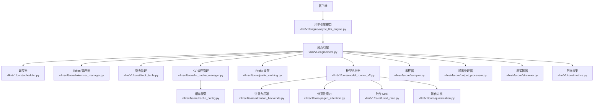
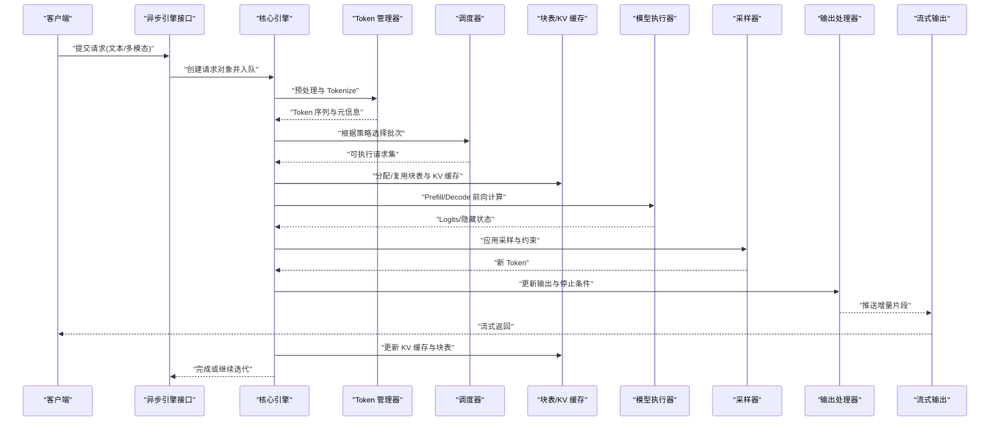
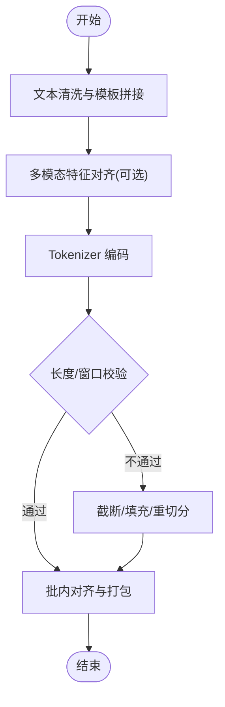
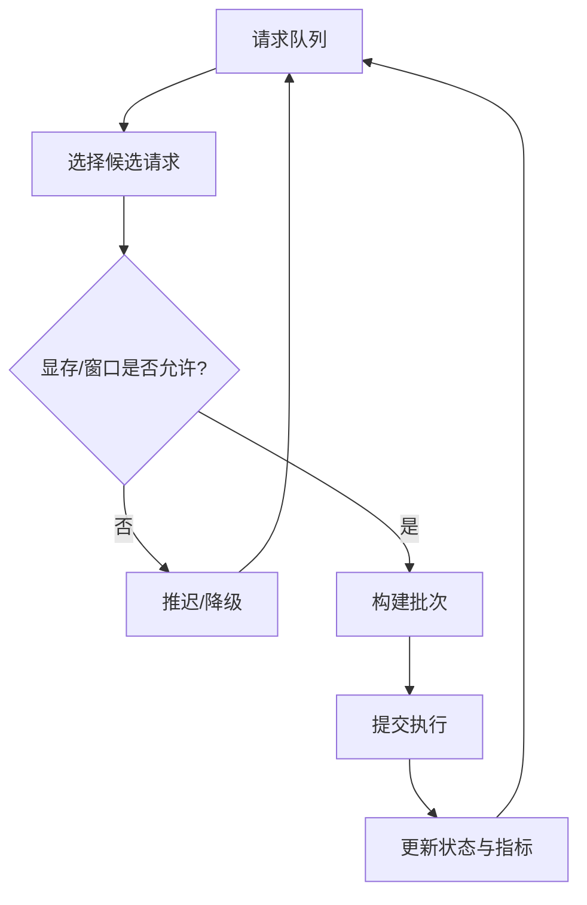
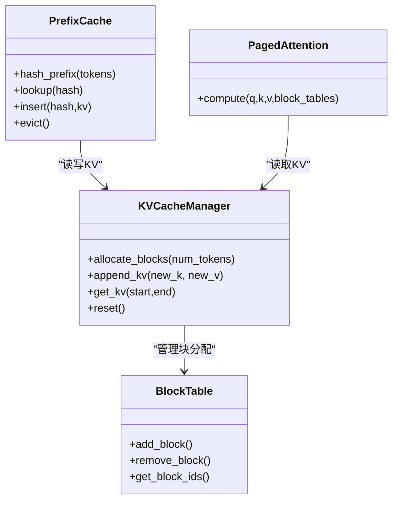
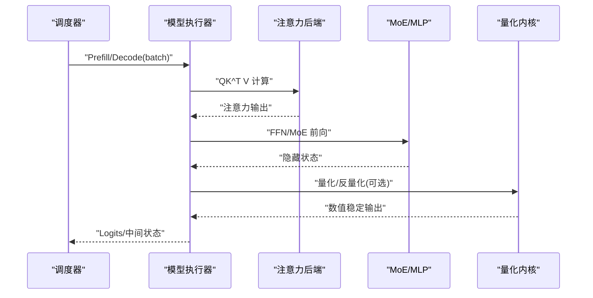
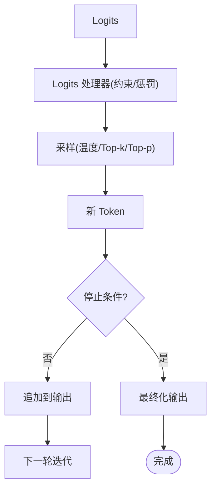
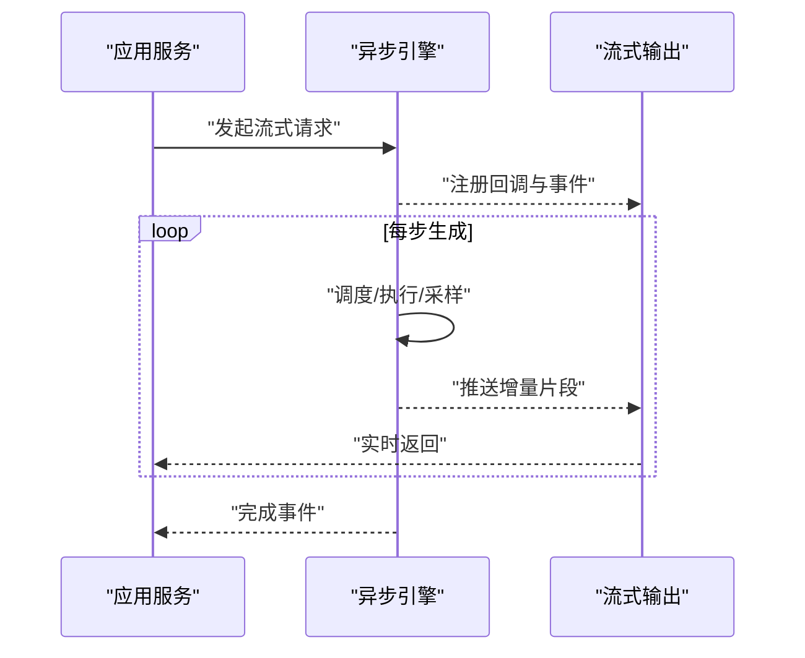
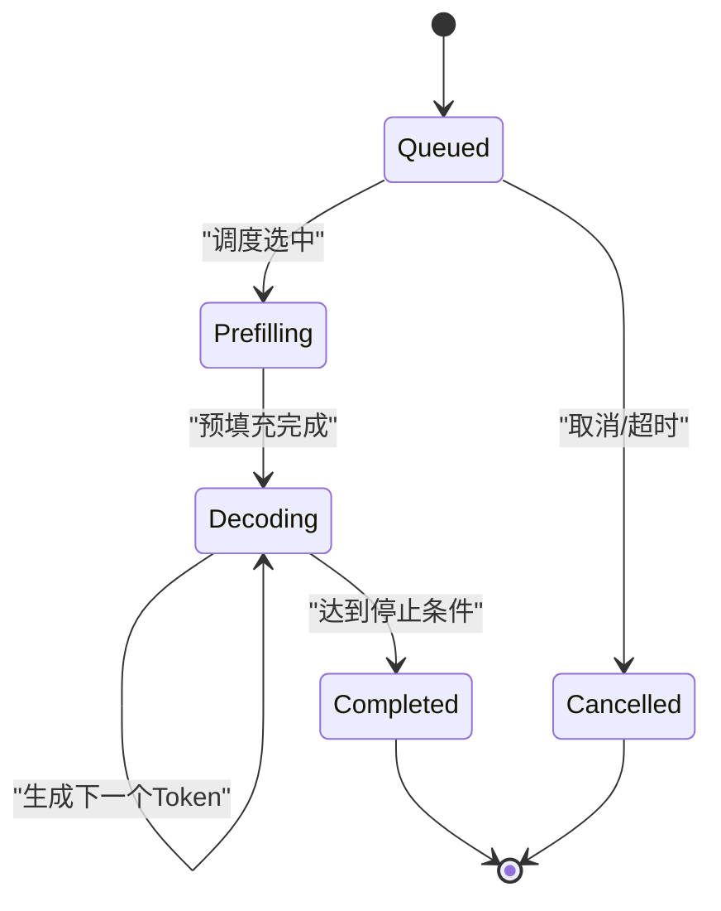
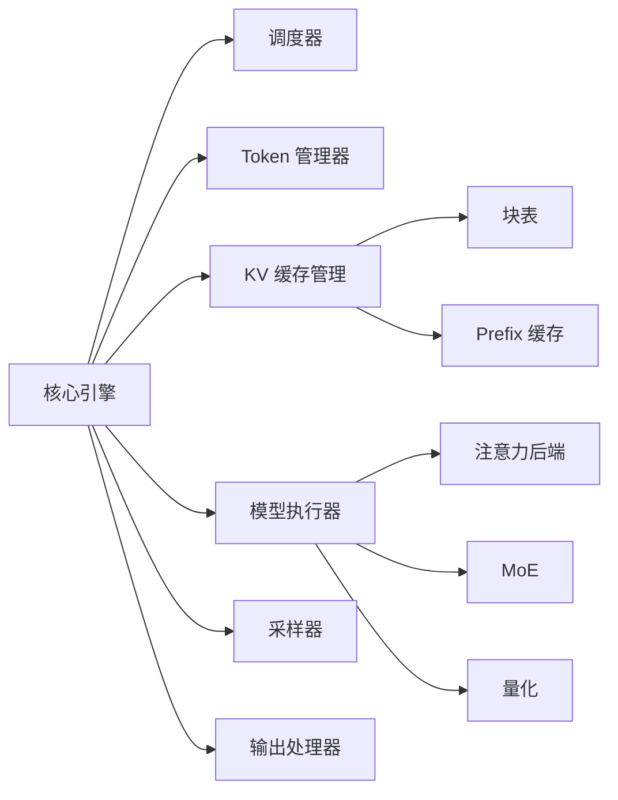

# 数据流管道

<cite>
**本文引用的文件**   
- [vllm/engine/async_llm_engine.py](file://vllm/engine/async_llm_engine.py)
- [vllm/engine/llm_engine.py](file://vllm/engine/llm_engine.py)
- [vllm/engine/core/llm_engine.py](file://vllm/engine/core/llm_engine.py)
- [vllm/v1/engine/async_llm_engine.py](file://vllm/v1/engine/async_llm_engine.py)
- [vllm/v1/engine/core.py](file://vllm/v1/engine/core.py)
- [vllm/v1/worker/worker.py](file://vllm/v1/worker/worker.py)
- [vllm/v1/core/block_table.py](file://vllm/v1/core/block_table.py)
- [vllm/v1/core/kv_cache_manager.py](file://vllm/v1/core/kv_cache_manager.py)
- [vllm/v1/core/prefix_caching.py](file://vllm/v1/core/prefix_caching.py)
- [vllm/v1/core/scheduler.py](file://vllm/v1/core/scheduler.py)
- [vllm/v1/core/model_runner_v2.py](file://vllm/v1/core/model_runner_v2.py)
- [vllm/v1/core/spec_decode_worker.py](file://vllm/v1/core/spec_decode_worker.py)
- [vllm/v1/core/streamer.py](file://vllm/v1/core/streamer.py)
- [vllm/v1/core/tokenizer_manager.py](file://vllm/v1/core/tokenizer_manager.py)
- [vllm/v1/core/request.py](file://vllm/v1/core/request.py)
- [vllm/v1/core/output_processor.py](file://vllm/v1/core/output_processor.py)
- [vllm/v1/core/metrics.py](file://vllm/v1/core/metrics.py)
- [vllm/v1/core/config.py](file://vllm/v1/core/config.py)
- [vllm/v1/core/sequence.py](file://vllm/v1/core/sequence.py)
- [vllm/v1/core/sampler.py](file://vllm/v1/core/sampler.py)
- [vllm/v1/core/logits_processor.py](file://vllm/v1/core/logits_processor.py)
- [vllm/v1/core/attention_backends.py](file://vllm/v1/core/attention_backends.py)
- [vllm/v1/core/cache_config.py](file://vllm/v1/core/cache_config.py)
- [vllm/v1/core/paged_attention.py](file://vllm/v1/core/paged_attention.py)
- [vllm/v1/core/cuda_graphs.py](file://vllm/v1/core/cuda_graphs.py)
- [vllm/v1/core/fused_moe.py](file://vllm/v1/core/fused_moe.py)
- [vllm/v1/core/quantization.py](file://vllm/v1/core/quantization.py)
- [vllm/v1/core/tpu_backend.py](file://vllm/v1/core/tpu_backend.py)
- [vllm/v1/core/xla_backend.py](file://vllm/v1/core/xla_backend.py)
- [vllm/v1/core/cpu_backend.py](file://vllm/v1/core/cpu_backend.py)
- [vllm/v1/core/multi_modal.py](file://vllm/v1/core/multi_modal.py)
- [vllm/v1/core/io_processor.py](file://vllm/v1/core/io_processor.py)
- [vllm/v1/core/plugins.py](file://vllm/v1/core/plugins.py)
- [vllm/v1/core/tracing.py](file://vllm/v1/core/tracing.py)
- [vllm/v1/core/logging.py](file://vllm/v1/core/logging.py)
- [vllm/v1/core/errors.py](file://vllm/v1/core/errors.py)
- [vllm/v1/core/utils.py](file://vllm/v1/core/utils.py)
- [vllm/v1/core/registry.py](file://vllm/v1/core/registry.py)
- [vllm/v1/core/types.py](file://vllm/v1/core/types.py)
- [vllm/v1/core/events.py](file://vllm/v1/core/events.py)
- [vllm/v1/core/state.py](file://vllm/v1/core/state.py)
- [vllm/v1/core/profile.py](file://vllm/v1/core/profile.py)
- [vllm/v1/core/benchmark.py](file://vllm/v1/core/benchmark.py)
- [vllm/v1/core/test_utils.py](file://vllm/v1/core/test_utils.py)
- [vllm/v1/core/conftest.py](file://vllm/v1/core/conftest.py)
- [vllm/v1/core/__init__.py](file://vllm/v1/core/__init__.py)
</cite>

## 目录
1. [简介](#简介)
2. [项目结构](#项目结构)
3. [核心组件](#核心组件)
4. [架构总览](#架构总览)
5. [详细组件分析](#详细组件分析)
6. [依赖关系分析](#依赖关系分析)
7. [性能考量](#性能考量)
8. [故障排查指南](#故障排查指南)
9. [结论](#结论)
10. [附录](#附录)

## 简介
本文件面向 vLLM 的数据流管道，系统性阐述从用户请求输入到模型推理输出的完整数据处理流程。内容覆盖预处理与 Tokenization、批处理策略、注意力计算与采样算法、输出处理、KV 缓存与 Prefix 缓存的集成、异步处理与流式响应机制，并提供序列图与状态转换图以展示各阶段数据形态变化。同时给出性能优化点与瓶颈分析，帮助读者深入理解并高效使用 vLLM 的数据流管道。

## 项目结构
vLLM 的数据流管道主要位于 v1 引擎与核心模块中，围绕“请求入队—调度—预填充/解码—缓存—采样—去分词—流式返回”的主路径组织。关键目录与职责如下：
- vllm/v1/engine: 对外暴露的异步 LLM 引擎接口，负责请求接入、生命周期管理与结果回传。
- vllm/v1/core: 数据流管道的核心实现，包括调度器、块表管理、KV 缓存与 Prefix 缓存、模型执行器、采样与 logits 处理器、流式输出等。
- vllm/v1/worker: 工作进程/设备侧的执行单元，承载注意力、MoE、量化等内核调用。
- vllm/engine: 兼容层与旧版引擎入口（用于对比与迁移参考）。

图表来源 
- [vllm/v1/engine/async_llm_engine.py](file://vllm/v1/engine/async_llm_engine.py)
- [vllm/v1/engine/core.py](file://vllm/v1/engine/core.py)
- [vllm/v1/core/scheduler.py](file://vllm/v1/core/scheduler.py)
- [vllm/v1/core/tokenizer_manager.py](file://vllm/v1/core/tokenizer_manager.py)
- [vllm/v1/core/block_table.py](file://vllm/v1/core/block_table.py)
- [vllm/v1/core/kv_cache_manager.py](file://vllm/v1/core/kv_cache_manager.py)
- [vllm/v1/core/prefix_caching.py](file://vllm/v1/core/prefix_caching.py)
- [vllm/v1/core/model_runner_v2.py](file://vllm/v1/core/model_runner_v2.py)
- [vllm/v1/core/sampler.py](file://vllm/v1/core/sampler.py)
- [vllm/v1/core/output_processor.py](file://vllm/v1/core/output_processor.py)
- [vllm/v1/core/streamer.py](file://vllm/v1/core/streamer.py)
- [vllm/v1/core/attention_backends.py](file://vllm/v1/core/attention_backends.py)
- [vllm/v1/core/paged_attention.py](file://vllm/v1/core/paged_attention.py)
- [vllm/v1/core/fused_moe.py](file://vllm/v1/core/fused_moe.py)
- [vllm/v1/core/quantization.py](file://vllm/v1/core/quantization.py)
- [vllm/v1/core/cache_config.py](file://vllm/v1/core/cache_config.py)
- [vllm/v1/core/metrics.py](file://vllm/v1/core/metrics.py)

章节来源
- [vllm/v1/engine/async_llm_engine.py](file://vllm/v1/engine/async_llm_engine.py)
- [vllm/v1/engine/core.py](file://vllm/v1/engine/core.py)

## 核心组件
- 异步引擎接口：封装请求接入、任务编排、结果回调与流式推送。
- 核心引擎：维护请求队列、调度策略、资源分配与跨组件协调。
- Token 管理器：完成文本到 Token 的编码、多模态对齐与提示模板处理。
- 调度器：按批大小、延迟目标、显存水位等策略选择可执行的请求集合。
- 块表与 KV 缓存：基于分页内存的块表管理 KV 张量，支持增量更新与复用。
- Prefix 缓存：对公共前缀进行哈希索引与共享，减少重复计算。
- 模型执行器：统一调用注意力、MoE、RMSNorm、RoPE 等内核，支持 CUDA Graph 与量化加速。
- 采样与 logits 处理器：Top-k/Top-p、温度、重复惩罚、结构化输出约束等。
- 输出处理器与流式输出：将 Token 序列转换为文本片段，按时间片推送。
- 指标与追踪：记录吞吐、时延、命中率、显存占用等关键指标。

章节来源
- [vllm/v1/engine/async_llm_engine.py](file://vllm/v1/engine/async_llm_engine.py)
- [vllm/v1/engine/core.py](file://vllm/v1/engine/core.py)
- [vllm/v1/core/scheduler.py](file://vllm/v1/core/scheduler.py)
- [vllm/v1/core/tokenizer_manager.py](file://vllm/v1/core/tokenizer_manager.py)
- [vllm/v1/core/block_table.py](file://vllm/v1/core/block_table.py)
- [vllm/v1/core/kv_cache_manager.py](file://vllm/v1/core/kv_cache_manager.py)
- [vllm/v1/core/prefix_caching.py](file://vllm/v1/core/prefix_caching.py)
- [vllm/v1/core/model_runner_v2.py](file://vllm/v1/core/model_runner_v2.py)
- [vllm/v1/core/sampler.py](file://vllm/v1/core/sampler.py)
- [vllm/v1/core/output_processor.py](file://vllm/v1/core/output_processor.py)
- [vllm/v1/core/streamer.py](file://vllm/v1/core/streamer.py)
- [vllm/v1/core/metrics.py](file://vllm/v1/core/metrics.py)

## 架构总览
下图展示了从请求进入引擎到生成 Token 并流式返回的整体数据流。

图表来源 
- [vllm/v1/engine/async_llm_engine.py](file://vllm/v1/engine/async_llm_engine.py)
- [vllm/v1/engine/core.py](file://vllm/v1/engine/core.py)
- [vllm/v1/core/tokenizer_manager.py](file://vllm/v1/core/tokenizer_manager.py)
- [vllm/v1/core/scheduler.py](file://vllm/v1/core/scheduler.py)
- [vllm/v1/core/block_table.py](file://vllm/v1/core/block_table.py)
- [vllm/v1/core/kv_cache_manager.py](file://vllm/v1/core/kv_cache_manager.py)
- [vllm/v1/core/model_runner_v2.py](file://vllm/v1/core/model_runner_v2.py)
- [vllm/v1/core/sampler.py](file://vllm/v1/core/sampler.py)
- [vllm/v1/core/output_processor.py](file://vllm/v1/core/output_processor.py)
- [vllm/v1/core/streamer.py](file://vllm/v1/core/streamer.py)

## 详细组件分析

### 预处理与 Tokenization
- 文本预处理：清洗、模板拼接、系统/对话消息组装，支持多模态输入对齐。
- Tokenization：调用对应模型的 Tokenizer，生成 Token ID 序列与位置信息；必要时注入特殊 Token。
- 批量合并：将多个请求的 Token 序列按最大长度与注意力窗口进行对齐，便于后续批处理。

图表来源 
- [vllm/v1/core/tokenizer_manager.py](file://vllm/v1/core/tokenizer_manager.py)
- [vllm/v1/core/request.py](file://vllm/v1/core/request.py)

章节来源
- [vllm/v1/core/tokenizer_manager.py](file://vllm/v1/core/tokenizer_manager.py)
- [vllm/v1/core/request.py](file://vllm/v1/core/request.py)

### 批处理策略与调度
- 调度目标：在满足延迟与吞吐目标的前提下，最大化 GPU 利用率。
- 策略要点：
  - Prefill 优先：长上下文预填充阶段计算密集，优先安排以提升整体吞吐。
  - Decode 步进：每次仅推进一个 Token，关注 KV 缓存命中与块表分配。
  - 动态批：根据剩余显存、注意力窗口与请求进度动态调整批次大小。
  - 优先级：高优先级请求优先获得资源，保障 SLA。

图表来源 
- [vllm/v1/core/scheduler.py](file://vllm/v1/core/scheduler.py)
- [vllm/v1/core/cache_config.py](file://vllm/v1/core/cache_config.py)

章节来源
- [vllm/v1/core/scheduler.py](file://vllm/v1/core/scheduler.py)
- [vllm/v1/core/cache_config.py](file://vllm/v1/core/cache_config.py)

### 注意力计算与 KV 缓存
- 注意力后端：支持 FlashAttention、PagedAttention 等高性能实现。
- KV 缓存：采用分页块表存储 K/V 张量，支持增量插入与复用，避免连续内存碎片。
- Prefix 缓存：对公共前缀进行哈希索引，命中后直接复用已计算的 KV，显著降低重复计算。

图表来源 
- [vllm/v1/core/kv_cache_manager.py](file://vllm/v1/core/kv_cache_manager.py)
- [vllm/v1/core/block_table.py](file://vllm/v1/core/block_table.py)
- [vllm/v1/core/prefix_caching.py](file://vllm/v1/core/prefix_caching.py)
- [vllm/v1/core/paged_attention.py](file://vllm/v1/core/paged_attention.py)

章节来源
- [vllm/v1/core/kv_cache_manager.py](file://vllm/v1/core/kv_cache_manager.py)
- [vllm/v1/core/block_table.py](file://vllm/v1/core/block_table.py)
- [vllm/v1/core/prefix_caching.py](file://vllm/v1/core/prefix_caching.py)
- [vllm/v1/core/paged_attention.py](file://vllm/v1/core/paged_attention.py)

### 模型执行器与前向流程
- 统一接口：封装 Prefill 与 Decode 两个阶段的前向计算，屏蔽底层内核差异。
- 内核融合：RMSNorm、RoPE、MLP/MoE、GEMM 等算子融合，减少内存访问与同步开销。
- 图优化：CUDA Graph 捕获热点路径，降低启动开销；量化与稀疏化进一步提速。

图表来源 
- [vllm/v1/core/model_runner_v2.py](file://vllm/v1/core/model_runner_v2.py)
- [vllm/v1/core/attention_backends.py](file://vllm/v1/core/attention_backends.py)
- [vllm/v1/core/fused_moe.py](file://vllm/v1/core/fused_moe.py)
- [vllm/v1/core/quantization.py](file://vllm/v1/core/quantization.py)

章节来源
- [vllm/v1/core/model_runner_v2.py](file://vllm/v1/core/model_runner_v2.py)
- [vllm/v1/core/attention_backends.py](file://vllm/v1/core/attention_backends.py)
- [vllm/v1/core/fused_moe.py](file://vllm/v1/core/fused_moe.py)
- [vllm/v1/core/quantization.py](file://vllm/v1/core/quantization.py)

### 采样算法与输出处理
- 采样策略：Top-k、Top-p、温度缩放、重复惩罚、频率/存在性惩罚等组合。
- 结构化输出：基于约束解码确保 JSON/Schema 合规。
- 输出处理：将 Token 转为文本片段，处理字节级边界与特殊字符，支持增量推送。

图表来源 
- [vllm/v1/core/sampler.py](file://vllm/v1/core/sampler.py)
- [vllm/v1/core/logits_processor.py](file://vllm/v1/core/logits_processor.py)
- [vllm/v1/core/output_processor.py](file://vllm/v1/core/output_processor.py)

章节来源
- [vllm/v1/core/sampler.py](file://vllm/v1/core/sampler.py)
- [vllm/v1/core/logits_processor.py](file://vllm/v1/core/logits_processor.py)
- [vllm/v1/core/output_processor.py](file://vllm/v1/core/output_processor.py)

### 异步处理与流式响应
- 异步引擎：基于事件循环与协程，非阻塞地处理大量并发请求。
- 流式输出：每生成一个 Token 即推送增量片段，降低首字延迟。
- 背压与限流：根据下游消费能力与资源水位控制入队速率。

图表来源 
- [vllm/v1/engine/async_llm_engine.py](file://vllm/v1/engine/async_llm_engine.py)
- [vllm/v1/core/streamer.py](file://vllm/v1/core/streamer.py)

章节来源
- [vllm/v1/engine/async_llm_engine.py](file://vllm/v1/engine/async_llm_engine.py)
- [vllm/v1/core/streamer.py](file://vllm/v1/core/streamer.py)

### 状态转换图（请求生命周期）

图表来源 
- [vllm/v1/core/request.py](file://vllm/v1/core/request.py)
- [vllm/v1/core/scheduler.py](file://vllm/v1/core/scheduler.py)

章节来源
- [vllm/v1/core/request.py](file://vllm/v1/core/request.py)
- [vllm/v1/core/scheduler.py](file://vllm/v1/core/scheduler.py)

## 依赖关系分析
- 组件耦合：
  - 核心引擎依赖调度器、Token 管理器、块表/KV 缓存、模型执行器、采样与输出处理器。
  - 模型执行器依赖注意力后端、MoE、量化内核与 CUDA Graph。
  - KV 缓存与 Prefix 缓存共同支撑重复计算消除与内存复用。
- 外部依赖：
  - 硬件后端（CUDA/ROCm/XLA/TPU/CPU）通过统一接口抽象。
  - 分布式通信与并行策略由上层配置驱动。

图表来源 
- [vllm/v1/engine/core.py](file://vllm/v1/engine/core.py)
- [vllm/v1/core/scheduler.py](file://vllm/v1/core/scheduler.py)
- [vllm/v1/core/tokenizer_manager.py](file://vllm/v1/core/tokenizer_manager.py)
- [vllm/v1/core/kv_cache_manager.py](file://vllm/v1/core/kv_cache_manager.py)
- [vllm/v1/core/block_table.py](file://vllm/v1/core/block_table.py)
- [vllm/v1/core/prefix_caching.py](file://vllm/v1/core/prefix_caching.py)
- [vllm/v1/core/model_runner_v2.py](file://vllm/v1/core/model_runner_v2.py)
- [vllm/v1/core/attention_backends.py](file://vllm/v1/core/attention_backends.py)
- [vllm/v1/core/fused_moe.py](file://vllm/v1/core/fused_moe.py)
- [vllm/v1/core/quantization.py](file://vllm/v1/core/quantization.py)

章节来源
- [vllm/v1/engine/core.py](file://vllm/v1/engine/core.py)
- [vllm/v1/core/model_runner_v2.py](file://vllm/v1/core/model_runner_v2.py)

## 性能考量
- 批处理优化：
  - 动态批大小与注意力窗口自适应，避免显存抖动。
  - Prefill/Decode 分离调度，提升整体吞吐。
- 缓存命中：
  - KV 缓存分页与复用减少内存分配与拷贝。
  - Prefix 缓存命中率高时可显著降低重复计算。
- 内核融合与图优化：
  - 融合 RMSNorm/RoPE/GEMM/MoE，减少内核启动与内存带宽压力。
  - CUDA Graph 捕获热点路径，降低 CPU-GPU 同步开销。
- 量化与稀疏：
  - 权重/激活量化与稀疏注意力降低计算与访存成本。
- 监控与调优：
  - 指标采集涵盖吞吐、时延、命中率、显存占用，辅助定位瓶颈。

[本节为通用指导，不直接分析具体文件]

## 故障排查指南
- 常见问题：
  - OOM：检查批次大小、注意力窗口、KV 缓存容量与 Prefix 缓存命中率。
  - 低吞吐：确认 Prefill/Decode 比例、内核融合是否生效、CUDA Graph 是否启用。
  - 流式卡顿：检查下游消费速度与背压策略，确认流式输出通道未阻塞。
  - 采样异常：验证 logits 处理器与采样参数，确保数值稳定性。
- 诊断手段：
  - 查看指标与日志，定位慢步骤与热点路径。
  - 使用 Profiling 工具分析内核耗时与内存占用。
  - 逐步关闭优化特性（如量化、图优化）以隔离问题。

章节来源
- [vllm/v1/core/metrics.py](file://vllm/v1/core/metrics.py)
- [vllm/v1/core/logging.py](file://vllm/v1/core/logging.py)
- [vllm/v1/core/errors.py](file://vllm/v1/core/errors.py)

## 结论
vLLM 的数据流管道以“请求—调度—执行—缓存—采样—输出”为主线，结合分页 KV 缓存、Prefix 缓存、内核融合与图优化，实现了高吞吐、低延迟的推理服务。通过合理的批处理策略与异步流式输出，能够在大规模并发场景下保持稳定的服务质量。持续的性能监控与针对性调优是发挥系统潜力的关键。

[本节为总结性内容，不直接分析具体文件]

## 附录
- 术语说明：
  - Prefill：长上下文一次性前向计算。
  - Decode：逐 Token 增量生成。
  - KV 缓存：保存注意力键值张量以复用。
  - Prefix 缓存：对公共前缀进行哈希与共享。
  - 分页注意力：基于块表的注意力实现，避免连续内存。
- 相关文档与示例：
  - 在线服务与离线推理示例位于 examples 目录。
  - 性能基准与优化指南参见 benchmarks 与 docs。

[本节为补充信息，不直接分析具体文件]