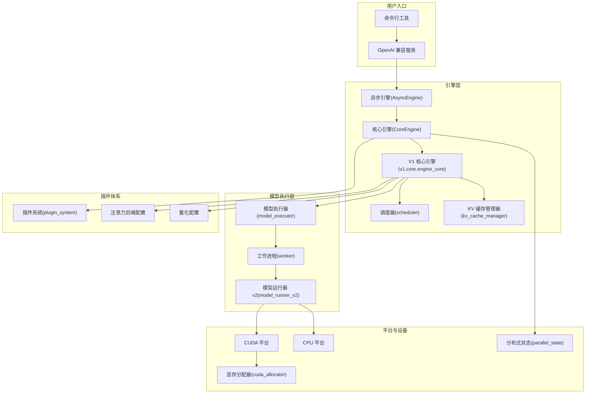
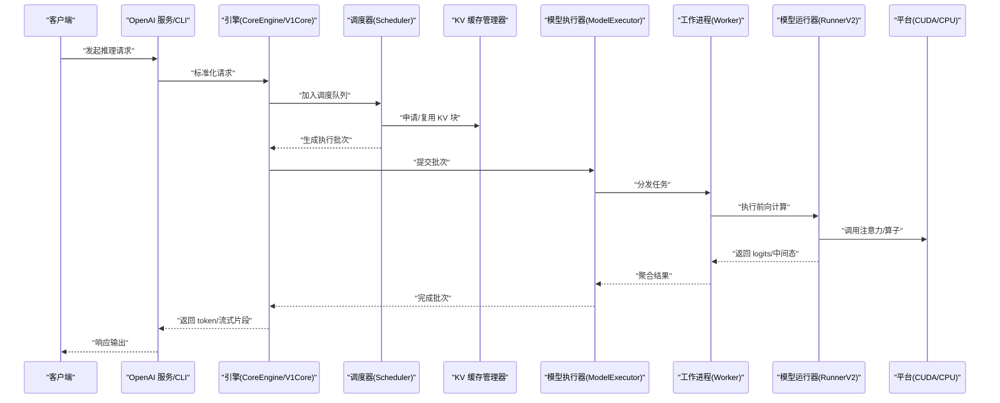
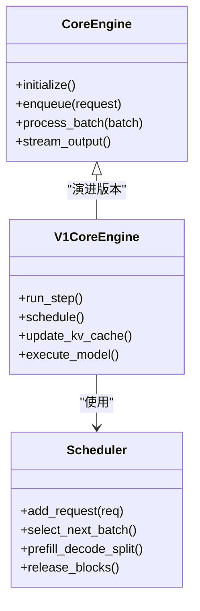
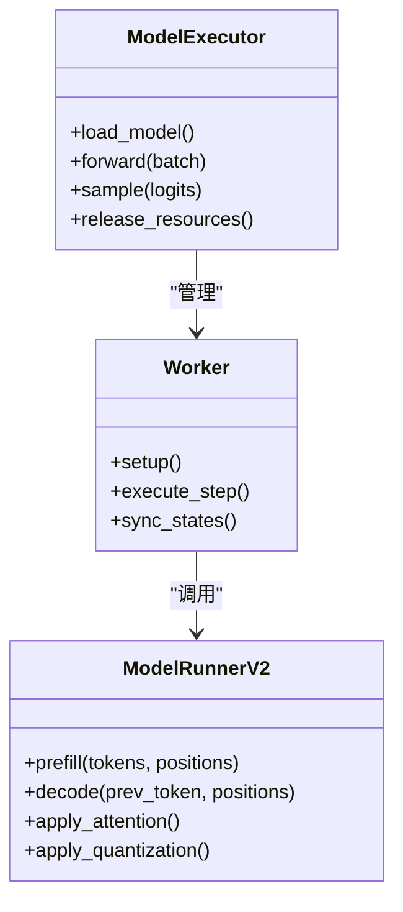
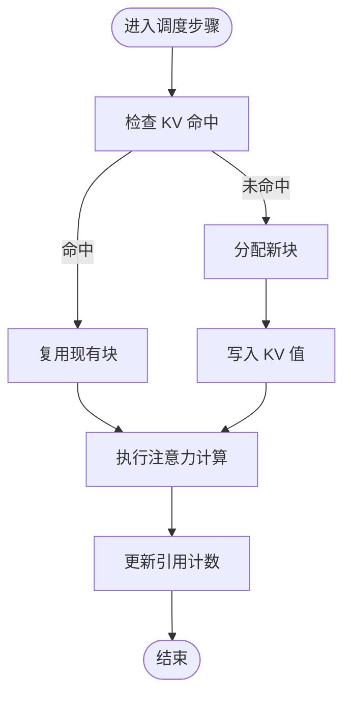
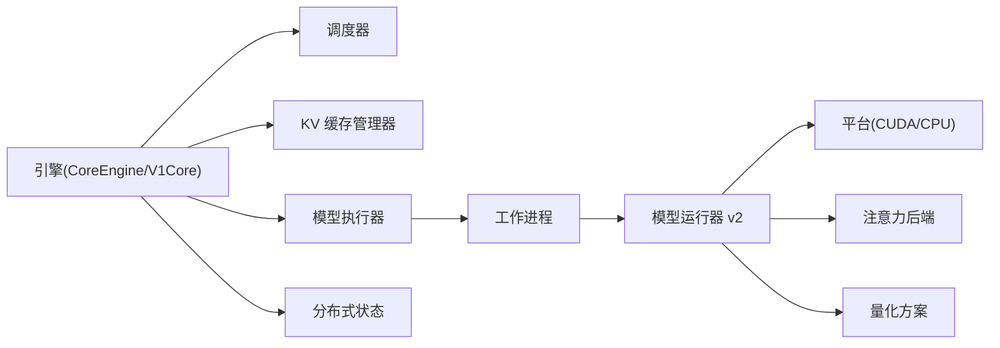

# 架构概览

<cite>
**本文引用的文件**   
- [vllm/engine/async_engine.py](file://vllm/engine/async_engine.py)
- [vllm/engine/core.py](file://vllm/engine/core.py)
- [vllm/model_executor/model_executor.py](file://vllm/model_executor/model_executor.py)
- [vllm/model_executor/worker/worker.py](file://vllm/model_executor/worker/worker.py)
- [vllm/config.py](file://vllm/config.py)
- [vllm/tokenizers/__init__.py](file://vllm/tokenizers/__init__.py)
- [vllm/v1/core/engine_core.py](file://vllm/v1/core/engine_core.py)
- [vllm/v1/core/kv_cache_manager.py](file://vllm/v1/core/kv_cache_manager.py)
- [vllm/v1/core/scheduler.py](file://vllm/v1/core/scheduler.py)
- [vllm/v1/core/model_runner_v2.py](file://vllm/v1/core/model_runner_v2.py)
- [vllm/plugins/plugin_system.py](file://vllm/plugins/plugin_system.py)
- [vllm/distributed/parallel_state.py](file://vllm/distributed/parallel_state.py)
- [vllm/device_allocator/cuda_allocator.py](file://vllm/device_allocator/cuda_allocator.py)
- [vllm/platforms/cpu.py](file://vllm/platforms/cpu.py)
- [vllm/platforms/cuda.py](file://vllm/platforms/cuda.py)
- [vllm/config/engine_args.py](file://vllm/config/engine_args.py)
- [vllm/config/quantization_config.py](file://vllm/config/quantization_config.py)
- [vllm/config/attention_backend_config.py](file://vllm/config/attention_backend_config.py)
- [vllm/entrypoints/openai/api_server.py](file://vllm/entrypoints/openai/api_server.py)
- [vllm/entrypoints/generate/cli.py](file://vllm/entrypoints/generate/cli.py)
</cite>

## 目录
1. [简介](#简介)
2. [项目结构](#项目结构)
3. [核心组件](#核心组件)
4. [架构总览](#架构总览)
5. [详细组件分析](#详细组件分析)
6. [依赖关系分析](#依赖关系分析)
7. [性能考量](#性能考量)
8. [故障排查指南](#故障排查指南)
9. [结论](#结论)
10. [附录](#附录)

## 简介
本文件面向希望深入理解 vLLM 系统架构的开发者与使用者，系统性阐述其高层设计模式（模块化、插件化、分层）、关键组件职责与交互、端到端数据流与处理管道、内存管理策略（GPU/CPU 显存优化与跨设备传输），以及扩展点设计（自定义模型集成、量化方法扩展、注意力后端替换）。文档同时提供架构图与数据流图，帮助读者建立从请求到推理输出的完整认知。

## 项目结构
vLLM 采用“引擎层 + 模型执行层 + 平台/设备抽象 + 插件体系”的分层组织方式：
- 引擎层：对外暴露 Engine API，负责请求编排、调度、缓存管理与生命周期控制。
- 模型执行层：封装具体模型的前向计算、KV Cache 管理、采样与输出组装。
- 平台/设备层：屏蔽 CUDA/ROCm/CPU/XPU 等差异，统一资源分配与通信接口。
- 插件体系：通过注册机制支持注意力后端、量化方案、LoRA 解析器、IO 处理器等扩展。

图表来源 
- [vllm/engine/async_engine.py](file://vllm/engine/async_engine.py)
- [vllm/engine/core.py](file://vllm/engine/core.py)
- [vllm/v1/core/engine_core.py](file://vllm/v1/core/engine_core.py)
- [vllm/v1/core/scheduler.py](file://vllm/v1/core/scheduler.py)
- [vllm/v1/core/kv_cache_manager.py](file://vllm/v1/core/kv_cache_manager.py)
- [vllm/model_executor/model_executor.py](file://vllm/model_executor/model_executor.py)
- [vllm/model_executor/worker/worker.py](file://vllm/model_executor/worker/worker.py)
- [vllm/v1/core/model_runner_v2.py](file://vllm/v1/core/model_runner_v2.py)
- [vllm/platforms/cuda.py](file://vllm/platforms/cuda.py)
- [vllm/platforms/cpu.py](file://vllm/platforms/cpu.py)
- [vllm/device_allocator/cuda_allocator.py](file://vllm/device_allocator/cuda_allocator.py)
- [vllm/plugins/plugin_system.py](file://vllm/plugins/plugin_system.py)
- [vllm/config/attention_backend_config.py](file://vllm/config/attention_backend_config.py)
- [vllm/config/quantization_config.py](file://vllm/config/quantization_config.py)
- [vllm/distributed/parallel_state.py](file://vllm/distributed/parallel_state.py)

章节来源
- [vllm/engine/async_engine.py](file://vllm/engine/async_engine.py)
- [vllm/engine/core.py](file://vllm/engine/core.py)
- [vllm/v1/core/engine_core.py](file://vllm/v1/core/engine_core.py)
- [vllm/model_executor/model_executor.py](file://vllm/model_executor/model_executor.py)
- [vllm/model_executor/worker/worker.py](file://vllm/model_executor/worker/worker.py)
- [vllm/v1/core/model_runner_v2.py](file://vllm/v1/core/model_runner_v2.py)
- [vllm/platforms/cuda.py](file://vllm/platforms/cuda.py)
- [vllm/platforms/cpu.py](file://vllm/platforms/cpu.py)
- [vllm/device_allocator/cuda_allocator.py](file://vllm/device_allocator/cuda_allocator.py)
- [vllm/plugins/plugin_system.py](file://vllm/plugins/plugin_system.py)
- [vllm/config/attention_backend_config.py](file://vllm/config/attention_backend_config.py)
- [vllm/config/quantization_config.py](file://vllm/config/quantization_config.py)
- [vllm/distributed/parallel_state.py](file://vllm/distributed/parallel_state.py)

## 核心组件
- 引擎（Engine/CoreEngine/V1Core）：接收并编排请求，协调调度器、KV 缓存与模型执行器，维护批次生命周期与并发控制。
- 模型执行器（ModelExecutor/Worker/RunnerV2）：加载模型权重、执行前向计算、调用注意力内核、管理 KV Cache 与采样。
- 缓存管理器（KVCacheManager）：实现分块分页式 KV 缓存，支持预填充与解码阶段的复用与回收。
- Tokenizer：文本与多模态输入的分词与对齐，为模型准备 token 序列与位置信息。
- 平台与设备（Platform/Allocator）：统一 GPU/CPU 等资源访问，提供显存池与跨设备拷贝能力。
- 插件系统（PluginSystem）：注册与发现注意力后端、量化方案、LoRA 解析器、IO 处理器等扩展点。

章节来源
- [vllm/engine/core.py](file://vllm/engine/core.py)
- [vllm/v1/core/engine_core.py](file://vllm/v1/core/engine_core.py)
- [vllm/model_executor/model_executor.py](file://vllm/model_executor/model_executor.py)
- [vllm/model_executor/worker/worker.py](file://vllm/model_executor/worker/worker.py)
- [vllm/v1/core/kv_cache_manager.py](file://vllm/v1/core/kv_cache_manager.py)
- [vllm/tokenizers/__init__.py](file://vllm/tokenizers/__init__.py)
- [vllm/platforms/cuda.py](file://vllm/platforms/cuda.py)
- [vllm/platforms/cpu.py](file://vllm/platforms/cpu.py)
- [vllm/device_allocator/cuda_allocator.py](file://vllm/device_allocator/cuda_allocator.py)
- [vllm/plugins/plugin_system.py](file://vllm/plugins/plugin_system.py)

## 架构总览
vLLM 的整体架构遵循“请求入站 → 引擎编排 → 调度与缓存 → 模型执行 → 结果回传”的分层流水线。引擎层将不同来源的请求标准化，调度器按批合并与优先级策略安排执行；KV 缓存管理器在预填充与解码阶段提供高效复用；模型执行器根据配置选择注意力后端与量化方案，最终返回 token 或结构化输出。

图表来源 
- [vllm/entrypoints/openai/api_server.py](file://vllm/entrypoints/openai/api_server.py)
- [vllm/entrypoints/generate/cli.py](file://vllm/entrypoints/generate/cli.py)
- [vllm/engine/core.py](file://vllm/engine/core.py)
- [vllm/v1/core/engine_core.py](file://vllm/v1/core/engine_core.py)
- [vllm/v1/core/scheduler.py](file://vllm/v1/core/scheduler.py)
- [vllm/v1/core/kv_cache_manager.py](file://vllm/v1/core/kv_cache_manager.py)
- [vllm/model_executor/model_executor.py](file://vllm/model_executor/model_executor.py)
- [vllm/model_executor/worker/worker.py](file://vllm/model_executor/worker/worker.py)
- [vllm/v1/core/model_runner_v2.py](file://vllm/v1/core/model_runner_v2.py)
- [vllm/platforms/cuda.py](file://vllm/platforms/cuda.py)
- [vllm/platforms/cpu.py](file://vllm/platforms/cpu.py)

## 详细组件分析

### 引擎与调度（CoreEngine/V1Core/Scheduler）
- 职责：请求标准化、批次构建、优先级与抢占策略、生命周期管理、与 KV 缓存和模型执行器的协作。
- 关键点：
  - 将不同入口（OpenAI/CLI/Ray）的请求统一为内部表示。
  - 依据上下文长度、延迟目标与吞吐目标动态调整批次大小。
  - 与 KV 缓存管理器协同，避免碎片化与重复计算。
  - 支持流式输出与中断恢复。

图表来源 
- [vllm/engine/core.py](file://vllm/engine/core.py)
- [vllm/v1/core/engine_core.py](file://vllm/v1/core/engine_core.py)
- [vllm/v1/core/scheduler.py](file://vllm/v1/core/scheduler.py)

章节来源
- [vllm/engine/core.py](file://vllm/engine/core.py)
- [vllm/v1/core/engine_core.py](file://vllm/v1/core/engine_core.py)
- [vllm/v1/core/scheduler.py](file://vllm/v1/core/scheduler.py)

### 模型执行器与工作进程（ModelExecutor/Worker/RunnerV2）
- 职责：加载模型权重、初始化注意力后端与量化方案、执行前向计算、采样与输出组装。
- 关键点：
  - 通过 Worker 隔离执行环境，支持多进程/分布式并行。
  - RunnerV2 作为统一的执行入口，封装不同模型与后端的差异。
  - 与 KV 缓存管理器交互，读写 KV 块，支持跨设备传输。

图表来源 
- [vllm/model_executor/model_executor.py](file://vllm/model_executor/model_executor.py)
- [vllm/model_executor/worker/worker.py](file://vllm/model_executor/worker/worker.py)
- [vllm/v1/core/model_runner_v2.py](file://vllm/v1/core/model_runner_v2.py)

章节来源
- [vllm/model_executor/model_executor.py](file://vllm/model_executor/model_executor.py)
- [vllm/model_executor/worker/worker.py](file://vllm/model_executor/worker/worker.py)
- [vllm/v1/core/model_runner_v2.py](file://vllm/v1/core/model_runner_v2.py)

### KV 缓存管理器（KVCacheManager）
- 职责：以分块分页的方式管理 KV 缓存，支持预填充与解码阶段的复用、回收与迁移。
- 关键点：
  - 块级分配与引用计数，减少碎片与提升命中率。
  - 支持 CPU/GPU 间的数据迁移与卸载策略。
  - 与调度器配合，按请求生命周期释放块。

图表来源 
- [vllm/v1/core/kv_cache_manager.py](file://vllm/v1/core/kv_cache_manager.py)

章节来源
- [vllm/v1/core/kv_cache_manager.py](file://vllm/v1/core/kv_cache_manager.py)

### Tokenizer（分词与对齐）
- 职责：将原始文本或多模态输入转换为 token 序列与位置编码，确保与模型期望一致。
- 关键点：
  - 支持多种 tokenizer 后端与模板。
  - 对多模态输入进行对齐与裁剪，保证上下文长度限制。

章节来源
- [vllm/tokenizers/__init__.py](file://vllm/tokenizers/__init__.py)

### 平台与设备（Platform/Allocator）
- 职责：统一 GPU/CPU 等平台抽象，提供显存分配、跨设备拷贝与通信原语。
- 关键点：
  - CUDA/CPU 平台分别实现资源管理与性能优化。
  - 显存分配器支持池化与阈值策略，降低碎片与提升利用率。

章节来源
- [vllm/platforms/cuda.py](file://vllm/platforms/cuda.py)
- [vllm/platforms/cpu.py](file://vllm/platforms/cpu.py)
- [vllm/device_allocator/cuda_allocator.py](file://vllm/device_allocator/cuda_allocator.py)

### 插件系统（PluginSystem）
- 职责：注册与发现注意力后端、量化方案、LoRA 解析器、IO 处理器等扩展点。
- 关键点：
  - 通过配置驱动选择具体实现。
  - 支持热插拔与运行时切换。

章节来源
- [vllm/plugins/plugin_system.py](file://vllm/plugins/plugin_system.py)

## 依赖关系分析
vLLM 的依赖关系呈现清晰的层次与解耦：
- 引擎层依赖调度器与 KV 缓存管理器，不直接耦合具体模型实现。
- 模型执行器依赖平台抽象与分配器，屏蔽硬件差异。
- 插件系统通过配置与注册表注入注意力后端与量化方案。
- 分布式状态用于多卡/多节点通信与同步。

图表来源 
- [vllm/engine/core.py](file://vllm/engine/core.py)
- [vllm/v1/core/engine_core.py](file://vllm/v1/core/engine_core.py)
- [vllm/v1/core/scheduler.py](file://vllm/v1/core/scheduler.py)
- [vllm/v1/core/kv_cache_manager.py](file://vllm/v1/core/kv_cache_manager.py)
- [vllm/model_executor/model_executor.py](file://vllm/model_executor/model_executor.py)
- [vllm/model_executor/worker/worker.py](file://vllm/model_executor/worker/worker.py)
- [vllm/v1/core/model_runner_v2.py](file://vllm/v1/core/model_runner_v2.py)
- [vllm/platforms/cuda.py](file://vllm/platforms/cuda.py)
- [vllm/platforms/cpu.py](file://vllm/platforms/cpu.py)
- [vllm/distributed/parallel_state.py](file://vllm/distributed/parallel_state.py)

章节来源
- [vllm/engine/core.py](file://vllm/engine/core.py)
- [vllm/v1/core/engine_core.py](file://vllm/v1/core/engine_core.py)
- [vllm/model_executor/model_executor.py](file://vllm/model_executor/model_executor.py)
- [vllm/distributed/parallel_state.py](file://vllm/distributed/parallel_state.py)

## 性能考量
- 批处理与调度：动态批大小、预填充/解码分离、优先级与抢占策略，最大化吞吐并降低尾延迟。
- KV 缓存：分块分页、引用计数、跨设备迁移与卸载，提高命中率与显存利用率。
- 注意力后端：选择高性能内核（如 FlashAttention、TRT-LLM 等），结合 CUDA Graph 与融合算子。
- 量化：INT8/FP8/NVFP4 等量化路径，减少带宽与显存占用，保持精度平衡。
- 平台优化：显存池化、零拷贝、异步通信与并行化，降低开销。

[本节为通用指导，不直接分析具体文件]

## 故障排查指南
- 启动失败：检查配置文件（引擎参数、注意力后端、量化方案）与平台兼容性。
- 显存不足：调整批大小、启用 KV 卸载、检查碎片率与分配器阈值。
- 性能退化：确认注意力后端是否生效、CUDA Graph 是否捕获成功、是否存在频繁跨设备拷贝。
- 分布式问题：核对分布式状态初始化、通信后端与拓扑配置。

章节来源
- [vllm/config/engine_args.py](file://vllm/config/engine_args.py)
- [vllm/config/attention_backend_config.py](file://vllm/config/attention_backend_config.py)
- [vllm/config/quantization_config.py](file://vllm/config/quantization_config.py)
- [vllm/distributed/parallel_state.py](file://vllm/distributed/parallel_state.py)

## 结论
vLLM 通过清晰的层级与插件化设计，实现了高吞吐、低延迟的大模型推理服务。引擎层负责编排与调度，模型执行层专注计算与优化，平台与设备抽象屏蔽硬件差异，插件体系提供灵活的扩展能力。借助高效的 KV 缓存与注意力后端，vLLM 能够在多种硬件环境下稳定运行，满足生产级需求。

[本节为总结性内容，不直接分析具体文件]

## 附录
- 快速开始：通过 CLI 或 OpenAI 兼容服务启动推理。
- 配置参考：引擎参数、注意力后端、量化方案的配置项说明。
- 扩展开发：如何注册自定义注意力后端、量化方法与 LoRA 解析器。

章节来源
- [vllm/entrypoints/generate/cli.py](file://vllm/entrypoints/generate/cli.py)
- [vllm/entrypoints/openai/api_server.py](file://vllm/entrypoints/openai/api_server.py)
- [vllm/config/engine_args.py](file://vllm/config/engine_args.py)
- [vllm/config/attention_backend_config.py](file://vllm/config/attention_backend_config.py)
- [vllm/config/quantization_config.py](file://vllm/config/quantization_config.py)