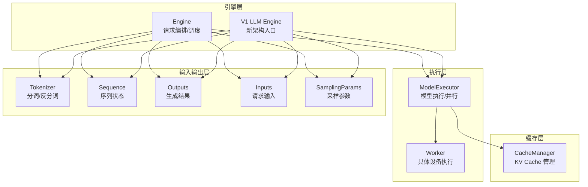
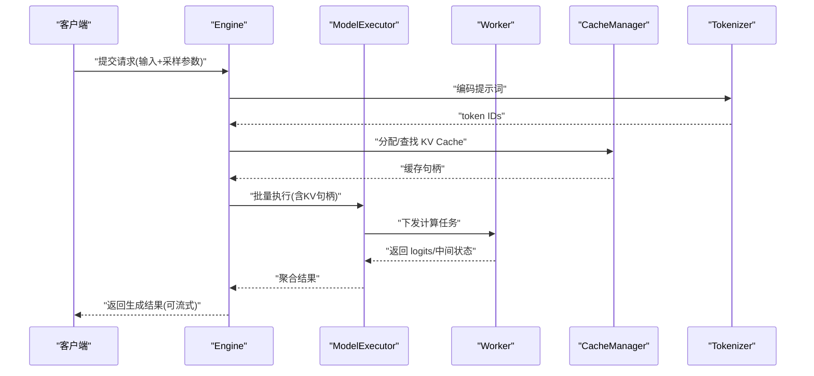
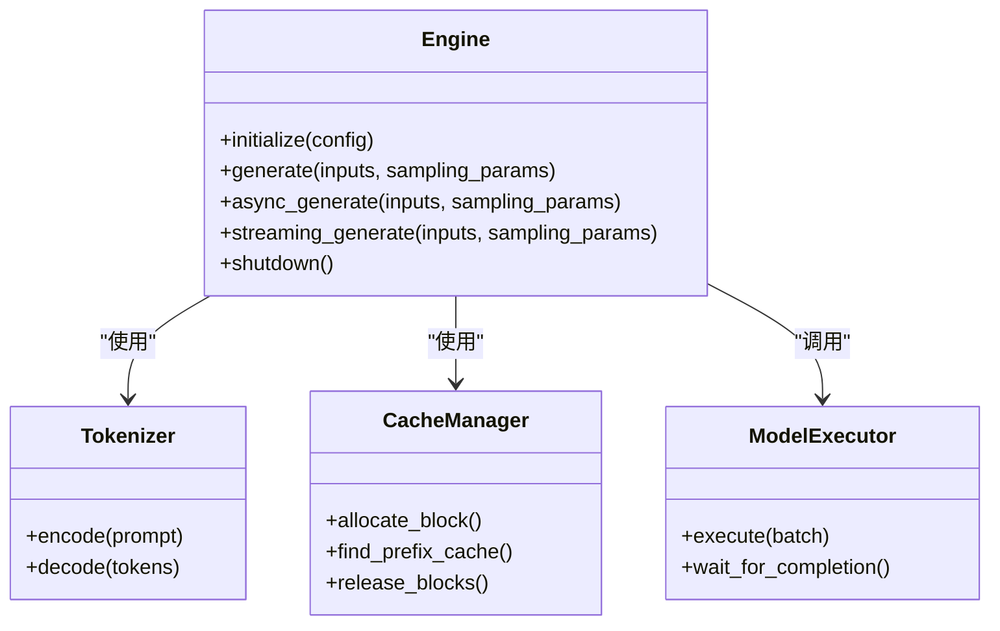
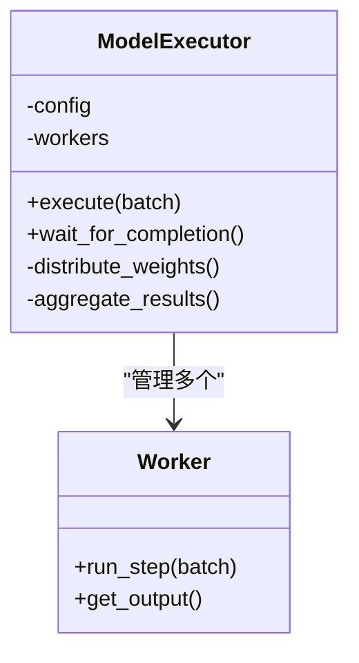
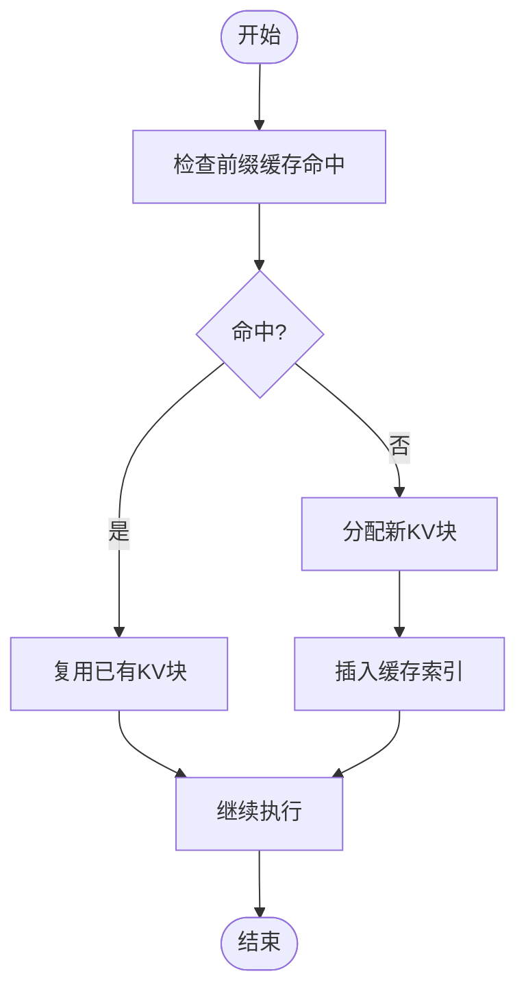
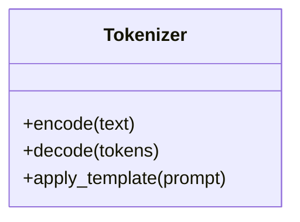
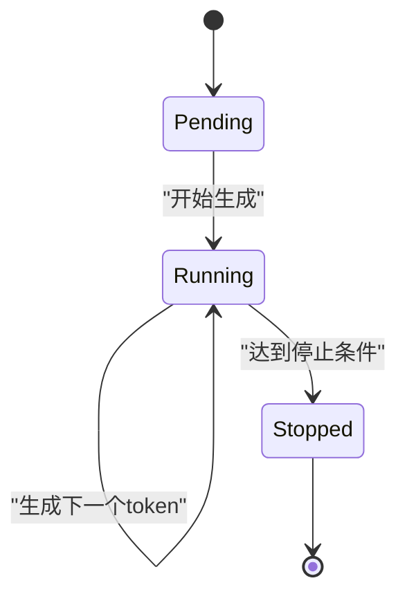
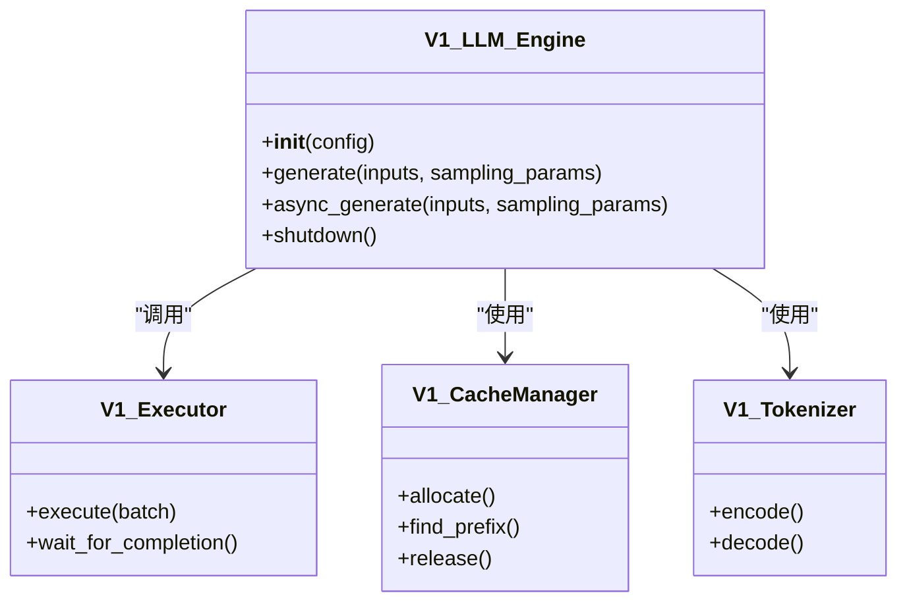
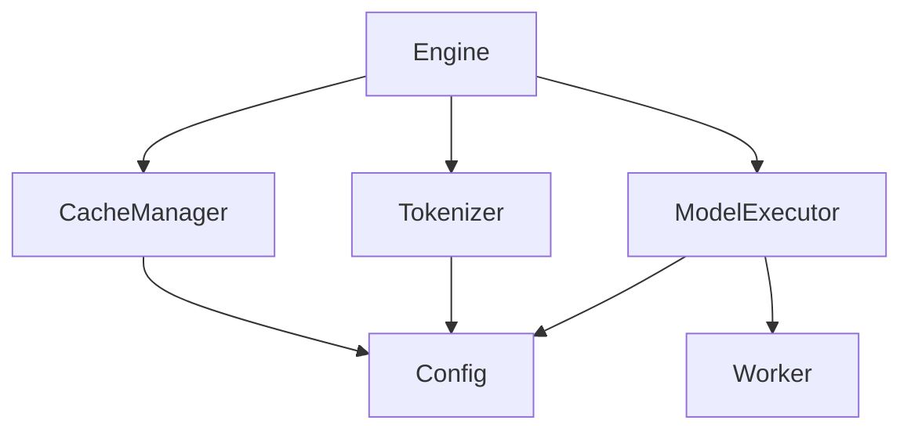

# 组件设计

<cite>
**本文引用的文件**   
- [vllm/engine/core.py](file://vllm/engine/core.py)
- [vllm/model_executor/model_executor.py](file://vllm/model_executor/model_executor.py)
- [vllm/model_executor/parallel_utils/worker/worker.py](file://vllm/model_executor/parallel_utils/worker/worker.py)
- [vllm/model_executor/parallel_utils/worker/worker_base.py](file://vllm/model_executor/parallel_utils/worker/worker_base.py)
- [vllm/cache_manager.py](file://vllm/cache_manager.py)
- [vllm/tokenizer.py](file://vllm/tokenizer.py)
- [vllm/config.py](file://vllm/config.py)
- [vllm/sequence.py](file://vllm/sequence.py)
- [vllm/outputs.py](file://vllm/outputs.py)
- [vllm/sampling_params.py](file://vllm/sampling_params.py)
- [vllm/inputs.py](file://vllm/inputs.py)
- [vllm/v1/engine/core.py](file://vllm/v1/engine/core.py)
- [vllm/v1/engine/llm_engine.py](file://vllm/v1/engine/llm_engine.py)
- [vllm/v1/core.py](file://vllm/v1/core.py)
- [vllm/v1/executor.py](file://vllm/v1/executor.py)
- [vllm/v1/cache_manager.py](file://vllm/v1/cache_manager.py)
- [vllm/v1/tokenizer.py](file://vllm/v1/tokenizer.py)
- [vllm/v1/sequence.py](file://vllm/v1/sequence.py)
- [vllm/v1/outputs.py](file://vllm/v1/outputs.py)
- [vllm/v1/sampling_params.py](file://vllm/v1/sampling_params.py)
- [vllm/v1/inputs.py](file://vllm/v1/inputs.py)
</cite>

## 目录
1. [简介](#简介)
2. [项目结构](#项目结构)
3. [核心组件](#核心组件)
4. [架构总览](#架构总览)
5. [详细组件分析](#详细组件分析)
6. [依赖关系分析](#依赖关系分析)
7. [性能考量](#性能考量)
8. [故障排查指南](#故障排查指南)
9. [结论](#结论)
10. [附录](#附录)

## 简介
本文件面向希望深入理解 vLLM 推理引擎内部设计的开发者，聚焦 Engine、ModelExecutor、CacheManager、Tokenizer 等关键组件的职责边界、接口设计与交互机制。文档涵盖同步与异步调用模式、生命周期管理（初始化到销毁）、配置与参数传递方式，并通过时序图与状态图帮助读者把握运行时行为。同时提供扩展最佳实践与常见陷阱，便于在现有架构上进行二次开发与优化。

## 项目结构
vLLM 的核心代码位于 vllm 包内，按功能分层组织：
- engine 层：对外暴露推理引擎接口，负责请求编排、调度与结果聚合
- model_executor 层：封装模型执行、并行策略与 Worker 通信
- cache_manager 层：KV Cache 的分配、复用与回收
- tokenizer 层：文本分词与反分词
- config 层：统一配置对象与校验
- sequence/outputs/sampling_params/inputs：请求与输出的数据结构定义

图表来源
- [vllm/engine/core.py:1-200](file://vllm/engine/core.py#L1-L200)
- [vllm/model_executor/model_executor.py:1-200](file://vllm/model_executor/model_executor.py#L1-L200)
- [vllm/cache_manager.py:1-200](file://vllm/cache_manager.py#L1-L200)
- [vllm/tokenizer.py:1-200](file://vllm/tokenizer.py#L1-L200)
- [vllm/v1/engine/llm_engine.py:1-200](file://vllm/v1/engine/llm_engine.py#L1-L200)
- [vllm/v1/executor.py:1-200](file://vllm/v1/executor.py#L1-L200)
- [vllm/v1/cache_manager.py:1-200](file://vllm/v1/cache_manager.py#L1-L200)
- [vllm/v1/tokenizer.py:1-200](file://vllm/v1/tokenizer.py#L1-L200)

章节来源
- [vllm/engine/core.py:1-200](file://vllm/engine/core.py#L1-L200)
- [vllm/model_executor/model_executor.py:1-200](file://vllm/model_executor/model_executor.py#L1-L200)
- [vllm/cache_manager.py:1-200](file://vllm/cache_manager.py#L1-L200)
- [vllm/tokenizer.py:1-200](file://vllm/tokenizer.py#L1-L200)
- [vllm/v1/engine/llm_engine.py:1-200](file://vllm/v1/engine/llm_engine.py#L1-L200)
- [vllm/v1/executor.py:1-200](file://vllm/v1/executor.py#L1-L200)
- [vllm/v1/cache_manager.py:1-200](file://vllm/v1/cache_manager.py#L1-L200)
- [vllm/v1/tokenizer.py:1-200](file://vllm/v1/tokenizer.py#L1-L200)

## 核心组件
- Engine：对外统一的推理入口，负责解析输入、构建请求、调度执行、流式返回与资源清理。支持同步与异步两种调用模式。
- ModelExecutor：封装模型加载、权重分发、并行策略（张量/流水线/专家并行）以及 Worker 进程/线程的通信。
- CacheManager：管理 KV Cache 的分块、分配、命中与回收，支持前缀缓存与跨请求复用。
- Tokenizer：负责文本到 token 的编码与解码，支持多模型模板与特殊标记处理。
- Sequence：表示单个请求的完整生命周期状态，包括 token 列表、注意力掩码、采样状态与停止条件。
- Outputs：封装生成结果，包括 token、logprobs、finish_reason 等元数据。
- SamplingParams：控制采样策略（温度、top-k/top-p、惩罚项、最大长度等）。
- Inputs：统一请求输入结构，包含 prompt、图像/音频等多模态信息、采样参数与回调。

章节来源
- [vllm/engine/core.py:1-200](file://vllm/engine/core.py#L1-L200)
- [vllm/model_executor/model_executor.py:1-200](file://vllm/model_executor/model_executor.py#L1-L200)
- [vllm/cache_manager.py:1-200](file://vllm/cache_manager.py#L1-L200)
- [vllm/tokenizer.py:1-200](file://vllm/tokenizer.py#L1-L200)
- [vllm/sequence.py:1-200](file://vllm/sequence.py#L1-L200)
- [vllm/outputs.py:1-200](file://vllm/outputs.py#L1-L200)
- [vllm/sampling_params.py:1-200](file://vllm/sampling_params.py#L1-L200)
- [vllm/inputs.py:1-200](file://vllm/inputs.py#L1-L200)

## 架构总览
下图展示了 vLLM 的典型请求处理流程：Engine 接收输入并构造请求，调用 ModelExecutor 进行批处理与执行；CacheManager 为每个请求分配/复用 KV Cache；Tokenizer 完成文本编解码；最终由 Engine 聚合结果并返回。

图表来源
- [vllm/engine/core.py:1-200](file://vllm/engine/core.py#L1-L200)
- [vllm/model_executor/model_executor.py:1-200](file://vllm/model_executor/model_executor.py#L1-L200)
- [vllm/model_executor/parallel_utils/worker/worker.py:1-200](file://vllm/model_executor/parallel_utils/worker/worker.py#L1-L200)
- [vllm/cache_manager.py:1-200](file://vllm/cache_manager.py#L1-L200)
- [vllm/tokenizer.py:1-200](file://vllm/tokenizer.py#L1-L200)

## 详细组件分析

### Engine（引擎）
职责边界
- 解析输入、构建请求对象、管理请求队列与调度
- 协调 Tokenizer、CacheManager、ModelExecutor 的协作
- 支持同步/异步 API 与流式输出
- 生命周期管理：启动、运行、关闭与资源释放

接口设计要点
- 同步调用：阻塞等待请求完成
- 异步调用：返回 Future/Promise，支持并发与取消
- 流式输出：逐 token 或逐批次返回

生命周期
- 初始化：加载配置、创建 Tokenizer、初始化 CacheManager、启动 ModelExecutor
- 运行：接收请求、调度执行、聚合结果
- 销毁：释放缓存、关闭执行器、清理资源

图表来源
- [vllm/engine/core.py:1-200](file://vllm/engine/core.py#L1-L200)
- [vllm/tokenizer.py:1-200](file://vllm/tokenizer.py#L1-L200)
- [vllm/cache_manager.py:1-200](file://vllm/cache_manager.py#L1-L200)
- [vllm/model_executor/model_executor.py:1-200](file://vllm/model_executor/model_executor.py#L1-L200)

章节来源
- [vllm/engine/core.py:1-200](file://vllm/engine/core.py#L1-L200)

### ModelExecutor（模型执行器）
职责边界
- 管理模型权重与并行策略
- 与 Worker 进程/线程通信，下发执行任务
- 聚合各 Worker 的结果并返回给 Engine

接口设计要点
- execute：接收批处理请求，调度 Worker
- wait_for_completion：同步等待所有 Worker 完成
- 异步模式：通过事件循环或回调通知完成

图表来源
- [vllm/model_executor/model_executor.py:1-200](file://vllm/model_executor/model_executor.py#L1-L200)
- [vllm/model_executor/parallel_utils/worker/worker.py:1-200](file://vllm/model_executor/parallel_utils/worker/worker.py#L1-L200)

章节来源
- [vllm/model_executor/model_executor.py:1-200](file://vllm/model_executor/model_executor.py#L1-L200)
- [vllm/model_executor/parallel_utils/worker/worker.py:1-200](file://vllm/model_executor/parallel_utils/worker/worker.py#L1-L200)

### CacheManager（缓存管理器）
职责边界
- 管理 KV Cache 的分块分配与回收
- 实现前缀缓存（Prefix Caching），跨请求复用相同前缀
- 维护缓存命中率与内存水位线

接口设计要点
- allocate_block：为新请求分配 KV 块
- find_prefix_cache：查找可复用的前缀缓存
- release_blocks：释放不再使用的块

图表来源
- [vllm/cache_manager.py:1-200](file://vllm/cache_manager.py#L1-L200)

章节来源
- [vllm/cache_manager.py:1-200](file://vllm/cache_manager.py#L1-L200)

### Tokenizer（分词器）
职责边界
- 将自然语言文本转换为 token IDs
- 支持多模型模板与特殊标记
- 提供反分词能力，将 token IDs 还原为文本

接口设计要点
- encode：文本到 token IDs
- decode：token IDs 到文本
- 支持批量编码与特殊标记处理

图表来源
- [vllm/tokenizer.py:1-200](file://vllm/tokenizer.py#L1-L200)

章节来源
- [vllm/tokenizer.py:1-200](file://vllm/tokenizer.py#L1-L200)

### Sequence（序列状态）
职责边界
- 表示单个请求的完整状态，包括 token 列表、注意力掩码、采样状态
- 跟踪生成进度与停止条件

接口设计要点
- append_token：追加生成的 token
- is_finished：检查是否满足停止条件
- get_attention_mask：获取注意力掩码

图表来源
- [vllm/sequence.py:1-200](file://vllm/sequence.py#L1-L200)

章节来源
- [vllm/sequence.py:1-200](file://vllm/sequence.py#L1-L200)

### V1 架构组件
V1 版本引入了新的引擎架构，提供更清晰的职责分离和更好的扩展性。

图表来源
- [vllm/v1/engine/llm_engine.py:1-200](file://vllm/v1/engine/llm_engine.py#L1-L200)
- [vllm/v1/executor.py:1-200](file://vllm/v1/executor.py#L1-L200)
- [vllm/v1/cache_manager.py:1-200](file://vllm/v1/cache_manager.py#L1-L200)
- [vllm/v1/tokenizer.py:1-200](file://vllm/v1/tokenizer.py#L1-L200)

章节来源
- [vllm/v1/engine/llm_engine.py:1-200](file://vllm/v1/engine/llm_engine.py#L1-L200)
- [vllm/v1/executor.py:1-200](file://vllm/v1/executor.py#L1-L200)
- [vllm/v1/cache_manager.py:1-200](file://vllm/v1/cache_manager.py#L1-L200)
- [vllm/v1/tokenizer.py:1-200](file://vllm/v1/tokenizer.py#L1-L200)

## 依赖关系分析
组件间的依赖关系如下：
- Engine 依赖 Tokenizer、CacheManager、ModelExecutor
- ModelExecutor 依赖 Worker 进程/线程
- CacheManager 独立管理缓存逻辑
- 所有组件都依赖 Config 进行配置

图表来源
- [vllm/engine/core.py:1-200](file://vllm/engine/core.py#L1-L200)
- [vllm/model_executor/model_executor.py:1-200](file://vllm/model_executor/model_executor.py#L1-L200)
- [vllm/cache_manager.py:1-200](file://vllm/cache_manager.py#L1-L200)
- [vllm/tokenizer.py:1-200](file://vllm/tokenizer.py#L1-L200)
- [vllm/config.py:1-200](file://vllm/config.py#L1-L200)

章节来源
- [vllm/engine/core.py:1-200](file://vllm/engine/core.py#L1-L200)
- [vllm/model_executor/model_executor.py:1-200](file://vllm/model_executor/model_executor.py#L1-L200)
- [vllm/cache_manager.py:1-200](file://vllm/cache_manager.py#L1-L200)
- [vllm/tokenizer.py:1-200](file://vllm/tokenizer.py#L1-L200)
- [vllm/config.py:1-200](file://vllm/config.py#L1-L200)

## 性能考量
- 批处理优化：合理设置 batch size 以平衡吞吐量和延迟
- KV Cache 复用：充分利用前缀缓存减少重复计算
- 内存管理：监控 GPU/CPU 内存使用，避免 OOM
- 异步处理：使用异步 API 提高并发度
- 并行策略：根据硬件选择合适的并行方式（张量/流水线/专家并行）

## 故障排查指南
常见问题及解决方案：
- 内存不足：减小 batch size，启用 KV Cache 压缩
- 生成质量差：调整采样参数（温度、top-k、top-p）
- 性能瓶颈：检查 KV Cache 命中率，优化并行策略
- 死锁问题：确保异步调用正确等待完成
- 配置错误：验证配置文件格式和参数范围

章节来源
- [vllm/config.py:1-200](file://vllm/config.py#L1-L200)
- [vllm/sampling_params.py:1-200](file://vllm/sampling_params.py#L1-L200)

## 结论
vLLM 的组件设计体现了清晰的责任分离和高内聚低耦合原则。Engine 作为统一入口，协调各个组件完成推理任务；ModelExecutor 专注于模型执行和并行；CacheManager 提供高效的缓存管理；Tokenizer 处理文本编解码。通过合理的配置和参数调优，可以实现高性能的 LLM 推理服务。

## 附录
- 配置示例：参考配置文件中的默认参数
- 扩展点：自定义采样策略、缓存策略、并行策略
- 最佳实践：合理使用异步 API，监控系统资源，定期清理缓存