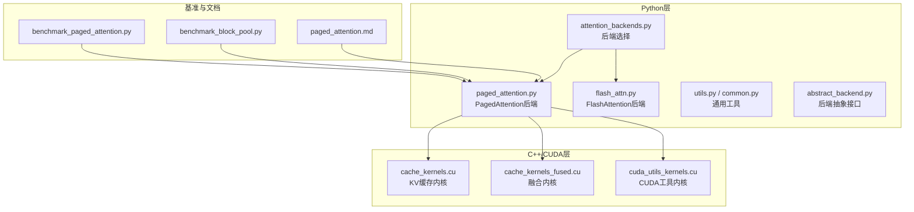
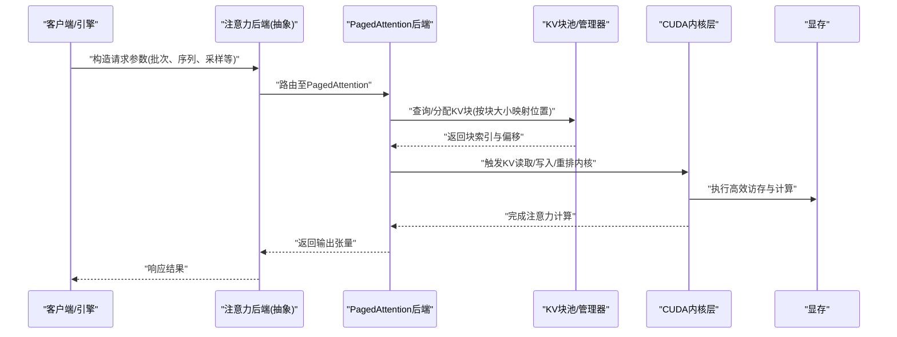
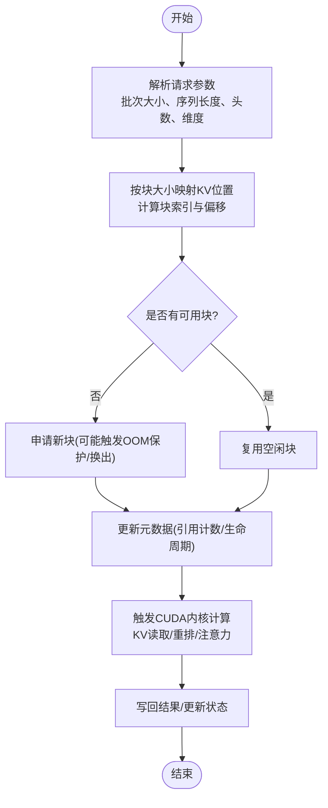
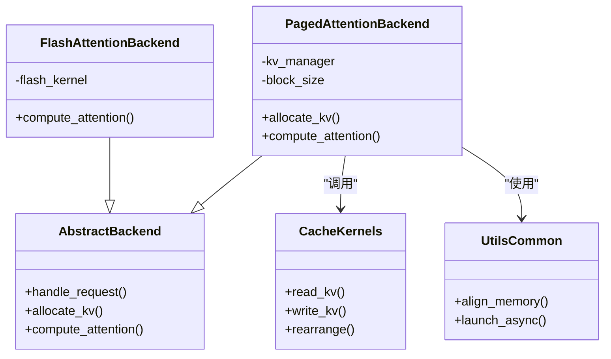

# PagedAttention内存管理

<cite>
**本文引用的文件**   
- [vllm/config/attention_backends.py](file://vllm/config/attention_backends.py)
- [vllm/model_executor/layers/attention/backends/paged_attention.py](file://vllm/model_executor/layers/attention/backends/paged_attention.py)
- [vllm/model_executor/layers/attention/backends/flash_attn.py](file://vllm/model_executor/layers/attention/backends/flash_attn.py)
- [vllm/model_executor/layers/attention/backends/utils.py](file://vllm/model_executor/layers/attention/backends/utils.py)
- [vllm/model_executor/layers/attention/backends/abstract_backend.py](file://vllm/model_executor/layers/attention/backends/abstract_backend.py)
- [vllm/model_executor/layers/attention/backends/common.py](file://vllm/model_executor/layers/attention/backends/common.py)
- [vllm/model_executor/layers/attention/backends/__init__.py](file://vllm/model_executor/layers/attention/backends/__init__.py)
- [benchmarks/kernels/benchmark_paged_attention.py](file://benchmarks/kernels/benchmark_paged_attention.py)
- [benchmarks/benchmark_block_pool.py](file://benchmarks/benchmark_block_pool.py)
- [csrc/cache_kernels.cu](file://csrc/cache_kernels.cu)
- [csrc/cache_kernels_fused.cu](file://csrc/cache_kernels_fused.cu)
- [csrc/cuda_utils_kernels.cu](file://csrc/cuda_utils_kernels.cu)
- [docs/design/paged_attention.md](file://docs/design/paged_attention.md)
- [docs/configuration/engine_args.md](file://docs/configuration/engine_args.md)
- [vllm/config/engine_args.py](file://vllm/config/engine_args.py)
- [vllm/model_executor/layers/attention/backends/fake_attn.py](file://vllm/model_executor/layers/attention/backends/fake_attn.py)
- [tests/kernels/test_cache_kernels.py](file://tests/kernels/test_cache_kernels.py)
</cite>

## 目录
1. [简介](#简介)
2. [项目结构](#项目结构)
3. [核心组件](#核心组件)
4. [架构总览](#架构总览)
5. [详细组件分析](#详细组件分析)
6. [依赖关系分析](#依赖关系分析)
7. [性能考量](#性能考量)
8. [故障排查指南](#故障排查指南)
9. [结论](#结论)
10. [附录](#附录)

## 简介
本技术文档围绕PagedAttention的内存管理机制展开，系统阐述KV缓存的分页化管理、块分配策略与内存复用算法，对比传统注意力机制在显存占用与数据局部性方面的优化效果。同时覆盖CUDA内核优化、内存对齐与异步操作等实现细节，并提供关键配置参数（如块大小、最大序列长度）的调优方法与基准测试参考，帮助读者在实际部署中取得更优的内存与吞吐表现。

## 项目结构
vLLM将注意力后端抽象为可插拔模块，PagedAttention作为默认且核心的后端之一，位于模型执行层的注意力后端目录中；其CUDA内核与缓存操作分布在csrc目录；基准测试与文档分别在benchmarks与docs目录中。

图表来源
- [vllm/model_executor/layers/attention/backends/paged_attention.py](file://vllm/model_executor/layers/attention/backends/paged_attention.py)
- [csrc/cache_kernels.cu](file://csrc/cache_kernels.cu)
- [csrc/cache_kernels_fused.cu](file://csrc/cache_kernels_fused.cu)
- [csrc/cuda_utils_kernels.cu](file://csrc/cuda_utils_kernels.cu)
- [benchmarks/kernels/benchmark_paged_attention.py](file://benchmarks/kernels/benchmark_paged_attention.py)
- [benchmarks/benchmark_block_pool.py](file://benchmarks/benchmark_block_pool.py)
- [docs/design/paged_attention.md](file://docs/design/paged_attention.md)

章节来源
- [vllm/config/attention_backends.py](file://vllm/config/attention_backends.py)
- [vllm/model_executor/layers/attention/backends/paged_attention.py](file://vllm/model_executor/layers/attention/backends/paged_attention.py)
- [csrc/cache_kernels.cu](file://csrc/cache_kernels.cu)
- [csrc/cache_kernels_fused.cu](file://csrc/cache_kernels_fused.cu)
- [csrc/cuda_utils_kernels.cu](file://csrc/cuda_utils_kernels.cu)
- [benchmarks/kernels/benchmark_paged_attention.py](file://benchmarks/kernels/benchmark_paged_attention.py)
- [benchmarks/benchmark_block_pool.py](file://benchmarks/benchmark_block_pool.py)
- [docs/design/paged_attention.md](file://docs/design/paged_attention.md)

## 核心组件
- 注意力后端抽象：定义统一的请求处理、KV缓存管理与调度接口，便于不同后端（PagedAttention、FlashAttention等）替换与扩展。
- PagedAttention后端：基于分页式KV缓存，将长序列切分为固定大小的块，按需分配与复用，显著降低碎片化与峰值显存。
- CUDA内核层：提供高效的KV缓存读写、合并与重排操作，支持内存对齐与异步流，最大化GPU带宽利用率。
- 基准与工具：针对PagedAttention与块池的端到端与微基准，用于评估吞吐、延迟与显存使用。

章节来源
- [vllm/model_executor/layers/attention/backends/abstract_backend.py](file://vllm/model_executor/layers/attention/backends/abstract_backend.py)
- [vllm/model_executor/layers/attention/backends/paged_attention.py](file://vllm/model_executor/layers/attention/backends/paged_attention.py)
- [csrc/cache_kernels.cu](file://csrc/cache_kernels.cu)
- [csrc/cache_kernels_fused.cu](file://csrc/cache_kernels_fused.cu)
- [csrc/cuda_utils_kernels.cu](file://csrc/cuda_utils_kernels.cu)

## 架构总览
下图展示从上层调用到PagedAttention后端的整体流程，包括请求解析、KV块分配、注意力计算与结果回写。

图表来源
- [vllm/model_executor/layers/attention/backends/paged_attention.py](file://vllm/model_executor/layers/attention/backends/paged_attention.py)
- [csrc/cache_kernels.cu](file://csrc/cache_kernels.cu)
- [csrc/cache_kernels_fused.cu](file://csrc/cache_kernels_fused.cu)

## 详细组件分析

### PagedAttention后端与KV分页管理
- 分页机制：将每个请求的KV缓存划分为固定大小的块，块内连续存储，块间通过索引表链接，避免动态扩容带来的碎片与拷贝开销。
- 块分配策略：采用空闲块链表或位图管理，优先复用最近释放的块，减少分配失败与碎片；支持批量分配与预取，提升吞吐。
- 内存复用算法：结合引用计数与生命周期跟踪，在请求结束或上下文切换时回收块；对共享前缀进行跨请求复用，提高多轮对话效率。
- 与传统注意力对比：传统方法通常以连续张量存储KV，长序列导致峰值显存高且易碎片化；PagedAttention通过分页与复用，降低峰值并改善数据局部性。

图表来源
- [vllm/model_executor/layers/attention/backends/paged_attention.py](file://vllm/model_executor/layers/attention/backends/paged_attention.py)
- [csrc/cache_kernels.cu](file://csrc/cache_kernels.cu)

章节来源
- [vllm/model_executor/layers/attention/backends/paged_attention.py](file://vllm/model_executor/layers/attention/backends/paged_attention.py)
- [docs/design/paged_attention.md](file://docs/design/paged_attention.md)

### CUDA内核优化与内存对齐
- 内存对齐：KV块按固定字节对齐，确保向量化加载与GEMM友好布局，减少未对齐访问惩罚。
- 异步操作：通过CUDA Stream与事件，将KV读写、重排与注意力计算流水线化，隐藏访存延迟。
- 融合内核：将多个小操作（如归一化、RoPE、掩码）融合进单一内核，减少核启动与中间缓冲开销。
- 工具内核：提供通用的张量变换、广播与规约操作，支撑注意力计算的各个阶段。

章节来源
- [csrc/cache_kernels.cu](file://csrc/cache_kernels.cu)
- [csrc/cache_kernels_fused.cu](file://csrc/cache_kernels_fused.cu)
- [csrc/cuda_utils_kernels.cu](file://csrc/cuda_utils_kernels.cu)

### 配置参数与调优方法
- 块大小（block_size）：影响KV块粒度与访存局部性；过小增加索引开销，过大浪费空间；需结合模型头数与维度权衡。
- 最大序列长度（max_seq_len）：决定单请求最大KV长度；与块大小共同决定块数量上限。
- 最大批大小（max_batch_size）：控制并发请求数；与显存容量和块分配策略相关。
- KV缓存总量（num_blocks）：限制总块数，防止OOM；可通过监控指标动态调整。
- 其他：是否启用前缀缓存、是否使用融合内核、流并行度等。

章节来源
- [docs/configuration/engine_args.md](file://docs/configuration/engine_args.md)
- [vllm/config/engine_args.py](file://vllm/config/engine_args.py)

### 基准测试与内存使用案例
- 端到端基准：通过benchmark_paged_attention.py评估不同批次、序列长度下的吞吐与延迟，观察PagedAttention相比非分页方案的显存峰值下降。
- 块池基准：benchmark_block_pool.py聚焦块分配/回收的性能，验证复用策略的有效性。
- 实际部署：在多轮对话与长上下文场景中，前缀缓存与块复用显著降低重复计算与显存占用；建议根据工作负载特征调节块大小与缓存总量。

章节来源
- [benchmarks/kernels/benchmark_paged_attention.py](file://benchmarks/kernels/benchmark_paged_attention.py)
- [benchmarks/benchmark_block_pool.py](file://benchmarks/benchmark_block_pool.py)
- [docs/design/paged_attention.md](file://docs/design/paged_attention.md)

## 依赖关系分析
PagedAttention后端依赖抽象接口、通用工具与CUDA内核；注意力后端选择器根据运行时条件选择合适的后端实现。

图表来源
- [vllm/model_executor/layers/attention/backends/abstract_backend.py](file://vllm/model_executor/layers/attention/backends/abstract_backend.py)
- [vllm/model_executor/layers/attention/backends/paged_attention.py](file://vllm/model_executor/layers/attention/backends/paged_attention.py)
- [vllm/model_executor/layers/attention/backends/flash_attn.py](file://vllm/model_executor/layers/attention/backends/flash_attn.py)
- [csrc/cache_kernels.cu](file://csrc/cache_kernels.cu)
- [csrc/cuda_utils_kernels.cu](file://csrc/cuda_utils_kernels.cu)

章节来源
- [vllm/model_executor/layers/attention/backends/abstract_backend.py](file://vllm/model_executor/layers/attention/backends/abstract_backend.py)
- [vllm/model_executor/layers/attention/backends/paged_attention.py](file://vllm/model_executor/layers/attention/backends/paged_attention.py)
- [vllm/model_executor/layers/attention/backends/flash_attn.py](file://vllm/model_executor/layers/attention/backends/flash_attn.py)
- [csrc/cache_kernels.cu](file://csrc/cache_kernels.cu)
- [csrc/cuda_utils_kernels.cu](file://csrc/cuda_utils_kernels.cu)

## 性能考量
- 显存峰值降低：分页与复用减少连续大张量分配，避免碎片化导致的额外预留。
- 数据局部性提升：块内连续存储与对齐布局提高缓存命中率与带宽利用率。
- 吞吐与延迟平衡：合理设置块大小与批大小，使内核融合与异步流水发挥最大效能。
- 前缀缓存收益：多轮对话场景下，共享前缀的KV块跨请求复用，显著减少重复计算与显存占用。

[本节为通用指导，不直接分析具体文件]

## 故障排查指南
- OOM问题：检查num_blocks与max_seq_len是否过小；监控块分配失败率；适当增大缓存总量或降低批大小。
- 性能退化：确认块大小与模型头数/维度匹配；检查是否启用了融合内核；验证CUDA流并行度设置。
- 正确性校验：使用单元测试与内核测试用例验证KV读写与重排逻辑；关注边界条件（短序列、零填充）。
- 日志与指标：开启详细日志，追踪块分配/回收路径；采集显存峰值、吞吐与延迟指标定位瓶颈。

章节来源
- [tests/kernels/test_cache_kernels.py](file://tests/kernels/test_cache_kernels.py)
- [docs/design/paged_attention.md](file://docs/design/paged_attention.md)

## 结论
PagedAttention通过KV缓存的分页化管理、块分配与复用算法，以及CUDA内核层面的对齐与融合优化，显著降低了显存峰值并提升了数据局部性与吞吐。在实际部署中，结合工作负载特征调优块大小、缓存总量与批大小，可进一步获得更优的内存与性能表现。

[本节为总结性内容，不直接分析具体文件]

## 附录
- 快速上手：参考设计文档了解PagedAttention的核心思想与最佳实践。
- 基准脚本：运行端到端与块池基准，评估不同配置下的性能与显存占用。
- 配置参考：查阅引擎参数文档，获取关键参数的默认值与推荐范围。

章节来源
- [docs/design/paged_attention.md](file://docs/design/paged_attention.md)
- [benchmarks/kernels/benchmark_paged_attention.py](file://benchmarks/kernels/benchmark_paged_attention.py)
- [benchmarks/benchmark_block_pool.py](file://benchmarks/benchmark_block_pool.py)
- [docs/configuration/engine_args.md](file://docs/configuration/engine_args.md)