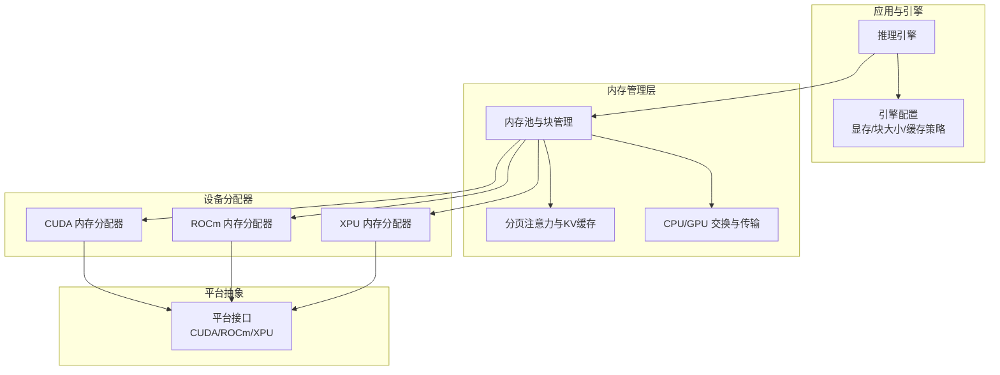
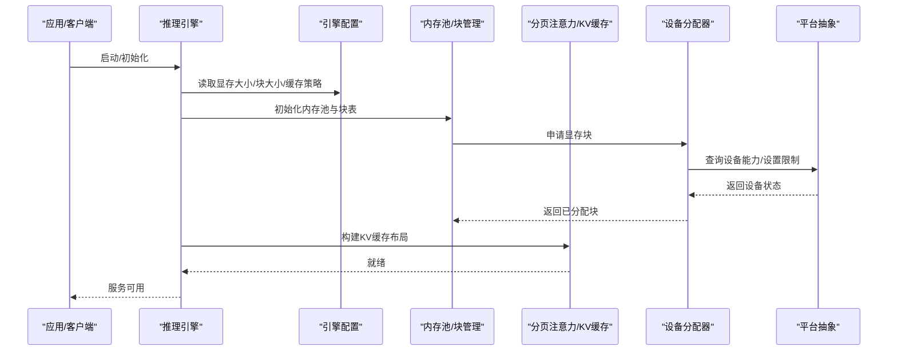
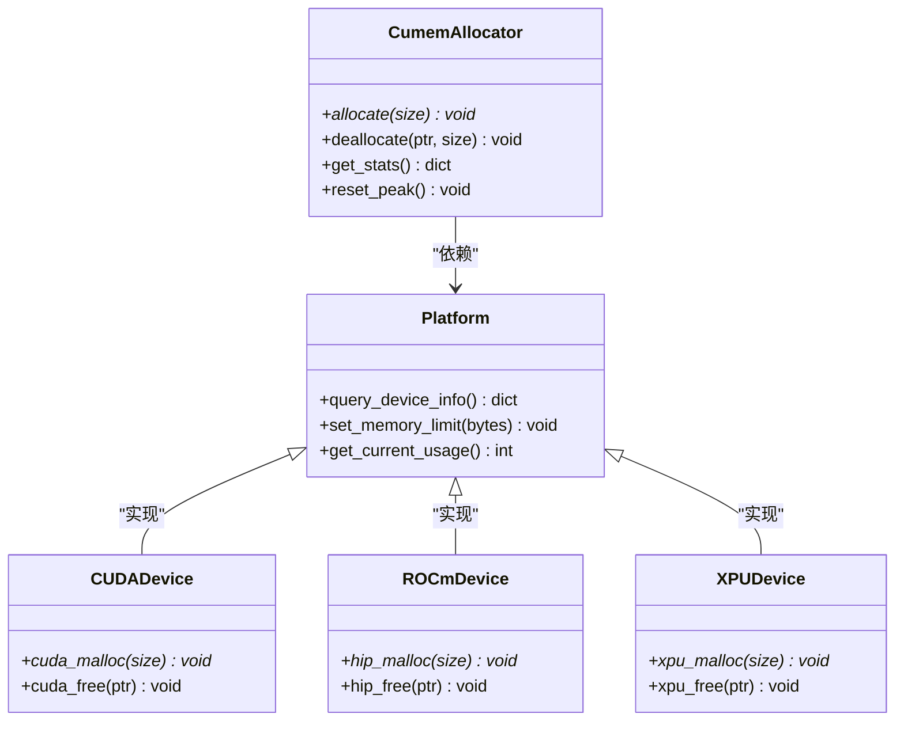
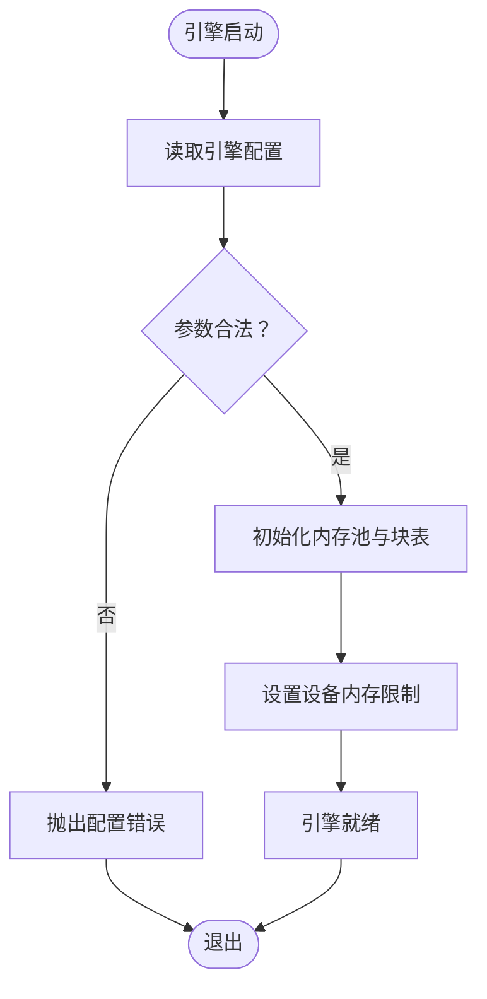
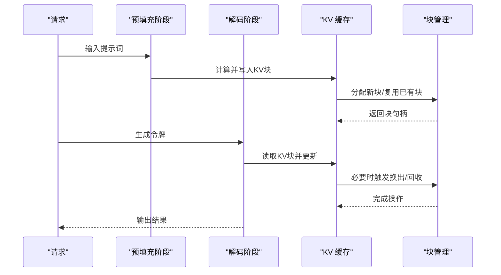
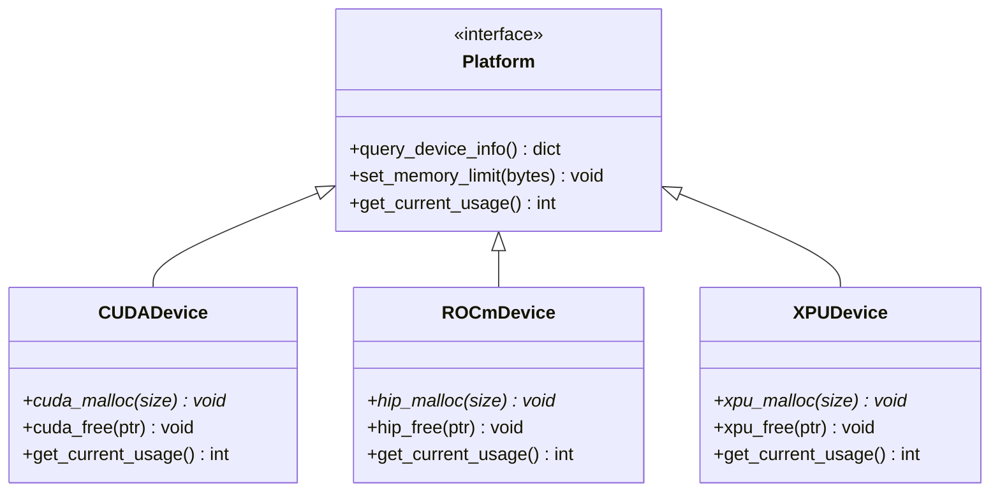
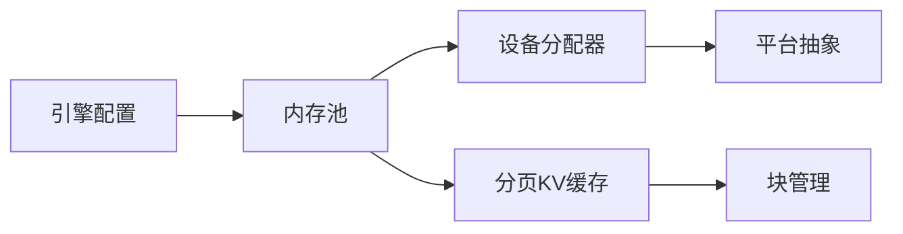

# 内存优化

<cite>
**本文引用的文件**   
- [vllm/config/engine_args.py](file://vllm/config/engine_args.py)
- [vllm/device_allocator/cumem_allocator.py](file://vllm/device_allocator/cumem_allocator.py)
- [csrc/cumem_allocator.cpp](file://csrc/cumem_allocator.cpp)
- [vllm/model_executor/parallel_utils/attention/utils.py](file://vllm/model_executor/parallel_utils/attention/utils.py)
- [vllm/platforms/__init__.py](file://vllm/platforms/__init__.py)
- [vllm/platforms/cuda.py](file://vllm/platforms/cuda.py)
- [vllm/platforms/rocm.py](file://vllm/platforms/rocm.py)
- [vllm/platforms/xpu.py](file://vllm/platforms/xpu.py)
- [benchmarks/benchmark_block_pool.py](file://benchmarks/benchmark_block_pool.py)
- [tests/basic_correctness/test_mem.py](file://tests/basic_correctness/test_mem.py)
- [docs/configuration/conserving_memory.md](file://docs/configuration/conserving_memory.md)
- [docs/design/paged_attention.md](file://docs/design/paged_attention.md)
- [docs/design/hybrid_kv_cache_manager.md](file://docs/design/hybrid_kv_cache_manager.md)
- [docs/design/prefix_caching.md](file://docs/design/prefix_caching.md)
- [docs/usage/troubleshooting.md](file://docs/usage/troubleshooting.md)
</cite>

## 目录
1. [引言](#引言)
2. [项目结构](#项目结构)
3. [核心组件](#核心组件)
4. [架构总览](#架构总览)
5. [详细组件分析](#详细组件分析)
6. [依赖关系分析](#依赖关系分析)
7. [性能考量](#性能考量)
8. [故障排查指南](#故障排查指南)
9. [结论](#结论)
10. [附录](#附录)

## 引言
本技术文档聚焦 vLLM 的内存优化系统，围绕以下目标展开：
- 内存池管理机制：预分配策略、碎片整理与垃圾回收优化
- GPU 内存优化：内存分页、交换策略与 CPU-GPU 数据传输优化
- 内存监控与分析：使用统计、泄漏检测与性能分析
- 多平台差异：CUDA、ROCm、XPU 等平台的特定优化
- 配置调优：显存大小、交换阈值与内存限制
- 问题诊断：常见内存问题的定位方法与解决方案

## 项目结构
vLLM 的内存相关能力分布在多个层次：
- 设备分配器层：封装底层 CUDA/ROCm/XPU 的内存分配与释放
- 引擎配置层：暴露显存大小、块大小、缓存策略等关键参数
- KV 缓存与分页注意力：基于分页注意力实现的高效 KV 缓存管理
- 平台抽象层：统一不同硬件平台的内存行为与特性
- 基准与测试：覆盖块池、内存压力、跨平台一致性等场景

图表来源
- [vllm/config/engine_args.py](file://vllm/config/engine_args.py)
- [vllm/device_allocator/cumem_allocator.py](file://vllm/device_allocator/cumem_allocator.py)
- [csrc/cumem_allocator.cpp](file://csrc/cumem_allocator.cpp)
- [vllm/platforms/__init__.py](file://vllm/platforms/__init__.py)
- [vllm/platforms/cuda.py](file://vllm/platforms/cuda.py)
- [vllm/platforms/rocm.py](file://vllm/platforms/rocm.py)
- [vllm/platforms/xpu.py](file://vllm/platforms/xpu.py)

章节来源
- [vllm/config/engine_args.py](file://vllm/config/engine_args.py)
- [vllm/device_allocator/cumem_allocator.py](file://vllm/device_allocator/cumem_allocator.py)
- [csrc/cumem_allocator.cpp](file://csrc/cumem_allocator.cpp)
- [vllm/platforms/__init__.py](file://vllm/platforms/__init__.py)
- [vllm/platforms/cuda.py](file://vllm/platforms/cuda.py)
- [vllm/platforms/rocm.py](file://vllm/platforms/rocm.py)
- [vllm/platforms/xpu.py](file://vllm/platforms/xpu.py)

## 核心组件
- 设备内存分配器（CumemAllocator）
  - 负责底层显存的分配、释放与统计，支持异步与同步路径
  - 提供可插拔的分配策略，便于在不同平台上适配
- 引擎配置（EngineArgs）
  - 暴露显存大小、块大小、KV 缓存策略、前缀缓存开关等关键参数
  - 为上层调度与内存池初始化提供依据
- 分页注意力与 KV 缓存
  - 通过分页注意力将 KV 张量切分为固定大小的块，降低碎片并提升复用率
  - 结合前缀缓存与混合缓存管理器，实现跨请求共享与按需加载
- 平台抽象（Platforms）
  - 统一 CUDA、ROCm、XPU 等平台的行为差异，屏蔽底层细节
  - 提供设备信息查询、内存限制设置、流管理等能力

章节来源
- [vllm/device_allocator/cumem_allocator.py](file://vllm/device_allocator/cumem_allocator.py)
- [csrc/cumem_allocator.cpp](file://csrc/cumem_allocator.cpp)
- [vllm/config/engine_args.py](file://vllm/config/engine_args.py)
- [docs/design/paged_attention.md](file://docs/design/paged_attention.md)
- [docs/design/hybrid_kv_cache_manager.md](file://docs/design/hybrid_kv_cache_manager.md)
- [docs/design/prefix_caching.md](file://docs/design/prefix_caching.md)
- [vllm/platforms/__init__.py](file://vllm/platforms/__init__.py)
- [vllm/platforms/cuda.py](file://vllm/platforms/cuda.py)
- [vllm/platforms/rocm.py](file://vllm/platforms/rocm.py)
- [vllm/platforms/xpu.py](file://vllm/platforms/xpu.py)

## 架构总览
下图展示了从引擎到设备分配器的调用链路与数据流向，涵盖配置、分配、KV 缓存与平台适配。

图表来源
- [vllm/config/engine_args.py](file://vllm/config/engine_args.py)
- [vllm/device_allocator/cumem_allocator.py](file://vllm/device_allocator/cumem_allocator.py)
- [csrc/cumem_allocator.cpp](file://csrc/cumem_allocator.cpp)
- [vllm/platforms/__init__.py](file://vllm/platforms/__init__.py)
- [vllm/platforms/cuda.py](file://vllm/platforms/cuda.py)
- [vllm/platforms/rocm.py](file://vllm/platforms/rocm.py)
- [vllm/platforms/xpu.py](file://vllm/platforms/xpu.py)

## 详细组件分析

### 设备内存分配器（CumemAllocator）
- 职责
  - 封装底层显存分配与释放，提供统一的分配接口
  - 维护分配统计，支持峰值、当前使用量与失败计数
  - 在 CUDA/ROCm/XPU 上通过平台抽象进行差异化处理
- 关键点
  - 分配策略：优先使用空闲块，必要时触发底层分配
  - 错误处理：捕获 OOM 并上报，便于上层做降级或重试
  - 性能优化：减少频繁的小对象分配，合并大块分配

图表来源
- [vllm/device_allocator/cumem_allocator.py](file://vllm/device_allocator/cumem_allocator.py)
- [csrc/cumem_allocator.cpp](file://csrc/cumem_allocator.cpp)
- [vllm/platforms/__init__.py](file://vllm/platforms/__init__.py)
- [vllm/platforms/cuda.py](file://vllm/platforms/cuda.py)
- [vllm/platforms/rocm.py](file://vllm/platforms/rocm.py)
- [vllm/platforms/xpu.py](file://vllm/platforms/xpu.py)

章节来源
- [vllm/device_allocator/cumem_allocator.py](file://vllm/device_allocator/cumem_allocator.py)
- [csrc/cumem_allocator.cpp](file://csrc/cumem_allocator.cpp)
- [vllm/platforms/__init__.py](file://vllm/platforms/__init__.py)
- [vllm/platforms/cuda.py](file://vllm/platforms/cuda.py)
- [vllm/platforms/rocm.py](file://vllm/platforms/rocm.py)
- [vllm/platforms/xpu.py](file://vllm/platforms/xpu.py)

### 引擎配置（EngineArgs）
- 职责
  - 定义显存大小、块大小、KV 缓存策略、前缀缓存开关等关键参数
  - 为内存池初始化与调度策略提供输入
- 关键点
  - 显存大小：影响最大并发与序列长度上限
  - 块大小：决定 KV 缓存粒度与碎片程度
  - 缓存策略：控制是否启用前缀缓存与混合缓存

图表来源
- [vllm/config/engine_args.py](file://vllm/config/engine_args.py)

章节来源
- [vllm/config/engine_args.py](file://vllm/config/engine_args.py)

### 分页注意力与 KV 缓存
- 职责
  - 将 KV 张量切分为固定大小的块，避免动态分配导致的碎片
  - 通过块表映射逻辑位置到物理块，支持高效拼接与重用
- 关键点
  - 块大小选择：平衡命中率与内存占用
  - 块复用：跨请求共享公共前缀，减少重复计算与存储
  - 换出策略：当显存紧张时，将冷块换出至 CPU/磁盘

图表来源
- [docs/design/paged_attention.md](file://docs/design/paged_attention.md)
- [docs/design/hybrid_kv_cache_manager.md](file://docs/design/hybrid_kv_cache_manager.md)
- [docs/design/prefix_caching.md](file://docs/design/prefix_caching.md)

章节来源
- [docs/design/paged_attention.md](file://docs/design/paged_attention.md)
- [docs/design/hybrid_kv_cache_manager.md](file://docs/design/hybrid_kv_cache_manager.md)
- [docs/design/prefix_caching.md](file://docs/design/prefix_caching.md)

### 平台抽象（CUDA/ROCm/XPU）
- 职责
  - 统一不同硬件平台的内存管理与设备信息查询
  - 提供设备限制设置、当前使用量查询等能力
- 关键点
  - CUDA：利用 cuMem 与 PyTorch 后端进行分配与统计
  - ROCm：适配 HIP 与 AMD 设备特性
  - XPU：适配 Intel XPU 设备的内存模型

图表来源
- [vllm/platforms/__init__.py](file://vllm/platforms/__init__.py)
- [vllm/platforms/cuda.py](file://vllm/platforms/cuda.py)
- [vllm/platforms/rocm.py](file://vllm/platforms/rocm.py)
- [vllm/platforms/xpu.py](file://vllm/platforms/xpu.py)

章节来源
- [vllm/platforms/__init__.py](file://vllm/platforms/__init__.py)
- [vllm/platforms/cuda.py](file://vllm/platforms/cuda.py)
- [vllm/platforms/rocm.py](file://vllm/platforms/rocm.py)
- [vllm/platforms/xpu.py](file://vllm/platforms/xpu.py)

## 依赖关系分析
- 模块耦合
  - 引擎配置驱动内存池初始化，强依赖 EngineArgs
  - 内存池依赖设备分配器，间接依赖平台抽象
  - 分页注意力与 KV 缓存依赖块管理，受块大小与缓存策略影响
- 外部依赖
  - CUDA/ROCm/XPU 运行时库
  - PyTorch 后端（用于统计与部分分配）

图表来源
- [vllm/config/engine_args.py](file://vllm/config/engine_args.py)
- [vllm/device_allocator/cumem_allocator.py](file://vllm/device_allocator/cumem_allocator.py)
- [csrc/cumem_allocator.cpp](file://csrc/cumem_allocator.cpp)
- [vllm/platforms/__init__.py](file://vllm/platforms/__init__.py)

章节来源
- [vllm/config/engine_args.py](file://vllm/config/engine_args.py)
- [vllm/device_allocator/cumem_allocator.py](file://vllm/device_allocator/cumem_allocator.py)
- [csrc/cumem_allocator.cpp](file://csrc/cumem_allocator.cpp)
- [vllm/platforms/__init__.py](file://vllm/platforms/__init__.py)

## 性能考量
- 预分配与块大小
  - 合理设置块大小可减少碎片并提高命中率
  - 过小的块导致元数据开销增大，过大则浪费内存
- 交换与换出
  - 在显存紧张时，将冷块换出至 CPU/磁盘可降低 OOM 风险
  - 需权衡 IO 延迟与吞吐，避免频繁换入换出
- 平台差异
  - CUDA 下可利用 cuMemAsync 与事件机制提升效率
  - ROCm 下注意 HIP 内存模型与对齐要求
  - XPU 下关注设备内存限制与带宽特性
- 监控与统计
  - 定期采集显存使用峰值与分配失败次数
  - 结合日志与指标定位热点与瓶颈

[本节为通用指导，不直接分析具体文件]

## 故障排查指南
- 常见问题
  - OOM：检查显存大小、块大小与并发度；查看分配失败统计
  - 碎片化：调整块大小与换出策略；观察块复用率
  - 平台兼容：确认平台抽象是否正确初始化；检查设备限制设置
- 诊断步骤
  - 启用详细日志，记录分配/释放与换出事件
  - 使用基准工具评估块池性能与稳定性
  - 运行内存相关测试用例验证行为一致性
- 参考资源
  - 内存节省配置说明
  - 分页注意力设计文档
  - 故障排查指南

章节来源
- [docs/configuration/conserving_memory.md](file://docs/configuration/conserving_memory.md)
- [docs/design/paged_attention.md](file://docs/design/paged_attention.md)
- [docs/usage/troubleshooting.md](file://docs/usage/troubleshooting.md)
- [benchmarks/benchmark_block_pool.py](file://benchmarks/benchmark_block_pool.py)
- [tests/basic_correctness/test_mem.py](file://tests/basic_correctness/test_mem.py)

## 结论
vLLM 的内存优化系统通过分层设计与平台抽象，实现了高效的显存管理与灵活的缓存策略。合理的配置与监控是保障稳定性的关键。在多平台环境下，应关注设备特性与限制，结合基准与测试持续优化。

[本节为总结性内容，不直接分析具体文件]

## 附录
- 配置建议
  - 显存大小：根据模型规模与并发需求设定
  - 块大小：在命中率与内存占用间折中
  - 交换阈值：根据负载特征调整换出时机
- 监控指标
  - 显存使用峰值、分配失败次数、块复用率、换出频率
- 最佳实践
  - 预热阶段充分分配以减少抖动
  - 批量请求时尽量复用公共前缀
  - 定期清理未引用块与缓存

[本节为补充信息，不直接分析具体文件]