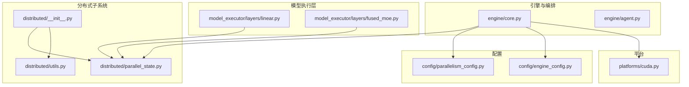
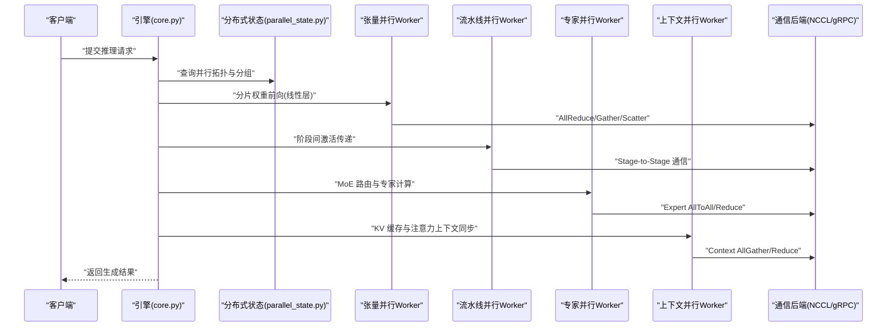
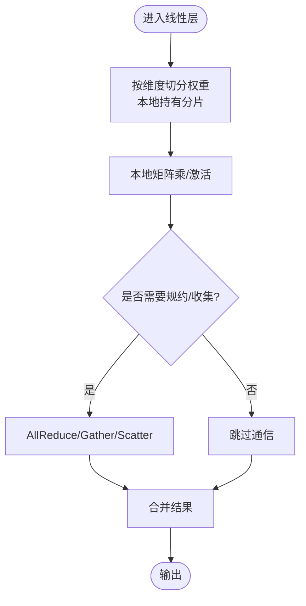
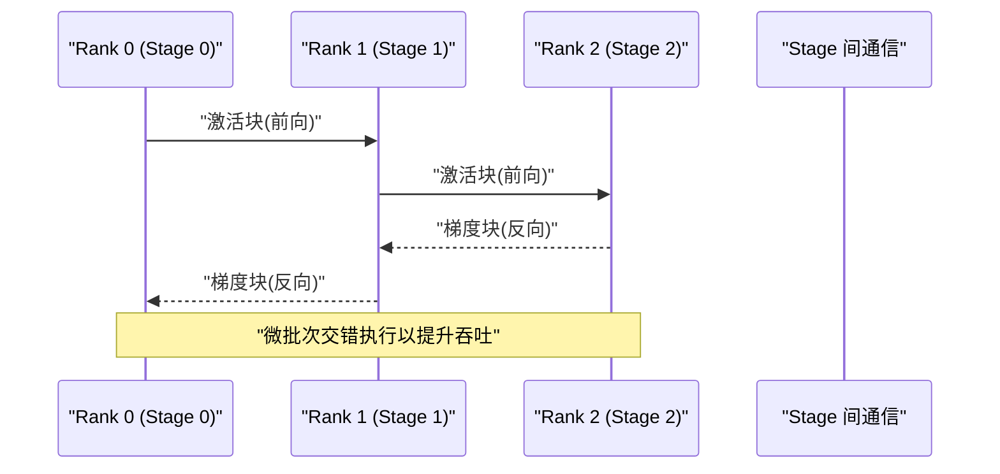
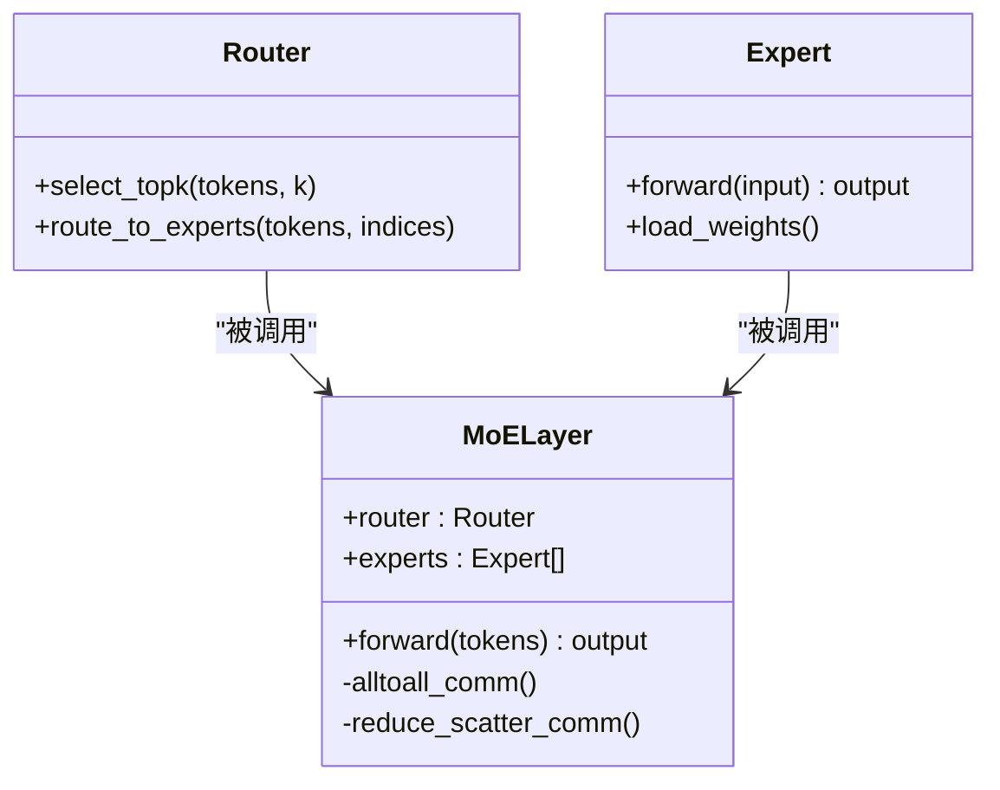
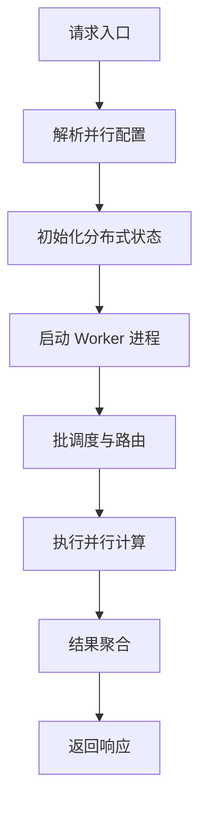
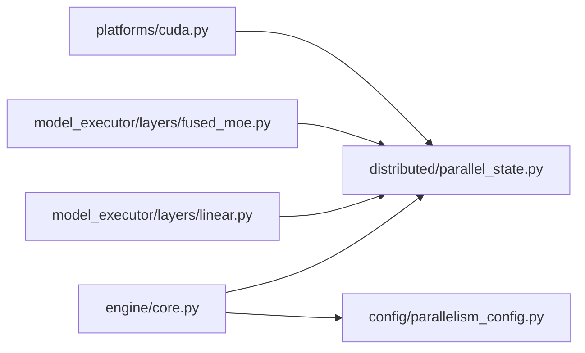

# 分布式推理

<cite>
**本文引用的文件**   
- [vllm/distributed/__init__.py](file://vllm/distributed/__init__.py)
- [vllm/distributed/parallel_state.py](file://vllm/distributed/parallel_state.py)
- [vllm/distributed/utils.py](file://vllm/distributed/utils.py)
- [vllm/model_executor/layers/linear.py](file://vllm/model_executor/layers/linear.py)
- [vllm/model_executor/layers/fused_moe.py](file://vllm/model_executor/layers/fused_moe.py)
- [vllm/engine/core.py](file://vllm/engine/core.py)
- [vllm/engine/agent.py](file://vllm/engine/agent.py)
- [vllm/config/parallelism_config.py](file://vllm/config/parallelism_config.py)
- [vllm/config/engine_config.py](file://vllm/config/engine_config.py)
- [vllm/platforms/cuda.py](file://vllm/platforms/cuda.py)
- [benchmarks/benchmark_serving.py](file://benchmarks/benchmark_serving.py)
- [examples/ray_serving/multi-node-serving.sh](file://examples/ray_serving/multi-node-serving.sh)
- [tests/distributed/test_pipeline_parallel.py](file://tests/distributed/test_pipeline_parallel.py)
- [tests/distributed/test_expert_parallel.py](file://tests/distributed/test_expert_parallel.py)
- [tests/distributed/test_context_parallel.py](file://tests/distributed/test_context_parallel.py)
</cite>

## 目录
1. [简介](#简介)
2. [项目结构](#项目结构)
3. [核心组件](#核心组件)
4. [架构总览](#架构总览)
5. [详细组件分析](#详细组件分析)
6. [依赖关系分析](#依赖关系分析)
7. [性能考虑](#性能考虑)
8. [故障排查指南](#故障排查指南)
9. [结论](#结论)
10. [附录](#附录)

## 简介
本技术文档聚焦 vLLM 的分布式推理能力，系统阐述张量并行、流水线并行与专家并行的实现原理与工程实践。内容涵盖模型分片策略、通信模式与同步机制、阶段划分与数据流、负载均衡、通信后端选择（NCCL/gRPC 等）、多 GPU/多节点部署配置（网络拓扑、资源分配、故障恢复），以及性能调优建议与监控指标。读者可据此在单节点或多节点环境中高效部署与优化 vLLM 推理服务。

## 项目结构
vLLM 的分布式推理相关代码主要分布在以下模块：
- 分布式状态与通信抽象：vllm/distributed/*
- 模型层与 MoE 实现：vllm/model_executor/layers/*
- 引擎编排与进程管理：vllm/engine/*
- 并行配置与引擎配置：vllm/config/*
- 平台与设备抽象：vllm/platforms/*
- 基准测试与示例：benchmarks/*, examples/*
- 分布式测试用例：tests/distributed/*

图表来源 
- [vllm/distributed/__init__.py](file://vllm/distributed/__init__.py)
- [vllm/distributed/parallel_state.py](file://vllm/distributed/parallel_state.py)
- [vllm/distributed/utils.py](file://vllm/distributed/utils.py)
- [vllm/model_executor/layers/linear.py](file://vllm/model_executor/layers/linear.py)
- [vllm/model_executor/layers/fused_moe.py](file://vllm/model_executor/layers/fused_moe.py)
- [vllm/engine/core.py](file://vllm/engine/core.py)
- [vllm/engine/agent.py](file://vllm/engine/agent.py)
- [vllm/config/parallelism_config.py](file://vllm/config/parallelism_config.py)
- [vllm/config/engine_config.py](file://vllm/config/engine_config.py)
- [vllm/platforms/cuda.py](file://vllm/platforms/cuda.py)

章节来源
- [vllm/distributed/__init__.py](file://vllm/distributed/__init__.py)
- [vllm/distributed/parallel_state.py](file://vllm/distributed/parallel_state.py)
- [vllm/distributed/utils.py](file://vllm/distributed/utils.py)
- [vllm/model_executor/layers/linear.py](file://vllm/model_executor/layers/linear.py)
- [vllm/model_executor/layers/fused_moe.py](file://vllm/model_executor/layers/fused_moe.py)
- [vllm/engine/core.py](file://vllm/engine/core.py)
- [vllm/engine/agent.py](file://vllm/engine/agent.py)
- [vllm/config/parallelism_config.py](file://vllm/config/parallelism_config.py)
- [vllm/config/engine_config.py](file://vllm/config/engine_config.py)
- [vllm/platforms/cuda.py](file://vllm/platforms/cuda.py)

## 核心组件
- 分布式状态与通信抽象
  - 负责初始化进程组、维护张量/流水线/上下文/专家并行的世界信息，提供统一的通信原语接口。
  - 关键职责：进程组生命周期管理、设备绑定、通信后端选择（如 NCCL）、屏障与集合通信封装。
- 模型层并行化
  - 线性层分片：按权重维度对矩阵进行切分，配合 AllReduce/Gather/Scatter 完成前向/反向或推理时的结果规约。
  - MoE 层：路由到不同专家，支持专家内/跨专家的通信与计算融合，减少序列化开销。
- 引擎编排
  - 协调多进程/多节点工作单元，调度请求进入不同的并行维度（TP/PP/EP/CP），处理批调度、内存管理与输出聚合。
- 配置系统
  - 统一描述并行策略（张量并行度、流水线并行度、专家并行度、上下文并行度）、通信后端、显存与批大小等参数。
- 平台抽象
  - 屏蔽 CUDA/ROCm/XPU 等差异，暴露统一的设备与通信能力检测与初始化流程。

章节来源
- [vllm/distributed/parallel_state.py](file://vllm/distributed/parallel_state.py)
- [vllm/model_executor/layers/linear.py](file://vllm/model_executor/layers/linear.py)
- [vllm/model_executor/layers/fused_moe.py](file://vllm/model_executor/layers/fused_moe.py)
- [vllm/engine/core.py](file://vllm/engine/core.py)
- [vllm/config/parallelism_config.py](file://vllm/config/parallelism_config.py)
- [vllm/platforms/cuda.py](file://vllm/platforms/cuda.py)

## 架构总览
下图展示了 vLLM 分布式推理的整体架构与关键交互路径：引擎从入口接收请求，依据并行配置将请求分发至各并行维度的 Worker；Worker 内部通过分布式状态与通信原语完成张量/流水线/专家/上下文的协同计算；最终结果汇聚后返回。

图表来源 
- [vllm/engine/core.py](file://vllm/engine/core.py)
- [vllm/distributed/parallel_state.py](file://vllm/distributed/parallel_state.py)
- [vllm/model_executor/layers/linear.py](file://vllm/model_executor/layers/linear.py)
- [vllm/model_executor/layers/fused_moe.py](file://vllm/model_executor/layers/fused_moe.py)

## 详细组件分析

### 张量并行（Tensor Parallelism）
- 模型分片策略
  - 线性层权重按列/行维度切分，每个 rank 持有局部权重片段；前向时本地计算，随后通过 AllReduce/Gather/Scatter 合并结果。
  - 注意力头与 MLP 子层可按通道或隐藏维度切分，确保通信与计算重叠。
- 通信模式
  - 常用原语：AllReduce（求和规约）、AllGather（拼接）、ReduceScatter（先规约再分散）。
  - 通信与计算重叠：在长链路中采用异步通信以隐藏延迟。
- 同步机制
  - 使用屏障保证所有 rank 在同一阶段结束；必要时插入轻量级同步点避免队头阻塞。
- 复杂度与优化
  - 通信量与模型规模成正比，需结合带宽与拓扑优化；优先使用高性能后端（NCCL）与内核融合。

图表来源 
- [vllm/model_executor/layers/linear.py](file://vllm/model_executor/layers/linear.py)
- [vllm/distributed/parallel_state.py](file://vllm/distributed/parallel_state.py)

章节来源
- [vllm/model_executor/layers/linear.py](file://vllm/model_executor/layers/linear.py)
- [vllm/distributed/parallel_state.py](file://vllm/distributed/parallel_state.py)

### 流水线并行（Pipeline Parallelism）
- 阶段划分
  - 将模型层序列划分为若干阶段（Stage），每个阶段驻留于一个或多个 rank；输入在阶段间顺序流动。
- 数据流动
  - 微批次（micro-batch）沿流水线推进；为提升吞吐可采用微批次流水（如 GPipe/1F1B 风格），使前后向重叠。
- 负载均衡
  - 根据层计算量与通信代价动态调整阶段粒度，避免热点阶段成为瓶颈。
- 同步与容错
  - 阶段边界插入屏障；异常时可触发重放或回退策略。

图表来源 
- [tests/distributed/test_pipeline_parallel.py](file://tests/distributed/test_pipeline_parallel.py)
- [vllm/distributed/parallel_state.py](file://vllm/distributed/parallel_state.py)

章节来源
- [tests/distributed/test_pipeline_parallel.py](file://tests/distributed/test_pipeline_parallel.py)
- [vllm/distributed/parallel_state.py](file://vllm/distributed/parallel_state.py)

### 专家并行（Expert Parallelism, MoE）
- 工作机制
  - 路由器根据 token 特征选择 Top-K 专家；每个专家可能位于不同 rank 上，需要 AllToAll 将 token 路由到对应专家。
  - 专家计算完成后，将结果聚合并反路由回原始位置。
- 通信与融合
  - 使用融合内核减少序列化与拷贝；在 NVFP4/FP8 等量化场景下进一步优化带宽与算力。
- 负载均衡
  - 动态路由与负载感知放置，避免专家热点；必要时引入重平衡策略。

图表来源 
- [vllm/model_executor/layers/fused_moe.py](file://vllm/model_executor/layers/fused_moe.py)
- [vllm/distributed/parallel_state.py](file://vllm/distributed/parallel_state.py)

章节来源
- [vllm/model_executor/layers/fused_moe.py](file://vllm/model_executor/layers/fused_moe.py)
- [tests/distributed/test_expert_parallel.py](file://tests/distributed/test_expert_parallel.py)

### 上下文并行（Context Parallelism）
- 作用
  - 将注意力上下文（KV Cache）切分到多个 rank，降低单卡显存压力，提高长上下文处理能力。
- 通信模式
  - 使用前向阶段的 AllGather 获取完整上下文，反向阶段 Reduce 聚合梯度（训练时）或在推理时按需拉取。
- 同步机制
  - 在注意力计算前后插入必要的同步点，确保一致性。

章节来源
- [tests/distributed/test_context_parallel.py](file://tests/distributed/test_context_parallel.py)
- [vllm/distributed/parallel_state.py](file://vllm/distributed/parallel_state.py)

### 通信后端与优化（NCCL/gRPC 等）
- 后端选择
  - 默认使用 NCCL 作为 GPU 间高速通信后端；跨节点或 CPU 场景可使用 gRPC 或其他 IPC。
- 优化要点
  - 启用对称内存、零拷贝、内核融合；合理设置缓冲区大小与线程数；利用拓扑感知路由。
- 监控与诊断
  - 采集带宽利用率、延迟分布、错误重试次数；定位热点链路。

章节来源
- [vllm/distributed/utils.py](file://vllm/distributed/utils.py)
- [vllm/platforms/cuda.py](file://vllm/platforms/cuda.py)

### 引擎编排与进程管理
- 角色
  - 引擎负责解析请求、构建批次、调度到不同并行 Worker，并聚合输出。
  - Agent 辅助管理进程生命周期、健康检查与弹性扩缩容。
- 控制流
  - 入口 -> 解析配置 -> 初始化分布式状态 -> 启动 Worker -> 循环调度请求 -> 输出聚合。

图表来源 
- [vllm/engine/core.py](file://vllm/engine/core.py)
- [vllm/engine/agent.py](file://vllm/engine/agent.py)
- [vllm/config/parallelism_config.py](file://vllm/config/parallelism_config.py)

章节来源
- [vllm/engine/core.py](file://vllm/engine/core.py)
- [vllm/engine/agent.py](file://vllm/engine/agent.py)
- [vllm/config/parallelism_config.py](file://vllm/config/parallelism_config.py)

## 依赖关系分析
- 耦合与内聚
  - 分布式状态模块被引擎与各模型层广泛依赖，需保持高内聚与稳定接口。
  - 模型层对通信原语的依赖应通过抽象隔离，便于替换后端。
- 外部依赖
  - NCCL/gRPC 等通信库；CUDA/ROCm 驱动；Torch 分布式 API。
- 潜在环依赖
  - 避免在分布式状态中直接引用具体模型层实现，防止循环导入。

图表来源 
- [vllm/engine/core.py](file://vllm/engine/core.py)
- [vllm/distributed/parallel_state.py](file://vllm/distributed/parallel_state.py)
- [vllm/model_executor/layers/linear.py](file://vllm/model_executor/layers/linear.py)
- [vllm/model_executor/layers/fused_moe.py](file://vllm/model_executor/layers/fused_moe.py)
- [vllm/platforms/cuda.py](file://vllm/platforms/cuda.py)

章节来源
- [vllm/engine/core.py](file://vllm/engine/core.py)
- [vllm/distributed/parallel_state.py](file://vllm/distributed/parallel_state.py)
- [vllm/model_executor/layers/linear.py](file://vllm/model_executor/layers/linear.py)
- [vllm/model_executor/layers/fused_moe.py](file://vllm/model_executor/layers/fused_moe.py)
- [vllm/platforms/cuda.py](file://vllm/platforms/cuda.py)

## 性能考虑
- 通信优化
  - 优先使用 NCCL 与内核融合；开启零拷贝与对称内存；合理设置通信线程与缓冲区。
- 计算重叠
  - 流水线并行采用微批次交错；张量并行中通信与计算重叠；MoE 中路由与专家计算融合。
- 批调度与内存
  - 动态批大小与 KV Cache 管理；避免频繁分配/释放；使用分页注意力。
- 监控指标
  - 端到端延迟、吞吐、GPU 利用率、通信带宽、队列长度、错误率与重试次数。
- 基准与回归
  - 使用 benchmarks/benchmark_serving.py 进行吞吐/延迟基线测试，持续回归监测。

章节来源
- [benchmarks/benchmark_serving.py](file://benchmarks/benchmark_serving.py)
- [vllm/distributed/utils.py](file://vllm/distributed/utils.py)

## 故障排查指南
- 常见问题
  - 进程组初始化失败：检查 NCCL 环境变量、端口占用、防火墙与网络连通性。
  - 死锁或超时：确认屏障与同步点是否成对出现；检查微批次大小与阶段划分是否均衡。
  - MoE 路由不均：观察专家负载分布，必要时调整路由策略或重新放置专家。
- 诊断步骤
  - 启用详细日志与追踪；采集性能计数器；使用分布式测试用例复现问题。
- 恢复策略
  - 自动重试与回退；热重启 Worker；动态扩缩容与任务迁移。

章节来源
- [tests/distributed/test_pipeline_parallel.py](file://tests/distributed/test_pipeline_parallel.py)
- [tests/distributed/test_expert_parallel.py](file://tests/distributed/test_expert_parallel.py)
- [tests/distributed/test_context_parallel.py](file://tests/distributed/test_context_parallel.py)

## 结论
vLLM 的分布式推理通过张量并行、流水线并行、专家并行与上下文并行的组合，实现了高吞吐、低延迟与可扩展的推理服务。合理的通信后端选择、内核融合与批调度策略是性能关键。借助完善的配置系统与监控工具，可在多 GPU/多节点环境下稳定部署与持续优化。

## 附录
- 多 GPU/多节点部署配置指南
  - 网络拓扑：建议使用 InfiniBand/RoCE 或高速以太网；确保 NCCL 拓扑感知启用。
  - 资源分配：按模型规模与并行度规划 GPU/CPU/显存；预留缓冲用于通信与临时缓存。
  - 故障恢复：启用健康检查与自动重启；使用 Ray/Kubernetes 进行弹性编排。
  - 参考脚本：examples/ray_serving/multi-node-serving.sh 提供多节点启动模板。

章节来源
- [examples/ray_serving/multi-node-serving.sh](file://examples/ray_serving/multi-node-serving.sh)
- [vllm/config/engine_config.py](file://vllm/config/engine_config.py)
- [vllm/config/parallelism_config.py](file://vllm/config/parallelism_config.py)