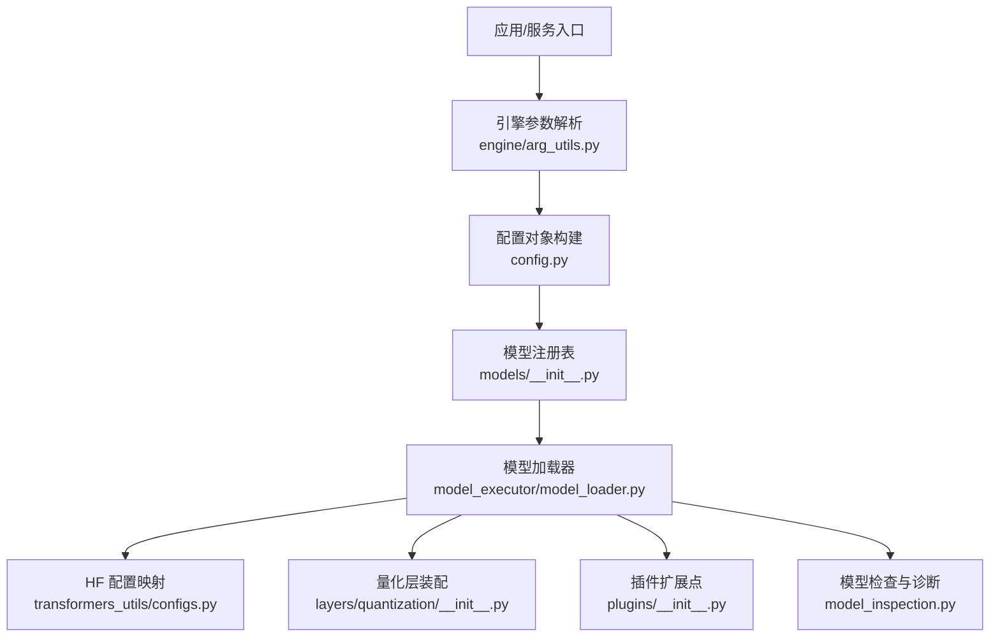
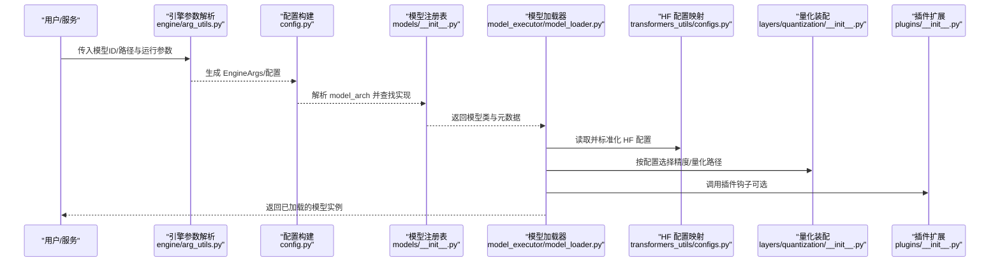
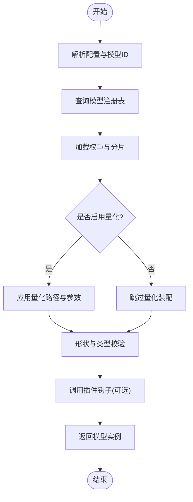
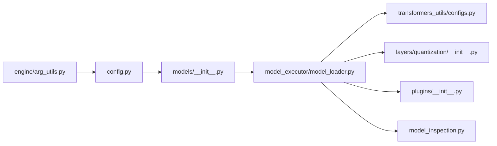

# 多模型支持

<cite>
**本文引用的文件**   
- [vllm/models/__init__.py](file://vllm/models/__init__.py)
- [vllm/model_executor/model_loader.py](file://vllm/model_executor/model_loader.py)
- [vllm/config.py](file://vllm/config.py)
- [vllm/engine/arg_utils.py](file://vllm/engine/arg_utils.py)
- [vllm/model_inspection.py](file://vllm/model_inspection.py)
- [vllm/transformers_utils/__init__.py](file://vllm/transformers_utils/__init__.py)
- [vllm/transformers_utils/configs.py](file://vllm/transformers_utils/configs.py)
- [vllm/model_executor/layers/quantization/__init__.py](file://vllm/model_executor/layers/quantization/__init__.py)
- [vllm/plugins/__init__.py](file://vllm/plugins/__init__.py)
- [docs/models/supported_models.md](file://docs/models/supported_models.md)
- [examples/tensorize_vllm_model.py](file://examples/tensorize_vllm_model.py)
</cite>

## 目录
1. [简介](#简介)
2. [项目结构](#项目结构)
3. [核心组件](#核心组件)
4. [架构总览](#架构总览)
5. [详细组件分析](#详细组件分析)
6. [依赖关系分析](#依赖关系分析)
7. [性能与内存优化建议](#性能与内存优化建议)
8. [故障排查指南](#故障排查指南)
9. [结论](#结论)
10. [附录：新模型集成清单与最佳实践](#附录新模型集成清单与最佳实践)

## 简介
本技术文档聚焦 vLLM 的多模型支持能力，覆盖主流大语言模型（如 Llama、Mistral、Qwen、DeepSeek 等）的适配情况、HuggingFace 到 vLLM 格式的转换流程、动态模型加载机制（权重管理、版本控制、热更新）、模型注册系统与扩展机制、以及配置与调优最佳实践。文档面向工程师与使用者，既提供高层概览，也给出代码级定位与流程图示，帮助快速理解并安全扩展新的模型架构。

## 项目结构
围绕“多模型支持”的关键目录与文件包括：
- 模型注册与发现：vllm/models/__init__.py
- 模型加载与权重处理：vllm/model_executor/model_loader.py
- 配置与参数解析：vllm/config.py、vllm/engine/arg_utils.py
- HuggingFace 兼容与配置映射：vllm/transformers_utils/__init__.py、vllm/transformers_utils/configs.py
- 量化层与精度选择：vllm/model_executor/layers/quantization/__init__.py
- 插件系统：vllm/plugins/__init__.py
- 官方支持的模型列表与说明：docs/models/supported_models.md
- HuggingFace 到 vLLM 格式转换示例：examples/tensorize_vllm_model.py

图表来源 
- [vllm/engine/arg_utils.py](file://vllm/engine/arg_utils.py)
- [vllm/config.py](file://vllm/config.py)
- [vllm/models/__init__.py](file://vllm/models/__init__.py)
- [vllm/model_executor/model_loader.py](file://vllm/model_executor/model_loader.py)
- [vllm/transformers_utils/configs.py](file://vllm/transformers_utils/configs.py)
- [vllm/model_executor/layers/quantization/__init__.py](file://vllm/model_executor/layers/quantization/__init__.py)
- [vllm/plugins/__init__.py](file://vllm/plugins/__init__.py)
- [vllm/model_inspection.py](file://vllm/model_inspection.py)

章节来源
- [vllm/models/__init__.py](file://vllm/models/__init__.py)
- [vllm/model_executor/model_loader.py](file://vllm/model_executor/model_loader.py)
- [vllm/config.py](file://vllm/config.py)
- [vllm/engine/arg_utils.py](file://vllm/engine/arg_utils.py)
- [vllm/transformers_utils/configs.py](file://vllm/transformers_utils/configs.py)
- [vllm/model_executor/layers/quantization/__init__.py](file://vllm/model_executor/layers/quantization/__init__.py)
- [vllm/plugins/__init__.py](file://vllm/plugins/__init__.py)
- [vllm/model_inspection.py](file://vllm/model_inspection.py)

## 核心组件
- 模型注册表：集中维护模型架构名称到实现类的映射，支持按架构名动态实例化模型类，便于新增模型时仅做注册即可接入。
- 模型加载器：负责从磁盘或远程仓库加载权重、校验形状与类型、执行必要的格式转换与分片策略，最终构造可执行的模型实例。
- HF 配置映射：将 HuggingFace 的配置字段映射为 vLLM 内部配置，屏蔽不同模型的差异，统一推理接口。
- 量化与精度：根据配置选择 FP8/BF16/FP16/INT8 等精度路径，并在加载阶段完成量化参数的装载与融合。
- 插件系统：提供钩子用于扩展模型行为（如自定义注意力、MoE 路由、KV Cache 管理等），在不修改核心逻辑的前提下增强能力。
- 模型检查：在加载前后对模型结构与参数进行一致性检查，确保兼容性并输出诊断信息。

章节来源
- [vllm/models/__init__.py](file://vllm/models/__init__.py)
- [vllm/model_executor/model_loader.py](file://vllm/model_executor/model_loader.py)
- [vllm/transformers_utils/configs.py](file://vllm/transformers_utils/configs.py)
- [vllm/model_executor/layers/quantization/__init__.py](file://vllm/model_executor/layers/quantization/__init__.py)
- [vllm/plugins/__init__.py](file://vllm/plugins/__init__.py)
- [vllm/model_inspection.py](file://vllm/model_inspection.py)

## 架构总览
下图展示了从启动到模型就绪的核心流程，涵盖参数解析、配置构建、模型注册、加载与量化装配。

图表来源 
- [vllm/engine/arg_utils.py](file://vllm/engine/arg_utils.py)
- [vllm/config.py](file://vllm/config.py)
- [vllm/models/__init__.py](file://vllm/models/__init__.py)
- [vllm/model_executor/model_loader.py](file://vllm/model_executor/model_loader.py)
- [vllm/transformers_utils/configs.py](file://vllm/transformers_utils/configs.py)
- [vllm/model_executor/layers/quantization/__init__.py](file://vllm/model_executor/layers/quantization/__init__.py)
- [vllm/plugins/__init__.py](file://vllm/plugins/__init__.py)

## 详细组件分析

### 模型注册与发现
- 职责：维护模型架构名称到具体实现的映射；提供按名称实例化的能力；支持条件导入与按需加载。
- 关键点：
  - 通过统一的键名（如架构标识）索引模型类，避免硬编码分支。
  - 结合配置中的 model_arch 字段自动选择对应实现。
  - 支持扩展：新增模型只需注册映射并保证接口一致。
- 典型用法：由加载器根据配置查询注册表，获取模型类后进入加载流程。

章节来源
- [vllm/models/__init__.py](file://vllm/models/__init__.py)

### 模型加载器与权重管理
- 职责：从本地/远程路径加载权重，执行分片与对齐、类型转换、形状校验，组装模型图并返回可执行实例。
- 关键点：
  - 支持多种权重来源与存储格式（如 safetensors、sharded checkpoints）。
  - 与量化模块协作，按配置选择精度路径并完成量化参数装载。
  - 与插件系统交互，允许在加载生命周期中注入自定义逻辑（如权重变换、设备放置策略）。
- 动态加载与热更新：
  - 通过分离“模型类实例化”和“权重载入”，可在运行时替换权重文件或切换版本，无需重建整个进程。
  - 建议在外部协调器管理版本元数据与回滚策略，确保一致性。

图表来源 
- [vllm/model_executor/model_loader.py](file://vllm/model_executor/model_loader.py)
- [vllm/model_executor/layers/quantization/__init__.py](file://vllm/model_executor/layers/quantization/__init__.py)
- [vllm/plugins/__init__.py](file://vllm/plugins/__init__.py)

章节来源
- [vllm/model_executor/model_loader.py](file://vllm/model_executor/model_loader.py)
- [vllm/model_executor/layers/quantization/__init__.py](file://vllm/model_executor/layers/quantization/__init__.py)
- [vllm/plugins/__init__.py](file://vllm/plugins/__init__.py)

### HuggingFace 配置映射与格式转换
- 职责：将 HF 的配置文件转换为 vLLM 内部配置，屏蔽不同模型的字段差异；提供工具将 HF 权重转换为 vLLM 友好的格式。
- 关键点：
  - 字段映射：如 attention_head_dim、num_attention_heads、hidden_size 等关键超参的统一。
  - 格式转换：使用示例脚本将 HF 权重转存为 vLLM 可直接加载的格式，提升加载效率与一致性。
- 推荐流程：
  - 优先使用官方支持的模型 ID，减少映射成本。
  - 对于自定义或私有模型，先导出标准 HF 配置，再经转换脚本生成 vLLM 权重。

章节来源
- [vllm/transformers_utils/configs.py](file://vllm/transformers_utils/configs.py)
- [vllm/transformers_utils/__init__.py](file://vllm/transformers_utils/__init__.py)
- [examples/tensorize_vllm_model.py](file://examples/tensorize_vllm_model.py)

### 量化与精度选择
- 职责：根据配置选择精度路径（如 FP8、BF16、FP16、INT8），并在加载阶段装配相应层与算子。
- 关键点：
  - 量化参数与主权重分离管理，便于缓存与复用。
  - 不同硬件平台可能具备不同的最优精度组合，需结合后端能力选择。
  - 量化装配过程应与模型结构解耦，通过注册表与工厂模式扩展新量化方案。

章节来源
- [vllm/model_executor/layers/quantization/__init__.py](file://vllm/model_executor/layers/quantization/__init__.py)

### 插件系统与扩展机制
- 职责：提供加载与推理阶段的扩展点，支持自定义注意力、MoE 路由、KV Cache 管理、日志与指标采集等。
- 关键点：
  - 插件以模块形式注册，按命名空间加载，避免污染核心代码。
  - 插件应遵循最小侵入原则，尽量通过钩子函数扩展行为。
  - 与模型加载器协作，在权重加载、模型初始化、前向计算等阶段注入逻辑。

章节来源
- [vllm/plugins/__init__.py](file://vllm/plugins/__init__.py)

### 模型检查与诊断
- 职责：在加载前后对模型结构与参数进行一致性检查，输出诊断信息，辅助定位不兼容问题。
- 关键点：
  - 检查维度：形状、数据类型、头数/层数一致性、注意力掩码配置等。
  - 输出可读的诊断报告，便于快速定位配置错误或权重损坏。

章节来源
- [vllm/model_inspection.py](file://vllm/model_inspection.py)

## 依赖关系分析
- 低耦合高内聚：模型注册表与加载器解耦，量化与插件通过接口抽象接入。
- 外部依赖：
  - HuggingFace Transformers：用于读取模型配置与权重。
  - 量化库与后端算子：根据配置动态选择。
- 潜在循环依赖：应避免在加载器与注册表之间直接相互引用，建议使用工厂或延迟导入。

图表来源 
- [vllm/engine/arg_utils.py](file://vllm/engine/arg_utils.py)
- [vllm/config.py](file://vllm/config.py)
- [vllm/models/__init__.py](file://vllm/models/__init__.py)
- [vllm/model_executor/model_loader.py](file://vllm/model_executor/model_loader.py)
- [vllm/transformers_utils/configs.py](file://vllm/transformers_utils/configs.py)
- [vllm/model_executor/layers/quantization/__init__.py](file://vllm/model_executor/layers/quantization/__init__.py)
- [vllm/plugins/__init__.py](file://vllm/plugins/__init__.py)
- [vllm/model_inspection.py](file://vllm/model_inspection.py)

章节来源
- [vllm/engine/arg_utils.py](file://vllm/engine/arg_utils.py)
- [vllm/config.py](file://vllm/config.py)
- [vllm/models/__init__.py](file://vllm/models/__init__.py)
- [vllm/model_executor/model_loader.py](file://vllm/model_executor/model_loader.py)
- [vllm/transformers_utils/configs.py](file://vllm/transformers_utils/configs.py)
- [vllm/model_executor/layers/quantization/__init__.py](file://vllm/model_executor/layers/quantization/__init__.py)
- [vllm/plugins/__init__.py](file://vllm/plugins/__init__.py)
- [vllm/model_inspection.py](file://vllm/model_inspection.py)

## 性能与内存优化建议
- 精度选择：
  - 优先 BF16/FP16 以获得较好吞吐与数值稳定性；在支持 FP8 的硬件上评估 FP8 的收益与精度影响。
  - 量化路径需与模型结构匹配，避免不必要的精度损失。
- KV Cache 与显存：
  - 合理设置最大上下文长度与批大小，避免 OOM。
  - 开启前缀缓存（若可用）以减少重复计算的开销。
- 并行与分片：
  - 根据 GPU 数量与拓扑选择张量并行/流水线并行策略。
  - 权重分片加载可减少峰值显存占用。
- 编译与内核：
  - 利用 vLLM 的编译与融合特性（如 CUDA Graph、算子融合）降低开销。
- 监控与基准：
  - 使用内置指标与基准脚本评估吞吐、延迟与显存占用，持续调优。

[本节为通用指导，不直接分析具体文件]

## 故障排查指南
- 常见错误与定位：
  - 模型架构不匹配：检查 model_arch 与注册表映射是否正确。
  - 权重形状不一致：使用模型检查工具输出诊断信息，核对配置与权重来源。
  - 量化失败：确认量化路径与后端支持，检查量化参数完整性。
  - 插件冲突：隔离插件模块，逐步定位钩子冲突。
- 调试步骤：
  - 启用详细日志，观察加载各阶段状态。
  - 使用最小复现用例，逐步缩小问题范围。
  - 对比官方支持的模型配置，定位差异字段。

章节来源
- [vllm/model_inspection.py](file://vllm/model_inspection.py)

## 结论
vLLM 的多模型支持通过“注册表 + 加载器 + 配置映射 + 量化装配 + 插件扩展”的分层设计，实现了高内聚、低耦合与强扩展性。借助 HuggingFace 生态与格式转换工具，用户可以快速接入主流模型（Llama、Mistral、Qwen、DeepSeek 等），并通过量化与并行策略获得高性能推理。建议在工程实践中严格遵循配置规范与兼容性检查清单，确保稳定与可维护性。

[本节为总结性内容，不直接分析具体文件]

## 附录：新模型集成清单与最佳实践
- 兼容性检查清单：
  - 模型架构是否在官方支持列表中（参考 docs/models/supported_models.md）。
  - HF 配置字段是否可被 transformers_utils/configs.py 正确映射。
  - 权重格式是否可通过 examples/tensorize_vllm_model.py 转换为 vLLM 友好格式。
  - 量化路径是否与目标硬件与后端兼容。
- 集成步骤：
  - 在 models/__init__.py 中注册新模型架构与实现类。
  - 在 transformers_utils/configs.py 中添加字段映射与默认值。
  - 如有必要，在 quantization/__init__.py 中扩展量化路径。
  - 通过 plugins/__init__.py 注册必要的钩子（如自定义注意力或路由）。
  - 使用 model_inspection.py 进行加载前后的一致性检查。
- 最佳实践：
  - 保持配置与权重版本化管理，便于回滚与审计。
  - 在 CI 中加入模型兼容性测试，确保变更不影响既有模型。
  - 针对目标硬件进行性能基准与回归测试。

章节来源
- [docs/models/supported_models.md](file://docs/models/supported_models.md)
- [vllm/transformers_utils/configs.py](file://vllm/transformers_utils/configs.py)
- [examples/tensorize_vllm_model.py](file://examples/tensorize_vllm_model.py)
- [vllm/models/__init__.py](file://vllm/models/__init__.py)
- [vllm/model_executor/layers/quantization/__init__.py](file://vllm/model_executor/layers/quantization/__init__.py)
- [vllm/plugins/__init__.py](file://vllm/plugins/__init__.py)
- [vllm/model_inspection.py](file://vllm/model_inspection.py)