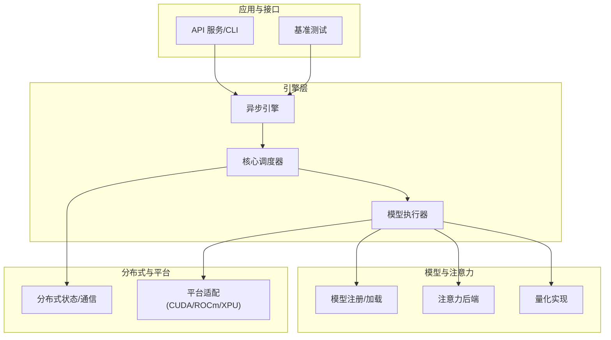
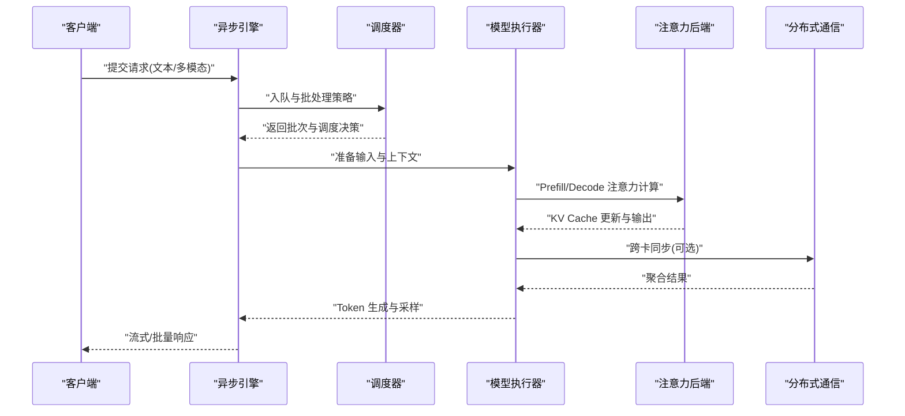
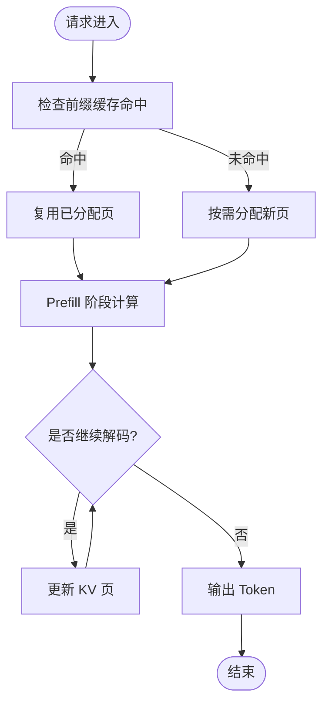
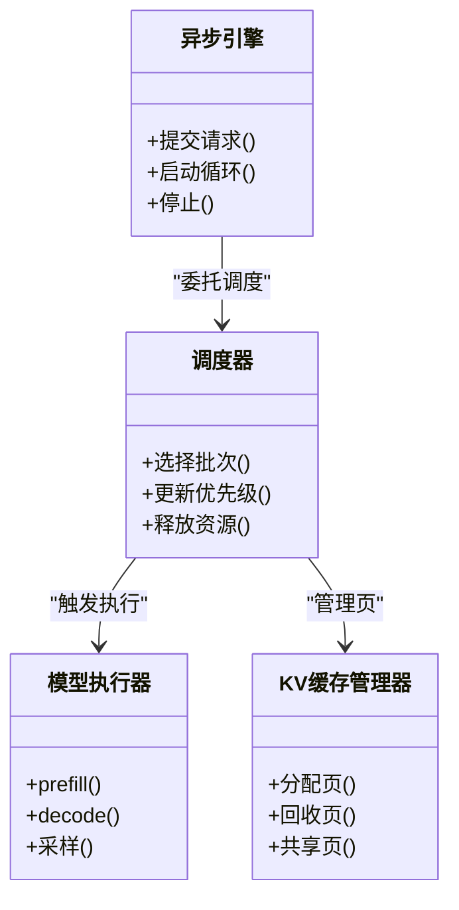
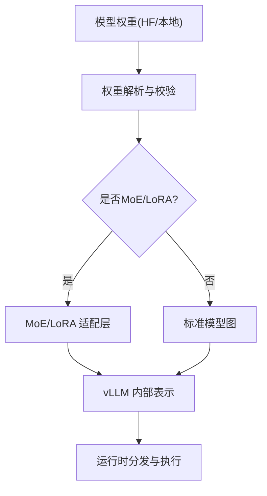
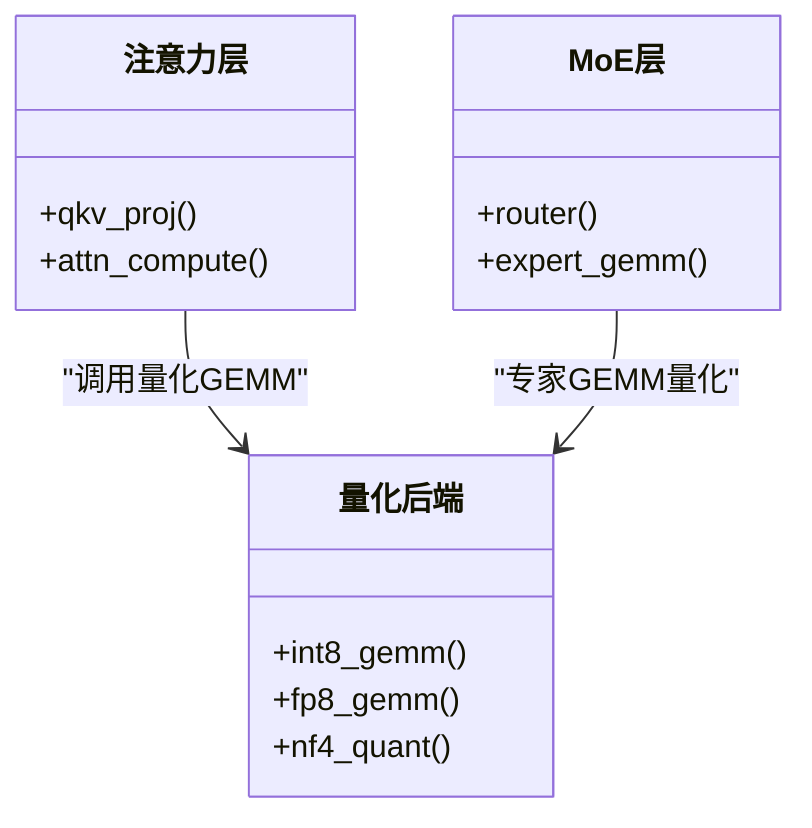
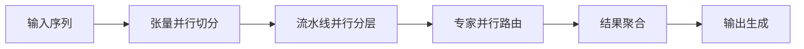
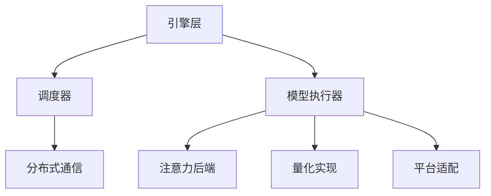

# 核心特性

<cite>
**本文引用的文件**   
- [README.md](file://README.md)
- [vllm/engine/async_llm_engine.py](file://vllm/engine/async_llm_engine.py)
- [vllm/engine/core/vllm_core.py](file://vllm/engine/core/vllm_core.py)
- [vllm/model_executor/model_runner.py](file://vllm/model_executor/model_runner.py)
- [vllm/config.py](file://vllm/config.py)
- [vllm/distributed/parallel_state.py](file://vllm/distributed/parallel_state.py)
- [vllm/platforms/cuda.py](file://vllm/platforms/cuda.py)
- [benchmarks/benchmark_serving.py](file://benchmarks/benchmark_serving.py)
- [benchmarks/benchmark_throughput.py](file://benchmarks/benchmark_throughput.py)
- [benchmarks/kernels/benchmark_paged_attention.py](file://benchmarks/kernels/benchmark_paged_attention.py)
- [benchmarks/kernels/benchmark_int8_gemm.py](file://benchmarks/kernels/benchmark_int8_gemm.py)
- [benchmarks/kernels/benchmark_cutlass_moe_fp8.py](file://benchmarks/kernels/benchmark_cutlass_moe_fp8.py)
- [benchmarks/kernels/benchmark_nvfp4_quant.py](file://benchmarks/kernels/benchmark_nvfp4_quant.py)
- [docs/design/paged_attention.md](file://docs/design/paged_attention.md)
- [docs/design/hybrid_kv_cache_manager.md](file://docs/design/hybrid_kv_cache_manager.md)
- [docs/serving/parallelism_scaling.md](file://docs/serving/parallelism_scaling.md)
- [docs/features/quantization/README.md](file://docs/features/quantization/README.md)
- [vllm/model_executor/layers/quantization/__init__.py](file://vllm/model_executor/layers/quantization/__init__.py)
- [vllm/model_executor/layers/attention/__init__.py](file://vllm/model_executor/layers/attention/__init__.py)
</cite>

## 目录
1. [简介](#简介)
2. [项目结构](#项目结构)
3. [核心组件](#核心组件)
4. [架构总览](#架构总览)
5. [详细组件分析](#详细组件分析)
6. [依赖关系分析](#依赖关系分析)
7. [性能考量](#性能考量)
8. [故障排查指南](#故障排查指南)
9. [结论](#结论)
10. [附录](#附录)

## 简介
本技术文档围绕 vLLM 的核心特性展开，系统性阐述以下关键能力：
- PagedAttention 内存管理技术的工作原理与性能优势
- 高并发请求处理机制（批处理策略、调度算法与资源管理）
- 多模型支持能力（支持的模型架构、格式转换与动态加载）
- 量化支持功能（INT8、FP8、NF4 等方案实现）
- 分布式推理能力（张量并行、流水线并行、专家并行的配置与使用）
- 每个特性的技术原理、配置选项与性能调优建议，并附带基准测试参考路径

vLLM 以高效显存管理与高吞吐推理为目标，通过分页式 KV Cache、融合算子、编译优化与分布式并行，显著降低延迟并提升吞吐。

## 项目结构
仓库采用模块化组织，核心 Python 代码位于 vllm/ 目录，C++/CUDA 内核在 csrc/，基准与实验脚本在 benchmarks/，设计文档在 docs/。入口与引擎层负责编排请求、调度与执行；模型执行器负责具体前向计算；平台适配层屏蔽硬件差异；分布式模块提供多卡/多机通信与并行策略。

**图表来源** 
- [vllm/engine/async_llm_engine.py](file://vllm/engine/async_llm_engine.py)
- [vllm/engine/core/vllm_core.py](file://vllm/engine/core/vllm_core.py)
- [vllm/model_executor/model_runner.py](file://vllm/model_executor/model_runner.py)
- [vllm/distributed/parallel_state.py](file://vllm/distributed/parallel_state.py)
- [vllm/platforms/cuda.py](file://vllm/platforms/cuda.py)

**章节来源**
- [README.md](file://README.md)

## 核心组件
- 异步引擎与调度器：负责接收请求、构建批次、选择调度策略、协调 KV Cache 生命周期与资源分配。
- 模型执行器：封装模型前向、注意力后端选择、量化与融合算子调用、CUDA Graph 与编译优化。
- 分布式状态：维护张量并行、流水线并行、专家并行等并行维度与通信组。
- 平台适配：抽象 CUDA/ROCm/XPU 等硬件细节，统一设备与内存管理。
- 量化与注意力后端：提供 INT8/FP8/NF4 等量化实现与多种注意力加速后端。

**章节来源**
- [vllm/engine/async_llm_engine.py](file://vllm/engine/async_llm_engine.py)
- [vllm/engine/core/vllm_core.py](file://vllm/engine/core/vllm_core.py)
- [vllm/model_executor/model_runner.py](file://vllm/model_executor/model_runner.py)
- [vllm/distributed/parallel_state.py](file://vllm/distributed/parallel_state.py)
- [vllm/platforms/cuda.py](file://vllm/platforms/cuda.py)

## 架构总览
下图展示从请求进入到生成输出的端到端流程，包括调度、KV Cache 管理、注意力计算与输出采样。

**图表来源** 
- [vllm/engine/async_llm_engine.py](file://vllm/engine/async_llm_engine.py)
- [vllm/engine/core/vllm_core.py](file://vllm/engine/core/vllm_core.py)
- [vllm/model_executor/model_runner.py](file://vllm/model_executor/model_runner.py)
- [vllm/model_executor/layers/attention/__init__.py](file://vllm/model_executor/layers/attention/__init__.py)
- [vllm/distributed/parallel_state.py](file://vllm/distributed/parallel_state.py)

## 详细组件分析

### PagedAttention 内存管理
PagedAttention 将 KV Cache 按块分页管理，避免连续大数组导致的碎片与浪费，显著提升显存利用率与吞吐。其核心思想是：
- 将 KV 向量切分为固定大小的页，按需分配与回收
- 支持跨请求共享页（前缀缓存），减少重复计算
- 结合混合 KV Cache 管理器，灵活切换不同存储策略

**图表来源** 
- [docs/design/paged_attention.md](file://docs/design/paged_attention.md)
- [docs/design/hybrid_kv_cache_manager.md](file://docs/design/hybrid_kv_cache_manager.md)
- [benchmarks/kernels/benchmark_paged_attention.py](file://benchmarks/kernels/benchmark_paged_attention.py)

**章节来源**
- [docs/design/paged_attention.md](file://docs/design/paged_attention.md)
- [docs/design/hybrid_kv_cache_manager.md](file://docs/design/hybrid_kv_cache_manager.md)
- [benchmarks/kernels/benchmark_paged_attention.py](file://benchmarks/kernels/benchmark_paged_attention.py)

### 高并发请求处理机制
vLLM 的并发处理由异步引擎与调度器协同完成：
- 批处理策略：根据请求长度、资源占用与延迟目标动态合并批次
- 调度算法：优先级队列、公平调度与抢占策略，保障低延迟与高吞吐平衡
- 资源管理：GPU/CPU 内存池、KV Cache 页池、CUDA Graph 预热与复用

**图表来源** 
- [vllm/engine/async_llm_engine.py](file://vllm/engine/async_llm_engine.py)
- [vllm/engine/core/vllm_core.py](file://vllm/engine/core/vllm_core.py)
- [vllm/model_executor/model_runner.py](file://vllm/model_executor/model_runner.py)

**章节来源**
- [vllm/engine/async_llm_engine.py](file://vllm/engine/async_llm_engine.py)
- [vllm/engine/core/vllm_core.py](file://vllm/engine/core/vllm_core.py)
- [vllm/model_executor/model_runner.py](file://vllm/model_executor/model_runner.py)

### 多模型支持能力
vLLM 支持多种主流模型架构，并通过统一的模型注册与加载机制实现动态加载与权重转换：
- 支持的架构：Llama、Qwen、Gemma、Mistral、DeepSeek、Mixtral 等
- 格式转换：HuggingFace 权重到 vLLM 内部表示，支持 LoRA 与 MoE 扩展
- 动态加载：按需加载权重与分片，支持多模型实例共存

**图表来源** 
- [vllm/model_executor/model_runner.py](file://vllm/model_executor/model_runner.py)
- [vllm/config.py](file://vllm/config.py)

**章节来源**
- [vllm/model_executor/model_runner.py](file://vllm/model_executor/model_runner.py)
- [vllm/config.py](file://vllm/config.py)

### 量化支持功能
vLLM 提供多种量化方案，覆盖 INT8、FP8、NF4 等，兼顾精度与性能：
- INT8：通用 GEMM 加速，适用于多数场景
- FP8：针对 NVIDIA Hopper 架构优化，提升吞吐
- NF4：极低比特量化，适合边缘部署与极端资源受限环境

**图表来源** 
- [vllm/model_executor/layers/quantization/__init__.py](file://vllm/model_executor/layers/quantization/__init__.py)
- [benchmarks/kernels/benchmark_int8_gemm.py](file://benchmarks/kernels/benchmark_int8_gemm.py)
- [benchmarks/kernels/benchmark_cutlass_moe_fp8.py](file://benchmarks/kernels/benchmark_cutlass_moe_fp8.py)
- [benchmarks/kernels/benchmark_nvfp4_quant.py](file://benchmarks/kernels/benchmark_nvfp4_quant.py)

**章节来源**
- [docs/features/quantization/README.md](file://docs/features/quantization/README.md)
- [vllm/model_executor/layers/quantization/__init__.py](file://vllm/model_executor/layers/quantization/__init__.py)
- [benchmarks/kernels/benchmark_int8_gemm.py](file://benchmarks/kernels/benchmark_int8_gemm.py)
- [benchmarks/kernels/benchmark_cutlass_moe_fp8.py](file://benchmarks/kernels/benchmark_cutlass_moe_fp8.py)
- [benchmarks/kernels/benchmark_nvfp4_quant.py](file://benchmarks/kernels/benchmark_nvfp4_quant.py)

### 分布式推理能力
vLLM 支持多种并行策略，适应不同规模集群：
- 张量并行：将单层权重切分到多卡，减少单卡显存压力
- 流水线并行：将模型层切分到多卡，提高并行度
- 专家并行：针对 MoE 模型，将专家路由到不同卡

**图表来源** 
- [vllm/distributed/parallel_state.py](file://vllm/distributed/parallel_state.py)
- [docs/serving/parallelism_scaling.md](file://docs/serving/parallelism_scaling.md)

**章节来源**
- [vllm/distributed/parallel_state.py](file://vllm/distributed/parallel_state.py)
- [docs/serving/parallelism_scaling.md](file://docs/serving/parallelism_scaling.md)

## 依赖关系分析
vLLM 各模块间耦合清晰，核心依赖如下：
- 引擎层依赖调度器与执行器
- 执行器依赖注意力后端、量化实现与平台适配
- 分布式模块为执行器提供通信原语
- 平台适配屏蔽底层硬件差异

**图表来源** 
- [vllm/engine/async_llm_engine.py](file://vllm/engine/async_llm_engine.py)
- [vllm/model_executor/model_runner.py](file://vllm/model_executor/model_runner.py)
- [vllm/distributed/parallel_state.py](file://vllm/distributed/parallel_state.py)
- [vllm/platforms/cuda.py](file://vllm/platforms/cuda.py)

**章节来源**
- [vllm/engine/async_llm_engine.py](file://vllm/engine/async_llm_engine.py)
- [vllm/model_executor/model_runner.py](file://vllm/model_executor/model_runner.py)
- [vllm/distributed/parallel_state.py](file://vllm/distributed/parallel_state.py)
- [vllm/platforms/cuda.py](file://vllm/platforms/cuda.py)

## 性能考量
- PagedAttention：通过分页管理减少显存碎片，提升 KV Cache 利用率，显著降低 OOM 风险
- 批处理策略：动态合并请求，最大化 GPU 利用率，降低调度开销
- 量化：INT8/FP8/NF4 在不同硬件上提供显著加速，需权衡精度损失
- 分布式并行：合理配置 TP/PP/EP，避免通信瓶颈
- 基准测试：参考 benchmarks/ 下的脚本进行吞吐与延迟评估

**章节来源**
- [benchmarks/benchmark_serving.py](file://benchmarks/benchmark_serving.py)
- [benchmarks/benchmark_throughput.py](file://benchmarks/benchmark_throughput.py)
- [benchmarks/kernels/benchmark_paged_attention.py](file://benchmarks/kernels/benchmark_paged_attention.py)

## 故障排查指南
- 显存不足：检查 KV Cache 大小、批大小与量化设置
- 调度延迟：调整调度策略与优先级参数
- 量化精度问题：回退到更高精度或调整量化参数
- 分布式通信失败：检查网络与并行组配置
- 注意力后端错误：确认硬件支持与后端兼容性

**章节来源**
- [vllm/config.py](file://vllm/config.py)
- [vllm/platforms/cuda.py](file://vllm/platforms/cuda.py)

## 结论
vLLM 通过 PagedAttention、高效调度、多模型支持与量化优化，构建了高性能 LLM 推理框架。分布式并行能力使其能够扩展到大规模集群。用户可根据需求选择合适的并行策略与量化方案，并通过基准测试验证性能。

## 附录
- 配置选项：参考 vllm/config.py 与环境变量
- 模型支持：查看 models/ 目录与文档
- 量化方案：参考 docs/features/quantization/README.md
- 分布式配置：参考 docs/serving/parallelism_scaling.md

**章节来源**
- [vllm/config.py](file://vllm/config.py)
- [docs/features/quantization/README.md](file://docs/features/quantization/README.md)
- [docs/serving/parallelism_scaling.md](file://docs/serving/parallelism_scaling.md)