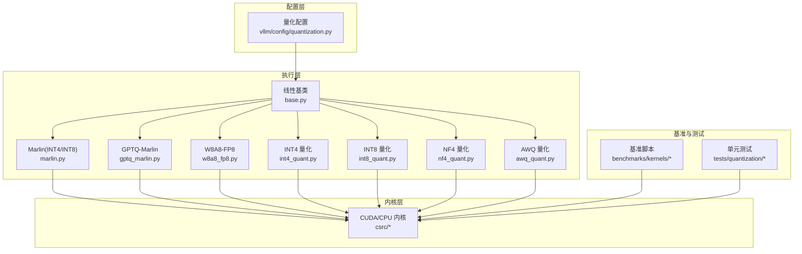
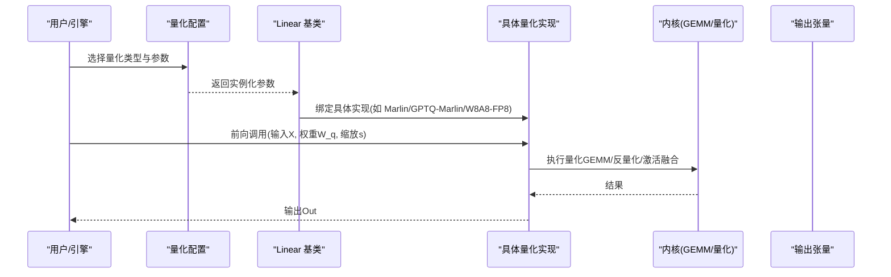
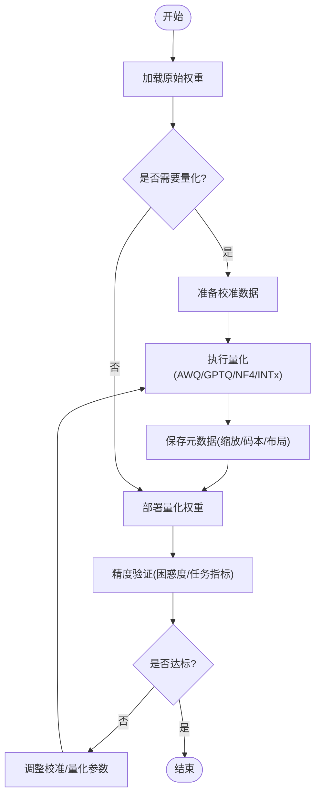
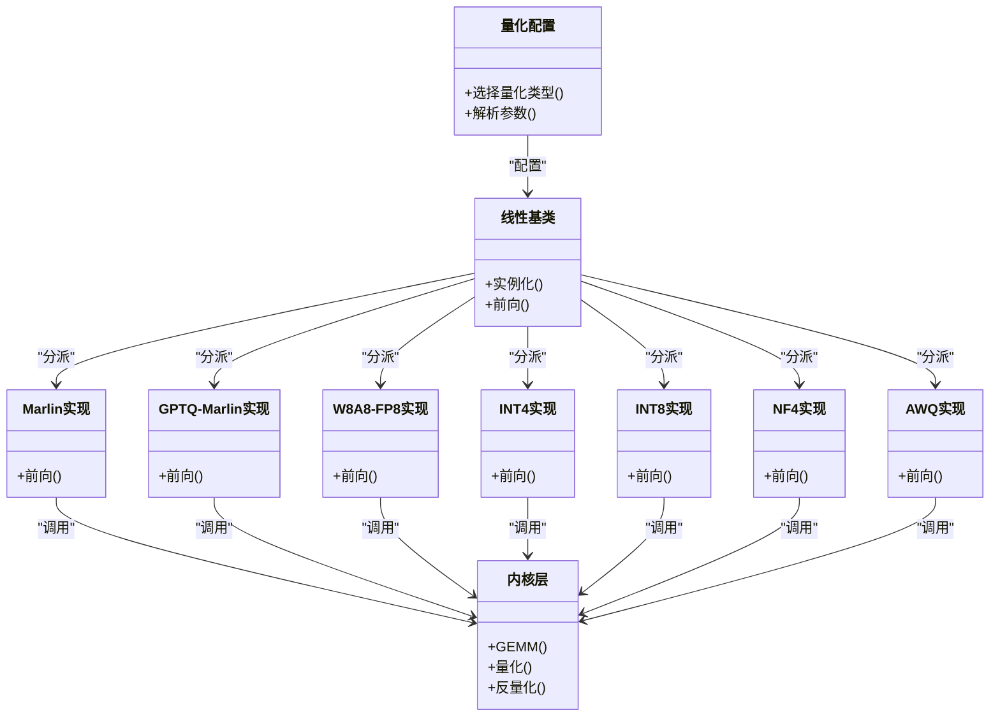

# 量化支持

<cite>
**本文引用的文件**   
- [vllm/config/quantization.py](file://vllm/config/quantization.py)
- [vllm/model_executor/layers/linear/base.py](file://vllm/model_executor/layers/linear/base.py)
- [vllm/model_executor/layers/linear/marlin.py](file://vllm/model_executor/layers/linear/marlin.py)
- [vllm/model_executor/layers/linear/gptq_marlin.py](file://vllm/model_executor/layers/linear/gptq_marlin.py)
- [vllm/model_executor/layers/linear/w8a8_fp8.py](file://vllm/model_executor/layers/linear/w8a8_fp8.py)
- [vllm/model_executor/layers/linear/int4_quant.py](file://vllm/model_executor/layers/linear/int4_quant.py)
- [vllm/model_executor/layers/linear/int8_quant.py](file://vllm/model_executor/layers/linear/int8_quant.py)
- [vllm/model_executor/layers/linear/nf4_quant.py](file://vllm/model_executor/layers/linear/nf4_quant.py)
- [vllm/model_executor/layers/linear/awq_quant.py](file://vllm/model_executor/layers/linear/awq_quant.py)
- [benchmarks/kernels/benchmark_quant.py](file://benchmarks/kernels/benchmark_quant.py)
- [benchmarks/kernels/benchmark_int8_gemm.py](file://benchmarks/kernels/benchmark_int8_gemm.py)
- [benchmarks/kernels/benchmark_fp8_gemm.py](file://benchmarks/kernels/benchmark_fp8_gemm.py)
- [benchmarks/kernels/benchmark_nvfp4_quant.py](file://benchmarks/kernels/benchmark_nvfp4_quant.py)
- [tests/quantization/test_awq.py](file://tests/quantization/test_awq.py)
- [tests/quantization/test_gptq.py](file://tests/quantization/test_gptq.py)
- [tests/quantization/test_w8a8_fp8.py](file://tests/quantization/test_w8a8_fp8.py)
- [tests/quantization/test_int8.py](file://tests/quantization/test_int8.py)
- [tests/quantization/test_nf4.py](file://tests/quantization/test_nf4.py)
- [tests/kernels/test_fused_quant_activation.py](file://tests/kernels/test_fused_quant_activation.py)
- [csrc/libtorch_stable/quantization/README.md](file://csrc/libtorch_stable/quantization/README.md)
</cite>

## 目录
1. [简介](#简介)
2. [项目结构](#项目结构)
3. [核心组件](#核心组件)
4. [架构总览](#架构总览)
5. [详细组件分析](#详细组件分析)
6. [依赖关系分析](#依赖关系分析)
7. [性能考量](#性能考量)
8. [故障排除指南](#故障排除指南)
9. [结论](#结论)
10. [附录](#附录)

## 简介
本文件系统性梳理 vLLM 的量化支持体系，覆盖主流量化方案（INT8、FP8、NF4、AWQ、GPTQ）的原理与适用场景，深入讲解权重量化、激活量化与混合精度训练的实现要点，并给出模型加载与优化流程（权重转换、校准数据准备、精度验证）、配置选项与性能权衡、评估方法与基准测试、部署最佳实践与故障排除。读者可据此快速定位实现位置、理解数据流与控制流，并在工程中高效落地。

## 项目结构
vLLM 的量化能力由“配置层—执行层—内核层—基准与测试”四层构成：
- 配置层：统一量化策略选择与参数解析
- 执行层：线性层按量化类型分派到对应实现（如 Marlin/GPTQ-Marlin/W8A8-FP8/INT4/INT8/NF4/AWQ）
- 内核层：CUDA/CPU 内核与算子融合（如 GEMM、量化/反量化、激活融合）
- 基准与测试：端到端与单元级验证、性能回归与精度校验

图表来源
- [vllm/config/quantization.py](file://vllm/config/quantization.py)
- [vllm/model_executor/layers/linear/base.py](file://vllm/model_executor/layers/linear/base.py)
- [vllm/model_executor/layers/linear/marlin.py](file://vllm/model_executor/layers/linear/marlin.py)
- [vllm/model_executor/layers/linear/gptq_marlin.py](file://vllm/model_executor/layers/linear/gptq_marlin.py)
- [vllm/model_executor/layers/linear/w8a8_fp8.py](file://vllm/model_executor/layers/linear/w8a8_fp8.py)
- [vllm/model_executor/layers/linear/int4_quant.py](file://vllm/model_executor/layers/linear/int4_quant.py)
- [vllm/model_executor/layers/linear/int8_quant.py](file://vllm/model_executor/layers/linear/int8_quant.py)
- [vllm/model_executor/layers/linear/nf4_quant.py](file://vllm/model_executor/layers/linear/nf4_quant.py)
- [vllm/model_executor/layers/linear/awq_quant.py](file://vllm/model_executor/layers/linear/awq_quant.py)
- [csrc/libtorch_stable/quantization/README.md](file://csrc/libtorch_stable/quantization/README.md)

章节来源
- [vllm/config/quantization.py](file://vllm/config/quantization.py)
- [vllm/model_executor/layers/linear/base.py](file://vllm/model_executor/layers/linear/base.py)

## 核心组件
- 量化配置与路由：集中管理量化类型、块大小、缩放策略、是否启用激活量化等关键开关，驱动线性层实例化与后端选择。
- 线性层抽象与分派：统一的 Linear 接口，根据配置动态绑定具体量化实现（如 Marlin、GPTQ-Marlin、W8A8-FP8、INT4/INT8/NF4/AWQ）。
- 量化内核与融合：针对各量化格式提供专用 GEMM/量化/反量化/激活融合内核，最大化吞吐并降低内存带宽压力。
- 基准与测试：覆盖精度与性能双维度，确保不同量化方案的稳定性与回归安全。

章节来源
- [vllm/config/quantization.py](file://vllm/config/quantization.py)
- [vllm/model_executor/layers/linear/base.py](file://vllm/model_executor/layers/linear/base.py)

## 架构总览
下图展示从配置到执行的端到端路径，以及量化权重在推理时的计算流。

图表来源
- [vllm/config/quantization.py](file://vllm/config/quantization.py)
- [vllm/model_executor/layers/linear/base.py](file://vllm/model_executor/layers/linear/base.py)
- [vllm/model_executor/layers/linear/marlin.py](file://vllm/model_executor/layers/linear/marlin.py)
- [vllm/model_executor/layers/linear/gptq_marlin.py](file://vllm/model_executor/layers/linear/gptq_marlin.py)
- [vllm/model_executor/layers/linear/w8a8_fp8.py](file://vllm/model_executor/layers/linear/w8a8_fp8.py)

## 详细组件分析

### 量化方案概览与适用场景
- INT8 量化
  - 原理：将权重或激活以每通道/每组/逐 token 的方式映射到 int8，配合缩放因子进行反量化参与计算。
  - 适用：通用推理加速，硬件对 int8 GEMM 支持良好；适合对延迟敏感且精度要求中等的场景。
  - 注意：需合理选择缩放粒度与校准集，避免极端值导致溢出或精度下降。
- FP8 量化（含 W8A8-FP8）
  - 原理：使用 8-bit 浮点（E4M3/E5M2）表示权重和/或激活，具备更宽的动态范围。
  - 适用：高吞吐 GPU（如 Hopper），对大动态范围激活友好，适合大模型推理与 MoE。
  - 注意：需要内核与编译器支持，校准与数值稳定性需谨慎处理。
- NF4（归一化 4-bit）
  - 原理：基于信息论最优的 4-bit 非均匀分布，提升低比特权重的表达能力。
  - 适用：极致压缩场景，结合 LoRA 微调效果显著。
  - 注意：反量化开销较高，需配合专用内核与缓存策略。
- AWQ（Activation-aware Weight Quantization）
  - 原理：依据激活分布自适应筛选重要权重，再进行低比特量化，减少精度损失。
  - 适用：对精度敏感的低比特推理（如 INT4/INT8），常与通道/分组缩放结合。
  - 注意：离线校准质量决定上限，需高质量代表性数据。
- GPTQ（Greedy Post-Training Quantization）
  - 原理：逐层贪心搜索最优量化码本与缩放，最小化重构误差。
  - 适用：高精度低比特（INT4/INT8），常用于 LLM 推理部署。
  - 注意：校准耗时较长，需平衡校准集规模与时间成本。

章节来源
- [vllm/model_executor/layers/linear/int8_quant.py](file://vllm/model_executor/layers/linear/int8_quant.py)
- [vllm/model_executor/layers/linear/w8a8_fp8.py](file://vllm/model_executor/layers/linear/w8a8_fp8.py)
- [vllm/model_executor/layers/linear/nf4_quant.py](file://vllm/model_executor/layers/linear/nf4_quant.py)
- [vllm/model_executor/layers/linear/awq_quant.py](file://vllm/model_executor/layers/linear/awq_quant.py)
- [vllm/model_executor/layers/linear/gptq_marlin.py](file://vllm/model_executor/layers/linear/gptq_marlin.py)

### 权重量化、激活量化与混合精度训练
- 权重量化
  - 常见策略：逐通道/分组/逐 token 缩放；码本量化（NF4/GPTQ）；感知重要性（AWQ）。
  - 存储与布局：紧凑编码（如 4/8bit packed）、转置/重排以提升访存效率。
- 激活量化
  - 常见策略：逐 token/逐通道缩放；滑动窗口统计；与注意力/MLP 融合以减少反量化开销。
- 混合精度训练
  - 策略：权重低比特 + 激活/梯度 FP16/BF16；在关键路径（如注意力）保持更高精度。
  - 收益：降低显存占用与带宽压力，同时维持收敛性。

章节来源
- [vllm/model_executor/layers/linear/int4_quant.py](file://vllm/model_executor/layers/linear/int4_quant.py)
- [vllm/model_executor/layers/linear/int8_quant.py](file://vllm/model_executor/layers/linear/int8_quant.py)
- [vllm/model_executor/layers/linear/w8a8_fp8.py](file://vllm/model_executor/layers/linear/w8a8_fp8.py)
- [tests/kernels/test_fused_quant_activation.py](file://tests/kernels/test_fused_quant_activation.py)

### 量化模型的加载与优化流程
- 权重转换
  - 原始权重 → 量化权重（离线）：AWQ/GPTQ/NF4 等工具生成量化权重与元数据（缩放、码本、布局）。
  - 运行时加载：vLLM 识别量化格式，实例化对应 Linear 实现并载入权重与元数据。
- 校准数据准备
  - 选择代表性数据集（文本/多模态），统计激活分布或计算重构误差。
  - 控制校准集规模与多样性，避免过拟合或欠拟合。
- 精度验证
  - 对比全精度与量化后输出的差异（如相对误差、困惑度、下游任务指标）。
  - 分层/逐模块验证，定位退化严重的层。

图表来源
- [vllm/config/quantization.py](file://vllm/config/quantization.py)
- [vllm/model_executor/layers/linear/base.py](file://vllm/model_executor/layers/linear/base.py)

章节来源
- [vllm/config/quantization.py](file://vllm/config/quantization.py)
- [vllm/model_executor/layers/linear/base.py](file://vllm/model_executor/layers/linear/base.py)

### 配置选项与性能权衡
- 量化类型：INT8/FP8/NF4/AWQ/GPTQ，影响精度与速度。
- 缩放粒度：逐通道/分组/逐 token，粒度越细精度越高但开销越大。
- 激活量化：开启后可进一步降低带宽，但需保证数值稳定。
- 内核选择：Marlin/GPTQ-Marlin/W8A8-FP8 等，不同内核在不同形状/设备上表现不同。
- 精度-速度权衡：更低比特带来更高吞吐与更低显存，但可能引入偏差；建议通过基准与任务评测综合决策。

章节来源
- [vllm/config/quantization.py](file://vllm/config/quantization.py)
- [vllm/model_executor/layers/linear/marlin.py](file://vllm/model_executor/layers/linear/marlin.py)
- [vllm/model_executor/layers/linear/gptq_marlin.py](file://vllm/model_executor/layers/linear/gptq_marlin.py)
- [vllm/model_executor/layers/linear/w8a8_fp8.py](file://vllm/model_executor/layers/linear/w8a8_fp8.py)

### 量化效果评估方法与基准测试结果
- 评估方法
  - 精度：困惑度（Perplexity）、分类/问答准确率、语义相似度等。
  - 性能：吞吐（tokens/s）、延迟（ms/token）、显存占用、核时占比。
- 基准脚本
  - 通用量化基准、INT8 GEMM、FP8 GEMM、NVFP4 量化等，覆盖不同形状与设备。
- 测试用例
  - 针对 AWQ、GPTQ、W8A8-FP8、INT8、NF4 的单元与集成测试，保障正确性与回归安全。

章节来源
- [benchmarks/kernels/benchmark_quant.py](file://benchmarks/kernels/benchmark_quant.py)
- [benchmarks/kernels/benchmark_int8_gemm.py](file://benchmarks/kernels/benchmark_int8_gemm.py)
- [benchmarks/kernels/benchmark_fp8_gemm.py](file://benchmarks/kernels/benchmark_fp8_gemm.py)
- [benchmarks/kernels/benchmark_nvfp4_quant.py](file://benchmarks/kernels/benchmark_nvfp4_quant.py)
- [tests/quantization/test_awq.py](file://tests/quantization/test_awq.py)
- [tests/quantization/test_gptq.py](file://tests/quantization/test_gptq.py)
- [tests/quantization/test_w8a8_fp8.py](file://tests/quantization/test_w8a8_fp8.py)
- [tests/quantization/test_int8.py](file://tests/quantization/test_int8.py)
- [tests/quantization/test_nf4.py](file://tests/quantization/test_nf4.py)

### 量化模型部署的最佳实践
- 选择合适的量化方案：优先评估任务敏感度，再决定比特数与缩放粒度。
- 校准数据质量：覆盖长尾分布与领域术语，必要时分层校准。
- 内核与设备匹配：根据 GPU 架构选择最优内核（如 Hopper 上优先 FP8）。
- 监控与回滚：上线前后对比指标，设置阈值触发回滚。
- 资源规划：预留足够的显存与带宽余量，关注 KV Cache 与中间激活。

[本节为概念性指导，不直接分析具体文件]

### 故障排除指南
- 精度异常
  - 检查校准集与缩放策略；核对量化权重与元数据一致性。
  - 逐步关闭激活量化或降低量化粒度，定位退化层。
- 性能不达预期
  - 确认内核选择与形状匹配；检查批大小、序列长度与并行度。
  - 使用基准脚本复现实验，定位瓶颈层。
- 运行时报错
  - 检查设备能力与内核可用性；确认依赖版本与编译选项。
  - 查看日志中的内核注册与形状分发信息。

章节来源
- [csrc/libtorch_stable/quantization/README.md](file://csrc/libtorch_stable/quantization/README.md)
- [tests/kernels/test_fused_quant_activation.py](file://tests/kernels/test_fused_quant_activation.py)

## 依赖关系分析
量化子系统的关键依赖如下：
- 配置层依赖量化类型枚举与参数解析
- 线性层基类依赖具体实现的分派逻辑
- 具体实现依赖底层内核（GEMM/量化/反量化）
- 基准与测试依赖内核与实现，用于回归与性能验证

图表来源
- [vllm/config/quantization.py](file://vllm/config/quantization.py)
- [vllm/model_executor/layers/linear/base.py](file://vllm/model_executor/layers/linear/base.py)
- [vllm/model_executor/layers/linear/marlin.py](file://vllm/model_executor/layers/linear/marlin.py)
- [vllm/model_executor/layers/linear/gptq_marlin.py](file://vllm/model_executor/layers/linear/gptq_marlin.py)
- [vllm/model_executor/layers/linear/w8a8_fp8.py](file://vllm/model_executor/layers/linear/w8a8_fp8.py)
- [vllm/model_executor/layers/linear/int4_quant.py](file://vllm/model_executor/layers/linear/int4_quant.py)
- [vllm/model_executor/layers/linear/int8_quant.py](file://vllm/model_executor/layers/linear/int8_quant.py)
- [vllm/model_executor/layers/linear/nf4_quant.py](file://vllm/model_executor/layers/linear/nf4_quant.py)
- [vllm/model_executor/layers/linear/awq_quant.py](file://vllm/model_executor/layers/linear/awq_quant.py)

章节来源
- [vllm/config/quantization.py](file://vllm/config/quantization.py)
- [vllm/model_executor/layers/linear/base.py](file://vllm/model_executor/layers/linear/base.py)

## 性能考量
- 内核选择：不同 GPU 架构下，FP8/INT8/INT4 的内核性能差异明显，应通过基准脚本实测。
- 形状与批大小：注意力与 MLP 的形状变化会影响内核命中率与内存带宽利用率。
- 激活量化：可降低带宽但增加反量化开销，需结合融合内核与缓存策略。
- 校准与码本：AWQ/GPTQ/NF4 的校准质量直接影响精度，需在时间与精度间权衡。
- 监控指标：跟踪 tokens/s、延迟、显存、核时占比，建立回归基线。

[本节为通用指导，不直接分析具体文件]

## 故障排除指南
- 精度问题排查
  - 检查校准集与缩放策略；对比逐层误差，定位退化层。
  - 尝试关闭激活量化或提高缩放粒度，观察恢复情况。
- 性能问题排查
  - 使用基准脚本复现实验，确认内核选择与形状匹配。
  - 检查批大小、序列长度、并行度与内存带宽。
- 运行错误排查
  - 确认设备能力与内核可用性；检查依赖版本与编译选项。
  - 查看日志中的内核注册与形状分发信息。

章节来源
- [csrc/libtorch_stable/quantization/README.md](file://csrc/libtorch_stable/quantization/README.md)
- [tests/kernels/test_fused_quant_activation.py](file://tests/kernels/test_fused_quant_activation.py)

## 结论
vLLM 的量化支持体系以“配置—执行—内核—基准测试”为核心架构，覆盖 INT8、FP8、NF4、AWQ、GPTQ 等主流方案。通过合理的量化策略、内核选择与校准流程，可在精度与性能之间取得良好平衡。建议在工程实践中结合基准与任务评测，持续迭代量化配置与内核适配，确保上线稳定性与性能目标达成。

[本节为总结性内容，不直接分析具体文件]

## 附录
- 常用基准脚本路径
  - 通用量化基准：[benchmarks/kernels/benchmark_quant.py](file://benchmarks/kernels/benchmark_quant.py)
  - INT8 GEMM 基准：[benchmarks/kernels/benchmark_int8_gemm.py](file://benchmarks/kernels/benchmark_int8_gemm.py)
  - FP8 GEMM 基准：[benchmarks/kernels/benchmark_fp8_gemm.py](file://benchmarks/kernels/benchmark_fp8_gemm.py)
  - NVFP4 量化基准：[benchmarks/kernels/benchmark_nvfp4_quant.py](file://benchmarks/kernels/benchmark_nvfp4_quant.py)
- 关键测试用例路径
  - AWQ：[tests/quantization/test_awq.py](file://tests/quantization/test_awq.py)
  - GPTQ：[tests/quantization/test_gptq.py](file://tests/quantization/test_gptq.py)
  - W8A8-FP8：[tests/quantization/test_w8a8_fp8.py](file://tests/quantization/test_w8a8_fp8.py)
  - INT8：[tests/quantization/test_int8.py](file://tests/quantization/test_int8.py)
  - NF4：[tests/quantization/test_nf4.py](file://tests/quantization/test_nf4.py)
  - 量化激活融合：[tests/kernels/test_fused_quant_activation.py](file://tests/kernels/test_fused_quant_activation.py)

[本节为参考信息，不直接分析具体文件]