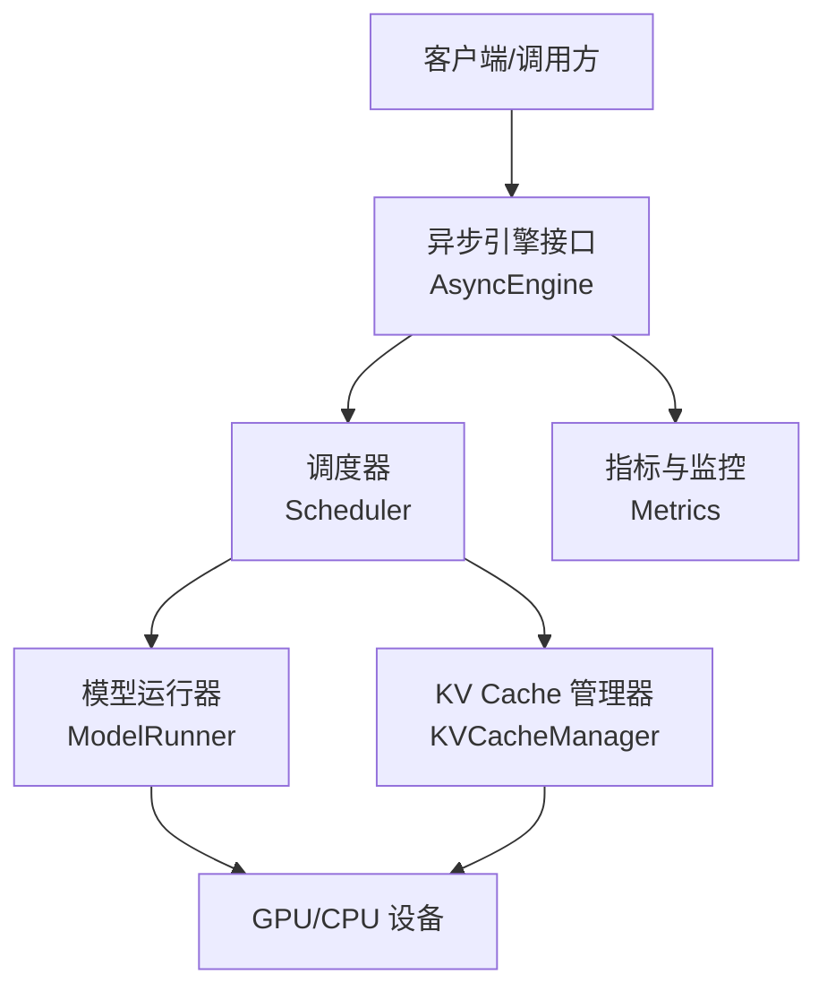
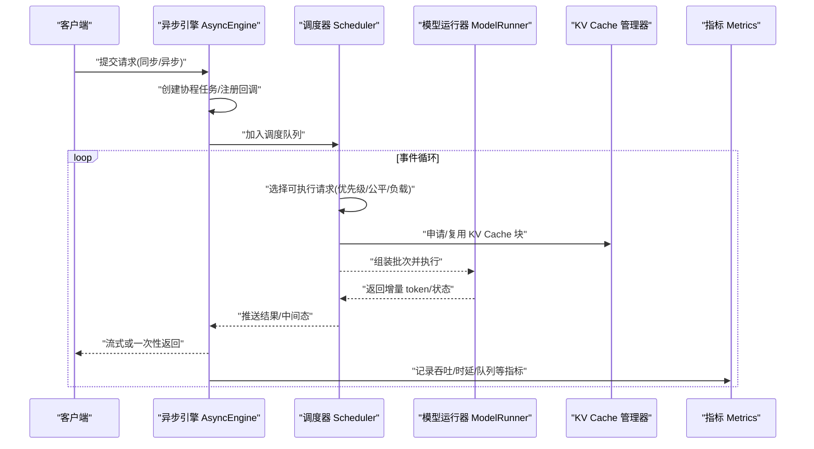
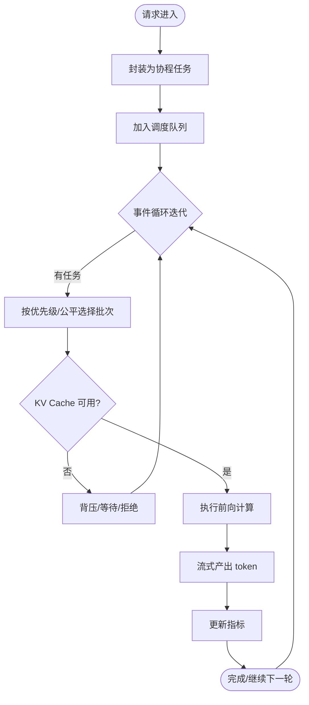
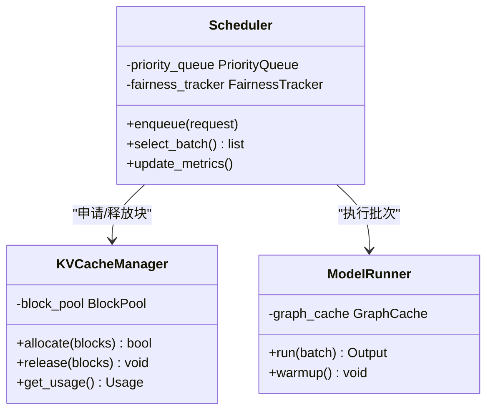
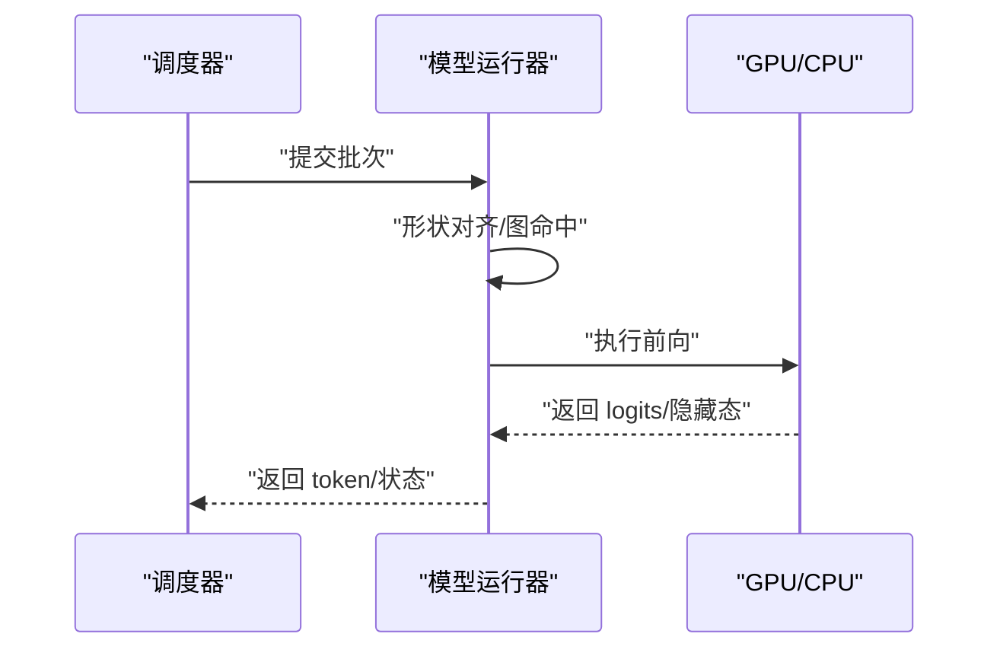
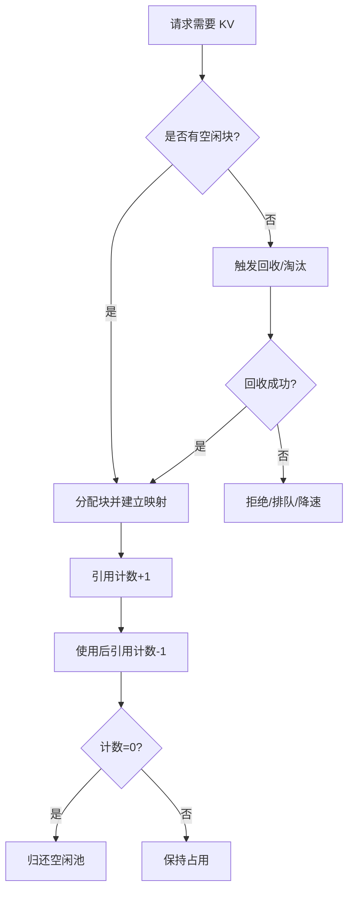
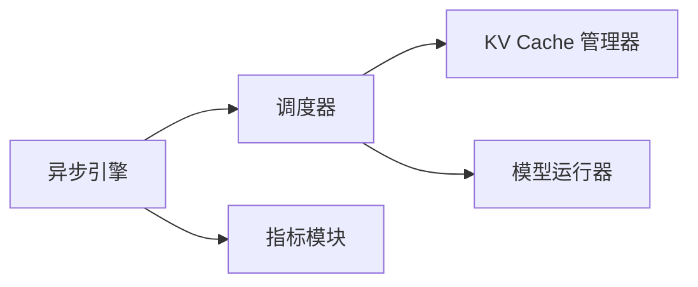

# 高并发请求处理

<cite>
**本文引用的文件**   
- [vllm/engine/async_engine.py](file://vllm/engine/async_engine.py)
- [vllm/engine/core.py](file://vllm/engine/core.py)
- [vllm/engine/scheduler.py](file://vllm/engine/scheduler.py)
- [vllm/engine/metrics.py](file://vllm/engine/metrics.py)
- [vllm/config/engine_config.py](file://vllm/config/engine_config.py)
- [vllm/model_executor/model_runner.py](file://vllm/model_executor/model_runner.py)
- [vllm/model_executor/kv_cache_manager.py](file://vllm/model_executor/kv_cache_manager.py)
- [vllm/utils/async_generator.py](file://vllm/utils/async_generator.py)
- [benchmarks/benchmark_serving.py](file://benchmarks/benchmark_serving.py)
- [examples/deployment/async_llm_streaming.py](file://examples/deployment/async_llm_streaming.py)
</cite>

## 目录
1. [简介](#简介)
2. [项目结构](#项目结构)
3. [核心组件](#核心组件)
4. [架构总览](#架构总览)
5. [详细组件分析](#详细组件分析)
6. [依赖关系分析](#依赖关系分析)
7. [性能考量与调优](#性能考量与调优)
8. [故障排查指南](#故障排查指南)
9. [结论](#结论)
10. [附录：并发配置参数详解](#附录并发配置参数详解)

## 简介
本技术文档聚焦 vLLM 的高并发请求处理系统，围绕异步引擎架构、协程处理、事件循环与任务调度机制展开，深入解析动态批处理策略（请求合并、资源池管理）、调度算法（优先级队列、公平调度、负载均衡）、内存管理与资源隔离（多租户稳定性），并提供并发配置参数详解、性能调优指南与常见问题排查方法。读者无需深厚的底层背景即可理解并落地优化。

## 项目结构
vLLM 的异步推理服务由“引擎层 + 调度层 + 执行层”构成：
- 引擎层：对外暴露异步接口，负责请求接入、生命周期管理、结果回传与指标上报。
- 调度层：维护就绪队列、选择可执行的请求集合、协调 KV Cache 与计算资源。
- 执行层：模型运行器与 KV Cache 管理器，负责实际的前向计算与显存分配。

图表来源 
- [vllm/engine/async_engine.py](file://vllm/engine/async_engine.py)
- [vllm/engine/scheduler.py](file://vllm/engine/scheduler.py)
- [vllm/model_executor/model_runner.py](file://vllm/model_executor/model_runner.py)
- [vllm/model_executor/kv_cache_manager.py](file://vllm/model_executor/kv_cache_manager.py)
- [vllm/engine/metrics.py](file://vllm/engine/metrics.py)

章节来源
- [vllm/engine/async_engine.py](file://vllm/engine/async_engine.py)
- [vllm/engine/core.py](file://vllm/engine/core.py)
- [vllm/engine/scheduler.py](file://vllm/engine/scheduler.py)
- [vllm/model_executor/model_runner.py](file://vllm/model_executor/model_runner.py)
- [vllm/model_executor/kv_cache_manager.py](file://vllm/model_executor/kv_cache_manager.py)
- [vllm/engine/metrics.py](file://vllm/engine/metrics.py)

## 核心组件
- 异步引擎（AsyncEngine）
  - 职责：接收请求、创建协程任务、编排事件循环、聚合流式输出、统计指标。
  - 关键点：非阻塞 I/O、任务取消与超时控制、背压与限流。
- 调度器（Scheduler）
  - 职责：维护待执行队列、选择批次、协调 KV Cache 空间、触发执行。
  - 关键点：优先级队列、公平性约束、负载感知与均衡。
- 模型运行器（ModelRunner）
  - 职责：封装前向计算、图编译/缓存、算子融合、CUDA Graph 等加速。
  - 关键点：批内形状对齐、算子调度、错误恢复。
- KV Cache 管理器（KVCacheManager）
  - 职责：块级分配与回收、跨请求共享、预取与淘汰策略。
  - 关键点：分页式内存、引用计数、碎片整理。
- 指标与监控（Metrics）
  - 职责：吞吐、时延、队列长度、显存占用、失败率等。
  - 关键点：低开销采集、采样与聚合、外部导出。

章节来源
- [vllm/engine/async_engine.py](file://vllm/engine/async_engine.py)
- [vllm/engine/scheduler.py](file://vllm/engine/scheduler.py)
- [vllm/model_executor/model_runner.py](file://vllm/model_executor/model_runner.py)
- [vllm/model_executor/kv_cache_manager.py](file://vllm/model_executor/kv_cache_manager.py)
- [vllm/engine/metrics.py](file://vllm/engine/metrics.py)

## 架构总览
下图展示了从请求入站到响应输出的完整流程，包括协程化、调度、批处理与执行。

图表来源 
- [vllm/engine/async_engine.py](file://vllm/engine/async_engine.py)
- [vllm/engine/scheduler.py](file://vllm/engine/scheduler.py)
- [vllm/model_executor/model_runner.py](file://vllm/model_executor/model_runner.py)
- [vllm/model_executor/kv_cache_manager.py](file://vllm/model_executor/kv_cache_manager.py)
- [vllm/engine/metrics.py](file://vllm/engine/metrics.py)

## 详细组件分析

### 异步引擎与事件循环
- 协程处理
  - 每个请求被包装为协程任务，支持取消、超时与重试。
  - 通过事件循环驱动任务推进，避免线程切换开销。
- 任务调度
  - 引擎将新请求投递到调度器的优先级队列；在每轮事件循环中拉取可执行集合。
- 背压与限流
  - 当队列长度超过阈值或显存不足时，拒绝或延迟新请求，保障稳定性。
- 流式输出
  - 使用异步生成器逐步产出 token，降低首字延迟。

图表来源 
- [vllm/engine/async_engine.py](file://vllm/engine/async_engine.py)
- [vllm/engine/scheduler.py](file://vllm/engine/scheduler.py)
- [vllm/utils/async_generator.py](file://vllm/utils/async_generator.py)

章节来源
- [vllm/engine/async_engine.py](file://vllm/engine/async_engine.py)
- [vllm/utils/async_generator.py](file://vllm/utils/async_generator.py)

### 调度器与批处理策略
- 优先级队列
  - 基于请求到达时间、截止时间、权重等维度排序，保证 SLA 与公平性。
- 动态批处理
  - 根据当前队列长度、显存水位与模型特性动态调整批大小，最大化吞吐。
- 请求合并
  - 对相同前缀或可共享上下文的请求进行合并，减少重复计算。
- 资源池管理
  - 将 KV Cache 块作为资源池对象，按需分配与回收，避免碎片。

图表来源 
- [vllm/engine/scheduler.py](file://vllm/engine/scheduler.py)
- [vllm/model_executor/kv_cache_manager.py](file://vllm/model_executor/kv_cache_manager.py)
- [vllm/model_executor/model_runner.py](file://vllm/model_executor/model_runner.py)

章节来源
- [vllm/engine/scheduler.py](file://vllm/engine/scheduler.py)
- [vllm/model_executor/kv_cache_manager.py](file://vllm/model_executor/kv_cache_manager.py)
- [vllm/model_executor/model_runner.py](file://vllm/model_executor/model_runner.py)

### 模型运行器与执行路径
- 批内形状对齐
  - 将不同长度的输入对齐到统一步长，提升算子效率。
- 图编译与缓存
  - 对热点路径进行图编译，命中缓存后显著降低启动时延。
- 错误恢复
  - 捕获 OOM、算子异常，自动降级或重试，保障服务可用性。

图表来源 
- [vllm/model_executor/model_runner.py](file://vllm/model_executor/model_runner.py)

章节来源
- [vllm/model_executor/model_runner.py](file://vllm/model_executor/model_runner.py)

### 内存管理与资源隔离
- 分页式 KV Cache
  - 以固定大小的块为单位分配，支持跨请求共享与复用。
- 引用计数与回收
  - 每个块维护引用计数，零引用即回收至空闲池。
- 多租户隔离
  - 按租户/项目维度限制配额，防止单租户独占资源。
- 预取与淘汰
  - 基于访问热度预测预取块，LRU/LFU 策略淘汰冷数据。

图表来源 
- [vllm/model_executor/kv_cache_manager.py](file://vllm/model_executor/kv_cache_manager.py)

章节来源
- [vllm/model_executor/kv_cache_manager.py](file://vllm/model_executor/kv_cache_manager.py)

## 依赖关系分析
- 组件耦合
  - 异步引擎依赖调度器与指标模块；调度器依赖 KV Cache 管理器与模型运行器。
- 外部依赖
  - CUDA/GPU 驱动、PyTorch/Tensor 运行时、通信库（如 NCCL）。
- 潜在环路
  - 通过接口解耦避免循环依赖；调度器不直接持有运行器实例，而是通过函数指针/回调。

图表来源 
- [vllm/engine/async_engine.py](file://vllm/engine/async_engine.py)
- [vllm/engine/scheduler.py](file://vllm/engine/scheduler.py)
- [vllm/model_executor/model_runner.py](file://vllm/model_executor/model_runner.py)
- [vllm/model_executor/kv_cache_manager.py](file://vllm/model_executor/kv_cache_manager.py)
- [vllm/engine/metrics.py](file://vllm/engine/metrics.py)

章节来源
- [vllm/engine/core.py](file://vllm/engine/core.py)
- [vllm/engine/async_engine.py](file://vllm/engine/async_engine.py)

## 性能考量与调优
- 批大小与队列长度
  - 增大批大小提升吞吐但增加时延；建议结合 P95/P99 时延目标与队列长度曲线联合调参。
- 动态批处理阈值
  - 设置最小/最大批大小与增长步长，避免抖动；在高负载下优先保证公平性。
- 图编译与预热
  - 启用热点路径图编译，并在启动阶段预热常用形状，降低冷启动时延。
- KV Cache 命中率
  - 提高前缀共享与上下文复用比例，减少重复计算与显存压力。
- 背压与限流
  - 在队列过长或显存紧张时主动限流，避免雪崩；配合指标告警快速定位瓶颈。
- 监控与观测
  - 关注吞吐、时延分位、队列长度、显存占用、失败率等关键指标，形成闭环优化。

[本节为通用指导，不直接分析具体文件]

## 故障排查指南
- 症状：吞吐下降、时延升高
  - 检查队列长度是否持续增长、批大小是否过小、KV Cache 命中率是否偏低。
- 症状：OOM 或频繁回收
  - 查看显存水位、块分配失败次数、是否存在大请求未拆分；适当降低批大小或开启更激进的淘汰策略。
- 症状：请求超时或丢失
  - 核对超时配置、任务取消逻辑、事件循环是否阻塞；确认背压与限流阈值是否过严。
- 症状：不公平或饥饿
  - 检查优先级权重与公平性计数器，确保短请求不被长期压制。
- 工具与手段
  - 使用基准脚本与示例程序复现实验场景；结合指标面板定位热点路径。

章节来源
- [benchmarks/benchmark_serving.py](file://benchmarks/benchmark_serving.py)
- [examples/deployment/async_llm_streaming.py](file://examples/deployment/async_llm_streaming.py)

## 结论
vLLM 的高并发请求处理系统通过异步引擎、调度器、模型运行器与 KV Cache 管理器的协同工作，实现了高效、稳定、可扩展的推理服务。合理配置批处理与调度策略、精细化内存管理以及完善的监控与排障手段，是达成高吞吐与低时延的关键。

[本节为总结性内容，不直接分析具体文件]

## 附录：并发配置参数详解
以下为常见并发相关参数的说明与建议（以引擎配置为中心）：
- 最大并发数（max_concurrent_requests）
  - 定义同时处理的请求上限，影响队列长度与时延；建议结合硬件资源与 SLA 设定。
- 批大小（batch_size / min_batch_size / max_batch_size）
  - 控制每次执行请求数量；动态批处理可在范围内自适应调整。
- 超时设置（request_timeout / stream_interval）
  - 请求级超时与流式间隔，平衡实时性与资源占用。
- 队列长度阈值（queue_length_threshold）
  - 超过阈值触发背压或拒绝，保护系统稳定性。
- 公平性与优先级（fairness_window / priority_weights）
  - 控制短/长请求比例与优先级权重，避免饥饿。
- 显存与水标记（kv_cache_watermark / eviction_policy）
  - 显存水位触发回收策略，LRU/LFU 等淘汰算法选择。
- 图编译与预热（enable_graph_caching / warmup_shapes）
  - 启用图缓存与预热，降低冷启动与首次执行时延。

章节来源
- [vllm/config/engine_config.py](file://vllm/config/engine_config.py)
- [vllm/engine/metrics.py](file://vllm/engine/metrics.py)