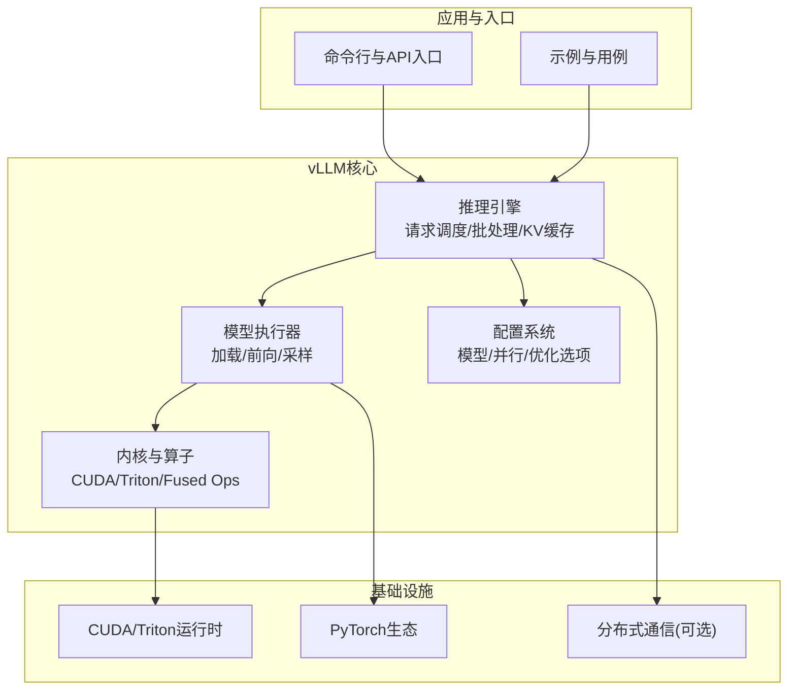
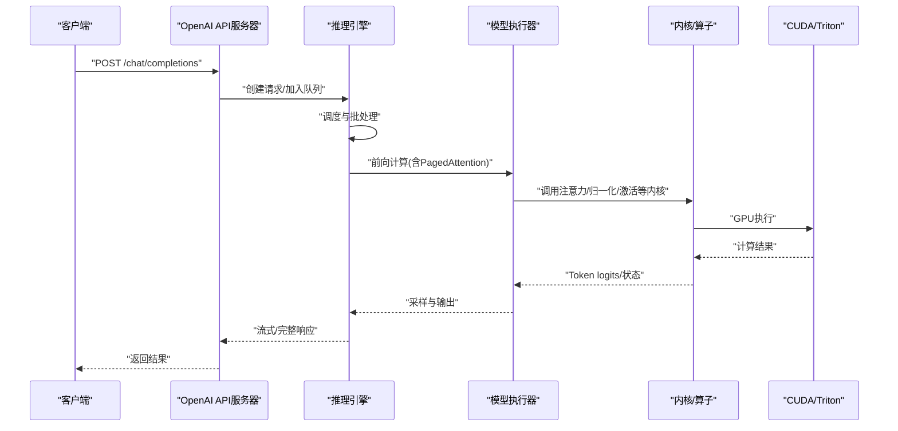
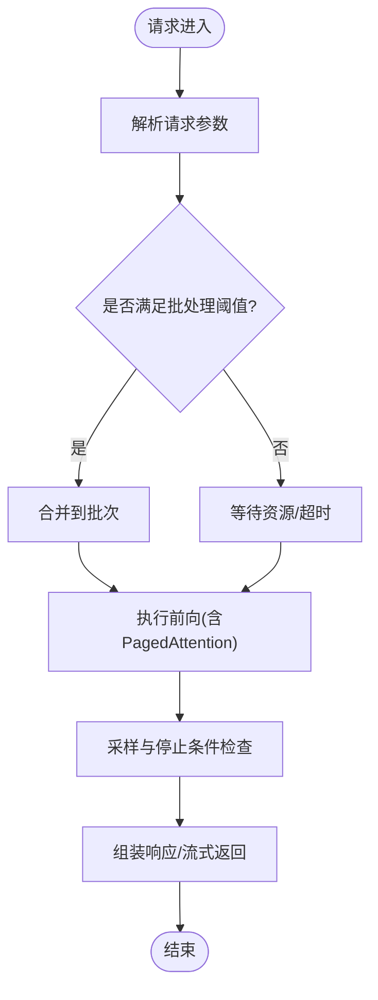
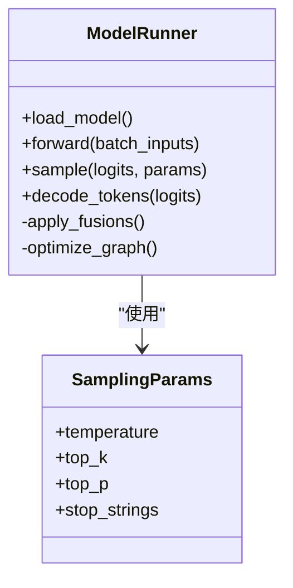
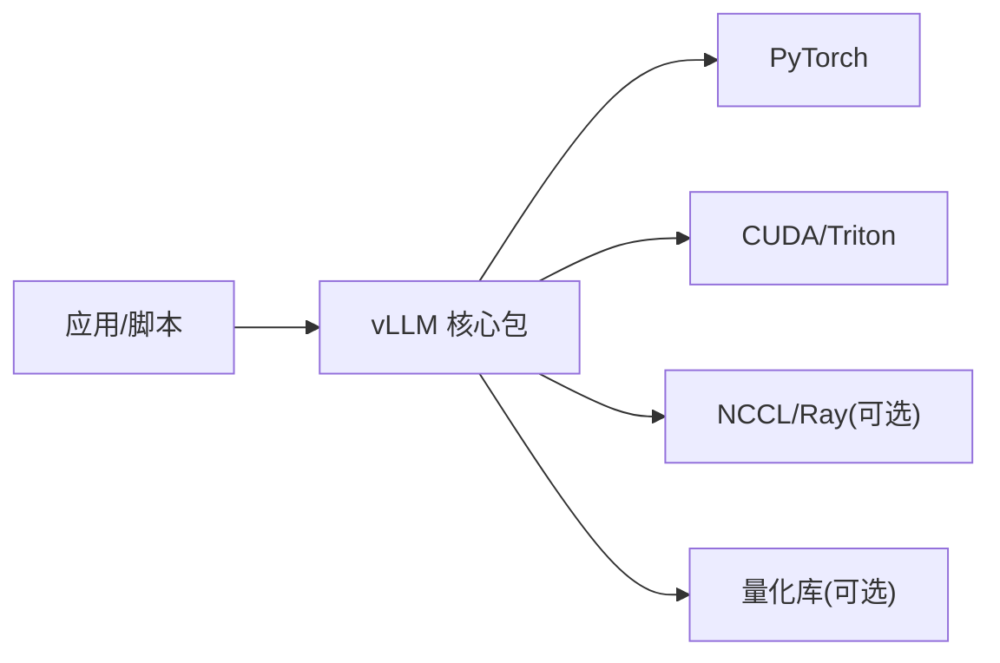

# 项目概述

<cite>
**本文引用的文件**   
- [README.md](file://README.md)
- [pyproject.toml](file://pyproject.toml)
- [setup.py](file://setup.py)
- [vllm/__init__.py](file://vllm/__init__.py)
- [vllm/engine/llm_engine.py](file://vllm/engine/llm_engine.py)
- [vllm/model_executor/model_runner.py](file://vllm/model_executor/model_runner.py)
- [vllm/config.py](file://vllm/config.py)
- [vllm/sampling_params.py](file://vllm/sampling_params.py)
- [vllm/entrypoints/openai/api_server.py](file://vllm/entrypoints/openai/api_server.py)
- [benchmarks/benchmark_serving.py](file://benchmarks/benchmark_serving.py)
- [benchmarks/benchmark_throughput.py](file://benchmarks/benchmark_throughput.py)
- [docs/design/paged_attention.md](file://docs/design/paged_attention.md)
- [docs/design/arch_overview.md](file://docs/design/arch_overview.md)
- [docs/getting_started/quickstart.md](file://docs/getting_started/quickstart.md)
- [requirements/cuda.txt](file://requirements/cuda.txt)
- [docker/Dockerfile](file://docker/Dockerfile)
</cite>

## 目录
1. [简介](#简介)
2. [项目结构](#项目结构)
3. [核心组件](#核心组件)
4. [架构总览](#架构总览)
5. [详细组件分析](#详细组件分析)
6. [依赖关系分析](#依赖关系分析)
7. [性能考量](#性能考量)
8. [故障排查指南](#故障排查指南)
9. [结论](#结论)
10. [附录](#附录)

## 简介
vLLM 是一个面向大语言模型（LLM）的高性能推理框架，核心价值在于以极低的延迟与极高的吞吐提供在线与离线推理服务。其技术特点包括：
- PagedAttention 内存优化：将 KV Cache 分页管理，显著降低显存碎片并提升并发容量。
- 高并发处理能力：通过请求批处理、调度器与内核融合等手段提高 GPU 利用率。
- 多模型支持：广泛兼容主流开源模型家族，并提供插件化扩展机制。
- 丰富的部署形态：支持单机、多机、容器化与云原生编排，覆盖在线服务、批量处理与边缘场景。

适用场景：
- 在线推理服务：低延迟 API 服务，适合对话、工具调用、流式生成等。
- 批量处理：离线推理、评测、数据标注与大规模文本生成。
- 边缘部署：在受限资源环境下高效运行量化或轻量模型。

技术栈：
- Python 作为主要开发语言与用户接口层。
- CUDA/Triton 实现高性能算子与注意力内核。
- PyTorch 生态集成，便于模型加载与计算图优化。
- 可选的分布式通信库（如 NCCL/Ray）用于多卡/多节点扩展。

本概述为初学者提供概念性介绍，同时为有经验的开发者提供足够的技术深度与参考路径。

## 项目结构
vLLM 采用分层模块化设计，核心引擎位于 vllm 包内，入口点、示例、基准测试与文档分布在顶层目录中。关键目录职责概览：
- vllm：核心代码，包含引擎、模型执行器、配置、采样参数、分发、编译、算子等。
- entrypoints：命令行与服务端入口，如 OpenAI 兼容 API 服务器。
- benchmarks：性能基准套件，涵盖延迟、吞吐、前缀缓存、结构化输出等。
- docs：设计与使用文档，包括架构、PagedAttention、部署与特性说明。
- docker：容器镜像构建脚本，支持多种硬件后端。
- requirements：依赖清单，区分 CPU/CUDA/ROCm/XPU 等环境。

图表来源
- [vllm/engine/llm_engine.py:1-200](file://vllm/engine/llm_engine.py#L1-L200)
- [vllm/model_executor/model_runner.py:1-200](file://vllm/model_executor/model_runner.py#L1-L200)
- [vllm/config.py:1-200](file://vllm/config.py#L1-L200)
- [vllm/entrypoints/openai/api_server.py:1-200](file://vllm/entrypoints/openai/api_server.py#L1-L200)

章节来源
- [README.md:1-200](file://README.md#L1-L200)
- [pyproject.toml:1-200](file://pyproject.toml#L1-L200)
- [setup.py:1-200](file://setup.py#L1-L200)

## 核心组件
- 推理引擎（Engine）：负责请求接收、调度、批处理、KV Cache 管理与生命周期控制。
- 模型执行器（Model Runner）：封装模型加载、前向传播、采样与输出后处理。
- 配置系统（Config）：集中管理模型、并行策略、内存与优化开关。
- 采样参数（Sampling Params）：定义温度、Top-K/Top-P、停止条件等采样行为。
- 内核与算子（Kernels）：基于 CUDA/Triton 的高效注意力、归一化、激活与 MoE 路由等。
- 入口与API（Entrypoints）：提供 OpenAI 兼容接口、CLI 工具与流式响应能力。

章节来源
- [vllm/engine/llm_engine.py:1-200](file://vllm/engine/llm_engine.py#L1-L200)
- [vllm/model_executor/model_runner.py:1-200](file://vllm/model_executor/model_runner.py#L1-L200)
- [vllm/config.py:1-200](file://vllm/config.py#L1-L200)
- [vllm/sampling_params.py:1-200](file://vllm/sampling_params.py#L1-L200)

## 架构总览
vLLM 的整体架构围绕“请求驱动”的流水线展开：客户端通过 API/CLI 提交请求，引擎进行解析与调度，模型执行器完成前向计算与采样，最终返回结果。PagedAttention 贯穿 KV Cache 管理，确保高并发下的显存效率。

图表来源
- [vllm/entrypoints/openai/api_server.py:1-200](file://vllm/entrypoints/openai/api_server.py#L1-L200)
- [vllm/engine/llm_engine.py:1-200](file://vllm/engine/llm_engine.py#L1-L200)
- [vllm/model_executor/model_runner.py:1-200](file://vllm/model_executor/model_runner.py#L1-L200)

章节来源
- [docs/design/arch_overview.md:1-200](file://docs/design/arch_overview.md#L1-L200)
- [docs/design/paged_attention.md:1-200](file://docs/design/paged_attention.md#L1-L200)

## 详细组件分析

### 推理引擎（Engine）
- 职责：请求生命周期管理、动态批处理、KV Cache 分页、调度策略与监控指标。
- 关键点：
  - 动态批处理：根据可用显存与延迟目标合并请求，最大化吞吐。
  - KV Cache 管理：基于 PagedAttention 的分页分配与复用，减少碎片。
  - 调度策略：支持优先级、公平性与抢占等策略，适配不同 SLA。
  - 可观测性：内置指标与日志，便于性能分析与问题定位。

图表来源
- [vllm/engine/llm_engine.py:1-200](file://vllm/engine/llm_engine.py#L1-L200)

章节来源
- [vllm/engine/llm_engine.py:1-200](file://vllm/engine/llm_engine.py#L1-L200)

### 模型执行器（Model Runner）
- 职责：模型权重加载、前向计算、采样与输出后处理。
- 关键点：
  - 模型加载：支持 HuggingFace 格式与 vLLM 内部权重布局。
  - 前向优化：融合算子、CUDA Graph、编译优化（可选）。
  - 采样：Top-K/Top-P、重复惩罚、温度调节、停止字符串。
  - 输出：logits 转 token、解码、结构化输出支持。

图表来源
- [vllm/model_executor/model_runner.py:1-200](file://vllm/model_executor/model_runner.py#L1-L200)
- [vllm/sampling_params.py:1-200](file://vllm/sampling_params.py#L1-L200)

章节来源
- [vllm/model_executor/model_runner.py:1-200](file://vllm/model_executor/model_runner.py#L1-L200)
- [vllm/sampling_params.py:1-200](file://vllm/sampling_params.py#L1-L200)

### 配置系统（Config）
- 职责：统一配置模型、并行、内存、优化与后端选择。
- 关键点：
  - 模型配置：架构、上下文长度、量化选项。
  - 并行策略：张量并行、流水线并行、专家并行（MoE）。
  - 内存优化：KV Cache 大小、Offload、预取策略。
  - 后端选择：CUDA/ROCm/XPU 等硬件后端。

章节来源
- [vllm/config.py:1-200](file://vllm/config.py#L1-L200)

### 入口与API（Entrypoints）
- 职责：提供 OpenAI 兼容 API、CLI 工具、流式响应与鉴权。
- 关键点：
  - OpenAI 兼容：/chat/completions、/completions、/embeddings 等。
  - 流式输出：SSE 或 chunked 传输，降低首字延迟。
  - 安全与限流：鉴权、速率限制、审计日志。

章节来源
- [vllm/entrypoints/openai/api_server.py:1-200](file://vllm/entrypoints/openai/api_server.py#L1-L200)

## 依赖关系分析
vLLM 依赖 Python 生态与底层加速库，构建与运行需明确环境与硬件匹配。

图表来源
- [pyproject.toml:1-200](file://pyproject.toml#L1-L200)
- [requirements/cuda.txt:1-200](file://requirements/cuda.txt#L1-L200)

章节来源
- [pyproject.toml:1-200](file://pyproject.toml#L1-L200)
- [requirements/cuda.txt:1-200](file://requirements/cuda.txt#L1-L200)

## 性能考量
- PagedAttention：通过分页管理 KV Cache，减少显存碎片，提升并发与吞吐。
- 内核融合：将多个算子融合为单一 CUDA/Triton 内核，减少内存访问与同步开销。
- 动态批处理：根据负载与资源动态调整批次大小，平衡延迟与吞吐。
- 编译优化：可选的 CUDA Graph 与 torch.compile 加速前向路径。
- 量化与稀疏：支持 FP8/INT4 等量化方案，降低显存与带宽压力。

章节来源
- [docs/design/paged_attention.md:1-200](file://docs/design/paged_attention.md#L1-L200)
- [benchmarks/benchmark_serving.py:1-200](file://benchmarks/benchmark_serving.py#L1-L200)
- [benchmarks/benchmark_throughput.py:1-200](file://benchmarks/benchmark_throughput.py#L1-L200)

## 故障排查指南
常见问题与定位思路：
- 显存不足：检查 KV Cache 大小、批次大小、模型精度与量化设置。
- 启动失败：确认 CUDA/Triton 版本与驱动匹配，检查环境变量与依赖。
- 性能不达标：启用 profiling，分析内核耗时与内存带宽瓶颈。
- 分布式异常：检查 NCCL/Ray 网络与权限，验证节点间通信。

章节来源
- [docs/getting_started/quickstart.md:1-200](file://docs/getting_started/quickstart.md#L1-L200)
- [docker/Dockerfile:1-200](file://docker/Dockerfile#L1-L200)

## 结论
vLLM 凭借 PagedAttention、内核融合与动态批处理等技术，在 LLM 推理领域提供了高吞吐、低延迟与易用的解决方案。其模块化架构与丰富生态使其适用于在线服务、批量处理与边缘部署等多种场景。对于初学者，建议从快速开始与示例入手；对于高级用户，可深入内核优化与分布式扩展以获得极致性能。

## 附录
- 快速开始：参考入门文档与示例脚本，快速搭建推理服务。
- 部署指南：容器化与 Kubernetes 部署最佳实践。
- 性能基准：使用内置基准套件评估吞吐与延迟。
- 模型支持：查看支持的模型列表与兼容性矩阵。

章节来源
- [docs/getting_started/quickstart.md:1-200](file://docs/getting_started/quickstart.md#L1-L200)
- [README.md:1-200](file://README.md#L1-L200)